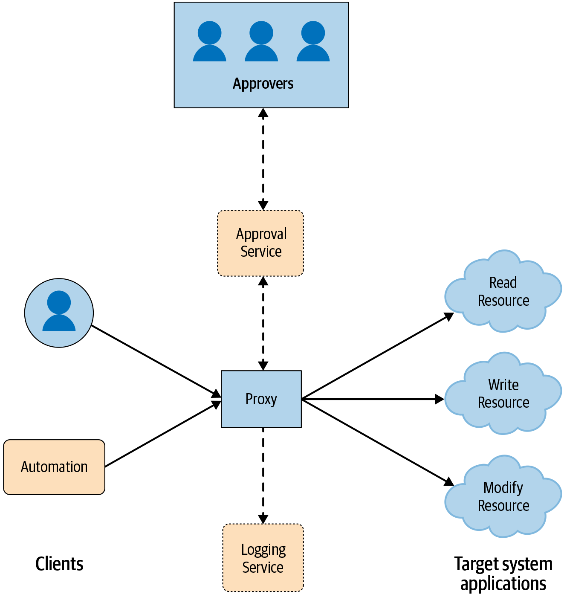
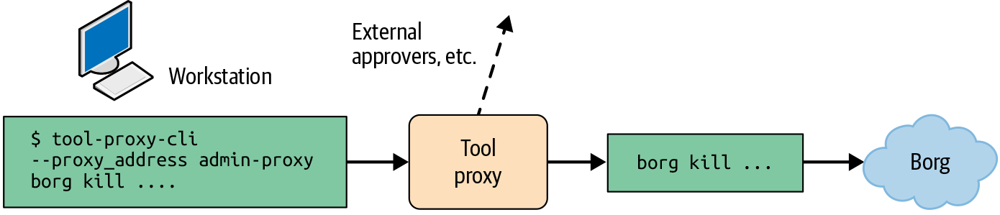

# Case Study: Safe Proxies

By Jakub Warmuz and Ana Oprea

with Thomas Maufer, Susanne Landers, Roxana Loza, Paul Blankinship, and Betsy Beyer

> Imagine that an adversary wants to deliberately disrupt your systems. Or perhaps a well-intentioned engineer with a privileged account makes a far-reaching change by mistake. Since you understand your systems well, and they’re designed for least privilege and recovery, the impact to your environment is limited. When investigating and performing incident response, you can identify the root cause of the issues and take appropriate action.
>
> Does this scenario seem representative of your organization? It’s possible that not all your systems fit this picture, and that you need a way to make a running system safer and less prone to outages. Safe proxies are one method to do just that.

## Safe Proxies in Production Environments

In general, proxies provide a way to address new reliability and security requirements without requiring substantial changes to deployed systems. Rather than modifying an existing system, you can simply use a proxy to route connections that would have otherwise gone directly to the system. The proxy can also include controls to meet your new security and reliability requirements. In this case study, we examine a set of *safe proxies* we use at Google to limit the ability of privileged administrators to accidentally or maliciously cause issues in our production environment.

Safe proxies are a framework that allows authorized persons to access or modify the state of physical servers, virtual machines, or particular applications. At Google, we use safe proxies to review, approve, and run risky commands without establishing an SSH connection to systems. Using these proxies, we can grant fine-grained access to debug issues or can rate limit machine restarts. Safe proxies represent a single entry point between networks and are key instruments that enable us to do the following:

- Audit every operation in the fleet

- Control access to resources

- Protect production from human mistakes at scale

[Zero Touch Prod](https://www.usenix.org/conference/srecon19emea/presentation/czapinski) is a project at Google that requires every change in production to be made by automation (instead of humans), prevalidated by software, or triggered through an audited breakglass mechanism.[^1] Safe proxies are among the set of tools we use to achieve these principles. We estimate that ~13% of all Google-evaluated outages could have been prevented or mitigated with Zero Touch Prod.

In the safe proxy model, displayed in [Figure 3-1](#safe_proxy), instead of talking to the target system directly, clients talk to the proxy. At Google, we enforce this behavior by restricting the target system to accept only calls from the proxy through a configuration. This configuration specifies which application-layer remote procedure calls (RPCs) can be executed by which client roles through access control lists (ACLs). After checking the access permissions, the proxy sends the request to be executed via the RPC to the target systems. Typically, each target system has an application-layer program that receives the request and executes it directly on the system. The proxy logs all requests and commands issued by the systems it interacts with.

We’ve found multiple benefits to using proxies to manage systems, whether the client is a human, automation, or both. Proxies provide the following:

- A central point to enforce multi-party authorization (MPA),[^2] where we make the access decisions for requests that interact with sensitive data

- Administrative usage auditing, where we can track when a given request was performed and by whom

- Rate limiting, where changes like a system restart take effect gradually, and we can potentially restrict the blast radius of a mistake

- Compatibility with closed-source third-party target systems, where we control the behavior of components (that we cannot modify) through additional functionality in the proxy

- Continuous improvement integration, where we add security and reliability enhancements to the central proxy point



*Figure 3-1: Safe proxy model*

Proxies also have some downsides and potential pitfalls:

- Increased cost, in terms of maintenance and operational overhead.

- A single point of failure, if either the system itself or one of its dependencies is unavailable. We mitigate this situation by running multiple instances to increase redundancy. We make sure that all of our system’s dependencies have an acceptable service level agreement (SLA), and that the team operating each of the dependencies has a documented emergency contact.

- A policy configuration for access control, which can be a source of errors itself. We guide users to make the right choices by providing templates or automatically generating settings that are secure by default. When creating such templates or automation, we follow the design strategies presented throughout [Part II](part2.html#designing_systems).

- A central machine that an adversary could take control of. The aforementioned policy configuration requires the system to forward the identity of the client and executes any actions on behalf of the client. The proxy itself doesn’t give high privileges because no request is executed under a proxy role.

- Resistance to change, as users may wish to connect directly to production systems. To reduce friction imposed by the proxy, we work closely with engineers to make sure they can access the systems through a breakglass mechanism during emergencies. We discuss such topics in more detail in [Chapter 21](ch21.html#twoone_building_a_culture_of_security_a).

Since the main use case for the safe proxy is to add security and reliability capabilities related to access control, the interfaces exposed by the proxy should use the same external APIs as the target system. As a result, the proxy doesn’t affect the overall user experience. Assuming the safe proxy is transparent, it can simply forward traffic after performing some pre- and postprocessing for validation and logging. The next section discusses one specific instantiation of a safe proxy that we use at Google.

## Google Tool Proxy

Googlers perform the majority of administrative operations using [command-line interface (CLI)](https://en.wikipedia.org/wiki/Command-line_interface) tools. Some of these tools are potentially dangerous—for example, certain tools can turn off a server. If such a tool specifies an incorrect scope selector, a command-line invocation can accidentally stop several service frontends, resulting in an outage. It would be difficult and expensive to track every CLI tool, ensure that it performs centralized logging, and make certain that sensitive actions have further protections. To address this issue, Google created a *Tool Proxy*: a binary that exposes a generic RPC method that internally executes the specified command line through a fork and exec. All invocations are controlled through a policy, logged for auditing, and have the ability to require MPA.

Using the Tool Proxy achieves one of the main goals of Zero Touch Prod: making production safer by not allowing humans to directly access production. Engineers are not able to run arbitrary commands directly on servers; they need to contact the Tool Proxy instead.

We configure who is allowed to take which actions by using a fine-grained set of policies that carry out the authorization for the RPC method. The policy in [example_three_onedot_google_tool_proxy](#example_three_onedot_google_tool_proxy) allows a member of `group:admin` to run the latest version of the `borg` CLI with any parameter after someone from `group:admin-leads` approves the command. The Tool Proxy instances are [typically deployed as Borg jobs](https://landing.google.com/sre/sre-book/chapters/production-environment/).

##### Google Tool Proxy Borg policy

```
config = {
  proxy_role = 'admin-proxy'
  tools = {
    borg = {
      mpm = 'client@live'
      binary_in_mpm = 'borg'
      any_command = true
      allow = ['group:admin']
      require_mpa_approval_from = ['group:admin-leads']
      unit_tests = [{
        expected = 'ALLOW'
        command = 'file.borgcfg up'
      }]
    }
  }
}
```

The policy in [example_three_onedot_google_tool_proxy](#example_three_onedot_google_tool_proxy) allows an engineer to run a command to stop a Borg job in production from their workstation by using a command like the following:

```
$ tool-proxy-cli --proxy_address admin-proxy borg kill ...
```

This command sends an RPC to the proxy at the specified address, which initiates the following chain of events, as shown in [Figure 3-2](#tool_proxy_usage_workflow):

1.  The proxy logs all RPCs and checks performed, providing an easy way to audit previously run administrative actions.

2.  The proxy checks the policy to ensure the caller is in `group:admin`.

3.  Since this is a sensitive command, MPA is triggered and the proxy waits for an authorization from a person in `group:admin-leads`.

4.  If granted approval, the proxy executes the command, waits for the result, and attaches the return code, stdout, and stderr to the RPC response.



*Figure 3-2: Tool Proxy usage workflow*

The Tool Proxy requires a small change to the development workflow: engineers need to prepend their commands with `tool-proxy-cli --proxy_address`. To ensure privileged users don’t circumvent the proxy, we modified the server to allow only administrative actions to `admin-proxy` and to deny any direct connections outside of breakglass situations.

## Conclusion

Using safe proxies is one way to add logging and multi-party authorization to a system. Proxies can thus help make your systems more secure and more reliable. This approach can be a cost-effective option for an existing system, but will be much more resilient if paired with other design principles described in [Part II](part2.html#designing_systems). As we discuss in [Chapter 4](ch04.html#design_tradeoffs), if you’re starting a new project, you should ideally build your system architecture using frameworks that integrate with logging and access control modules.
