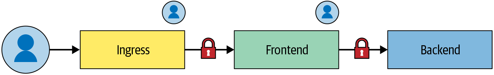
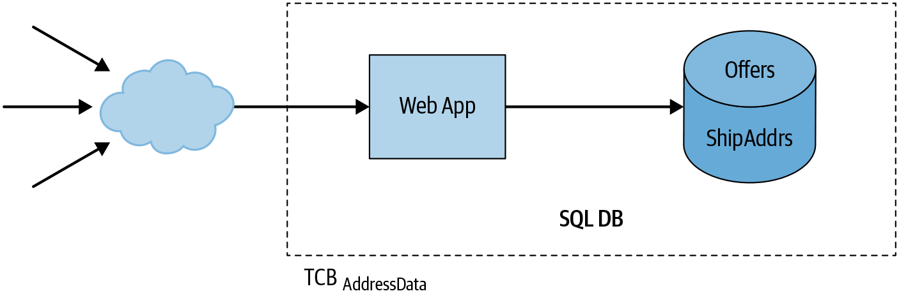
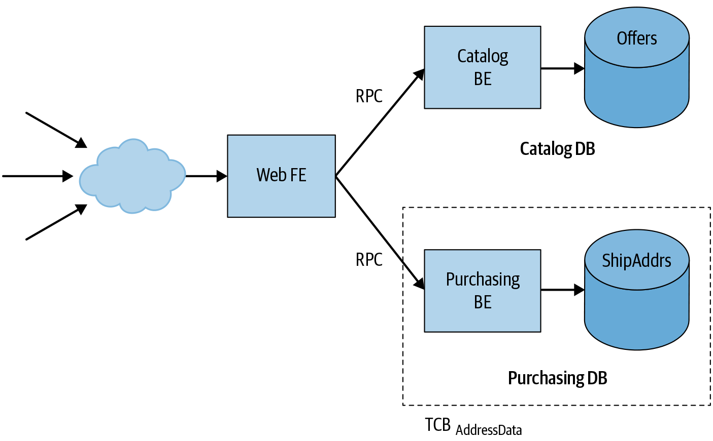
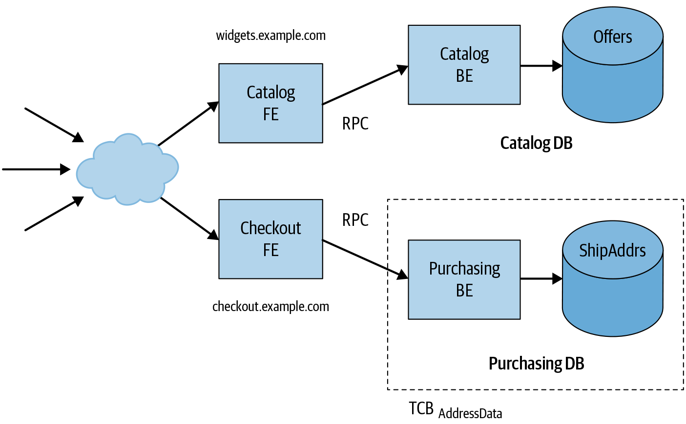

# Design for Understandability

By Julien Boeuf‎, Christoph Kern‎, and John Reese‎

with Guy Fischman, Paul Blankinship, Aleksandra Culver, Sergey Simakov, Peter Valchev, and Douglas Colish

> In order to have confidence in your system’s security posture and its ability to reach its service level objectives (SLOs), you need to manage the system’s complexity: you must be able to meaningfully reason about and understand the system, its components, and their interactions. The degree to which a system is understandable can vary drastically across different properties. For example, it may be easy to understand a system’s behavior under high loads, but difficult to understand the system’s behavior when it encounters specially crafted (malicious) inputs.
>
> This chapter discusses system understandability as it pertains to every stage of the system lifecycle. We start by discussing how to analyze and understand your systems according to invariants and mental models. We show that a layered system architecture using standardized frameworks for identity, authorization, and access control can help you design for understandability. After deep diving into the topic of security boundaries, we discuss how software design—especially the use of application frameworks and APIs—can significantly impact your ability to reason about security and reliability properties.

For the purposes of this book, we define a system’s *understandability* as the extent to which a person with relevant technical background can accurately and confidently reason about both of the following:

- The operational behavior of the system

- The system’s invariants, including security and availability

## Why Is Understandability Important?

Designing a system to be understandable, and maintaining that understandability over time, requires effort. Generally, this effort is an investment that’s repaid in the form of sustained project velocity (as discussed in [Chapter 4](ch04.html#design_tradeoffs)). More specifically, an understandable system has concrete benefits:

Decreases the likelihood of security vulnerabilities or resilience failures  
Whenever you modify a system or software component—for example, when you add a feature, fix a bug, or change configuration—there’s an inherent risk that you might accidentally introduce a new security vulnerability or compromise the system’s operational resilience. The less understandable the system, the more likely it is that the engineer who’s modifying it will make a mistake. That engineer might misunderstand the existing behavior of the system, or may be unaware of a hidden, implicit, or undocumented requirement that conflicts with the change.

Facilitates effective incident response  
During an incident, it’s vital that responders can quickly and accurately assess damage, contain the incident, and identify and remediate root causes. A complex, difficult-to-understand system significantly hinders that process.

Increases confidence in assertions about a system’s security posture  
Assertions about a system’s security are typically expressed in terms of *invariants*: properties that must hold for *all possible* behaviors of the system. This includes how the system behaves in response to unexpected interactions with its external environment—for example, when the system receives malformed or maliciously crafted inputs. In other words, the system’s behavior in response to a malicious input must not violate a required security property. In a difficult-to-understand system, it is hard or sometimes impossible to verify with a high degree of confidence that such assertions hold. Testing is often insufficient to demonstrate that a “for all possible behaviors” property holds—testing typically exercises the system for only a relatively small fraction of possible behaviors that correspond to typical or expected operation.[^1] You usually need to rely on abstract reasoning about the system to establish such properties as invariants.

### System Invariants

A *system invariant* is a property that is always true, no matter how the system’s environment behaves or misbehaves. The system is *fully responsible* for ensuring that a desired property is in fact an invariant, even if the system’s environment misbehaves in arbitrarily unexpected or malicious ways. That environment includes everything that you don’t have direct control over, from nefarious users who hit your service frontend with maliciously crafted requests to hardware failures that result in random crashes. One of our main goals in analyzing a system is to determine whether specific desired properties are actually invariants.

Here are some examples of desired security and reliability properties of a system:

- Only authenticated and properly authorized users can access a system’s persistent data store.

- All operations on sensitive data in a system’s persistent data store are recorded in an audit log in accordance with the system’s auditing policy.

- All values received from outside a system’s trust boundary are appropriately validated or encoded before being passed to APIs that are prone to injection vulnerabilities (e.g., SQL query APIs or APIs for constructing HTML markup).

- The number of queries received by a system’s backend scales relative to the number of queries received by the system’s frontend.

- If a system’s backend fails to respond to a query after a predetermined amount of time, the system’s frontend [gracefully degrades](https://landing.google.com/sre/sre-book/chapters/addressing-cascading-failures/#xref_cascading-failure_load-shed-graceful-degredation)—for example, by responding with an approximate answer.

- When the load on any component is greater than that component can handle, in order to reduce the risk of cascading failure, that component will serve [overload errors](https://landing.google.com/sre/sre-book/chapters/handling-overload/) rather than crashing.

- A system can only receive RPCs from a set of designated systems and can only send RPCs to a set of designated systems.

If your system allows behaviors that violate a desired security property—in other words, if the stated property isn’t actually an invariant—then the system has a security weakness or vulnerability. For example, imagine that property 1 from the list is not true for your system because a request handler is missing access checks, or because those checks were implemented incorrectly. You now have a security vulnerability that could permit an attacker to access your users’ private data.

Similarly, suppose your system does not satisfy the fourth property: under some circumstances, the system generates an excessive number of backend requests for each incoming frontend request. For example, perhaps the frontend generates multiple retries in quick succession (and without an appropriate backoff mechanism) if a backend request fails or takes too long. Your system has a potential availability weakness: once the system reaches this state, its frontend could completely overwhelm the backend and make the service unresponsive, in a kind of self-inflicted denial-of-service scenario.

### Analyzing Invariants

When analyzing whether a system meets a given invariant, there’s a tradeoff between the potential harm caused by violations of that invariant and the amount of effort you spend in meeting the invariant and verifying that it actually holds. On one end of the spectrum, that effort might involve running a few tests and reading parts of the source code to look for bugs—for example, forgotten access checks—that could lead to violation of the invariant. This approach does not lead to a particularly high degree of confidence. It’s quite possible, and in many cases likely, that behavior not covered by testing or in-depth code review will harbor bugs. It’s telling that well-understood common classes of software vulnerabilities like SQL injection, cross-site scripting (XSS), and buffer overflows have maintained leading positions in “top vulnerability” lists.[^2] Absence of evidence is not evidence of absence.

On the other end of the spectrum, you might perform analyses based on provably sound, formal reasoning: the system and the claimed properties are modeled in a formal logic, and you construct a logical proof (typically with the help of an automated proof assistant) that the property holds for the system.[^3] This approach is difficult and involves a lot of work. For example, one of the largest software verification projects to date constructed a [proof](https://sel4.systems/Info/FAQ/proof.pml) of comprehensive correctness and security properties of a microkernel’s implementation at the machine code level; this project took approximately 20 person-years of effort.[^4] While formal verification is becoming practically applicable in certain situations, such as microkernels or complex cryptographic library code,[^5] it is typically not feasible for large-scale application software development projects.

This chapter aims to present a practical middle ground. By designing a system with an explicit goal of understandability, you can support principled (but still informal) arguments that the system has certain invariants and gain a fairly high degree of confidence in these assertions with a reasonable amount of effort. At Google, we’ve found this approach to be practical for large-scale software development, and highly effective in reducing the occurrence of common classes of vulnerabilities. For more discussion on testing and validation, see [Chapter 13](ch13.html#onethree_testing_code).

### Mental Models

Highly complex systems are difficult for humans to reason about in a holistic way. In practice, engineers and subject matter experts often construct mental models that explain relevant behaviors of a system while leaving out irrelevant details. For a complex system, you may construct multiple mental models that build on each other. In this way, when thinking about the behavior or invariants of a given system or subsystem, you can abstract away the details of its surrounding and underlying components and instead substitute their respective mental models.

Mental models are useful because they simplify reasoning about a complex system. For that same reason, mental models are also limited. If you form a mental model based on experience with a system performing under typical operating conditions, that model may not predict a system’s behavior in unusual scenarios. To a large extent, security and reliability engineering is concerned with analyzing systems in exactly those unusual conditions—for example, when a system is actively under attack, or in an overload or component-failure scenario.

Consider a system whose throughput normally increases predictably and gradually with the rate of incoming requests. However, beyond a certain load threshold, the system might reach a state where it responds in a dramatically different fashion. For example, memory pressure might lead to thrashing[^6] at the virtual memory or heap/garbage collector level, leaving the system unable to keep up with the additional load. Too much additional load could even lead to *decreased* throughput. When troubleshooting a system in this state, you could be seriously misled by an overly simplified mental model of the system, unless you explicitly recognize that the model no longer applies.

When designing systems, it’s valuable to consider the mental models that software, security, and reliability engineers will inevitably construct for themselves. When designing a new component to add to a larger system, ideally, its naturally emerging mental model should be consistent with the mental models people have formed for similar existing subsystems.

When possible, you should also design systems so that their mental models remain predictive and useful when the system is operating under extreme or unusual conditions. For example, to avoid thrashing, you can configure production servers to run without on-disk virtual memory swap space. If a production service can’t allocate memory that it needs to respond to a request, it can quickly return an error in a predictable way. Even if a buggy or misbehaving service can’t handle a memory allocation failure and crashes, you can at least clearly attribute the failure to an underlying problem—in this case, memory pressure; that way, the mental models of the people observing the system remain useful.

## Designing Understandable Systems

The remainder of this chapter discusses some concrete measures you can take to make a system more understandable, and to maintain a system’s understandability as it evolves over time. We’ll start by considering the issue of complexity.

### Complexity Versus Understandability

The primary enemy of understandability is *unmanaged complexity*.

Some amount of complexity is often inherent and unavoidable because of the scale of modern software systems—especially distributed systems—and the problems they solve. For example, Google employs tens of thousands of engineers, who work in a source repository that contains over a billion lines of code. Those lines of code collectively implement a large number of user-facing services and the backends and data pipelines that support them. Even smaller organizations with a single product offering may implement hundreds of features and user stories in hundreds of thousands of lines of code, which is edited by tens or hundreds of engineers.

Let’s take Gmail as an example of a system with significant inherent feature complexity. You could briefly sum up Gmail as a cloud-based email service, but that summary belies its complexity. Among its many features, Gmail offers the following:

- Multiple frontends and UIs (desktop web, mobile web, mobile apps)

- Several [APIs](https://developers.google.com/gmail/api/) that permit third-party developers to develop add-ons

- Inbound and outbound IMAP and POP interfaces

- Attachment handling that’s integrated with cloud storage services

- Rendering of attachments in many formats, such as documents and spreadsheets

- An offline-capable web client and underlying synchronization infrastructure

- Spam filtering

- Automatic message categorization

- Systems for extracting structured information about flights, calendar events, etc.

- Spelling correction

- Smart Reply and Smart Compose

- Reminders to reply to messages

A system with such features is inherently more complex than a system without them, but we can’t very well tell Gmail’s product managers that these features add too much complexity and ask them to remove them for the sake of security and reliability. After all, the features provide value, and are to a large extent what defines Gmail as a product. But if we work diligently to manage this complexity, the system can still be sufficiently secure and reliable.

As mentioned previously, understandability is relevant in the context of specific behaviors and properties of systems and subsystems. Our goal must be to structure a system’s design to compartmentalize and contain this inherent complexity in a way that permits a human to reason with high fidelity about these *specific, relevant system properties and behaviors.* In other words, we must specifically manage the aspects of complexity that stand in the way of understandability.

Of course, this is easier said than done. The rest of this section investigates common sources of unmanaged complexity and corresponding decreased understandability, and design patterns that can help keep complexity under control and make systems more understandable.

While our primary concerns are security and reliability, the patterns we discuss largely aren’t specific to those two areas—they are very much aligned with general software design techniques aimed at managing complexity and fostering understandability. You might also want to refer to general texts on system and software design, such as John Ousterhout’s *A Philosophy of Software Design* (Yaknyam Press, 2018).

### Breaking Down Complexity

To understand all the aspects of a complex system’s behavior, you need to internalize and maintain a large mental model. Humans simply aren’t very good at that.

You can make a system more understandable by composing it from smaller components. You should be able to reason about each component in isolation, and combine them in such a way that you can derive the properties of the whole system from the component properties. This approach allows you to establish whole-system invariants *without* having to think about the entire system in one go.

This approach is not straightforward in practice. Your ability to establish properties of subsystems, and to combine properties of subsystems into system-wide properties, depends on how the whole system is structured into components and the nature of the interfaces and trust relationships between those components. We’ll look at these relationships and related considerations in [System Architecture](#system_architecture).

### Centralized Responsibility for Security and Reliability Requirements

As discussed in [Chapter 4](ch04.html#design_tradeoffs), security and reliability requirements often apply horizontally across all components of a system. For example, a security requirement might state that for any operation executed in response to a user request, the system must complete some common task (e.g., audit logging and operational metrics collection) or check some condition (e.g., authentication and authorization).

If each individual component is responsible for independently implementing common tasks and checks, it’s difficult to determine whether the resulting system actually satisfies the requirement. You can improve upon this design by moving responsibility for common functionalities to a centralized component—often a library or framework. For example, an RPC service framework can ensure that the system implements authentication, authorization, and logging for every RPC method according to a policy that’s defined centrally for the entire service. With this design, individual service methods aren’t responsible for these security functions, and application developers can’t forget to implement them or implement them incorrectly. In addition, a security reviewer can understand a service’s authentication and authorization controls without reading each individual service method implementation. Instead, the reviewer just needs to understand the framework and inspect the service-specific configuration.

To provide another example: to prevent cascading failures under load, incoming requests should be subject to time-outs and deadlines. Any logic that retries failures caused by overload should be subject to stringent safety mechanisms. To implement these policies, you might rely on application or service code to configure deadlines for subrequests and appropriately process failures. A mistake or omission in any relevant code in a single application could result in a reliability weakness for the entire system. You can make a system more robust and more understandable with respect to reliability by including mechanisms in the underlying RPC service framework to support automatic deadline propagation and centralized handling of request cancellations.[^7]

These examples highlight two benefits of centralizing responsibility for security and reliability requirements:

Improved understandability of the system  
A reviewer needs to look in only one place in order to understand and validate that a security/reliability requirement is implemented correctly.

Increased likelihood that the resulting system is actually correct  
This approach removes the possibility that an ad hoc implementation of the requirement in application code is incorrect or missing.

While there’s an up-front cost to building and validating a centralized implementation as part of an application framework or library, this cost is amortized across all applications built based on that framework.

## System Architecture

Structuring systems into layers and components is a key tool for managing complexity. Using this approach, you can reason about the system in chunks, rather than having to understand every detail of the whole system all at once.

You also need to think carefully about exactly how you break your system into components and layers. Components that are too tightly coupled are just as hard to understand as a monolithic system. To make a system understandable, you have to pay as much attention to the boundaries and interfaces between components as you do to the components themselves.

Experienced software developers are usually aware that a system must consider inputs from (and sequences of interactions with) its external environment untrustworthy, and that a system can’t make assumptions about those inputs. In contrast, it can be tempting to treat callers of internal, lower-layer APIs (such as APIs of in-process service objects, or RPCs exposed by internal backend microservices) as trustworthy, and to rely on those callers to stay within documented constraints on the API’s usage.

Suppose that a security property of the system depends on the correct operation of an internal component. Also, suppose that its correct operation in turn depends on preconditions ensured by the component’s API’s callers, such as correct sequencing of operations, or constraints on values of method parameters. Determining whether the system actually has the desired property requires not only understanding the API’s implementation, but understanding every call site of the API across the entire system, and whether every such call site ensures the required precondition.

The fewer assumptions a component makes about its callers, the easier it is to reason about that component in isolation. Ideally, a component makes no assumptions about its callers.

If a component is forced to make assumptions about its callers, it’s important to capture these assumptions explicitly in the design of interfaces, or in other constraints on the environment—for example, by restricting the set of principals who can interact with the component.

### Understandable Interface Specifications

Structured interfaces, consistent object models, and idempotent operations contribute to a system’s understandability. As described in the following sections, these considerations make it easier to predict output behavior and how the interfaces will interact.

### Prefer narrow interfaces that offer less room for interpretation

Services can use many different models and frameworks to expose interfaces. To name just a few:

- RESTful HTTP with JSON with OpenAPI

- gRPC

- Thrift

- W3C Web Services (XML/WSDL/SOAP)

- CORBA

- DCOM

Some of these models are very flexible, while others provide more structure. For example, a service that uses gRPC or Thrift defines the name of each RPC method it supports, as well as the types of that method’s input and output. By contrast, a free-form RESTful service might accept any HTTP request, while application code validates that the request body is a JSON object with an expected structure.

Frameworks that support user-defined types (such as gRPC, Thrift, and OpenAPI) make it easier to create tooling for features like cross referencing and conformance checks that enhance the discoverability and understandability of an API surface. Such frameworks typically also allow for safer evolution of an API surface over time. For example, OpenAPI has API versioning as a built-in feature. Protocol buffers, used for declaring gRPC interfaces, have [well-documented guidelines](https://developers.google.com/protocol-buffers/docs/proto#updating) on how to update message definitions to retain backward compatibility.

In contrast, an API built on free-form JSON strings can be hard to understand unless you inspect its implementation code and core business logic. This unconstrained approach may lead to security or reliability incidents. For example, if a client and a server are updated independently, they may interpret an RPC payload differently, which could cause one of them to crash.

The lack of an explicit API specification also makes evaluating the security posture of the service difficult. For instance, unless you had access to the API definition, it would be hard to build an automatic security audit system to correlate the policies described in an authorization framework like [Istio Authorization Policy](https://istio.io/docs/reference/config/security/authorization-policy/) with the actual surface area exposed by services.

### Prefer interfaces that enforce a common object model

Systems that manage multiple types of resources can benefit from a common object model, such as the model used for [Kubernetes](https://kubernetes.io/docs/concepts/overview/working-with-objects/kubernetes-objects/). Rather than handling each resource type separately, a common object model lets engineers use a single mental model to understand large parts of a system. For example:

- Each object in the system can be guaranteed to satisfy a set of predefined base properties (invariants).

- The system can provide standard ways to scope, annotate, reference, and group objects of all types.

- Operations can have consistent behavior across all types of objects.

- Engineers can create custom object types to support their use cases, and can reason about these object types using the same mental model they use for built-in types.

Google provides general [guidelines for designing resource-oriented APIs](https://cloud.google.com/apis/design/resources).

### Pay attention to idempotent operations

An idempotent operation will yield the same result when applied multiple times. For example, if a person pushes a button for floor two in an elevator, the elevator will go to the second floor every time. Pushing the button again, even multiple times, will not change the outcome.

In distributed systems, idempotency is important because operations may arrive out of order, or a server’s response after completing an operation may never reach the client. If an API method is idempotent, a client may retry an operation until it receives a successful result. If a method isn’t idempotent, the system may need to use a secondary approach, such as polling the server to see whether a newly created object already exists.

Idempotency also affects engineers’ mental models. A mismatch between an API’s actual behavior and its expected behavior can lead to unreliable or incorrect results. For example, suppose that a client wants to add a record to a database. Although the request succeeds, the response isn’t delivered because of a connection reset. If the client code’s authors believe the operation to be idempotent, the client will likely retry the request. But if the operation is not actually idempotent, the system will create a duplicate record.

While nonidempotent operations can be necessary, idempotent operations often lead to a simpler mental model. When an operation is idempotent, engineers (including developers and incident responders) don’t need to keep track of when an operation started; they can simply keep trying the operation until they know it succeeds.

Some operations are naturally idempotent, and you can make other operations idempotent by restructuring them. In the preceding example, the database could ask the client to include a unique identifier (e.g., a UUID) with each mutating RPC. If the server receives a second mutation with the same unique identifier, it knows that the operation is a duplicate and can respond accordingly.

### Understandable Identities, Authentication, and Access Control

Any system should be able to identify who has access to which resources, especially if the resources are highly sensitive. For example, a payment system auditor needs to understand which insiders have access to customers’ personally identifiable information. Typically, systems have authorization and access control policies that limit access of a given entity to a given resource in a given context—in this case, a policy would limit employee access to PII data when credit cards are processed. When this specific access occurs, an auditing framework can log the access. Later, you can automatically analyze the access log, either as part of a routine check or as part of an incident investigation.

### Identities

An *identity* is the set of attributes or identifiers that relate to an entity. *Credentials* assert the identity of a given entity. Credentials can take different forms, such as a simple password, an X.509 certificate, or an OAuth2 token. Credentials are typically sent using a defined *authentication protocol*, which access control systems use to identify the entities that access a resource. Identifying entities and choosing a model to identify them can be complex. While it’s relatively easy to reason about how the system recognizes human entities (both customers and administrators), large systems need to be able to identify all entities, not just human ones.

Large systems are often composed of a constellation of microservices that call each other, either with or without human involvement. For example, a database service may want to periodically snapshot to a lower-level disk service. This disk service may want to call a quota service to ensure that the database service has sufficient disk quota for the data that needs to be snapshotted. Or, consider a customer authenticating to a food-ordering frontend service. The frontend service calls a backend service, which in turn calls a database to retrieve the customer’s food preferences. In general, *active entities* are the set of humans, software components, and hardware components that interact with one another in the system.

Traditional network security practices sometimes use IP addresses as the primary identifier for both access control and logging and auditing (for example, firewall rules). Unfortunately, IP addresses have a number of disadvantages in modern microservices systems. Because they lack stability and security (and are easily spoofable), IP addresses simply don’t provide a suitable identifier to identify services and model their level of privilege in the system. For starters, microservices are deployed on pools of hosts, with multiple services hosted on the same host. Ports don’t provide a strong identifier, as they can be reused over time or—even worse—arbitrarily chosen by the different services that run on the host. A microservice may also serve different instances running on different hosts, which means you can’t use IP addresses as a stable identifier.

> **Identifier Properties that Benefit Both Security and Reliability**
>
> In general, identity and authentication subsystems[^8] are responsible for modeling identities and provisioning credentials that represent these identities. In order to be “meaningful,” an identity must:
>
> Have understandable identifiers  
> A human must be able to understand who/what an identifier refers to without having to reference an external source. For example, a number like *24245223* is not very understandable, while a string like *widget-store-frontend-prod* clearly identifies a particular workload. Mistakes in understandable identifiers are also easier to spot—it’s much more likely you’ll make a mistake when modifying an access control list if the ACL is a string of arbitrary numbers, rather than human-readable names. Malicious intent will be more obvious in human-readable identifiers too, although the administrator controlling the ACL should still be careful to check an identifier when it’s added to guard against attackers who use identifiers that look legitimate.
>
> Be robust against spoofing  
> How you uphold this quality depends on the type of credential (password, token, certificate) and the authentication protocol that backs the identity. For example, a username/password or bearer token used over a clear-text channel is trivially spoofable. It’s much harder to spoof a certificate that uses a private key that’s backed by a hardware module like a [TPM](https://en.wikipedia.org/wiki/Trusted_Platform_Module) and is used in a TLS session.
>
> Have nonreusable identifiers  
> Once an identifier has been used for a given entity, it must not be reused. For example, suppose that a company’s access control systems use email addresses as identifiers. If a privileged administrator leaves the company, and a new hire is assigned the administrator’s old email address, they could inherit many of the administrator’s privileges.

The quality of access control and auditing mechanisms depends on the relevance of the identities used in the system and their trust relationships. Attaching a meaningful identifier to all active entities in a system is a fundamental step for understandability, in terms of both security and reliability. In terms of security, identifiers help you determine who has access to what. In terms of reliability, identifiers help you plan and enforce the use of shared resources like CPU, memory, and network bandwidth.

An organization-wide identity system reinforces a common mental model and means the entire workforce can speak the same language when referring to entities. Having competing identity systems for the same types of entities—for example, coexisting systems of global and local entities—makes comprehension unnecessarily complex for engineers and auditors.

Similar to the external payment processing services in the widget ordering example in [Chapter 4](ch04.html#design_tradeoffs), companies can externalize their identity subsystems. [OpenID Connect (OIDC)](https://openid.net/connect) provides a framework that allows a given provider to assert identities. Rather than implementing its own identity subsystem, the organization is responsible only for configuring which providers it accepts. As with all dependencies, however, there’s a tradeoff to consider—in this case, between the simplicity of this model versus the perceived security and reliability robustness of the trusted providers.

#### Example: Identity model for the Google production system

Google models identities by using different types of of active entities:

Administrators  
Humans (Google engineers) who can take actions to mutate the state of the system—for example, by pushing a new release or modifying a configuration.

Machines  
Physical machines in a Google datacenter. These machines run the programs that implement our services (like Gmail), along with the services the system itself needs (for example, an internal time service).

Workloads  
These are scheduled on machines by the Borg orchestration system, which is similar to Kubernetes.[^9] Most of the time, the identity of a workload is different from the identities of the machines it runs on.

Customers  
The Google customers who access Google-provided services.

*Administrators* are at the base of all interactions within the production system. In the case of workload-to-workload interactions, administrators may not actively modify the state of the system, but they initiate the action of starting a workload during the bootstrap phase (which may itself start another workload).

As described in [Chapter 5](ch05.html#design_for_least_privilege), you can use auditing to trace all actions back to an administrator (or set of administrators), so you can establish accountability and analyze a given employee’s level of privilege. Meaningful identities for administrators and the entities they manage make auditing possible.

Administrators are managed by a global directory service integrated with single sign-on. A global group management system can group administrators to represent the concept of teams.

*Machines* are cataloged in a global inventory service/machine database. On the Google production network, machines are addressable using a DNS name. We also need to tie the machine identity to administrators in order to represent who can modify the software running on the machine. In practice, we usually unite the group that releases the machine’s software image with the group that can log on to the machine as root.

Every production machine in Google’s datacenters has an identity. The *identity* refers to the typical purpose of the machine. For example, lab machines dedicated to testing have different identities than those running production workloads. Programs like machine management daemons that run core applications on a machine reference this identity.

*Workloads* are scheduled on machines using an orchestration framework. Each workload has an identity chosen by the requester. The orchestration system is responsible for ensuring that the entity that makes a request has the right to make the request, and specifically that the requestor has the right to schedule a workload running as the requested identity. The orchestration system also enforces constraints on which machines a workload can be scheduled on. Workloads themselves can perform administrative tasks like group management, but should not have root or admin rights on the underlying machine.

*Customer* identities also have a specialized identity subsystem. Internally, these identities are used each time a service performs an action on a customer’s behalf. *Access control* explains how customer identities work in coordination with workload identities. Externally, Google provides [OpenID Connect workflows](https://developers.google.com/identity/protocols/OpenIDConnect) to allow customers to use their Google identity to authenticate to endpoints not controlled by Google (such as *zoom.us*).

### Authentication and transport security

Authentication and transport security are complicated disciplines that require specialized knowledge of areas like cryptography, protocol design, and operating systems. It’s not reasonable to expect every engineer to understand all of these topics in depth.

Instead, engineers should be able to understand abstractions and APIs. A system like Google’s [Application Layer Transport Security (ALTS)](https://cloud.google.com/security/encryption-in-transit/application-layer-transport-security/) provides automatic service-to-service authentication and transport security to applications. That way, application developers don’t need to worry about how credentials are provisioned or which specific cryptographic algorithm is used to secure data on the connection.

The mental model for the application developer is simple:

- An application is run as a meaningful identity:

  - A tool on an administrator’s workstation to access production typically runs as that administrator’s identity.

  - A privileged process on a machine typically runs as that machine’s identity.

  - An application deployed as a workload using an orchestration framework typically runs as a workload identity specific to the environment and service provided (such as *myservice-frontend-prod*).

- ALTS provides zero-config transport security on the wire.

- An API for common access control frameworks retrieves authenticated peer information.

ALTS and similar systems—for example, [Istio’s security model](https://istio.io/docs/concepts/security/#authentication)—provide authentication and transport security in an understandable way.

Unless an infrastructure’s application-to-application security posture uses a systematic approach, it is difficult or impossible to reason about. For example, suppose that application developers have to make individual choices about the type of credentials to use, and the workload identity these credentials will assert. To verify that the application performs authentication correctly, an auditor would need to manually read all of the application’s code. This approach is bad for security—it doesn’t scale, and some portion of the code will likely be either unaudited or incorrect.

### Access control

Using frameworks to codify and enforce access control policies for incoming service requests is a net benefit for the understandability of the global system. Frameworks reinforce common knowledge and provide a unified way to describe policies, and are thus an important part of an engineer’s toolkit.

Frameworks can handle inherently complex interactions, such as the multiple identities involved in transferring data between workloads. For example, [Figure 6-1](#interactions_involved_in_transferring_d) shows the following:

- A chain of workloads running as three identities: *Ingress*, *Frontend*, and *Backend*

- An authenticated customer making a request

*Figure 6-1: Interactions involved in transferring data between workloads*

For each link in the chain, the framework must be able to determine whether the workload or the customer is the authority for the request. Policies must also be expressive enough for it to decide which workload identity is allowed to retrieve data on behalf of the customer.

Equipped with one unified way to capture this inherent complexity, the majority of engineers can understand these controls. If each service team had its own ad hoc system for dealing with the same complex use case, understandability would be a challenge.

Frameworks dictate consistency in specifying and applying declarative access control policies. This declarative and unified nature allows engineers to develop tools to evaluate the security exposure of services and user data within the infrastructure. If the access control logic were implemented in an ad hoc fashion at the application code level, developing that tooling would be essentially impossible.

### Security Boundaries

The *trusted computing base* (TCB) of a system is “the set of components (hardware, software, human, …) whose correct functioning is sufficient to ensure that the security policy is enforced, or more vividly, whose failure could cause a breach of the security policy.”[^10] As such, the TCB must uphold the security policy even if any entity *outside* of the TCB misbehaves in arbitrary and possibly malicious ways. Of course, the area outside of the TCB includes your system’s external environment (such as malicious actors somewhere across the internet), but this area *also* includes parts of *your own system* that are not within the TCB.

The interface between the TCB and “everything else” is referred to as a *security boundary*. “Everything else”—other parts of the system, the external environment, clients of the system that interact with it via a network, and so on—interacts with the TCB by communicating across this boundary. This communication might be in the form of an interprocess communication channel, network packets, and higher-level protocols built on those foundations (like gRPC). The TCB must treat anything that crosses the security boundary with suspicion—both the data itself and other aspects, like message ordering.

The parts of a system that form a TCB depend upon the security policy you have in mind. It can be useful to think about security policies and the corresponding TCBs necessary to uphold them in layers. For example, the security model of an operating system typically has a notion of “user identity,” and provides security policies that stipulate separation between processes running under different users. In Unix-like systems, a process running under user A should not be able to view or modify memory or network traffic associated with a process owned by a different user B.[^11] At the software level, the TCB that ensures this property essentially consists of the operating system kernel and all privileged processes and system daemons. In turn, the operating system typically relies on mechanisms provided by the underlying hardware, such as virtual memory. These mechanisms are included in the TCB that pertains to security policies regarding separation between OS-level users.

The software of a network application server (for example, the server exposing a web application or API) is *not* part of the TCB of this OS-level security policy, since it runs under a nonprivileged OS-level role (such as the *httpd* user). However, that application may enforce its own security policy. For example, suppose that a multiuser application has a security policy that makes user data accessible only through explicit document-sharing controls. In that case, the application’s code (or portions of it) *is* within the TCB with respect to this application-level security policy.

To ensure that a system enforces a desired security policy, you have to understand and reason about the entire TCB relevant to that security policy. By definition, a failure or bug in any part of the TCB could result in a breach of the security policy.

Reasoning about a TCB becomes more difficult as the TCB broadens to include more code and complexity. For this reason, it’s valuable to keep TCBs as small as possible, and to exclude any components that aren’t actually involved in upholding the security policy. In addition to impairing understandability, including these unrelated components in the TCB adds risk: a bug or failure in any of these components could result in a security breach.

Let’s revisit our example from [Chapter 4](ch04.html#design_tradeoffs): a web application that allows users to buy widgets online. The checkout flow of the application’s UI allows users to enter credit card and shipping address information. The system stores some of that information and passes other parts (such as credit card data) to a third-party payment service.

We want to guarantee that only the users themselves can access their own sensitive user data, such as shipping addresses. We’ll use TCBAddressData to denote the trusted computing base for this security property.

Using one of the many popular application frameworks, we might end up with an architecture like [Figure 6-2](#example_architecture_of_an_application).[^12]

*Figure 6-2: Example architecture of an application that sells widgets*

In this design, our system consists of a monolithic web application and an associated database. The application might use several modules to implement different features, but they are all part of the same codebase, and the entire application runs as a single server process. Likewise, the application stores all its data in a single database, and all parts of the server have read and write access to the whole database.

One part of the application handles shopping cart checkout and purchasing, and some parts of the database store information related to purchases. Other parts of the application handle features that are related to purchasing, but that don’t themselves depend on purchasing functionality (for example, managing the contents of a shopping cart). Still other parts of the application have nothing to do with purchasing at all (they handle features such as browsing the widget catalog or reading and writing product reviews). Since all of these features are part of a single server, and all of this data is stored in a single database, the entire application and its dependencies—for example, the database server and the OS kernel—are part of the TCB for the security property we want to provide: enforcement of the user data access policy.

Risks include a SQL injection vulnerability in the catalog search code allowing an attacker to obtain sensitive user data, like names or shipping addresses, or a remote code execution vulnerability in the web application server, such as [CVE-2010-1870](https://cve.mitre.org/cgi-bin/cvename.cgi?name=CVE-2010-1870), permitting an attacker to read or modify any part of the application’s database.

### Small TCBs and strong security boundaries

We can improve the security of our design by splitting the application into microservices. In this architecture, each microservice handles a self-contained part of the application’s functionality and stores data in its own separate database. These microservices communicate with each other via RPCs and treat all incoming requests as not necessarily trustworthy, even if the caller is another internal microservice.

Using microservices, we might restructure the application as shown in [Figure 6-3](#example_microservices_architecture_for).

Instead of a monolithic server, we now have a web application frontend and separate backends for the product catalog and purchasing-related functionality. Each backend has its own separate database.[^13] The web frontend never directly queries a database; instead, it sends RPCs to the appropriate backend. For example, the frontend queries the catalog backend to search for items in the catalog or to retrieve the details of a particular item. Likewise, the frontend sends RPCs to the purchasing backend to handle the shopping cart checkout process. As discussed earlier in this chapter, the backend microservice and the database server can rely on workload identity and infrastructure-level authentication protocols like ALTS to authenticate callers and limit requests to authorized workloads.

*Figure 6-3: Example microservices architecture for widget-selling application*

In this new architecture, the trusted computing base for the address data security policy is much smaller: it consists only of the purchasing backend and its database, along with their associated dependencies. An attacker can no longer use a vulnerability in the catalog backend to obtain payment data, since the catalog backend can’t access that data in the first place. As a result, this design limits the impact of vulnerabilities in a major system component (a topic discussed further in [Chapter 8](ch08.html#design_for_resilience)).

### Security boundaries and threat models

A trusted computing base’s size and shape will depend on the security property you want to guarantee and the architecture of your system. You can’t just draw a dashed line around a component of your system and call it a TCB. You have to think about the component’s interface, and the ways in which it might implicitly trust the rest of the system.

Suppose our application allows users to view and update their shipping addresses. Since the purchasing backend handles shipping addresses, that backend needs to expose an RPC method that allows the web frontend to retrieve and update a user’s shipping address.

If the purchasing backend allows the frontend to obtain *any* user’s shipping address, an attacker who compromises the web frontend can use this RPC method to access or modify sensitive data for any and all users. In other words, if the purchasing backend trusts the web frontend more than it trusts a random third party, then the web frontend is part of the TCB.

Alternatively, the purchasing backend could require the frontend to provide a so-called [*end-user context ticket* (EUC)](https://cloud.google.com/security/beyondprod/#google%E2%80%99s_internal_security_services) that authenticates a request in the context of a specific external user request. The EUC is an internal short-term ticket that’s minted by a central authentication service in exchange for an external-facing credential, such as an authentication cookie or a token (for example, OAuth2) associated with a given request. If the backend provides data only in response to requests with a valid EUC, an attacker who compromises the frontend does *not* have complete access to the purchasing backend, because they can’t get EUCs for any arbitrary user. At the worst, they could obtain sensitive data about users who are actively using the application during the attack.

To provide another example that illustrates how TCBs are relative to the threat model under consideration, let’s think about how this architecture relates to the security model of the web platform.[^14] In this security model, a *web origin* (the fully qualified hostname of the server, plus the protocol and optional port) represents a trust domain: JavaScript running in the context of a given origin can observe or modify any information present in or available to that context. In contrast, browsers restrict access between content and code across different origins based on rules referred to as the *same-origin policy*.

Our web frontend might serve its entire UI from a single web origin, such as *https://widgets.example.com*. This means that, for example, a malicious script injected into our origin via an XSS vulnerability[^15] in the catalog display UI can access a user’s profile information, and might even be able to “purchase” items in the name of that user. Thus, in a web security threat model, TCBAddressData again includes the entire web frontend.

We can remedy this situation by decomposing the system further and erecting additional security boundaries—in this case, based on web origins. As shown in [Figure 6-4](#decomposing_the_web_frontend), we can operate two separate web frontends: one that implements catalog search and browsing and which serves at *https://widgets.example.com*, and a separate frontend responsible for purchasing profiles and checkout serving at *https://checkout.example.com*.[^16] Now, web vulnerabilities such as XSS in the catalog UI cannot compromise the payment functionality, because that functionality is segregated into its own web origin.

*Figure 6-4: Decomposing the web frontend*

### TCBs and understandability

Aside from their security benefits, TCBs and security boundaries also make systems easier to understand. In order to qualify as a TCB, a component must be isolated from the rest of the system. The component must have a well-defined, clean interface, and you must be able to reason about the correctness of the TCB’s implementation in isolation. If the correctness of a component depends on assumptions outside of that component’s control, then it’s by definition not a TCB.

A TCB is often its own failure domain, which makes understanding how an application might behave in the face of bugs, DoS attacks, or other operational impacts easier. [Chapter 8](ch08.html#design_for_resilience) discusses the benefits of compartmentalizing a system in more depth.

## Software Design

Once you’ve structured a large system into components that are separated by security boundaries, you’ll still need to reason about all the code and subcomponents inside a given security boundary, which is often still a rather large and complex piece of software. This section discusses techniques for structuring software to further enable reasoning about invariants at the level of smaller software components, such as modules, libraries, and APIs.

### Using Application Frameworks for Service-Wide Requirements

As previously discussed, frameworks can provide pieces of reusable functionality. A given system might have an authentication framework, authorization framework, RPC framework, orchestration framework, monitoring framework, software release framework, and so on. These frameworks can provide a lot of flexibility—often, *too much* flexibility. All the possible combinations of frameworks, and the ways they can be configured, can be overwhelming for the engineers who interact with the service—application and service developers, service owners, SREs, and DevOps engineers alike.

At Google, we’ve found it useful to create higher-level frameworks to manage this complexity, which we call *application frameworks*. Sometimes these are called *full-stack* or *batteries-included frameworks*. Application frameworks provide a canonical set of subframeworks for individual pieces of functionality, with reasonable default configurations and the assurance that all subframeworks work together. The application framework saves users from having to choose and configure a set of subframeworks.

For example, suppose that an application developer exposes a new service with their favorite RPC framework. They set up authentication using their preferred authentication framework, but forget to configure authorization and/or access control. Functionally, their new service seems to be working fine. But without an authorization policy, their application is dangerously insecure. Any authenticated client (for example, every application in their system) can call this new service at will, violating the principle of least privilege (see [Chapter 5](ch05.html#design_for_least_privilege)). This situation might result in severe security issues—for example, imagine that one method exposed by the service allows the caller to reconfigure all the network switches in a datacenter!

An application framework can avoid this problem by ensuring that every application has a valid authorization policy, and by providing safe defaults by disallowing all clients that aren’t explicitly permitted.

In general, application frameworks must provide an opinionated way to enable and configure all the features application developers and service owners need, including (but not limited to) these:

- Request dispatching, request forwarding, and deadline propagation

- User input sanitization and locale detection

- Authentication, authorization, and data access auditing

- Logging and error reporting

- Health management, monitoring, and diagnostics

- Quota enforcement

- Load balancing and traffic management

- Binary and configuration deployments

- Integration, prerelease, and load testing

- Dashboards and alerting

- Capacity planning and provisioning

- Handling of planned infrastructure outages

An application framework addresses reliability-related concerns like monitoring, alerting, load balancing, and capacity planning (see [Chapter 12](ch12.html#writing_code)). As such, the application framework allows engineers across multiple departments to speak the same language, thereby increasing understandability and empathy between teams.

### Understanding Complex Data Flows

Many security properties rely on assertions about *values* as they flow through a system.

For example, many web services use URLs for various purposes. At first, representing URLs as strings throughout the system seems simple and straightforward. However, an application’s code and libraries might make the implicit assumption that URLs are well formed, or that a URL has a specific scheme, such as `https`. Such code is incorrect (and might harbor security bugs) if it can be invoked with a URL that violates the assumption. In other words, there’s an implicit assumption that upstream code that receives inputs from untrustworthy external callers applies correct and appropriate validation.

However, a string-typed value does not carry any explicit assertion as to whether or not it represents a well-formed URL. The “string” type itself confers only that the value is a sequence of characters or code points of a certain length (details depend on the implementation language). Any other assumptions about properties of the value are implicit. Thus, reasoning about the correctness of the downstream code requires understanding of all upstream code, and whether that code actually performs the required validation.

You can make reasoning about properties of data that flows through large, complex systems more tractable by representing the value as a specific data type, whose type contract stipulates the desired property. In a more understandable design, your downstream code consumes the URL not in the form of a basic string type, but rather as a type (implemented, for instance, as a Java class) representing a *well-formed* URL.[^17] This type’s contract can be enforced by the type’s constructors or factory functions. For example, a `Url.parse(String)` factory function would perform runtime validation and either return an instance of `Url` (representing a well-formed URL) or signal an error or throw an exception for a malformed value.

With this design, understanding code that consumes a URL, and whose correctness relies on its well-formedness, no longer requires understanding all its callers and whether they perform appropriate validation. Instead, you can understand URL handling by understanding two smaller parts. First, you can inspect the `Url` type’s implementation *in isolation*. You can observe that all of the type’s constructors ensure well-formedness, and that they guarantee that all instances of the type conform to the type’s documented contract. Then, you can *separately* reason about the correctness of the code that consumes the `Url`-typed value, using the type’s contract (i.e., well-formedness) as an assumption in your reasoning.

Using types in this way aids understandability because it can dramatically shrink the amount of code that you have to read and verify. Without types, you have to understand all code that uses URLs, as well as all code that transitively passes URLs to that code in plain string form. By representing URLs as a type, you only have to understand the implementation of data validation inside `Url.parse()` (and similar constructors and factory functions) and the ultimate uses of `Url`. You don’t need to understand the rest of the application code that merely passes around instances of the type.

In a sense, the type’s implementation behaves like a TCB—it’s solely responsible for the “all URLs are well-formed” property. However, in commonly used implementation languages, encapsulation mechanisms for interfaces, types, or modules typically do not represent security boundaries. Therefore, you can’t treat the internals of a module as a TCB that can stand up to malicious behavior of code outside the module. This is because in most languages, code on the “outside” of a module boundary can nevertheless modify the internal state of the module (for example, by using reflection features or via type casts). Type encapsulation permits you to understand the module’s behavior in isolation, but *only under the assumption* that surrounding code was written by nonmalicious developers and that code executes in an environment that hasn’t been compromised. This is actually a reasonable assumption in practice; it’s normally ensured by organization- and infrastructure-level controls, such as repository access controls, code review processes, server hardening, and the like. But if the assumption doesn't hold true, your security team will need to address the resulting worst-case scenario (see [Part IV](part4.html#maintaining_systems)).

You can use types to reason about more complex properties, too. For example, preventing injection vulnerabilities (such as XSS or SQL injection) depends on appropriately validating or encoding any external and potentially malicious inputs, at some point between when the inputs are received and when they’re passed to an injection-prone API.

Asserting that an application is free of injection vulnerabilities requires understanding all code and components involved in passing data from external inputs to so-called *injection sinks* (i.e., APIs that are prone to security vulnerabilities if presented with insufficiently validated or encoded inputs). Such data flows can be very complex in typical applications. It’s common to find data flows where values are received by a frontend, passed through one or more layers of microservice backends, persisted in a database, and then later read back and used in the context of an injection sink. A common class of vulnerabilities in such a scenario are so-called *stored XSS* bugs, where untrusted inputs reach an HTML injection sink (such as an HTML template or a browser-side DOM API) via persistent storage, without appropriate validation or escaping. Reviewing and understanding the union of all relevant flows across a large application within a reasonable amount of time is typically well beyond a human’s capacity, even if they’re equipped with tooling.

One effective way of preventing such injection vulnerabilities to a high degree of confidence is to use types to distinguish values that are known to be safe for use in a specific injection sink context, such as SQL queries or HTML markup:[^18]

- Constructors and builder APIs for types such as `SafeSql` or `SafeHtml` are responsible for ensuring that all instances of such types are indeed safe to use in the corresponding sink context (for example, a SQL query API or HTML rendering context). These APIs ensure type contracts through a combination of runtime validation of potentially untrusted values and correct-by-construction API design. Constructors might also rely on more complex libraries, such as fully fledged HTML validators/sanitizers or HTML template systems that apply context-sensitive escaping or validation to data that is interpolated into the template.[^19]

- Sinks are modified to accept values of appropriate types. The type contract states that its values are safe to use in the corresponding context, which makes the typed API safe by construction. For example, when using a SQL query API that accepts only values of type `SafeSql` (instead of `String`), you don’t have to worry about SQL injection vulnerabilities, since all values of type `SafeSql` are safe to use as a SQL query.

- Sinks may also accept values of basic types (such as strings), but in this case must not make any assumptions about the value’s safety in the sink’s injection context. Instead, the sink API is itself responsible for validating or encoding data, as appropriate, to ensure at runtime that the value is safe.

With this design, you can support an assertion that an *entire application* is free of SQL injection or XSS vulnerabilities based *solely* on understanding the implementations of the types and the type-safe sink APIs. You don’t need to understand or read any application code that forwards values of these types, since type encapsulation ensures that application code cannot invalidate security-relevant type invariants.[^20] You also don’t need to understand and review application code that uses the types’ safe-by-construction builders to create instances of the types, since those builders were designed to ensure their types’ contracts without any assumptions about the behavior of their callers. [Chapter 12](ch12.html#writing_code) discusses this approach in detail.

### Considering API Usability

It’s a good idea to consider the impact of API adoption and usage on your organization’s developers and their productivity. If APIs are cumbersome to use, developers will be slow or reluctant to adopt them. Secure-by-construction APIs have the double benefit of making your code more understandable and allowing developers to focus on the logic of your application, while also automatically building secure approaches into your organization’s culture.

Fortunately, it is often possible to design libraries and frameworks such that secure-by-construction APIs are a net benefit for developers, while also promoting a culture of security and reliability ([Chapter 21](ch21.html#twoone_building_a_culture_of_security_a)). In return for adopting your secure API, which ideally follows established patterns and idioms that they’re already familiar with, your developers gain the benefit of not being responsible for ensuring security invariants related to the API’s use.

For example, a contextually autoescaping HTML template system takes full responsibility for correct validation and escaping of all data interpolated into the template. This is a powerful security invariant for the entire application, since it ensures that rendering of any such template cannot result in XSS vulnerabilities, no matter what (potentially malicious) data the template is being fed.

At the same time, from a developer’s perspective, using a contextually autoescaping HTML template system is just like using a regular HTML template—you provide data, and the template system interpolates it into placeholders within HTML markup—except you no longer have to worry about adding appropriate escaping or validation directives.

### Example: Secure cryptographic APIs and the Tink crypto framework

Cryptographic code is particularly prone to subtle mistakes. Many cryptographic primitives (such as cipher and hash algorithms) have catastrophic failure modes that are difficult for nonexperts to recognize. For example, in certain situations where encryption is combined improperly with authentication (or used without authentication at all), an attacker who can only observe whether a request to a service fails or is accepted can nevertheless use the service as a so-called “decryption oracle” and recover the clear text of encrypted messages.[^21] A nonexpert who is not aware of the underlying attack technique has little chance of noticing the flaw: the encrypted data looks perfectly unreadable, and the code is using a standard, recommended, and secure cipher like AES. Nevertheless, because of subtly incorrect usage of the nominally secure cipher, the cryptographic scheme is insecure.

In our experience, code involving cryptographic primitives that was not developed and reviewed by experienced cryptographers commonly has serious flaws. Using crypto correctly is just really, really hard.

Our experience from many security review engagements led Google to develop Tink: a library that enables engineers to [use cryptography safely](https://www.usenix.org/sites/default/files/conference/protected-files/hotsec15_slides_green.pdf) in their applications. Tink was born out of our extensive experience working with Google product teams, fixing vulnerabilities in cryptography implementations, and providing simple APIs that engineers without a cryptographic background can use safely.

Tink reduces the potential for common crypto pitfalls, and provides secure APIs that are easy to use correctly and hard(er) to misuse. The following principles guided Tink’s design and development:

Secure by default  
The library provides an API that’s hard to misuse. For example, the API does not permit reuse of nonces in Galois Counter Mode—a fairly common but subtle mistake that was specifically called out in [RFC 5288](https://www.rfc-editor.org/errata_search.php?rfc=5288&eid=4694), as it allows authentication key recovery that leads to a complete failure of the AES-GCM mode’s authenticity. Thanks to [Project Wycheproof](https://security.googleblog.com/2016/12/project-wycheproof.html), Tink reuses proven and well-tested libraries.

Usability  
The library has a simple and easy-to-use API, so a software engineer can focus on the desired functionality—for example, implementing block and streaming Authenticated Encryption with Associated Data (AEAD) primitives.

Readability and auditability  
Functionality is clearly readable in code, and Tink maintains control over employed cryptographic schemes.

Extensibility  
It’s easy to add new functionality, schemes, and formats—for example, via the registry for key managers.

Agility  
Tink has built-in key rotation and supports deprecation of obsolete/broken schemes.

Interoperability  
Tink is available in many languages and on many platforms.

Tink also provides a solution for key management, integrating with [Cloud Key Management Service (KMS)](https://cloud.google.com/kms/docs/quickstart), [AWS Key Management Service](https://aws.amazon.com/kms/), and [Android Keystore](https://developer.android.com/training/articles/keystore). Many cryptographic libraries make it easy to store private keys on disk, and make adding private keys to your source code—a practice that’s strongly discouraged—even easier. Even if you run “keyhunt” and “password hunt” activities to find and scrub secrets from your codebase and storage systems, it’s difficult to eliminate key management–related incidents completely. In contrast, Tink’s API does not accept raw key material. Instead, the API encourages use of a key management service.

Google uses Tink to secure the data of many products, and it is now the recommended library for protecting data within Google and when communicating with third parties. By providing abstractions with well-understood properties (such as “authenticated encryption”) backed by well-engineered implementations, it allows security engineers to focus on higher-level aspects of cryptographic code without having to be concerned with lower-level attacks on the underlying cryptographic primitives.

It is important to note, however, that Tink cannot prevent higher-level design mistakes in cryptographic code. For example, a software developer without sufficient cryptography background might choose to protect sensitive data by hashing it. This is unsafe if the data in question is from a set that is (in cryptographic terms) relatively modest in size, such as credit card or Social Security numbers. Using a cryptographic hash in such a scenario, instead of authenticated encryption, is a design-level mistake that exhibits itself at a level of granularity above Tink’s API. A security reviewer cannot conclude that such mistakes are absent from an application just because the code uses Tink instead of a different crypto library.

Software developers and reviewers must take care to understand what security and reliability properties a library or framework does and does not guarantee. Tink prevents many mistakes that could result in low-level cryptographic vulnerabilities, but does not prevent mistakes based on using the wrong crypto API (or not using crypto at all). Similarly, a secure-by-construction web framework prevents XSS vulnerabilities, but does not prevent security bugs in an application’s business logic.

## Conclusion

Reliability and security benefit, in a deep and intertwined way, from understandable systems.

Although “reliability” is sometimes treated as synonymous with “availability,” this attribute really means upholding all of a system’s critical design guarantees—availability, durability, and security invariants, to name a few.

Our primary guidance for building an understandable system is to construct it with components that have clear and constrained purposes. Some of those components may make up its trusted computing base, and therefore concentrate responsibility for addressing security risk.

We also discussed strategies for enforcing desirable properties—such as security invariants, architectural resilience, and data durability—in and between those components. Those strategies include the following:

- Narrow, consistent, typed interfaces

- Consistent and carefully implemented authentication, authorization, and accounting strategies

- Clear assignment of identities to active entities, whether they are software components or human administrators

- Application framework libraries and data types that encapsulate security invariants to ensure that components follow best practices consistently

When your most critical system behaviors are malfunctioning, the understandability of your system can make the difference between a brief incident and a protracted disaster. SREs must be aware of the security invariants of the system in order to do their job. In extreme cases, they may have to take a service offline during a security incident, sacrificing availability for security.
