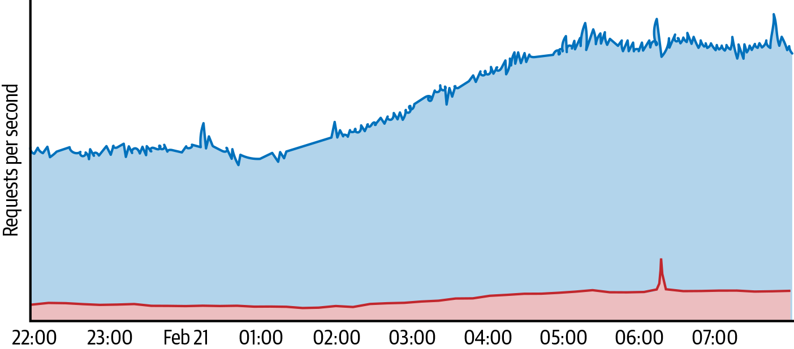
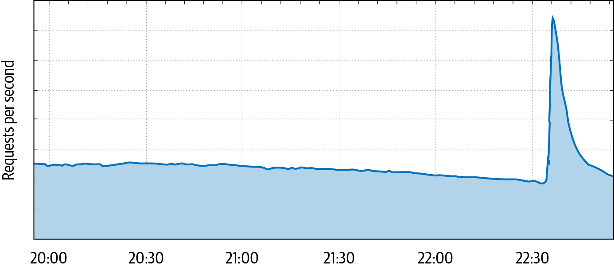

# Mitigating Denial-of-Service Attacks

By Damian Menscher

with Vitaliy Shipitsyn and Betsy Beyer‎

> Security and reliability intersect when an active adversary can set off an outage by conducting a denial-of-service (DoS) attack. In addition to an action by an adversary, denial of service can be caused by unexpected circumstances—from a backhoe slicing through a fiber-optic cable to a malformed request crashing a server—and target any layer of the stack. Most commonly, it manifests as a sudden surge in usage. While you can apply some mitigations on top of existing systems, minimizing the effects of a DoS attack often requires careful system design. This chapter discusses some strategies for defending against DoS attacks.

Security practitioners often think about the systems they protect in terms of *attack* and *defense*. But in a typical denial-of-service attack, economics offers more helpful terms: the adversary attempts to cause the *demand* for a particular service to exceed the *supply* of that service’s capacity.[^1] The end result is that the service is left with insufficient capacity to serve its legitimate users. The organization must then decide whether to incur even greater expenses by attempting to absorb the attack, or to suffer downtime (and corresponding financial losses) until the attack stops.

While some industries are more frequently targeted by DoS attacks than others, any service may be attacked in this way. *DoS extortion*, a financial attack in which the adversary threatens to disrupt a service unless paid, strikes relatively indiscriminately.[^2]

## Strategies for Attack and Defense

Attackers and defenders have limited resources, which they must use efficiently to achieve their goals. When formulating a defensive strategy, it’s helpful to start by understanding your adversary’s strategy so you can find weaknesses in your defenses before they do. With this understanding, you can construct defenses for known attacks and can design systems with the flexibility to quickly mitigate novel attacks.

### Attacker’s Strategy

An attacker must focus on efficiently using their limited resources to exceed the capacity of their target. A clever adversary may be able to disrupt the services of a more powerful opponent.

A typical service has several dependencies. Consider the flow of a typical user request:

1.  A DNS query provides the IP address of the server that should receive the user’s traffic.

2.  The network carries the request to the service frontends.

3.  The service frontends interpret the user request.

4.  Service backends provide database functionality for custom responses.

An attack that can successfully disrupt any of those steps will disrupt the service. Most novice attackers will attempt to send a flood of application requests or network traffic. A more sophisticated attacker may generate requests that are more costly to answer—for example, by abusing the search functionality present on many websites.

Because a single machine is rarely sufficient to disrupt a large service (which is often backed by multiple machines), a determined adversary will develop tools for harnessing the power of many machines in what’s called a *distributed denial-of-service* (DDoS) attack. To carry out a DDoS attack, the attacker can either compromise vulnerable machines and join them together into a *botnet*, or launch an *amplification attack*.

> **Amplification Attacks**
>
> In all types of communications, a request typically generates a response. Imagine that a farm supply store that sells fertilizer receives an order for a truckload of manure. The business will likely dump a pile of cow dung at the address listed. But what if the requestor’s identity was faked? The response will go to the wrong place, and the recipient will likely not be pleased by the surprise delivery.
>
> An *amplification attack* works on the same principle, but rather than making a single request, the adversary spoofs repeated requests from a single address to thousands of servers. The response traffic causes a distributed, reflected DoS attack toward the spoofed IP address.
>
> While network providers should prevent their customers from spoofing the source IP (which is similar to a return address) in outbound packets, not all providers enforce this constraint, and not all providers are consistent in their enforcement. Malicious attackers can take advantage of gaps in enforcement to reflect small requests off of open servers, which then return a larger response to the victim. There are several protocols that allow for an amplification effect, such as DNS, NTP, and memcache.[^3]
>
> The good news is, it’s easy to identify most amplification attacks because the amplified traffic comes from a well-known source port. You can efficiently defend your systems by using network ACLs that throttle UDP traffic from abusable protocols.[^4]

### Defender’s Strategy

A well-resourced defender can absorb attacks simply by overprovisioning their entire stack, but only at great cost. Datacenters full of power-hungry machines are expensive, and provisioning always-on capacity to absorb the largest attacks is infeasible. While automatic scaling may be an option for services built on a cloud platform with ample capacity, defenders typically need to utilize other cost-effective approaches to protect their services.

When figuring out your best DoS defense strategy, you need to take engineering time into account—you should prioritize strategies that have the greatest impact. While it’s tempting to focus on addressing yesterday’s outage, recency bias can result in rapidly changing priorities. Instead, we recommend using a threat model approach to concentrate your efforts on the weakest link in the dependency chain. You can compare threats according to the number of machines an attacker would need to control in order to cause user-visible disruption.

We use the term *DDoS* to refer to DoS attacks that are effective only because of their distributed nature, and that use either a large botnet or an amplification attack. We use the term *DoS* to refer to attacks that could be sourced from a single host. The distinction is relevant when designing defenses, as you can often deploy DoS defenses at the application layer, while DDoS defenses frequently utilize filtering within the infrastructure.

## Designing for Defense

An ideal attack focuses all its power on a single constrained resource, such as network bandwidth, application server CPU or memory, or a backend service like a database. Your goal should be to protect each of these resources in the most efficient way possible.

As attack traffic makes its way deeper into the system, it becomes both more focused and more expensive to mitigate. Therefore, layered defenses, whereby each layer protects the layer behind it, are an essential design feature. Here we examine the design choices that lead to defendable systems in two major layers: shared infrastructure and the individual service.

### Defendable Architecture

Most services share some common infrastructure, such as peering capacity, network load balancers, and application load balancers.

The shared infrastructure is a natural place to provide shared defenses. Edge routers can throttle high-bandwidth attacks, protecting the backbone network. Network load balancers can throttle packet-flooding attacks to protect the application load balancers. Application load balancers can throttle application-specific attacks before the traffic reaches service frontends.

Layering defenses tends to be cost-effective, since you only need to capacity-plan inner layers for styles of DoS attacks that can breach the defenses of outer layers. Eliminating attack traffic as early as possible conserves both bandwidth and processing power. For example, by deploying ACLs at the network edge, you can drop suspicious traffic before it has a chance to consume the bandwidth of the internal network. Deploying caching proxies near the network edge can similarly provide significant cost savings, while also reducing latency for legitimate users.

Stateful firewall rules are often not an appropriate first line of defense for production systems that receive inbound connections.[^5] An adversary can conduct a *state exhaustion attack*, in which a large number of unused connections fill the memory of a firewall with connection tracking enabled. Instead, use router ACLs to restrict traffic to the necessary ports without introducing a stateful system to the data path.

Implementing defenses in shared infrastructure also provides a valuable economy of scale. While it may not be cost-effective to provision significant defense capabilities for any individual service, shared defenses allow you to cover a broad range of services while provisioning only once. For example, [Figure 10-1](#a_ddos_attack_on_a_news_site_protected) shows how an attack targeting one site produced an amount of traffic that was much higher than normal for that site, but was still manageable when compared to the amount of traffic received by all of the sites protected by [Project Shield](https://projectshield.withgoogle.com). Commercial DoS mitigation services use a similar bundling approach to provide a cost-effective solution.

*Figure 10-1: A DDoS attack on a site protected by Project Shield, as seen from (top) the perspective of the individual site, and (bottom) the perspective of the Project Shield load balancers*

A particularly large DDoS attack could overwhelm the capacity of a datacenter, much as a magnifying glass can harness the power of the sun to ignite a fire. Any defense strategy must ensure that the power achieved by a distributed attack cannot be focused onto any single component. You can use network and application load balancers to continually monitor incoming traffic and spread the traffic to the nearest datacenter that has available capacity, preventing this type of overload.[^6]

You can defend shared infrastructure without relying on a reactive system by using [*anycast*](https://en.wikipedia.org/wiki/Anycast), a technique in which an IP address is announced from multiple locations. Using this technique, each location attracts traffic from nearby users. As a result, a distributed attack will be dispersed across locations all over the world, and therefore can’t focus its power on any single datacenter.

### Defendable Services

Website or application design can have a significant impact on the defense posture of a service. Although ensuring that the service degrades gracefully in overload conditions provides the best defense, several simple changes can be made to improve resilience to attack and allow for significant cost savings in normal operation:

Utilize caching proxies  
Using the `Cache-Control` and related headers can permit repeated requests for content to be served by proxies, without the need for every request to hit the application backend. This applies to most static images, and may even apply to the home page.

Avoid unnecessary application requests  
Every request consumes server resources, so it’s best to minimize the number of requests needed. If a web page contains several small icons, it is more efficient to serve them all in a single (larger) image, a technique known as *spriting*.[^7] As a side benefit, reducing the number of requests real users make to the service will reduce false positives when identifying malicious bots.

Minimize egress bandwidth  
While traditional attacks attempt to saturate ingress bandwidth, it’s possible for an attack to saturate your bandwidth by requesting a large resource. Resizing images to be only as large as necessary will conserve egress bandwidth and reduce page load times for users. Rate limiting or deprioritizing unavoidably large responses is another option.

## Mitigating Attacks

While a defendable architecture provides the ability to withstand many DoS attacks, you may also need active defenses to mitigate large or sophisticated attacks.

### Monitoring and Alerting

Outage resolution time is dominated by two factors: mean time to detection (MTTD) and mean time to repair (MTTR). A DoS attack may cause server CPU utilization to spike, or the application to run out of memory while queueing requests. To rapidly diagnose the root cause, you need to monitor the request rate in addition to CPU and memory usage.

Alerting on unusually high request rates can give the incident response team a clear indication of an attack. However, make sure that your pager alerts are actionable. If the attack is not causing user-facing harm, it is often best to simply absorb it. We recommend alerting only when demand exceeds service capacity and automated DoS defenses have engaged.

The principle of alerting only when human action may be required applies equally to network-layer attacks. Many synflood attacks can be absorbed, but may warrant an alert if syncookies are detected.[^8] Similarly, high-bandwidth attacks are only page-worthy if a link becomes saturated.

### Graceful Degradation

If absorbing an attack isn’t feasible, you should reduce the user-facing impact to the extent possible.

During a large attack you can use network ACLs to throttle suspicious traffic, providing an effective switch to immediately limit attack traffic. It’s important to not block suspicious traffic all the time, so you can retain visibility into your system and minimize the risk of impacting legitimate traffic that matches the attack signature. Because a clever adversary may simulate legitimate traffic, throttles may not be sufficient. In addition, you can use quality-of-service (QoS) controls to prioritize critical traffic. Using a lower QoS for less-important traffic like batch copies can release bandwidth to higher QoS queues if needed.

In case of overload, applications can also revert to a degraded mode. For example, Google deals with overload in the following ways:

- Blogger serves in read-only mode, disabling comments.

- Web Search continues serving with a reduced feature set.

- DNS servers answer as many requests as they can, but are designed to not crash under any amount of load.

For more ideas on handling overload, see [Chapter 8](ch08.html#design_for_resilience).

### A DoS Mitigation System

Automated defenses, such as throttling the top IP addresses or serving a JavaScript or CAPTCHA challenge, can quickly and consistently mitigate an attack. This gives the incident response team time to understand the problem and determine if a custom mitigation is warranted.

An automated DoS mitigation system can be divided into two components:

Detection  
The system must have visibility into the incoming traffic, with as much detail as possible. This may require statistical sampling at all endpoints, with aggregation up to a central control system. The control system identifies anomalies that may indicate attacks, while working in conjunction with load balancers that understand service capacity to determine if a response is warranted.

Response  
The system must have the ability to implement a defense mechanism—for example, by providing a set of IP addresses to block.

In any large-scale system, false positives (and false negatives) are unavoidable. This is especially true when blocking by IP address, as it is common for multiple devices to share a single network address (e.g., when network address translation is used). To minimize the collateral damage to other users behind the same IP address, you can utilize a CAPTCHA to allow real users to bypass application-level blocks.

> **CAPTCHA Implementation**
>
> A CAPTCHA bypass needs to give the user a long-term exemption so they’re not repeatedly challenged for subsequent requests. You can implement a CAPTCHA without introducing additional server state by issuing a browser cookie, but need to carefully construct the exemption cookie to guard against abuse. Google’s exemption cookies contain the following information:
>
> - A pseudo-anonymous identifier, so we can detect abuse and revoke the exemption
>
> - The type of challenge that was solved, allowing us to require harder challenges for more suspicious behaviors
>
> - The timestamp when the challenge was solved, so we can expire older cookies
>
> - The IP address that solved the challenge, preventing a botnet from sharing a single exemption
>
> - A signature to ensure the cookie cannot be forged

You must also consider the failure modes of your DoS mitigation system—problems might be caused by an attack, a configuration change, an unrelated infrastructure outage, or some other cause.

The DoS mitigation system must itself be resilient to attack. Accordingly, it should avoid dependencies on production infrastructure that may be impacted by DoS attacks. This advice extends beyond the service itself, to the incident response team’s tools and communications procedures. For example, since Gmail or Google Docs might be impacted by DoS attacks, Google has backup communication methods and playbook storage.

Attacks often result in immediate outages. While graceful degradation reduces the impact of an overloaded service, it’s best if the DoS mitigation system can respond in seconds rather than minutes. This characteristic creates a natural tension with the best practice of deploying changes slowly to guard against outages. As a tradeoff, we canary all changes (including automated responses) on a subset of our production infrastructure before deploying them everywhere. That canary can be quite brief—in some cases as little as 1 second!

If the central controller fails, we don’t want to either fail closed (as that would block all traffic, leading to an outage) or fail open (as that would let an ongoing attack through). Instead, we fail static, meaning the policy does not change. This allows the control system to fail during an attack (which has actually happened at Google!) without resulting in an outage. Because we fail static, the DoS engine doesn’t have to be as highly available as the frontend infrastructure, thus lowering the costs.

### Strategic Response

When responding to an outage, it’s tempting to be purely reactive and attempt to filter the current attack traffic. While fast, this approach may not be optimal. Attackers may give up after their first attempt fails, but what if they don’t? An adversary has unlimited opportunities to probe defenses and construct bypasses. A strategic response avoids informing the adversary’s analysis of your systems. As an example, we once received an attack that was trivially identified by its `User-Agent: I AM BOTNET`*.* If we simply dropped all traffic with that string, we’d be teaching our adversary to use a more plausible `User-Agent`, like `Chrome`. Instead, we enumerated the IPs sending that traffic, and intercepted *all* of their requests with CAPTCHAs for a period of time. This approach made it harder for the adversary to use [A/B testing](https://en.wikipedia.org/wiki/A/B_testing) to learn how we isolated the attack traffic. It also proactively blocked their botnet, even if they modified it to send a different `User-Agent`.

An understanding of your adversary’s capabilities and goals can guide your defenses. A small amplification attack suggests that your adversary may be limited to a single server from which they can send spoofed packets, while an HTTP DDoS attack fetching the same page repeatedly indicates they likely have access to a botnet. But sometimes the “attack” is unintentional—your adversary may simply be trying to scrape your website at an unsustainable rate. In that case, your best solution may be to ensure that the website is not easily scraped.

Finally, remember that you are not alone—others are facing similar threats. Consider working with other organizations to improve your defenses and response capabilities: DoS mitigation providers can scrub some types of traffic, network providers can perform upstream filtering, and the network operator community can identify and filter attack sources.

## Dealing with Self-Inflicted Attacks

During the adrenaline rush of a major outage, the natural response is to focus on the goal of defeating your adversary. But what if there is no adversary to defeat? There are some other common causes for a sudden increase in traffic.

### User Behavior

Most of the time, users make independent decisions and their behavior averages out into a smooth demand curve. However, external events can synchronize their behavior. For example, if a nighttime earthquake wakes up everyone in a population center, they may suddenly turn to their devices to search for safety information, post to social media, or check in with friends. These concurrent actions can cause services to receive a sudden increase in usage, like the traffic spike shown in [Figure 10-2](#web_trafficcomma_measured_in_http_reque).

*Figure 10-2: Web traffic, measured in HTTP requests per second, reaching Google infrastructure serving users in the San Francisco Bay Area when a magnitude 4.5 earthquake hit the region on October 14, 2019*

> **Bot or Not?**
>
> In 2009, Google Web Search received a significant burst of traffic that lasted about a minute. Despite the weekend timing, several SREs started to investigate. Our investigation turned up very odd results: the requests were all for German words, and all began with the same letters. We speculated this was a botnet conducting a dictionary-based attack.
>
> The attack repeated about 10 minutes later (but with a different set of characters prefixing each word), and then a third time. Deeper analysis led us to question our initial suspicion of this being an attack, for a couple of reasons:
>
> - The requests originated from machines in Germany.
>
> - The requests came from the expected distribution of browsers.
>
> Could this traffic be coming from real users, we wondered? What would cause them to behave in this anomalous way?
>
> We later discovered the explanation: a televised game show. Contestants were provided the prefix of a word, and challenged to complete the prefix with the word that would return the most search results on Google. Viewers were playing along at home.

We addressed this “attack” with a design change: we launched a feature that suggests word completions as you type.

### Client Retry Behavior

Some “attacks” are unintentional, and are simply caused by misbehaving software. If a client expects to fetch a resource from your server, and the server returns an error, what happens? The developer may think a retry is appropriate, leading to a loop if the server is still serving errors. If many clients are caught in this loop, the resulting demand makes recovering from the outage difficult.[^9]

Client software should be carefully designed to avoid tight retry loops. If a server fails, the client may retry, but should implement exponential backoff—for example, doubling the wait period each time an attempt fails. This approach limits the number of requests to the server, but on its own is not sufficient—an outage can synchronize all clients, causing repeated bursts of high traffic. To avoid synchronous retries, each client should wait for a random duration, called *jitter*. At Google, we implement exponential backoff with jitter in most of our client software.

What can you do if you don’t control the client? This is a common concern for people operating authoritative DNS servers. If they suffer an outage, the resulting retry rate from legitimate recursive DNS servers can cause a significant increase in traffic—often around 30x normal usage. This demand can make it difficult to recover from the outage and often thwarts attempts to find its root cause: operators may think a DDoS attack is the cause rather than a symptom. In this scenario, the best option is to simply answer as many requests as you can, while keeping the server healthy via upstream request throttling. Each successful response will allow a client to escape its retry loop, and the problem will soon be resolved.

## Conclusion

Every online service should prepare for DoS attacks, even if they don’t consider themselves a likely target. Each organization has a limit of traffic it can absorb, and the defender’s task is to mitigate attacks that exceed deployed capacity in the most efficient way possible.

It’s important to remember the economic constraints of your DoS defenses. Simply absorbing an attack is rarely the most inexpensive approach. Instead, utilize cost-effective mitigation techniques, starting in the design phase. When under attack, consider all of your options, including blocking a problematic hosting provider (which may include a small number of real users) or suffering a short-term outage and explaining the situation to your users. Also remember that the “attack” may be unintentional.

Implementing defenses at each layer of the serving stack requires collaboration with several teams. For some teams, DoS defense may not be a top priority. To gain their support, focus on the cost savings and organizational simplifications a DoS mitigation system can provide. Capacity planning can focus on real user demand, rather than needing to absorb the largest attacks at every layer of the stack. Filtering known malicious requests using a web application firewall (WAF) allows the security team to focus on novel threats. If you discover application-level vulnerabilities, the same system can block exploitation attempts, allowing the developers team time to prepare a patch.

Through careful preparation, you can determine the functionality and failure modes of your service on your own terms—not those of an adversary.
