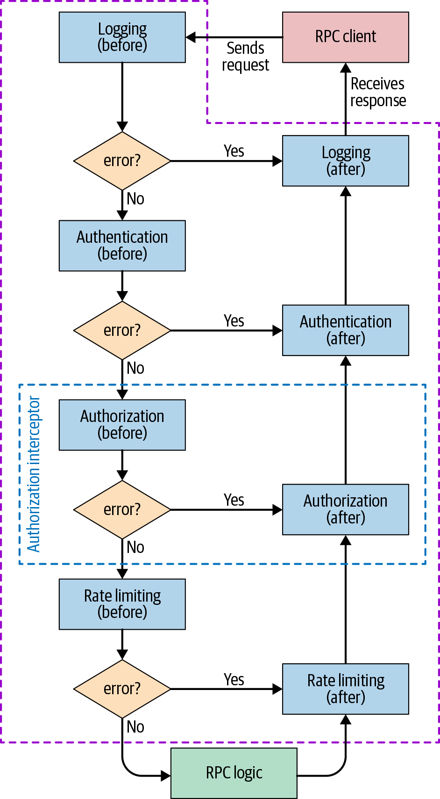
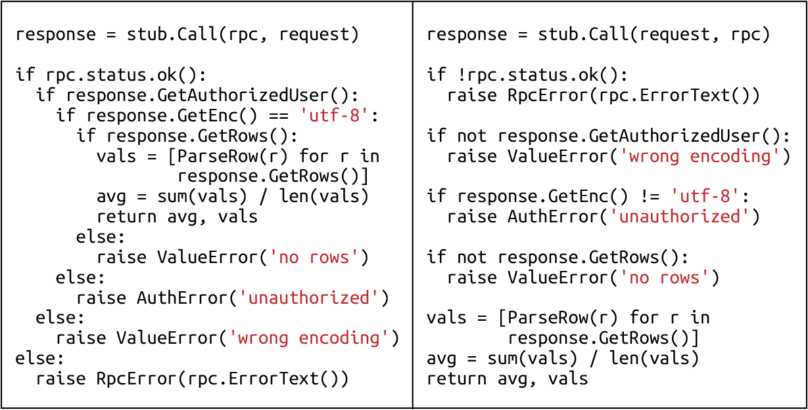

# Writing Code

By Michał Czapiński and Julian Bangert

with Thomas Maufer and Kavita Guliani

> Code will inevitably include bugs. However, you can avoid common security vulnerabilities and reliability issues by using hardened frameworks and libraries designed to be resilient against these problem classes.
>
> This chapter presents software development patterns that should be applied during the implementation of a project. We start by looking at an RPC backend example and exploring how frameworks help us automatically enforce desired security properties and mitigate typical reliability anti-patterns. We also focus on code simplicity, which is achieved by controlling the accumulation of technical debt and refactoring the codebase when needed. We conclude with tips on how to select the right tools and make the most of your chosen development languages.

Security and reliability cannot easily be retrofitted into software, so it’s important to account for them in software design from the earliest phases. Tacking on these features after a launch is painful and less effective, and may require you to change other fundamental assumptions about the codebase (see [Chapter 4](ch04.html#design_tradeoffs) for a deeper discussion on this topic).

The first and most important step in reducing security and reliability issues is to educate developers. However, even the best-trained engineers make mistakes—security experts can write insecure code and SREs can miss reliability issues. It’s difficult to keep the many considerations and tradeoffs involved in building secure and reliable systems in mind simultaneously, especially if you’re also responsible for producing software.

Instead of relying solely on developers to vet code for security and reliability, you can task SREs and security experts with reviewing code and software designs. This approach is also imperfect—manual code reviews won’t find every issue, and no reviewer will catch *every* security problem that an attacker could potentially exploit. Reviewers can also be biased by their own experience or interests. For example, they may naturally gravitate toward seeking out new classes of attacks, high-level design issues, or interesting flaws in cryptographic protocols; in contrast, reviewing hundreds of HTML templates for cross-site scripting (XSS) flaws or checking the error-handling logic for each RPC in an application may be seen as less thrilling.

While code reviews may not find every vulnerability, they do have other benefits. A strong review culture encourages developers to structure their code in a way that makes the security and reliability properties easy to review. This chapter discusses strategies for making these properties obvious to reviewers and for integrating automation into the development process. These strategies can free up a team’s bandwidth to focus on other issues and lead to building a culture of security and reliability (see [Chapter 21](ch21.html#twoone_building_a_culture_of_security_a)).

## Frameworks to Enforce Security and Reliability

As discussed in [Chapter 6](ch06.html#design_for_understandability), the security and reliability of an application rely on domain-specific invariants. For example, an application is secure against SQL injection attacks if all of its database queries consist only of developer-controlled code, with external inputs supplied via query parameter bindings. A web application can prevent XSS attacks if all user input that’s inserted into HTML forms is properly escaped or sanitized to remove any executable code.

> **Common Security and Reliability Invariants**
>
> Almost any multiuser application has application-specific security invariants that govern which users can perform which actions on data; every action should consistently maintain these invariants. To prevent cascading failures in a distributed system, each application must also follow reasonable policies, such as backing off retries on failing RPCs. Similarly, in order to avoid memory corruption crashes and security issues, C++ programs should access only valid memory locations.

In theory, you can create secure and reliable software by carefully writing application code that maintains these invariants. However, as the number of desired properties and the size of the codebase grows, this approach becomes almost impossible. It’s unreasonable to expect any developer to be an expert in all these subjects, or to constantly maintain vigilance when writing or reviewing code.

If humans need to manually review every change, those humans will have a hard time maintaining global invariants because reviewers can’t always keep track of global context. If a reviewer needs to know which function parameters are passed user input by callers and which arguments only contain developer-controlled, trustworthy values, they must also be familiar with all transitive callers of a function. Reviewers are unlikely to be able to keep this state over the long run.

A better approach is to handle security and reliability in common frameworks, languages, and libraries. Ideally, libraries only expose an interface that makes writing code with common classes of security vulnerabilities impossible. Multiple applications can use each library or framework. When domain experts fix an issue, they remove it from all the applications the framework supports, allowing this engineering approach to scale better. Compared to manual review, using a centralized hardened framework also reduces the chances of future vulnerabilities creeping in. Of course, no framework can protect against all security vulnerabilities, and it is still possible for attackers to discover an unforeseen class of attacks or find mistakes in the implementation of the framework. But if you discover a new vulnerability, you can address it in one place (or a few) instead of throughout the codebase.

To provide one concrete example: SQL injection (SQLI) holds the top spot on both the [OWASP](https://www.owasp.org/images/7/72/OWASP_Top_10-2017_(en).pdf.pdf) and [SANS](https://www.sans.org/top25-software-errors) lists of common security vulnerabilities. In our experience, when you use a hardened data library such as `TrustedSqlString` (see [SQL Injection Vulnerabilities: TrustedSqlString](#sql_injection_vulnerabilities_trustedsq)), these types of vulnerabilities become a nonissue. Types make these assumptions explicit, and are automatically enforced by the compiler.

### Benefits of Using Frameworks

Most applications have similar building blocks for security (authentication and authorization, logging, data encryption) and reliability (rate limiting, load balancing, retry logic). Developing and maintaining such building blocks from scratch for every service is expensive, and leads to a patchwork of different bugs in each service.

Frameworks enable code reuse: rather than accounting for all of the security and reliability aspects affecting a given functionality or feature, developers only need to customize a specific building block. For example, a developer can specify which information from the incoming request credentials is important for authorization without worrying about the credibility of that information—that credibility is verified by the framework. Equally, a developer can specify which data needs to be logged without worrying about storage or replication. Frameworks also make propagating updates easier, as you need to apply an update in only one location.

Using frameworks leads to increased productivity for all developers in an organization, a benefit for building a culture of security and reliability (see [Chapter 21](ch21.html#twoone_building_a_culture_of_security_a)). It’s much more efficient for a team of domain experts to design and develop the framework building blocks than for each individual team to implement security and reliability features itself. For example, if the security team handles cryptography, all other teams benefit from their knowledge. None of the developers using the frameworks need to worry about their internal details, and they can instead focus on an application’s business logic.

Frameworks further increase productivity by providing tools that are easy to integrate with. For example, frameworks can provide tools that automatically export basic operational metrics, like the total number of requests, the number of failed requests broken down by error type, or the latency of each processing stage. You can use that data to generate automated monitoring dashboards and alerting for a service. Frameworks also make integrating with load-balancing infrastructure easier, so a service can automatically redirect traffic away from overloaded instances, or spin up new service instances under heavy load. As a result, services built on top of frameworks exhibit significantly higher reliability.

Using frameworks also makes reasoning about the code easy by clearly separating business logic from common functions. This enables developers to make assertions about the security or reliability of a service with more confidence. In general, frameworks lead to reduced complexity—when code across multiple services is more uniform, it’s easier to follow common good practices.

It doesn’t always make sense to develop your own frameworks. In many cases, the best strategy is to reuse existing solutions. For example, almost any security professional will advise you against designing and implementing your own cryptographic framework—instead, you might use a well-established and widely used framework such as Tink (discussed in [Example: Secure cryptographic APIs and the Tink crypto framework](ch06.html#example_secure_cryptographic_apis_and_t)).

Before deciding to adopt any specific framework, it’s important to evaluate its security posture. We also suggest using actively maintained frameworks and continuously updating your code dependencies to incorporate the latest security fixes for any code on which your code depends.

The following case study is a practical example demonstrating the benefits of frameworks: in this case, a framework for creating RPC backends.

### Example: Framework for RPC Backends

Most RPC backends follow a similar structure. They handle request-specific logic and typically also perform the following:

- Logging

- Authentication

- Authorization

- Throttling (rate limiting)

Instead of reimplementing this functionality for every single RPC backend, we recommend using a framework that can hide the implementation details of these building blocks. Then developers just need to customize each step to accommodate their service’s needs.

[Figure 12-1](#a_control_flow_in_a_potential_framework) presents a possible framework architecture based on predefined *interceptors* that are responsible for each of the previously mentioned steps. You can potentially also use interceptors for custom steps. Each interceptor defines an action to be performed *before* and *after* the actual RPC logic executes. Each stage can report an error condition, which prevents further interceptors from executing. However, when this occurs, the *after* steps of each interceptor that has already been called are executed in the reverse order. The framework between the interceptors can transparently perform additional actions—for example, exporting error rates or performance metrics. This architecture leads to a clear separation of the logic performed at every stage, resulting in increased simplicity and reliability.



*Figure 12-1: A control flow in a potential framework for RPC backends: the typical steps are encapsulated in predefined interceptors and authorization is highlighted as an example*

In this example, the *before* stage of the logging interceptor could log the call, and the *after* stage could log the status of the operation. Now, if the request is unauthorized, the RPC logic doesn’t execute, but the “permission denied” error is properly logged. Afterward, the system calls the authentication and logging interceptors’ *after* stages (even if they are empty), and only then does it send the error to the client.

Interceptors share state through a *context object* that they pass to each other. For example, the authentication interceptor’s *before* stage can handle all the cryptographic operations associated with certificate handling (note the increased security from reusing a specialized crypto library rather than reimplementing one yourself). The system then wraps the extracted and validated information about the caller in a convenience object, which it adds to the context. Subsequent interceptors can easily access this object.

The framework can then use the context object to track request execution time. If at any stage it becomes obvious that the request won’t complete before the deadline, the system can automatically cancel the request. You can increase service reliability by notifying the client quickly, which also conserves resources.

A good framework should also enable you to work with dependencies of the RPC backend—for example, another backend that’s responsible for storing logs. You might register these as either soft or hard dependencies, and the framework can constantly monitor their availability. When it detects the unavailability of a hard dependency, the framework can stop the service, report itself as unavailable, and automatically redirect traffic to other instances.

Sooner or later, overload, network issues, or some other issue will result in a dependency being unavailable. In many cases, it would be reasonable to retry the request, but implement retries carefully in order to avoid a *cascading failure* (akin to falling dominoes).[^1] The most common solution is to retry with an *exponential backoff*.[^2] A good framework should provide support for such logic, rather than requiring the developer to implement the logic for every RPC call.

A framework that gracefully handles unavailable dependencies and redirects traffic to avoid overloading the service or its dependencies naturally improves the reliability of both the service itself and the entire ecosystem. These improvements require minimal involvement from developers.

### Example code snippets

Examples <a href="#example_onetwo_onedot_initial_type_defi" data-xrefstyle="select:labelnumber">example_onetwo_onedot_initial_type_defi</a> through <a href="#example_onetwo_threedot_example_logging" data-xrefstyle="select:labelnumber">example_onetwo_threedot_example_logging</a> demonstrate the RPC backend developer’s perspective of working with a security- or reliability-focused framework. The examples are in Go and use [Google Protocol Buffers](https://developers.google.com/protocol-buffers/).

##### Initial type definitions (the before stage of an interceptor can modify the context; for example, the authentication interceptor can add verified information about the caller)

```
type Request struct {
  Payload proto.Message
}

type Response struct {
  Err error
  Payload proto.Message
}

type Interceptor interface {
  Before(context.Context, *Request) (context.Context, error)
  After(context.Context, *Response) error
}

type CallInfo struct {
  User string
  Host string
  ...
}
```

##### Example authorization interceptor that allows only requests from allowlisted users

```
type authzInterceptor struct {
  allowedRoles map[string]bool
}

func (ai *authzInterceptor) Before(ctx context.Context, req *Request) (context.Context, error) {
  // callInfo was populated by the framework.
  callInfo, err := FromContext(ctx)
  if err != nil { return ctx, err }

  if ai.allowedRoles[callInfo.User] { return ctx, nil }
  return ctx, fmt.Errorf("Unauthorized request from %q", callInfo.User)
}

func (*authzInterceptor) After(ctx context.Context, resp *Response) error {
  return nil  // Nothing left to do here after the RPC is handled.
}
```

##### Example logging interceptor that logs every incoming request (before stage) and then logs all the failed requests with their status (after stage); WithAttemptCount is a framework-provided RPC call option that implements exponential backoff

```
type logInterceptor struct {
  logger *LoggingBackendStub
}

func (*logInterceptor) Before(ctx context.Context,
                              req *Request) (context.Context, error) {
  // callInfo was populated by the framework.
  callInfo, err := FromContext(ctx)
  if err != nil { return ctx, err }
  logReq := &pb.LogRequest{
    timestamp: time.Now().Unix(),
    user: callInfo.User,
    request: req.Payload,
  }
  resp, err := logger.Log(ctx, logReq, WithAttemptCount(3))
  return ctx, err
}

func (*logInterceptor) After(ctx context.Context, resp *Response) error {
  if resp.Err == nil { return nil }
  
  logErrorReq := &pb.LogErrorRequest{
    timestamp: time.Now().Unix(),
    error: resp.Err.Error(),
  }
  resp, err := logger.LogError(ctx, logErrorReq, WithAttemptCount(3))
  return err
}
```

## Common Security Vulnerabilities

In large codebases, a handful of classes account for the majority of security vulnerabilities, despite ongoing efforts to educate developers and introduce code review. OWASP and SANS publish lists of common vulnerability classes. [#top_onezero_most_common_vulnerability_r](#top_onezero_most_common_vulnerability_r) lists the 10 most common vulnerability risks according to [OWASP](https://www.owasp.org/images/7/72/OWASP_Top_10-2017_(en).pdf.pdf), along with some potential approaches to mitigate each at a framework level.

<table id="top_onezero_most_common_vulnerability_r" class="border pagebreak-before">
<caption>Top 10 most common vulnerability risks according to OWASP</caption>
<colgroup>
<col style="width: 50%" />
<col style="width: 50%" />
</colgroup>
<thead>
<tr class="header">
<th>OWASP top 10 vulnerability</th>
<th>Framework hardening measures</th>
</tr>
</thead>
<tbody>
<tr class="odd">
<td>[SQL] Injection</td>
<td><code>TrustedSQLString</code> (see the following section).</td>
</tr>
<tr class="even">
<td>Broken authentication</td>
<td>Require authentication using a well-tested mechanism like OAuth before routing a request to the application. (See <a href="#example_framework_for_rpc_backends">Example: Framework for RPC Backends</a>.)</td>
</tr>
<tr class="odd">
<td>Sensitive data exposure</td>
<td>Use distinct types (instead of strings) to store and handle sensitive data like credit card numbers. This approach can restrict serialization to prevent leaks and enforce appropriate encryption.<br />
Frameworks can additionally enforce transparent in-transit protection, like HTTPS with LetsEncrypt. Cryptographic APIs such as <a href="https://github.com/google/tink/blob/master/docs/KEY-MANAGEMENT.md">Tink</a> can encourage appropriate secret storage, such as loading keys from a cloud key management system instead of a configuration file.</td>
</tr>
<tr class="even">
<td>XML external entities (XXE)</td>
<td>Use an XML parser without XXE enabled; ensure this risky feature is disabled in libraries that support it.[^3]</td>
</tr>
<tr class="odd">
<td>Broken access control</td>
<td>This is a tricky problem, because it’s often application-specific. Use a framework that requires every request handler or RPC to have well-defined access control restrictions. If possible, pass end-user credentials to the backend, and enforce an access control policy in the backend.</td>
</tr>
<tr class="even">
<td>Security misconfiguration</td>
<td>Use a technology stack that provides secure configurations by default and restricts or doesn’t allow risky configuration options. For example, use a web framework that does not print error information in production. Use a single flag to enable all debug features, and set up your deployment and monitoring infrastructure to ensure this flag is not enabled for public users. The <code>environment</code> flag in Rails is one example of this approach.</td>
</tr>
<tr class="odd">
<td>Cross-site scripting (XSS)</td>
<td>Use an XSS-hardened template system (see <a href="#preventing_xss_safehtml">Preventing XSS: SafeHtml</a>).</td>
</tr>
<tr class="even">
<td>Insecure deserialization</td>
<td>Use deserialization libraries that are built for handling untrusted inputs, such as <a href="https://developers.google.com/protocol-buffers/">Protocol Buffers</a>.</td>
</tr>
<tr class="odd">
<td>Using components with known vulnerabilities</td>
<td>Choose libraries that are popular and actively maintained. Do not pick components that have a history of unfixed or slowly fixed security issues. Also see <a href="#lessons_for_evaluating_and_building_fra">Lessons for Evaluating and Building Frameworks</a>.</td>
</tr>
<tr class="even">
<td>Insufficient logging & monitoring</td>
<td>Instead of relying on ad hoc logging, log and monitor requests and other events as appropriate in a low-level library. See the logging interceptor described in the previous section for an example.</td>
</tr>
</tbody>
</table>

Top 10 most common vulnerability risks according to OWASP {#top_onezero_most_common_vulnerability_r}

### SQL Injection Vulnerabilities: TrustedSqlString

[SQL injection](https://xkcd.com/327) is a common class of security vulnerability. When untrustworthy string fragments are inserted into a SQL query, attackers can potentially inject database commands. The following is a simple password reset web form:

```
db.query("UPDATE users SET pw_hash = '" + request["pw_hash"] 
         + "' WHERE reset_token = '" + request.params["reset_token"] + "'")
```

In this case, the user’s request is directed to a backend with an unguessable `reset_token` specific to their account. However, because of the string concatenation, a malicious user could craft a custom `reset_token` with extra SQL commands (such as `' or username='admin)` and *inject* this token into the backend. The result could reset the password hash of a different user—in this case, the admin account.

SQL injection vulnerabilities can be harder to spot in more complicated codebases. The database engine can help you prevent SQL injection vulnerabilities by providing bound parameters and prepared statements:

```
Query q = db.createQuery(
  "UPDATE users SET pw_hash = @hash WHERE token = @token");
q.setParameter("hash", request.params["hash"]);
q.setParameter("token", request.params["token"]);
db.query(q);
```

However, merely establishing a guideline to use prepared statements does not result in a scalable security process. You would need to educate every developer about this rule, and security reviewers would have to review all application code to ensure consistent use of prepared statements. Instead, you can design the database API so that mixing user input and SQL becomes impossible by design. For example, you can create a separate type called `TrustedSqlString` and enforce by construction that all SQL query strings are created from developer-controlled input. In Go, you could implement the type as follows:

```
struct Query {
  sql strings.Builder;
} 
type stringLiteral string;  
// Only call this function with string literal parameters.
func (q *Query) AppendLiteral(literal stringLiteral) {
  q.sql.writeString(literal);
}
// q.AppendLiteral("foo") will work, q.AppendLiteral(foo) will not
```

This implementation guarantees by construction that the contents of `q.sql` are entirely concatenated from string literals present in your source code, and the user cannot provide string literals. To enforce this contract at scale, you can use a language-specific mechanism to make sure `AppendLiteral` is called only with string literals. For example:

In Go  
Use a package-private type alias (`stringLiteral`). Code outside the package cannot refer to this alias; however, string literals are implicitly converted to this type.

In Java  
Use the [Error Prone](https://errorprone.info) code checker, which provides a `@CompileTimeConstant` annotation for parameters.

In C++  
Use a template constructor that depends on each character value in the string.

You can find similar mechanisms for other languages.

You can’t build some features—like a data analytics application that by design runs arbitrary SQL queries provided by the user who owns the data—using just compile-time constants. To handle complicated use cases, at Google we allow a way to bypass the type restrictions with approval from a security engineer. For example, our database API has a separate package, `unsafequery`, that exports a distinct `unsafequery.String` type, which can be constructed from arbitrary strings and appended to SQL queries. Only a small fraction of our queries use the unchecked APIs. The burden of reviewing new uses of SQL queries that are not inherently safe and other restricted API patterns is handled by one (rotating) engineer on a part-time basis, for hundreds to thousands of active developers. See [Lessons for Evaluating and Building Frameworks](#lessons_for_evaluating_and_building_fra) for other benefits of reviewed exemptions.

### Preventing XSS: SafeHtml

The type-based safety approach we described in the previous section is not specific to SQL injection. Google uses a more complex version of the same design to reduce cross-site scripting vulnerabilities in web applications.[^4]

At their core, XSS vulnerabilities occur when a web application renders untrustworthy input without appropriate sanitization. For example, an application might interpolate an attacker-controlled `$address` value into an HTML snippet such as `<div>$address</div>`, which is shown to another user. An attacker can then set `$address` to `<script>exfiltrate_user_data();</script>` and execute arbitrary code in the context of another user’s page.

HTML does not have the equivalent of binding query parameters. Instead, untrustworthy values must be appropriately sanitized or escaped before they are inserted into an HTML page. Furthermore, different HTML attributes and elements have different semantics, so application developers have to treat values differently depending on the context in which they appear. For example, an attacker-controlled URL can cause code execution with the `javascript:` scheme.

A type system can capture these requirements by introducing different types for values meant for different contexts—for example, `SafeHtml` to represent the contents of an HTML element, and `SafeUrl` for URLs that are safe to navigate to. Each of the types is a (immutable) wrapper around a string; the contracts are upheld by the constructors available for each type. The constructors make up the trusted codebase that’s responsible for ensuring the security properties of the application.

Google has created different builder libraries for different use cases. Individual HTML elements can be constructed with builder methods that require the correct type for each attribute value, and `SafeHtml` for the element contents. The template system with strict contextual escaping guarantees the `SafeHtml` contract for more complicated HTML. That system does the following:

1.  Parses the partial HTML in the template

2.  Determines the context for each substitution point

3.  Either requires the program to pass in a value of the correct type, or correctly escapes or sanitizes untrusted string values

For example, if you have the following Closure Template:

```
{template .foo kind="html"}<script src="{$url}"></script>{/template}
```

trying to use a string value for `$url` will fail:

```
templateRendered.setMapData(ImmutableMap.of("url", some_variable));
```

Instead, the developer has to provide a `TrustedResourceUrl` value, e.g.:

```
templateRenderer.setMapData(
     ImmutableMap.of("x", TrustedResourceUrl.fromConstant("/script.js"))
 ).render();
```

If HTML originates from an untrusted source, you won’t want to embed it into your application’s web UI, since doing so would result in an easily exploitable XSS vulnerability. Instead, you can use an HTML sanitizer that parses the HTML and performs runtime checks to determine that each value meets its contract. The sanitizer removes elements that do not meet their contract, or elements for which it is impossible to check the contract at runtime. You can also use a sanitizer to interoperate with other systems that don’t use safe types, because many HTML fragments are unchanged by sanitization.

Different HTML construction libraries target different developer productivity and code readability tradeoffs. However, they all enforce the same contract and should be equally trustworthy (apart from any bugs in their trusted implementations). In fact, to reduce the maintenance burden at Google, we code-generate the builder functions in various languages from a declarative configuration file. This file lists HTML elements and the required contracts for the values of each attribute. Some of our HTML sanitizers and template systems use the same configuration file.

A mature open source implementation of safe types for HTML is available in [Closure Templates](https://github.com/google/closure-templates), and there is an effort underway to introduce [type-based security](https://github.com/w3c/webappsec-trusted-types) as a web standard.

## Lessons for Evaluating and Building Frameworks

The previous sections discussed how to structure libraries to establish security and reliability properties. However, you can’t elegantly express all such properties with API design, and in some cases you can’t even change the API easily—for example, when interacting with the standardized DOM API exposed by a web browser.

Instead, you can introduce compile-time checks to prevent developers from using risky APIs. Plug-ins for popular compilers, such as [Error Prone](https://errorprone.info) for Java and [Tsetse](https://tsetse.info) for TypeScript, can prohibit risky code patterns.

Our experience has shown that compiler errors provide immediate and actionable feedback. Tools running on an opt-in basis (like linters) or at code review time provide feedback much later. By the time code is sent for review, developers usually have a finished, working unit of code. Learning that you need to perform some rearchitecting in order to use a strictly typed API that late in the development process can be frustrating.

It’s much easier to equip developers with compiler errors or faster feedback mechanisms like IDE plug-ins that underline problematic code. Typically, developers iterate through compilation issues quickly, and already have to fix other compiler diagnostics like trivial misspellings and syntactic errors. Because the developers are already working on the specific lines of code affected, they have full context, so making changes is easier—for example, changing the type of a string to `SafeHtml`.

You can improve the developer experience even further by suggesting automatic fixes that work as a starting point for a safe solution. For example, when you detect a call to a SQL query function, you can automatically insert a call to `TrustedSqlBuilder.fromConstant` with the query parameter. Even if the resulting code does not quite compile (perhaps because the query is a string variable and not a constant), developers know what to do, and don’t need to bother with the mechanical details of the API by finding the right function, adding the correct import declarations, and so on.

In our experience, as long as the feedback cycle is quick, and fixing each pattern is relatively easy, developers embrace inherently safe APIs much more readily—even when we can’t prove that their code was insecure, or when they do a good job of writing secure code using the unsafe APIs. Our experience contrasts with existing research literature, which focuses on reducing the false-positive and false-negative rates.[^5]

We’ve found that focusing on those rates often results in complicated checkers that take much longer to produce findings. For example, a check might have to analyze whole-program data flows across a complicated application. It’s often difficult to explain how to remove the issue that the static analysis detects to developers, as the workings of the checker are much harder to explain than a simple syntactic property. Understanding a finding takes as much work as tracking down a bug in GDB (the GNU Debugger). On the other hand, fixing a type safety error at compile time while writing new code is usually not much harder than fixing a trivial type error.

### Simple, Safe, Reliable Libraries for Common Tasks

Building a safe library that covers all possible use cases and handles each reliably can be very challenging. For example, an application developer working on an HTML templating system might write the following template:

```
<a onclick="showUserProfile('{{username}}');">Show profile</a>">
```

To be XSS-proof, if `username` is attacker-controlled, the template system must nest three different layers of context: a single-quoted string, inside JavaScript, inside an attribute in an HTML element. Creating a template system that can handle all possible combinations of corner cases is complicated, and using that system won’t be straightforward. In other domains, this issue can grow even more complex. For example, business needs might dictate complex rules about who can perform an action and who cannot. Unless your authorization library is as expressive (and as hard to analyze) as a general-purpose programming language, you might not be able to meet all developer needs.

Instead, you can start with a simple, small library that covers only common use cases but is easier to use correctly. Simple libraries are easier to explain, document, and use. These qualities reduce developer friction and may help you convince other developers to adopt the secure-by-design library. In some cases, it might make sense to offer different libraries optimized for different use cases. For example, you might have both HTML templating systems for complicated pages and builder libraries for short snippets.

You can accommodate other use cases with expert-reviewed access to an unconstrained, risky library that bypasses safety guarantees. If you see repeated similar requests for a use case, you can support that feature in the inherently safe library. As we observed in [SQL Injection Vulnerabilities: TrustedSqlString](#sql_injection_vulnerabilities_trustedsq), the review load is usually manageable.

Because the volume of review requests is relatively small, security reviewers can look at the code in depth and suggest extensive improvements—and the reviews tend to be unique use cases, which keeps reviewers motivated and prevents mistakes due to repetition and fatigue. Exemptions also act as a feedback mechanism: If developers repeatedly need exemptions for a use case, library authors should consider building a library for that use case.

### Rollout Strategy

Our experience has shown that using types for security properties is very useful for new code. In fact, applications created in one widely used Google-internal web framework, which was developed from the outset with safe types for HTML, have had far fewer reported XSS vulnerabilities (by two orders of magnitude) than applications written without safe types, despite careful code review. The few reported vulnerabilities were caused by components of the application that did not use safe types.

It is more challenging to adapt existing code to use safe types. Even if you are starting with a brand new codebase, you need a strategy for migrating legacy code—you might discover new classes of security and reliability issues you want to protect against, or you might need to refine existing contracts.

We have experimented with several strategies for refactoring existing code; we discuss our two most successful approaches in the following subsections. These strategies require that you are able to access and modify the entire source code of your application. Most of Google’s source code is stored in a single repository[^6] with centralized processes for making, building, testing, and submitting changes. Code reviewers also enforce common readability and code organization standards, which reduces the complexity of changing an unfamiliar codebase. In other environments, large-scale refactorings can be more challenging. It helps to get broad agreement so every code owner is willing to accept changes to their source code, which contributes to the goal of building a culture of security and reliability.

Google’s company-wide style guide incorporates the concept of language *readability:* a certification that an engineer understands Google’s best practices and coding style for a given language. Readability ensures a baseline for code quality. An engineer must either have readability in the language they’re working with, or get a code review from someone with readability. For particularly complex or critically important code, in-person code reviews can be the most productive and effective way to improve your codebase’s quality.

### Incremental rollout

Fixing the entire codebase at once is often not feasible. Different components might be in different repositories, and authoring, reviewing, testing, and submitting a single change that touches multiple applications is often brittle and error-prone. Instead, at Google, we initially exempt legacy code from enforcement, and address existing unsafe API users one by one.

For example, if you already have a database API with a `doQuery(String sql)` function, you could introduce an overload, `doQuery(TrustedSqlString sql)`, and restrict the unsafe version to existing callers. Using the Error Prone framework, you can add a `@RestrictedApi(whitelistAnnotation={LegacyUnsafeStringQueryAllowed.class})` annotation and add the `@LegacyUnsafeStringQueryAllowed` annotation to all existing callers.

Then, by introducing *Git hooks* that analyze every commit, you can prevent new code from using the string-based overload. Alternatively, you can restrict the visibility of the unsafe API—for example, [Bazel visibility allowlists](https://docs.bazel.build/versions/master/skylark/build-style.html#visibility) would allow a user to call the API only if a security team member approves the pull request (PR). If your codebase is under active development, it will organically move toward the safe API. After you reach the point at which only a small fraction of callers use the deprecated string-based API, you can manually clean up the remainder. At that point, your code will be immune to SQL injection by design.

### Legacy conversions

It is also often worthwhile to consolidate all of your exemption mechanisms into a single function that is obvious in the source code being read. For example, you can create a function that takes an arbitrary string and returns a safe type. You can use this function to replace all calls to string-typed APIs with more precisely typed calls. Typically, there will be a lot fewer types than functions consuming them. Instead of restricting and monitoring the removal of many legacy APIs (for example, every DOM API that consumes a URL), you have to remove only a single legacy conversion function per type.

## Simplicity Leads to Secure and Reliable Code

Whenever practical, try to keep your code clean and simple. There are a number of publications on this topic,[^7] so here we focus on two lightweight stories that were published in the [Google Testing Blog](https://testing.googleblog.com). Both stories highlight strategies for avoiding quickly increasing codebase complexity.

### Avoid Multilevel Nesting

Multilevel nesting is a common anti-pattern that can lead to simple mistakes. If the error is in the most common code path, it will likely be captured by the unit tests. However, unit tests don’t always check error handling paths in multilevel nested code. The error might result in decreased reliability (for example, if the service crashes when it mishandles an error) or a security vulnerability (like a mishandled authorization check error).

Can you spot a bug in the code in [Figure 12-2](#errors_are_often_harder_to_spot_in_code)? The two versions are equivalent.[^8]



*Figure 12-2: Errors are often harder to spot in code with multiple levels of nesting*

The “wrong encoding” and “unauthorized” errors are swapped. This bug is easier to see in the refactored version because the checks occur as soon as the errors are handled.

### Eliminate YAGNI Smells

Sometimes developers overengineer solutions by adding functionality that may be useful in the future, “just in case.” This goes against the [YAGNI (You Aren’t Gonna Need It) principle](https://en.wikipedia.org/wiki/You_aren't_gonna_need_it), which recommends implementing only the code that you need. YAGNI code adds unnecessary complexity because it needs to be documented, tested, and maintained. Consider the following example:[^9]

```
class Mammal { ...
  virtual Status Sleep(bool hibernate) = 0;
};
class Human : public Mammal { ...
  virtual Status Sleep(bool hibernate) {
    age += hibernate ? kSevenMonths : kSevenHours;
    return OK;
  }
};
```

The `Human::Sleep` code must handle the case when `hibernate` is `true`, even though all callers should always pass `false`. In addition, callers must handle the returned status, even though that status should always be `OK`. Instead, until you need classes other than `Human`, this code can be simplified to the following:

```
class Human { ...
  void Sleep() { age += kSevenHours; }
};
```

If the developer’s assumptions about possible requirements for future functionality are actually true, they can easily add that functionality later by following the principle of *incremental development and design*. In our example, it will be easier to create a `Mammal` interface with a better common API when we generalize based on several existing classes.

To summarize, avoiding YAGNI code leads to improved reliability, and simpler code leads to fewer security bugs, fewer opportunities to make mistakes, and less developer time spent maintaining unused code.

### Repay Technical Debt

It is a common practice for developers to mark places that require further attention with TODO or FIXME annotations. In the short term, this habit can accelerate the delivery velocity for the most critical functionality, and allow a team to meet early deadlines—but it also incurs *technical debt*. Still, it’s not necessarily a bad practice, as long as you have a clear process (and allocate time) for repaying such debt.

Technical debt can include the erroneous handling of exceptional situations and the introduction of unnecessarily complex logic into the code (often written to work around other areas of technical debt). Either behavior can introduce security vulnerabilities and reliability issues that are rarely detected during testing (because of insufficient coverage of rare cases), and which consequently become part of the production environment.

You can deal with technical debt in many ways. For example:

- Keeping dashboards with code health metrics. These can range from simple dashboards that show test coverage or the number and average age of TODOs, to more sophisticated dashboards including metrics like [*cyclomatic complexity*](https://www.perforce.com/blog/qac/what-cyclomatic-complexity) or [*maintainability index*](https://blogs.msdn.microsoft.com/zainnab/2011/05/26/code-metrics-maintainability-index/).

- Using analysis tools like linters to detect common code defects such as dead code, unnecessary dependencies, or language-specific gotchas. Often, such tools can also automatically fix your code.

- Creating notifications when code health metrics drop below predefined thresholds or when the number of automatically detected issues is too high.

In addition, it’s important to maintain a team culture that embraces and focuses on good code health. Leadership can support this culture in many ways. For example, you can schedule regular *fixit* weeks during which developers focus on improving code health and fixing outstanding bugs rather than adding new functionality. You can also support continuous contributions to code health within the team with bonuses or other forms of recognition.

### Refactoring

*Refactoring* is the most effective way to keep a codebase clean and simple. Even a healthy codebase occasionally needs to be refactored when you extend the existing feature set, change the backend, and so on.

Refactoring is particularly useful when working with old, inherited codebases. The first step of refactoring is measuring code coverage and increasing that coverage to a sufficient level.[^10] In general, the higher the coverage, the higher your confidence in the safety of refactoring. Unfortunately, even 100% test coverage can’t guarantee success, because the tests may not be meaningful. You can address this issue with other kinds of testing, such as *fuzzing,* which is covered in [Chapter 13](ch13.html#onethree_testing_code).

Regardless of the reasons behind refactoring, you should always follow one golden rule: *never mix refactoring and functional changes in a single commit to the code repository*. Refactoring changes are typically significant and can be difficult to understand. If a commit also includes functional changes, there’s a higher risk that an author or reviewer might overlook bugs.

A complete overview of refactoring techniques is beyond the scope of this book. For more on this topic, see Martin Fowler’s excellent book[^11] and the discussions of tooling for automated, large-scale refactorings provided by Wright et al. (2013),[^12] Wasserman (2013),[^13] and Potvin and Levenberg (2016).

## Security and Reliability by Default

In addition to using frameworks with strong guarantees, you can use several other techniques to automatically improve the security and reliability posture of your application, as well as that of your team culture, which you’ll read more about in [Chapter 21](ch21.html#twoone_building_a_culture_of_security_a).

### Choose the Right Tools

Choosing a language, framework, and libraries is a complicated task that’s often influenced by a combination of factors, such as these:

- Integration with the existing codebase

- Availability of libraries

- Skills or preferences of the developer team

Be aware of the enormous impact that language choice can have on the security and reliability of the project.

### Use memory-safe languages

At BlueHat Israel in February 2019, Microsoft’s Matt Miller claimed that around 70% of all security vulnerabilities are due to memory safety issues.[^14] This statistic has remained consistent over at least the last 12 years.

In a 2016 presentation, Nick Kralevich from Google reported that 85% of all bugs in Android (including bugs in the kernel and other components) were caused by memory management errors (slide 54).[^15] Kralevich concluded that “we need to move towards memory safe languages.” By using any language with higher-level memory management (such as Java or Go) rather than a language with more memory allocation difficulties (like C/C++), you can avoid this entire class of security (and reliability) vulnerabilities by default. Alternatively, you can use code sanitizers that detect most memory management pitfalls (see [Sanitize Your Code](#sanitize_your_code)).

### Use strong typing and static type checking

In a *strongly typed* language, “whenever an object is passed from a calling function to a called function, its type must be compatible with the type declared in the called function.”[^16] A language without that requirement is referred to as *weakly* or *loosely typed*. You can enforce type checking either during compilation (*static type checking*) or at runtime (*dynamic type checking*).

The benefits of strong typing and static type checking are especially noticeable when working on large codebases with multiple developers, as you can enforce invariants and eliminate a wide range of errors at compilation time rather than at runtime. This leads to more reliable systems, fewer security issues, and better-performing code in a production environment.

In contrast, when using dynamic type checking (for example, in Python), you can infer almost nothing about the code unless it has 100% test coverage—which is great in principle, but rarely observed in practice. Reasoning about the code becomes even harder in weakly typed languages, often leading to surprising behavior. For example, in JavaScript, every literal is by default treated as a string: `[9, 8, 10].sort() -> [10, 8, 9]`.[^17] In both of these cases, because invariants aren’t enforced at compilation time, you can only capture mistakes during testing. In consequence, you more often detect reliability and security issues, especially in less frequently exercised code paths, in the production environment rather than during development.

If you want to use languages that have dynamic type checking or weak typing by default, we recommend using extensions like the following to improve the reliability of your code. These extensions offer support for stricter type checking, and you can incrementally add them to existing codebases:

- [Pytype for Python](https://opensource.google.com/projects/pytype)

- [TypeScript for JavaScript](https://www.typescriptlang.org)

### Use Strong Types

Using untyped primitives (such as strings or integers) can lead to the following issues:

- Passing conceptually invalid parameters to a function

- Unwanted implicit type conversions

- Difficult-to-understand type hierarchy[^18]

- Confusing measurement units

The first situation—passing conceptually invalid parameters to a function—occurs if the primitive type of a function parameter does not have enough context, and therefore becomes confusing when it’s called. For example:

- For the function `AddUserToGroup(string, string)`, it’s unclear whether the group name is provided as the first or the second argument.

- What is the order of height and width in the `Rectangle (3.14, 5.67)` constructor call?

- Does `Circle(double)` expect a radius or diameter?

Documentation can correct for ambiguity, but developers are still bound to make mistakes. Unit tests can catch most of these errors if we’ve done our due diligence, but some errors may surface only at runtime.

When using strong types, you can catch these mistakes at compilation time. To return to our earlier example, the required calls would look like the following:

- `Add(User("alice"), Group("root-users"))`

- `Rectangle(Width(3.14), Height(5.67))`

- `Circle(Radius(1.23))`

where `User`, `Group`, `Width`, `Height`, and `Radius` are strong type wrappers around string or double primitives. This approach is less error-prone and makes the code more self-documenting—in this context, in the first example it’s sufficient to call the function `Add`.

In the second situation, implicit type conversions may lead to the following:

- Truncation when converting from larger to smaller integer types

- Precision loss when converting from larger to smaller floating-point types

- Unexpected object creation

In some cases, a compiler will report the first two issues (for example, when using the `{}` direct initialization syntax in C++), but many instances will likely be overlooked. Using strong types protects your code from errors of this type that a compiler doesn’t capture.

Now let’s consider the case of the difficult-to-understand type hierarchy:

```
class Bar {
 public:
  Bar(bool is_safe) {...}
};

void Foo(const Bar& bar) {...}

Foo(false);  // Likely OK, but is the developer aware a Bar object was created?
Foo(5);      // Will create Bar(is_safe := true), but likely by accident.
Foo(NULL);   // Will create Bar(is_safe := false), again likely by accident.
```

The three calls here will compile and execute, but will the outcome of the operation match developers’ expectations? By default, a C++ compiler attempts to implicitly cast (*coerce*) parameters to match function argument types. In this case, the compiler will attempt to match the type `Bar`, which conveniently has a single-value constructor taking a parameter of type `bool`. Most C++ types implicitly cast to `bool`.

Implicit casting in constructors is sometimes intended (for example, when converting floating-point values to the `std::complex` class), but can be dangerous in most situations. To prevent dangerous outcomes, at a minimum, make single-value constructors *explicit*—for example, `explicit Bar(bool is_safe)`. Note that the last call will result in a compilation error when using `nullptr` rather than `NULL` because there is no implicit conversion to `bool`.

Finally, unit confusion is an endless source of mistakes. These mistakes might be characterized as follows:

Harmless  
For example, code that sets a timer for 30 seconds instead of 30 minutes because the programmer didn’t know what units `Timer(30)` uses.

Dangerous  
For example, AirCanada’s [“Gimli Glider” airplane](https://en.wikipedia.org/wiki/Gimli_Glider) had to make an emergency landing after ground crew calculated the necessary fuel in pounds instead of kilograms, leaving it with only half the required fuel.

Expensive  
For example, scientists [lost the \$125 million Mars Climate Orbiter](http://edition.cnn.com/TECH/space/9909/30/mars.metric.02/) because two separate engineering teams used different units of measurement (imperial versus metric).

As before, strong types are a solution to this issue: they can encapsulate the unit, and represent only abstract concepts such as timestamp, duration, or weight. Such types typically implement the following:

Sensible operations  
For example, adding two timestamps is not normally a useful operation, but subtracting them returns a duration that can be useful for many use cases. Adding two durations or weights is similarly useful.

Unit conversions  
For example, T`imestamp::ToUnix, Duration::ToHours, Weight::ToKilograms`.

Some languages provide such abstractions natively: examples include the [`time` package](https://golang.org/pkg/time) in Go and the [`chrono` library](http://www.wg21.link/p0355) in the upcoming C++20 standard. Other languages might require a dedicated implementation.

The [Fluent C++ blog](https://www.fluentcpp.com/2016/12/08/strong-types-for-strong-interfaces/) has more discussion on applications of strong types and example implementations in C++.

### Sanitize Your Code

It’s very useful to automatically validate that your code is not experiencing any typical memory management or concurrency pitfalls. You can run these checks as a presubmit action for each change list or as part of a continuous build and test automation harness. The list of pitfalls to check is language-dependent. This section presents some solutions for C++ and Go.

### C++: Valgrind or Google Sanitizers

C++ allows for low-level memory management. As we mentioned earlier, memory management errors are a leading cause of security issues, and can result in the following failure scenarios:

- Reading unallocated memory (before `new` or after `delete`)

- Reading outside of the allocated memory (buffer overflow attack scenario)

- Reading uninitialized memory

- Memory leaks when a system loses the address of allocated memory or doesn’t deallocate unused memory early

[Valgrind](http://www.valgrind.org) is a popular framework that allows developers to catch those sorts of errors, even if unit tests don’t catch them. Valgrind has the benefit of providing a virtual machine that interprets a user’s binary, so users don’t need to recompile their code to use it. The Valgrind tool [Helgrind](http://www.valgrind.org/docs/manual/hg-manual.html) can additionally detect common synchronization errors such as these:

- Misuses of the POSIX pthreads API (e.g., unlocking a not-locked mutex, or a mutex held by another thread)

- Potential deadlocks arising from lock ordering problems

- Data races caused by accessing memory without adequate locking or synchronization

Alternatively, the [Google Sanitizers suite](https://github.com/google/sanitizers/wiki) offers various components that can detect all the same issues that Valgrind’s Callgrind (a cache and branch prediction profiler) can detect:

- AddressSanitizer (ASan) detects memory errors (buffer overflows, use after free, incorrect initialization order).

- LeakSanitizer (LSan) detects memory leaks.

- MemorySanitizer (MSan) detects when a system is reading uninitialized memory.

- ThreadSanitizer (TSan) detects data races and deadlocks.

- UndefinedBehaviorSanitizer (UBSan) detects situations that have undefined behavior (using misaligned pointers; signed integer overflow; converting to, from, or between floating-point types that will overflow the destination).

The main advantage of the Google Sanitizers suite is speed: it’s [up to 10 times faster](https://github.com/google/sanitizers/wiki/AddressSanitizerComparisonOfMemoryTools) than Valgrind. Popular IDEs like [CLion](https://www.jetbrains.com/help/clion/google-sanitizers.html) also provide first-class integration with Google Sanitizers. The next chapter provides more details on sanitizers and other dynamic program analysis tools.

### Go: Race Detector

While Go is designed to disallow memory corruption issues typical to C++, it may still suffer from data race conditions. [Go Race Detector](https://golang.org/doc/articles/race_detector.html) can detect these conditions.

## Conclusion

This chapter presented several principles that guide developers toward designing and implementing more secure and reliable code. In particular, we recommend using frameworks as a powerful strategy, as they reuse proven building blocks for sensitive areas of code prone to reliability and security issues: authentication, authorization, logging, rate limiting, and communication in distributed systems. Frameworks also tend to improve developer productivity—both for the people writing the framework and the people using the framework—and make reasoning about the code much easier. Additional strategies for writing secure and reliable code include aiming for simplicity, choosing the right tools, using strong rather than primitive types, and continuously sanitizing the codebase.

Investing extra effort in improving security and reliability while writing software pays off in the long run, and reduces the effort you have to spend reviewing your application or fixing issues after your application is deployed.
