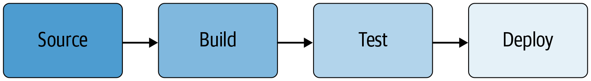
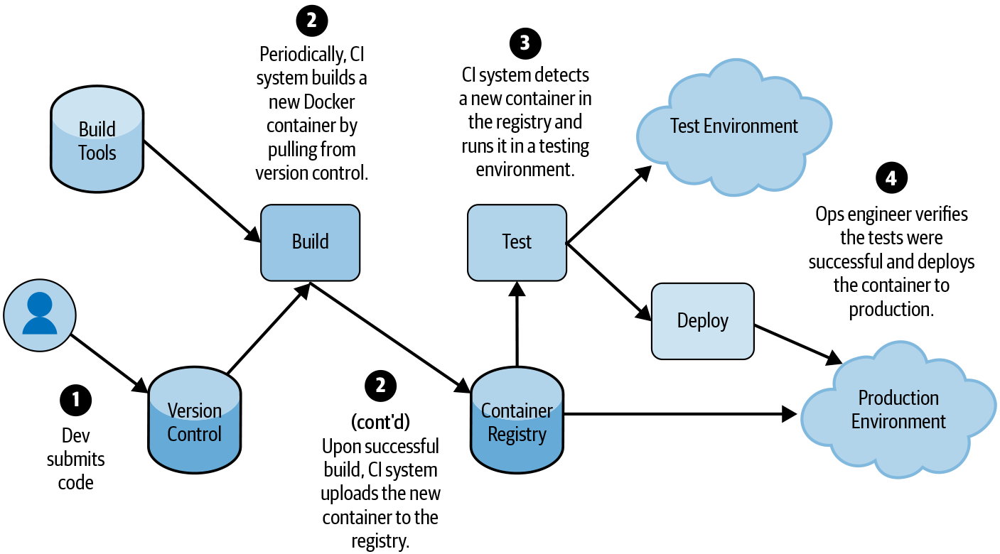
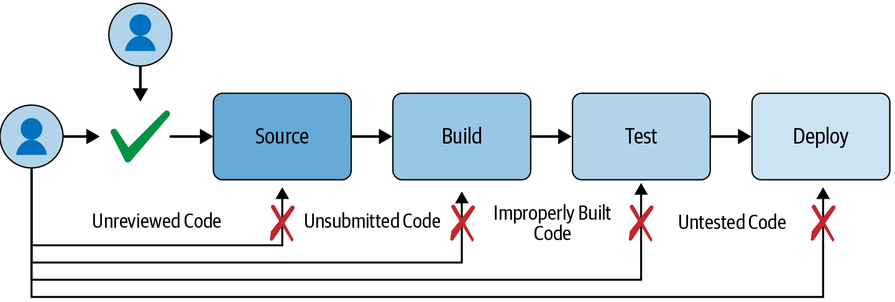
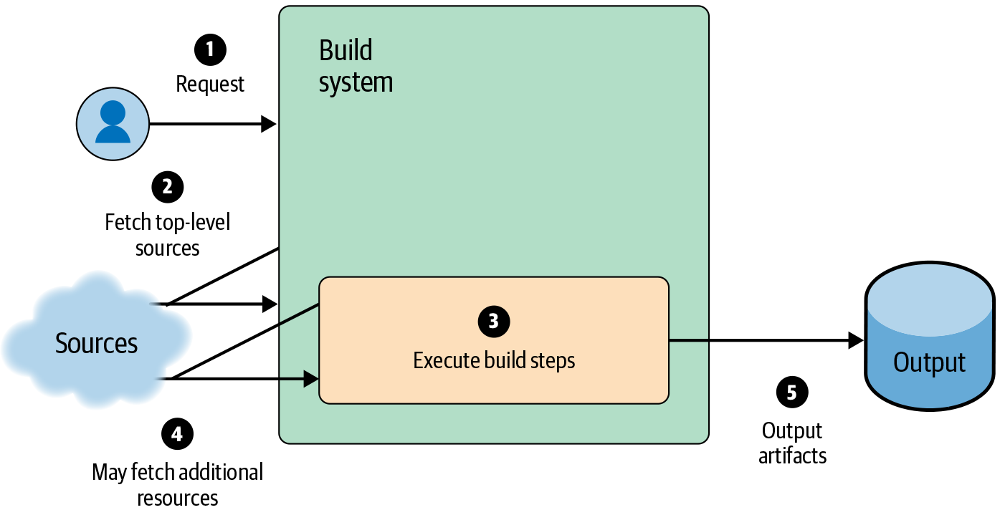
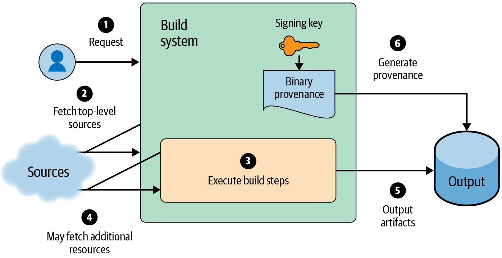
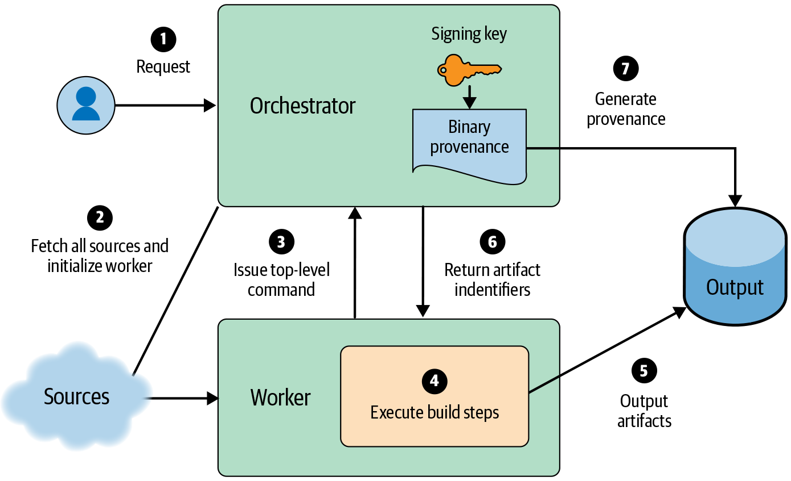
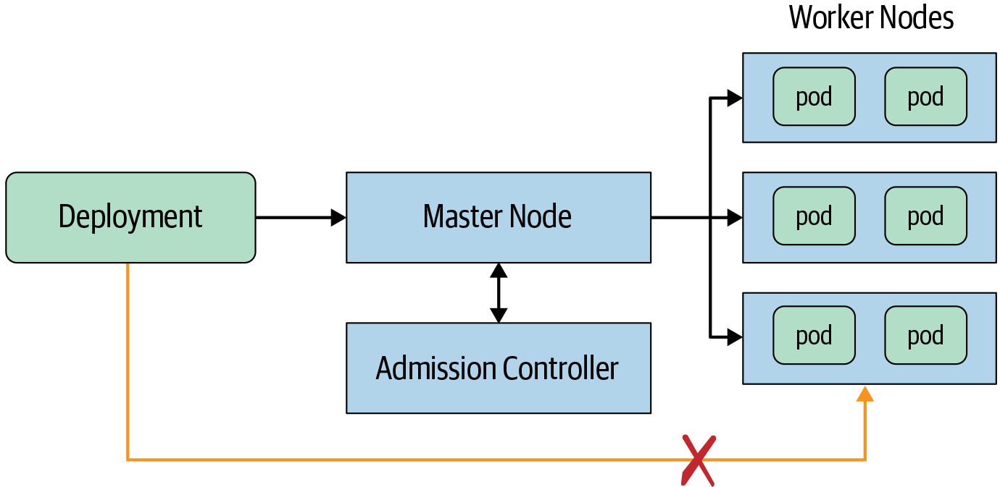
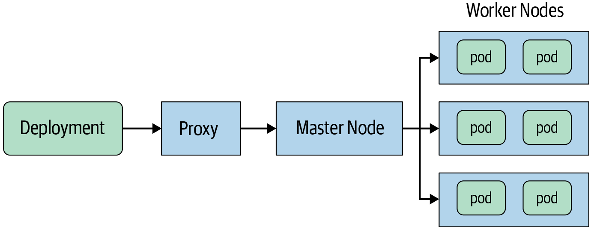

# Deploying Code

By Jeremiah Spradlin and Mark Lodato

with Sergey Simakov and Roxana Loza

> Is the code running in your production environment the code you assume it is? Your system needs controls to prevent or detect unsafe deployments: the deployment itself introduces changes to your system, and any of those changes might become a reliability or security issue. To keep from deploying unsafe code, you need to implement controls early in the software development lifecycle. This chapter begins by defining a software supply chain threat model and sharing some best practices to protect against those threats. We then deep dive into advanced mitigation strategies such as verifiable builds and provenance-based deployment policies, and conclude with some practical advice about how to deploy such changes.

Previous chapters addressed how to consider security and reliability when writing and testing your code. However, that code has no real impact until it’s built and deployed. Therefore, it’s important to carefully consider security and reliability for all elements of the build and deployment process. It can be difficult to determine if a deployed artifact is safe purely by inspecting the artifact itself. Controls on various stages of the software supply chain can increase your confidence in the safety of a software artifact. For example, code reviews can reduce the chance of mistakes and deter adversaries from making malicious changes, and automated tests can increase your confidence that the code operates correctly.

Controls built around the source, build, and test infrastructure have limited effect if adversaries can bypass them by deploying directly to your system. Therefore, systems should reject deployments that don’t originate from the proper software supply chain. To meet this requirement, each step in the supply chain must be able to offer proof that it has executed properly.

## Concepts and Terminology

We use the term *software supply chain* to describe the process of writing, building, testing, and deploying a software system. These steps include the typical responsibilities of a version control system (VCS), a continuous integration (CI) pipeline, and a continuous delivery (CD) pipeline.

While implementation details vary across companies and teams, most organizations have a process that looks something like [Figure 14-1](#a_high_level_view_of_a_typical_software):

1.  Code must be checked into a version control system.

2.  Code is then built from a checked-in version.

3.  Once built, the binary must be tested.

4.  Code is then deployed to some environment where it is configured and executed.



*Figure 14-1: A high-level view of a typical software supply chain*

Even if your supply chain is more complicated than this model, you can usually break it into these basic building blocks. [Figure 14-2](#typical_cloud_hosted_container_based_se) shows a concrete example of how a typical deployment pipeline executes these steps.

You should design the software supply chain to mitigate threats to your system. This chapter focuses on mitigating threats presented by insiders (or malicious attackers impersonating insiders), as defined in [Chapter 2](ch02.html#understanding_adversaries), without regard to whether the insider is acting with malicious intent. For example, a well-meaning engineer might unintentionally build from code that includes unreviewed and unsubmitted changes, or an external attacker might attempt to deploy a backdoored binary using the privileges of a compromised engineer’s account. We consider both scenarios equally.

In this chapter, we define the steps of the software supply chain rather broadly.

A *build* is any transformation of input artifacts to output artifacts, where an *artifact* is any piece of data—for example, a file, a package, a Git commit, or a virtual machine (VM) image. A *test* is a special case of a build, where the output artifact is some logical result—usually “pass” or “fail”—rather than a file or executable.



*Figure 14-2: Typical cloud-hosted container-based service deployment*

Builds can be chained together, and an artifact can be subject to multiple tests. For example, a release process might first “build” binaries from source code, then “build” a Docker image from the binaries, and then “test” the Docker image by running it in a development environment.

A *deployment* is any assignment of some artifact to some environment. You can consider each of the following to be a deployment:

- Pushing code:

  - Issuing a command to cause a server to download and run a new binary

  - Updating a Kubernetes Deployment object to pick up a new Docker image

  - Booting a VM or physical machine, which loads initial software or firmware

- Updating configuration:

  - Running a SQL command to change a database schema

  - Updating a Kubernetes Deployment object to change a command-line flag

- Publishing a package or other data, which will be consumed by other users:

  - Uploading a deb package to an apt repository

  - Uploading a Docker image to a container registry

  - Uploading an APK to the Google Play Store

Post-deployment changes are out of scope for this chapter.

## Threat Model

Before hardening your software supply chain to mitigate threats, you have to identify your adversaries. For the purpose of this discussion, we’ll consider the following three types of adversaries. Depending on your system and organization, your list of adversaries may differ:

- Benign insiders who may make mistakes

- Malicious insiders who try to gain more access than their role allows

- External attackers who compromise the machine or account of one or more insiders

[Chapter 2](ch02.html#understanding_adversaries) describes attacker profiles and provides guidance on how to model against insider risk.

Next, you must think like an attacker and try to identify all the ways an adversary can subvert the software supply chain to compromise your system. The following are some examples of common threats; you should tailor this list to reflect the specific threats to your organization. For the sake of simplicity, we use the term *engineer* to refer to benign insiders, and *malicious adversary* to refer to both malicious insiders and external attackers:

- An engineer submits a change that accidentally introduces a vulnerability to the system.

- A malicious adversary submits a change that enables a backdoor or introduces some other intentional vulnerability to the system.

- An engineer accidentally builds from a locally modified version of the code that contains unreviewed changes.

- An engineer deploys a binary with a harmful configuration. For example, the change enables debug features in production that were intended only for testing.

- A malicious adversary deploys a modified binary to production that begins exfiltrating customer credentials.

- A malicious adversary modifies the ACLs of a cloud bucket, allowing them to exfiltrate data.

- A malicious adversary steals the integrity key used to sign the software.

- An engineer deploys an old version of the code with a known vulnerability.

- The CI system is misconfigured to allow requests to build from arbitrary source repositories. As a result, a malicious adversary can build from a source repository containing malicious code.

- A malicious adversary uploads a custom build script to the CI system that exfiltrates the signing key. The adversary then uses that key to sign and deploy a malicious binary.

- A malicious adversary tricks the CD system to use a backdoored compiler or build tool that produces a malicious binary.

Once you’ve compiled a comprehensive list of potential adversaries and threats, you can map the threats you identified to the mitigations you already have in place. You should also document any limitations of your current mitigation strategies. This exercise will provide a thorough picture of the potential risks in your system. Threats that don’t have corresponding mitigations, or threats for which existing mitigations have significant limitations, are areas for improvement.

## Best Practices

The following best practices can help you mitigate threats, fill any security gaps you identified in your threat model, and continuously improve the security of your software supply chain.

### Require Code Reviews

Code review is the practice of having a second person (or several people) review changes to the source code before those changes are checked in or deployed.[^1] In addition to improving code security, code reviews provide multiple benefits for a software project: they promote knowledge sharing and education, instill coding norms, improve code readability, and reduce mistakes,[^2] all of which helps to build a culture of security and reliability (for more on this idea, see [Chapter 21](ch21.html#twoone_building_a_culture_of_security_a)).

From a security perspective, code review is a form of multi-party authorization,[^3] meaning that no individual has the privilege to submit changes on their own. As described in [Chapter 5](ch05.html#design_for_least_privilege), multi-party authorization provides many security benefits.

To be implemented successfully, code reviews must be mandatory. An adversary will not be deterred if they can simply opt out of the review! Reviews must also be comprehensive enough to catch problems. The reviewer must understand the details of any change and its implications for the system, or ask the author for clarifications—otherwise, the process can devolve into rubber-stamping.[^4]

Many publicly available tools allow you to implement mandatory code reviews. For example, you can configure GitHub, GitLab, or BitBucket to require a certain number of approvals for every pull/merge request. Alternatively, you can use standalone review systems like Gerrit or Phabricator in combination with a source repository configured to accept only pushes from that review system.

Code reviews have limitations with respect to security, as described in the introduction to [Chapter 12](ch12.html#writing_code). Therefore, they are best implemented as one “defense in depth” security measure, alongside automated testing (described in [Chapter 13](ch13.html#onethree_testing_code)) and the recommendations in [Chapter 12](ch12.html#writing_code).

### Rely on Automation

Ideally, automated systems should perform most of the steps in the software supply chain.[^5] Automation provides a number of advantages. It can provide a consistent, repeatable process for building, testing, and deploying software. Removing humans from the loop helps prevent mistakes and reduces toil. When you run the software supply chain automation on a locked-down system, you harden the system from subversion by malicious adversaries.

Consider a hypothetical scenario in which engineers manually build “production” binaries on their workstations as needed. This scenario creates many opportunities to introduce errors. Engineers can accidentally build from the wrong version of the code or include unreviewed or untested code changes. Meanwhile, malicious adversaries—including external attackers who have compromised an engineer’s machine—might intentionally overwrite the locally built binaries with malicious versions. Automation can prevent both of these outcomes.

Adding automation in a secure manner can be tricky, as an automated system itself might introduce other security holes. To avoid the most common classes of vulnerabilities, we recommend, at minimum, the following:

Move all build, test, and deployment steps to automated systems.  
At a minimum, you should script all steps. This allows both humans and automation to execute the same steps for consistency. You can use CI/CD systems (such as [Jenkins](https://jenkins.io)) for this purpose. Consider establishing a policy that requires automation for all new projects, since retrofitting automation into existing systems can often be challenging.

Require peer review for all configuration changes to the software supply chain.  
Often, treating configuration as code (as discussed shortly) is the best way to accomplish this. By requiring review, you greatly decrease your chances of making errors and mistakes, and increase the cost of malicious attacks.

Lock down the automated system to prevent tampering by administrators or users.  
This is the most challenging step, and implementation details are beyond the scope of this chapter. In short, consider all of the paths where an administrator could make a change without review—for example, making a change by configuring the CI/CD pipeline directly or using SSH to run commands on the machine. For each path, consider a mitigation to prevent such access without peer review.

For further recommendations on locking down your automated build system, see [Verifiable Builds](#verifiable_builds).

Automation is a win-win, reducing toil while simultaneously increasing reliability and security. Rely on automation whenever possible!

### Verify Artifacts, Not Just People

The controls around the source, build, and test infrastructure have limited effect if adversaries can bypass them by deploying directly to production. It is not sufficient to verify *who* initiated a deployment, because that actor may make a mistake or may be intentionally deploying a malicious change.[^6] Instead, deployment environments should verify *what* is being deployed.

Deployment environments should require proof that each automated step of the deployment process occurred. Humans must not be able to bypass the automation unless some other mitigating control checks that action. For example, if you run on Google Kubernetes Engine (GKE), you can use [Binary Authorization](https://cloud.google.com/binary-authorization/) to by default accept only images signed by your CI/CD system, and monitor the Kubernetes cluster audit log for notifications when someone uses the breakglass feature to deploy a noncompliant image.[^7]

One limitation of this approach is that it assumes that all components of your setup are secure: that the CI/CD system accepts build requests only for sources that are allowed in production, that the signing keys (if used) are accessible only by the CI/CD system, and so on. [Advanced Mitigation Strategies](#advanced_mitigation_strategies) describes a more robust approach of directly verifying the desired properties with fewer implicit assumptions.

### Treat Configuration as Code

A service’s configuration is just as critical to security and reliability as the service’s code. Therefore, all the best practices regarding code versioning and change review apply to configuration as well. Treat configuration as code by requiring that configuration changes be checked in, reviewed, and tested prior to deployment, just like any other change.[^8]

To provide an example: suppose your frontend server has a configuration option to specify the backend. If someone were to point your production frontend to a testing version of the backend, you’d have a major security and reliability problem.

Or, as a more practical example, consider a system that uses Kubernetes and stores the configuration in a [YAML](https://yaml.org) file under version control.[^9] The deployment process calls the `kubectl` binary and passes in the YAML file, which deploys the approved configuration. Restricting the deployment process to use only “approved” YAML—YAML from version control with required peer review—makes it much more difficult to misconfigure your service.

You can reuse all of the controls and best practices this chapter recommends to protect your service’s configuration. Reusing these approaches is usually much easier than other methods of securing post-deployment configuration changes, which often require a completely separate multi-party authorization system.

The practice of versioning and reviewing configuration is not nearly as widespread as code versioning and review. Even organizations that implement configuration-as-code usually don’t apply code-level rigor to configuration. For example, engineers generally know that they shouldn’t build a production version of a binary from a locally modified copy of the source code. Those same engineers might not think twice before deploying a configuration change without first saving the change to version control and soliciting review.

Implementing configuration-as-code requires changes to your culture, tooling, and processes. Culturally, you need to place importance on the review process. Technically, you need tools that allow you to easily compare proposed changes (i.e., `diff`, `grep`) and that provide the ability to manually override changes in case of emergency.[^10]

> **Don’t Check In Secrets!**
>
> Passwords, cryptographic keys, and authorization tokens are often necessary for a service to operate. The security of your system depends on maintaining the confidentiality of these secrets. Fully protecting secrets is outside the scope of this chapter, but we’d like to highlight several important tips:
>
> - Never check secrets into version control or embed secrets into source code. It may be feasible to embed *encrypted* secrets into source code or environment variables—for example, to be decrypted and injected by a build system. While this approach is convenient, it may make centralized secret management more difficult.
>
> - Whenever possible, store secrets in a proper secret management system, or encrypt secrets with a key management system such as [Cloud KMS](https://cloud.google.com/kms).
>
> - Strictly limit access to the secrets. Only grant services access to secrets, and only when needed. Never grant humans direct access. If a human needs access to a secret, it’s probably a password, not an application secret. Where this is a valid use, create separate credentials for humans and services.

## Securing Against the Threat Model

Now that we’ve defined some best practices, we can map those processes to the threats we identified earlier. When evaluating these processes with respect to your specific threat model, ask yourself: Are all of the best practices necessary? Do they sufficiently mitigate all the threats? [#example_threatscomma_with_their_corresp](#example_threatscomma_with_their_corresp) lists example threats, along with their corresponding mitigations and potential limitations of those mitigations.

| Threat                                                                                                                                         | Mitigation                                                                                                                                                                                                                                                                                                                                                  | Limitations                                                                                                                                                                                                                |
|------------------------------------------------------------------------------------------------------------------------------------------------|-------------------------------------------------------------------------------------------------------------------------------------------------------------------------------------------------------------------------------------------------------------------------------------------------------------------------------------------------------------|----------------------------------------------------------------------------------------------------------------------------------------------------------------------------------------------------------------------------|
| An engineer submits a change that accidentally introduces a vulnerability to the system.                                                       | Code review plus automated testing (see [Chapter 13](ch13.html#onethree_testing_code)). This approach significantly reduces the chance of mistakes.                                                                                                                                                                                                         |                                                                                                                                                                                                                            |
| A malicious adversary submits a change that enables a backdoor or introduces some other intentional vulnerability to the system.               | Code review. This practice increases the cost for attacks and the chance of detection—the adversary has to carefully craft the change to get it past code review.                                                                                                                                                                                           | Does not protect against collusion or external attackers who are able to compromise multiple insider accounts.                                                                                                             |
| An engineer accidentally builds from a locally modified version of the code that contains unreviewed changes.                                  | An automated CI/CD system that always pulls from the correct source repository performs builds.                                                                                                                                                                                                                                                             |                                                                                                                                                                                                                            |
| An engineer deploys a harmful configuration. For example, the change enables debug features in production that were intended only for testing. | Treat configuration the same as source code, and require the same level of peer review.                                                                                                                                                                                                                                                                     | Not all configuration can be treated “as code.”                                                                                                                                                                            |
| A malicious adversary deploys a modified binary to production that begins exfiltrating customer credentials.                                   | The production environment requires proof that the CI/CD system built the binary. The CI/CD system is configured to pull sources from only the correct source repository.                                                                                                                                                                                   | An adversary may figure out how to bypass this requirement by using emergency deployment breakglass procedures (see [Practical Advice](#practical_advice)). Sufficient logging and auditing can mitigate this possibility. |
| A malicious adversary modifies the ACLs of a cloud bucket, allowing them to exfiltrate data.                                                   | Consider resource ACLs as configuration. The cloud bucket only allows configuration changes by the deployment process, so humans can’t make changes.                                                                                                                                                                                                        | Does not protect against collusion or external attackers who are able to compromise multiple insider accounts.                                                                                                             |
| A malicious adversary steals the integrity key used to sign the software.                                                                      | Store the integrity key in a key management system that is configured to allow only the CI/CD system to access the key, and that supports key rotation. For more information, see [Chapter 9](ch09.html#design_for_recovery). For build-specific suggestions, see the recommendations in [Advanced Mitigation Strategies](#advanced_mitigation_strategies). |                                                                                                                                                                                                                            |

Example threats, mitigations, and potential limitations of mitigations {#example_threatscomma_with_their_corresp}

[Figure 14-3](#a_typical_software_supply_chainem_dasha) shows an updated software supply chain that includes the threats and mitigations listed in the preceding table.



*Figure 14-3: A typical software supply chain—adversaries should not be able to bypass the process*

We have yet to match several threats with mitigations from best practices:

- An engineer deploys an old version of the code with a known vulnerability.

- The CI system is misconfigured to allow requests to build from arbitrary source repositories. As a result, a malicious adversary can build from a source repository containing malicious code.

- A malicious adversary uploads a custom build script to the CI system that exfiltrates the signing key. The adversary then uses that key to sign and deploy a malicious binary.

- A malicious adversary tricks the CD system to use a backdoored compiler or build tool that produces a malicious binary.

To address these threats, you need to implement more controls, which we cover in the following section. Only you can decide whether these threats are worth addressing for your particular organization.

> **Trusting Third-Party Code**
>
> Modern software development commonly makes use of third-party and open source code. If your organization relies upon these types of dependencies, you need to figure out how to mitigate the risks they pose.
>
> If you fully trust the people who maintain the project, the code review process, the version control system, and the tamper-proof import/export process, then importing third-party code into your build is straightforward: pull in the code as though it originated from any of your first-party version control systems.
>
> However, if you have less than full trust in the people who maintain the project or the version control system, or if the project doesn’t guarantee code reviews, then you’ll want to perform some level of code review prior to build. You may even keep an internal copy of the third-party code and review all patches pulled from upstream.
>
> The level of review will depend on your level of trust in the vendor. It’s important to understand the third-party code you use and to apply the same level of rigor to third-party code as you apply to first-party code.
>
> Regardless of your trust in the vendor, you should always monitor your dependencies for vulnerability reports and quickly apply security patches.

## Advanced Mitigation Strategies

You may need complex mitigations to address some of the more advanced threats to your software supply chain. Because the recommendations in this section are not yet standard across the industry, you may need to build some custom infrastructure to adopt them. These recommendations are best suited for large and/or particularly security-sensitive organizations, and may not make sense for small organizations with low exposure to insider risk.

### Binary Provenance

Every build should produce *binary provenance* describing exactly how a given binary artifact was built: the inputs, the transformation, and the entity that performed the build.

To explain why, consider the following motivating example. Suppose you are investigating a security incident and see that a deployment occurred within a particular time window. You’d like to determine if the deployment was related to the incident. Reverse engineering the binary would be prohibitively expensive. It would be much easier to inspect the source code, preferably by looking at changes in version control. But how do you know what source code the binary came from?

Even if you don’t anticipate that you’ll need these types of security investigations, you’ll also need binary provenance for provenance-based deployment policies, as discussed later in this section.

### What to put in binary provenance

The exact information you should include in the provenance depends on the assumptions built into your system and the information that consumers of the provenance will eventually need. To enable rich deployment policies and allow for ad hoc analysis, we recommend the following provenance fields:

Authenticity (required)  
Connotes implicit information about the build, such as which system produced it and why you can trust the provenance. This is usually accomplished using a cryptographic signature protecting the rest of the fields of the binary provenance.[^11]

Outputs (required)  
The output artifacts to which this binary provenance applies. Usually, each output is identified by a cryptographic hash of the content of the artifact.

Inputs  
What went into the build. This field allows the verifier to link properties of the source code to properties of the artifact. It should include the following:

Sources  
The “main” input artifacts to the build, such as the source code tree where the top-level build command ran. For example: “Git commit `270f...ce6d` from `https://github.com/mysql/mysql-server`”[^12] or “file `foo.tar.gz` with SHA-256 content `78c5...6649`.”

Dependencies  
All other artifacts you need for the build—such as libraries, build tools, and compilers—that are not fully specified in the sources. Each of these inputs can affect the integrity of the build.

Command  
The command used to initiate the build. For example: “`bazel build //main:hello-world`”. Ideally, this field is structured to allow for automated analysis, so our example might become “`{"bazel": {"command": "build", "target": "//main:hello_world"}}`”.

Environment  
Any other information you need to reproduce the build, such as architecture details or environment variables.

Input metadata  
In some cases, the builder may read metadata about the inputs that downstream systems will find useful. For example, a builder might include the timestamp of the source commit, which a policy evaluation system then uses at deployment time.

Debug info  
Any extra information that isn’t necessary for security but may be useful for debugging, such as the machine on which the build ran.

Versioning  
A build timestamp and provenance format version number are often useful to allow for future changes—for example, so you can invalidate old builds or change the format without being susceptible to rollback attacks.

You can omit fields that are implicit or covered by the source itself. For example, Debian’s provenance format omits the build command because that command is always `dpkg-buildpackage`.

Input artifacts should generally list both an *identifier*, such as a URI, and a *version*, such as a cryptographic hash. You typically use the identifier to verify the authenticity of the build—for example, to verify that code came from the proper source repository. The version is useful for various purposes, such as ad hoc analysis, ensuring reproducible builds, and verification of chained build steps where the output of step *i* is the input to step *i*+1.

Be aware of the attack surface. You need to verify anything not checked by the build system (and therefore implied by the signature) or included in the sources (and therefore peer reviewed) downstream. If the user who initiated the build can specify arbitrary compiler flags, the verifier must validate those flags. For example, GCC’s `-D` flag allows the user to overwrite arbitrary symbols, and therefore also to completely change the behavior of a binary. Similarly, if the user can specify a custom compiler, then the verifier must ensure that the “right” compiler was used. In general, the more validation the build process can perform, the better.

For a good example of binary provenance, see Debian’s [deb-buildinfo](https://manpages.debian.org/jump?q=deb-buildinfo.5) format. For more general advice, see [the Reproducible Builds project’s documentation](https://reproducible-builds.org/docs/). For a standard way to sign and encode this information, consider [JSON Web Tokens (JWT)](https://jwt.io).

> **Code Signing**
>
> [Code signing](https://en.wikipedia.org/wiki/Code_signing) is often used as a security mechanism to increase trust in binaries. Use care when applying this technique, however, because a signature’s value lies entirely in what it represents and how well the signing key is protected.
>
> Consider the case of trusting a Windows binary, as long as it has any valid Authenticode signature. To bypass this control, an attacker can either [buy](http://legacydirs.umiacs.umd.edu/~tdumitra/papers/WEIS-2018.pdf) or [steal](https://www.symantec.com/connect/blogs/suckfly-revealing-secret-life-your-code-signing-certificates) a valid signing certificate, which perhaps costs a few hundred to a few thousand dollars (depending on the type of certificate). While this approach does have security value, it has limited benefit.
>
> To increase the effectiveness of code signing, we recommend that you explicitly list the signers you accept and lock down access to the associated signing keys. You should also ensure that the environment where code signing occurs is hardened, so an attacker can’t abuse the signing process to sign their own malicious binaries. Consider the process of obtaining a valid code signature to be a “deployment” and follow the recommendations laid out in this chapter to protect those deployments.

### Provenance-Based Deployment Policies

[Verify Artifacts, Not Just People](#verify_artifactscomma_not_just_people) recommends that the official build automation pipeline should verify what is being deployed. How do you verify that the pipeline is configured properly? And what if you want to make specific guarantees for some deployment environments that don’t apply to other environments?

You can use explicit deployment policies that describe the intended properties of each deployment environment to address these concerns. The deployment environments can then match these policies against the binary provenance of artifacts deployed to them.

This approach has several benefits over a pure signature-based approach:

- It reduces the number of implicit assumptions throughout the software supply chain, making it easier to analyze and ensure correctness.

- It clarifies the contract of each step in the software supply chain, reducing the likelihood of misconfiguration.

- It allows you to use a single signing key per build step rather than per deployment environment, since you can now use the binary provenance for deployment decisions.

For example, suppose you have a microservices architecture and want to guarantee that each microservice can be built only from code submitted to that microservice’s source repository. Using code signing, you would need one key per source repository, and the CI/CD system would have to choose the correct signing key based on the source repository. The disadvantage to this approach is that it’s challenging to verify that the CI/CD system’s configuration meets these requirements.

Using provenance-based deployment policies, the CI/CD system produces binary provenance stating the originating source repository, always signed with a single key. The deployment policy for each microservice lists which source repository is allowed. Verification of correctness is much easier than with code signing, because the deployment policy describes each microservice’s properties in a single place.

The rules listed in your deployment policy should mitigate the threats to your system. Refer to the threat model you created for your system. What rules can you define to mitigate those threats? For reference, here are some example rules you may want to implement:

- Source code was submitted to version control and peer reviewed.

- Source code came from a particular location, such as a specific build target and repository.

- Build was through the official CI/CD pipeline (see [Verifiable Builds](#verifiable_builds)).

- Tests have passed.

- Binary was explicitly allowed for this deployment environment. For example, do not allow “test” binaries in production.

- Version of code or build is sufficiently recent.[^13]

- Code is free of known vulnerabilities, as reported by a sufficiently recent security scan.[^14]

The [in-toto framework](https://in-toto.github.io) provides one standard for implementing provenance policies.

### Implementing policy decisions

If you implement your own engine for provenance-based deployment policies, remember that three steps are necessary:

1.  Verify that the *provenance is authentic*. This step also implicitly verifies the integrity of the provenance, preventing an adversary from tampering with or forging it. Typically, this means verifying that the provenance was cryptographically signed by a specific key.

2.  Verify that the *provenance applies to the artifact*. This step also implicitly verifies the integrity of the artifact, ensuring an adversary cannot apply an otherwise "good" provenance to a "bad" artifact. Typically, this means comparing a cryptographic hash of the artifact to the value found within the provenance’s payload.

3.  Verify that the *provenance meets all the policy rules*.

The simplest example of this process is a rule that requires artifacts to be signed by a specific key. This single check implements all three steps: it verifies that the signature itself is valid, that the artifact applies to the signature, and that the signature is present.

Let’s consider a more complex example: “Docker image must be built from GitHub repo `mysql/mysql-server`.” Suppose your build system uses key *K<sub>B</sub>* to sign build provenance in a JWT format. In this case, the schema of the token’s payload would be the following, where the subject, `sub`, is an [RFC 6920 URI](https://tools.ietf.org/html/rfc6920):

```
{
  "sub": "ni:///sha-256;...",
  "input": {"source_uri": "..."}
}
```

To evaluate whether an artifact satisfies this rule, the engine needs to verify the following:

1.  The JWT signature verifies using key *K<sub>B</sub>*.

2.  `sub` matches the SHA-256 hash of the artifact.

3.  `input.source_uri` is exactly `"https://github.com/mysql/mysql-server"`.

### Verifiable Builds

We call a build *verifiable* if the binary provenance produced by the build is trustworthy.[^15] Verifiability is in the eye of the beholder. Whether or not you trust a particular build system depends on your threat model and how the build system fits into your organization’s larger security story.

Consider whether the following examples of nonfunctional requirements are appropriate for your organization,[^16] and add any requirements that meet your specific needs:

- If a single developer’s workstation is compromised, the integrity of binary provenance or output artifacts is not compromised.

- An adversary cannot tamper with provenance or output artifacts without detection.

- One build cannot affect the integrity of another build, whether run in parallel or serial.

- A build cannot produce provenance containing false information. For example, the provenance should not be able to claim an artifact was built from Git commit `abc...def` when it really came from `123...456`.

- Nonadministrators cannot configure user-defined build steps, such as a Makefile or a Jenkins Groovy script, in a way that violates any requirement in this list.

- A snapshot of all source artifacts is available for at least *N* months after the build, to allow for potential investigations.

- A build is reproducible (see [#hermeticcomma_reproduciblecomma_or_veri](#hermeticcomma_reproduciblecomma_or_veri)). This approach may be desirable even if it is not required by the verifiable build architecture, as defined in the next section. For example, reproducible builds may be useful to independently reverify the binary provenance of an artifact after discovering a security incident or vulnerability.

### Verifiable build architectures

The purpose of a verifiable build system is to increase a verifier’s trust in the binary provenance produced by that build system. Regardless of the specific requirements for verifiability, three main architectures are available:

Trusted build service  
The verifier requires that the original build has been performed by a build service that the verifier trusts. Usually, this means that the trusted build service signs the binary provenance with a key accessible only to that service.

This approach has the advantages of needing to build only once and not requiring reproducibility (see [#hermeticcomma_reproduciblecomma_or_veri](#hermeticcomma_reproduciblecomma_or_veri)). Google uses this model for internal builds.

A rebuild you perform yourself  
The verifier reproduces the build on the fly in order to validate the binary provenance. For example, if the binary provenance claims to come from Git commit `abc...def`, the verifier fetches that Git commit, reruns the build commands listed in the binary provenance, and checks that the output is bit-for-bit identical to the artifact in question. See the following sidebar for more about reproducibility.

While this approach may initially seem appealing because you trust yourself, it is not scalable. Builds often take minutes or hours, whereas deployment decisions often need to be made in milliseconds. This also requires the build to be fully reproducible, which is not always practical; see the sidebar for more information.

Rebuilding service  
The verifier requires that some quorum of “rebuilders” have reproduced the build and attested to the authenticity of the binary provenance. This is a hybrid of the two previous options. In practice, this approach usually means that each rebuilder monitors a package repository, proactively rebuilds each new version, and stores the results in some database. Then, the verifier looks up entries in *N* different databases, keyed by the cryptographic hash of the artifact in question. Open source projects like [Debian](https://wiki.debian.org/ReproducibleBuilds) use this model when a central authority model is infeasible or undesirable.

> **Hermetic, Reproducible, or Verifiable?**
>
> The concepts of reproducible builds and hermetic builds are closely related to verifiable builds. Terminology in this area is not yet standard,[^17] so we propose the following definitions:
>
> Hermetic  
> All inputs to the build are fully specified up front, outside the build process. In addition to the source code, this requirement applies to all compilers, build tools, libraries, and any other inputs that might influence the build. All references must be unambiguous, either as fully resolved version numbers or cryptographic hashes. Hermeticity information is checked in as part of the source code, but it is also acceptable for this information to live externally, such as in a Debian [*.buildinfo* file](https://manpages.debian.org/jump?q=deb-buildinfo.5).
>
> Hermetic builds have the following benefits:
>
> - They enable build input analysis and policy application. Examples from Google include detecting vulnerable software that needs patching by using the Common Vulnerabilities and Exposures (CVE) database, ensuring compliance with open source licenses, and preventing software use that is disallowed by policy, such as a known insecure library.
>
> - They guarantee integrity of third-party imports—for example, by verifying cryptographic hashes of dependencies or by requiring that all fetches use HTTPS and come from trustworthy repositories.
>
> - They enable cherry-picking. You can fix a bug by patching the code, rebuilding the binary, and rolling it out to production without including any extraneous changes in behavior, such as behavior changes caused by a different compiler version. Cherry-picking significantly reduces the risk associated with emergency releases, which may not undergo as much testing and vetting as regular releases.
>
> Examples of hermetic builds include [Bazel](https://bazel.build) when run in sandboxed mode and [npm](https://www.npmjs.com) when using *package-lock.json*.
>
> Reproducible  
> Running the same build commands on the same inputs is guaranteed to produce bit-by-bit identical outputs. Reproducibility almost always requires hermeticity.[^18]
>
> Reproducible builds have the following benefits:
>
> - *Verifiability*—A verifier can determine the binary provenance of an artifact by reproducing the build themselves or by using a quorum of rebuilders, as described in [Verifiable Builds](#verifiable_builds).
>
> - *Hermeticity*—Nonreproducibility often indicates nonhermeticity. Continuously testing for reproducibility can help detect nonhermeticity early, thereby ensuring all the benefits of hermeticity described earlier.
>
> - *Build caching*—Reproducible builds allow for better caching of intermediate build artifacts in large build graphs, such as in Bazel.
>
> To make a build reproducible, you must remove all sources of nondeterminism and provide all information necessary to reproduce the build (known as the *buildinfo*). For example, if a compiler includes a timestamp in an output artifact, you must set that timestamp to a fixed value or include the timestamp in the buildinfo. In most cases, you must fully specify the full toolchain and operating system; different versions usually produce slightly different output. For practical advice, see the [Reproducible Builds website](https://reproducible-builds.org).
>
> Verifiable  
> You can determine the binary provenance of an artifact—information such as what sources it was built from—in a trustworthy manner. It is usually desirable (but not strictly required) for verifiable builds to also be reproducible and hermetic.

### Implementing verifiable builds

Regardless of whether a verifiable build service is a “trusted build service” or a “rebuilding service,” you should keep several important design considerations in mind.

At a basic level, almost all CI/CD systems function according to the steps in [Figure 14-4](#a_basic_cisoliduscd_system): the service takes in requests, fetches any necessary inputs, performs the build, and writes the output to a storage system.



*Figure 14-4: A basic CI/CD system*

Given such a system, you can add signed provenance to the output relatively easily, as shown in [Figure 14-5](#the_addition_of_signing_to_an_existing). For a small organization with a “central build service” model, this additional signing step may be sufficient to address security concerns.



*Figure 14-5: The addition of signing to an existing CI/CD system*

As the size of your organization grows and you have more resources to invest in security, you will likely want to address two more security risks: untrusted inputs and unauthenticated inputs.

#### Untrusted inputs

Adversaries can potentially use the inputs to the build to subvert the build process. Many build services allow nonadministrative users to define arbitrary commands to execute during the build process—for example, through the Jenkinsfile, *travis.yml*, the Makefile, or *BUILD*. This functionality is usually necessary to support the wide variety of builds an organization needs. However, from a security perspective, this functionality is effectively “Remote Code Execution (RCE) by design.” A malicious build command running in a privileged environment could do the following:

- Steal the signing key.

- Insert false information in the provenance.

- Modify the system state, influencing subsequent builds.

- Manipulate another build that’s happening in parallel.

Even if users are not allowed to define their own steps, compilation is a very complex operation that provides ample opportunity for RCE vulnerabilities.

You can mitigate this threat via privilege separation. Use a trusted orchestrator process to set up the initial known good state, start the build, and create the signed provenance when the build is finished. Optionally, the orchestrator may fetch inputs to address the threats described in the following subsection. All user-defined build commands should execute within another environment that has no access to the signing key or any other special privileges. You can create this environment in various ways—for example, through a sandbox on the same machine as the orchestrator, or by running on a separate machine.

#### Unauthenticated inputs

Even if the user and build steps are trustworthy, most builds have dependencies on other artifacts. Any such dependency is a surface through which adversaries can potentially subvert the build. For example, if the build system fetches a dependency over HTTP without TLS, an attacker can perform a man-in-the-middle attack to modify the dependency in transit.

For this reason, we recommend hermetic builds (see [#hermeticcomma_reproduciblecomma_or_veri](#hermeticcomma_reproduciblecomma_or_veri)). The build process should declare all inputs up front, and only the orchestrator should fetch those inputs. Hermetic builds give much higher confidence that the inputs listed in the provenance are correct.

Once you’ve accounted for untrusted and unauthenticated inputs, your system resembles [Figure 14-6](#an_quotation_markidealquotation_mark_ci). Such a model is much more resistant to attack than the simple model in [Figure 14-5](#the_addition_of_signing_to_an_existing).



*Figure 14-6: An “ideal” CI/CD design that addresses risks of untrusted and unauthenticated inputs*

### Deployment Choke Points

To “verify artifacts, not just people,” deployment decisions must occur at proper choke points within the deployment environment. In this context, a *choke point* is a point through which all deployment requests must flow. Adversaries can bypass deployment decisions that don’t occur at choke points.

Consider Kubernetes as an example for setting up deployment choke points, as shown in [Figure 14-7](#kubernetes_architectureem_dashall_deplo). Suppose you want to verify all deployments to the pods in a specific Kubernetes cluster. The control plane ("master") node would make a good choke point because all deployments are supposed to flow through it. To make this a proper choke point, configure the worker nodes to accept requests only from the control plane node. This way, adversaries cannot deploy directly to worker nodes.[^19]



*Figure 14-7: Kubernetes architecture—all deployments must flow through the control plane ("master" in this figure) node*

Ideally, the choke point performs the policy decision, either directly or via an RPC. Kubernetes offers an [Admission Controller](https://kubernetes.io/docs/reference/access-authn-authz/extensible-admission-controllers/) webhook for this exact purpose. If you use Google Kubernetes Engine, [Binary Authorization](https://cloud.google.com/binary-authorization/) offers a hosted admission controller and many additional features. And even if you don’t use Kubernetes, you may be able to modify your “admission” point to perform the deployment decision.

Alternatively, you can place a “proxy” in front of the choke point and perform the policy decision in the proxy, as shown in [Figure 14-8](#alternative_architecture_using_a_proxy). This approach requires configuring your “admission” point to allow access only via the proxy. Otherwise, an adversary can bypass the proxy by talking directly to the admission point.



*Figure 14-8: Alternative architecture using a proxy to make policy decisions*

### Post-Deployment Verification

Even when you enforce deployment policies or signature checks at deployment time, logging and post-deployment verification are almost always desirable, for the following reasons:

- *Policies can change*, in which case the verification engine must reevaluate existing deployments in the system to ensure they still comply with the new policies. This is particularly important when enabling a policy for the first time.

- The request might have been allowed to proceed because the decision service was unavailable. This *fail open* design is often necessary to ensure the availability of the service, especially when first rolling out an enforcement feature.

- An operator might have used a *breakglass mechanism* to bypass the decision in the case of an emergency, as described in the following section.

- Users need a way to *test* potential policy changes before committing them, to make sure that the existing state won’t violate the new version of the policy.

- For reasons similar to the “fail open” use case, users may also want a *dry run* mode, where the system always allows requests at deployment time but monitoring surfaces potential problems.

- Investigators may need the information after an incident for *forensics* reasons.

The enforcement decision point must log enough information to allow the verifier to evaluate the policy after the deployment.[^20] Logging of the full request is usually necessary but not always sufficient—if policy evaluation requires some other state, the logs must include that extra state. For example, we ran into this issue when implementing post-deployment verification for Borg: because “job” requests include references to existing “allocs” and “packages,” we had to join three log sources—jobs, allocs, and packages—to get the full state necessary to make a decision.[^21]

## Practical Advice

We’ve learned several lessons over the years while implementing verifiable builds and deployment policies in a variety of contexts. Most of these lessons are less about the actual technology choices, and more about how to deploy changes that are reliable, easy to debug, and easy to understand. This section contains some practical advice that we hope you’ll find useful.

### Take It One Step at a Time

Providing a highly secure, reliable, and consistent software supply chain will likely require you to make many changes—from scripting your build steps, to implementing build provenance, to implementing configuration-as-code. Coordinating all of those changes may be difficult. Bugs or missing functionality in these controls can also pose a significant risk to engineering productivity. In the worst-case scenario, an error in these controls can potentially cause an outage for your service.

You may be more successful if you focus on securing one particular aspect of the supply chain at a time. That way, you can minimize the risk of disruption while also helping your coworkers learn new workflows.

### Provide Actionable Error Messages

When a deployment is rejected, the error message must clearly explain what went wrong and how to fix the situation. For example, if an artifact is rejected because it was built from an incorrect source URI, the fix can be to either update the policy to allow that URI, or to rebuild from the correct URI. Your policy decision engine should give the user actionable feedback that provides such suggestions. Simply saying “does not meet policy” will likely leave the user confused and floundering.

Consider these user journeys when designing your architecture and policy language. Some design choices make providing actionable feedback for users very difficult, so try to catch these problems early. For example, one of our early policy language prototypes offered a lot of flexibility in expressing policies, but prevented us from supplying actionable error messages. We ultimately abandoned this approach in favor of a very limited language that allowed for better error messages.

### Ensure Unambiguous Provenance

Google’s verifiable build system originally uploaded binary provenance to a database asynchronously. Then at deployment time, the policy engine looked up the provenance in the database using the hash of the artifact as a key.

While this approach *mostly* worked just fine, we ran into a major issue: users could build an artifact multiple times, resulting in multiple entries for the same hash. Consider the case of the empty file: we had literally millions of provenance records tied to the hash of the empty file, since many different builds produced an empty file as part of their output. In order to verify such a file, our system had to check whether *any* of the provenance records passed the policy. This in turn resulted in two problems:

- When we failed to find a passing record, we had no way to provide actionable error messages. For example, instead of saying, “The source URI was *X*, but the policy said it was supposed to be *Y*,” we had to say, “None of these 497,129 records met the policy.” This was a bad user experience.

- Verification time was linear in the number of records returned. This caused us to exceed our 100 ms latency SLO by several orders of magnitude!

We also ran into issues with the asynchronous upload to the database. Uploads could fail silently, in which case our policy engine would reject the deployment. Meanwhile, users didn’t understand why it had been rejected. We could have fixed this problem by making the upload synchronous, but that solution would have made our build system less reliable.

Therefore, we strongly recommend making provenance unambiguous. Whenever possible, avoid using databases and instead *propagate the provenance inline with the artifact*. Doing so makes the overall system more reliable, lower latency, and easier to debug. For example, a system using Kubernetes can add an annotation that’s passed to the Admission Controller webhook.

### Create Unambiguous Policies

Similar to our recommended approach to an artifact’s provenance, the policy that applies to a particular deployment should be unambiguous. We recommend designing the system so that only a single policy applies to any given deployment. Consider the alternative: if two policies apply, do both policies need to pass, or can just one policy pass? It’s easier to avoid this question altogether. If you want to apply a global policy across an organization, you can do so as a meta-policy: implement a check that all of the individual policies meet some global criteria.

### Include a Deployment Breakglass

In an emergency, it may be necessary to bypass the deployment policy. For example, an engineer may need to reconfigure a frontend to divert traffic from a failing backend, and the corresponding configuration-as-code change might take too long to deploy through the regular CI/CD pipeline. A breakglass mechanism that bypasses the policy can allow engineers to quickly resolve outages and promotes a culture of security and reliability (see [Chapter 21](ch21.html#twoone_building_a_culture_of_security_a)).

Because adversaries may exploit the breakglass mechanism, all breakglass deployments must raise alarms and be audited quickly. In order to make auditing practical, breakglass events should be rare—if there are too many events, it may not be possible to differentiate malicious activity from legitimate usage.

## Securing Against the Threat Model, Revisited

We can now map advanced mitigations to our previously unaddressed threats, as shown in [#advanced_mitigations_to_complex_threat](#advanced_mitigations_to_complex_threat).

| Threat                                                                                                                                                                                         | Mitigation                                                                                                                                                                                                                                                  |
|------------------------------------------------------------------------------------------------------------------------------------------------------------------------------------------------|-------------------------------------------------------------------------------------------------------------------------------------------------------------------------------------------------------------------------------------------------------------|
| An engineer deploys an old version of the code with a known vulnerability.                                                                                                                     | The deployment policy requires the code to have undergone a security vulnerability scan within the last *N* days.                                                                                                                                           |
| The CI system is misconfigured to allow requests to build from arbitrary source repositories. As a result, a malicious adversary can build from a source repository containing malicious code. | The CI system generates binary provenance describing what source repository it pulled from. The production environment enforces a deployment policy requiring provenance to prove that the deployed artifact originated from an approved source repository. |
| A malicious adversary uploads a custom build script to the CI system that exfiltrates the signing key. The adversary then uses that key to sign and deploy a malicious binary.                 | The verifiable build system separates privileges so that the component that runs custom build scripts does not have access to the signing key.                                                                                                              |
| A malicious adversary tricks the CD system to use a backdoored compiler or build tool that produces a malicious binary.                                                                        | Hermetic builds require developers to explicitly specify the choice of compiler and build tool in the source code. This choice is peer reviewed like all other code.                                                                                        |

Advanced mitigations to complex threat examples {#advanced_mitigations_to_complex_threat}

With appropriate security controls around your software supply chain, you can mitigate even advanced and complex threats.

## Conclusion

The recommendations in this chapter can help you harden your software supply chain against various insider threats. Code reviews and automation are essential tactics for preventing mistakes and increasing attack costs for malicious actors. Configuration-as-code extends those benefits to configuration, which traditionally receives much less scrutiny than code. Meanwhile, artifact-based deployment controls, particularly those involving binary provenance and verifiable builds, bring protection against sophisticated adversaries and allow you to scale as your organization grows.

Together, these recommendations help ensure that the code you wrote and tested (following the principles in Chapters <a href="ch12.html#writing_code" data-xrefstyle="select:labelnumber">Chapter 12</a> and <a href="ch13.html#onethree_testing_code" data-xrefstyle="select:labelnumber">Chapter 13</a>) is the code that’s actually deployed in production. Despite your best efforts, however, your code probably won’t always behave as expected. When that happens, you can use some of the debugging strategies presented in the next chapter.
