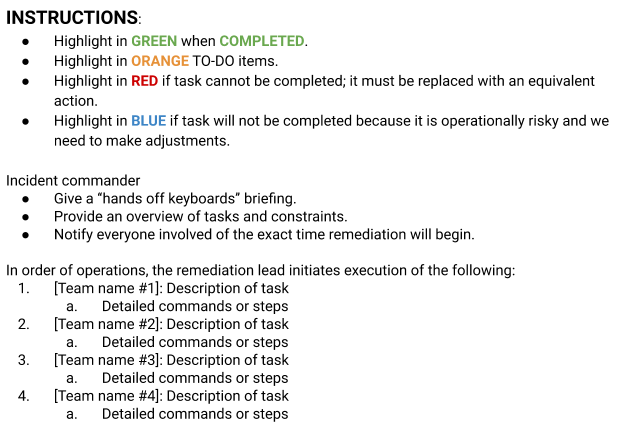
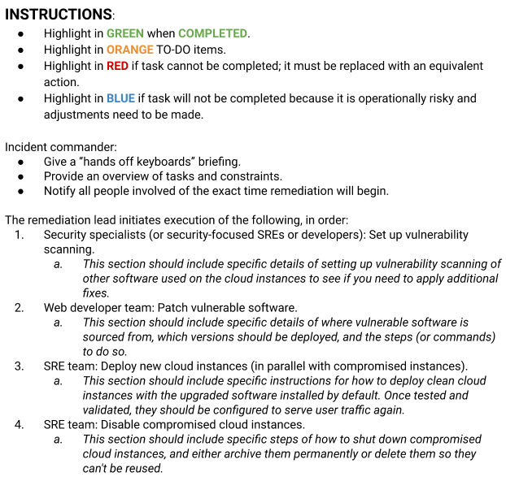
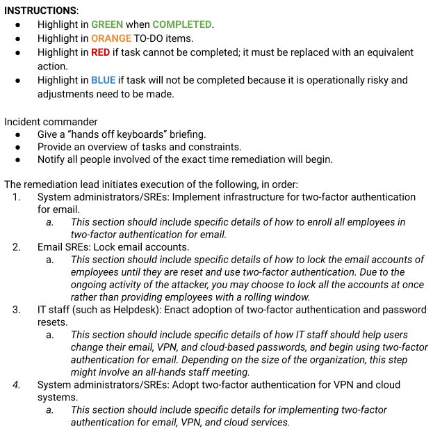

# Recovery and Aftermath

By Alex Perry, Gary O’Connor‎, and Heather Adkins

with Nick Soda

> To avoid service disruptions for your users, you need to be able to quickly recover from security- and reliability-related incidents. However, there’s a key difference when you are recovering from a security incident: your attacker. A persistent attacker can leverage ongoing access to your environment or reengage at any moment, even while you’re executing a recovery.
>
> In this chapter, we take a deep dive into what people designing, implementing, and maintaining systems need to know about recovering from attacks. The people performing recovery efforts often aren’t security professionals—they’re the people who build the affected systems and operate them every day. The lessons and examples in this chapter highlight how to keep your attacker at bay while you’re recovering. We walk through the logistics, timeline, planning, and initiation of the recovery phases. We also discuss key tradeoffs, like when to disrupt an attacker’s activity versus allowing them to remain on your systems so you can learn more about them.

If your organization experiences a serious incident, will you know how to recover? Who performs that recovery, and do they know what decisions to make? [Chapter 17 of the SRE book](https://landing.google.com/sre/sre-book/chapters/testing-reliability/) and [Chapter 9 of the SRE workbook](https://landing.google.com/sre/workbook/chapters/incident-response/) discuss practices for preventing and managing service outages. Many of those practices are also relevant to security, but recovering from security attacks has unique elements—particularly when the incident involves an active malicious attacker (see [Chapter 2](ch02.html#understanding_adversaries)). For this reason, while this chapter provides a general outline for handling many kinds of recovery efforts, we place a particular emphasis on what recovery engineers need to know about security attacks.

As we discuss in Chapters <a href="ch08.html#design_for_resilience" data-xrefstyle="select:labelnumber">Chapter 8</a> and <a href="ch09.html#design_for_recovery" data-xrefstyle="select:labelnumber">Chapter 9</a>, systems built according to good design principles can be resilient against attack and easily recoverable. This is true whether the system is a single compute instance, a distributed system, or a complex multitiered application. To facilitate recovery, a well-built system must also be integrated with crisis management tactics. As discussed in the previous chapter, effective crisis management entails a delicate balance between continuing to deter an attacker while restoring any injured assets to a known (potentially improved) good state. This chapter describes the nuanced considerations that good recovery checklists incorporate to achieve these goals.

In our experience, recovery engineers are often the people who design, implement, and maintain these systems every day. During an attack, you may need to call in security specialists for particular roles, such as performing forensic activities, triaging security vulnerabilities, or making nuanced decisions (see [Chapter 17](ch17.html#oneseven_crisis_management)), but recovering systems to a known good state requires the expertise that comes from working with the system every day. A partnership between incident coordination and recovery efforts allows security specialists and recovery engineers to bidirectionally share information to restore the system.

Recovering from security attacks often involves a far more ambiguous environment than preplanned playbooks can accommodate.[^1] An attacker can change their behavior mid-attack, and recovery engineers can make mistakes or discover unanticipated characteristics or details about their systems. This chapter presents a dynamic approach to recovery that aims to match the flexibility of your attacker.

The act of recovery can also be a powerful tool to jump-start improvements to your security posture. Recovery takes the form of both short-term tactical mitigations and long-term strategic improvements. We close this chapter with some ways to think about the continuum between a security incident, recovery, and the quiet period before the next incident.

## Recovery Logistics

As discussed in the previous chapter, a well-managed incident benefits from a parallelized response. Parallelization is especially beneficial during recovery. The individuals working on the recovery effort should be different from the people investigating the incident, for several reasons:

- The investigation phase of an incident is often time-consuming and detailed, requiring focus for long periods of time. During prolonged incidents, investigation teams often need a break by the time the recovery effort begins.

- The recovery phase of an incident may begin while your investigation is still ongoing. As a result, you’ll need separate teams that can work in parallel, feeding information to each other.

- The skills required for performing the investigation may be different from the skills required for the recovery effort.

When preparing for a recovery and considering your options, you should have a formalized team structure in place. Depending on the scope of the incident, this team can be as small as a single individual or as large as your whole organization. For more complicated incidents, we recommend creating coordination mechanisms like formal teams, frequent meetings, shared documentation repositories, and peer reviews. Many organizations model recovery team operations on their existing Agile development processes by using sprints, Scrum teams, and tight feedback loops.

> **On Roles and Responsibilities**
>
> The topics we cover in this chapter are applicable to organizations of all sizes, from a few people working on an open source project to small businesses and large companies. While we often refer to teams and formalized roles, these concepts are adaptable to any scale.
>
> For example, when we discuss setting up a formalized team structure, that structure could be an internal team of employees who each agree to take on one or more roles, or you could adapt the model by outsourcing some aspects of recovery to a third party—for example, by hiring a contractor to rebuild a system. Since recovery efforts often involve many parts of an organization, some of which may not normally handle crisis response, adaptability is especially important.

A well-organized recovery from a complex incident may look like a carefully choreographed ballet performance,[^2] with the actions of different individuals working on the recovery all affecting each other. It’s important that the dancers in the recovery ballet avoid stepping on one another’s feet. As such, you should clearly define roles for preparing, reviewing, and executing your recovery, making sure that everyone understands the operational risks and that participants communicate face-to-face frequently.

As the incident progresses, the incident commander (IC) and operations lead (OL) should appoint a remediation lead (RL) to begin planning the recovery, as described in [Chapter 17](ch17.html#oneseven_crisis_management). The RL should coordinate closely with the IC on a recovery checklist to ensure that the recovery effort aligns with the rest of the investigation. The RL is also responsible for assembling a team of individuals with relevant expertise and building out the recovery checklist (discussed in [Recovery Checklists](#recovery_checklists)).

At Google, the teams that perform recovery are the teams that build and run the systems day to day. These individuals include SREs, developers, system administrators, helpdesk personnel, and relevant security specialists that manage routine processes like code audits and configuration reviews.

Information management and communication during recovery are vital components of a successful response. Raw incident trails, scratch notes, recovery checklists, new operational documentation, and information about the attack itself will be important artifacts. Be sure that this documentation is available to recovery teams but inaccessible to the attacker; use something like an air-gapped computer for storage. For example, you might use a combination of information management tools like bug tracking systems, cloud-based collaboration tools, whiteboards, and even notecards taped to a wall. Make sure those tools are outside the broadest potential scope of the attacker’s compromise of your systems. Consider starting with notecards, and adding an independent service provider once you’re sure no recovery team members’ machines are compromised.

Good information management is another key aspect of ensuring a smooth recovery. Use resources that everyone can access and update in real time as issues arise or as checklist items are completed. If your recovery plan is only accessible to your remediation lead, this will be a roadblock to fast execution.

As you restore your systems, it’s also important to keep reliable notes about what happened during recovery. If you make a mistake along the way, your audit trail will help you fix any issues. Assigning dedicated note takers or documentation specialists can be a good idea. At Google, we leverage technical writers to optimize information management during our recovery efforts. We recommend reading [Chapter 21](ch21.html#twoone_building_a_culture_of_security_a), which discusses further organizational aspects.

## Recovery Timeline

The best time to start the recovery phase of an incident varies greatly depending on the nature of the investigation. If the affected infrastructure is mission-critical, you may choose to recover from an attack almost immediately. This is often the case when recovering from denial-of-service attacks. Alternatively, if your incident involves an attacker who has full control of your infrastructure, you may begin planning recovery almost immediately but execute the plan only when you fully understand what the attacker has done. The recovery processes we discuss in this chapter apply to any recovery timeline: while the investigation is still ongoing, after the investigation phase of an incident concludes, or during both of these phases.

Having enough information about the incident and understanding the scope of the recovery will inform which route to take. Typically, by the time you spin up a recovery operation, the investigation team has begun a postmortem document (perhaps in the form of preliminary raw notes), which the recovery team updates as they proceed. The information in this document will inform the recovery team’s planning phase (see [Planning the Recovery](#planning_the_recovery)), which should be completed before initiating the recovery (see [Initiating the Recovery](#initiating_the_recovery)).

As the initial plan may evolve over time, planning for and executing the recovery may overlap. However, *you shouldn’t begin recovery efforts without some sort of plan*. Likewise, we recommend creating recovery checklists before proceeding with your recovery. Your post-recovery actions (see [After the Recovery](#after_the_recovery)) should begin as soon as the recovery effort is complete. Allowing too much time to lapse between these two phases can lead you to forget the details of your earlier actions, or postpone work on necessary medium- and long-term fixes.

## Planning the Recovery

The goal of your recovery effort is to mitigate an attack and return your systems to their normal routine state, applying any necessary improvements along the way. Complex security events often require parallelizing incident management and setting up structured teams to execute on different parts of the incident.

The recovery planning process will rely on the information the investigation team discovers, and it’s important that you carefully plan your recovery before you take action. In these cases, you should begin planning for recovery as soon as you have sufficient baseline information about what the attacker has done. The following sections describe some preparation best practices and common pitfalls to avoid.

### Scoping the Recovery

How you define recovery for your incident will vary depending on the type of attack you’ve encountered. For example, it may be relatively straightforward to recover from a minor issue such as ransomware on a single machine: you simply reinstall the system. However, you’ll need a combination of multiple recovery strategies and skill sets from across your organization to recover from a nation-state actor with presence across your whole network who has exfiltrated sensitive data. Keep in mind that the effort required for recovery may not be proportional to the severity or sophistication of the attack. An organization unprepared for a simple ransomware attack may end up with many compromised machines and need to mount a resource-intensive recovery effort.

To initiate recovery from a security incident, your recovery team needs to have a complete list of the systems, networks, and data affected by the attack. They also need sufficient information about the attacker’s tactics, techniques, and procedures (TTPs) to identify any related resources that may be impacted. For example, if your recovery team discovers that a configuration distribution system has been compromised, this system is in scope for recovery. Any systems that received configurations from this system may also be in scope. The investigation team therefore needs to determine if the attacker modified any configurations, and whether those configs were pushed to other systems.

As mentioned in [Chapter 17](ch17.html#oneseven_crisis_management), ideally, the IC assigns someone to maintain action items in a mitigation doc for a formal postmortem (discussed in [Postmortems](#postmortems)) early in the investigation. The mitigation doc and subsequent postmortem will identify steps to address the root cause of the compromise. You need enough information to prioritize action items and classify them as either short-term mitigations (such as patching known vulnerabilities) or strategic long-term changes (such as changing build processes to prevent use of vulnerable libraries).

To understand how to protect these assets in the future, you should examine each directly or indirectly impacted asset in conjunction with your attacker’s behaviors. For example, if your attacker was able to exploit a vulnerable software stack on a web server, your recovery will require understanding the attack so you can patch the hole in any other systems running the package. Similarly, if your attacker gained access by phishing the account credentials of a user, your recovery team needs to plan a way to stop another attacker from doing the same thing tomorrow. Take care to understand what assets an attacker may be able to leverage for a future attack. You might consider making a list of the attacker’s behaviors and possible defenses for your recovery effort, as we did in [Chapter 2](ch02.html#understanding_adversaries) (see [#cyber_kill_chain_of_a_hypothetical_atta](#cyber_kill_chain_of_a_hypothetical_atta)). You can use this list as operational documentation to explain why you’re introducing certain new defenses.

Assembling a list of compromised assets and short-term mitigations requires a tight loop of communication and feedback involving your postmortem notes, the investigation teams, and the incident commander. Your recovery team will need to learn about new investigation findings as soon as possible. Without efficient exchange of information between the investigation and recovery teams, attackers can bypass mitigation efforts. Your recovery plan should also make room for the possibility that your attacker is still present and watching your actions.

### Recovery Considerations

As you’re designing the recovery phase of the incident, you may run into several open-ended questions that are difficult to answer. This section covers some common pitfalls and ideas about how you can balance tradeoffs. These principles will feel familiar to security specialists who often handle complex incidents, but the information is relevant to anyone participating in recovery efforts. Before you make a decision, ask yourself the following questions.

### How will your attacker respond to your recovery effort?

Your mitigation and recovery checklist (see [Recovery Checklists](#recovery_checklists) and [Examples](#examples)) will include severing any connection your attacker has to your resources and ensuring they can’t return. Implementing this step is a delicate balancing act requiring near-perfect knowledge of the attack and a solid plan to execute the ejection. A mistake can lead to your attacker taking additional actions that you may not anticipate or have visibility into.

Consider this example: during an incident, your investigation team discovers that an attacker has compromised six systems, but the team can’t determine how that initial attack began. It’s even unclear how your attacker got access to any of your systems in the first place. Your recovery team creates and enacts a plan to rebuild those six compromised systems. In this scenario, the recovery team is acting without full knowledge of how the attack began, how the attacker will respond, or whether the attacker is still active on other systems. An attacker who is still active will be able to see from their position in another compromised system that you’ve taken those six systems offline, and may proceed to destroy the rest of the infrastructure that remains accessible.

In addition to compromising your systems, attackers can also eavesdrop on email, bug tracking systems, code changes, calendars, and other resources that you’ll probably want to use to coordinate your recovery. Depending on the severity of the incident and the type of compromise you’re recovering from, you may want to conduct your investigation and recovery using systems that aren’t visible to the attacker.

Consider a recovery team that’s coordinating over an instant messaging system while one of the team member’s accounts is compromised. The attacker, who is also logged in and watching the chat, can see all the private communications while recovery is happening—including any known elements of the investigation. The attacker might even be able to infer information the recovery team doesn’t know. Your attacker might use this knowledge to compromise even more systems in a different way, bypassing all visibility the investigation team may have. In this scenario, the recovery team should have set up a new instant messaging system and deployed new machines—for example, inexpensive Chromebooks—for responder communication.

These examples may seem extreme, but they illustrate a very simple point: there’s a human on the other side of the attack who is reacting to your incident response. Your recovery plan should consider what actions that human may take after learning of your plans. You should seek to fully understand the attacker's access and take action to minimize the risk of further harm.

Today, security incident responders generally agree that you should wait until you have a full understanding of an attack before ejecting the attacker. This prevents the attacker from observing your mitigations and helps you to respond defensively.

While this is good advice, apply it carefully. If your attacker is doing something dangerous already (such as taking sensitive data or destroying systems), you may choose to act before you have a complete picture of their actions. If you choose to eject the attacker before you have full knowledge of their intent and the scope of the attack, you’re entering into a game of chess. Prepare accordingly, and know the steps you need to take to reach checkmate!

If you’re handling a complex incident, or if an active attacker is interacting with your systems, your recovery plan should include tight integration with the investigation team to ensure that the attacker is not regaining access to your systems or working around your mitigations. Make sure to inform the investigation team of your recovery plans—they should be confident that your plans will stop the attack.

### Is your recovery infrastructure or tooling compromised?

In the early stages of recovery planning, it’s important to determine what infrastructure and tooling you need to conduct your response and ask your investigation team whether they believe these recovery systems are compromised. Their answer will determine whether or not you can perform a safe recovery, and what additional remediation steps you may need to prepare for a more complete response.

For example, imagine that an attacker has compromised several laptops on your network and the configuration server that governs their setup. In this case, you need a remediation plan for the configuration server before you can rebuild any compromised laptops. Similarly, if an attacker has introduced malicious code into your custom backup restoration tool, you need to find their changes and restore the code to normal before recovering any data.

More importantly, you must consider how you will recover assets—whether systems, applications, networks, or data—that are located on infrastructure currently under the attacker’s control. Recovering an asset while the attacker has control of the infrastructure can lead to a repeat compromise from the same attacker. A common recovery pattern in these situations is to set up a “clean” or “safe” version of the asset, such as a clean network or system, that’s isolated from any compromised versions. This may mean completely replicating your entire infrastructure, or at least key parts of it.

To return to our example of a compromised configuration server, you may choose to create a quarantined network and rebuild this system with a fresh operating system install. You can then manually configure the system so that you can bootstrap new machines from it without introducing any attacker-controlled configurations.

### What variants of the attack exist?

Suppose your investigation team reports that an attacker has exploited a buffer overflow vulnerability against your web serving infrastructure. While the attacker gained access to only a single system, you know that 20 other servers are running the same flawed software. When planning your recovery, you should address the one system that’s known to be compromised, but also consider two other factors: whether the other 20 servers are also compromised, and how you will mitigate the effects of the vulnerability for all of these machines in the future.

> **Repeating Risks**
>
> Imagine that a large ship needs to hold its position at sea. The ship drops anchor and inadvertently hooks onto an undersea cable, which isn’t strong enough and breaks. While the risk of a vessel snagging an undersea cable is small, the effects can be catastrophic, having a huge impact on intercontinental network capacity—and this risk exists for all the undersea cables in the world, not just the one that happened to have been hooked by that one errant ship. A network outage of this type should prompt an analysis of the broader category of risk. For example, future capacity planning should incorporate this newly discovered category of outages to ensure sufficient redundant capacity.

It’s also worth considering if your systems are susceptible (in the short term) to variations of the type of attack that you’re currently experiencing. In the buffer overflow example, your recovery planning should look for any related software vulnerabilities in the infrastructure—either a related vulnerability class, or the same vulnerability in another piece of software. This consideration is especially important in custom-built code or where you’re using shared libraries. We cover several options for testing for variants, such as fuzzing, in [Chapter 13](ch13.html#onethree_testing_code).

If you’re using open source or commercial software and testing variants is beyond your control, hopefully the people who maintain the software have themselves considered possible attack variants and implemented the necessary protections. It’s worth checking for available patches for other parts of your software stack and including a broad series of upgrades as part of your recovery.

### Will your recovery reintroduce attack vectors?

Many recovery methods seek to restore affected resources to a known good state. This effort may rely on system images, source code stored in repositories, or configurations. A key consideration for your recovery should be whether your recovery actions will reintroduce attack vectors that make your system vulnerable, or regress any durability or safety progress you have made. Consider a system image that contains vulnerable software allowing an attacker to compromise the system. If you reuse this system image during recovery, you will reintroduce the vulnerable software.

This form of vulnerability reintroduction is a common pitfall in many environments—including modern cloud computing and on-premise environments—that rely on “golden images” that commonly consist of whole system snapshots. It’s important to update these golden images and delete compromised snapshots before the systems come back online, either at the source or immediately after install.

If your attacker was able to modify parts of your recovery infrastructure (for example, the configurations stored in a source code repository), and you restore the system using these compromised settings, you’ll set your recovery back by persisting the attacker’s changes. Restoring your system to a good state may require going far back in time to avoid such a regression. This also means you’ll need to think carefully about the attack timeline: when did the attacker make modifications, and how far back do you need to go to revert their changes? If you can’t determine the exact time the attacker made a modification, you may need to rebuild large parts of your infrastructure in parallel from scratch.

When recovering systems or data from traditional backups (such as tape backups), you should consider whether your system also backed up your attacker’s modifications. You should either destroy or quarantine any backups or data snapshots that contain evidence of your attacker for later analysis.

### What are your mitigation options?

Following good practices for resilient design in your systems (see [Chapter 9](ch09.html#design_for_recovery)) can help you to recover quickly from security incidents. If your service is a distributed system (as opposed to a monolithic binary), you can apply security fixes to individual modules relatively quickly and easily: you can perform an “in-place” update to a flawed module without introducing significant risk to the surrounding modules. Similarly, in cloud computing environments, you can establish mechanisms to shut down compromised containers or virtual machines and rapidly replace them with known good versions.

However, depending on the assets that your attacker has compromised (such as machines, printers, cameras, data, and accounts), you may find that you are left with a number of less than ideal mitigation choices. You might have to decide which option is the least bad, and incur varying degrees of technical debt for the short-term gain of permanently ejecting the attacker from your systems. For example, to block an attacker’s access, you may choose to manually add a deny rule to the live configuration of a router. To prevent the attacker from seeing the change you’re making, you might bypass normal procedures for having such changes peer reviewed and tracked in a version control system. In this situation, you should disable automatic rule pushes until you add the new firewall rules to the canonical version of the configuration. You should also set a reminder to reenable those automatic rule pushes at some point in the future.

When deciding whether to accept technical debt during your short-term mitigations to eject the attacker, ask yourself the following questions:

- How quickly (and when) can we replace or remove these short-term mitigations? In other words, how long will this technical debt be in place?

- Is the organization committed to maintaining the mitigation for the duration of its lifetime? Are the teams that own the new technical debt willing to accept that debt and pay it off later, through improvements?

- Will the mitigation affect the uptime of our systems, and will we exceed our error budgets?[^3]

- How can people in the organization recognize this mitigation as short term? Consider tagging the mitigation as technical debt to be removed later so that its status is visible to anyone else working on the system. For example, add comments to code and descriptive commit or push messages so that anyone who relies on the new functionality knows it might change or disappear in the future.

- How can a future engineer with no domain expertise regarding the incident prove that the mitigation is no longer necessary, and that they can remove it without creating risk?

- How effective will the short-term mitigation be if left in place for a long time (either accidentally or through circumstance)? Imagine an attacker has compromised one of your databases. You decide to keep the database online while you sanitize and migrate the data to a new system. Your short-term mitigation is to isolate the database on a separate network. Ask yourself: What will the effect be if that migration takes six months instead of the intended two weeks? Will people in the organization forget that the database was compromised and accidently reconnect it to safe networks?

- Has a domain expert identified the loopholes in your answers to the preceding questions?

### Recovery Checklists

Once you’ve figured out the scope of the recovery, you should lay out your options (as discussed in [Initiating the Recovery](#initiating_the_recovery)) and carefully consider the tradeoffs you need to make. This information forms the basis of your recovery checklist (or several checklists, depending on the complexity of your incident). Every recovery effort you make should leverage routine and tested practices. Thoroughly documenting and sharing your recovery steps makes it easier for the people involved in the incident response to collaborate and advise on the recovery plan. A well-documented checklist also enables your recovery team to identify areas of effort that you can parallelize and helps you coordinate the work.

As shown in the template recovery checklist in [Figure 18-1](#checklist_template), each item on the checklist maps to an individual task and the corresponding skills required for its completion.[^4] Individuals on your recovery team can claim tasks based on their skills. The incident commander can then be confident that all checked-off recovery steps have been completed.

Your checklist should contain all the relevant details, such as specific tools and commands to use for the recovery. That way, when you start your cleanup efforts, all the team members will have clear, agreed-upon guidance about what tasks need to be completed, and in what order. The checklist should also account for any cleanup steps or rollback procedures you’ll need in case the plan fails. We’ll use the template checklist in [Figure 18-1](#checklist_template) in the worked examples at the end of the chapter.

*Figure 18-1: Checklist template*

## Initiating the Recovery

After a security incident, the safe and reliable recovery of your system relies heavily on effective processes, such as carefully constructed checklists. Depending on the type of incident you are managing, you will need to consider effective technical options. The goal of your mitigation and recovery effort is to eject the attacker from your environment, ensure they can’t return, and make your system more secure. [Chapter 9](ch09.html#design_for_recovery) covers principles for designing recovery options into a system ahead of time. This section covers the practical realities of executing recovery with these principles in mind, and the pros and cons of making certain decisions.

### Isolating Assets (Quarantine)

*Isolation* (also referred to as a *quarantine*) is a very common technique for mitigating the effects of an attack. A classic example is antivirus software that moves a malicious binary into a quarantine folder, where file permissions prevent anything else on the system from reading or executing the binary. Quarantine is also commonly used to isolate a single compromised host. You can quarantine a host either at the network level (for example, by disabling the switch port) or on the host itself (for example, by disabling networking). You can even quarantine entire networks of compromised machines using network segmentation—many DoS response strategies move services away from affected networks.

> **BeyondCorp**
>
> At Google, the Zero Trust concept of our [BeyondCorp architecture](https://cloud.google.com/beyondcorp/#researchPapers) lets us easily mitigate incidents by using isolation. By default, architectures like BeyondCorp amplify quarantine and isolation techniques during attack mitigation.
>
> BeyondCorp mandates that we trust assets only after we’ve validated their security posture and they’re approved to talk to corporate services. As a result, there is little trust between assets. This creates a natural isolation boundary that prevents common attacker techniques like *lateral movement* (the movement between two machines on the network). Access to services is well defined via proxy infrastructure and strong credentials, which can be revoked at any time.

Isolating assets can also be useful if you need to leave compromised infrastructure running. Consider a scenario in which one of your critical databases has been compromised. Because of its importance, you need to keep the database online during mitigation—perhaps this database is mission-critical and will take several weeks to rebuild, and your organization doesn’t want to shut down its entire business for that long. You may be able to curtail the attacker’s influence by isolating the database on a network of its own and placing restrictions on what network traffic it can send and receive (to/from the internet and to the rest of your infrastructure).

A word of warning: leaving compromised assets online is a pernicious form of technical debt. If you don’t address this debt in a timely fashion and leave them online for longer than intended, these compromised assets can incur substantial damage. This may happen for several reasons: because this is the only copy of the quarantined data (no backups), because there are challenges to replacing the quarantined asset, or because people simply forget about the compromised assets during the hustle and bustle of an incident. In a worst-case scenario, someone new to your organization (or the incident) may even unquarantine a compromised resource!

Consider ways you can mark these assets as compromised, such as using highly visible stickers on the devices, or keeping an up-to-date list of MAC addresses of quarantined systems and monitoring for whether these addresses appear on your network. Stickers proactively aim to avoid reuse, while the address list enables fast reactive removal. Be sure your recovery checklist and postmortem cover whether any quarantined assets are safely and permanently remediated.

### System Rebuilds and Software Upgrades

Consider the following conundrum: you’ve discovered an attacker’s malware on three systems and are entering into the recovery phase of the incident. To eject the attacker, do you delete the malware and leave the systems running, or do you reinstall the systems? Depending on the complexity and criticality of your systems, you may have to consider the tradeoffs between these options. On the one hand, if the affected systems are mission-critical and difficult to rebuild, you may be tempted to delete the attacker’s malware and move on. On the other hand, if the attacker has installed multiple types of malware and you don’t know about all of them, you may end up missing the opportunity for a comprehensive cleanup. Typically, reinstalling systems from scratch with known good images and software is the best solution.[^5]

If you’ve operated your environment using reliable and secure design principles, rebuilding your systems or upgrading software should be relatively straightforward. [Chapter 9](ch09.html#design_for_recovery) provides some tips on knowing the state of your system, including host management and firmware.

For example, if you’re using a system with hardware-backed boot verification that follows a cryptographic chain of trust up through the operating system and applications (Chromebooks are a good example), then restoring your systems is simply a matter of power cycling, which returns the system to a known good state. Automated release systems like Rapid (as discussed in [Chapter 8 of the SRE book](https://landing.google.com/sre/sre-book/chapters/release-engineering/)) can also provide a reliable and predictable way to apply software updates during recovery. In cloud computing environments, you can rely on instantaneous container and software releases to replace any compromised systems with a safe standard image.

If you are entering the recovery phase of an incident without mechanisms like source code control systems, or standard system images to manage configurations or systems using known good versions, consider introducing such mechanisms as part of your short-term recovery plan. There are open source options for managing system builds, such as [Bazel](https://bazel.info); configurations, such as [Chef](https://chef.io); and application integration and deployment, such as [Helm](https://helm.sh) for Kubernetes. Adopting new solutions in a short time frame may seem daunting at first, and when setting up these solutions, you may need to make a rough first pass at the correct configuration. If figuring out the right configuration will entail time and effort at the expense of other important technical work, you may need to refine your configuration later. Make sure you carefully consider the technical debt you’re accumulating in exchange for short-term security wins, and have a plan to improve the setup of such new systems.

### Data Sanitization

Depending on the scope of your incident, you should confirm that your attacker hasn’t tampered with your source code, binaries, images, and configurations, or the systems you use to build, manage, or release them. One common technique for sanitizing your system ecosystem is to obtain known good copies from their original source (such as open source or commercial software providers), backups, or uncompromised version control systems. Once you have a known good copy, you can perform checksum comparisons of the versions you want to use against known good states and packages. If your old good copies are hosted on compromised infrastructure, make sure you have high confidence that you know when the attacker began tampering with your systems, and be sure to review your data sources.

Strong binary provenance of where your code comes from (as discussed in [Chapter 14](ch14.html#onefour_deploying_code)) makes recovery more straightforward. Imagine that you discover your attacker has introduced malicious code into the `glibc` library used on your build system. You need to identify all the binaries built during the “at risk” time frame, where those binaries were deployed, and any dependencies they have. When performing this examination, clearly mark the known compromised code, libraries, and binaries. You should also create tests that will prevent you from reintroducing vulnerable or backdoored code. These precautions will ensure that others on your recovery team don’t inadvertently use compromised code during the recovery or accidently reintroduce vulnerable versions.

You should also check to see if your attacker tampered with any application-level data, such as records in a database. As discussed in [Chapter 9](ch09.html#design_for_recovery), ensuring strong cryptographic integrity of your backups increases your confidence in those backups, and allows you to be sure that any comparisons you need to make against potentially compromised live data are accurate. Reconciling changes made by an attacker may also be quite complex and require you to build special tooling. For example, in order to make use of partial restore, you may need custom tools to splice files or records obtained from backups into your production systems, while also performing a simultaneous integrity check. Ideally, you should build and test these tools when developing your reliability strategy.

### Recovery Data

Recovery processes often rely on tools that support a range of operations, such as rollbacks, restores, backups, hermetic rebuilds, and transaction playbacks. [Persistent data](ch09.html#persistent_data) discusses securely storing data used for these operations.

Many of these tools have parameters that trade speed of progress against data safety. We don’t recommend changing those parameters from their defaults unless the tools are regularly tested against realistic production-scale workloads. Testing, staging, or (even worse) mocks do not exercise infrastructure systems realistically. For example, it’s difficult to realistically simulate the delay it takes for memory caches to fill up or for load-balancing estimators to stabilize outside of realistic production conditions. Those parameters vary by service, and since the delay is usually visible in monitoring data, you should tune those settings between incidents. Dealing with a tool that misbehaves when you’re trying to recover from a hostile security attack is as challenging as facing a new attacker.

You may already have monitoring in place to detect significant data loss due to software errors. It’s also possible that your attacker avoided setting off these alerts. Even so, it’s always worth reviewing these logs: the data may identify an inflection point where an attack started. If the metrics reveal such a point, you now have an independent lower bound of how many backups to skip.

An in-place restore of an insufficiently old backup could reactivate any compromises that were backed up during the incident. If it took a while to detect the intrusion, your oldest “safe” backup may have already been overwritten. If so, data remediation may be your only option.

A restored backup can contain desirably modified data interspersed with corrupted data. This corruption may be caused by a malicious change (by the attacker) or a random event (such as a tape going bad or a hard drive failure). Tools that rebuild data tend to focus on recovery from either random damage or malicious damage, but not both. It’s important to understand which functionality your recovery and rebuild tools provide, along with the limitations of the approach. Otherwise, the results of data recovery may not match your expectations. Using routine integrity procedures—for example, verifying recovered data against known good cryptographic signatures—will help here. Ultimately, redundancy and testing are the best defenses against random events.

### Credential and Secret Rotation

It’s common for attackers to hijack existing accounts used within your infrastructure to impersonate legitimate users or services. For example, attackers carrying out a password phishing attack might try to obtain the credentials for an account they can use to log in to your systems. Similarly, through techniques like pass-the-hash,[^6] attackers can obtain and reuse credentials, including credentials for administrator accounts. [Chapter 9](ch09.html#design_for_recovery) discusses another scenario: the compromise of the SSH *authorized_keys* file. During recovery, you often need to rotate credentials for your system, user, service, and application accounts via methods such as key rotation (e.g., of the keys used in SSH authentication). Depending on what your investigation reveals, ancillary devices such as network devices and out-of-band management systems, as well as cloud-based services like SaaS applications, may also be in scope.

Your environment may have other secrets that need attention, such as keys used for encryption of data at rest and cryptographic keys used for SSL. If your frontend web serving infrastructure is compromised or potentially accessible by an attacker, you may need to consider rotating your SSL keys. If you don’t take action after an attacker steals your keys, they might use the keys to perform a man-in-the-middle attack. Similarly, if the encryption key for records in your database is on a compromised database server, the safest path forward is to rotate the keys and reencrypt the data.

Cryptographic keys are often used for application-level communications, as well. If the attacker had access to systems where such application-level keys are stored, you’ll want to rotate the keys. Carefully consider where you store API keys, such as the keys you use for cloud-based services. Storing service keys in source code or local configuration files is a common vulnerability:[^7] if your attacker has access to these files, they can gain access to other environments later on. As part of your recovery, you should determine if these files were available to the attacker (although it may not be possible to prove they were accessed) and rotate such service keys conservatively and often.

Depending on the scenario, credential rotation can require careful execution. In the case of a single phished account, it may be a simple task to ask the user to change their password and move on. However, if an attacker had access to a wide variety of accounts, including administrator accounts, or you don’t know precisely which accounts they may have compromised, you may have to rotate the credentials of all users. When creating your recovery checklists, be sure to lay out the order in which to reset the accounts, prioritizing administrator credentials, known compromised accounts, and accounts that grant access to sensitive resources. If you have a large number of system users, you may need to disrupt all users with a single one-time event.

> **Seize the Opportunity**
>
> One-time credential rotations in large organizations often cause significant business disruptions. Imagine asking thousands of people to take action at the same time. Single sign-on (SSO) services and centralized authentication systems can ease the impact of rotating credentials by simplifying the actions users need to take during the recovery phase. However, introducing complex systems like SSO during incident recovery may be time-consuming and expensive, and therefore less viable for short-term mitigation.
>
> Modern identity and access solutions that leverage the cloud are becoming more attractive and let you add two-factor authentication relatively quickly. Using two-factor authentication in your environment—especially for less-protected entry points like access to email—is a quick win. Two-factor authentication can also provide an added benefit: you’ll know if an attacker is still attempting to log in to accounts. These attempted logins will look like account login failures.
>
> To improve your security posture, your long-term mitigation roadmap might explore a cloud-based two-factor authentication service during short-term mitigation, and also incorporate more systematic changes, like adopting FIDO-based security keys (which we discuss in [Chapter 7](ch07.html#design_for_a_changing_landscape)).

Another complication with credential rotation arises if your organization has weak handling practices: an attack and mitigation may make the situation worse. Suppose your company makes use of a centralized system, such as an LDAP database or Windows Active Directory, to manage employee accounts. Some of these systems store a history of passwords (usually, hashed and salted). Typically, systems retain password history so you can compare new passwords to older ones, and prevent users from reusing passwords over time. If an attacker has access to all the hashed passwords and a way to crack those passwords,[^8] they might be able to infer patterns in the way users update their passwords. For example, if a user uses a year in each password (*password2019*, *password2020*, and so on), the attacker may be able to predict the next password in the sequence. This can be dangerous when password changes are part of your remediation strategy.

If you have access to security specialists, it’s a good idea to consult them when creating your recovery plan. These specialists can perform threat modeling and offer advice on how to improve your credential handling practices. They may recommend obviating the need for complex password schemes by adopting two-factor authentication.

## After the Recovery

Once you’ve ejected the attacker and completed your recovery, the next step is to transition out of the incident and consider the long-term impacts of what happened. If you experienced a minor incident like the compromise of a single employee account or a single system, the recovery phase and aftermath may be relatively straightforward. If you experienced a more serious incident with a larger impact, the recovery and aftermath phases may be extensive.

In the aftermath of Operation Aurora in 2009, Google set out to make systematic and strategic changes to its environment. We made some of these changes overnight, while others—such as BeyondCorp and our work with the FIDO alliance to institute widespread adoption of two-factor authentication using security keys[^9]—required more time. Your postmortem should distinguish between what you can achieve in the short term versus the long term.

### Postmortems

It’s good practice for the teams working on an incident to keep notes about their work, which you can later integrate into the official *postmortem*. Every postmortem should feature a list of action items that address the underlying problems you found during the incident. A strong postmortem covers technology issues that the attacker exploited, and also recognizes opportunities for improved incident handling. Additionally, you should document the time frames and efforts associated with these action items, and decide which action items belong to short-term versus long-term roadmaps. We cover blameless postmortems in detail in [Chapter 15 of the SRE book](https://landing.google.com/sre/sre-book/chapters/postmortem-culture/), but here are some additional security-focused questions to consider:

- What were the main contributing factors to the incident? Are there variants and similar issues elsewhere in the environment that you can address?

- What testing or auditing processes should have detected these factors earlier? If they don’t already exist, can you build such processes to catch similar factors in the future?

- Was this incident detected by an expected technology control (such as an intrusion detection system)? If not, how can you improve the detection systems?

- How quickly was the incident detected and responded to? Is this within an acceptable range of time? If not, how can you improve your response time?

- Was important data protected sufficiently enough to deter an attacker from accessing it? What new controls should you introduce?

- Was the recovery team able to use tools—including source versioning, deployment, testing, backup, and restoration services—effectively?

- What normal procedures—such as normal testing, deployment, or release processes—did the team bypass during the recovery? What remediation may you need to apply right now?

- Were any changes made to infrastructure or tools as a temporary mitigation that you now need to refactor?

- What bugs did you identify and file during the incident and recovery phases that you now need to address?

- What best practices exist in the industry and among peer groups that could have aided you during any phase of preventing, detecting, or responding to the attack?

We recommend laying out a clear set of action items with explicit owners, sorted in order of short-term and long-term initiatives. Short-term initiatives are typically straightforward, don’t take long to implement, and address issues that are relatively small in scope. We often call these action items “low-hanging fruit” because you can identify and address them easily. Examples include adding two-factor authentication, lowering the time to apply patches, or setting up a vulnerability discovery program.

Long-term initiatives will likely fold into your larger program strategy for improving the security posture of your organization. These action items are typically more fundamental to the way your systems and processes work—for example, starting a dedicated security team, deploying backbone encryption, or altering operating system choices.

In an ideal world, the full incident lifecycle—from compromise all the way to security posture improvements—will complete before the next incident happens. However, keep in mind that the period of routine steady state after the last incident is also the routine state preceding the next incident. This lull in incident activity is your opportunity to learn, adapt, identify new threats, and prepare for the next incident. The last part of this book focuses on improving and maintaining your security posture during these lulls.

## Examples

The following worked examples show the relationship between a postmortem, the buildout of recovery checklists, and the execution of recovery, as well as how long-term mitigations roll into a larger security program plan. These examples don’t cover all considerations of incident response; instead, we focus on how to make tradeoffs between ejecting the attacker, mitigating their immediate actions, and making long-term changes.

### Compromised Cloud Instances

> **Scenario:** A web-based software package used by your organization to serve user traffic from virtual machines (VMs) in a cloud provider’s infrastructure has a common software vulnerability. An opportunistic attacker using vulnerability scanning tools discovers your vulnerable web servers and exploits them. Once the attacker takes over the VMs, they use them to launch new attacks.

In this case, the remediation lead uses notes from the investigation team to determine that the team needs to patch the software, redeploy the virtual machines, and shut down the compromised instances. The RL also determines that the short-term mitigation should discover and address related vulnerabilities. [Figure 18-2](#checklist_for_recovery_compromised_clou) offers a hypothetical recovery checklist for this incident. For brevity, we excluded specific commands and execution steps—items that your actual recovery checklists should include.

*Figure 18-2: Checklist for recovery: compromised cloud instance*

After recovery is complete, the incident postmortem—which was collaboratively developed by everyone working on the incident—identifies the need for a formal vulnerability management program to proactively discover and patch known issues in a timely manner. This recommendation is rolled into the long-term strategy for improving the organization’s security posture.

### Large-Scale Phishing Attack

> **Scenario:** Over a seven-day period, an attacker launches a password phishing campaign against your organization, which doesn’t use two-factor authentication. 70% of your employees fall for this phishing attack. The attacker uses the passwords to read your organization’s email and leaks sensitive information to the press.

As the IC in this scenario, you’re faced with a number of complexities:

- The investigation team determines that the attacker has not yet tried to access any system other than email using the passwords.

- Your organization’s VPN and related IT services, including the management of your cloud systems, use independent authentication systems from your email service. However, many employees share passwords between services.

- The attacker has stated that they will take more action against your organization in the coming days.

Working with the remediation lead, you have to juggle the tradeoffs between ejecting the attacker quickly (by removing their access to email) and ensuring that the attacker can’t access any other systems in the meantime. This recovery effort requires precise execution, for which [Figure 18-3](#checklist_for_recovery_large_scale_phis) offers a hypothetical checklist. Again, we omit the exact commands and procedures for the purpose of brevity, but your real checklist should include these details.

*Figure 18-3: Checklist for recovery: large-scale phishing attack*

Once recovery is complete, your formal postmortem highlights the need for the following:

- More widespread use of two-factor authentication on critical communication and infrastructure systems

- An SSO solution

- Education for employees about phishing attacks

Your organization also notes the need for an IT security specialist to advise you about standard best practices. This recommendation is rolled into the long-term strategy for improving your organization’s security posture.

### Targeted Attack Requiring Complex Recovery

> **Scenario:** Unbeknownst to you, an attacker has been able to access your systems for over a month. They stole the SSL keys used to protect communications with your customers over the web, inserted a backdoor into your source code to siphon \$0.02 from every transaction, and are monitoring the emails of executives in your organization.

As the IC, you are faced with a number of complexities:

- Your investigation team is unclear how the attack began, or how the attacker is continuing to access your systems.

- Your attacker can monitor the activities of executives and the incident response team.

- Your attacker can modify source code and deploy it to production systems.

- Your attacker has access to infrastructure where SSL keys are stored.

- Encrypted web-based communications with customers are potentially compromised.

- Your attacker has stolen money.

We won’t provide a detailed set of example recovery checklists for this rather complex attack, but will instead focus on one very important aspect of the incident: the need to parallelize recovery. Working with the RL, you’ll need to create a recovery checklist for each of these problems so you can better coordinate recovery steps. During this time, you’ll also need to stay connected to your investigation team, which is learning more about the attacker’s past and current actions.

For example, your effort may require some or all of the following recovery teams (you can probably think of others, as well):

Email team  
This team will sever the attacker’s access to the email system and ensure they cannot reenter. The team may need to reset passwords, introduce two-factor authentication, and so on.

Source code team  
This team will determine how to sever access to source code, sanitize affected source code files, and redeploy the sanitized code to production systems. To carry out this work, the team needs to know when the attacker changed the source code in production and whether safe versions exist. This team also needs to make sure the attacker has not made changes to the persistent version control history, and cannot make additional source code changes.

SSL keys team  
This team will determine how to safely deploy new SSL keys to the web serving infrastructure. To carry out this work, the team needs to know how the attacker gained access to the keys and how to prevent unauthorized access in the future.

Customer data team  
This team will determine what customer information the attacker potentially had access to and whether you need to perform remediation, such as customer password changes or session resets. This remediation team may also be closely tied to any additional concerns raised by customer support, legal, and related staff.

Reconciliation team  
This team will look at the implications of the \$0.02 siphoned from every transaction. Do you need to append records in the database to accommodate long-term financial recording? This team may also be closely tied to any additional concerns raised by finance and legal staff.

In complex incidents such as these, it’s often necessary to make less-than-ideal choices during recovery. For example, consider the team that needs to sever access to your company’s email. They may have a few options, such as turning off the email system, locking all accounts, or bringing up a new email system in parallel. Each of these options will incur some impact to the organization, will likely alert the attacker, and may not necessarily address how the attacker gained access in the first place. The recovery and investigation teams need to work together closely to find a path forward that suits the situation.

## Conclusion

Recovery is a distinct and crucial step in your incident response process that requires a dedicated team of specialists who know their domain well. There are many aspects to consider when planning your recovery: How will your attacker react? Who performs what actions, and when? What do you say to your users? Your recovery process should be parallelized, carefully planned, and regularly synced with your incident commander and investigative team. Your recovery effort should always have the end goal of ejecting your attacker, remediating the compromise, and improving the overall security and reliability of your systems. Each compromise should yield lessons that enable you to improve the long-term security posture of your organization.
