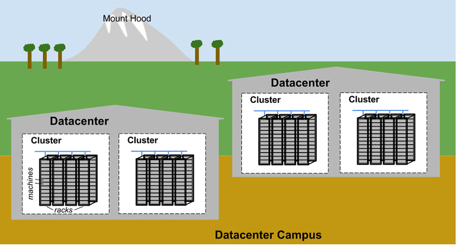
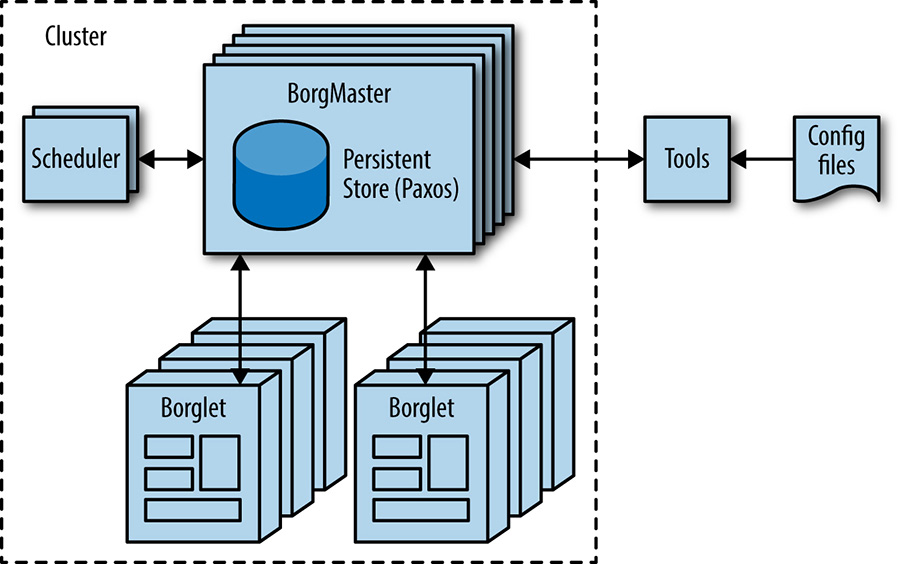
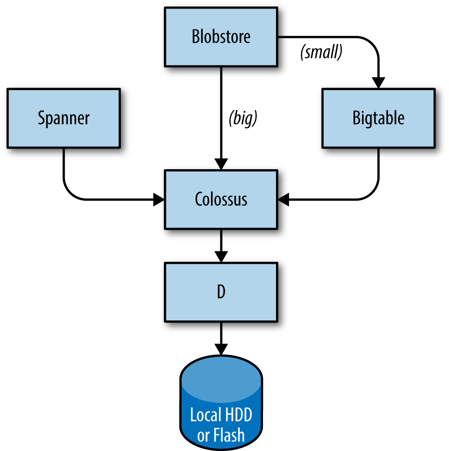
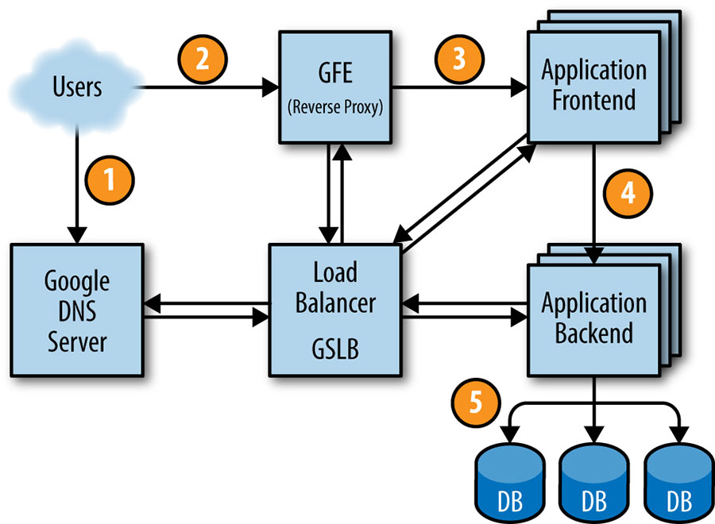

# The Production Environment at Google, from the Viewpoint of an SRE

Written by JC van WinkelEdited by Betsy Beyer

Google datacenters are very different from most conventional datacenters and small-scale server farms. These differences present both extra problems and opportunities. This chapter discusses the challenges and opportunities that characterize Google datacenters and introduces terminology that is used throughout the book.

## Hardware

Most of Google’s compute resources are in Google-designed datacenters with proprietary power distribution, cooling, networking, and compute hardware (see [[Bar13]](/sre-book/bibliography#Bar13)). Unlike "standard" colocation datacenters, the compute hardware in a Google-designed datacenter is the same across the board.[^9] To eliminate the confusion between server hardware and server software, we use the following terminology throughout the book:

Machine  
A piece of hardware (or perhaps a VM)

Server  
A piece of software that implements a service

Machines can run any server, so we don’t dedicate specific machines to specific server programs. There’s no specific machine that runs our mail server, for example. Instead, resource allocation is handled by our cluster operating system, *Borg*.

We realize this use of the word *server* is unusual. The common use of the word conflates “binary that accepts network connection” with *machine*, but differentiating between the two is important when talking about computing at Google. Once you get used to our usage of *server*, it becomes more apparent why it makes sense to use this specialized terminology, not just within Google but also in the rest of this book.

[Figure 2-1](#fig_production-environment_topology) illustrates the topology of a Google datacenter:

- Tens of machines are placed in a *rack*.
- Racks stand in a *row*.
- One or more rows form a *cluster*.
- Usually a *datacenter* building houses multiple clusters.
- Multiple datacenter buildings that are located close together form a *campus*.

*Figure 2-1. Example Google datacenter campus topology*

Machines within a given datacenter need to be able to talk with each other, so we created a very fast virtual switch with tens of thousands of ports. We accomplished this by connecting hundreds of Google-built switches in a Clos network fabric [[Clos53]](/sre-book/bibliography#Clos53) named *Jupiter* [[Sin15]](/sre-book/bibliography#Sin15). In its largest configuration, Jupiter supports 1.3 Pbps bisection bandwidth among servers.

Datacenters are connected to each other with our globe-spanning backbone network *B4* [[Jai13]](/sre-book/bibliography#Jai13). B4 is a software-defined networking architecture (and uses the OpenFlow open-standard communications protocol). It supplies massive bandwidth to a modest number of sites, and uses elastic bandwidth allocation to maximize average bandwidth [[Kum15]](/sre-book/bibliography#Kum15).

## System Software That "Organizes" the Hardware

Our hardware must be controlled and administered by software that can handle massive scale. Hardware failures are one notable problem that we manage with software. Given the large number of hardware components in a cluster, hardware failures occur quite frequently. In a single cluster in a typical year, thousands of machines fail and thousands of hard disks break; when multiplied by the number of clusters we operate globally, these numbers become somewhat breathtaking. Therefore, we want to abstract such problems away from users, and the teams running our services similarly don’t want to be bothered by hardware failures. Each datacenter campus has teams dedicated to [maintaining the hardware and datacenter infrastructure](../../sre-book/managing-critical-state/).

### Managing Machines

*Borg*, illustrated in [Figure 2-2](#fig_production-environment_borg), is a distributed cluster operating system [[Ver15]](/sre-book/bibliography#Ver15), similar to Apache Mesos.[^10] Borg manages its jobs at the cluster level.

*Figure 2-2. High-level Borg cluster architecture*

Borg is responsible for running users’ *jobs*, which can either be indefinitely running servers or batch processes like a MapReduce [[Dea04]](/sre-book/bibliography#Dea04). Jobs can consist of more than one (and sometimes thousands) of identical *tasks*, both for reasons of reliability and because a single process can’t usually handle all cluster traffic. When Borg starts a job, it finds machines for the tasks and tells the machines to start the server program. Borg then continually monitors these tasks. If a task malfunctions, it is killed and restarted, possibly on a different machine.

Because tasks are fluidly allocated over machines, we can’t simply rely on IP addresses and port numbers to refer to the tasks. We solve this problem with an extra level of indirection: when starting a job, Borg allocates a name and index number to each task using the *Borg Naming Service* (BNS). Rather than using the IP address and port number, other processes connect to Borg tasks via the BNS name, which is translated to an IP address and port number by BNS. For example, the BNS path might be a string such as `/bns/<`*`cluster`*`>/<`*`user`*`>/<`*`job name`*`>/<`*`task number`*`>`, which would resolve to `<`*`IP address`*`>:<`*`port`*`>`.

Borg is also responsible for the allocation of resources to jobs. Every job needs to specify its required resources (e.g., 3 CPU cores, 2 GiB of RAM). Using the list of requirements for all jobs, Borg can binpack the tasks over the machines in an optimal way that also accounts for failure domains (for example: Borg won’t run all of a job’s tasks on the same rack, as doing so means that the top of rack switch is a single point of failure for that job).

If a task tries to use more resources than it requested, Borg kills the task and restarts it (as a slowly crashlooping task is usually preferable to a task that hasn’t been restarted at all).

### Storage

Tasks can use the local disk on machines as a scratch pad, but we have several cluster storage options for permanent storage (and even scratch space will eventually move to the cluster storage model). These are comparable to Lustre and the Hadoop Distributed File System (HDFS), which are both open source cluster filesystems.

The storage layer is responsible for offering users easy and reliable access to the storage available for a cluster. As shown in [Figure 2-3](#fig_production-environment_storage-stack), storage has many layers:

1.  The lowest layer is called *D* (for *disk*, although D uses both spinning disks and flash storage). D is a fileserver running on almost all machines in a cluster. However, users who want to access their data don’t want to have to remember which machine is storing their data, which is where the next layer comes into play.

2.  A layer on top of D called *Colossus* creates a cluster-wide filesystem that offers usual filesystem semantics, as well as replication and encryption. Colossus is the successor to GFS, the Google File System [[Ghe03]](/sre-book/bibliography#Ghe03).

3.  There are several database-like services built on top of Colossus:

    1.  Bigtable [[Cha06]](/sre-book/bibliography#Cha06) is a NoSQL database system that can handle databases that are petabytes in size. A Bigtable is a sparse, distributed, persistent multidimensional sorted map that is indexed by row key, column key, and timestamp; each value in the map is an uninterpreted array of bytes. Bigtable supports eventually consistent, cross-datacenter replication.
    2.  Spanner [[Cor12]](/sre-book/bibliography#Cor12) offers an SQL-like interface for users that require real consistency across the world.
    3.  Several other database systems, such as *Blobstore*, are available. Each of these options comes with its own set of trade-offs (see [Data Integrity: What You Read Is What You Wrote](/sre-book/data-integrity/)).

*Figure 2-3. Portions of the Google storage stack*

### Networking

Google’s network hardware is controlled in several ways. As discussed earlier, we use an OpenFlow-based software-defined network. Instead of using "smart" routing hardware, we rely on less expensive "dumb" switching components in combination with a central (duplicated) controller that precomputes best paths across the network. Therefore, we’re able to move compute-expensive routing decisions away from the routers and use simple switching hardware.

Network bandwidth needs to be allocated wisely. Just as Borg limits the compute resources that a task can use, the Bandwidth Enforcer (BwE) manages the available bandwidth to maximize the average available bandwidth. Optimizing bandwidth isn’t just about cost: centralized traffic engineering has been shown to solve a number of problems that are traditionally extremely difficult to solve through a combination of distributed routing and traffic engineering [[Kum15]](/sre-book/bibliography#Kum15).

Some services have jobs running in multiple clusters, which are distributed across the world. In order to minimize latency for globally distributed services, we want to direct users to the closest datacenter with available capacity. Our *Global Software Load Balancer* (GSLB) performs load balancing on three levels:

- Geographic load balancing for DNS requests (for example, to *www.google.com*), described in [Load Balancing at the Frontend](/sre-book/load-balancing-frontend/)
- Load balancing at a user service level (for example, YouTube or Google Maps)
- Load balancing at the Remote Procedure Call (RPC) level, described in [Load Balancing in the Datacenter](/sre-book/load-balancing-datacenter/)

Service owners specify a symbolic name for a service, a list of BNS addresses of servers, and the capacity available at each of the locations (typically measured in queries per second). GSLB then directs traffic to the BNS addresses.

## Other System Software

Several other components in a datacenter are also important.

### Lock Service

The *Chubby* [[Bur06]](/sre-book/bibliography#Bur06) lock service provides a filesystem-like API for maintaining locks. Chubby handles these locks across datacenter locations. It uses the Paxos protocol for asynchronous Consensus (see [Managing Critical State: Distributed Consensus for Reliability](/sre-book/managing-critical-state/)).

Chubby also plays an important role in master election. When a service has five replicas of a job running for reliability purposes but only one replica may perform actual work, Chubby is used to select *which* replica may proceed.

Data that must be consistent is well suited to storage in Chubby. For this reason, BNS uses Chubby to store mapping between BNS paths and `IP address:port` pairs.

### Monitoring and Alerting

We want to make sure that all services are running as required. Therefore, we run many instances of our *Borgmon* monitoring program (see [Practical Alerting from Time-Series Data](/sre-book/practical-alerting/)). Borgmon regularly "scrapes" metrics from monitored servers. These metrics can be used instantaneously for alerting and also stored for use in historic overviews (e.g., graphs). We can use monitoring in several ways:

- Set up alerting for acute problems.
- Compare behavior: did a software update make the server faster?
- Examine how resource consumption behavior evolves over time, which is essential for capacity planning.

## Our Software Infrastructure

Our software architecture is designed to make the most efficient use of our hardware infrastructure. Our code is heavily multithreaded, so one task can easily use many cores. To facilitate dashboards, monitoring, and debugging, every server has an HTTP server that provides diagnostics and statistics for a given task.

All of Google’s services communicate using a Remote Procedure Call (RPC) infrastructure named *Stubby*; an open source version, gRPC, is available.[^11] Often, an RPC call is made even when a call to a subroutine in the local program needs to be performed. This makes it easier to refactor the call into a different server if more modularity is needed, or when a server’s codebase grows. GSLB can load balance RPCs in the same way it load balances externally visible services.

A server receives RPC requests from its *frontend* and sends RPCs to its *backend*. In traditional terms, the frontend is called the client and the backend is called the server.

Data is transferred to and from an RPC using *protocol buffers*,[^12] often abbreviated to "protobufs," which are similar to Apache’s Thrift. Protocol buffers have many advantages over XML for serializing structured data: they are simpler to use, 3 to 10 times smaller, 20 to 100 times faster, and less ambiguous.

## Our Development Environment

Development velocity is very important to Google, so we’ve built a complete development environment to make use of our infrastructure [[Mor12b]](/sre-book/bibliography#Mor12b).

Apart from a few groups that have their own open source repositories (e.g., Android and Chrome), Google Software Engineers work from a single shared repository [[Pot16]](/sre-book/bibliography#Pot16). This has a few important practical implications for our workflows:

- If engineers encounter a problem in a component outside of their project, they can fix the problem, send the proposed changes ("changelist," or *CL*) to the owner for review, and submit the CL to the mainline.
- Changes to source code in an engineer’s own project require a review. All software is reviewed before being submitted.

When software is built, the build request is sent to build servers in a datacenter. Even large builds are executed quickly, as many build servers can compile in parallel. This infrastructure is also used for continuous testing. Each time a CL is submitted, tests run on all software that may depend on that CL, either directly or indirectly. If the framework determines that the change likely broke other parts in the system, it notifies the owner of the submitted change. Some projects use a push-on-green system, where a new version is automatically pushed to production after passing tests.

## Shakespeare: A Sample Service

To provide a model of how a service would hypothetically be deployed in the Google production environment, let’s look at an example service that interacts with multiple Google technologies. Suppose we want to offer a service that lets you determine where a given word is used throughout all of Shakespeare’s works.

We can divide this system into two parts:

- A batch component that reads all of Shakespeare’s texts, creates an index, and writes the index into a Bigtable. This job need only run once, or perhaps very infrequently (as you never know if a new text might be discovered!).
- An application frontend that handles end-user requests. This job is always up, as users in all time zones will want to search in Shakespeare’s books.

The batch component is a MapReduce comprising three phases.

The mapping phase reads Shakespeare’s texts and splits them into individual words. This is faster if performed in parallel by multiple workers.

The shuffle phase sorts the tuples by word.

In the reduce phase, a tuple of (*word*, *list of locations*) is created.

Each tuple is written to a row in a Bigtable, using the word as the key.

### Life of a Request

[Figure 2-4](#fig_production-environment_life-of-a-request) shows how a user’s request is serviced: first, the user points their browser to *shakespeare.google.com*. To obtain the corresponding IP address, the user’s device resolves the address with its [DNS server](https://sre.google/sre-book/load-balancing-frontend/) (1). This request ultimately ends up at Google’s DNS server, which talks to GSLB. As GSLB keeps track of traffic load among frontend servers across regions, it picks which server IP address to send to this user.

*Figure 2-4. The life of a request*

The browser connects to the HTTP server on this IP. This server (named the Google Frontend, or GFE) is a reverse proxy that terminates the TCP connection (2). The GFE looks up which service is required (web search, maps, or—in this case—Shakespeare). Again using GSLB, the server finds an available Shakespeare frontend server, and sends that server an RPC containing the HTTP request (3).

The Shakespeare server analyzes the HTTP request and constructs a protobuf containing the word to look up. The Shakespeare frontend server now needs to contact the Shakespeare backend server: the frontend server contacts GSLB to obtain the BNS address of a suitable and unloaded backend server (4). That Shakespeare backend server now contacts a Bigtable server to obtain the requested data (5).

The answer is written to the reply protobuf and returned to the Shakespeare backend server. The backend hands a protobuf containing the results to the Shakespeare frontend server, which assembles the HTML and returns the answer to the user.

This entire chain of events is executed in the blink of an eye—just a few hundred milliseconds! Because many moving parts are involved, there are many potential points of failure; in particular, a failing GSLB would wreak havoc. However, Google’s policies of rigorous testing and careful rollout, in addition to our proactive error recovery methods such as graceful degradation, allow us to deliver the [reliable service](../../sre-book/part-III-practices/) that our users have come to expect. After all, people regularly use *www.google.com* to check if their Internet connection is set up correctly.

### Job and Data Organization

Load testing determined that our backend server can handle about 100 queries per second (QPS). Trials performed with a limited set of users lead us to expect a peak load of about 3,470 QPS, so we need at least 35 tasks. However, the following considerations mean that we need at least 37 tasks in the job, or N+2:

- During updates, one task at a time will be unavailable, leaving 36 tasks.
- A machine failure might occur during a task update, leaving only 35 tasks, just enough to serve peak load.[^13]

A closer examination of user traffic shows our peak usage is distributed globally: 1,430 QPS from North America, 290 from South America, 1,400 from Europe and Africa, and 350 from Asia and Australia. Instead of locating all backends at one site, we distribute them across the USA, South America, Europe, and Asia. Allowing for N+2 redundancy per region means that we end up with 17 tasks in the USA, 16 in Europe, and 6 in Asia. However, we decide to use 4 tasks (instead of 5) in South America, to lower the overhead of N+2 to N+1. In this case, we’re willing to tolerate a small risk of higher latency in exchange for lower hardware costs: if GSLB redirects traffic from one continent to another when our South American datacenter is over capacity, we can save 20% of the resources we’d spend on hardware. In the larger regions, we’ll spread tasks across two or three clusters for extra resiliency.

Because the backends need to contact the Bigtable holding the data, we need to also design this storage element strategically. A backend in Asia contacting a Bigtable in the USA adds a significant amount of latency, so we replicate the Bigtable in each region. Bigtable replication helps us in two ways: it provides resilience should a Bigtable server fail, and it lowers data-access latency. While Bigtable only offers eventual consistency, it isn’t a major problem because we don’t need to update the contents often.

We’ve introduced a lot of terminology here; while you don’t need to remember it all, it’s useful for framing many of the other systems we’ll refer to later.

[^9]: Well, roughly the same. Mostly. Except for the stuff that is different. Some datacenters end up with multiple generations of compute hardware, and sometimes we augment datacenters after they are built. But for the most part, our datacenter hardware is homogeneous.

[^10]: Some readers may be more familiar with Borg’s descendant, Kubernetes—an open source Container Cluster orchestration framework started by Google in 2014; see https://kubernetes.io and [Bur16]. For more details on the similarities between Borg and Apache Mesos, see [Ver15].

[^11]: See https://grpc.io.

[^12]: Protocol buffers are a language-neutral, platform-neutral extensible mechanism for serializing structured data. For more details, see https://developers.google.com/protocol-buffers/.

[^13]: We assume the probability of two simultaneous task failures in our environment is low enough to be negligible. Single points of failure, such as top-of-rack switches or power distribution, may make this assumption invalid in other environments.
