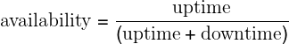

# Embracing Risk

Written by Marc Alvidrez  
Edited by Kavita Guliani

You might expect Google to try to build 100% reliable services—ones that never fail. It turns out that past a certain point, however, increasing reliability is worse for a service (and its users) rather than better! Extreme reliability comes at a cost: maximizing stability limits how fast new features can be developed and how quickly products can be delivered to users, and dramatically increases their cost, which in turn reduces the numbers of features a team can afford to offer. Further, users typically don’t notice the difference between high reliability and extreme reliability in a service, because the user experience is dominated by less reliable components like the cellular network or the device they are working with. Put simply, a user on a 99% reliable smartphone cannot tell the difference between 99.99% and 99.999% service reliability! With this in mind, rather than simply maximizing uptime, Site Reliability Engineering seeks to balance the risk of unavailability with the goals of rapid innovation and efficient service operations, so that users’ overall happiness—with features, service, and performance—is optimized.

## Managing Risk

Unreliable systems can quickly erode users’ confidence, so we want to reduce the chance of system failure. However, experience shows that as we build systems, cost does not increase linearly as reliability increments—an incremental improvement in reliability may cost 100x more than the previous increment. The costliness has two dimensions:

The cost of redundant machine/compute resources  
The cost associated with redundant equipment that, for example, allows us to take systems offline for routine or unforeseen maintenance, or provides space for us to store parity code blocks that provide a minimum data durability guarantee.

The opportunity cost  
The cost borne by an organization when it allocates engineering resources to build systems or features that diminish risk instead of features that are directly visible to or usable by end users. These engineers no longer work on new features and products for end users.

In SRE, we manage service reliability largely by managing risk. We conceptualize risk as a continuum. We give equal importance to figuring out how to engineer greater reliability into Google systems and identifying the appropriate level of tolerance for the services we run. Doing so allows us to perform a cost/benefit analysis to determine, for example, where on the (nonlinear) risk continuum we should place Search, Ads, Gmail, or Photos. Our goal is to explicitly align the risk taken by a given service with the risk the business is willing to bear. We strive to make a service reliable enough, but no *more* reliable than it needs to be. That is, when we set an availability target of 99.99%,we want to exceed it, but not by much: that would waste opportunities to add features to the system, clean up technical debt, or reduce its operational costs. In a sense, we view the availability target as both a minimum and a maximum. The key advantage of this framing is that it unlocks explicit, thoughtful risktaking.

## Measuring Service Risk

As standard practice at Google, we are often best served by identifying an objective metric to represent the property of a system we want to optimize. By setting a target, we can assess our current performance and track improvements or degradations over time. For service risk, it is not immediately clear how to reduce all of the potential factors into a single metric. Service failures can have many potential effects, including user dissatisfaction, harm, or loss of trust; direct or indirect revenue loss; brand or reputational impact; and undesirable press coverage. Clearly, some of these factors are very hard to measure. To make this problem tractable and consistent across many types of systems we run, we focus on *unplanned downtime*.

For most services, the most straightforward way of representing risk tolerance is in terms of the acceptable level of unplanned downtime. Unplanned downtime is captured by the desired level of *service availability*, usually expressed in terms of the number of "nines" we would like to provide: 99.9%, 99.99%, or 99.999% availability. Each additional nine corresponds to an order of magnitude improvement toward 100% availability. For serving systems, this metric is traditionally calculated based on the proportion of system uptime (see [Time-based availability](#risk-management_measuring-service-risk_time-availability-equation)).

##### Time-based availability

Using this formula over the period of a year, we can calculate the acceptable number of minutes of downtime to reach a given number of nines of availability. For example, a system with an availability target of 99.99% can be down for up to 52.56 minutes in a year and stay within its availability target; see [Availability Table](/sre-book/availability-table#appendix_table-of-nines) for a table.

At Google, however, a time-based metric for availability is usually not meaningful because we are looking across globally distributed services. Our approach to fault isolation makes it very likely that we are serving at least a subset of traffic for a given service somewhere in the world at any given time (i.e., we are at least partially "up" at all times). Therefore, instead of using metrics around uptime, we define availability in terms of the *request success rate*. [Aggregate availability](#risk-management_measuring-service-risk_aggregate-availability-equation) shows how this yield-based metric is calculated over a rolling window (i.e., proportion of successful requests over a one-day window).

##### Aggregate availability

For example, a system that serves 2.5M requests in a day with a daily availability target of 99.99% can serve up to 250 errors and still hit its target for that given day.

In a typical application, not all requests are equal: failing a new user sign-up request is different from failing a request polling for new email in the background. In many cases, however, availability calculated as the request success rate over all requests is a reasonable approximation of unplanned downtime, as viewed from the end-user perspective.

Quantifying unplanned downtime as a request success rate also makes this availability metric more amenable for use in systems that do not typically serve end users directly. Most nonserving systems (e.g., batch, pipeline, storage, and transactional systems) have a well-defined notion of successful and unsuccessful units of work. Indeed, while the systems discussed in this chapter are primarily consumer and infrastructure serving systems, many of the same principles also apply to nonserving systems with minimal modification.

For example, a batch process that extracts, transforms, and inserts the contents of one of our customer databases into a data warehouse to enable further analysis may be set to run periodically. Using a request success rate defined in terms of records successfully and unsuccessfully processed, we can calculate a useful availability metric despite the fact that the batch system does not run constantly.

Most often, we set quarterly availability targets for a service and track our performance against those targets on a weekly, or even daily, basis. This strategy lets us manage the service to a high-level availability objective by looking for, tracking down, and fixing meaningful deviations as they inevitably arise. See [Service Level Objectives](/sre-book/service-level-objectives/) for more details.

## Risk Tolerance of Services

What does it mean to identify the risk tolerance of a service? In a formal environment or in the case of safety-critical systems, the risk tolerance of services is typically built directly into the basic product or service definition. At Google, services’ risk tolerance tends to be less clearly defined.

To identify the risk tolerance of a service, SREs must work with the product owners to turn a set of business goals into explicit objectives to which we can engineer. In this case, the business goals we’re concerned about have a direct impact on the performance and reliability of the service offered. In practice, this translation is easier said than done. While consumer services often have clear product owners, it is unusual for infrastructure services (e.g., storage systems or a general-purpose HTTP caching layer) to have a similar structure of product ownership. We’ll discuss the consumer and infrastructure cases in turn.

### Identifying the Risk Tolerance of Consumer Services

Our consumer services often have a product team that acts as the business owner for an application. For example, Search, Google Maps, and Google Docs each have their own product managers. These product managers are charged with understanding the users and the business, and for shaping the product for success in the marketplace. When a product team exists, that team is usually the best resource to discuss the reliability requirements for a service. In the absence of a dedicated product team, the engineers building the system often play this role either knowingly or unknowingly.

There are many factors to consider when assessing the risk tolerance of services, such as the following:

- What level of availability is required?
- Do different types of failures have different effects on the service?
- How can we use the service cost to help locate a service on the risk continuum?
- What other service metrics are important to take into account?

### Target level of availability

The target level of availability for a given Google service usually depends on the function it provides and how the service is positioned in the marketplace. The following list includes issues to consider:

- What level of service will the users expect?
- Does this service tie directly to revenue (either our revenue, or our customers’ revenue)?
- Is this a paid service, or is it free?
- If there are competitors in the marketplace, what level of service do those competitors provide?
- Is this service targeted at consumers, or at enterprises?

Consider the requirements of Google Apps for Work. The majority of its users are enterprise users, some large and some small. These enterprises depend on Google Apps for Work services (e.g., Gmail, Calendar, Drive, Docs) to provide tools that enable their employees to perform their daily work. Stated another way, an outage for a Google Apps for Work service is an outage not only for Google, but also for all the enterprises that critically depend on us. For a typical Google Apps for Work service, we might set an external quarterly availability target of 99.9%, and back this target with a stronger internal availability target and a contract that stipulates penalties if we fail to deliver to the external target.

YouTube provides a contrasting set of considerations. When Google acquired YouTube, we had to decide on the appropriate availability target for the website. In 2006, YouTube was focused on consumers and was in a very different phase of its business lifecycle than Google was at the time. While YouTube already had a great product, it was still changing and growing rapidly. We set a lower availability target for YouTube than for our enterprise products because rapid feature development was correspondingly more important.

### Types of failures

The expected shape of failures for a given service is another important consideration. How resilient is our business to service downtime? Which is worse for the service: a constant low rate of failures, or an occasional full-site outage? Both types of failure may result in the same absolute number of errors, but may have vastly different impacts on the business.

An illustrative example of the difference between full and partial outages naturally arises in systems that serve private information. Consider a contact management application, and the difference between intermittent failures that cause profile pictures to fail to render, versus a failure case that results in a user’s private contacts being shown to another user. The first case is clearly a poor user experience, and SREs would work to remediate the problem quickly. In the second case, however, the risk of exposing private data could easily undermine basic user trust in a significant way. As a result, taking down the service entirely would be appropriate during the debugging and potential clean-up phase for the second case.

At the other end of services offered by Google, it is sometimes acceptable to have regular outages during maintenance windows. A number of years ago, the Ads Frontend used to be one such service. It is used by advertisers and website publishers to set up, configure, run, and monitor their advertising campaigns. Because most of this work takes place during normal business hours, we determined that occasional, regular, scheduled outages in the form of maintenance windows would be acceptable, and we counted these scheduled outages as planned downtime, not unplanned downtime.

### Cost

Cost is often the key factor in determining the appropriate availability target for a service. Ads is in a particularly good position to make this trade-off because request successes and failures can be directly translated into revenue gained or lost. In determining the availability target for each service, we ask questions such as:

- If we were to build and operate these systems at one more nine of availability, what would our incremental increase in revenue be?
- Does this additional revenue offset the cost of reaching that level of reliability?

To make this trade-off equation more concrete, consider the following cost/benefit for an example service where each request has equal value:

- Proposed improvement in availability target: 99.9% → 99.99%
- Proposed increase in availability: 0.09%
- Service revenue: \$1M
- Value of improved availability: \$1M * 0.0009 = \$900

In this case, if the cost of improving availability by one nine is less than \$900, it is worth the investment. If the cost is greater than \$900, the costs will exceed the projected increase in revenue.

It may be harder to set these targets when we do not have a simple translation function between reliability and revenue. One useful strategy may be to consider the background error rate of ISPs on the Internet. If failures are being measured from the end-user perspective and it is possible to drive the error rate for the service below the background error rate, those errors will fall within the noise for a given user’s Internet connection. While there are significant differences between ISPs and protocols (e.g., TCP versus UDP, IPv4 versus IPv6), we’ve measured the typical background error rate for ISPs as falling between 0.01% and 1%.

### Other service metrics

Examining the risk tolerance of services in relation to metrics besides availability is often fruitful. Understanding which metrics are important and which metrics aren’t important provides us with degrees of freedom when attempting to take thoughtful risks.

Service latency for our Ads systems provides an illustrative example. When Google first launched Web Search, one of the service’s key distinguishing features was speed. When we introduced AdWords, which displays advertisements next to search results, a key requirement of the system was that the ads should not slow down the search experience. This requirement has driven the engineering goals in each generation of AdWords systems and is treated as an invariant.

AdSense, Google’s ads system that serves contextual ads in response to requests from JavaScript code that publishers insert into their websites, has a very different latency goal. The latency goal for AdSense is to avoid slowing down the rendering of the third-party page when inserting contextual ads. The specific latency target, then, is dependent on the speed at which a given publisher’s page renders. This means that AdSense ads can generally be served hundreds of milliseconds slower than AdWords ads.

This looser serving latency requirement has allowed us to make many smart trade-offs in provisioning (i.e., determining the quantity and locations of serving resources we use), which save us substantial cost over naive provisioning. In other words, given the relative insensitivity of the AdSense service to moderate changes in latency performance, we are able to consolidate serving into fewer geographical locations, reducing our operational overhead.

### Identifying the Risk Tolerance of Infrastructure Services

The requirements for building and running infrastructure components differ from the requirements for consumer products in a number of ways. A fundamental difference is that, by definition, infrastructure components have multiple clients, often with varying needs.

### Target level of availability

Consider Bigtable [[Cha06]](/sre-book/bibliography#Cha06), a massive-scale distributed storage system for structured data. Some consumer services serve data directly from Bigtable in the path of a user request. Such services need low latency and high reliability. Other teams use Bigtable as a repository for data that they use to perform offline analysis (e.g., MapReduce) on a regular basis. These teams tend to be more concerned about throughput than reliability. Risk tolerance for these two use cases is quite distinct.

One approach to meeting the needs of both use cases is to engineer all infrastructure services to be ultra-reliable. Given the fact that these infrastructure services also tend to aggregate huge amounts of resources, such an approach is usually far too expensive in practice. To understand the different needs of the different types of users, you can look at the desired state of the request queue for each type of Bigtable user.

### Types of failures

The low-latency user wants Bigtable’s request queues to be (almost always) empty so that the system can process each outstanding request immediately upon arrival. (Indeed, inefficient queuing is often a cause of high tail latency.) The user concerned with offline analysis is more interested in system throughput, so that user wants request queues to never be empty. To optimize for throughput, the Bigtable system should never need to idle while waiting for its next request.

As you can see, success and failure are antithetical for these sets of users. Success for the low-latency user is failure for the user concerned with offline analysis.

### Cost

One way to satisfy these competing constraints in a cost-effective manner is to partition the infrastructure and offer it at multiple independent levels of service. In the Bigtable example, we can build two types of clusters: low-latency clusters and throughput clusters. The low-latency clusters are designed to be operated and used by services that need low latency and high reliability. To ensure short queue lengths and satisfy more stringent client isolation requirements, the Bigtable system can be provisioned with a substantial amount of slack capacity for reduced contention and increased redundancy. The throughput clusters, on the other hand, can be provisioned to run very hot and with less redundancy, optimizing throughput over latency. In practice, we are able to satisfy these relaxed needs at a much lower cost, perhaps as little as 10–50% of the cost of a low-latency cluster. Given Bigtable’s massive scale, this cost savings becomes significant very quickly.

The key strategy with regards to infrastructure is to deliver services with explicitly delineated levels of service, thus enabling the clients to make the right risk and cost trade-offs when building their systems. With explicitly delineated levels of service, the infrastructure providers can effectively externalize the difference in the cost it takes to provide service at a given level to clients. Exposing cost in this way motivates the clients to choose the level of service with the lowest cost that still meets their needs. For example, Google+ can decide to put data critical to enforcing user privacy in a high-availability, globally consistent datastore (e.g., a globally replicated SQL-like system like Spanner [[Cor12]](/sre-book/bibliography#Cor12)), while putting optional data (data that isn’t critical, but that enhances the user experience) in a cheaper, less reliable, less fresh, and eventually consistent datastore (e.g., a NoSQL store with best-effort replication like Bigtable).

Note that we can run multiple classes of services using identical hardware and software. We can provide vastly different service guarantees by adjusting a variety of service characteristics, such as the quantities of resources, the degree of redundancy, the geographical provisioning constraints, and, critically, the infrastructure software configuration.

### Example: Frontend infrastructure

To demonstrate that these risk-tolerance assessment principles do not just apply to storage infrastructure, let’s look at another large class of service: Google’s frontend infrastructure. The frontend infrastructure consists of reverse proxy and load balancing systems running close to the edge of our network. These are the systems that, among other things, serve as one endpoint of the connections from end users (e.g., terminate TCP from the user’s browser). Given their critical role, we engineer these systems to deliver an extremely high level of reliability. While consumer services can often limit the visibility of unreliability in backends, these infrastructure systems are not so lucky. If a request never makes it to the application service frontend server, it is lost.

We’ve explored the ways to identify the risk tolerance of both consumer and infrastructure services. Now, we’ll discuss using that tolerance level to manage unreliability via error budgets.

## Motivation for Error Budgets[^14]

Written by Mark Roth  
Edited by Carmela Quinito

Other chapters in this book discuss how tensions can arise between product development teams and SRE teams, given that they are generally evaluated on different metrics. Product development performance is largely evaluated on product velocity, which creates an incentive to push new code as quickly as possible. Meanwhile, SRE performance is (unsurprisingly) evaluated based upon reliability of a service, which implies an incentive to push back against a high rate of change. Information asymmetry between the two teams further amplifies this inherent tension. The product developers have more visibility into the time and effort involved in writing and releasing their code, while the SREs have more visibility into the service’s reliability (and the state of production in general).

These tensions often reflect themselves in different opinions about the level of effort that should be put into engineering practices. The following list presents some typical tensions:

Software fault tolerance  
How hardened do we make the software to unexpected events? Too little, and we have a brittle, unusable product. Too much, and we have a product no one wants to use (but that runs very stably).

Testing  
Again, not enough testing and you have embarrassing outages, privacy data leaks, or a number of other press-worthy events. Too much testing, and you might lose your market.

Push frequency  
Every push is risky. How much should we work on reducing that risk, versus doing other work?

Canary duration and size  
It’s a best practice to test a new release on some small subset of a typical workload, a practice often called *canarying*. How long do we wait, and how big is the canary?

Usually, preexisting teams have worked out some kind of informal balance between them as to where the risk/effort boundary lies. Unfortunately, one can rarely prove that this balance is optimal, rather than just a function of the negotiating skills of the engineers involved. Nor should such decisions be driven by politics, fear, or hope. (Indeed, Google SRE’s unofficial motto is "Hope is not a strategy.") Instead, our goal is to define an objective metric, agreed upon by both sides, that can be used to guide the negotiations in a reproducible way. The more data-based the decision can be, the better.

### Forming Your Error Budget

In order to base these decisions on objective data, the two teams jointly define a quarterly error budget based on the service’s service level objective, or SLO (see [Service Level Objectives](/sre-book/service-level-objectives/)). The error budget provides a clear, objective metric that determines how unreliable the service is allowed to be within a single quarter. This metric removes the politics from negotiations between the SREs and the product developers when deciding how much risk to allow.

Our practice is then as follows:

- Product Management defines an SLO, which sets an expectation of how much uptime the service should have per quarter.
- The actual uptime is measured by a neutral third party: our monitoring system.
- The difference between these two numbers is the "budget" of how much "unreliability" is remaining for the quarter.
- As long as the uptime measured is above the SLO—in other words, as long as there is error budget remaining—new releases can be pushed.

For example, imagine that a service’s SLO is to successfully serve 99.999% of all queries per quarter. This means that the service’s error budget is a failure rate of 0.001% for a given quarter. If a problem causes us to fail 0.0002% of the expected queries for the quarter, the problem spends 20% of the service’s quarterly error budget.

### Benefits

The main benefit of an error budget is that it provides a common incentive that allows both product development and SRE to focus on finding the right balance between innovation and reliability.

Many products use this control loop to manage release velocity: as long as the system’s SLOs are met, releases can continue. If SLO violations occur frequently enough to expend the error budget, releases are temporarily halted while additional resources are invested in system testing and development to make the system more resilient, improve its performance, and so on. More subtle and effective approaches are available than this simple on/off technique:[^15] for instance, slowing down releases or rolling them back when the [SLO-violation error budget](https://sre.google/workbook/error-budget-policy/) is close to being used up.

For example, if product development wants to skimp on testing or increase push velocity and SRE is resistant, the error budget guides the decision. When the budget is large, the product developers can take more risks. When the budget is nearly drained, the product developers themselves will push for more testing or slower push velocity, as they don’t want to risk using up the budget and stall their launch. In effect, the product development team becomes self-policing. They know the budget and can manage their own risk. (Of course, this outcome relies on an SRE team having the authority to actually stop launches if the SLO is broken.)

What happens if a network outage or datacenter failure reduces the measured SLO? Such events also eat into the error budget. As a result, the number of new pushes may be reduced for the remainder of the quarter. The entire team supports this reduction because everyone shares the responsibility for uptime.

The budget also helps to highlight some of the costs of overly high reliability targets, in terms of both inflexibility and slow innovation. If the team is having trouble launching new features, they may elect to loosen the SLO (thus increasing the error budget) in order to increase innovation.

> **Key Insights**
>
> - Managing service reliability is largely about managing risk, and managing risk can be costly.
> - 100% is probably never the right reliability target: not only is it impossible to achieve, it’s typically more reliability than a service’s users want or notice. Match the profile of the service to the risk the business is willing to take.
> - An error budget aligns incentives and emphasizes joint ownership between SRE and product development. Error budgets make it easier to decide the rate of releases and to effectively defuse discussions about outages with stakeholders, and allows multiple teams to reach the same conclusion about production risk without rancor.

[^14]: An early version of this section appeared as an article in ;login: (August 2015, vol. 40, no. 4).

[^15]: Known as "bang/bang" control—see https://en.wikipedia.org/wiki/Bang–bang_control.
