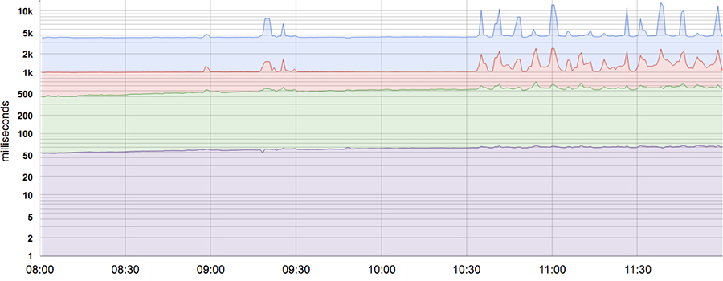

# Service Level Objectives

Written by Chris Jones, John Wilkes, and Niall Murphy with Cody Smith  
Edited by Betsy Beyer

It’s impossible to manage a service correctly, let alone well, without understanding which behaviors really matter for that service and how to measure and evaluate those behaviors. To this end, we would like to define and deliver a given *level of service* to our users, whether they use an internal API or a public product.

We use intuition, experience, and an understanding of what users want to define *service level indicators* (SLIs), *objectives* (SLOs), and *agreements* (SLAs). These measurements describe basic properties of metrics that matter, what values we want those metrics to have, and how we’ll react if we can’t provide the expected service. Ultimately, choosing appropriate metrics helps to drive the right action if something goes wrong, and also gives an SRE team confidence that a service is healthy.

This chapter describes the framework we use to wrestle with the problems of metric modeling, metric selection, and metric analysis. Much of this explanation would be quite abstract without an example, so we’ll use the Shakespeare service outlined in [Shakespeare: A Sample Service](/sre-book/production-environment#xref_production-environment_shakespeare) to illustrate our main points.

## Service Level Terminology

Many readers are likely familiar with the concept of an SLA, but the terms *SLI* and *SLO* are also worth careful definition, because in common use, the term *SLA* is overloaded and has taken on a number of meanings depending on context. We prefer to separate those meanings for clarity.

### Indicators

An SLI is a service level *indicator*—a carefully defined quantitative measure of some aspect of the level of service that is provided.

Most services consider *request latency*—how long it takes to return a response to a request—as a key SLI. Other common SLIs include the *error rate*, often expressed as a fraction of all requests received, and *system throughput*, typically measured in requests per second. The measurements are often aggregated: i.e., raw data is collected over a measurement window and then turned into a rate, average, or percentile.

Ideally, the SLI directly measures a service level of interest, but sometimes only a proxy is available because the desired measure may be hard to obtain or interpret. For example, client-side latency is often the more user-relevant metric, but it might only be possible to measure latency at the server.

Another kind of SLI important to SREs is *availability*, or the fraction of the time that a service is usable. It is often defined in terms of the fraction of well-formed requests that succeed, sometimes called *yield*. (*Durability*—the likelihood that data will be retained over a long period of time—is equally important for [data storage systems.](https://sre.google/sre-book/data-integrity/)) Although 100% availability is impossible, near-100% availability is often readily achievable, and the industry commonly expresses high-availability values in terms of the number of "nines" in the availability percentage. For example, availabilities of 99% and 99.999% can be referred to as "2 nines" and "5 nines" availability, respectively, and the current published target for Google Compute Engine availability is “three and a half nines”—99.95% availability.

### Objectives

An SLO is a *service level objective*: a target value or range of values for a service level that is measured by an SLI. A natural structure for SLOs is thus *SLI ≤ target*, or *lower bound ≤ SLI ≤ upper bound*. For example, we might decide that we will return Shakespeare search results "quickly," adopting an SLO that our average search request latency should be less than 100 milliseconds.

Choosing an appropriate SLO is complex. To begin with, you don’t always get to choose its value! For incoming HTTP requests from the outside world to your service, the queries per second (QPS) metric is essentially determined by the desires of your users, and you can’t really set an SLO for that.

On the other hand, you *can* say that you want the average latency per request to be under 100 milliseconds, and setting such a goal could in turn motivate you to write your frontend with low-latency behaviors of various kinds or to buy certain kinds of low-latency equipment. (100 milliseconds is obviously an arbitrary value, but in general lower latency numbers are good. There are excellent reasons to believe that fast is better than slow, and that user-experienced latency above certain values actually drives people away— see "Speed Matters" [[Bru09]](/sre-book/bibliography#Bru09) for more details.)

Again, this is more subtle than it might at first appear, in that those two SLIs—QPS and latency—might be connected behind the scenes: higher QPS often leads to larger latencies, and it’s common for services to have a performance cliff beyond some load threshold.

Choosing and [publishing SLOs](https://sre.google/resources/practices-and-processes/art-of-slos/) to users sets expectations about how a service will perform. This strategy can reduce unfounded complaints to service owners about, for example, the service being slow. Without an explicit SLO, users often develop their own beliefs about desired performance, which may be unrelated to the beliefs held by the people designing and operating the service. This dynamic can lead to both over-reliance on the service, when users incorrectly believe that a service will be more available than it actually is (as happened with Chubby: see <a href="#xref_risk-management_global-chubby-planned-outage" data-xrefstyle="select:nopage">The Global Chubby Planned Outage</a>), and under-reliance, when prospective users believe a system is flakier and less reliable than it actually is.

> **The Global Chubby Planned Outage**
>
> Written by Marc Alvidrez
>
> Chubby [[Bur06]](/sre-book/bibliography#Bur06) is Google’s lock service for loosely coupled distributed systems. In the global case, we distribute Chubby instances such that each replica is in a different geographical region. Over time, we found that the failures of the global instance of Chubby consistently generated service outages, many of which were visible to end users. As it turns out, true global Chubby outages are so infrequent that service owners began to add dependencies to Chubby assuming that it would never go down. Its high reliability provided a false sense of security because the services could not function appropriately when Chubby was unavailable, however rarely that occurred.
>
> The solution to this Chubby scenario is interesting: SRE makes sure that global Chubby meets, but does not significantly exceed, its service level objective. In any given quarter, if a true failure has not dropped availability below the target, a controlled outage will be synthesized by intentionally taking down the system. In this way, we are able to flush out unreasonable dependencies on Chubby shortly after they are added. Doing so forces service owners to reckon with the reality of distributed systems sooner rather than later.

### Agreements

Finally, SLAs are service level *agreements*: an explicit or implicit contract with your users that includes consequences of meeting (or missing) the SLOs they contain. The consequences are most easily recognized when they are financial—a rebate or a penalty—but they can take other forms. An easy way to tell the difference between an SLO and an SLA is to ask "what happens if the SLOs aren’t met?": if there is no explicit consequence, then you are almost certainly looking at an SLO.[^16]

SRE doesn’t typically get involved in constructing SLAs, because SLAs are closely tied to business and product decisions. SRE does, however, get involved in helping to avoid triggering the consequences of missed SLOs. They can also help to define the SLIs: there obviously needs to be an objective way to measure the SLOs in the agreement, or disagreements will arise.

Google Search is an example of an important service that doesn’t have an SLA for the public: we want everyone to use Search as fluidly and efficiently as possible, but we haven’t signed a contract with the whole world. Even so, there are still consequences if Search isn’t available—unavailability results in a hit to our reputation, as well as a drop in advertising revenue. Many other Google services, such as Google for Work, do have explicit SLAs with their users. Whether or not a particular service has an SLA, it’s valuable to define SLIs and SLOs and use them to manage the service.

So much for the theory—now for the experience.

## Indicators in Practice

Given that we’ve made the case for *why* choosing appropriate [metrics to measure your service](https://sre.google/sre-book/practical-alerting/) is important, how do you go about identifying what metrics are meaningful to your service or system?

### What Do You and Your Users Care About?

You shouldn’t use every metric you can track in your monitoring system as an SLI; an understanding of what your users want from the system will inform the judicious selection of a few indicators. Choosing too many indicators makes it hard to pay the right level of attention to the indicators that matter, while choosing too few may leave significant behaviors of your system unexamined. We typically find that a handful of representative indicators are enough to evaluate and reason about a system’s health.

Services tend to fall into a few broad categories in terms of the SLIs they find relevant:

- *User-facing serving systems*, such as the Shakespeare search frontends, generally care about *availability*, *latency*, and *throughput*. In other words: Could we respond to the request? How long did it take to respond? How many requests could be handled?
- *Storage systems* often emphasize *latency*, *availability*, and *durability*. In other words: How long does it take to read or write data? Can we access the data on demand? Is the data still there when we need it? See [Data Integrity: What You Read Is What You Wrote](/sre-book/data-integrity/) for an extended discussion of these issues.
- *Big data systems*, such as data processing pipelines, tend to care about *throughput* and *end-to-end latency*. In other words: How much data is being processed? How long does it take the data to progress from ingestion to completion? (Some pipelines may also have targets for latency on individual processing stages.)
- All systems should care about *correctness*: was the right answer returned, the right data retrieved, the right analysis done? Correctness is important to track as an indicator of system health, even though it’s often a property of the data in the system rather than the infrastructure *per se*, and so usually not an SRE responsibility to meet.

### Collecting Indicators

Many indicator metrics are most naturally gathered on the server side, using a monitoring system such as Borgmon (see [Practical Alerting from Time-Series Data](/sre-book/practical-alerting/)) or Prometheus, or with periodic log analysis—for instance, HTTP 500 responses as a fraction of all requests. However, some systems should be instrumented with *client*-side collection, because not measuring behavior at the client can miss a range of problems that affect users but don’t affect server-side metrics. For example, concentrating on the response latency of the Shakespeare search backend might miss poor user latency due to problems with the page’s JavaScript: in this case, measuring how long it takes for a page to become usable in the browser is a better proxy for what the user actually experiences.

### Aggregation

For simplicity and usability, we often aggregate raw measurements. This needs to be done carefully.

Some metrics are seemingly straightforward, like the number of requests *per second* served, but even this apparently straightforward measurement implicitly aggregates data over the measurement window. Is the measurement obtained once a second, or by averaging requests over a minute? The latter may hide much higher instantaneous request rates in bursts that last for only a few seconds. Consider a system that serves 200 requests/s in even-numbered seconds, and 0 in the others. It has the same average load as one that serves a constant 100 requests/s, but has an *instantaneous* load that is twice as large as the *average* one. Similarly, averaging request latencies may seem attractive, but obscures an important detail: it’s entirely possible for most of the requests to be fast, but for a long tail of requests to be much, much slower.

Most metrics are better thought of as *distributions* rather than averages. For example, for a latency SLI, some requests will be serviced quickly, while others will invariably take longer—sometimes much longer. A simple average can obscure these tail latencies, as well as changes in them. [Figure 4-1](#fig_sl-star_latency-distribution) provides an example: although a typical request is served in about 50 ms, 5% of requests are 20 times slower! Monitoring and alerting based only on the average latency would show no change in behavior over the course of the day, when there are in fact significant changes in the tail latency (the topmost line).

*Figure 4-1. 50th, 85th, 95th, and 99th percentile latencies for a system. Note that the Y-axis has a logarithmic scale.*

Using percentiles for indicators allows you to consider the shape of the distribution and its differing attributes: a high-order percentile, such as the 99th or 99.9th, shows you a plausible worst-case value, while using the 50th percentile (also known as the median) emphasizes the typical case. The higher the variance in response times, the more the typical user experience is affected by long-tail behavior, an effect exacerbated at high load by queuing effects. User studies have shown that people typically prefer a slightly slower system to one with high variance in response time, so some SRE teams focus only on high percentile values, on the grounds that if the 99.9th percentile behavior is good, then the typical experience is certainly going to be.

> **A Note on Statistical Fallacies**
>
> We generally prefer to work with percentiles rather than the mean (arithmetic average) of a set of values. Doing so makes it possible to consider the long tail of data points, which often have significantly different (and more interesting) characteristics than the average. Because of the artificial nature of computing systems, data points are often skewed—for instance, no request can have a response in less than 0 ms, and a timeout at 1,000 ms means that there can be no successful responses with values greater than the timeout. As a result, we cannot assume that the mean and the median are the same—or even close to each other!
>
> We try not to assume that our data is normally distributed without verifying it first, in case some standard intuitions and approximations don’t hold. For example, if the distribution is not what’s expected, a process that takes action when it sees outliers (e.g., restarting a server with high request latencies) may do this too often, or not often enough.

### Standardize Indicators

We recommend that you standardize on common definitions for SLIs so that you don’t have to reason about them from first principles each time. Any feature that conforms to the standard definition templates can be omitted from the specification of an individual SLI, e.g.:

- Aggregation intervals: “Averaged over 1 minute”
- Aggregation regions: “All the tasks in a cluster”
- How frequently measurements are made: “Every 10 seconds”
- Which requests are included: “HTTP GETs from black-box monitoring jobs”
- How the data is acquired: “Through our monitoring, measured at the server”
- Data-access latency: “Time to last byte”

To save effort, build a set of reusable SLI templates for each common metric; these also make it simpler for everyone to understand what a specific SLI means.

## Objectives in Practice

Start by thinking about (or finding out!) what your users care about, not what you can measure. Often, what your users care about is difficult or impossible to measure, so you’ll end up approximating users’ needs in some way. However, if you simply start with what’s easy to measure, you’ll end up with less useful SLOs. As a result, we’ve sometimes found that working from desired objectives backward to specific indicators works better than choosing indicators and then coming up with targets.

### Defining Objectives

For maximum clarity, SLOs should specify how they’re measured and the conditions under which they’re valid. For instance, we might say the following (the second line is the same as the first, but relies on the SLI defaults of the previous section to remove redundancy):

- 99% (averaged over 1 minute) of `Get` RPC calls will complete in less than 100 ms (measured across all the backend servers).
- 99% of `Get` RPC calls will complete in less than 100 ms.

If the shape of the performance curves are important, then you can specify multiple SLO targets:

- 90% of `Get` RPC calls will complete in less than 1 ms.
- 99% of `Get` RPC calls will complete in less than 10 ms.
- 99.9% of `Get` RPC calls will complete in less than 100 ms.

If you have users with heterogeneous workloads such as a bulk processing pipeline that cares about throughput and an interactive client that cares about latency, it may be appropriate to define separate objectives for each class of workload:

- 95% of throughput clients’ `Set` RPC calls will complete in \< 1 s.
- 99% of latency clients’ `Set` RPC calls with payloads \< 1 kB will complete in \< 10 ms.

It’s both unrealistic and undesirable to insist that SLOs will be met 100% of the time: doing so can reduce the rate of innovation and deployment, require expensive, overly conservative solutions, or both. Instead, it is better to allow an error budget—a rate at which the SLOs can be missed—and track that on a daily or weekly basis. Upper management will probably want a monthly or quarterly assessment, too. (An error budget is just an SLO for meeting other SLOs!)

The SLO violation rate can be compared against the error budget (see [Motivation for Error Budgets](/sre-book/embracing-risk#xref_risk-management_unreliability-budgets)), with the gap used as an input to the process that decides when to roll out new releases.

### Choosing Targets

Choosing targets (SLOs) is not a purely technical activity because of the product and business implications, which should be reflected in both the SLIs and SLOs (and maybe SLAs) that are selected. Similarly, it may be necessary to trade off certain product attributes against others within the constraints posed by staffing, time to market, hardware availability, and funding. While SRE should be part of this conversation, and advise on the risks and viability of different options, we’ve learned a few lessons that can help make this a more productive discussion:

Don’t pick a target based on current performance  
While understanding the merits and limits of a system is essential, adopting values without reflection may lock you into supporting a system that requires heroic efforts to meet its targets, and that cannot be improved without significant redesign.

Keep it simple  
Complicated aggregations in SLIs can obscure changes to system performance, and are also harder to reason about.

Avoid absolutes  
While it’s tempting to ask for a system that can scale its load "infinitely" without any latency increase and that is "always" available, this requirement is unrealistic. Even a system that approaches such ideals will probably take a long time to design and build, and will be expensive to operate—and probably turn out to be unnecessarily better than what users would be happy (or even delighted) to have.

Have as few SLOs as possible  
Choose just enough SLOs to provide good coverage of your system’s attributes. Defend the SLOs you pick: if you can’t ever win a conversation about priorities by quoting a particular SLO, it’s probably not worth having that SLO.[^17] However, not all product attributes are amenable to SLOs: it’s hard to specify "user delight" with an SLO.

Perfection can wait  
You can always refine SLO definitions and targets over time as you learn about a system’s behavior. It’s better to start with a loose target that you tighten than to choose an overly strict target that has to be relaxed when you discover it’s unattainable.

SLOs can—and should—be a major driver in prioritizing work for SREs and product developers, because they reflect what users care about. A good SLO is a helpful, legitimate forcing function for a development team. But a poorly thought-out SLO can result in wasted work if a team uses heroic efforts to meet an overly aggressive SLO, or a bad product if the SLO is too lax. SLOs are a massive lever: use them wisely.

### Control Measures

SLIs and SLOs are crucial elements in the control loops used to manage systems:

1.  Monitor and measure the system’s SLIs.
2.  Compare the SLIs to the SLOs, and decide whether or not action is needed.
3.  If action is needed, figure out *what* needs to happen in order to meet the target.
4.  Take that action.

For example, if step 2 shows that request latency is increasing, and will miss the SLO in a few hours unless something is done, step 3 might include testing the hypothesis that the servers are CPU-bound, and deciding to add more of them to spread the load. Without the SLO, you wouldn’t know whether (or when) to take action.

### SLOs Set Expectations

Publishing SLOs sets expectations for system behavior. Users (and potential users) often want to know what they can expect from a service in order to understand whether it’s appropriate for their use case. For instance, a team wanting to build a photo-sharing website might want to avoid using a service that promises very strong durability and low cost in exchange for slightly lower availability, though the same service might be a perfect fit for an archival records management system.

In order to set realistic expectations for your users, you might consider using one or both of the following tactics:

Keep a safety margin  
Using a tighter internal SLO than the SLO advertised to users gives you room to respond to chronic problems before they become visible externally. An SLO buffer also makes it possible to accommodate reimplementations that trade performance for other attributes, such as cost or ease of maintenance, without having to disappoint users.

Don’t overachieve  
Users build on the reality of what you offer, rather than what you say you’ll supply, particularly for infrastructure services. If your service’s actual performance is much better than its stated SLO, users will come to rely on its current performance. You can avoid over-dependence by deliberately taking the system offline occasionally (Google’s Chubby service introduced planned outages in response to being overly available),[^18] throttling some requests, or designing the system so that it isn’t faster under light loads.

Understanding how well a system is meeting its expectations helps decide whether to invest in making the system faster, more available, and more resilient. Alternatively, if the service is doing fine, perhaps staff time should be spent on other priorities, such as paying off technical debt, adding new features, or introducing other products.

## Agreements in Practice

Crafting an SLA requires business and legal teams to pick appropriate consequences and penalties for a breach. SRE’s role is to help them understand the likelihood and difficulty of meeting the SLOs contained in the SLA. Much of the advice on SLO construction is also applicable for SLAs. It is wise to be conservative in what you advertise to users, as the broader the constituency, the harder it is to change or delete SLAs that prove to be unwise or difficult to work with.

[^16]: Most people really mean SLO when they say "SLA." One giveaway: if somebody talks about an "SLA violation," they are almost always talking about a missed SLO. A real SLA violation might trigger a court case for breach of contract.

[^17]: If you can’t ever win a conversation about SLOs, it’s probably not worth having an SRE team for the product.

[^18]: Failure injection [Ben12] serves a different purpose, but can also help set expectations.
