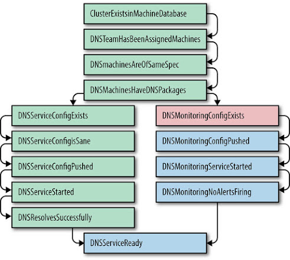
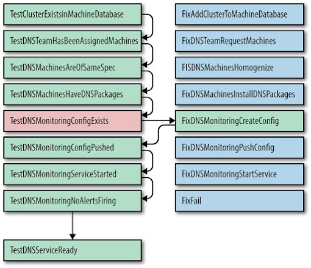

## The Evolution of Automation at Google

Written by Niall Murphy with John Looney and Michael Kacirek  
Edited by Betsy Beyer

> Besides black art, there is only automation and mechanization.
>
> Federico García Lorca (1898–1936), Spanish poet and playwright

For SRE, automation is a force multiplier, not a panacea. Of course, just *multiplying* force does not naturally change the accuracy of where that force is applied: doing automation thoughtlessly can create as many problems as it solves. Therefore, while we believe that software-based automation is superior to manual operation in most circumstances, better than either option is a higher-level system design requiring neither of them—an *autonomous* system. Or to put it another way, the value of automation comes from both what it does and its judicious application. We’ll discuss both the value of automation and how our attitude has evolved over time.

## The Value of Automation

What exactly is the value of automation?[^26]

### Consistency

Although scale is an obvious motivation for automation, there are many other reasons to use it. Take the example of university computing systems, where many systems engineering folks started their careers. Systems administrators of that background were generally charged with running a collection of machines or some software, and were accustomed to manually performing various actions in the discharge of that duty. One common example is creating user accounts; others include purely operational duties like making sure backups happen, managing server failover, and small data manipulations like changing the upstream DNS servers’ *resolv.conf*, DNS server zone data, and similar activities. Ultimately, however, this prevalence of manual tasks is unsatisfactory for both the organizations and indeed the people maintaining systems in this way. For a start, any action performed by a human or humans hundreds of times won’t be performed the same way each time: even with the best will in the world, very few of us will ever be as consistent as a machine. This inevitable lack of consistency leads to mistakes, oversights, issues with data quality, and, yes, reliability problems. In this domain—the execution of well-scoped, known procedures the value of consistency is in many ways the primary value of automation.

### A Platform

Automation doesn’t just provide consistency. Designed and done properly, automatic systems also provide a *platform* that can be extended, applied to more systems, or perhaps even spun out for profit.[^27] (The alternative, no automation, is neither cost effective nor extensible: it is instead a tax levied on the operation of a system.)

A platform also *centralizes mistakes*. In other words, a bug fixed in the code will be fixed there once and forever, unlike a sufficiently large set of humans performing the same procedure, as discussed previously. A platform can be extended to perform additional tasks more easily than humans can be instructed to perform them (or sometimes even realize that they have to be done). Depending on the nature of the task, it can run either continuously or much more frequently than humans could appropriately accomplish the task, or at times that are inconvenient for humans. Furthermore, a platform can export metrics about its performance, or otherwise allow you to discover details about your process you didn’t know previously, because these details are more easily measurable within the context of a platform.

### Faster Repairs

There’s an additional benefit for systems where automation is used to resolve common faults in a system (a frequent situation for SRE-created automation). If automation runs regularly and successfully enough, the result is a reduced mean time to repair (MTTR) for those common faults. You can then spend your time on other tasks instead, thereby achieving increased developer velocity because you don’t have to spend time either preventing a problem or (more commonly) cleaning up after it. As is well understood in the industry, the later in the product lifecycle a problem is discovered, the more expensive it is to fix; see [Testing for Reliability](/sre-book/testing-reliability/). Generally, problems that occur in actual production are most expensive to fix, both in terms of time and money, which means that an automated system looking for problems as soon as they arise has a good chance of lowering the total cost of the system, given that the system is sufficiently large.

### Faster Action

In the infrastructural situations where SRE automation tends to be deployed, humans don’t usually react as fast as machines. In most common cases, where, for example, failover or traffic switching can be well defined for a particular application, it makes no sense to effectively require a human to intermittently press a button called “Allow system to continue to run.” (Yes, it is true that sometimes automatic procedures can end up making a bad situation worse, but that is why such procedures should be scoped over well-defined domains.) Google has a large amount of automation; in many cases, the services we support could not long survive without this automation because they crossed the threshold of manageable manual operation long ago.

### Time Saving

Finally, time saving is an oft-quoted rationale for automation. Although people cite this rationale for automation more than the others, in many ways the benefit is often less immediately calculable. Engineers often waver over whether a particular piece of automation or code is worth writing, in terms of effort saved in not requiring a task to be performed manually versus the effort required to write it.[^28] It’s easy to overlook the fact that once you have encapsulated some task in automation, anyone can execute the task. Therefore, the time savings apply across anyone who would plausibly use the automation. Decoupling operator from operation is very powerful.

Joseph Bironas, an SRE who led Google’s datacenter turnup efforts for a time, forcefully argued:

"If we are engineering processes and solutions that are not automatable, we continue having to staff humans to maintain the system. If we have to staff humans to do the work, we are feeding the machines with the blood, sweat, and tears of human beings. Think *The Matrix* with less special effects and more pissed off System Administrators."

## The Value for Google SRE

All of these benefits and trade-offs apply to us just as much as anyone else, and Google does have a strong bias toward automation. Part of our preference for automation springs from our particular business challenges: the products and services we look after are planet-spanning in scale, and we don’t typically have time to engage in the same kind of machine or service hand-holding common in other organizations.[^29] For truly large services, the factors of consistency, quickness, and reliability dominate most conversations about the trade-offs of performing automation.

Another argument in favor of automation, particularly in the case of Google, is our complicated yet surprisingly uniform production environment, described in [The Production Environment at Google, from the Viewpoint of an SRE](/sre-book/production-environment/). While other organizations might have an important piece of equipment without a readily accessible API, software for which no source code is available, or another impediment to complete control over production operations, Google generally avoids such scenarios. We have built APIs for systems when no API was available from the vendor. Even though purchasing software for a particular task would have been much cheaper in the short term, we chose to write our own solutions, because doing so produced APIs with the potential for much greater long-term benefits. We spent a lot of time overcoming obstacles to automatic system management, and then resolutely developed that automatic system management itself. Given how Google manages its source code [[Pot16]](/sre-book/bibliography#Pot16), the availability of that code for more or less any system that SRE touches also means that our mission to “own the product in production” is much easier because we control the entirety of the stack.

Of course, although Google is ideologically bent upon using machines to manage machines where possible, reality requires some modification of our approach. It isn’t appropriate to automate every component of every system, and not everyone has the ability or inclination to develop automation at a particular time. Some essential systems started out as quick prototypes, not designed to last or to interface with automation. The previous paragraphs state a maximalist view of our position, but one that we have been broadly successful at putting into action within the Google context. In general, we have chosen to create platforms where we could, or to *position* ourselves so that we could create platforms over time. We view this platform-based approach as necessary for manageability and scalability.

## The Use Cases for Automation

In the industry, *automation* is the term generally used for writing code to solve a wide variety of problems, although the motivations for writing this code, and the solutions themselves, are often quite different. More broadly, in this view, automation is “meta-software”—software to act on software.

As we implied earlier, there are a number of use cases for automation. Here is a non-exhaustive list of examples:

- User account creation
- Cluster turnup and turndown for services
- Software or hardware installation preparation and decommissioning
- Rollouts of new software versions
- Runtime configuration changes
- A special case of runtime config changes: changes to your dependencies

This list could continue essentially *ad infinitum*.

### Google SRE’s Use Cases for Automation

In Google, we have all of the use cases just listed, and more.

However, within Google SRE, our primary affinity has typically been for running infrastructure, as opposed to managing the quality of the data that passes over that infrastructure. This line isn’t totally clear—for example, we care deeply if half of a dataset vanishes after a push, and therefore we alert on coarse-grain differences like this, but it’s rare for us to write the equivalent of changing the properties of some arbitrary subset of accounts on a system. Therefore, the context for our automation is often automation to manage the lifecycle of systems, not their data: for example, deployments of a service in a new cluster.

To this extent, SRE’s automation efforts are not far off what many other people and organizations do, except that we use different tools to manage it and have a different focus (as we’ll discuss).

Widely available tools like Puppet, Chef, cfengine, and even Perl, which all provide ways to automate particular tasks, differ mostly in terms of the level of abstraction of the components provided to help the act of automating. A full language like Perl provides POSIX-level affordances, which in theory provide an essentially unlimited scope of automation across the APIs accessible to the system,[^30] whereas Chef and Puppet provide out-of-the-box abstractions with which services or other higher-level entities can be manipulated. The trade-off here is classic: higher-level abstractions are easier to manage and reason about, but when you encounter a “leaky abstraction,” you fail systemically, repeatedly, and potentially inconsistently. For example, we often assume that pushing a new binary to a cluster is atomic; the cluster will either end up with the old version, or the new version. However, real-world behavior is more complicated: that cluster’s network can fail halfway through; machines can fail; communication to the cluster management layer can fail, leaving the system in an inconsistent state; depending on the situation, new binaries could be staged but not pushed, or pushed but not restarted, or restarted but not verifiable. Very few abstractions model these kinds of outcomes successfully, and most generally end up halting themselves and calling for intervention. Truly bad automation systems don’t even do that.

SRE has a number of philosophies and products in the domain of automation, some of which look more like generic rollout tools without particularly detailed modeling of higher-level entities, and some of which look more like languages for describing service deployment (and so on) at a very abstract level. Work done in the latter tends to be more reusable and be more of a common platform than the former, but the complexity of our production environment sometimes means that the former approach is the most immediately tractable option.

### A Hierarchy of Automation Classes

Although all of these automation steps are valuable, and indeed an automation platform is valuable in and of itself, in an ideal world, we wouldn’t need externalized automation. In fact, instead of having a system that *has* to have external glue logic, it would be even better to have a system that needs *no glue logic at all*, not just because internalization is more efficient (although such efficiency is useful), but because it has been designed to not need glue logic in the first place. Accomplishing that involves taking the use cases for glue logic—generally “first order” manipulations of a system, such as adding accounts or performing system turnup—and finding a way to handle those use cases directly within the application.

As a more detailed example, most turnup automation at Google is problematic because it ends up being maintained separately from the core system and therefore suffers from “bit rot,” i.e., not changing when the underlying systems change. Despite the best of intentions, attempting to more tightly couple the two (turnup automation and the core system) often fails due to unaligned priorities, as product developers will, not unreasonably, resist a test deployment requirement for every change. Secondly, automation that is crucial but only executed at infrequent intervals and therefore difficult to test is often particularly fragile because of the extended feedback cycle. Cluster failover is one classic example of infrequently executed automation: failovers might only occur every few months, or infrequently enough that inconsistencies between instances are introduced. The evolution of automation follows a path:

1) No automation  
Database master is failed over manually between locations.

2) Externally maintained system-specific automation  
An SRE has a failover script in his or her home directory.

3) Externally maintained generic automation  
The SRE adds database support to a "generic failover" script that everyone uses.

4) Internally maintained system-specific automation  
The database ships with its own failover script.

5) Systems that don’t need any automation  
The database notices problems, and automatically fails over without human intervention.

SRE hates manual operations, so we obviously try to create systems that don’t require them. However, sometimes manual operations are unavoidable.

There is additionally a subvariety of automation that applies changes not across the domain of specific system-related configuration, but across the domain of production as a whole. In a highly centralized proprietary production environment like Google’s, there are a large number of changes that have a non–service-specific scope—e.g., changing upstream Chubby servers, a flag change to the Bigtable client library to make access more reliable, and so on—which nonetheless need to be safely managed and rolled back if necessary. Beyond a certain volume of changes, it is infeasible for production-wide changes to be accomplished manually, and at some time before that point, it’s a waste to have manual oversight for a process where a large proportion of the changes are either trivial or accomplished successfully by basic relaunch-and-check strategies.

Let’s use internal case studies to illustrate some of the preceding points in detail. The first case study is about how, due to some diligent, far-sighted work, we managed to achieve the self-professed nirvana of SRE: to automate ourselves out of a job.

## Automate Yourself Out of a Job: Automate ALL the Things!

For a long while, the Ads products at Google stored their data in a MySQL database. Because Ads data obviously has high reliability requirements, an SRE team was charged with looking after that infrastructure. From 2005 to 2008, the Ads Database mostly ran in what we considered to be a mature and managed state. For example, we had automated away the worst, but not all, of the routine work for standard replica replacements. We believed the Ads Database was well managed and that we had harvested most of the low-hanging fruit in terms of optimization and scale. However, as daily operations became comfortable, team members began to look at the next level of system development: migrating MySQL onto Google’s cluster scheduling system, Borg.

We hoped this migration would provide two main benefits:

- *Completely* eliminate machine/replica maintenance: Borg would automatically handle the setup/restart of new and broken tasks.
- Enable bin-packing of multiple MySQL instances on the same physical machine: Borg would enable more efficient use of machine resources via Containers.

In late 2008, we successfully deployed a proof of concept MySQL instance on Borg. Unfortunately, this was accompanied by a significant new difficulty. A core operating characteristic of Borg is that its tasks move around automatically. Tasks commonly move within Borg as frequently as once or twice per week. This frequency was tolerable for our database replicas, but unacceptable for our masters.

At that time, the process for master failover took 30–90 minutes per instance. Simply because we ran on shared machines and were subject to reboots for kernel upgrades, in addition to the normal rate of machine failure, we had to expect a number of otherwise unrelated failovers every week. This factor, in combination with the number of shards on which our system was hosted, meant that:

- Manual failovers would consume a substantial amount of human hours and would give us best-case availability of 99% uptime, which fell short of the actual business requirements of the product.
- In order to meet our error budgets, each failover would have to take less than 30 seconds of downtime. There was no way to optimize a human-dependent procedure to make downtime shorter than 30 seconds.

Therefore, our only choice was to automate failover. Actually, we needed to automate more than just failover.

In 2009 Ads SRE completed our automated failover daemon, which we dubbed “Decider.” Decider could complete MySQL failovers for both planned and unplanned failovers in less than 30 seconds 95% of the time. With the creation of Decider, MySQL on Borg (MoB) finally became a reality. We graduated from optimizing our infrastructure for a lack of failover to embracing the idea that failure is inevitable, and therefore optimizing to recover quickly through automation.

While automation let us achieve highly available MySQL in a world that forced up to two restarts per week, it did come with its own set of costs. All of our applications had to be changed to include significantly more failure-handling logic than before. Given that the norm in the MySQL development world is to assume that the MySQL instance will be the most stable component in the stack, this switch meant customizing software like JDBC to be more tolerant of our failure-prone environment. However, the benefits of migrating to MoB with Decider were well worth these costs. Once on MoB, the time our team spent on mundane operational tasks dropped by 95%. Our failovers were automated, so an outage of a single database task no longer paged a human.

The main upshot of this new automation was that we had a lot more free time to spend on improving other parts of the infrastructure. Such improvements had a cascading effect: the more time we saved, the more time we were able to spend on optimizing and automating other tedious work. Eventually, we were able to automate schema changes, causing the cost of total operational maintenance of the Ads Database to drop by nearly 95%. Some might say that we had successfully automated ourselves out of this job. The hardware side of our domain also saw improvement. Migrating to MoB freed up considerable resources because we could schedule multiple MySQL instances on the same machines, which improved utilization of our hardware. In total, we were able to free up about 60% of our hardware. Our team was now flush with hardware and engineering resources.

This example demonstrates the wisdom of going the extra mile to deliver a platform rather than replacing existing manual procedures. The next example comes from the cluster infrastructure group, and illustrates some of the more difficult trade-offs you might encounter on your way to automating *all* the things.

## Soothing the Pain: Applying Automation to Cluster Turnups

Ten years ago, the Cluster Infrastructure SRE team seemed to get a new hire every few months. As it turned out, that was approximately the same frequency at which we turned up a new cluster. Because turning up a service in a new cluster gives new hires exposure to a service’s internals, this task seemed like a natural and useful training tool.

The steps taken to get a cluster ready for use were something like the following:

1.  Fit out a datacenter building for power and cooling.
2.  Install and configure core switches and connections to the backbone.
3.  Install a few initial racks of servers.
4.  Configure basic services such as DNS and installers, then configure a lock service, storage, and computing.
5.  Deploy the remaining racks of machines.
6.  Assign user-facing services resources, so their teams can set up the services.

Steps 4 and 6 were extremely complex. While basic services like DNS are relatively simple, the storage and compute subsystems at that time were still in heavy development, so new flags, components, and optimizations were added weekly.

Some services had more than a hundred different component subsystems, each with a complex web of dependencies. Failing to configure one subsystem, or configuring a system or component differently than other deployments, is a customer-impacting outage waiting to happen.

In one case, a multi-petabyte Bigtable cluster was configured to not use the first (logging) disk on 12-disk systems, for latency reasons. A year later, some automation assumed that if a machine’s first disk wasn’t being used, that machine didn’t have any storage configured; therefore, it was safe to wipe the machine and set it up from scratch. All of the Bigtable data was wiped, instantly. Thankfully we had multiple real-time replicas of the dataset, but such surprises are unwelcome. Automation needs to be careful about relying on implicit "safety" signals.

Early automation focused on accelerating cluster delivery. This approach tended to rely upon creative use of SSH for tedious package distribution and service initialization problems. This strategy was an initial win, but those free-form scripts became a cholesterol of technical debt.

### Detecting Inconsistencies with Prodtest

As the numbers of clusters grew, some clusters required hand-tuned flags and settings. As a result, teams wasted more and more time chasing down difficult-to-spot misconfigurations. If a flag that made GFS more responsive to log processing leaked into the default templates, cells with many files could run out of memory under load. Infuriating and time-consuming misconfigurations crept in with nearly every large configuration change.

The creative—though brittle—shell scripts we used to configure clusters were neither scaling to the number of people who wanted to make changes nor to the sheer number of cluster permutations that needed to be built. These shell scripts also failed to resolve more significant concerns before declaring that a service was good to take customer-facing traffic, such as:

- Were all of the service’s dependencies available and correctly configured?
- Were all configurations and packages consistent with other deployments?
- Could the team confirm that every configuration exception was desired?

Prodtest (Production Test) was an ingenious solution to these unwelcome surprises. We extended the Python unit test framework to allow for unit testing of real-world services. These unit tests have dependencies, allowing a chain of tests, and a failure in one test would quickly abort. Take the test shown in [Figure 7-1](#fig_automation_prodtest) as an example.

*Figure 7-1. ProdTest for DNS Service, showing how one failed test aborts the subsequent chain of tests*

A given team’s Prodtest was given the cluster name, and it could validate that team’s services in that cluster. Later additions allowed us to generate a graph of the unit tests and their states. This functionality allowed an engineer to see quickly if their service was correctly configured in all clusters, and if not, why. The graph highlighted the failed step, and the failing Python unit test output a more verbose error message.

Any time a team encountered a delay due to another team’s unexpected misconfiguration, a bug could be filed to extend their Prodtest. This ensured that a similar problem would be discovered earlier in the future. SREs were proud to be able to assure their customers that all services—both newly turned up services and existing services with new configuration—would reliably serve production traffic.

For the first time, our project managers could predict when a cluster could "go live," and had a complete understanding of *why* each clusters took six or more weeks to go from "network-ready" to "serving live traffic." Out of the blue, SRE received a mission from senior management: *In three months, five new clusters will reach *network-ready* on the same day. Please turn them up in one week.*

### Resolving Inconsistencies Idempotently

A "One Week Turnup" was a terrifying mission. We had tens of thousands of lines of shell script owned by dozens of teams. We could quickly tell how unprepared any given cluster was, but fixing it meant that the dozens of teams would have to file hundreds of bugs, and then we had to hope that these bugs would be promptly fixed.

We realized that evolving from "Python unit tests finding misconfigurations" to "Python code fixing misconfigurations" could enable us to fix these issues faster.

The unit test already knew which cluster we were examining and the specific test that was failing, so we paired each test with a fix. If each fix was written to be idempotent, and could assume that all dependencies were met, resolving the problem should have been easy—and safe—to resolve. Requiring idempotent fixes meant teams could run their "fix script" every 15 minutes without fearing damage to the cluster’s configuration. If the DNS team’s test was blocked on the Machine Database team’s configuration of a new cluster, as soon as the cluster appeared in the database, the DNS team’s tests and fixes would start working.

Take the test shown in [Figure 7-2](#fig_automation_prodtest-failed) as an example. If `TestDnsMonitoringConfigExists` fails, as shown, we can call `FixDnsMonitoringCreateConfig`, which scrapes configuration from a database, then checks a skeleton configuration file into our revision control system. Then `TestDnsMonitoringConfigExists` passes on retry, and the `TestDnsMonitoringConfigPushed` test can be attempted. If the test fails, the `FixDnsMonitoringPushConfig` step runs. If a fix fails multiple times, the automation assumes that the fix failed and stops, notifying the user.

Armed with these scripts, a small group of engineers could ensure that we could go from "The network works, and machines are listed in the database" to "Serving 1% of websearch and ads traffic" in a matter of a week or two. At the time, this seemed to be the apex of automation technology.

Looking back, this approach was deeply flawed; the latency between the test, the fix, and then a second test introduced *flaky* tests that sometimes worked and sometimes failed. Not all fixes were naturally idempotent, so a flaky test that was followed by a fix might render the system in an inconsistent state.

*Figure 7-2. ProdTest for DNS Service, showing that one failed test resulted in only running one fix*

### The Inclination to Specialize

Automation processes can vary in three respects:

- *Competence*, i.e., their accuracy
- *Latency*, how quickly all steps are executed when initiated
- *Relevance*, or proportion of real-world process covered by automation

We began with a process that was highly competent (maintained and run by the service owners), high-latency (the service owners performed the process in their spare time or assigned it to new engineers), and very relevant (the service owners knew when the real world changed, and could fix the automation).

To reduce turnup latency, many service owning teams instructed a single "turnup team" what automation to run. The turnup team used tickets to start each stage in the turnup so that we could track the remaining tasks, and who those tasks were assigned to. If the human interactions regarding automation modules occurred between people in the same room, cluster turnups could happen in a much shorter time. Finally, we had our competent, accurate, and timely automation process!

But this state didn’t last long. The real world is chaotic: software, configuration, data, etc. changed, resulting in over a thousand separate changes a day to affected systems. The people most affected by automation bugs were no longer domain experts, so the automation became less relevant (meaning that new steps were missed) and less competent (new flags might have caused automation to fail). However, it took a while for this drop in quality to impact velocity.

Automation code, like unit test code, dies when the maintaining team isn’t obsessive about keeping the code in sync with the codebase it covers. The world changes around the code: the DNS team adds new configuration options, the storage team changes their package names, and the networking team needs to support new devices.

By relieving teams who ran services of the responsibility to maintain and run their automation code, we created ugly organizational incentives:

- A team whose primary task is to speed up the current turnup has no incentive to reduce the technical debt of the service-owning team running the service in production later.
- A team not running automation has no incentive to build systems that are easy to automate.
- A product manager whose schedule is not affected by low-quality automation will always prioritize new features over simplicity and automation.

The most functional tools are usually written by those who use them. A similar argument applies to why product development teams benefit from keeping at least some operational awareness of their systems in production.

Turnups were again high-latency, inaccurate, and incompetent—the worst of all worlds. However, an unrelated security mandate allowed us out of this trap. Much of distributed automation relied at that time on SSH. This is clumsy from a security perspective, because people must have root on many machines to run most commands. A growing awareness of advanced, persistent security threats drove us to reduce the privileges SREs enjoyed to the absolute minimum they needed to do their jobs. We had to replace our use of sshd with an authenticated, ACL-driven, RPC-based Local Admin Daemon, also known as Admin Servers, which had permissions to perform those local changes. As a result, no one could install or modify a server without an audit trail. Changes to the Local Admin Daemon and the Package Repo were gated on code reviews, making it very difficult for someone to exceed their authority; giving someone the access to install packages would not let them view colocated logs. The Admin Server logged the RPC requestor, any parameters, and the results of all RPCs to enhance debugging and security audits.

### Service-Oriented Cluster-Turnup

In the next iteration, Admin Servers became part of service teams’ workflows, both as related to the machine-specific Admin Servers (for installing packages and rebooting) and cluster-level Admin Servers (for actions like draining or turning up a service). SREs moved from writing shell scripts in their home directories to building peer-reviewed RPC servers with fine-grained ACLs.

Later on, after the realization that turnup processes had to be owned by the teams that owned the services fully sank in, we saw this as a way to approach cluster turnup as a Service-Oriented Architecture (SOA) problem: service owners would be responsible for creating an Admin Server to handle cluster turnup/turndown RPCs, sent by the system that knew when clusters were ready. In turn, each team would provide the contract (API) that the turnup automation needed, while still being free to change the underlying implementation. As a cluster reached "network-ready," automation sent an RPC to each Admin Server that played a part in turning up the cluster.

We now have a low-latency, competent, and accurate process; most importantly, this process has stayed strong as the rate of change, the number of teams, and the number of services seem to double each year.

As mentioned earlier, our evolution of turnup automation followed a path:

1.  Operator-triggered manual action (no automation)
2.  Operator-written, system-specific automation
3.  Externally maintained generic automation
4.  Internally maintained, system-specific automation
5.  Autonomous systems that need no human intervention

While this evolution has, broadly speaking, been a success, the Borg case study illustrates another way we have come to think of the problem of automation.

## Borg: Birth of the Warehouse-Scale Computer

Another way to understand the development of our attitude toward automation, and when and where that automation is best deployed, is to consider the history of the development of our cluster management systems.[^31] Like MySQL on Borg, which demonstrated the success of converting manual operations to automatic ones, and the cluster turnup process, which demonstrated the downside of not thinking carefully enough about where and how automation was implemented, developing cluster management also ended up demonstrating another lesson about how automation should be done. Like our previous two examples, something quite sophisticated was created as the eventual result of continuous evolution from simpler beginnings.

Google’s clusters were initially deployed much like everyone else’s small networks of the time: racks of machines with specific purposes and heterogeneous configurations. Engineers would log in to some well-known “master” machine to perform administrative tasks; “golden” binaries and configuration lived on these masters. As we had only one colo provider, most naming logic implicitly assumed that location. As production grew, and we began to use multiple clusters, different domains (cluster names) entered the picture. It became necessary to have a file describing what each machine did, which grouped machines under some loose naming strategy. This descriptor file, in combination with the equivalent of a parallel SSH, allowed us to reboot (for example) all the search machines in one go. Around this time, it was common to get tickets like “search is done with machine `x1`, crawl can have the machine now.”

Automation development began. Initially automation consisted of simple Python scripts for operations such as the following:

- Service management: keeping services running (e.g., restarts after segfaults)
- Tracking what services were supposed to run on which machines
- Log message parsing: SSHing into each machine and looking for regexps

Automation eventually mutated into a proper database that tracked machine state, and also incorporated more sophisticated monitoring tools. With the union set of the automation available, we could now automatically manage much of the lifecycle of machines: noticing when machines were broken, removing the services, sending them to repair, and restoring the configuration when they came back from repair.

But to take a step back, this automation was useful yet profoundly limited, due to the fact that abstractions of the system were relentlessly tied to physical machines. We needed a new approach, hence Borg [[Ver15]](/sre-book/bibliography#Ver15) was born: a system that moved away from the relatively static host/port/job assignments of the previous world, toward treating a collection of machines as a managed sea of resources. Central to its success—and its conception—was the notion of turning cluster management into an entity for which API calls could be issued, to some central coordinator. This liberated extra dimensions of efficiency, flexibility, and reliability: unlike the previous model of machine “ownership,” Borg could allow machines to schedule, for example, batch *and* user-facing tasks on the same machine.

This functionality ultimately resulted in continuous and automatic operating system upgrades with a very small amount of constant[^32] effort—effort that does *not* scale with the total size of production deployments. Slight deviations in machine state are now automatically fixed; brokenness and lifecycle management are essentially no-ops for SRE at this point. Thousands of machines are born, die, and go into repairs daily with no SRE effort. To echo the words of Ben Treynor Sloss: by taking the approach that this was a software problem, the initial automation bought us enough time to turn cluster management into something autonomous, as opposed to automated. We achieved this goal by bringing ideas related to data distribution, APIs, hub-and-spoke architectures, and classic distributed system software development to bear upon the domain of infrastructure management.

An interesting analogy is possible here: we can make a direct mapping between the single machine case and the development of cluster management abstractions. In this view, rescheduling on another machine looks a lot like a process moving from one CPU to another: of course, those compute resources happen to be at the other end of a network link, but to what extent does that actually matter? Thinking in these terms, rescheduling looks like an intrinsic feature of the system rather than something one would “automate”—humans couldn’t react fast enough anyway. Similarly in the case of cluster turnup: in this metaphor, cluster turnup is simply additional schedulable capacity, a bit like adding disk or RAM to a single computer. However, a single-node computer is not, in general, expected to continue operating when a large number of components fail. The global computer is—it *must* be self-repairing to operate once it grows past a certain size, due to the essentially statistically guaranteed large number of failures taking place every second. This implies that as we move systems up the hierarchy from manually triggered, to automatically triggered, to autonomous, some capacity for self-introspection is necessary to survive.

## Reliability Is the Fundamental Feature

Of course, for effective troubleshooting, the details of internal operation that the introspection relies upon should also be exposed to the humans managing the overall system. Analogous discussions about the impact of automation in the noncomputer domain—for example, in airplane flight[^33] or industrial applications—often point out the downside of highly effective automation:[^34] human operators are progressively more relieved of useful direct contact with the system as the automation covers more and more daily activities over time. Inevitably, then, a situation arises in which the automation fails, and the humans are now unable to successfully operate the system. The fluidity of their reactions has been lost due to lack of practice, and their mental models of what the system *should* be doing no longer reflect the reality of what it *is* doing.[^35] This situation arises more when the system is nonautonomous—i.e., where automation replaces manual actions, and the manual actions are presumed to be always performable and available just as they were before. Sadly, over time, this ultimately becomes false: those manual actions are not always performable because the functionality to permit them no longer exists.

We, too, have experienced situations where automation has been actively harmful on a number of occasions—see [Automation: Enabling Failure at Scale](#xref_automation_diskerase-sidebar)—but in Google’s experience, there are more systems for which automation or autonomous behavior are no longer optional extras. As you scale, this is of course the case, but there are still strong arguments for more autonomous behavior of systems irrespective of size. Reliability is the fundamental feature, and autonomous, resilient behavior is one useful way to get that.

## Recommendations

You might read the examples in this chapter and decide that you need to be Google-scale before you have anything to do with automation whatsoever. This is untrue, for two reasons: automation provides more than just time saving, so it’s worth implementing in more cases than a simple time-expended versus time-saved calculation might suggest. But the approach with the highest leverage actually occurs in the design phase: shipping and iterating rapidly might allow you to implement functionality faster, yet rarely makes for a resilient system. Autonomous operation is difficult to convincingly retrofit to sufficiently large systems, but standard good practices in software engineering will help considerably: having decoupled subsystems, introducing APIs, minimizing side effects, and so on.

> **Automation: Enabling Failure at Scale**
>
> Google runs over a dozen of its own large datacenters, but we also depend on machines in many third-party colocation facilities (or "colos"). Our machines in these colos are used to terminate most incoming connections, or as a cache for our own Content Delivery Network, in order to lower end-user latency. At any point in time, a number of these racks are being installed or decommissioned; both of these processes are largely automated. One step during decommission involves overwriting the full content of the disk of all the machines in the rack, after which point an independent system verifies the successful erase. We call this process "Diskerase."
>
> Once upon a time, the automation in charge of decommissioning a particular rack failed, but only after the Diskerase step had completed successfully. Later, the decommission process was restarted from the beginning, to debug the failure. On that iteration, when trying to send the set of machines in the rack to Diskerase, the automation determined that the set of machines that still needed to be Diskerased was (correctly) empty. Unfortunately, the empty set was used as a special value, interpreted to mean "everything." This means the automation sent almost all the machines we have in all colos to Diskerase.
>
> Within minutes, the highly efficient Diskerase wiped the disks on all machines in our CDN, and the machines were no longer able to terminate connections from users (or do anything else useful). We were still able to serve all the users from our own datacenters, and after a few minutes the only effect visible externally was a slight increase in latency. As far as we could tell, very few users noticed the problem at all, thanks to good capacity planning (at least we got that right!). Meanwhile, we spent the better part of two days reinstalling the machines in the affected colo racks; then we spent the following weeks auditing and adding more sanity checks—including rate limiting—into our automation, and making our decommission workflow idempotent.

[^26]: For readers who already feel they precisely understand the value of automation, skip ahead to The Value for Google SRE. However, note that our description contains some nuances that might be useful to keep in mind while reading the rest of the chapter.

[^27]: The expertise acquired in building such automation is also valuable in itself; engineers both deeply understand the existing processes they have automated and can later automate novel processes more quickly.

[^28]: See the following XKCD cartoon: https://xkcd.com/1205/.

[^29]: See, for example, https://blog.engineyard.com/2014/pets-vs-cattle.

[^30]: Of course, not every system that needs to be managed actually provides callable APIs for management—forcing some tooling to use, e.g., CLI invocations or automated website clicks.

[^31]: We have compressed and simplified this history to aid understanding.

[^32]: As in a small, unchanging number.

[^33]: See, e.g., https://en.wikipedia.org/wiki/Air_France_Flight_447.

[^34]: See, e.g., [Bai83] and [Sar97].

[^35]: This is yet another good reason for regular practice drills; see Disaster Role Playing.
