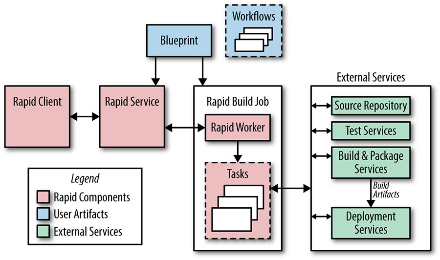

# Release Engineering

Written by Dinah McNutt  
Edited by Betsy Beyer and Tim Harvey

Release engineering is a relatively new and fast-growing discipline of software engineering that can be concisely described as building and delivering software [[McN14a]](/sre-book/bibliography#McN14a). Release engineers have a solid (if not expert) understanding of source code management, compilers, build configuration languages, automated build tools, package managers, and installers. Their skill set includes deep knowledge of multiple domains: development, configuration management, test integration, system administration, and customer support.

Running reliable services requires reliable release processes. Site Reliability Engineers (SREs) need to know that the binaries and configurations they use are built in a reproducible, automated way so that releases are repeatable and aren’t “unique snowflakes.” Changes to any aspect of the release process should be intentional, rather than accidental. SREs care about this process from source code to deployment.

Release engineering is a specific job function at Google. Release engineers work with software engineers (SWEs) in product development and SREs to define all the steps required to release software—from how the software is stored in the source code repository, to build rules for compilation, to how testing, packaging, and deployment are conducted.

## The Role of a Release Engineer

Google is a data-driven company and [release engineering](https://sre.google/workbook/canarying-releases/) follows suit. We have tools that report on a host of metrics, such as how much time it takes for a code change to be deployed into production (in other words, release velocity) and statistics on what features are being used in build configuration files [[Ada15]](/sre-book/bibliography#Ada15). Most of these tools were envisioned and developed by release engineers.

Release engineers define best practices for using our tools in order to make sure projects are released using consistent and repeatable methodologies. Our best practices cover all elements of the release process. Examples include compiler flags, formats for build identification tags, and required steps during a build. Making sure that our tools behave correctly by default and are adequately documented makes it easy for teams to stay focused on features and users, rather than spending time reinventing the wheel (poorly) when it comes to releasing software.

Google has a large number of SREs who are charged with safely deploying products and keeping Google services up and running. In order to make sure our release processes meet business requirements, release engineers and SREs work together to develop [strategies for canarying](https://sre.google/workbook/canarying-releases/) changes, pushing out new releases without interrupting services, and rolling back features that demonstrate problems.

## Philosophy

Release engineering is guided by an engineering and service philosophy that’s expressed through four major principles, detailed in the following sections.

### Self-Service Model

In order to work at scale, teams must be self-sufficient. Release engineering has developed best practices and tools that allow our product development teams to control and run their own release processes. Although we have thousands of engineers and products, we can achieve a high release velocity because individual teams can decide how often and when to release new versions of their products. Release processes can be automated to the point that they require minimal involvement by the engineers, and many projects are automatically built and released using a combination of our automated build system and our deployment tools. Releases are truly automatic, and only require engineer involvement if and when problems arise.

### High Velocity

User-facing software (such as many components of Google Search) is rebuilt frequently, as we aim to roll out customer-facing features as quickly as possible. We have embraced the philosophy that frequent releases result in fewer changes between versions. This approach makes testing and troubleshooting easier. Some teams perform hourly builds and then select the version to actually deploy to production from the resulting pool of builds. Selection is based upon the test results and the features contained in a given build. Other teams have adopted a “Push on Green” release model and deploy every build that passes all tests [[Kle14]](/sre-book/bibliography#Kle14).

### Hermetic Builds

Build tools must allow us to ensure consistency and repeatability. If two people attempt to build the same product at the same revision number in the source code repository on different machines, we expect identical results.[^36] Our builds are hermetic, meaning that they are insensitive to the libraries and other software installed on the build machine. Instead, builds depend on known versions of build tools, such as compilers, and dependencies, such as libraries. The build process is self-contained and must not rely on services that are external to the build environment.

Rebuilding older releases when we need to fix a bug in software that’s running in production can be a challenge. We accomplish this task by rebuilding at the same revision as the original build and including specific changes that were submitted after that point in time. We call this tactic *cherry picking*. Our build tools are themselves versioned based on the revision in the source code repository for the project being built. Therefore, a project built last month won’t use this month’s version of the compiler if a cherry pick is required, because that version may contain incompatible or undesired features.

### Enforcement of Policies and Procedures

Several layers of security and access control determine who can perform specific operations when releasing a project. Gated operations include:

- Approving source code changes—this operation is managed through configuration files scattered throughout the codebase
- Specifying the actions to be performed during the release process
- Creating a new release
- Approving the initial integration proposal (which is a request to perform a build at a specific revision number in the source code repository) and subsequent cherry picks
- Deploying a new release
- Making changes to a project’s build configuration

Almost all changes to the codebase require a code review, which is a streamlined action integrated into our normal developer workflow. Our automated release system produces a report of all changes contained in a release, which is archived with other build artifacts. By allowing SREs to understand what changes are included in a new release of a project, this report can expedite troubleshooting when there are problems with a release.

## Continuous Build and Deployment

Google has developed an automated release system called *Rapid*. Rapid is a system that leverages a number of Google technologies to provide a framework that delivers scalable, hermetic, and reliable releases. The following sections describe the software lifecycle at Google and how it is managed using Rapid and other associated tools.

### Building

Blaze[^37] is Google’s build tool of choice. It supports building binaries from a range of languages, including our standard languages of C++, Java, Python, Go, and JavaScript. Engineers use Blaze to define build targets (e.g., the output of a build, such as a JAR file), and to specify the dependencies for each target [[Kem11]](/sre-book/bibliography#Kem11). When performing a build, Blaze automatically builds the dependency targets.

Build targets for binaries and unit tests are defined in Rapid’s project configuration files. Project-specific flags, such as a unique build identifier, are passed by Rapid to Blaze. All binaries support a flag that displays the build date, the revision number, and the build identifier, which allow us to easily associate a binary to a record of how it was built.

### Branching

All code is checked into the main branch of the source code tree (mainline). However, most major projects don’t release directly from the mainline. Instead, we branch from the mainline at a specific revision and never merge changes from the branch back into the mainline. Bug fixes are submitted to the mainline and then cherry picked into the branch for inclusion in the release. This practice avoids inadvertently picking up unrelated changes submitted to the mainline since the original build occurred. Using this branch and cherry pick method, we know the exact contents of each release.

### Testing

A continuous test system runs [unit tests](https://sre.google/sre-book/testing-reliability/) against the code in the mainline each time a change is submitted, allowing us to detect build and test failures quickly. Release engineering recommends that the continuous build test targets correspond to the same test targets that gate the project release. We also recommend creating releases at the revision number (version) of the last continuous test build that successfully completed all tests. These measures decrease the chance that subsequent changes made to the mainline will cause failures during the build performed at release time.

During the release process, we re-run the unit tests using the release branch and create an audit trail showing that all the tests passed. This step is important because if a release involves cherry picks, the release branch may contain a version of the code that doesn’t exist anywhere on the mainline. We want to guarantee that the tests pass in the context of what’s actually being released.

To complement the continuous test system, we use an independent testing environment that runs system-level tests on packaged build artifacts. These tests can be launched manually or from Rapid.

### Packaging

Software is distributed to our production machines via the Midas Package Manager (MPM) [[McN14c]](/sre-book/bibliography#McN14c). MPM assembles packages based on Blaze rules that list the build artifacts to include, along with their owners and permissions. Packages are named (e.g., *search/shakespeare/frontend*), versioned with a unique hash, and signed to ensure authenticity. MPM supports applying labels to a particular version of a package. Rapid applies a label containing the build ID, which guarantees that a package can be uniquely referenced using the name of the package and this label.

Labels can be applied to an MPM package to indicate a package’s location in the release process (e.g., `dev`, `canary`, or `production`). If you apply an existing label to a new package, the label is automatically moved from the old package to the new package. For example: if a package is labeled as `canary`, someone subsequently installing the canary version of that package will automatically receive the newest version of the package with the label `canary`.

### Rapid

[Figure 8-1](#fig_release-engineering_simplified-rapid-architecture) shows the main components of the Rapid system. Rapid is configured with files called *blueprints*. Blueprints are written in an internal configuration language and are used to define build and test targets, rules for deployment, and administrative information (like project owners). Role-based access control lists determine who can perform specific actions on a Rapid project.

*Figure 8-1. Simplified view of Rapid architecture showing the main components of the system*

Each Rapid project has workflows that define the actions to perform during the release process. Workflow actions can be performed serially or in parallel, and a workflow can launch other workflows. Rapid dispatches work requests to tasks running as a Borg job on our production servers. Because Rapid uses our production infrastructure, it can handle thousands of release requests simultaneously.

A typical release process proceeds as follows:

1.  Rapid uses the requested integration revision number (often obtained automatically from our continuous test system) to create a release branch.
2.  Rapid uses Blaze to compile all the binaries and execute the unit tests, often performing these two steps in parallel. Compilation and testing occur in environments dedicated to those specific tasks, as opposed to taking place in the Borg job where the Rapid workflow is executing. This separation allows us to parallelize work easily.
3.  Build artifacts are then available for system testing and canary deployments. A typical canary deployment involves starting a few jobs in our production environment after the completion of system tests.
4.  The results of each step of the process are logged. A report of all changes since the last release is created.

Rapid allows us to manage our release branches and cherry picks; individual cherry pick requests can be approved or rejected for inclusion in a release.

### Deployment

Rapid is often used to drive simple deployments directly. It updates the Borg jobs to use newly built MPM packages based on deployment definitions in the blueprint files and specialized task executors.

For more complicated deployments, we use Sisyphus, which is a general-purpose rollout automation framework developed by SRE. A rollout is a logical unit of work that is composed of one or more individual tasks. Sisyphus provides a set of Python classes that can be extended to support any deployment process. It has a dashboard that allows for finer control on how the rollout is performed and provides a way to monitor the rollout’s progress.

In a typical integration, Rapid creates a rollout in a long-running Sisyphus job. Rapid knows the build label associated with the MPM package it created, and can specify that build label when creating the rollout in Sisyphus. Sisyphus uses the build label to specify which version of the MPM packages should be deployed.

With Sisyphus, the rollout process can be as simple or complicated as necessary. For example, it can update all the associated jobs immediately or it can roll out a new binary to successive clusters over a period of several hours.

Our goal is to fit the deployment process to the risk profile of a given service. In development or pre-production environments, we may build hourly and push releases automatically when all tests pass. For large user-facing services, we may push by starting in one cluster and expand exponentially until all clusters are updated. For sensitive pieces of infrastructure, we may extend the rollout over several days, interleaving them across instances in different geographic regions.

## Configuration Management

Configuration management is one area of particularly close collaboration between release engineers and SREs. Although configuration management may initially seem a deceptively simple problem, configuration changes are a potential source of instability. As a result, our approach to releasing and managing system and service configurations has evolved substantially over time. Today we use several models for distributing configuration files, as described in the following paragraphs. All schemes involve storing configuration in our primary source code repository and enforcing a strict code review requirement.

*Use the mainline for configuration.* This was the first method used to configure services in Borg (and the systems that pre-dated Borg). Using this scheme, developers and SREs modify configuration files at the head of the main branch. The changes are reviewed and then applied to the running system. As a result, binary releases and configuration changes are decoupled. While conceptually and procedurally simple, this technique often leads to skew between the checked-in version of the configuration files and the running version of the configuration file because jobs must be updated in order to pick up the changes.

*Include configuration files and binaries in the same MPM package.* For projects with few configuration files or projects where the files (or a subset of files) change with each release cycle, the configuration files can be included in the MPM package with the binaries. While this strategy limits flexibility by binding the binary and configuration files tightly, it simplifies deployment, because it only requires installing one package.

*Package configuration files into MPM "configuration packages."* We can apply the hermetic principle to configuration management. Binary configurations tend to be tightly bound to particular versions of binaries, so we leverage the build and packaging systems to snapshot and release configuration files alongside their binaries. Similar to our treatment of binaries, we can use the build ID to reconstruct the configuration at a specific point in time.

For example, a change that implements a new feature can be released with a flag setting that configures that feature. By generating two MPM packages, one for the binary and one for the configuration, we retain the ability to change each package independently. That is, if the feature was released with a flag setting of `first_folio` but we realize it should instead be `bad_quarto`, we can cherry pick that change onto the release branch, rebuild the configuration package, and deploy it. This approach has the advantage of not requiring a new binary build.

We can leverage MPM’s labeling feature to indicate which versions of MPM packages should be installed together. A label of `much_ado` can be applied to the MPM packages described in the previous paragraph, which allows us to fetch both packages using this label. When a new version of the project is built, the `much_ado` label will be applied to the new packages. Because these tags are unique within the namespace for an MPM package, only the latest package with that tag will be used.

*Read configuration files from an external store.* Some projects have configuration files that need to change frequently or dynamically (i.e., while the binary is running). These files can be stored in Chubby, Bigtable, or our source-based filesystem [[Yor11]](/sre-book/bibliography#Yor11).

In summary, project owners consider the different options for distributing and managing configuration files and decide which works best on a case-by-case basis.

## Conclusions

While this chapter has specifically discussed Google’s approach to release engineering and the ways in which release engineers work and collaborate with SREs, these practices can also be applied more widely.

### It’s Not Just for Googlers

When equipped with the right tools, proper automation, and well-defined policies, developers and SREs shouldn’t have to worry about releasing software. Releases can be as painless as simply pressing a button.

Most companies deal with the same set of release engineering problems regardless of their size or the tools they use: How should you handle versioning of your packages? Should you use a continuous build and deploy model, or perform periodic builds? How often should you release? What configuration management policies should you use? What release metrics are of interest?

Google Release Engineers have developed our own tools out of necessity because open sourced or vendor-supplied tools don’t work at the scale we require. Custom tools allow us to include functionality to support (and even enforce) release process policies. However, these policies must first be defined in order to add appropriate features to our tools, and all companies should take the effort to define their release processes whether or not the processes can be automated and/or enforced.

### Start Release Engineering at the Beginning

Release engineering has often been an afterthought, and this way of thinking must change as platforms and services continue to grow in size and complexity.

Teams should budget for release engineering resources at the beginning of the product development cycle. It’s cheaper to put good practices and process in place early, rather than have to retrofit your system later.

It is essential that the developers, SREs, and release engineers work together. The release engineer needs to understand the intention of how the code should be built and deployed. The developers shouldn’t build and “throw the results over the fence” to be handled by the release engineers.

Individual project teams decide when release engineering becomes involved in a project. Because release engineering is still a relatively young discipline, managers don’t always plan and budget for release engineering in the early stages of a project. Therefore, when considering how to incorporate release engineering practices, be sure that you consider its role as applied to the entire lifecycle of your product or service—particularly the early stages.

> **More Information**
>
> For more information on release engineering, see the following presentations, each of which has video available online:
>
> - [*How Embracing Continuous Release Reduced Change Complexity*](https://usenix.org/conference/ures14west/summit-program/presentation/dickson), USENIX Release Engineering Summit West 2014, [[Dic14]](/sre-book/bibliography#Dic14)
> - [*Maintaining Consistency in a Massively Parallel Environment*](https://www.usenix.org/conference/ucms13/summit-program/presentation/mcnutt), USENIXConfiguration Management Summit 2013, [[McN13]](/sre-book/bibliography#McN13)
> - [*The 10 Commandments of Release Engineering*](https://www.youtube.com/watch?v=RNMjYV_UsQ8), 2nd International Workshop on Release Engineering 2014, [[McN14b]](/sre-book/bibliography#McN14b)
> - [*Distributing Software in a Massively Parallel Environment*](https://www.usenix.org/conference/lisa14/conference-program/presentation/mcnutt), LISA 2014, [[McN14c]](/sre-book/bibliography#McN14c)

[^36]: Google uses a monolithic unified source code repository; see [Pot16].

[^37]: Blaze has been open sourced as Bazel. See “Bazel FAQ” on the Bazel website, https://bazel.build/faq.html.
