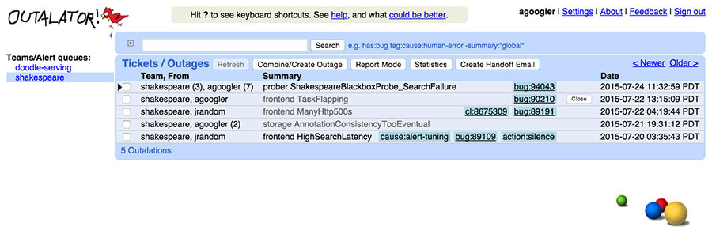
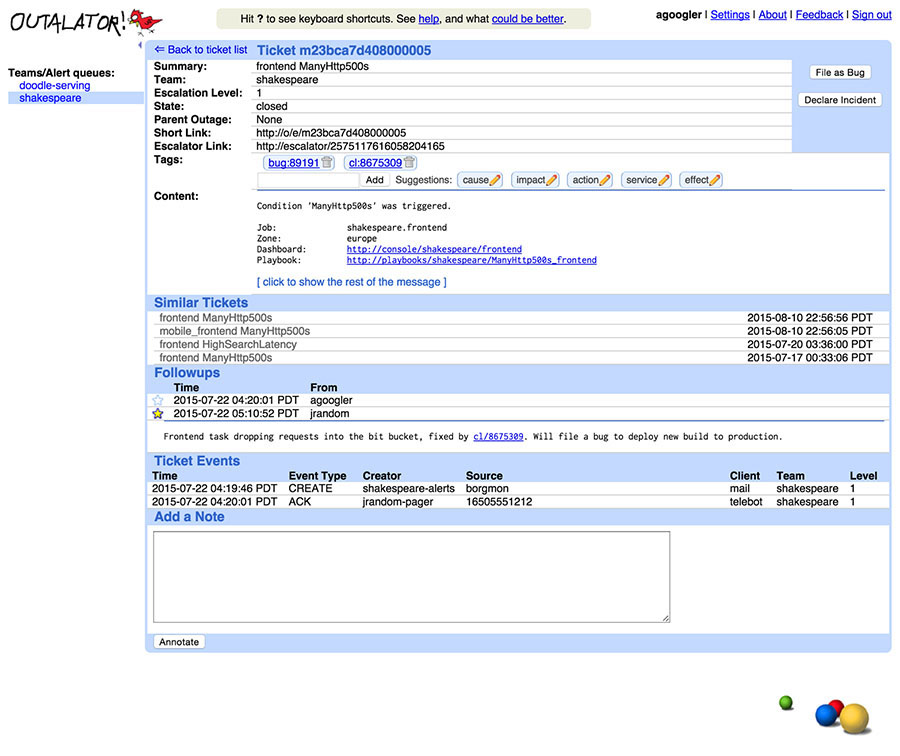

# Tracking Outages

Written by Gabe Krabbe  
Edited by Lisa Carey

Improving reliability over time is only possible if you start from a known baseline and can track progress. "Outalator," our outage tracker, is one of the tools we use to do just that. Outalator is a system that passively receives all alerts sent by our monitoring systems and allows us to annotate, group, and analyze this data.

Systematically learning from past problems is essential to effective service management. Postmortems (see [Postmortem Culture: Learning from Failure](/sre-book/postmortem-culture/)) provide detailed information for individual outages, but they are only part of the answer. They are only written for incidents with a large impact, so issues that have individually small impact but are frequent and widespread don’t fall within their scope. Similarly, postmortems tend to provide useful insights for improving a single service or set of services, but may miss opportunities that would have a small effect in individual cases, or opportunities that have a poor cost/benefit ratio, but that would have large horizontal impact.[^84]

We can also get useful information from questions such as, "How many alerts per on-call shift does this team get?", "What’s the ratio of actionable/nonactionable alerts over the last quarter?", or even simply "Which of the services this team manages creates the most toil?"

## Escalator

At Google, all alert notifications for SRE share a central replicated system that tracks whether a human has acknowledged receipt of the notification. If no acknowledgment is received after a configured interval, the system escalates to the next configured destination(s)—e.g., from primary on-call to secondary. This system, called "The Escalator," was initially designed as a largely transparent tool that received copies of emails sent to on-call aliases. This functionality allowed Escalator to easily integrate with existing workflows without requiring any change in user behavior (or, at the time, monitoring system behavior).

## Outalator

Following Escalator’s example, where we added useful features to existing infrastructure, we created a system that would deal not just with the individual escalating notifications, but with the next layer of abstraction: outages.

Outalator lets users view a time-interleaved list of notifications for multiple queues at once, instead of requiring a user to switch between queues manually. [Figure 16-1](#outalator_queue) shows multiple queues as they appear in Outalator’s queue view. This functionality is handy because frequently a single SRE team is the primary point of contact for services with distinct secondary escalation targets, usually the developer teams.

*Figure 16-1. Outalator queue view*

Outalator stores a copy of the original notification and allows annotating incidents. For convenience, it silently receives and saves a copy of any email replies as well. Because some follow-ups are less helpful than others (for example, a reply-all sent with the sole purpose of adding more recipients to the cc list), annotations can be marked as "important." If an annotation is important, other parts of the message are collapsed into the interface to cut down on clutter. Together, this provides more context when referring to an incident than a possibly fragmented email thread.

Multiple escalating notifications ("alerts") can be combined into a single entity ("incident") in the Outalator. These notifications may be related to the same single incident, may be otherwise unrelated and uninteresting auditable events such as privileged database access, or may be spurious monitoring failures. This grouping functionality, shown in [Figure 16-2](#outalator_view_outage), unclutters the overview displays and allows for separate analysis of "incidents per day" versus "alerts per day."

*Figure 16-2. Outalator view of an incident*

> **Building Your Own Outalator**
>
> Many organizations use messaging systems like Slack, Hipchat, or even IRC for internal communication and/or updating status dashboards. These systems are great places to hook into with a system like Outalator.

### Aggregation

A single event may, and often will, trigger multiple alerts. For example, network failures cause timeouts and unreachable backend services for everyone, so all affected teams receive their own alerts, including the owners of backend services; meanwhile, the network operations center will have its own klaxons ringing. However, even smaller issues affecting a single service may trigger multiple alerts due to multiple error conditions being diagnosed. While it is worthwhile to attempt to minimize the number of alerts triggered by a single event, triggering multiple alerts is unavoidable in most trade-off calculations between false positives and false negatives.

The ability to group multiple alerts together into a single *incident* is critical in dealing with this duplication. Sending an email saying "this is the same thing as that other thing; they are symptoms of the same incident" works for a given alert: it can prevent duplication of debugging or panic. But sending an email for each alert is not a practical or scalable solution for handling duplicate alerts within a team, let alone between teams or over longer periods of time.

### Tagging

Of course, not every alerting event is an incident. False-positive alerts occur, as well as test events or mistargeted emails from humans. The Outalator itself does not distinguish between these events, but it allows general-purpose *tagging* to add metadata to notifications, at any level. Tags are mostly free-form, single "words." Colons, however, are interpreted as semantic separators, which subtly promotes the use of hierarchical namespaces and allows some automatic treatment. This namespacing is supported by suggested tag prefixes, primarily "cause" and "action," but the list is team-specific and generated based on historical usage. For example, "cause:network" might be sufficient information for some teams, whereas another team might opt for more specific tags, such as "cause:network:switch" versus "cause:network:cable." Some teams may frequently use "customer:132456”-style tags, so "customer" would be suggested for those teams, but not for others.

Tags can be parsed and turned into a convenient link ("bug:76543" links to the bug tracking system). Other tags are just a single word ("bogus" is widely used for false positives). Of course, some tags are typos ("cause:netwrok") and some tags aren’t particularly helpful ("problem-went-away"), but avoiding a predetermined list and allowing teams to find their own preferences and standards will result in a more useful tool and better data. Overall, tags have been a remarkably powerful tool for teams to obtain and provide an overview of a given service’s pain points, even without much, or even any, formal analysis. As trivial as tagging appears, it is probably one of the Outalator’s most useful unique features.

### Analysis

Of course, SRE does much more than just react to incidents. Historical data is useful when one is responding to an incident—the question "what did we do last time?" is always a good starting point. But historical information is far more useful when it concerns systemic, periodic, or other wider problems that may exist. Enabling such analysis is one of the most important functions of an outage tracking tool.

The bottom layer of analysis encompasses counting and basic aggregate statistics for reporting. The details depend on the team, but include information such as incidents per week/month/quarter and alerts per incident. The next layer is more important, and easy to provide: comparison between teams/services and over time to identify first patterns and trends. This layer allows teams to determine whether a given alert load is "normal" relative to their own track record and that of other services. "That’s the third time this week" can be good or bad, but knowing whether "it" used to happen five times per day or five times per month allows interpretation.

The next step in data analysis is finding wider issues, which are not just raw counts but require some semantic analysis. For example, identifying the infrastructure component causing most incidents, and therefore the potential benefit from increasing the stability or performance of this component,[^85] assumes that there is a straightforward way to provide this information alongside the incident records. As a simple example: different teams have service-specific alert conditions such as "stale data" or "high latency." Both conditions may be caused by network congestion leading to database replication delays and need intervention. Or, they could be within the nominal service level objective, but are failing to meet the higher expectations of users. Examining this information across multiple teams allows us to identify systemic problems and choose the correct solution, especially if the solution may be the introduction of more artificial failures to stop over-performing.

### Reporting and communication

Of more immediate use to frontline SREs is the ability to select zero or more outalations and include their subjects, tags, and "important" annotations in an email to the next on-call engineer (and an arbitrary cc list) in order to pass on recent state between shifts. For periodic reviews of the production services (which occur weekly for most teams), the Outalator also supports a "report mode," in which the important annotations are expanded inline with the main list in order to provide a quick overview of lowlights.

### Unexpected Benefits

Being able to identify that an alert, or a flood of alerts, coincides with a given other outage has obvious benefits: it increases the speed of diagnosis and reduces load on other teams by acknowledging that there is indeed an incident. There are additional nonobvious benefits. To use Bigtable as an example, if a service has a disruption due to an apparent Bigtable incident, but you can see that the Bigtable SRE team has not been alerted, manually alerting the team is probably a good idea. Improved cross-team visibility can and does make a big difference in incident resolution, or at least in incident mitigation.

Some teams across the company have gone so far as to set up dummy escalator configurations: no human receives the notifications sent there, but the notifications appear in the Outalator and can be tagged, annotated, and reviewed. One example for this "system of record" use is to log and audit the use of privileged or role accounts (though it must be noted that this functionality is basic, and used for technical, rather than legal, audits). Another use is to record and automatically annotate runs of periodic jobs that may not be idempotent—for example, automatic application of schema changes from version control to database systems.

[^84]: For example, it might take significant engineering effort to make a particular change to Bigtable that only has a small mitigating effect for one outage. However, if that same mitigation were available across many events, the engineering effort may well be worthwhile.

[^85]: On the one hand, "most incidents caused" is a good starting point for reducing the number of alerts triggered and improving the overall system. On the other hand, this metric may simply be an artifact of over-sensitive monitoring or a small set of client systems misbehaving or themselves running outside the agreed service level. And on the gripping hand, the number of incidents alone gives no indication as to the difficulty to fix or severity of impact.
