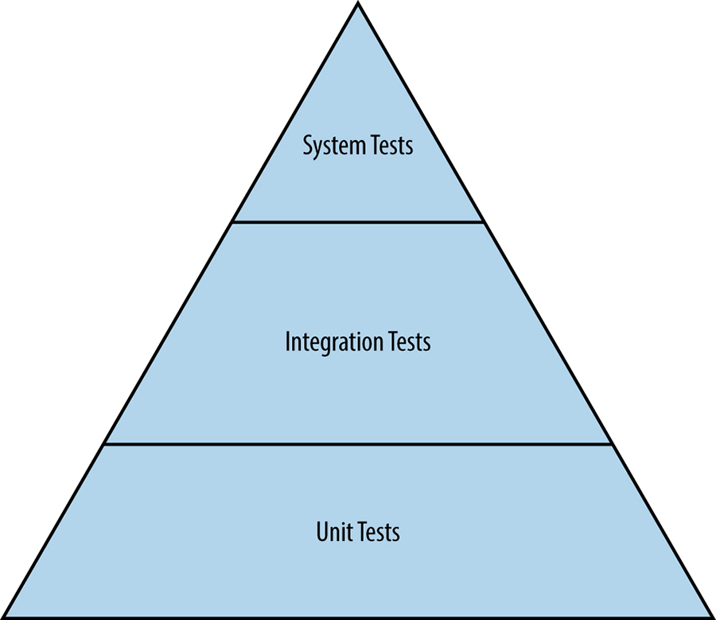
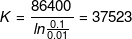

# Testing for Reliability

Written by Alex Perry and Max Luebbe  
Edited by Diane Bates

> If you haven't tried it, assume it's broken.
>
> Unknown

One key responsibility of Site Reliability Engineers is to quantify confidence in the systems they maintain. SREs perform this task by adapting classical [software testing techniques](https://sre.google/sre-book/testing-reliability/) to systems at scale.[^86] Confidence can be measured both by past reliability and future reliability. The former is captured by analyzing data provided by monitoring historic system behavior, while the latter is quantified by making predictions from data about past system behavior. In order for these predictions to be strong enough to be useful, one of the following conditions must hold:

- The site remains completely unchanged over time with no software releases or changes in the server fleet, which means that future behavior will be similar to past behavior.
- You can confidently describe all changes to the site, in order for analysis to allow for the uncertainty incurred by each of these changes.

Testing is the mechanism you use to demonstrate specific areas of equivalence when changes occur.[^87] Each test that passes both before and after a change reduces the uncertainty for which the analysis needs to allow. Thorough testing helps us predict the future reliability of a given site with enough detail to be practically useful.

The amount of testing you need to conduct depends on the reliability requirements for your system. As the percentage of your codebase covered by tests increases, you reduce uncertainty and the potential decrease in reliability from each change. Adequate testing coverage means that you can make more changes before reliability falls below an acceptable level. If you make too many changes too quickly, the predicted reliability approaches the acceptability limit. At this point, you may want to stop making changes while new monitoring data accumulates. The accumulating data supplements the tested coverage, which validates the reliability being asserted for revised execution paths. Assuming the served clients are randomly distributed [[Woo96]](/sre-book/bibliography#Woo96), sampling statistics can extrapolate from monitored metrics whether the aggregate behavior is making use of new paths. These statistics identify the areas that need better testing or other retrofitting.

##### Relationships Between Testing and Mean Time to Repair

Passing a test or a series of tests doesn’t necessarily prove reliability. However, tests that are failing generally prove the absence of reliability.

A monitoring system can uncover bugs, but only as quickly as the reporting pipeline can react. The *Mean Time to Repair* (MTTR) measures how long it takes the operations team to fix the bug, either through a rollback or another action.

It’s possible for a testing system to identify a bug with zero MTTR. Zero MTTR occurs when a system-level test is applied to a subsystem, and that test detects the exact same problem that monitoring would detect. Such a test enables the push to be blocked so the bug never reaches production (though it still needs to be repaired in the source code). Repairing zero MTTR bugs by blocking a push is both quick and convenient. The more bugs you can find with zero MTTR, the higher the *Mean Time Between Failures* (MTBF) experienced by your users.

As MTBF increases in response to better testing, developers are encouraged to release features faster. Some of these features will, of course, have bugs. New bugs result in an opposite adjustment to release velocity as these bugs are found and fixed.

Authors writing about software testing largely agree on what coverage is needed. Most conflicts of opinion stem from conflicting terminology, differing emphasis on the impact of testing in each of the software lifecycle phases, or the particularities of the systems on which they’ve conducted testing. For a discussion about testing at Google in general, see [[Whi12]](/sre-book/bibliography#Whi12). The following sections specify how software testing–related terminology is used in this chapter.

## Types of Software Testing

Software tests broadly fall into two categories: traditional and production. Traditional tests are more common in software development to evaluate the correctness of software offline, during development. Production tests are performed on a live web service to evaluate whether a deployed software system is working correctly.

## Traditional Tests

As shown in [Figure 17-1](#fig_testing_hierarchy), traditional software testing begins with unit tests. Testing of more complex functionality is layered atop unit tests.

*Figure 17-1. The hierarchy of traditional tests*

### Unit tests

A *unit test* is the smallest and simplest form of software testing. These tests are employed to assess a separable unit of software, such as a class or function, for correctness independent of the larger software system that contains the unit. Unit tests are also employed as a form of specification to ensure that a function or module exactly performs the behavior required by the system. Unit tests are commonly used to introduce test-driven development concepts.

### Integration tests

Software components that pass individual unit tests are assembled into larger components. Engineers then run an *integration test* on an assembled component to verify that it functions correctly. Dependency injection, which is performed with tools such as Dagger,[^88] is an extremely powerful technique for creating mocks of complex dependencies so that an engineer can cleanly test a component. A common example of a dependency injection is to replace a stateful database with a lightweight mock that has precisely specified behavior.

### System tests

A *system test* is the largest scale test that engineers run for an undeployed system. All modules belonging to a specific component, such as a server that passed integration tests, are assembled into the system. Then the engineer tests the end-to-end functionality of the system. System tests come in many different flavors:

Smoke tests  
*Smoke tests*, in which engineers test very simple but critical behavior, are among the simplest type of system tests. Smoke tests are also known as *sanity testing*, and serve to short-circuit additional and more expensive testing.

Performance tests  
Once basic correctness is established via a smoke test, a common next step is to write another variant of a system test to ensure that the performance of the system stays acceptable over the duration of its lifecycle. Because response times for dependencies or resource requirements may change dramatically during the course of development, a system needs to be tested to make sure that it doesn’t become incrementally slower without anyone noticing (before it gets released to users). For example, a given program may evolve to need 32 GB of memory when it formerly only needed 8 GB, or a 10 ms response time might turn into 50 ms, and then into 100 ms. A performance test ensures that over time, a system doesn’t degrade or become too expensive.

Regression tests  
Another type of system test involves preventing bugs from sneaking back into the codebase. Regression tests can be analogized to a gallery of rogue bugs that historically caused the system to fail or produce incorrect results. By documenting these bugs as tests at the system or integration level, engineers refactoring the codebase can be sure that they don’t accidentally introduce bugs that they’ve already invested time and effort to eliminate.

It’s important to note that tests have a cost, both in terms of time and computational resources. At one extreme, unit tests are very cheap in both dimensions, as they can usually be completed in milliseconds on the resources available on a laptop. At the other end of the spectrum, bringing up a complete server with required dependencies (or mock equivalents) to run related tests can take significantly more time—from several minutes to multiple hours—and possibly require dedicated computing resources. Mindfulness of these costs is essential to developer productivity, and also encourages more efficient use of testing resources.

## Production Tests

Production tests interact with a live production system, as opposed to a system in a hermetic testing environment. These tests are in many ways similar to black-box monitoring (see [Monitoring Distributed Systems](/sre-book/monitoring-distributed-systems/)), and are therefore sometimes called *black-box testing*. Production tests are essential to running a reliable production service.

##### Rollouts Entangle Tests

It’s often said that testing is (or should be) performed in a hermetic environment [[Nar12]](/sre-book/bibliography#Nar12). This statement implies that production is not hermetic. Of course, production usually isn’t hermetic, because rollout cadences make live changes to the production environment in small and well-understood chunks.

To manage uncertainty and hide risk from users, changes might not be pushed live in the same order that they were added to source control. Rollouts often happen in stages, using mechanisms that gradually shuffle users around, in addition to monitoring at each stage to ensure that the new environment isn’t hitting anticipated yet unexpected problems. As a result, the entire production environment is intentionally not representative of any given version of a binary that’s checked into source control.

It’s possible for source control to have more than one version of a binary and its associated configuration file waiting to be made live. This scenario can cause problems when tests are conducted against the live environment. For example, the test might use the latest version of a configuration file located in source control along with an older version of the binary that’s live. Or it might test an older version of the configuration file and find a bug that’s been fixed in a newer version of the file.

Similarly, a system test can use the configuration files to assemble its modules before running the test. If the test passes, but its version is one in which the configuration test (discussed in the following section) fails, the result of the test is valid hermetically, but not operationally. Such an outcome is inconvenient.

### Configuration test

At Google, web service configurations are described in files that are stored in our version control system. For each configuration file, a separate *configuration test* examines production to see how a particular binary is actually configured and reports discrepancies against that file. Such tests are inherently not hermetic, as they operate outside the test infrastructure sandbox.

Configuration tests are built and tested for a specific version of the checked-in configuration file. Comparing which version of the test is passing in relation to the goal version for automation implicitly indicates how far actual production currently lags behind ongoing engineering work.

These nonhermetic configuration tests tend to be especially valuable as part of a distributed monitoring solution since the pattern of passes/fails across production can identify paths through the service stack that don’t have sensible combinations of the local configurations. The monitoring solution’s rules try to match paths of actual user requests (from the trace logs) against that set of undesirable paths. Any matches found by the rules become alerts that ongoing releases and/or pushes are not proceeding safely and remedial action is needed.

Configuration tests can be very simple when the production deployment uses the actual file content and offers a real-time query to retrieve a copy of the content. In this case, the test code simply issues that query and diffs the response against the file. The tests become more complex when the configuration does one of the following:

- Implicitly incorporates defaults that are built into the binary (meaning that the tests are separately versioned as a result)
- Passes through a preprocessor such as bash into command-line flags (rendering the tests subject to expansion rules)
- Specifies behavioral context for a shared runtime (making the tests depend on that runtime’s release schedule)

### Stress test

In order to safely operate a system, SREs need to understand the limits of both the system and its components. In many cases, individual components don’t gracefully degrade beyond a certain point—instead, they catastrophically fail. Engineers use *stress tests* to find the limits on a web service. Stress tests answer questions such as:

- How full can a database get before writes start to fail?
- How many queries a second can be sent to an application server before it becomes overloaded, causing requests to fail?

### Canary test

The *canary test* is conspicuously absent from this list of production tests. The term *canary* comes from the phrase "canary in a coal mine," and refers to the practice of using a live bird to detect toxic gases before humans were poisoned.

To conduct a canary test, a subset of servers is upgraded to a new version or configuration and then left in an incubation period. Should no unexpected variances occur, the release continues and the rest of the servers are upgraded in a progressive fashion.[^89] Should anything go awry, the modified servers can be quickly reverted to a known good state. We commonly refer to the incubation period for the upgraded servers as "baking the binary."

A canary test isn’t really a test; rather, it’s structured user acceptance. Whereas configuration and stress tests confirm the existence of a specific condition over deterministic software, a canary test is more ad hoc. It only exposes the code under test to less predictable live production traffic, and thus, it isn’t perfect and doesn’t always catch newly introduced faults.

To provide a concrete example of how a canary might proceed: consider a given underlying fault that relatively rarely impacts user traffic and is being deployed with an upgrade rollout that is exponential. We expect a growing cumulative number of reported variances CU = RK where R is the rate of those reports, U is the order of the fault (defined later), and K is the period over which the traffic grows by a factor of e, or 172%.[^90]

In order to avoid user impact, a rollout that triggers undesirable variances needs to be quickly rolled back to the prior configuration. In the short time it takes automation to observe the variances and respond, it is likely that several additional reports will be generated. Once the dust has settled, these reports can estimate both the cumulative number C and rate R.

Dividing and correcting for K gives an estimate of U, the order of the underlying fault.[^91] Some examples:

- U=1: The user’s request encountered code that is simply broken.
- U=2: This user’s request randomly damages data that a future user’s request may see.
- U=3: The randomly damaged data is also a valid identifier to a previous request.

Most bugs are of order one: they scale linearly with the amount of user traffic [[Per07]](/sre-book/bibliography#Per07). You can generally track down these bugs by converting logs of all requests with unusual responses into new regression tests. This strategy doesn’t work for higher-order bugs; a request that repeatedly fails if all the preceding requests are attempted in order will suddenly pass if some requests are omitted. It is important to catch these higher-order bugs during release, because otherwise, operational workload can increase very quickly.

Keeping the dynamics of higher- versus lower-order bugs in mind, when you are using an exponential rollout strategy, it isn’t necessary to attempt to achieve fairness among fractions of user traffic. As long as each method for establishing a fraction uses the same K interval, the estimate of U will be valid even though you can’t yet determine which method was instrumental in illuminating the fault. Using many methods sequentially while permitting some overlap keeps the value of K small. This strategy minimizes the total number of user-visible variances C while still allowing an early estimate of U (hoping for 1, of course).

# Creating a Test and Build Environment

While it’s wonderful to think about these types of tests and failure scenarios on day one of a project, frequently SREs join a developer team when a project is already well underway—once the team’s project validates its research model, its library proves that the project’s underlying algorithm is scalable, or perhaps when all of the user interface mocks are finally acceptable. The team’s codebase is still a prototype and comprehensive testing hasn’t yet been designed or deployed. In such situations, where should your testing efforts begin? Conducting unit tests for every key function and class is a completely overwhelming prospect if the current test coverage is low or nonexistent. Instead, start with testing that delivers the most impact with the least effort.

You can start your approach by asking the following questions:

- Can you prioritize the codebase in any way? To borrow a technique from feature development and project management, if every task is high priority, none of the tasks are high priority. Can you stack-rank the components of the system you’re testing by any measure of importance?
- Are there particular functions or classes that are absolutely mission-critical or business-critical? For example, code that involves billing is a commonly business-critical. Billing code is also frequently cleanly separable from other parts of the system.
- Which APIs are other teams integrating against? Even the kind of breakage that never makes it past release testing to a user can be extremely harmful if it confuses another developer team, causing them to write wrong (or even just suboptimal) clients for your API.

Shipping software that is obviously broken is among the most cardinal sins of a developer. It takes little effort to create a series of smoke tests to run for every release. This type of low-effort, high-impact first step can lead to highly tested, reliable software.

One way to establish a strong testing culture[^92] is to start documenting all reported bugs as test cases. If every bug is converted into a test, each test is supposed to initially fail because the bug hasn’t yet been fixed. As engineers fix the bugs, the software passes testing and you’re on the road to developing a comprehensive regression test suite.

Another key task for creating well-tested software is to set up a testing infrastructure. The foundation for a strong testing infrastructure is a versioned source control system that tracks every change to the codebase.

Once source control is in place, you can add a continuous build system that builds the software and runs tests every time code is submitted. We’ve found it optimal if the build system notifies engineers the moment a change breaks a software project. At the risk of sounding obvious, it’s essential that the latest version of a software project in source control is working completely. When the build system notifies engineers about broken code, they should drop all of their other tasks and prioritize fixing the problem. It is appropriate to treat defects this seriously for a few reasons:

- It’s usually harder to fix what’s broken if there are changes to the codebase after the defect is introduced.
- Broken software slows down the team because they must work around the breakage.
- Release cadences, such as nightly and weekly builds, lose their value.
- The ability of the team to respond to a request for an emergency release (for example, in response to a security vulnerability disclosure) becomes much more complex and difficult.

The concepts of stability and agility are traditionally in tension in the world of SRE. The last bullet point provides an interesting case where stability actually drives agility. When the build is predictably solid and reliable, developers can iterate faster!

Some build systems like Bazel[^93] have valuable features that afford more precise control over testing. For example, Bazel creates dependency graphs for software projects. When a change is made to a file, Bazel only rebuilds the part of the software that depends on that file. Such systems provide reproducible builds. Instead of running all tests at every submit, tests only run for changed code. As a result, tests execute cheaper and faster.

There are a variety of tools to help you quantify and visualize the level of test coverage you need [[Cra10]](/sre-book/bibliography#Cra10). Use these tools to shape the focus of your testing: approach the prospect of creating highly tested code as an engineering project rather than a philosophical mental exercise. Instead of repeating the ambiguous refrain "We need more tests," set explicit goals and deadlines.

Remember that not all software is created equal. Life-critical or revenue-critical systems demand substantially higher levels of test quality and coverage than a non-production script with a short shelf life.

# Testing at Scale

Now that we’ve covered the fundamentals of testing, let’s examine how SRE takes a systems perspective to testing in order to drive reliability at scale.

A small unit test might have a short list of dependencies: one source file, the testing library, the runtime libraries, the compiler, and the local hardware running the tests. A robust testing environment dictates that those dependencies each have their own test coverage, with tests that specifically address use cases that other parts of the environment expect. If the implementation of that unit test depends on a code path inside a runtime library that doesn’t have test coverage, an unrelated change in the environment[^94] can lead the unit test to consistently pass testing, regardless of faults in the code under test.

In contrast, a release test might depend on so many parts that it has a transitive dependency on every object in the code repository. If the test depends on a clean copy of the production environment, in principle, every small patch requires performing a full disaster recovery iteration. Practical testing environments try to select branch points among the versions and merges. Doing so resolves the maximum amount of dependent uncertainty for the minimum number of iterations. Of course, when an area of uncertainty resolves into a fault, you need to select additional branch points.

## Testing Scalable Tools

As pieces of software, SRE tools also need testing.[^95] SRE-developed tools might perform tasks such as the following:

- Retrieving and propagating database performance metrics
- Predicting usage metrics to plan for capacity risks
- Refactoring data within a service replica that isn’t user accessible
- Changing files on a server

SRE tools share two characteristics:

- Their side effects remain within the tested mainstream API
- They’re isolated from user-facing production by an existing validation and release barrier

##### Barrier Defenses Against Risky Software

Software that bypasses the usual heavily tested API (even if it does so for a good cause) could wreak havoc on a live service. For example, a database engine implementation might allow administrators to temporarily turn off transactions in order to shorten maintenance windows. If the implementation is used by batch update software, user-facing isolation may be lost if that utility is ever accidentally launched against a user-facing replica. Avoid this risk of havoc with design:

1.  Use a separate tool to place a barrier in the replication configuration so that the replica cannot pass its health check. As a result, the replica isn’t released to users.
2.  Configure the risky software to check for the barrier upon startup. Allow the risky software to only access unhealthy replicas.
3.  Use the replica health validating tool you use for black-box monitoring to remove the barrier.

Automation tools are also software. Because their risk footprint appears out-of-band for a different layer of the service, their testing needs are more subtle. Automation tools perform tasks like the following:

- Database index selection
- Load balancing between datacenters
- Shuffling relay logs for fast remastering

Automation tools share two characteristics:

- The actual operation performed is against a robust, predictable, and well-tested API
- The purpose of the operation is the side effect that is an invisible discontinuity to another API client

Testing can demonstrate the desired behavior of the other service layer, both before and after the change. It’s often possible to test whether internal state, as seen through the API, is constant across the operation. For example, databases pursue correct answers, even if a suitable index isn’t available for the query. On the other hand, some documented API invariants (such as a DNS cache holding until the TTL) may not hold across the operation. For example, if a runlevel change replaces a local nameserver with a caching proxy, both choices can promise to retain completed lookups for many seconds. It’s unlikely that the cache state is handed over from one to the other.

Given that automation tools imply additional release tests for other binaries to handle environmental transients, how do you define the environment in which those automation tools run? After all, the automation for shuffling containers to improve usage is likely to try to shuffle itself at some point if it also runs in a container. It would be embarrassing if a new release of its internal algorithm yielded dirty memory pages so quickly that the network bandwidth of the associated mirroring ended up preventing the code from finalizing the live migration. Even if there’s an integration test for which the binary intentionally shuffles itself around, the test likely doesn’t use a production-sized model of the container fleet. It almost certainly isn’t allowed to use scarce high-latency intercontinental bandwidth for testing such races.

Even more amusingly, one automation tool might be changing the environment in which another automation tool runs. Or both tools might be changing the environment of the other automation tool simultaneously! For example, a fleet upgrading tool likely consumes the most resources when it’s pushing upgrades. As a result, the container rebalancing would be tempted to move the tool. In turn, the container rebalancing tool occasionally needs upgrading. This circular dependency is fine if the associated APIs have restart semantics, someone remembered to implement test coverage for those semantics, and checkpoint health is assured independently.

## Testing Disaster

Many disaster recovery tools can be carefully designed to operate *offline*. Such tools do the following:

- Compute a *checkpoint* state that is equivalent to cleanly stopping the service
- Push the checkpoint state to be *loadable* by existing nondisaster validation tools
- Support the usual release *barrier* tools, which trigger the *clean start* procedure

In many cases, you can implement these phases so that the associated tests are easy to write and offer excellent coverage. If any of the constraints (offline, checkpoint, loadable, barrier, or clean start) must be broken, it’s much harder to show confidence that the associated tool implementation will work at any time on short notice.

Online repair tools inherently operate outside the mainstream API and therefore become more interesting to test. One challenge you face in a distributed system is determining if normal behavior, which may be eventually consistent by nature, will interact badly with the repair. For example, consider a race condition that you can attempt to analyze using the offline tools. An offline tool is generally written to expect instant consistency, as opposed to eventual consistency, because instant consistency is less challenging to test. This situation becomes complicated because the repair binary is generally built separately from the serving production binary that it’s racing against. Consequently, you might need to build a unified instrumented binary to run within these tests so that the tools can observe transactions.

##### Using Statistical Tests

Statistical techniques, such as Lemon [[Ana07]](/sre-book/bibliography#Ana07) for fuzzing, and Chaos Monkey[^96] and Jepsen[^97] for distributed state, aren’t necessarily repeatable tests. Simply rerunning such tests after a code change doesn’t definitively prove that the observed fault is fixed.[^98] However, these techniques can be useful:

- They can provide a log of all the randomly selected actions that are taken in a given run—sometimes simply by logging the random number generator seed.
- If this log is immediately refactored as a release test, running it a few times before starting on the bug report is often helpful. The rate of nonfailure on replay tells you how hard it will be to later assert that the fault is fixed.
- Variations in how the fault is expressed help you pinpoint suspicious areas in the code.
- Some of those later runs may demonstrate failure situations that are more severe than those in the original run. In response, you may want to escalate the bug’s severity and impact.

## The Need for Speed

For every version (patch) in the code repository, every defined test provides a pass or fail indication. That indication may change for repeated and seemingly identical runs. You can estimate the actual likelihood of a test passing or failing by averaging over those many runs and computing the statistical uncertainty of that likelihood. However, performing this calculation for every test at every version point is computationally infeasible.

Instead, you must form hypotheses about the many scenarios of interest and run the appropriate number of repeats of each test and version to allow a reasonable inference. Some of these scenarios are benign (in a code quality sense), while others are actionable. These scenarios affect all the test attempts to varying extents and, because they are coupled, reliably and quickly obtaining a list of actionable hypotheses (i.e., components that are actually broken) means estimating all scenarios at the same time.

Engineers who use the testing infrastructure want to know if their code—usually a tiny fraction of all the source behind a given test run—is broken. Often, not being broken implies that any observed failures can be blamed on someone else’s code. In other words, the engineer wants to know if their code has an unanticipated race condition that makes the test flaky (or more flaky than the test already was due to other factors).

##### Testing Deadlines

Most tests are simple, in the sense that they run as a self-contained hermetic binary that fits in a small compute container for a few seconds. These tests give engineers interactive feedback about mistakes before the engineer switches context to the next bug or task.

Tests that require orchestration across many binaries and/or across a fleet that has many containers tend to have startup times measured in seconds. Such tests are usually unable to offer interactive feedback, so they can be classified as batch tests. Instead of saying "don’t close the editor tab" to the engineer, these test failures are saying "this code is not ready for review" to the code reviewer.

The informal deadline for the test is the point at which the engineer makes the next context switch. Test results are best given to the engineer before he or she switches context, because otherwise the next context may involve XKCD compiling.[^99]

Suppose an engineer is working on a service with over 21,000 simple tests and occasionally proposes a patch against the service’s codebase. To test the patch, you want to compare the vector of pass/fail results from the codebase before the patch with the vector of results from the codebase after the patch. A favorable comparison of those two vectors provisionally qualifies the codebase as releasable. This qualification creates an incentive to run the many release and integration tests, as well as other distributed binary tests that examine scaling of the system (in case the patch uses significantly more local compute resources) and complexity (in case the patch creates a superlinear workload elsewhere).

At what rate can you incorrectly flag a user’s patch as damaging by miscalculating environmental flakiness? It seems likely that users would vehemently complain if 1 in 10 patches is rejected. But a rejection of 1 patch among 100 perfect patches might go without comment.

This means you’re interested in the 42,000th root (one for each defined test before the patch, and one for each defined test after the patch) of 0.99 (the fraction of patches that are accepted). This calculation:

suggests that those individual tests must run correctly over 99.9999% of the time. Hmm.

## Pushing to Production

While production configuration management is commonly kept in a source control repository, configuration is often separate from the developer source code. Similarly, the software testing infrastructure often can’t see production configuration. Even if the two are located in the same repository, changes for configuration management are made in branches and/or a segregated directory tree that test automation has historically ignored.

In a legacy corporate environment where software engineers develop binaries and throw them over the wall to the administrators who update the servers, segregation of testing infrastructure and production configuration is at best annoying, and at worst can damage reliability and agility. Such segregation might also lead to tool duplication. In a nominally integrated Ops environment, this segregation degrades resiliency because it creates subtle inconsistencies between the behavior for the two sets of tools. This segregation also limits project velocity because of commit races between the versioning systems.

In the SRE model, the impact of segregating testing infrastructure from production configuration is appreciably worse, as it prevents relating the model describing production to the model describing the application behavior. This discrepancy impacts engineers who want to find statistical inconsistencies in expectations at development time. However, this segregation doesn’t slow down development so much as prevent the system architecture from changing, because there is no way to eliminate migration risk.

Consider a scenario of unified versioning and unified testing, so that the SRE methodology is applicable. What impact would the failure of a distributed architecture migration have? A fair amount of testing will probably occur. So far, it’s assumed that a software engineer would likely accept the test system giving the wrong answer 1 time in 10 or so. What risk are you willing to take with the migration if you know that testing may return a false negative and the situation could become really exciting, really quickly? Clearly, some areas of test coverage need a higher level of paranoia than others. This distinction can be generalized: some test failures are indicative of a larger impact risk than other test failures.

## Expect Testing Fail

Not too long ago, a software product might have released once per year. Its binaries were generated by a compiler toolchain over many hours or days, and most of the testing was performed by humans against manually written instructions. This release process was inefficient, but there was little need to automate it. The release effort was dominated by documentation, data migration, user retraining, and other factors. Mean Time Between Failure (MTBF) for those releases was one year, no matter how much testing took place. So many changes happened per release that some user-visible breakage was bound to be hiding in the software. Effectively, the reliability data from the previous release was irrelevant for the next release.

Effective API/ABI management tools and interpreted languages that scale to large amounts of code now support building and executing a new software version every few minutes. In principle, a sufficiently large army of humans[^100] could complete testing on each new version using the methods described earlier and achieve the same quality bar for each incremental version. Even though ultimately only the same tests are applied to the same code, that final software version has higher quality in the resulting release that ships annually. This is because in addition to the annual versions, the intermediate versions of the code are also being tested. Using intermediates, you can unambiguously map problems found during testing back to their underlying causes and be confident that the whole issue, and not just the limited symptom that was exposed, is fixed. This principle of a shorter feedback cycle is equally effective when applied to automated test coverage.

If you let users try more versions of the software during the year, the MTBF suffers because there are more opportunities for user-visible breakage. However, you can also discover areas that would benefit from additional test coverage. If these tests are implemented, each improvement protects against some future failure. Careful reliability management combines the limits on uncertainty due to test coverage with the limits on user-visible faults in order to adjust the release cadence. This combination maximizes the knowledge that you gain from operations and end users. These gains drive test coverage and, in turn, product release velocity.

If an SRE modifies a configuration file or adjusts an automation tool’s strategy (as opposed to implementing a user feature), the engineering work matches the same conceptual model. When you are defining a release cadence based on reliability, it often makes sense to segment the reliability budget by functionality, or (more conveniently) by team. In such a scenario, the feature engineering team aims to achieve a given uncertainty limit that affects their goal release cadence. The SRE team has a separate budget with its own associated uncertainty, and thus an upper limit on their release rate.

In order to remain reliable and to avoid scaling the number of SREs supporting a service linearly, the production environment has to run mostly unattended. To remain unattended, the environment must be resilient against minor faults. When a major event that demands manual SRE intervention occurs, the tools used by SRE must be suitably tested. Otherwise, that intervention decreases confidence that historical data is applicable to the near future. The reduction in confidence requires waiting for an analysis of monitoring data in order to eliminate the uncertainty incurred. Whereas the previous discussion in [Testing Scalable Tools](#xref_testing_scalable-tools) focused on how to meet the opportunity of test coverage for an SRE tool, here you see that testing determines how often it is appropriate to use that tool against production.

Configuration files generally exist because changing the configuration is faster than rebuilding a tool. This low latency is often a factor in keeping MTTR low. However, these same files are also changed frequently for reasons that don’t need that reduced latency. When viewed from the point of view of reliability:

- A configuration file that exists to keep MTTR low, and is only modified when there’s a failure, has a release cadence slower than the MTBF. There can be a fair amount of uncertainty as to whether a given manual edit is actually truly optimal without the edit impacting the overall site reliability.
- A configuration file that changes more than once per user-facing application release (for example, because it holds release state) can be a major risk if these changes are not treated the same as application releases. If testing and monitoring coverage of that configuration file is not considerably better than that of the user application, that file will dominate site reliability in a negative way.

One method of handling configuration files is to make sure that every configuration file is categorized under only one of the options in the preceding bulleted list, and to somehow enforce that rule. Should you take the latter strategy, make sure of the following:

- Each configuration file has enough test coverage to support regular routine editing.
- Before releases, file edits are somewhat delayed while waiting for release testing.
- Provide a break-glass mechanism to push the file live before completing the testing. Since breaking the glass impairs reliability, it’s generally a good idea to make the break noisy by (for example) filing a bug requesting a more robust resolution for next time.

##### Break-Glass and Testing

You can implement a break-glass mechanism to disable release testing. Doing so means that whoever makes a hurried manual edit isn’t told about any mistakes until the real user impact is reported by monitoring. It’s better to leave the tests running, associate the early push event with the pending testing event, and (as soon as possible) back-annotate the push with any broken tests. This way, a flawed manual push can be quickly followed by another (hopefully less flawed) manual push. Ideally, that break-glass mechanism automatically boosts the priority of those release tests so that they can preempt the routine incremental validation and coverage workload that the test infrastructure is already processing.

## Integration

In addition to unit testing a configuration file to mitigate its risk to reliability, it’s also important to consider integration testing configuration files. The contents of the configuration file are (for testing purposes) potentially hostile content to the interpreter reading the configuration. Interpreted languages such as Python are commonly used for configuration files because their interpreters can be embedded, and some simple sandboxing is available to protect against nonmalicious coding errors.

Writing your configuration files in an interpreted language is risky, as this approach is fraught with latent failures that are hard to definitively address. Because loading content actually consists of executing a program, there’s no inherent upper limit on how inefficient loading can be. In addition to any other testing, you should pair this type of integration testing with careful deadline checking on all integration test methods in order to label tests that do not run to completion in a reasonable amount of time as failed.

If the configuration is instead written as text in a custom syntax, every category of test needs separate coverage from scratch. Using an existing syntax such as YAML in combination with a heavily tested parser like Python’s `safe_load` removes some of the toil incurred by the configuration file. Careful choice of syntax and parser can ensure there’s a hard upper limit on how long the loading operation can take. However, the implementer needs to address schema faults, and most simple strategies for doing so don’t have an upper bound on runtime. Even worse, these strategies tend not to be robustly unit tested.

The benefit of using protocol buffers[^101] is that the schema is defined in advance and automatically checked at load time, removing even more of the toil, yet still offering the bounded runtime.

The role of SRE generally includes writing systems engineering tools[^102] (if no one else is already writing them) and adding robust validation with test coverage. All tools can behave unexpectedly due to bugs not caught by testing, so defense in depth is advisable. When one tool behaves unexpectedly, engineers need to be as confident as possible that most of their other tools are working correctly and can therefore mitigate or resolve the side effects of that misbehavior. A key element of delivering site reliability is finding each anticipated form of misbehavior and making sure that some test (or another tool’s tested input validator) reports that misbehavior. The tool that finds the problem might not be able to fix or even stop it, but should at least report the problem before a catastrophic outage occurs.

For example, consider the configured list of all users (such as */etc/passwd* on a non-networked Unix-style machine) and imagine an edit that unintentionally causes the parser to stop after parsing only half of the file. Because recently created users haven’t loaded, the machine will most likely continue to run without problem, and many users may not notice the fault. The tool that maintains home directories can easily notice the mismatch between the actual directories present and those implied by the (partial) user list and urgently report the discrepancy. This tool’s value lies in reporting the problem, and it should avoid attempting to remediate on its own (by deleting lots of user data).

## Production Probes

Given that testing specifies acceptable behavior in the face of known data, while monitoring confirms acceptable behavior in the face of unknown user data, it would seem that major sources of risk—both the known and the unknown—are covered by the combination of testing and monitoring. Unfortunately, actual risk is more complicated.

Known good requests should work, while known bad requests should error. Implementing both kinds of coverage as an integration test is generally a good idea. You can replay the same bank of test requests as a release test. Splitting the known good requests into those that can be replayed against production and those that can’t yields three sets of requests:

- Known bad requests
- Known good requests that can be replayed against production
- Known good requests that can’t be replayed against production

You can use each set as both integration and release tests. Most of these tests can also be used as monitoring probes.

It would seem to be superfluous and, in principle, pointless to deploy such monitoring because these exact same requests have already been tried two other ways. However, those two ways were different for a few reasons:

- The release test probably wrapped the integrated server with a frontend and a fake backend.
- The probe test probably wrapped the release binary with a load balancing frontend and a separate scalable persistent backend.
- Frontends and backends probably have independent release cycles. It’s likely that the schedules for those cycles occur at different rates (due to their adaptive release cadences).

Therefore, the monitoring probe running in production is a configuration that wasn’t previously tested.

Those probes should never fail, but what does it mean if they do fail? Either the frontend API (from the load balancer) or the backend API (to the persistent store) is not equivalent between the production and release environments. Unless you already know why the production and release environments aren’t equivalent, the site is likely broken.

The same production updater that gradually replaces the application also gradually replaces the probes so that all four combinations of old-or-new probes sending requests to old-or-new applications are being continuously generated. That updater can detect when one of the four combinations is generating errors and roll back to the last known good state. Usually, the updater expects each newly started application instance to be unhealthy for a short time as it prepares to start receiving lots of user traffic. If the probes are already inspected as part of the readiness check, the update safely fails indefinitely, and no user traffic is ever routed to the new version. The update remains paused until engineers have time and inclination to diagnose the fault condition and then encourage the production updater to cleanly roll back.

This production test by probe does indeed offer protection to the site, plus clear feedback to the engineers. The earlier that feedback is given to engineers, the more useful it is. It’s also preferable that the test is automated so that the delivery of warnings to engineers is scalable.

Assume that each component has the older software version that’s being replaced and the newer version that’s rolling out (now or very soon). The newer version might be talking to the old version’s peer, which forces it to use the deprecated API. Or the older version might be talking to a peer’s newer version, using the API which (at the time the older version was released) didn’t work properly yet. But it works now, honest! You’d better hope those tests for future compatibility (which are running as monitoring probes) had good API coverage.

##### Fake Backend Versions

When implementing release tests, the fake backend is often maintained by the peer service’s engineering team and merely referenced as a build dependency. The hermetic test that is executed by the testing infrastructure always combines the fake backend and the test frontend at the same build point in the revision control history.

That build dependency may be providing a runnable hermetic binary and, ideally, the engineering team maintaining it cuts a release of that fake backend binary at the same time they cut their main backend application and their probes. If that backend release is available, it might be worthwhile to include hermetic frontend release tests (without the fake backend binary) in the frontend release package.

Your monitoring should be aware of all release versions on both sides of a given service interface between two peers. This setup ensures that retrieving every combination of the two releases and determining whether the test still passes doesn’t take much extra configuration. This monitoring doesn’t have to happen continuously—you only need to run new combinations that are the result of either team cutting a new release. Such problems don’t have to block that new release itself.

On the other hand, rollout automation should ideally block the associated production rollout until the problematic combinations are no longer possible. Similarly, the peer team’s automation may consider draining (and upgrading) the replicas that haven’t yet moved from a problematic combination.

# Conclusion

Testing is one of the most profitable investments engineers can make to improve the reliability of their product. Testing isn’t an activity that happens once or twice in the lifecycle of a project; it’s continuous. The amount of effort required to write good tests is substantial, as is the effort to build and maintain infrastructure that promotes a strong testing culture. You can’t fix a problem until you understand it, and in engineering, you can only understand a problem by measuring it. The methodologies and techniques in this chapter provide a solid foundation for measuring faults and uncertainty in a software system, and help engineers reason about the reliability of software as it’s written and released to users.

[^86]This chapter explains how to maximize the value derived from investing engineering effort into testing. Once an engineer defines suitable tests (for a given system) in a generalized way, the remaining work is common across all SRE teams and thus may be considered shared infrastructure. That infrastructure consists of a scheduler (to share budgeted resources across otherwise unrelated projects) and executors (that sandbox test binaries to prevent them from being considered trusted). These two infrastructure components can each be considered an ordinary SRE-supported service (much like cluster scale storage), and therefore won’t be discussed further here.

[^87]For further reading on equivalence, see [*https://stackoverflow.com/questions/1909280/equivalence-class-testing-vs-boundary-value-testing*](https://stackoverflow.com/questions/1909280/equivalence-class-testing-vs-boundary-value-testing).

[^88]See [*https://dagger.dev/*](https://dagger.dev/).

[^89]A standard rule of thumb is to start by having the release impact 0.1% of user traffic, and then scaling by orders of magnitude every 24 hours while varying the geographic location of servers being upgraded (then on day 2: 1%, day 3: 10%, day 4: 100%).

[^90]For instance, assuming a 24 hour interval of continuous exponential growth between 1% and 10%,  seconds, or about 10 hours and 25 minutes.

[^91]We’re using order here in the sense of “big O notation” order of complexity. For more context, see [*https://en.wikipedia.org/wiki/Big_O_notation*](https://en.wikipedia.org/wiki/Big_O_notation).

[^92]For more on this topic, we highly recommend [[Bla14]](/sre-book/bibliography#Bla14) by our former coworker and ex-Googler, Mike Bland.

[^93]See [*https://github.com/google/bazel*](https://github.com/google/bazel).

[^94]For example, code under test that wraps a nontrivial API to provide a simpler and backward-compatible abstraction. The API that used to be synchronous instead returns a future. Calling argument errors still deliver an exception, but not until the future is evaluated. The code under test passes the API result directly back to the caller. Many cases of argument misuse may not be caught.

[^95]This section talks specifically about tools used by SRE that need to be scalable. However, SRE also develops and uses tools that don’t necessarily need to be scalable. The tools that don’t need to be scalable also need to be tested, but these tools are out of scope for this section, and therefore won’t be discussed here. Because their risk footprint is similar to user-facing applications, similar testing strategies are applicable on such SRE-developed tools.

[^96]See [*https://github.com/Netflix/SimianArmy/wiki/Chaos-Monkey*](https://github.com/Netflix/SimianArmy/wiki/Chaos-Monkey).

[^97]See [*https://github.com/aphyr/jepsen*](https://github.com/aphyr/jepsen).

[^98]Even if the test run is repeated with the same random seed so that the task kills are in the same order, there is no serialization between the kills and the fake user traffic. Therefore, there’s no guarantee that the actual previously observed code path will now be exercised again.

[^99]See [*https://xkcd.com/303/*](https://xkcd.com/303/).

[^100]Perhaps acquired through *Mechanical Turk* or similar services.

[^101]See [*https://github.com/google/protobuf*](https://github.com/google/protobuf).

[^102]Not because software engineers shouldn’t write them. Tools that cross between technology verticals and span abstraction layers tend to have weak associations with many software teams and a slightly stronger association with systems teams.
