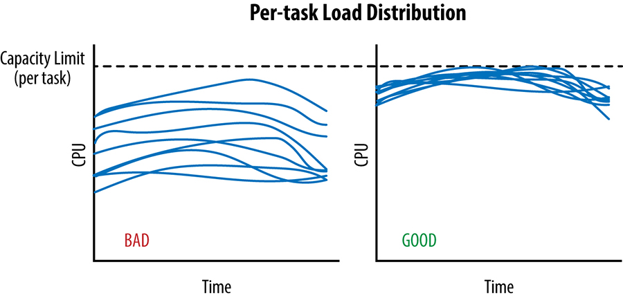
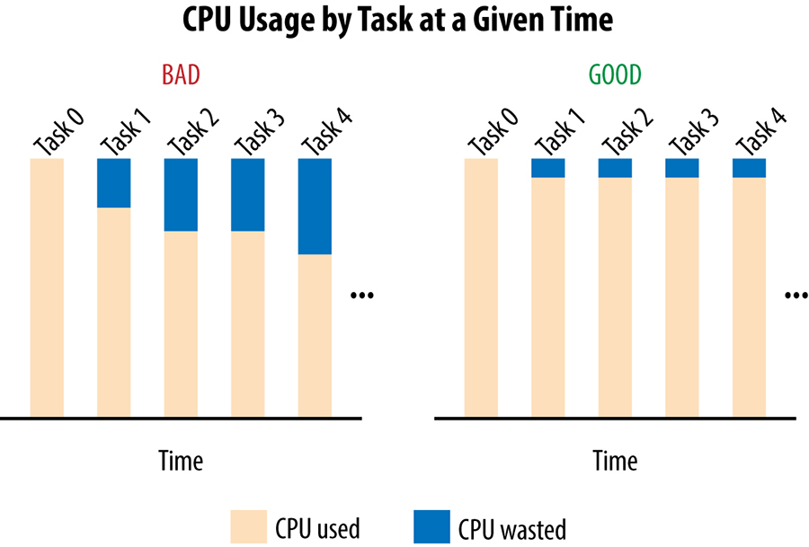
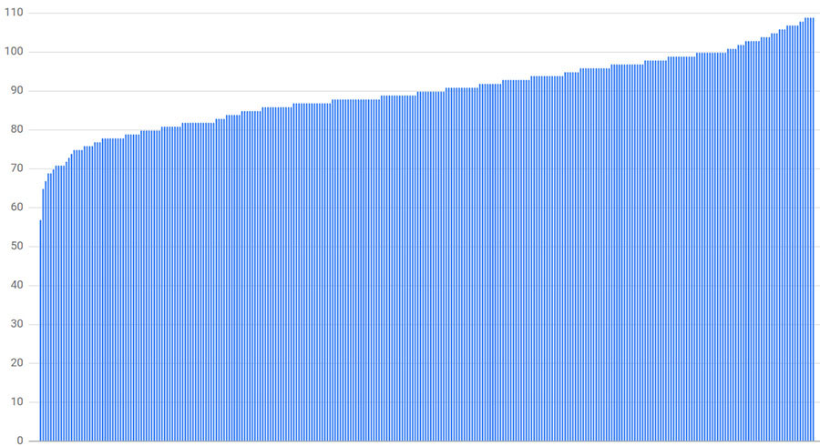
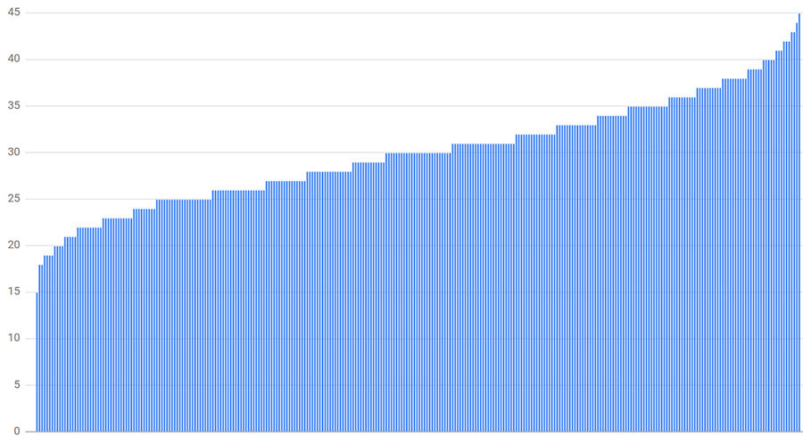
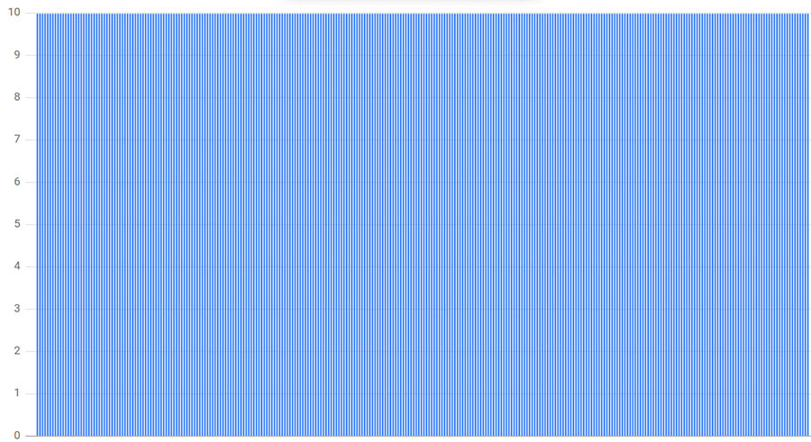
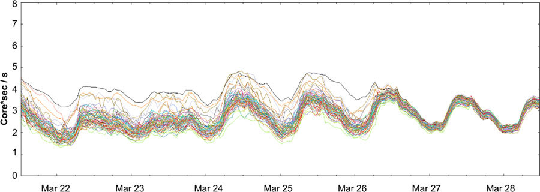

# Load Balancing in the Datacenter

Written by Alejandro Forero Cuervo  
Edited by Sarah Chavis

This chapter focuses on load balancing within the datacenter. Specifically, it discusses algorithms for distributing work within a given datacenter for a stream of queries. We cover application-level policies for routing requests to individual servers that can process them. Lower-level networking principles (e.g., switches, packet routing) and datacenter selection are outside of the scope of this chapter.

Assume there is a stream of queries arriving to the datacenter—these could be coming from the datacenter itself, remote datacenters, or a mix of both—at a rate that doesn’t exceed the resources that the datacenter has to process them (or only exceeds it for very short amounts of time). Also assume that there are *services* within the datacenter, against which these queries operate. These services are implemented as many homogeneous, interchangeable server processes mostly running on different machines. The smallest services typically have at least three such processes (using fewer processes means losing 50% or more of your capacity if you lose a single machine) and the largest may have more than 10,000 processes (depending on datacenter size). In the typical case, services are composed of between 100 and 1,000 processes. We call these processes *backend tasks* (or just *backends*). Other tasks, known as *client tasks*, hold connections to the backend tasks. For each incoming query, a client task must decide which backend task should handle the query. Clients communicate with backends using a protocol implemented on top of a combination of TCP and UDP.

We should note that Google datacenters house a vastly diverse set of services that implement different combinations of the policies discussed in this chapter. Our working example, as just described, doesn’t fit any one service directly. It’s a generalized scenario that allows us to discuss the various techniques we’ve found useful for various services. Some of these techniques may be more (or less) applicable to specific use cases, but these techniques were designed and implemented by several Google engineers over a span of many years.

These techniques are applied at many parts of our stack. For example, most external HTTP requests reach the GFE (Google Frontend), our HTTP reverse proxying system. The GFE uses these algorithms, along with the algorithms described in [Load Balancing at the Frontend](/sre-book/load-balancing-frontend/), to route the request payloads and metadata to the individual processes running the applications that can process this information. This is based on a configuration that maps various URL patterns to individual applications under the control of different teams. In order to produce the response payloads (which they return to the GFE, to be returned back to browsers), these applications often use these same algorithms in turn, to communicate with the infrastructure or complementary services they depend on. Sometimes the stack of dependencies can get relatively deep, where a single incoming HTTP request can trigger a long transitive chain of dependent requests to several systems, potentially with high fan-out at various points.

## The Ideal Case

In an ideal case, the load for a given service is spread perfectly over all its backend tasks and, at any given point in time, the least and most loaded backend tasks consume exactly the same amount of CPU.

We can only send traffic to a datacenter until the point at which the most loaded task reaches its capacity limit; this is depicted in [Figure 20-1](#fig_load-balance-datacenter_per-task-distribution) for two scenarios over the same time interval. During that time, the [cross-datacenter load balancing algorithm](https://sre.google/workbook/managing-load/) must avoid sending any additional traffic to the datacenter, because doing so risks overloading some tasks.



*Figure 20-1. Two scenarios of per-task load distribution over time*

As shown in the lefthand graph in [Figure 20-2](#fig_load-balance-datacenter_cpu-usage-by-task), a significant amount of capacity is wasted: the idle capacity of every task except the most loaded task.



*Figure 20-2. Histogram of CPU used and wasted in two scenarios*

More formally, let *CPU[i]* be the CPU rate consumed by task *i* at a given point of time, and suppose that task 0 is the most loaded task. Then, in the case of a large spread, we are wasting the sum of the differences in the CPU from any task to *CPU[0]*: that is, the sum over all tasks *i* of *(CPU[0] – CPU[i])* will be wasted. In this case "wasted" means reserved, but unused.

This example illustrates how poor in-datacenter load balancing practices artificially limit resource availability: you may be reserving 1,000 CPUs for your service in a given datacenter, but be unable to actually use more than, say, 700 CPUs.

## Identifying Bad Tasks: Flow Control and Lame Ducks

Before we can decide which backend task should receive a client request, we need to identify—and avoid—unhealthy tasks in our pool of backends.

### A Simple Approach to Unhealthy Tasks: Flow Control

Assume our client tasks track the number of active requests they have sent on each connection to a backend task. When this active-request count reaches a configured limit, the client treats the backend as unhealthy and no longer sends it requests. For most backends, 100 is a reasonable limit; in the average case, requests tend to finish fast enough that it is very rare for the number of active requests from a given client to reach this limit under normal operating conditions. This (very basic!) form of flow control also serves as a simplistic form of load balancing: if a given backend task becomes overloaded and requests start piling up, clients will avoid that backend, and the workload spreads organically among the other backend tasks.

Unfortunately, this very simplistic approach only protects backend tasks against very extreme forms of overload and it’s very easy for backends to become overloaded well before this limit is ever reached. The converse is also true: in some cases, clients may reach this limit when their backends still have plenty of spare resources. For example, some backends may have very long-lived requests that prohibit quick responses. We’ve seen cases in which this default limit has backfired, causing all backend tasks to become unreachable, with requests blocked in the clients until they time out and fail. Raising the active-request limit can avoid this situation, but doesn’t solve the underlying problem of knowing if a task is truly unhealthy or simply slow to respond.

### A Robust Approach to Unhealthy Tasks: Lame Duck State

From a client perspective, a given backend task can be in any of the following states:

Healthy  
The backend task has initialized correctly and is processing requests.

Refusing connections  
The backend task is unresponsive. This can happen because the task is starting up or shutting down, or because the backend is in an abnormal state (though it would be rare for a backend to stop listening on its port if it is not shutting down).

Lame duck  
The backend task is listening on its port and can serve, but is explicitly asking clients to stop sending requests.

When a task enters lame duck state, it broadcasts that fact to all its active clients. But what about inactive clients? With Google’s RPC implementation, inactive clients (i.e., clients with no active TCP connections) still send periodic UDP health checks. The result is that lame duck information is propagated quickly to all clients—typically in 1 or 2 RTT—regardless of their current state.

The main advantage of allowing a task to exist in a quasi-operational lame duck state is that it simplifies clean shutdown, which avoids serving errors to all the unlucky requests that happened to be active on backend tasks that are shutting down. Bringing down a backend task that has active requests without serving any errors facilitates code pushes, maintenance activities, or machine failures that may require restarting all related tasks. Such a shutdown would follow these general steps:

1.  The job scheduler sends a SIGTERM signal to the backend task.
2.  The backend task enters lame duck state and asks its clients to send new requests to other backend tasks. This is done through an API call in the RPC implementation that is explicitly called in the SIGTERM handler.
3.  Any ongoing request started before the backend task entered lame duck state (or after it entered lame duck state but before a client detected it) executes normally.
4.  As responses flow back to the clients, the number of active requests against the backend gradually decreases to zero.
5.  After a configured interval, the backend task either exits cleanly or the job scheduler kills it. The interval should be set to a large enough value that all typical requests have sufficient time to finish. This value is service dependent, but a good rule of thumb is between 10s and 150s depending on client complexity.

This strategy also allows a client to establish connections to backend tasks while performing potentially long-lived initialization procedures (and thus are not yet ready to start serving). The backend tasks could otherwise start listening for connections only when they’re ready to serve, but doing so would delay the negotiation of the connections unnecessarily. As soon as the backend task is ready to start serving, it signals this explicitly to the clients.

## Limiting the Connections Pool with Subsetting

In addition to health management, another consideration for load balancing is *subsetting*: limiting the pool of potential backend tasks with which a client task interacts.

Each client in our RPC system maintains a pool of long-lived connections to its backends that it uses to send new requests. These connections are typically established early on as the client is starting and usually remain open, with requests flowing through them, until the client’s death. An alternative model would be to establish and tear down a connection for each request, but this model has significant resource and latency costs. In the corner case of a connection that remains idle for a long time, our RPC implementation has an optimization that switches the connection to a cheap "inactive" mode where, for example, the frequency of health checks is reduced and the underlying TCP connection is dropped in favor of UDP.

Every connection requires some memory and CPU (due to periodic health checking) at both ends. While this overhead is small in theory, it can quickly become significant when it occurs across many machines. Subsetting avoids the situation in which a single client connects to a very large number of backend tasks or a single backend task receives connections from a very large number of client tasks. In both cases, you potentially waste a very large amount of resources for very little gain.

### Picking the Right Subset

Picking the right subset comes down to choosing how many backend tasks each client connects to—the subset size—and the selection algorithm. We typically use a subset size of 20 to 100 backend tasks, but the "right" subset size for a system depends heavily on the typical behavior of your service. For example, you may want to use a larger subset size if:

- The number of clients is significantly smaller than the number of backends. In this case, you want the number of backends per client to be large enough that you don’t end up with backend tasks that will never receive any traffic.
- There are frequent load imbalances within the client jobs (i.e., one client task sends more requests than others). This scenario is typical in situations where clients occasionally send bursts of requests. In this case, the clients themselves receive requests from other clients that occasionally have a large fan-out (e.g., "read all the information of all the followers of a given user"). Because a burst of requests will be concentrated in the client’s assigned subset, you need a larger subset size to ensure the load is spread evenly across the larger set of available backend tasks.

Once the subset size is determined, we need an algorithm to define the subset of backend tasks each client task will use. This may seem like a simple task, but it becomes complex quickly when working with large-scale systems where efficient provisioning is crucial and system restarts are guaranteed.

The selection algorithm for clients should assign backends uniformly to optimize resource provisioning. For example, if [subsetting overloads](https://sre.google/sre-book/load-balancing-datacenter/) one backend by 10%, the whole set of backends needs to be overprovisioned by 10%. The algorithm should also handle restarts and failures gracefully and robustly by continuing to load backends as uniformly as possible while minimizing churn. In this case, "churn" relates to backend replacement selection. For example, when a backend task becomes unavailable, its clients may need to temporarily pick a replacement backend. When a replacement backend is selected, clients must create new TCP connections (and likely perform application-level negotiation), which creates additional overhead. Similarly, when a client task restarts, it needs to reopen the connections to all its backends.

The algorithm should also handle resizes in the number of clients and/or number of backends, with minimal connection churn and without knowing these numbers in advance. This functionality is particularly important (and tricky) when the entire set of client or backend tasks are restarted one at a time (e.g., to push a new version). As backends are pushed, we want clients to continue serving, transparently, with as little connection churn as possible.

### A Subset Selection Algorithm: Random Subsetting

A naive implementation of a subset selection algorithm might have each client randomly shuffle the list of backends once and fill its subset by selecting resolvable/healthy backends from the list. Shuffling once and then picking backends from the start of the list handles restarts and failures robustly (e.g., with relatively little churn) because it explicitly limits them from consideration. However, we’ve found that this strategy actually works very poorly in most practical scenarios because it spreads load very unevenly.

During initial work on load balancing, we implemented random subsetting and calculated the expected load for various cases. As an example, consider:

- 300 clients
- 300 backends
- A subset size of 30% (each client connects to 90 backends)

As [Figure 20-3](#fig_load-balance-datacenter_random-subsetting-30pct) shows, the least loaded backend has just 63% of the average load (57 connections, where the average is 90 connections) and the most loaded has 121% (109 connections). In most cases, a subset size of 30% is already larger than we would want to use in practice. The calculated load distribution changes every time we run the simulation while the general pattern remains.



*Figure 20-3. Connection distribution with 300 clients, 300 backends, and a subset size of 30%*

Unfortunately, smaller subset sizes lead to even worse imbalances. For example, [Figure 20-4](#fig_load-balance-datacenter_random-subsetting-10pct) depicts the results if the subset size is reduced to 10% (30 backends per client). In this case, the least loaded backend receives 50% of the average load (15 connections) and the most loaded receives 150% (45 connections).



*Figure 20-4. Connection distribution with 300 clients, 300 backends, and a subset size of 10%*

We concluded that for random subsetting to spread the load relatively evenly across all available tasks, we would need subset sizes as large as 75%. A subset that large is simply impractical; the variance in the number of clients connecting to a task is just too large to consider random subsetting a good subset selection policy at scale.

### A Subset Selection Algorithm: Deterministic Subsetting

Google’s solution to the limitations of random subsetting is *deterministic* subsetting. The following code implements this algorithm, described in detail next:

```
def Subset(backends, client_id, subset_size):
  subset_count = len(backends) / subset_size

  # Group clients into rounds; each round uses the same shuffled list:
  round = client_id / subset_count
  random.seed(round)
  random.shuffle(backends)

  # The subset id corresponding to the current client:
  subset_id = client_id % subset_count

  start = subset_id * subset_size
  return backends[start:start + subset_size]
```

We divide *client* tasks into "rounds," where `round i` consists of `subset_count` consecutive client tasks, starting at task `subset_count × i`, and `subset_count` is the number of subsets (i.e., the number of backend tasks divided by the desired subset size). Within each round, each backend is assigned to exactly one client (except possibly the last round, which may not contain enough clients, so some backends may not be assigned).

For example, if we have 12 backend tasks [0, 11] and a desired subset size of 3, we will have rounds containing 4 clients each (`subset_count = 12/3`). If we had 10 clients, the preceding algorithm could yield the following *shuffled_backends*:

- Round 0: [0, 6, 3, 5, 1, 7, 11, 9, 2, 4, 8, 10]
- Round 1: [8, 11, 4, 0, 5, 6, 10, 3, 2, 7, 9, 1]
- Round 2: [8, 3, 7, 2, 1, 4, 9, 10, 6, 5, 0, 11]

The key point to notice is that each round only assigns each backend in the entire list to one client (except the last, where we run out of clients). In this example, every backend gets assigned to exactly two or three clients.

The list should be shuffled; otherwise, clients are assigned a group of consecutive backend tasks that may all become temporarily unavailable (for example, because the backend job is being updated gradually in order, from the first task to the last). Different rounds use a different seed for shuffling. If they don’t, when a backend fails, the load it was receiving is only spread among the remaining backends *in its subset*. If additional backends in the subset fail, the effect compounds and the situation can quickly worsen significantly: if `N` backends in a subset are down, their corresponding load is spread over the remaining (`subset_size - N`) backends. A much better approach is to spread this load over all remaining backends by using a different shuffle for each round.

When we use a different shuffle for each round, clients in the same round will start with the same shuffled list, but clients across rounds will have different shuffled lists. From here, the algorithm builds subset *definitions* based upon the shuffled list of backends and the desired subset size. For example:

- `Subset[0]` = `shuffled_backends[0]` through `shuffled_backends[2]`
- `Subset[1]` = `shuffled_backends[3]` through `shuffled_backends[5]`
- `Subset[2]` = `shuffled_backends[6]` through `shuffled_backends[8]`
- `Subset[3]` = `shuffled_backends[9]` through `shuffled_backends[11]`

where `shuffled_backend` is the shuffled list created by each client. To assign a subset to a client task, we just take the subset that corresponds to its position within its round (e.g., `(i % 4)` for `client[i]` with four subsets):

- `client[0]`, `client[4]`, `client[8]` will use `subset[0]`
- `client[1]`, `client[5]`, `client[9]` will use `subset[1]`
- `client[2]`, `client[6]`, `client[10]` will use `subset[2]`
- `client[3]`, `client[7]`, `client[11]` will use `subset[3]`

Because clients across rounds will use a different value for `shuffled_backends` (and thus for `subset`) and clients within rounds use different subsets, the connection load is spread uniformly. In cases where the total number of backends is not divisible by the desired subset size, we allow a few subsets to be slightly larger than others, but in most cases the number of clients assigned to a backend will differ by at most 1.

As [Figure 20-5](#fig_load-balance-datacenter_deterministic-subsetting) shows, the distribution for the former example of 300 clients each connecting to 10 of 300 backends yields very good results: each backend receives exactly the same number of connections.



*Figure 20-5. Connection distribution with 300 clients and deterministic subsetting to 10 of 300 backends*

## Load Balancing Policies

Now that we’ve established the groundwork for how a given client task maintains a set of connections that are known to be healthy, let’s examine *load balancing policies*. These are the mechanisms used by client tasks to select which backend task in its subset receives a client request. Many of the complexities in load balancing policies stem from the distributed nature of the decision-making process in which clients need to decide, in real time (and with only partial and/or stale backend state information), which backend should be used for each request.

Load balancing policies can be very simple and not take into account any information about the state of the backends (e.g., *Round Robin*) or can act with more information about the backends (e.g., *Least-Loaded Round Robin* or *Weighted Round Robin*).

### Simple Round Robin

One very simple approach to [load balancing](https://sre.google/sre-book/handling-overload/) has each client send requests in round-robin fashion to each backend task in its subset to which it can successfully connect and which isn’t in lame duck state. For many years, this was our most common approach, and it’s still used by many services.

Unfortunately, while Round Robin has the advantage of being very simple and performing significantly better than just selecting backend tasks randomly, the results of this policy can be very poor. While actual numbers depend on many factors, such as varying query cost and machine diversity, we’ve found that Round Robin can result in a spread of up to 2x in CPU consumption from the least to the most loaded task. Such a spread is extremely wasteful and occurs for a number of reasons, including:

- Small subsetting
- Varying query costs
- Machine diversity
- Unpredictable performance factors

## Small subsetting

One of the simplest reasons Round Robin distributes load poorly is that all of its clients may not issue requests at the same rate. Different rates of requests among clients are especially likely when vastly different processes share the same backends. In this case, and especially if you’re using relatively small subset sizes, backends in the subsets of the clients generating the most traffic will naturally tend to be more loaded.

## Varying query costs

Many services handle requests that require vastly different amounts of resources for processing. In practice, we’ve found that the semantics of many services in Google are such that the most expensive requests consume 1000x (or more) CPU than the cheapest requests. Load balancing using Round Robin is even more difficult when query cost can’t be predicted in advance. For example, a query such as "return all emails received by user XYZ in the last day" could be very cheap (if the user has received little email over the course of the day) or extremely expensive.

Load balancing in a system with large discrepancies in potential query cost is very problematic. It can become necessary to adjust the service interfaces to functionally cap the amount of work done per request. For example, in the case of the email query described previously, you could introduce a pagination interface and change the semantics of the request to "return the most recent 100 emails (or fewer) received by user XYZ in the last day." Unfortunately, it’s often difficult to introduce such semantic changes. Not only does this require changes in all the client code, but it also entails additional consistency considerations. For example, the user may be receiving new emails or deleting emails as the client fetches emails page-by-page. For this use case, a client that naively iterates through the results and concatenates the responses (rather than paginating based on a fixed view of the data) will likely produce an inconsistent view, repeating some messages and/or skipping others.

To keep interfaces (and their implementations) simple, services are often defined to allow the most expensive requests to consume 100, 1,000, or even 10,000 times more resources than the cheapest requests. However, varying resource requirements per-request naturally mean that some backend tasks will be unlucky and occasionally receive more expensive requests than others. The extent to which this situation affects load balancing depends on how expensive the most expensive requests are. For example, for one of our Java backends, queries consume around 15 ms of CPU on average but some queries can easily require up to 10 seconds. Each task in this backend reserves multiple CPU cores, which reduces latency by allowing some of the computations to happen in parallel. But despite these reserved cores, when a backend receives one of these large queries, its load increases significantly for a few seconds. A poorly behaved task may run out of memory or even stop responding entirely (e.g., due to memory thrashing), but even in the normal case (i.e., the backend has sufficient resources and its load normalizes once the large query completes), the latency of other requests suffers due to resource competition with the expensive request.

## Machine diversity

Another challenge to Simple Round Robin is the fact that not all machines in the same datacenter are necessarily the same. A given datacenter may have machines with CPUs of varying performance, and therefore, the same request may represent a significantly different amount of work for different machines.

Dealing with machine diversity—*without* requiring strict homogeneity—was a challenge for many years at Google. In theory, the solution to working with heterogeneous resource capacity in a fleet is simple: scale the CPU reservations depending on the processor/machine type. However, in practice, rolling out this solution required significant effort because it required our job scheduler to account for resource equivalencies based on average machine performance across a sampling of services. For example, 2 CPU units in machine X (a "slow" machine) is equivalent to 0.8 CPU units in machine Y (a "fast" machine). With this information, the job scheduler is then required to adjust CPU reservations for a process based upon the equivalence factor and the type of machine on which the process was scheduled. In an attempt to mitigate this complexity, we created a virtual unit for CPU rate called "GCU" (Google Compute Units). GCUs became the standard for modeling CPU rates, and were used to maintain a mapping from each CPU architecture in our datacenters to its corresponding GCU based upon its performance.

## Unpredictable performance factors

Perhaps the largest complicating factor for Simple Round Robin is that machines—or, more accurately, the performance of backend tasks—may differ vastly due to several *unpredictable* aspects that cannot be accounted for statically.

Two of the many unpredictable factors that contribute to performance include:

Antagonistic neighbors  
Other processes (often completely unrelated and run by different teams) can have a significant impact on the performance of your processes. We’ve seen differences in performance of this nature of up to 20%. This difference mostly stems from competition for shared resources, such as space in memory caches or bandwidth, in ways that may not be directly obvious. For example, if the latency of outgoing requests from a backend task grows (because of competition for network resources with an antagonistic neighbor), the number of active requests will also grow, which may trigger increased garbage collection.

Task restarts  
When a task gets restarted, it often requires significantly more resources for a few minutes. As just one example, we’ve seen this condition affect platforms such as Java that optimize code dynamically more than others. In response, we’ve actually added to the logic of some server code—we keep servers in lame duck state and prewarm them (triggering these optimizations) for a period of time after they start, until their performance is nominal. The effect of task restarts can become a sizable problem when you consider we update many servers (e.g., push new builds, which requires restarting these tasks) every day.

If your load balancing policy can’t adapt to unforeseen performance limitations, you will inherently end up with a suboptimal load distribution when working at scale.

### Least-Loaded Round Robin

An alternative approach to Simple Round Robin is to have each client task keep track of the number of active requests it has to each backend task in its subset and use Round Robin *among the set of tasks with a minimal number of active requests*.

For example, suppose a client uses a subset of backend tasks *t0* to *t9*, and currently has the following number of active requests against each backend:

| **t0** | **t1** | **t2** | **t3** | **t4** | **t5** | **t6** | **t7** | **t8** | **t9** |
|--------|--------|--------|--------|--------|--------|--------|--------|--------|--------|
| `2`    | `1`    | `0`    | `0`    | `1`    | `0`    | `2`    | `0`    | `0`    | `1`    |

For a new request, the client would filter the list of potential backend tasks to just those tasks with the least number of connections (*t2*, *t3*, *t5*, *t7*, and *t8*) and choose a backend from that list. Let’s assume it picks *t2*. The client’s connection state table would now look like the following:

| **t0** | **t1** | **t2** | **t3** | **t4** | **t5** | **t6** | **t7** | **t8** | **t9** |
|--------|--------|--------|--------|--------|--------|--------|--------|--------|--------|
| `2`    | `1`    | `1`    | `0`    | `1`    | `0`    | `2`    | `0`    | `0`    | `1`    |

Assuming none of the current requests have completed, on the next request, the backend candidate pool becomes *t3*, *t5*, *t7*, and *t8*.

Let’s fast-forward until we’ve issued four new requests. Still assuming that no request finishes in the meantime, the connection state table would look like the following:

| **t0** | **t1** | **t2** | **t3** | **t4** | **t5** | **t6** | **t7** | **t8** | **t9** |
|--------|--------|--------|--------|--------|--------|--------|--------|--------|--------|
| `2`    | `1`    | `1`    | `1`    | `1`    | `1`    | `2`    | `1`    | `1`    | `1`    |

At this point the set of backend candidates is all tasks except *t0* and *t6*. However, if the request against task *t4* finishes, its current state becomes "0 active requests" and a new request will be assigned to *t4*.

This implementation actually uses Round Robin, but it’s applied across the set of tasks with minimal active requests. Without such filtering, the policy might not be able to spread the requests well enough to avoid a situation in which some portion of the available backend tasks goes unused. The idea behind the least-loaded policy is that loaded tasks will tend to have higher latency than those with spare capacity, and this strategy will naturally take load away from these loaded tasks.

All that said, we’ve learned (the hard way!) about one very dangerous pitfall of the Least-Loaded Round Robin approach: if a task is seriously unhealthy, it might start serving 100% errors. Depending on the nature of those errors, they may have very low latency; it’s frequently significantly faster to just return an "I’m unhealthy!" error than to actually process a request. As a result, clients might start sending a very large amount of traffic to the unhealthy task, erroneously thinking that the task is available, as opposed to fast-failing them! We say that the unhealthy task is now *sinkholing* traffic. Fortunately, this pitfall can be solved relatively easily by modifying the policy to count recent errors as if they were active requests. This way, if a backend task becomes unhealthy, the load balancing policy begins to divert load from it the same way it would divert load from an overburdened task.

Least-Loaded Round Robin has two important limitations:

The count of active requests may not be a very good proxy for the capability of a given backend  
Many requests spend a significant portion of their life just waiting for a response from the network (i.e., waiting for responses to requests they initiate to other backends) and very little time on actual processing. For example, one backend task may be able to process twice as many requests as another (e.g., because it’s running in a machine with a CPU that’s twice as fast as the rest), but the latency of its requests may still be roughly the same as the latency of requests in the other task (because requests spend most of their life just waiting for the network to respond). In this case, because blocking on I/O often consumes zero CPU, very little RAM, and no bandwidth, we’d still want to send twice as many requests to the faster backend. However, Least-Loaded Round Robin will consider both backend tasks equally loaded.

The count of active requests in each client doesn’t include requests from other clients to the same backends  
That is, each client task has only a very limited view into the state of its backend tasks: the view of its own requests.

In practice, we’ve found that large services using Least-Loaded Round Robin will see their most loaded backend task using twice as much CPU as the least loaded, performing about as poorly as Round Robin.

### Weighted Round Robin

Weighted Round Robin is an important load balancing policy that improves on Simple and Least-Loaded Round Robin by incorporating backend-provided information into the decision process.

Weighted Round Robin is fairly simple in principle: each client task keeps a "capability" score for each backend in its subset. Requests are distributed in Round-Robin fashion, but clients weigh the distributions of requests to backends proportionally. In each response (including responses to health checks), backends include the current observed rates of queries and errors per second, in addition to the utilization (typically, CPU usage). Clients adjust the capability scores periodically to pick backend tasks based upon their current number of successful requests handled and at what utilization cost; failed requests result in a penalty that affects future decisions.

In practice, Weighted Round Robin has worked very well and significantly reduced the difference between the most and the least utilized tasks. [Figure 20-6](#fig_load-balance-datacenter_enabling-weighted-rr) shows the CPU rates for a random subset of backend tasks around the time its clients switched from Least-Loaded to Weighted Round Robin. The spread from the least to the most loaded tasks decreased drastically.



*Figure 20-6. CPU distribution before and after enabling Weighted Round Robin*
