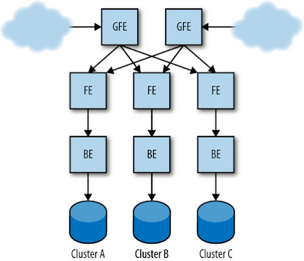
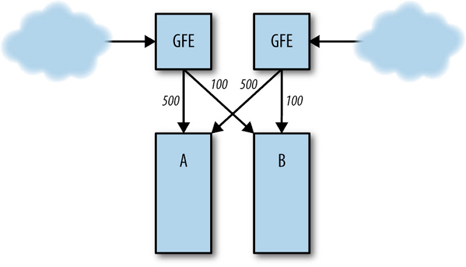
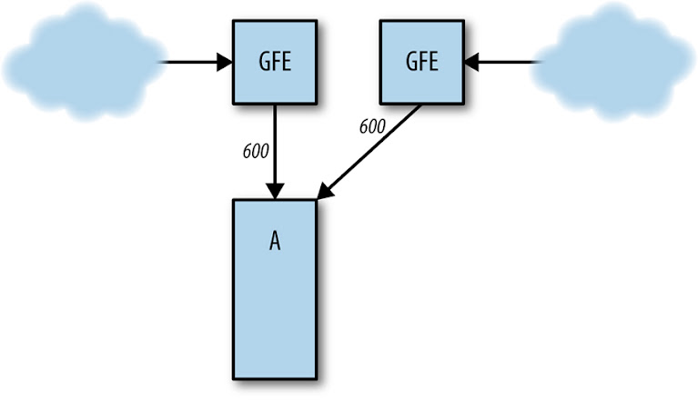

# Addressing Cascading Failures

Written by Mike Ulrich

> If at first you don't succeed, back off exponentially.
>
> Dan Sandler, Google Software Engineer

> Why do people always forget that you need to add a little jitter?
>
> Ade Oshineye, Google Developer Advocate

A cascading failure is a failure that grows over time as a result of positive feedback.[^107] It can occur when a portion of an overall system fails, increasing the probability that other portions of the system fail. For example, a single replica for a service can fail due to overload, increasing load on remaining replicas and increasing their probability of failing, causing a domino effect that takes down all the replicas for a service.

We’ll use the Shakespeare search service discussed in [Shakespeare: A Sample Service](/sre-book/production-environment#xref_production-environment_shakespeare) as an example throughout this chapter. Its production configuration might look something like [Figure 22-1](#fig_cascading-failure_basic-architecture).

*Figure 22-1. Example production configuration for the Shakespeare search service*

## Causes of Cascading Failures and Designing to Avoid Them

Well-thought-out system design should take into account a few typical scenarios that account for the majority of cascading failures.

## Server Overload

The most common cause of cascading failures is overload. Most cascading failures described here are either directly due to server overload, or due to extensions or variations of this scenario.

Suppose the frontend in cluster A is handling 1,000 requests per second (QPS), as in [Figure 22-2](#fig_cascading-failure_load-distribution).

*Figure 22-2. Normal server load distribution between clusters A and B*

If cluster B fails ([Figure 22-3](#fig_cascading-failure_failure-load-distribution)), requests to cluster A increase to 1,200 QPS. The frontends in A are not able to handle requests at 1,200 QPS, and therefore start running out of resources, which causes them to crash, miss deadlines, or otherwise misbehave. As a result, the rate of successfully handled requests in A dips well below 1,000 QPS.

*Figure 22-3. Cluster B fails, sending all traffic to cluster A*

This reduction in the rate of useful work being done can spread into other failure domains, potentially spreading globally. For example, local overload in one cluster may lead to its servers crashing; in response, the load balancing controller sends requests to other clusters, overloading their servers, leading to a service-wide overload failure. It may not take long for these events to transpire (e.g., on the order of a couple minutes), because the [load balancer](https://sre.google/sre-book/handling-overload/) and task scheduling systems involved may act very quickly.

## Resource Exhaustion

Running out of a resource can result in higher latency, elevated error rates, or the substitution of lower-quality results. These are in fact desired effects of running out of resources: something eventually needs to give as the load increases beyond what a server can handle.

Depending on what resource becomes exhausted in a server and how the server is built, resource exhaustion can render the server less efficient or cause the server to crash, prompting the load balancer to distribute the resource problems to other servers. When this happens, the rate of successfully handled requests can drop and possibly send the cluster or an entire service into a cascade failure.

Different types of resources can be exhausted, resulting in varying effects on servers.

### CPU

If there is insufficient CPU to handle the request load, typically all requests become slower. This scenario can result in various secondary effects, including the following:

Increased number of in-flight requests  
Because requests take longer to handle, more requests are handled concurrently (up to a possible maximum capacity at which queuing may occur). This affects almost all resources, including memory, number of active threads (in a thread-per-request server model), number of file descriptors, and backend resources (which in turn can have other effects).

Excessively long queue lengths  
If there is insufficient capacity to handle all the requests at steady state, the server will saturate its queues. This means that latency increases (the requests are queued for longer amounts of time) and the queue uses more memory. See [Queue Management](#xref_cascading-failure_queue-management) for a discussion of mitigation strategies.

Thread starvation  
When a thread can’t make progress because it’s waiting for a lock, health checks may fail if the health check endpoint can’t be served in time.

CPU or request starvation  
Internal watchdogs[^108] in the server detect that the server isn’t making progress, causing the servers to crash due to CPU starvation, or due to request starvation if watchdog events are triggered remotely and processed as part of the request queue.

Missed RPC deadlines  
As a server becomes overloaded, its responses to RPCs from its clients arrive later, which may exceed any deadlines those clients set. The work the server did to respond is then wasted, and clients may retry the RPCs, leading to even more overload.

Reduced CPU caching benefits  
As more CPU is used, the chance of spilling on to more cores increases, resulting in decreased usage of local caches and decreased CPU efficiency.

### Memory

If nothing else, more in-flight requests consume more RAM from allocating the request, response, and RPC objects. Memory exhaustion can cause the following effects:

Dying tasks  
For example, a task might be evicted by the container manager (VM or otherwise) for exceeding available resource limits, or application-specific crashes may cause tasks to die.

Increased rate of garbage collection (GC) in Java, resulting in increased CPU usage  
A vicious cycle can occur in this scenario: less CPU is available, resulting in slower requests, resulting in increased RAM usage, resulting in more GC, resulting in even lower availability of CPU. This is known colloquially as the “GC death spiral.”

Reduction in cache hit rates  
Reduction in available RAM can reduce application-level cache hit rates, resulting in more RPCs to the backends, which can possibly cause the backends to become overloaded.

### Threads

Thread starvation can directly cause errors or lead to health check failures. If the server adds threads as needed, thread overhead can use too much RAM. In extreme cases, thread starvation can also cause you to run out of process IDs.

### File descriptors

Running out of file descriptors can lead to the inability to initialize network connections, which in turn can cause health checks to fail.

### Dependencies among resources

Note that many of these resource exhaustion scenarios feed from one another—a [service experiencing overload](../../workbook/overload/) often has a host of secondary symptoms that can look like the root cause, making debugging difficult.

For example, imagine the following scenario:

1.  A Java frontend has poorly tuned garbage collection (GC) parameters.
2.  Under high (but expected) load, the frontend runs out of CPU due to GC.
3.  CPU exhaustion slows down completion of requests.
4.  The increased number of in-progress requests causes more RAM to be used to process the requests.
5.  Memory pressure due to requests, in combination with a fixed memory allocation for the frontend process as a whole, leaves less RAM available for caching.
6.  The reduced cache size means fewer entries in the cache, in addition to a lower hit rate.
7.  The increase in cache misses means that more requests fall through to the backend for servicing.
8.  The backend, in turn, runs out of CPU or threads.
9.  Finally, the lack of CPU causes basic health checks to fail, starting a cascading failure.

In situations as complex as the preceding scenario, it’s unlikely that the causal chain will be fully diagnosed during an outage. It might be very hard to determine that the backend crash was caused by a decrease in the cache rate in the frontend, particularly if the frontend and backend components have different owners.

## Service Unavailability

Resource exhaustion can lead to servers crashing; for example, servers might crash when too much RAM is allocated to a container. Once a couple of servers crash on overload, the load on the remaining servers can increase, causing them to crash as well. The problem tends to snowball and soon all servers begin to crash-loop. It’s often difficult to escape this scenario because as soon as servers come back online they’re bombarded with an extremely high rate of requests and fail almost immediately.

For example, if a service was healthy at 10,000 QPS, but started a cascading failure due to crashes at 11,000 QPS, dropping the load to 9,000 QPS will almost certainly not stop the crashes. This is because the service will be handling increased demand with reduced capacity; only a small fraction of servers will usually be healthy enough to handle requests. The fraction of servers that will be healthy depends on a few factors: how quickly the system is able to start the tasks, how quickly the binary can start serving at full capacity, and how long a freshly started task is able to survive the load. In this example, if 10% of the servers are healthy enough to handle requests, the request rate would need to drop to about 1,000 QPS in order for the system to stabilize and recover.

Similarly, servers can appear unhealthy to the load balancing layer, resulting in reduced load balancing capacity: servers may go into “lame duck” state (see [A Robust Approach to Unhealthy Tasks: Lame Duck State](/sre-book/load-balancing-datacenter#robust_approach_lame_duck)) or fail health checks without crashing. The effect can be very similar to crashing: more servers appear unhealthy, the healthy servers tend to accept requests for a very brief period of time before becoming unhealthy, and fewer servers participate in handling requests.

Load balancing policies that avoid servers that have served errors can exacerbate problems further—a few backends serve some errors, so they don’t contribute to the available capacity for the service. This increases the load on the remaining servers, starting the snowball effect.

# Preventing Server Overload

The following list presents strategies for [avoiding server overload](../../sre-book/handling-overload/) in rough priority order:

Load test the server’s capacity limits, and test the failure mode for overload  
This is the most important exercise you should conduct in order to prevent server overload. Unless you test in a realistic environment, it’s very hard to predict exactly which resource will be exhausted and how that resource exhaustion will manifest. For details, see [Testing for Cascading Failures](#xref_cascading-failure_testing).

Serve degraded results  
Serve lower-quality, cheaper-to-compute results to the user. Your strategy here will be service-specific. See [Load Shedding and Graceful Degradation](#xref_cascading-failure_load-shed-graceful-degredation).

Instrument the server to reject requests when overloaded  
Servers should protect themselves from becoming overloaded and crashing. When overloaded at either the frontend or backend layers, fail early and cheaply. For details, see [Load Shedding and Graceful Degradation](#xref_cascading-failure_load-shed-graceful-degredation).

Instrument higher-level systems to reject requests, rather than overloading servers  
Note that because rate limiting often doesn’t take overall service health into account, it may not be able to stop a failure that has already begun. Simple rate-limiting implementations are also likely to leave capacity unused. Rate limiting can be implemented in a number of places:

- *At the reverse proxies*, by limiting the volume of requests by criteria such as IP address to mitigate attempted denial-of-service attacks and abusive clients.
- *At the load balancers*, by dropping requests when the service enters global overload. Depending on the nature and complexity of the service, this rate limiting can be indiscriminate (“drop all traffic above X requests per second”) or more selective (“drop requests that aren’t from users who have recently interacted with the service” or “drop requests for low-priority operations like background synchronization, but keep serving interactive user sessions”).
- *At individual tasks*, to prevent random fluctuations in load balancing from overwhelming the server.

Perform capacity planning  
Good capacity planning can reduce the probability that a cascading failure will occur. Capacity planning should be coupled with performance testing to determine the load at which the service will fail. For instance, if every cluster’s breaking point is 5,000 QPS, the load is evenly spread across clusters,[^109] and the service’s peak load is 19,000 QPS, then approximately six clusters are needed to run the service at *N* + 2.

Capacity planning reduces the probability of triggering a cascading failure, but it is not sufficient to protect the service from cascading failures. When you lose major parts of your infrastructure during a planned or unplanned event, no amount of capacity planning may be sufficient to prevent cascading failures. Load balancing problems, network partitions, or unexpected traffic increases can create pockets of high load beyond what was planned. Some systems can grow the number of tasks for your service on demand, which may prevent overload; however, proper capacity planning is still needed.

## Queue Management

Most thread-per-request servers use a queue in front of a thread pool to handle requests. Requests come in, they sit on a queue, and then threads pick requests off the queue and perform the actual work (whatever actions are required by the server). Usually, if the queue is full, the server will reject new requests.

If the request rate and latency of a given task is constant, there is no reason to queue requests: a constant number of threads should be occupied. Under this idealized scenario, requests will only be queued if the steady state rate of incoming requests exceeds the rate at which the server can process requests, which results in saturation of both the thread pool and the queue.

Queued requests consume memory and increase latency. For example, if the queue size is 10x the number of threads, the time to handle the request on a thread is 100 milliseconds. If the queue is full, then a request will take 1.1 seconds to handle, most of which time is spent on the queue.

For a system with fairly steady traffic over time, it is usually better to have small queue lengths relative to the thread pool size (e.g., 50% or less), which results in the server rejecting requests early when it can’t sustain the rate of incoming requests. For example, Gmail often uses queueless servers, relying instead on failover to other server tasks when the threads are full. On the other end of the spectrum, systems with “bursty” load for which traffic patterns fluctuate drastically may do better with a queue size based on the current number of threads in use, processing time for each request, and the size and frequency of bursts.

## Load Shedding and Graceful Degradation

*Load shedding* drops some proportion of load by dropping traffic as the server approaches overload conditions. The goal is to keep the server from running out of RAM, failing health checks, serving with extremely high latency, or any of the other symptoms associated with overload, while still doing as much useful work as it can.

One straightforward way to shed load is to do per-task throttling based on CPU, memory, or queue length; limiting queue length as discussed in [Queue Management](#xref_cascading-failure_queue-management) is a form of this strategy. For example, one effective approach is to return an HTTP 503 (service unavailable) to any incoming request when there are more than a given number of client requests in flight.

Changing the queuing method from the standard *first-in, first-out* (FIFO) to *last-in, first-out* (LIFO) or using the *controlled delay* (CoDel) algorithm [[Nic12]](/sre-book/bibliography#Nic12) or similar approaches can reduce load by removing requests that are unlikely to be worth processing [[Mau15]](/sre-book/bibliography#Mau15). If a user’s web search is slow because an RPC has been queued for 10 seconds, there’s a good chance the user has given up and refreshed their browser, issuing another request: there’s no point in responding to the first one, since it will be ignored! This strategy works well when combined with propagating RPC deadlines throughout the stack, described in [Latency and Deadlines](#xref_cascading-failure_latency-and-deadlines).

More sophisticated approaches include identifying clients to be more selective about what work is dropped, or picking requests that are more important and prioritizing. Such strategies are more likely to be needed for shared services.

*Graceful degradation* takes the concept of load shedding one step further by reducing the amount of work that needs to be performed. In some applications, it’s possible to significantly decrease the amount of work or time needed by decreasing the quality of responses. For instance, a search application might only search a subset of data stored in an in-memory cache rather than the full on-disk database or use a less-accurate (but faster) ranking algorithm when overloaded.

When evaluating load shedding or graceful degradation options for your service, consider the following:

- Which metrics should you use to determine when load shedding or graceful degradation should kick in (e.g,. CPU usage, latency, queue length, number of threads used, whether your service enters degraded mode automatically or if manual intervention is necessary)?
- What actions should be taken when the server is in degraded mode?
- At what layer should load shedding and graceful degradation be implemented? Does it make sense to implement these strategies at every layer in the stack, or is it sufficient to have a high-level choke-point?

As you evaluate options and deploy, keep the following in mind:

- Graceful degradation shouldn’t trigger very often—usually in cases of a capacity planning failure or unexpected load shift. Keep the system simple and understandable, particularly if it isn’t used often.
- Remember that the code path you never use is the code path that (often) doesn’t work. In steady-state operation, graceful degradation mode won’t be used, implying that you’ll have much less operational experience with this mode and any of its quirks, which *increases* the level of risk. You can make sure that graceful degradation stays working by regularly running a small subset of servers near overload in order to exercise this code path.
- Monitor and alert when too many servers enter these modes.
- Complex load shedding and graceful degradation can cause problems themselves—excessive complexity may cause the server to trip into a degraded mode when it is not desired, or enter feedback cycles at undesired times. Design a way to quickly turn off complex graceful degradation or tune parameters if needed. Storing this configuration in a consistent system that each server can watch for changes, such as Chubby, can increase deployment speed, but also introduces its own risks of synchronized failure.

## Retries

Suppose the code in the frontend that talks to the backend implements retries naively. It retries after encountering a failure and caps the number of backend RPCs per logical request to 10. Consider this code in the frontend, using gRPC in Go:

    func exampleRpcCall(client pb.ExampleClient, request pb.Request) *pb.Response {
        // Set RPC timeout to 5 seconds.
        opts := grpc.WithTimeout(5 * time.Second)

        // Try up to 10 times to make the RPC call.
        attempts := 10
        for attempts > 0 {
            conn, err := grpc.Dial(*serverAddr, opts...)
            if err != nil {
                // Something went wrong in setting up the connection. Try again.
                attempts--
                continue
            }
            defer conn.Close()

            // Create a client stub and make the RPC call.
            client := pb.NewBackendClient(conn)
            response, err := client.MakeRequest(context.Background, request)
            if err != nil {
                // Something went wrong in making the call. Try again.
                attempts--
                continue
            }

            return response
        }

        grpclog.Fatalf("ran out of attempts")
    }

This system can cascade in the following way:

1.  Assume our backend has a known limit of 10,000 QPS per task, after which point all further requests are rejected in an attempt at graceful degradation.
2.  The frontend calls `MakeRequest` at a constant rate of 10,100 QPS and overloads the backend by 100 QPS, which the backend rejects.
3.  Those 100 failed QPS are retried in `MakeRequest` every 1,000 ms, and probably succeed. But the retries are themselves adding to the requests sent to the backend, which now receives 10,200 QPS—200 QPS of which are failing due to overload.
4.  The volume of retries grows: 100 QPS of retries in the first second leads to 200 QPS, then to 300 QPS, and so on. Fewer and fewer requests are able to succeed on their first attempt, so less useful work is being performed as a fraction of requests to the backend.
5.  If the backend task is unable to handle the increase in load—which is consuming file descriptors, memory, and CPU time on the backend—it can melt down and crash under the sheer load of requests and retries. This crash then redistributes the requests it was receiving across the remaining backend tasks, in turn further overloading those tasks.

Some simplifying assumptions were made here to illustrate this scenario,[^110] but the point remains that retries can destabilize a system. Note that both temporary load spikes and slow increases in usage can cause this effect.

Even if the rate of calls to `MakeRequest` decreases to pre-meltdown levels (9,000 QPS, for example), depending on how much returning a failure costs the backend, the problem might not go away. Two factors are at play here:

- If the backend spends a significant amount of resources processing requests that will ultimately fail due to overload, then the retries themselves may be keeping the backend in an overloaded mode.
- The backend servers themselves may not be stable. Retries can amplify the effects seen in [Server Overload](#xref_cascading-failure_server-overload).

If either of these conditions is true, in order to dig out of this outage, you must dramatically reduce or eliminate the load on the frontends until the retries stop and the backends stabilize.

This pattern has contributed to several cascading failures, whether the frontends and backends communicate via RPC messages, the “frontend” is client JavaScript code issuing `XmlHttpRequest` calls to an endpoint and retries on failure, or the retries originate from an offline sync protocol that retries aggressively when it encounters a failure.

When issuing automatic retries, keep in mind the following considerations:

- Most of the backend protection strategies described in [Preventing Server Overload](#xref_cascading-failure_preventing-server-overload) apply. In particular, testing the system can highlight problems, and graceful degradation can reduce the effect of the retries on the backend.
- Always use randomized exponential backoff when scheduling retries. See also ["Exponential Backoff and Jitter"](https://www.awsarchitectureblog.com/2015/03/backoff.html) in the AWS Architecture Blog [[Bro15]](/sre-book/bibliography#Bro15). If retries aren’t randomly distributed over the retry window, a small perturbation (e.g., a network blip) can cause retry ripples to schedule at the same time, which can then amplify themselves [[Flo94]](/sre-book/bibliography#Flo94).
- Limit retries per request. Don’t retry a given request indefinitely.
- Consider having a server-wide retry budget. For example, only allow 60 retries per minute in a process, and if the retry budget is exceeded, don’t retry; just fail the request. This strategy can contain the retry effect and be the difference between a capacity planning failure that leads to some dropped queries and a global cascading failure.
- Think about the service holistically and decide if you really need to perform retries at a given level. In particular, avoid amplifying retries by issuing retries at multiple levels: a single request at the highest layer may produce a number of attempts as large as the *product* of the number of attempts at each layer to the lowest layer. If the database can’t service requests because it’s overloaded, and the backend, frontend, and JavaScript layers all issue 3 retries (4 attempts), then a single user action may create 64 attempts (4^3) on the database. This behavior is undesirable when the database is returning those errors because it’s overloaded.
- Use clear response codes and consider how different failure modes should be handled. For example, separate retriable and nonretriable error conditions. Don’t retry permanent errors or malformed requests in a client, because neither will ever succeed. Return a specific status when overloaded so that clients and other layers back off and do not retry.

In an emergency, it may not be obvious that an outage is due to bad retry behavior. Graphs of retry rates can be an indication of bad retry behavior, but may be confused as a symptom instead of a compounding cause. In terms of mitigation, this is a special case of the insufficient capacity problem, with the additional caveat that you must either fix the retry behavior (usually requiring a code push), reduce load significantly, or cut requests off entirely.

## Latency and Deadlines

When a frontend sends an RPC to a backend server, the frontend consumes resources waiting for a reply. RPC deadlines define how long a request can wait before the frontend gives up, limiting the time that the backend may consume the frontend’s resources.

### Picking a deadline

It’s usually wise to set a deadline. Setting either no deadline or an extremely high deadline may cause short-term problems that have long since passed to continue to consume server resources until the server restarts.

High deadlines can result in resource consumption in higher levels of the stack when lower levels of the stack are having problems. Short deadlines can cause some more expensive requests to fail consistently. Balancing these constraints to pick a good deadline can be something of an art.

### Missing deadlines

A common theme in many [cascading outages](https://sre.google/sre-book/tracking-outages/) is that servers spend resources handling requests that will exceed their deadlines on the client. As a result, resources are spent while no progress is made: you don’t get credit for late assignments with RPCs.

Suppose an RPC has a 10-second deadline, as set by the client. The server is very overloaded, and as a result, it takes 11 seconds to move from a queue to a thread pool. At this point, the client has already given up on the request. Under most circumstances, it would be unwise for the server to attempt to handle this request, because it would be doing work for which no credit will be granted—the client doesn’t care what work the server does after the deadline has passed, because it’s given up on the request already.

If handling a request is performed over multiple stages (e.g., there are a few callbacks and RPC calls), the server should check the deadline left at each stage before attempting to perform any more work on the request. For example, if a request is split into parsing, backend request, and processing stages, it may make sense to check that there is enough time left to handle the request before each stage.

### Deadline propagation

Rather than inventing a deadline when sending RPCs to backends, servers should employ deadline propagation.

With deadline propagation, a deadline is set high in the stack (e.g., in the frontend). The tree of RPCs emanating from an initial request will all have the same absolute deadline. For example, if server *A* selects a 30-second deadline, and processes the request for 7 seconds before sending an RPC to server *B*, the RPC from *A* to *B* will have a 23-second deadline. If server *B* takes 4 seconds to handle the request and sends an RPC to server *C*, the RPC from *B* to *C* will have a 19-second deadline, and so on. Ideally, each server in the request tree implements deadline propagation.

Without deadline propagation, the following scenario may occur:

1.  Server *A* sends an RPC to server *B* with a 10-second deadline.
2.  Server *B* takes 8 seconds to start processing the request and then sends an RPC to server *C*.
3.  If server *B* uses deadline propagation, it should set a 2-second deadline, but suppose it instead uses a hardcoded 20-second deadline for the RPC to server *C*.
4.  Server *C* pulls the request off its queue after 5 seconds.

Had server *B* used deadline propagation, server *C* could immediately give up on the request because the 2-second deadline was exceeded. However, in this scenario, server *C* processes the request thinking it has 15 seconds to spare, but is not doing useful work, since the request from server *A* to server *B* has already exceeded its deadline.

You may want to reduce the outgoing deadline a bit (e.g., a few hundred milliseconds) to account for network transit times and post-processing in the client.

Also consider setting an upper bound for outgoing deadlines. You may want to limit how long the server waits for outgoing RPCs to noncritical backends, or for RPCs to backends that typically complete in a short duration. However, be sure to understand your traffic mix, because you might otherwise inadvertently make particular types of requests fail all the time (e.g., requests with large payloads, or requests that require responding to a lot of computation).

There are some exceptions for which servers may wish to continue processing a request after the deadline has elapsed. For example, if a server receives a request that involves performing some expensive catchup operation and periodically checkpoints the progress of the catchup, it would be a good idea to check the deadline only after writing the checkpoint, instead of after the expensive operation.

### Cancellation propagation

Propagating cancellations reduces unneeded or doomed work by advising servers in an RPC call stack that their efforts are no longer necessary. To reduce latency, some systems use "hedged requests" [[Dea13]](/sre-book/bibliography#Dea13) to send RPCs to a primary server, then some time later, send the same request to other instances of the same service in case the primary is slow in responding; once the client has received a response from any server, it sends messages to the other servers to cancel the now-superfluous requests. Those requests may themselves transitively fan out to many other servers, so cancellations should be propagated throughout the entire stack.

This approach can also be used to avoid the potential leakage that occurs if an initial RPC has a long deadline, but subsequent critical RPCs between deeper layers of the stack receive errors which can't succeed on retry, or have short deadlines and time out. Using only simple deadline propagation, the initial call continues to use server resources until it eventually times out, despite being doomed to failure. Sending fatal errors or timeouts up the stack and cancelling other RPCs in the call tree prevents unneeded work if the request as a whole can't be fulfilled.

### Bimodal latency

Suppose that the frontend from the preceding example consists of 10 servers, each with 100 worker threads. This means that the frontend has a total of 1,000 threads of capacity. During usual operation, the frontends perform 1,000 QPS and requests complete in 100 ms. This means that the frontends usually have 100 worker threads occupied out of the 1,000 configured worker threads (1,000 QPS * 0.1 seconds).

Suppose an event causes 5% of the requests to never complete. This could be the result of the unavailability of some Bigtable row ranges, which renders the requests corresponding to that Bigtable keyspace unservable. As a result, 5% of the requests hit the deadline, while the remaining 95% of the requests take the usual 100 ms.

With a 100-second deadline, 5% of requests would consume 5,000 threads (50 QPS * 100 seconds), but the frontend doesn’t have that many threads available. Assuming no other secondary effects, the frontend will only be able to handle 19.6% of the requests (1,000 threads available / (5,000 + 95) threads’ worth of work), resulting in an 80.4% error rate.

Therefore, instead of only 5% of requests receiving an error (those that didn’t complete due to keyspace unavailability), most requests receive an error.

The following guidelines can help address this class of problems:

- Detecting this problem can be very hard. In particular, it may not be clear that bimodal latency is the cause of an outage when you are looking at *mean* latency. When you see a latency increase, try to look at the *distribution* of latencies in addition to the averages.
- This problem can be avoided if the requests that don’t complete return with an error early, rather than waiting the full deadline. For example, if a backend is unavailable, it’s usually best to immediately return an error for that backend, rather than consuming resources until the backend is available. If your RPC layer supports a fail-fast option, use it.
- Having deadlines several orders of magnitude longer than the mean request latency is usually bad. In the preceding example, a small number of requests initially hit the deadline, but the deadline was three orders of magnitude larger than the normal mean latency, leading to thread exhaustion.
- When using shared resources that can be exhausted by some keyspace, consider either limiting in-flight requests by that keyspace or using other kinds of abuse tracking. Suppose your backend processes requests for different clients that have wildly different performance and request characteristics. You might consider only allowing 25% of your threads to be occupied by any one client in order to provide fairness in the face of heavy load by any single client misbehaving.

# Slow Startup and Cold Caching

Processes are often slower at responding to requests immediately after starting than they will be in steady state. This slowness can be caused by either or both of the following:

Required initialization  
Setting up connections upon receiving the first request that needs a given backend

Runtime performance improvements in some languages, particularly Java  
Just-In-Time compilation, hotspot optimization, and deferred class loading

Similarly, some binaries are less efficient when caches aren’t filled. For example, in the case of some of Google’s services, most requests are served out of caches, so requests that miss the cache are significantly more expensive. In steady-state operation with a warm cache, only a few cache misses occur, but when the cache is completely empty, 100% of requests are costly. Other services might employ caches to keep a user’s state in RAM. This might be accomplished through hard or soft stickiness between reverse proxies and service frontends.

If the service is not provisioned to handle requests under a cold cache, it’s at greater risk of outages and should take steps to avoid them.

The following scenarios can lead to a cold cache:

Turning up a new cluster  
A recently added cluster will have an empty cache.

Returning a cluster to service after maintenance  
The cache may be stale.

Restarts  
If a task with a cache has recently restarted, filling its cache will take some time. It may be worthwhile to move caching from a server to a separate binary like memcache, which also allows cache sharing between many servers, albeit at the cost of introducing another RPC and slight additional latency.

If caching has a significant effect on the service,[^111] you may want to use one or some of the following strategies:

- Overprovision the service. It’s important to note the distinction between a latency cache versus a capacity cache: when a latency cache is employed, the service can sustain its expected load with an empty cache, but a service using a capacity cache cannot sustain its expected load under an empty cache. Service owners should be vigilant about adding caches to their service, and make sure that any new caches are either latency caches or are sufficiently well engineered to safely function as capacity caches. Sometimes caches are added to a service to improve performance, but actually wind up being hard dependencies.
- Employ general cascading failure prevention techniques. In particular, servers should reject requests when they’re overloaded or enter degraded modes, and testing should be performed to see how the service behaves after events such as a large restart.
- When adding load to a cluster, slowly increase the load. The initially small request rate warms up the cache; once the cache is warm, more traffic can be added. It’s a good idea to ensure that all clusters carry nominal load and that the caches are kept warm.

## Always Go Downward in the Stack

In the example Shakespeare service, the frontend talks to a backend, which in turn talks to the storage layer. A problem that manifests in the storage layer can cause problems for servers that talk to it, but fixing the storage layer will usually repair both the backend and frontend layers.

However, suppose the backends cross-communicate amongst each other. For example, the backends might proxy requests to one another to change who owns a user when the storage layer can’t service a request. This intra-layer communication can be problematic for several reasons:

- The communication is susceptible to a distributed deadlock. Backends may use the same thread pool to wait on RPCs sent to remote backends that are simultaneously receiving requests from remote backends. Suppose backend *A*’s thread pool is full. Backend *B* sends a request to backend *A* and uses a thread in backend *B* until backend *A*’s thread pool clears. This behavior can cause the thread pool saturation to spread.

- If intra-layer communication increases in response to some kind of failure or heavy load condition (e.g., load rebalancing that is more active under high load), intra-layer communication can quickly switch from a low to high intra-layer request mode when the load increases enough.

  For example, suppose a user has a primary backend and a predetermined hot standby secondary backend in a different cluster that can take over the user. The primary backend proxies requests to the secondary backend as a result of errors from the lower layer or in response to heavy load on the master. If the entire system is overloaded, primary to secondary proxying will likely increase and add even more load to the system, due to the additional cost of parsing and waiting on the request to the secondary in the primary.

- Depending on the criticality of the cross-layer communication, bootstrapping the system may become more complex.

  It’s usually better to avoid intra-layer communication—i.e., possible cycles in the communication path—in the user request path. Instead, have the client do the communication. For example, if a frontend talks to a backend but guesses the wrong backend, the backend should not proxy to the correct backend. Instead, the backend should tell the frontend to retry its request on the correct backend.

# Triggering Conditions for Cascading Failures

When a service is susceptible to cascading failures, there are several possible disturbances that can initiate the domino effect. This section identifies some of the factors that trigger cascading failures.

## Process Death

Some server tasks may die, reducing the amount of available capacity. Tasks might die because of a Query of Death (an RPC whose contents trigger a failure in the process), cluster issues, assertion failures, or a number of other reasons. A very small event (e.g., a couple of crashes or tasks rescheduled to other machines) may cause a service on the brink of falling to break.

## Process Updates

Pushing a new version of the binary or updating its configuration may initiate a cascading failure if a large number of tasks are affected simultaneously. To prevent this scenario, either account for necessary capacity overhead when setting up the service’s update infrastructure, or push off-peak. Dynamically adjusting the number of in-flight task updates based on the volume of requests and available capacity may be a workable approach.

## New Rollouts

A new binary, configuration changes, or a change to the underlying infrastructure stack can result in changes to request profiles, resource usage and limits, backends, or a number of other system components that can trigger a cascading failure.

During a cascading failure, it’s usually wise to check for recent changes and consider reverting them, particularly if those changes affected capacity or altered the request profile.

Your service should implement some type of change logging, which can help quickly identify recent changes.

## Organic Growth

In many cases, a cascading failure isn’t triggered by a specific service change, but because a growth in usage wasn’t accompanied by an adjustment to capacity.

## Planned Changes, Drains, or Turndowns

If your service is multihomed, some of your capacity may be unavailable because of maintenance or outages in a cluster. Similarly, one of the service’s critical dependencies may be drained, resulting in a reduction in capacity for the upstream service due to drain dependencies, or an increase in latency due to having to send the requests to a more distant cluster.

### Request profile changes

A backend service may receive requests from different clusters because a frontend service shifted its traffic due to load balancing configuration changes, changes in the traffic mix, or cluster fullness. Also, the average cost to handle an individual payload may have changed due to frontend code or configuration changes. Similarly, the data handled by the service may have changed organically due to increased or differing usage by existing users: for instance, both the number and size of images, *per user*, for a photo storage service tend to increase over time.

### Resource limits

Some cluster operating systems allow resource overcommitment. CPU is a fungible resource; often, some machines have some amount of slack CPU available, which provides a bit of a safety net against CPU spikes. The availability of this slack CPU differs between cells, and also between machines within the cell.

Depending upon this slack CPU as your safety net is dangerous. Its availability is entirely dependent on the behavior of the other jobs in the cluster, so it might suddenly drop out at any time. For example, if a team starts a MapReduce that consumes a lot of CPU and schedules on many machines, the aggregate amount of slack CPU can suddenly decrease and trigger CPU starvation conditions for unrelated jobs. When performing load tests, make sure that you remain within your committed resource limits.

# Testing for Cascading Failures

The specific ways in which a service will fail can be very hard to predict from first principles. This section discusses testing strategies that can detect if services are susceptible to cascading failures.

You should test your service to determine how it behaves under heavy load in order to gain confidence that it won’t enter a cascading failure under various circumstances.

## Test Until Failure and Beyond

Understanding the behavior of the service under heavy load is perhaps the most important first step in avoiding cascading failures. Knowing how your system behaves when it is overloaded helps to identify what engineering tasks are the most important for long-term fixes; at the very least, this knowledge may help bootstrap the debugging process for on-call engineers when an emergency arises.

Load test components until they break. As load increases, a component typically handles requests successfully until it reaches a point at which it can’t handle more requests. At this point, the component should ideally start serving errors or degraded results in response to additional load, but not significantly reduce the rate at which it successfully handles requests. A component that is highly susceptible to a cascading failure will start crashing or serving a very high rate of errors when it becomes overloaded; a better designed component will instead be able to reject a few requests and survive.

Load testing also reveals where the breaking point is, knowledge that’s fundamental to the capacity planning process. It enables you to test for regressions, provision for worst-case thresholds, and to trade off utilization versus safety margins.

Because of caching effects, gradually ramping up load may yield different results than immediately increasing to expected load levels. Therefore, consider testing both gradual and impulse load patterns.

You should also test and understand how the component behaves as it returns to nominal load after having been pushed well beyond that load. Such testing may answer questions such as:

- If a component enters a degraded mode on heavy load, is it capable of exiting the degraded mode without human intervention?
- If a couple of servers crash under heavy load, how much does the load need to drop in order for the system to stabilize?

If you’re load testing a stateful service or a service that employs caching, your load test should track state between multiple interactions and check correctness at high load, which is often where subtle concurrency bugs hit.

Keep in mind that individual components may have different breaking points, so load test each component separately. You won’t know in advance which component may hit the wall first, and you want to know how your system behaves when it does.

If you believe your system has proper protections against being overloaded, consider performing failure tests in a small slice of production to find the point at which the components in your system fail under real traffic. These limits may not be adequately reflected by synthetic load test traffic, so real traffic tests may provide more realistic results than load tests, at the risk of causing user-visible pain. Be careful when testing on real traffic: make sure that you have extra capacity available in case your automatic protections don’t work and you need to manually fail over. You might consider some of the following production tests:

- Reducing task counts quickly or slowly over time, beyond expected traffic patterns
- Rapidly losing a cluster’s worth of capacity
- Blackholing various backends

## Test Popular Clients

Understand how large clients use your service. For example, you want to know if clients:

- Can queue work while the service is down
- Use randomized exponential backoff on errors
- Are vulnerable to external triggers that can create large amounts of load (e.g., an externally triggered software update might clear an offline client’s cache)

Depending on your service, you may or may not be in control of all the client code that talks to your service. However, it’s still a good idea to have an understanding of how large clients that interact with your service will behave.

The same principles apply to large internal clients. Stage system failures with the largest clients to see how they react. Ask internal clients how they access your service and what mechanisms they use to handle backend failure.

## Test Noncritical Backends

Test your noncritical backends, and make sure their unavailability does not interfere with the critical components of your service.

For example, suppose your frontend has critical and noncritical backends. Often, a given request includes both critical components (e.g., query results) and noncritical components (e.g., spelling suggestions). Your requests may significantly slow down and consume resources waiting for noncritical backends to finish.

In addition to testing behavior when the noncritical backend is unavailable, test how the frontend behaves if the noncritical backend never responds (for example, if it is blackholing requests). Backends advertised as noncritical can still cause problems on frontends when requests have long deadlines. The frontend should not start rejecting lots of requests, running out of resources, or serving with very high latency when a noncritical backend blackholes.

# Immediate Steps to Address Cascading Failures

Once you have identified that your service is experiencing a cascading failure, you can use a few different strategies to remedy the situation—and of course, a cascading failure is a good opportunity to use your incident management protocol ([Managing Incidents](/sre-book/managing-incidents/)).

## Increase Resources

If your system is running at degraded capacity and you have idle resources, adding tasks can be the most expedient way to recover from the outage. However, if the service has entered a death spiral of some sort, adding more resources may not be sufficient to recover.

## Stop Health Check Failures/Deaths

Some cluster scheduling systems, such as Borg, check the health of tasks in a job and restart tasks that are unhealthy. This practice may create a failure mode in which health-checking itself makes the service unhealthy. For example, if half the tasks aren’t able to accomplish any work because they’re starting up and the other half will soon be killed because they’re overloaded and failing health checks, temporarily disabling health checks may permit the system to stabilize until all the tasks are running.

Process health checking (“is this binary responding *at all*?”) and service health checking (“is this binary able to respond to *this class of requests* right now?”) are two conceptually distinct operations. Process health checking is relevant to the cluster scheduler, whereas service health checking is relevant to the load balancer. Clearly distinguishing between the two types of health checks can help avoid this scenario.

## Restart Servers

If servers are somehow wedged and not making progress, restarting them may help. Try restarting servers when:

- Java servers are in a GC death spiral
- Some in-flight requests have no deadlines but are consuming resources, leading them to block threads, for example
- The servers are deadlocked

Make sure that you identify the source of the cascading failure before you restart your servers. Make sure that taking this action won’t simply shift around load. Canary this change, and make it slowly. Your actions may amplify an existing cascading failure if the outage is actually due to an issue like a cold cache.

## Drop Traffic

Dropping load is a big hammer, usually reserved for situations in which you have a true cascading failure on your hands and you cannot fix it by other means. For example, if heavy load causes most servers to crash as soon as they become healthy, you can get the service up and running again by:

1.  Addressing the initial triggering condition (by adding capacity, for example).
2.  Reducing load enough so that the crashing stops. Consider being aggressive here—if the entire service is crash-looping, only allow, say, 1% of the traffic through.
3.  Allowing the majority of the servers to become healthy.
4.  Gradually ramping up the load.

This strategy allows caches to warm up, connections to be established, etc., before load returns to normal levels.

Obviously, this tactic will cause a lot of user-visible harm. Whether or not you’re able to (or if you even *should*) drop traffic indiscriminately depends on how the service is configured. If you have some mechanism to drop less important traffic (e.g., prefetching), use that mechanism first.

It is important to keep in mind that this strategy enables you to recover from a cascading outage once the underlying problem is fixed. If the issue that started the cascading failure is not fixed (e.g., insufficient global capacity), then the cascading failure may trigger shortly after all traffic returns. Therefore, before using this strategy, consider fixing (or at least papering over) the root cause or triggering condition. For example, if the service ran out of memory and is now in a death spiral, adding more memory or tasks should be your first step.

## Enter Degraded Modes

Serve degraded results by doing less work or dropping unimportant traffic. This strategy must be engineered into your service, and can be implemented only if you know which traffic can be degraded and you have the ability to differentiate between the various payloads.

## Eliminate Batch Load

Some services have load that is important, but not critical. Consider turning off those sources of load. For example, if index updates, data copies, or statistics gathering consume resources of the serving path, consider turning off those sources of load during an outage.

## Eliminate Bad Traffic

If some queries are creating heavy load or crashes (e.g., queries of death), consider blocking them or eliminating them via other means.

##### Cascading Failure and Shakespeare

A documentary about Shakespeare’s works airs in Japan, and explicitly points to our Shakespeare service as an excellent place to conduct further research. Following the broadcast, traffic to our Asian datacenter surges beyond the service’s capacity. This capacity problem is further compounded by a major update to the Shakespeare service that simultaneously occurs in that datacenter.

Fortunately, a number of safeguards are in place that help mitigate the potential for failure. The Production Readiness Review process identified some issues that the team already addressed. For example, the developers built graceful degradation into the service. As capacity becomes scarce, the service no longer returns pictures alongside text or small maps illustrating where a story takes place. And depending on its purpose, an RPC that times out is either not retried (for example, in the case of the aforementioned pictures), or is retried with a randomized exponential backoff. Despite these safeguards, the tasks fail one by one and are then restarted by Borg, which drives the number of working tasks down even more.

As a result, some graphs on the service dashboard turn an alarming shade of red and SRE is paged. In response, SREs temporarily add capacity to the Asian datacenter by increasing the number of tasks available for the Shakespeare job. By doing so, they’re able to restore the Shakespeare service in the Asian cluster.

Afterward, the SRE team writes a postmortem detailing the chain of events, what went well, what could have gone better, and a number of action items to prevent this scenario from occurring again. For example, in the case of a service overload, the GSLB load balancer will redirect some traffic to neighboring datacenters. Also, the SRE team turns on autoscaling, so that the number of tasks automatically increases with traffic, so they don’t have to worry about this type of issue again.

# Closing Remarks

When systems are overloaded, something needs to give in order to remedy the situation. Once a service passes its breaking point, it is better to allow some user-visible errors or lower-quality results to slip through than try to fully serve every request. Understanding where those breaking points are and how the system behaves beyond them is critical for service owners who want to avoid cascading failures.

Without proper care, some system changes meant to reduce background errors or otherwise improve the steady state can expose the service to greater risk of a full outage. Retrying on failures, shifting load around from unhealthy servers, killing unhealthy servers, adding caches to improve performance or reduce latency: all of these might be implemented to improve the normal case, but can improve the chance of causing a large-scale failure. Be careful when evaluating changes to ensure that one outage is not being traded for another.

[^107]See Wikipedia, “Positive feedback,” [*https://en.wikipedia.org/wiki/Positive_feedback*](https://en.wikipedia.org/wiki/Positive_feedback).

[^108]A watchdog is often implemented as a thread that wakes up periodically to see whether work has been done since the last time it checked. If not, it assumes that the server is stuck and kills it. For instance, requests of a known type can be sent to the server at regular intervals; if one hasn’t been received or processed when expected, this may indicate failure—of the server, the system sending requests, or the intermediate network.

[^109]This is often not a good assumption due to geography; see also [Job and Data Organization](/sre-book/production-environment#xref_production-environment_job-and-data-organization).

[^110]An instructive exercise, left for the reader: write a simple simulator and see how the amount of useful work the backend can do varies with how much it’s overloaded and how many retries are permitted.

[^111]Sometimes you find that a meaningful proportion of your actual serving capacity is as a function of serving from a cache, and if you lost access to that cache, you wouldn’t actually be able to serve that many queries. A similar observation holds for latency: a cache can help you achieve latency goals (by lowering the average response time when the query is servable from cache) that you possibly couldn’t meet without that cache.
