# Managing Critical State: Distributed Consensus for Reliability

Written by Laura Nolan  
Edited by Tim Harvey

Processes crash or may need to be restarted. Hard drives fail. Natural disasters can take out several datacenters in a region. Site Reliability Engineers need to anticipate these sorts of failures and develop strategies to keep systems running in spite of them. These strategies usually entail running such systems across multiple sites. Geographically distributing a system is relatively straightforward, but also introduces the need to maintain a consistent view of system state, which is a more nuanced and difficult undertaking.

Groups of processes may want to reliably agree on questions such as:

- Which process is the leader of a group of processes?
- What is the set of processes in a group?
- Has a message been successfully committed to a distributed queue?
- Does a process hold a lease or not?
- What is a value in a datastore for a given key?

We’ve found distributed consensus to be effective in building reliable and highly available systems that require a consistent view of some system state. The distributed consensus problem deals with reaching agreement among a group of processes connected by an unreliable communications network. For instance, several processes in a [distributed system](https://sre.google/sre-book/monitoring-distributed-systems/) may need to be able to form a consistent view of a critical piece of configuration, whether or not a distributed lock is held, or if a message on a queue has been processed. It is one of the most fundamental concepts in distributed computing and one we rely on for virtually every service we offer. [Figure 23-1](#fig_distributed-consensus_consensus) illustrates a simple model of how a group of processes can achieve a consistent view of system state through distributed consensus.

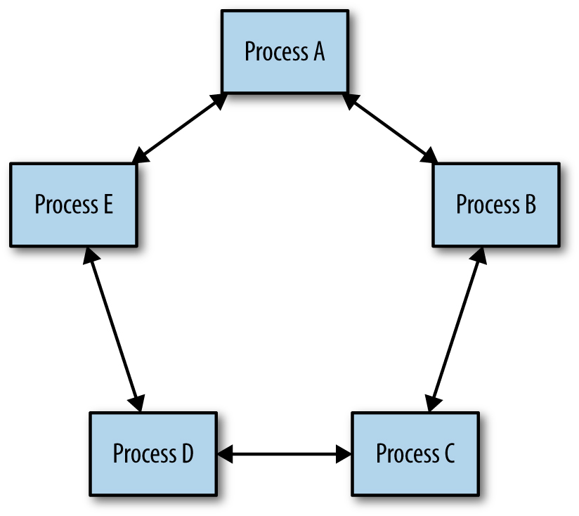

*Figure 23-1. Distributed consensus: agreement among a group of processes*

Whenever you see leader election, critical shared state, or distributed locking, we recommend using *distributed consensus systems that have been formally proven and tested thoroughly*. Informal approaches to solving this problem can lead to outages, and more insidiously, to subtle and hard-to-fix data consistency problems that may prolong outages in your system unnecessarily.

##### CAP Theorem

The CAP theorem ([[Fox99]](/sre-book/bibliography#Fox99), [[Bre12]](/sre-book/bibliography#Bre12)) holds that a distributed system cannot simultaneously have all three of the following properties:

- Consistent views of the data at each node
- Availability of the data at each node
- Tolerance to network partitions [[Gil02]](/sre-book/bibliography#Gil02)

The logic is intuitive: if two nodes can’t communicate (because the network is partitioned), then the system as a whole can either stop serving some or all requests at some or all nodes (thus reducing availability), or it can serve requests as usual, which results in inconsistent views of the data at each node.

Because network partitions are inevitable (cables get cut, packets get lost or delayed due to congestion, hardware breaks, networking components become misconfigured, etc.), understanding distributed consensus really amounts to understanding how consistency and availability work for your particular application. Commercial pressures often demand high levels of availability, and many applications require consistent views on their data.

Systems and software engineers are usually familiar with the traditional ACID datastore semantics (Atomicity, Consistency, Isolation, and Durability), but a growing number of distributed datastore technologies provide a different set of semantics known as BASE (Basically Available, Soft state, and Eventual consistency). Datastores that support BASE semantics have useful applications for certain kinds of data and can handle large volumes of data and transactions that would be much more costly, and perhaps altogether infeasible, with datastores that support ACID semantics.

Most of these systems that support BASE semantics rely on multimaster replication, where writes can be committed to different processes concurrently, and there is some mechanism to resolve conflicts (often as simple as "latest timestamp wins"). This approach is usually known as *eventual consistency*. However, eventual consistency can lead to surprising results [[Lu15]](/sre-book/bibliography#Lu15), particularly in the event of *clock drift* (which is inevitable in distributed systems) or network partitioning [[Kin15]](/sre-book/bibliography#Kin15).[^112]

It is also difficult for developers to design systems that work well with datastores that support only BASE semantics. Jeff Shute [[Shu13]](/sre-book/bibliography#Shu13), for example, has stated, “we find developers spend a significant fraction of their time building extremely complex and error-prone mechanisms to cope with eventual consistency and handle data that may be out of date. We think this is an unacceptable burden to place on developers and that consistency problems should be solved at the database level."

System designers cannot sacrifice correctness in order to achieve reliability or performance, particularly around critical state. For example, consider a system that handles financial transactions: reliability or performance requirements don’t provide much value if the financial data is not correct. Systems need to be able to reliably synchronize critical state across multiple processes. Distributed consensus algorithms provide this functionality.

## Motivating the Use of Consensus: Distributed Systems Coordination Failure

Distributed systems are complex and subtle to understand, monitor, and troubleshoot. Engineers running such systems are often surprised by behavior in the presence of failures. Failures are relatively rare events, and it is not a usual practice to test systems under these conditions. It is very difficult to reason about system behavior during failures. Network partitions are particularly challenging—a problem that appears to be caused by a full partition may instead be the result of:

- A very slow network
- Some, but not all, messages being dropped
- Throttle occurring in one direction, but not the other direction

The following sections provide examples of problems that occurred in real-world distributed systems and discuss how leader election and distributed consensus algorithms could be used to prevent such issues.

## Case Study 1: The Split-Brain Problem

A service is a content repository that allows collaboration between multiple users. It uses sets of two replicated file servers in different racks for reliability. The service needs to avoid writing data simultaneously to both file servers in a set, because doing so could result in data corruption (and possibly unrecoverable data).

Each pair of file servers has one leader and one follower. The servers monitor each other via heartbeats. If one file server cannot contact its partner, it issues a STONITH (Shoot The Other Node in the Head) command to its partner node to shut the node down, and then takes mastership of its files. This practice is an industry standard method of reducing split-brain instances, although as we shall see, it is conceptually unsound.

What happens if the network becomes slow, or starts dropping packets? In this scenario, file servers exceed their heartbeat timeouts and, as designed, send STONITH commands to their partner nodes and take mastership. However, some commands may not be delivered due to the compromised network. File server pairs may now be in a state in which both nodes are expected to be active for the same resource, or where both are down because both issued and received STONITH commands. This results in either corruption or unavailability of data.

The problem here is that the system is trying to solve a leader election problem using simple timeouts. Leader election is a reformulation of the distributed asynchronous consensus problem, which cannot be solved correctly by using heartbeats.

## Case Study 2: Failover Requires Human Intervention

A highly sharded database system has a primary for each shard, which replicates synchronously to a secondary in another datacenter. An external system checks the health of the primaries, and, if they are no longer healthy, promotes the secondary to primary. If the primary can’t determine the health of its secondary, it makes itself unavailable and escalates to a human in order to avoid the split-brain scenario seen in Case Study 1.

This solution doesn’t risk data loss, but it does negatively impact availability of data. It also unnecessarily increases operational load on the engineers who run the system, and human intervention scales poorly. This sort of event, where a primary and secondary have problems communicating, is highly likely to occur in the case of a larger infrastructure problem, when the responding engineers may already be overloaded with other tasks. If the network is so badly affected that a distributed consensus system cannot elect a master, a human is likely not better positioned to do so.

## Case Study 3: Faulty Group-Membership Algorithms

A system has a component that performs indexing and searching services. When starting, nodes use a gossip protocol to discover each other and join the cluster. The cluster elects a leader, which performs coordination. In the case of a network partition that splits the cluster, each side (incorrectly) elects a master and accepts writes and deletions, leading to a split-brain scenario and data corruption.

The problem of determining a consistent view of group membership across a group of processes is another instance of the distributed consensus problem.

In fact, many distributed systems problems turn out to be different versions of distributed consensus, including master election, group membership, all kinds of distributed locking and leasing, reliable distributed queuing and messaging, and maintenance of any kind of critical shared state that must be viewed consistently across a group of processes. All of these problems should be solved only using distributed consensus algorithms that have been proven formally correct, and whose implementations have been tested extensively. Ad hoc means of solving these sorts of problems (such as heartbeats and gossip protocols) will always have reliability problems in practice.

# How Distributed Consensus Works

The consensus problem has multiple variants. When dealing with distributed software systems, we are interested in *asynchronous distributed consensus*, which applies to environments with potentially unbounded delays in message passing. (*Synchronous consensus* applies to real-time systems, in which dedicated hardware means that messages will always be passed with specific timing guarantees.)

Distributed consensus algorithms may be *crash-fail* (which assumes that crashed nodes never return to the system) or *crash-recover*. Crash-recover algorithms are much more useful, because most problems in real systems are transient in nature due to a slow network, restarts, and so on.

Algorithms may deal with Byzantine or non-Byzantine failures. *Byzantine failure* occurs when a process passes incorrect messages due to a bug or malicious activity, and are comparatively costly to handle, and less often encountered.

Technically, solving the asynchronous distributed consensus problem in bounded time is impossible. As proven by the Dijkstra Prize–winning *FLP impossibility result* [[Fis85]](/sre-book/bibliography#Fis85), no asynchronous distributed consensus algorithm can guarantee progress in the presence of an unreliable network.

In practice, we approach the distributed consensus problem in bounded time by ensuring that the system will have sufficient healthy replicas and network connectivity to make progress reliably most of the time. In addition, the system should have backoffs with randomized delays. This setup both prevents retries from causing cascade effects and avoids the dueling proposers problem described later in this chapter. The protocols guarantee safety, and adequate redundancy in the system encourages liveness.

The original solution to the distributed consensus problem was Lamport’s Paxos protocol [[Lam98]](/sre-book/bibliography#Lam98), but other protocols exist that solve the problem, including Raft [[Ong14]](/sre-book/bibliography#Ong14), Zab [[Jun11]](/sre-book/bibliography#Jun11), and Mencius [[Mao08]](/sre-book/bibliography#Mao08). Paxos itself has many variations intended to increase performance [[Zoo14]](/sre-book/bibliography#Zoo14). These usually vary only in a single detail, such as giving a special leader role to one process to streamline the protocol.

## Paxos Overview: An Example Protocol

Paxos operates as a sequence of proposals, which may or may not be accepted by a majority of the processes in the system. If a proposal isn’t accepted, it fails. Each proposal has a sequence number, which imposes a strict ordering on all of the operations in the system.

In the first phase of the protocol, the proposer sends a sequence number to the acceptors. Each acceptor will agree to accept the proposal only if it has not yet seen a proposal with a higher sequence number. Proposers can try again with a higher sequence number if necessary. Proposers must use unique sequence numbers (drawing from disjoint sets, or incorporating their hostname into the sequence number, for instance).

If a proposer receives agreement from a majority of the acceptors, it can commit the proposal by sending a commit message with a value.

The strict sequencing of proposals solves any problems relating to ordering of messages in the system. The requirement for a majority to commit means that two different values cannot be committed for the same proposal, because any two majorities will overlap in at least one node. Acceptors must write a journal on persistent storage whenever they agree to accept a proposal, because the acceptors need to honor these guarantees after restarting.

Paxos on its own isn’t that useful: all it lets you do is to agree on a value and proposal number once. Because only a quorum of nodes need to agree on a value, any given node may not have a complete view of the set of values that have been agreed to. This limitation is true for most distributed consensus algorithms.

# System Architecture Patterns for Distributed Consensus

Distributed consensus algorithms are low-level and primitive: they simply allow a set of nodes to agree on a value, once. They don’t map well to real design tasks. What makes distributed consensus useful is the addition of higher-level system components such as datastores, configuration stores, queues, locking, and leader election services to provide the practical system functionality that distributed consensus algorithms don’t address. Using higher-level components reduces complexity for system designers. It also allows underlying distributed consensus algorithms to be changed if necessary in response to changes in the environment in which the system runs or changes in nonfunctional requirements.

Many systems that successfully use consensus algorithms actually do so as clients of some service that implements those algorithms, such as Zookeeper, Consul, and etcd. Zookeeper [[Hun10]](/sre-book/bibliography#Hun10) was the first open source consensus system to gain traction in the industry because it was easy to use, even with applications that weren’t designed to use distributed consensus. The Chubby service fills a similar niche at Google. Its authors point out [[Bur06]](/sre-book/bibliography#Bur06) that providing consensus primitives as a service rather than as libraries that engineers build into their applications frees application maintainers of having to deploy their systems in a way compatible with a highly available consensus service (running the right number of replicas, dealing with group membership, dealing with performance, etc.).

## Reliable Replicated State Machines

A *replicated state machine* (RSM) is a system that executes the same set of operations, in the same order, on several processes. RSMs are the fundamental building block of useful distributed systems components and services such as data or configuration storage, locking, and leader election (described in more detail later).

The operations on an RSM are ordered globally through a consensus algorithm. This is a powerful concept: several papers ([[Agu10]](/sre-book/bibliography#Agu10), [[Kir08]](/sre-book/bibliography#Kir08), [[Sch90]](/sre-book/bibliography#Sch90)) show that any deterministic program can be implemented as a highly available replicated service by being implemented as an RSM.

As shown in [Figure 23-2](#fig_distributed-consensus_consensus-rsm-relationship), replicated state machines are a system implemented at a logical layer above the consensus algorithm. The consensus algorithm deals with agreement on the sequence of operations, and the RSM executes the operations in that order. Because not every member of the consensus group is necessarily a member of each consensus quorum, RSMs may need to synchronize state from peers. As described by Kirsch and Amir [[Kir08]](/sre-book/bibliography#Kir08), you can use a *sliding-window protocol* to reconcile state between peer processes in an RSM.

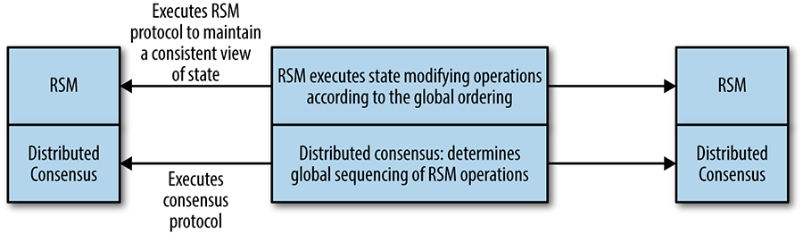

*Figure 23-2. The relationship between consensus algorithms and replicated state machines*

## Reliable Replicated Datastores and Configuration Stores

Reliable replicated datastores are an application of replicated state machines. Replicated datastores use consensus algorithms in the critical path of their work. Thus, performance, throughput, and the ability to scale are very important in this type of design. As with datastores built with other underlying technologies, consensus-based datastores can provide a variety of consistency semantics for read operations, which make a huge difference to how the datastore scales. These trade-offs are discussed in [Distributed Consensus Performance](#xref_distributed-consensus_performance).

Other (nondistributed-consensus–based) systems often simply rely on timestamps to provide bounds on the age of data being returned. Timestamps are highly problematic in distributed systems because it’s impossible to guarantee that clocks are synchronized across multiple machines. Spanner [[Cor12]](/sre-book/bibliography#Cor12) addresses this problem by modeling the worst-case uncertainty involved and slowing down processing where necessary to resolve that uncertainty.

## Highly Available Processing Using Leader Election

Leader election in distributed systems is an equivalent problem to distributed consensus. Replicated services that use a single leader to perform some specific type of work in the system are very common; the single leader mechanism is a way of ensuring mutual exclusion at a coarse level.

This type of design is appropriate where the work of the service leader can be performed by one process or is sharded. System designers can construct a highly available service by writing it as though it was a simple program, replicating that process and using leader election to ensure that only one leader is working at any point in time (as shown in [Figure 23-3](#fig_distributed-consensus_ha-with-rsm)). Often the work of the leader is that of coordinating some pool of workers in the system. This pattern was used in GFS [[Ghe03]](/sre-book/bibliography#Ghe03) (which has been replaced by Colossus) and the Bigtable key-value store [[Cha06]](/sre-book/bibliography#Cha06).

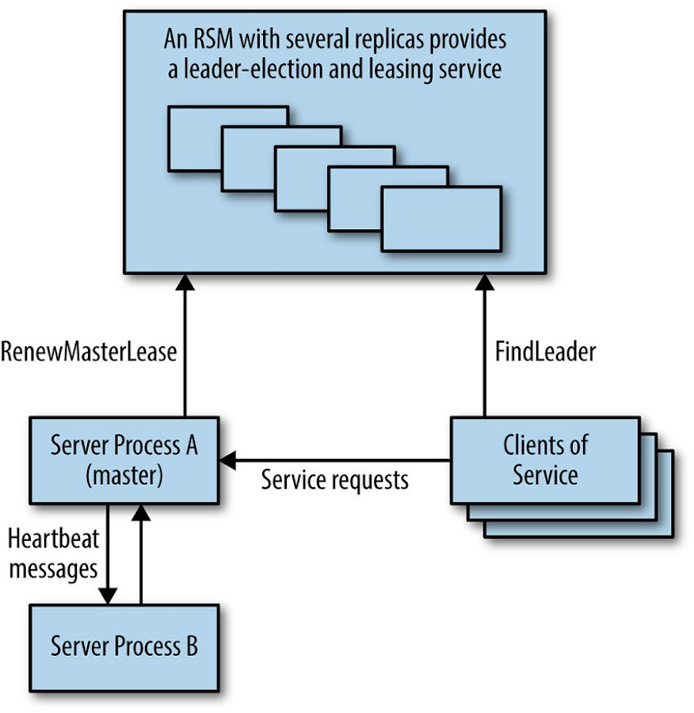

*Figure 23-3. Highly available system using a replicated service for master election*

In this type of component, unlike the replicated datastore, the consensus algorithm is not in the critical path of the main work the system is doing, so throughput is usually not a major concern.

## Distributed Coordination and Locking Services

A *barrier* in a distributed computation is a primitive that blocks a group of processes from proceeding until some condition is met (for example, until all parts of one phase of a computation are completed). Use of a barrier effectively splits a distributed computation into logical phases. For instance, as shown in [Figure 23-4](#fig_distributed-consensus_mapreduce-barriers), a barrier could be used in implementing the MapReduce [[Dea04]](/sre-book/bibliography#Dea04) model to ensure that the entire Map phase is completed before the Reduce part of the computation proceeds.

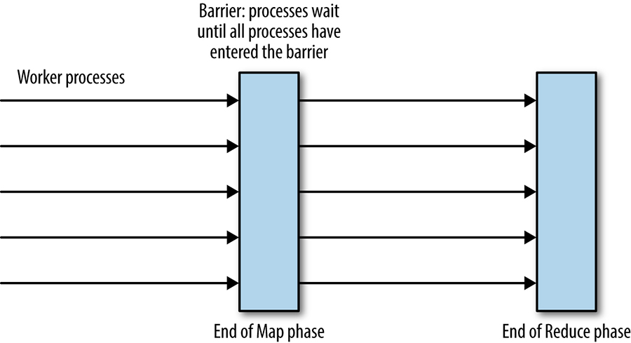

*Figure 23-4. Barriers for process coordination in the MapReduce computation*

The barrier could be implemented by a single coordinator process, but this implementation adds a single point of failure that is usually unacceptable. The barrier can also be implemented as an RSM. The Zookeeper consensus service can implement the barrier pattern: see [[Hun10]](/sre-book/bibliography#Hun10) and [[Zoo14]](/sre-book/bibliography#Zoo14).

*Locks* are another useful coordination primitive that can be implemented as an RSM. Consider a distributed system in which worker processes atomically consume some input files and write results. Distributed locks can be used to prevent multiple workers from processing the same input file. In practice, it is essential to use renewable leases with timeouts instead of indefinite locks, because doing so prevents locks from being held indefinitely by processes that crash. Distributed locking is beyond the scope of this chapter, but bear in mind that distributed locks are a low-level systems primitive that should be used with care. Most applications should use a higher-level system that provides distributed transactions.

## Reliable Distributed Queuing and Messaging

Queues are a common data structure, often used as a way to distribute tasks between a number of worker processes.

Queuing-based systems can tolerate failure and loss of worker nodes relatively easily. However, the system must ensure that claimed tasks are successfully processed. For that purpose, a *lease system* (discussed earlier in regard to locks) is recommended instead of an outright removal from the queue. The downside of queuing-based systems is that loss of the queue prevents the entire system from operating. Implementing the queue as an RSM can minimize the risk, and make the entire system far more robust.

*Atomic broadcast* is a distributed systems primitive in which messages are received reliably and in the same order by all participants. This is an incredibly powerful distributed systems concept and very useful in designing practical systems. A huge number of publish-subscribe messaging infrastructures exist for the use of system designers, although not all of them provide atomic guarantees. Chandra and Toueg [[Cha96]](/sre-book/bibliography#Cha96) demonstrate the equivalence of atomic broadcast and consensus.

The *queuing-as-work-distribution* pattern, which uses the queue as a load balancing device, as shown in [Figure 23-5](#fig_distributed-consensus_queuing), can be considered to be point-to-point messaging. Messaging systems usually also implement a publish-subscribe queue, where messages may be consumed by many clients that subscribe to a channel or topic. In this one-to-many case, the messages on the queue are stored as a persistent ordered list. Publish-subscribe systems can be used for many types of applications that require clients to subscribe to receive notifications of some type of event. Publish-subscribe systems can also be used to implement coherent distributed caches.

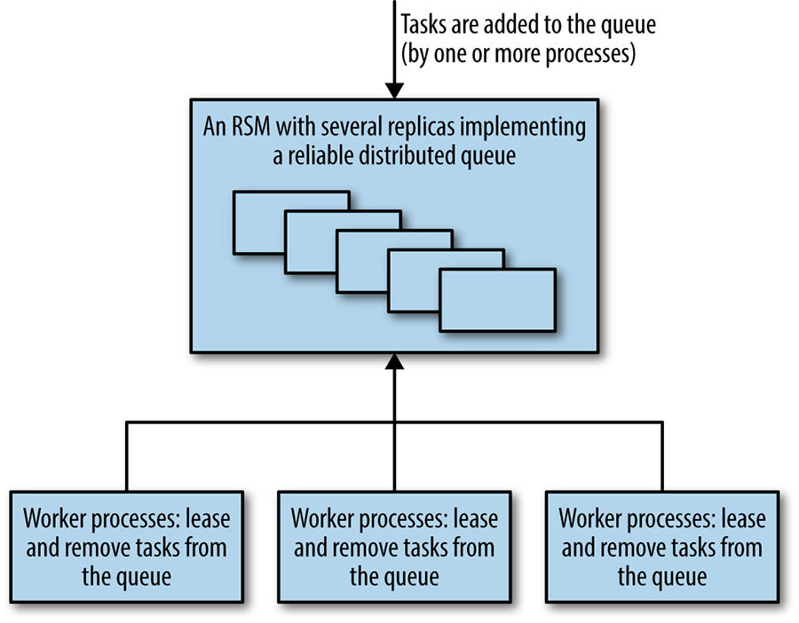

*Figure 23-5. A queue-oriented work distribution system using a reliable consensus-based queuing component*

Queuing and messaging systems often need excellent throughput, but don’t need extremely low latency (due to seldom being directly user-facing). However, very high latencies in a system like the one just described, which has multiple workers claiming tasks from a queue, could become a problem if the percentage of processing time for each task grew significantly.

# Distributed Consensus Performance

Conventional wisdom has generally held that consensus algorithms are too slow and costly to use for many systems that require high throughput *and* low latency [[Bol11]](/sre-book/bibliography#Bol11). This conception is simply not true—while implementations can be slow, there are a number of tricks that can improve performance. Distributed consensus algorithms are at the core of many of Google’s critical systems, described in [[Ana13]](/sre-book/bibliography#Ana13), [[Bur06]](/sre-book/bibliography#Bur06), [[Cor12]](/sre-book/bibliography#Cor12), and [[Shu13]](/sre-book/bibliography#Shu13), and they have proven extremely effective in practice. Google’s scale is not an advantage here: in fact, our scale is more of a disadvantage because it introduces two main challenges: our datasets tend to be large and our systems run over a wide geographical distance. Larger datasets multiplied by several replicas represent significant computing costs, and larger geographical distances increase latency between replicas, which in turn reduces performance.

There is no one "best" distributed consensus and state machine replication algorithm for performance, because performance is dependent on a number of factors relating to workload, the system’s performance objectives, and how the system is to be deployed.[^113] While some of the following sections present research, with the aim of increasing understanding of what is possible to achieve with distributed consensus, many of the systems described are available and are in use now.

*Workloads* can vary in many ways and understanding how they can vary is critical to discussing performance. In the case of a consensus system, workload may vary in terms of:

- Throughput: the number of proposals being made per unit of time at peak load
- The type of requests: proportion of operations that change state
- The consistency semantics required for read operations
- Request sizes, if size of data payload can vary

Deployment strategies vary, too. For example:

- Is the deployment local area or wide area?
- What kinds of quorum are used, and where are the majority of processes?
- Does the system use sharding, pipelining, and batching?

Many consensus systems use a distinguished leader process and require all requests to go to this special node. As shown in [Figure 23-6](#fig_distributed-consensus_distance-latency), as a result, the performance of the system as perceived by clients in different geographic locations may vary considerably, simply because more distant nodes have longer round-trip times to the leader process.

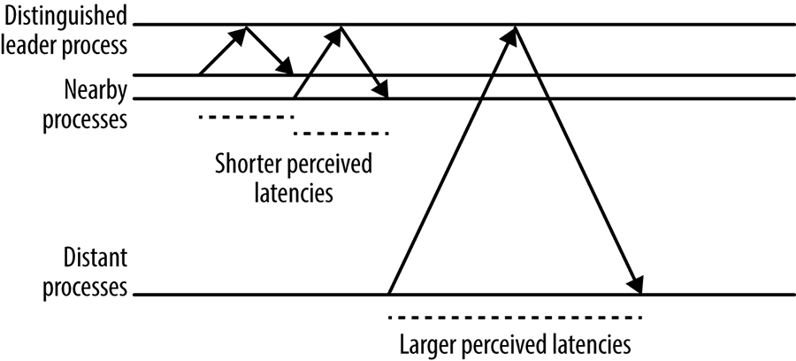

*Figure 23-6. The effect of distance from a server process on perceived latency at the client*

## Multi-Paxos: Detailed Message Flow

The Multi-Paxos protocol uses a *strong leader process*: unless a leader has not yet been elected or some failure occurs, it requires only one round trip from the proposer to a quorum of acceptors to reach consensus. Using a strong leader process is optimal in terms of the number of messages to be passed, and is typical of many consensus protocols.

[Figure 23-7](#fig_distributed-consensus_multipaxos-basic) shows an initial state with a new proposer executing the first `Prepare`/`Promise` phase of the protocol. Executing this phase establishes a new numbered view, or leader term. On subsequent executions of the protocol, while the view remains the same, the first phase is unnecessary because the proposer that established the view can simply send `Accept` messages, and consensus is reached once a quorum of responses is received (including the proposer itself).

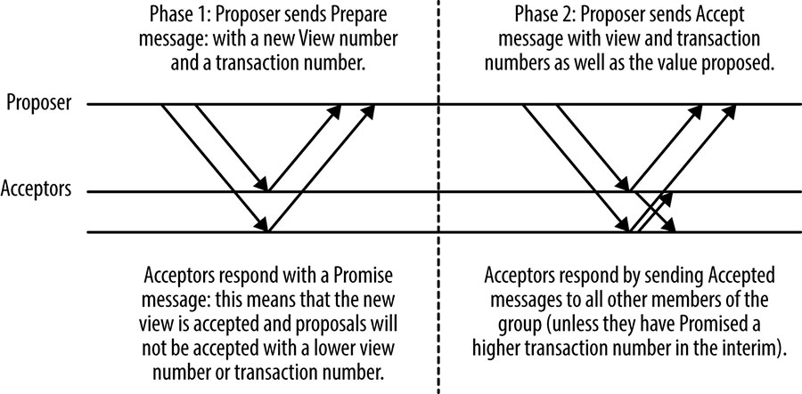

*Figure 23-7. Basic Multi-Paxos message flow*

Another process in the group can assume the proposer role to propose messages at any time, but changing the proposer has a performance cost. It necessitates the extra round trip to execute Phase 1 of the protocol, but more importantly, it may cause a *dueling proposers* situation in which proposals repeatedly interrupt each other and no proposals can be accepted, as shown in [Figure 23-8](#fig_distributed-consensus_multipaxos-livelock). Because this scenario is a form of a livelock, it can continue indefinitely.

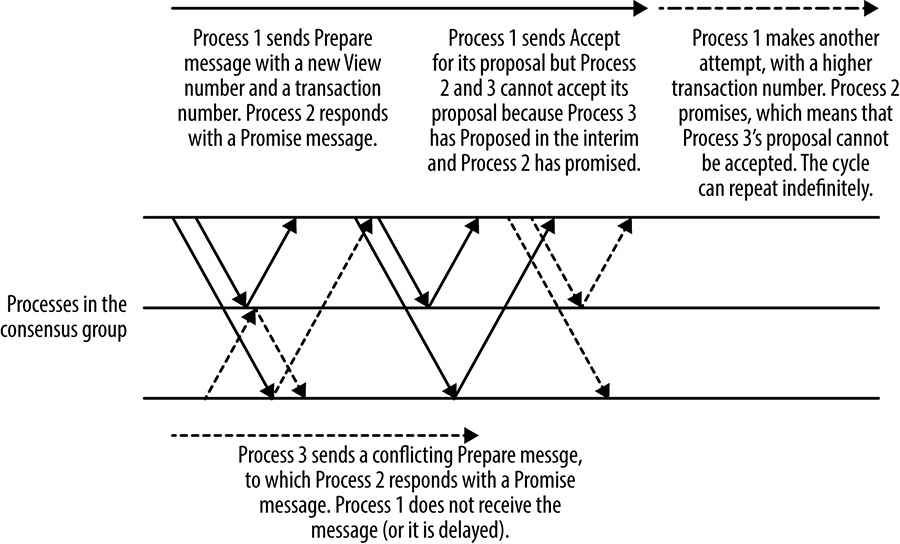

*Figure 23-8. Dueling proposers in Multi-Paxos*

All practical consensus systems address this issue of collisions, usually either by electing a proposer process, which makes all proposals in the system, or by using a rotating proposer that allocates each process particular slots for their proposals.

For systems that use a leader process, the leader election process must be tuned carefully to balance the system unavailability that occurs when no leader is present with the risk of dueling proposers. It’s important to implement the right timeouts and backoff strategies. If multiple processes detect that there is no leader and all attempt to become leader at the same time, then none of the processes is likely to succeed (again, dueling proposers). Introducing randomness is the best approach. Raft [[Ong14]](/sre-book/bibliography#Ong14), for example, has a well-thought-out method of approaching the leader election process.

## Scaling Read-Heavy Workloads

Scaling read workload is often critical because many workloads are read-heavy. Replicated datastores have the advantage that the data is available in multiple places, meaning that if strong consistency is not required for all reads, data could be read from *any* replica. This technique of reading from replicas works well for certain applications, such as Google’s Photon system [[Ana13]](/sre-book/bibliography#Ana13), which uses distributed consensus to coordinate the work of multiple pipelines. Photon uses an atomic compare-and-set operation for state modification (inspired by atomic registers), which must be absolutely consistent; but read operations may be served from any replica, because stale data results in extra work being performed but not incorrect results [[Gup15]](/sre-book/bibliography#Gup15). The trade-off is worthwhile.

In order to guarantee that data being read is up-to-date and consistent with any changes made before the read is performed, it is necessary to do one of the following:

- Perform a read-only consensus operation.
- Read the data from a replica that is guaranteed to be the most up-to-date. In a system that uses a stable leader process (as many distributed consensus implementations do), the leader can provide this guarantee.
- Use quorum leases, in which some replicas are granted a lease on all or part of the data in the system, allowing strongly consistent local reads at the cost of some write performance. This technique is discussed in detail in the following section.

## Quorum Leases

Quorum leases [[Mor14]](/sre-book/bibliography#Mor14) are a recently developed distributed consensus performance optimization aimed at reducing latency and increasing throughput for read operations. As previously mentioned, in the case of classic Paxos and most other distributed consensus protocols, performing a strongly consistent read (i.e., one that is guaranteed to have the most up-to-date view of state) requires either a distributed consensus operation that reads from a quorum of replicas, or a stable leader replica that is guaranteed to have seen all recent state changing operations. In many systems, read operations vastly outnumber writes, so this reliance on either a distributed operation or a single replica harms latency and system throughput.

The quorum leasing technique simply grants a read lease on some subset of the replicated datastore’s state to a quorum of replicas. The lease is for a specific (usually brief) period of time. Any operation that changes the state of that data must be acknowledged by all replicas in the read quorum. If any of these replicas becomes unavailable, the data cannot be modified until the lease expires.

Quorum leases are particularly useful for read-heavy workloads in which reads for particular subsets of the data are concentrated in a single geographic region.

## Distributed Consensus Performance and Network Latency

Consensus systems face two major physical constraints on performance when committing state changes. One is network round-trip time and the other is time it takes to write data to persistent storage, which will be examined later.

Network round-trip times vary enormously depending on source and destination location, which are impacted both by the physical distance between the source and the destination, and by the amount of congestion on the network. Within a single datacenter, round-trip times between machines should be on the order of a millisecond. A typical round-trip-time (RTT) within the United States is 45 milliseconds, and from New York to London is 70 milliseconds.

Consensus system performance over a local area network can be comparable to that of an asynchronous leader-follower replication system [[Bol11]](/sre-book/bibliography#Bol11), such as many traditional databases use for replication. However, much of the availability benefits of distributed consensus systems require replicas to be "distant" from each other, in order to be in different failure domains.

Many consensus systems use TCP/IP as their communication protocol. TCP/IP is connection-oriented and provides some strong reliability guarantees regarding FIFO sequencing of messages. However, setting up a new TCP/IP connection requires a network round trip to perform the three-way handshake that sets up a connection before any data can be sent or received. TCP/IP slow start initially limits the bandwidth of the connection until its limits have been established. Initial TCP/IP window sizes range from 4 to 15 KB.

TCP/IP slow start is probably not an issue for the processes that form a consensus group: they will establish connections to each other and keep these connections open for reuse because they’ll be in frequent communication. However, for systems with a very high number of clients, it may not be practical for all clients to keep a persistent connection to the consensus clusters open, because open TCP/IP connections do consume some resources, e.g., file descriptors, in addition to generating keepalive traffic. This overhead may be an important issue for applications that use very highly sharded consensus-based datastores containing thousands of replicas and an even larger numbers of clients. A solution is to use a pool of regional proxies, as shown in [Figure 23-9](#fig_distributed-consensus_proxies), which hold persistent TCP/IP connections to the consensus group in order to avoid the setup overhead over long distances. Proxies may also be a good way to encapsulate sharding and load balancing strategies, as well as discovery of cluster members and leaders.

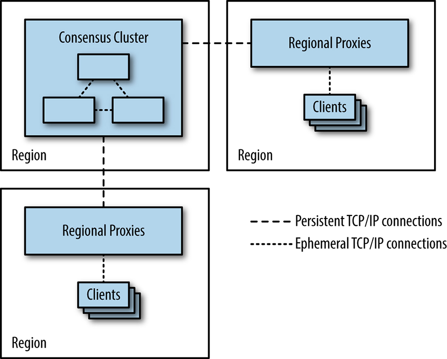

*Figure 23-9. Using proxies to reduce the need for clients to open TCP/IP connections across regions*

## Reasoning About Performance: Fast Paxos

Fast Paxos [[Lam06]](/sre-book/bibliography#Lam06) is a version of the Paxos algorithm designed to improve its performance over wide area networks. Using Fast Paxos, each client can send `Propose` messages directly to each member of a group of acceptors, instead of through a leader, as in Classic Paxos or Multi-Paxos. The idea is to substitute one parallel message send from the client to all acceptors in Fast Paxos for two message send operations in Classic Paxos:

- One message from the client to a single proposer
- A parallel message send operation from the proposer to the other replicas

Intuitively, it seems as though Fast Paxos should always be faster than Classic Paxos. However, that’s not true: if the client in the Fast Paxos system has a high RTT (round-trip time) to the acceptors, and the acceptors have fast connections to each other, we have substituted *N* parallel messages across the slower network links (in Fast Paxos) for one message across the slower link plus *N* parallel messages across the faster links (Classic Paxos). Due to the latency tail effect, the majority of the time, a single round trip across a slow link with a distribution of latencies is faster than a quorum (as shown in [[Jun07]](/sre-book/bibliography#Jun07)), and therefore, Fast Paxos is slower than Classic Paxos in this case.

Many systems batch multiple operations into a single transaction at the acceptor to increase throughput. Having clients act as proposers also makes it much more difficult to batch proposals. The reason for this is that proposals arrive independently at acceptors so you can’t then batch them in a consistent way.

## Stable Leaders

We have seen how Multi-Paxos elects a stable leader to improve performance. Zab [[Jun11]](/sre-book/bibliography#Jun11) and Raft [[Ong14]](/sre-book/bibliography#Ong14) are also examples of protocols that elect a stable leader for performance reasons. This approach can allow read optimizations, as the leader has the most up-to-date state, but also has several problems:

- All operations that change state must be sent via the leader, a requirement that adds network latency for clients that are not located near the leader.
- The leader process’s outgoing network bandwidth is a system bottleneck [[Mao08]](/sre-book/bibliography#Mao08), because the leader’s `Accept` message contains all of the data related to any proposal, whereas other messages contain only acknowledgments of a numbered transaction with no data payload.
- If the leader happens to be on a machine with performance problems, then the throughput of the entire system will be reduced.

Almost all distributed consensus systems that have been designed with performance in mind use either the single stable leader pattern or a system of rotating leadership in which each numbered distributed consensus algorithm is preassigned to a replica (usually by a simple modulus of the transaction ID). Algorithms that use this approach include Mencius [[Mao08]](/sre-book/bibliography#Mao08) and Egalitarian Paxos [[Mor12a]](/sre-book/bibliography#Mor12a).

Over a wide area network with clients spread out geographically and replicas from the consensus group located reasonably near to the clients, such leader election leads to lower perceived latency for clients because their network RTT to the nearest replica will, on average, be smaller than that to an arbitrary leader.

## Batching

Batching, as described in [Reasoning About Performance: Fast Paxos](#xref_distributed-consensus_fast-paxos), increases system throughput, but it still leaves replicas idle while they await replies to messages they have sent. The inefficiencies presented by idle replicas can be solved by *pipelining*, which allows multiple proposals to be in-flight at once. This optimization is very similar to the TCP/IP case, in which the protocol attempts to "keep the pipe full" using a sliding-window approach. Pipelining is normally used in combination with batching.

The batches of requests in the pipeline are still globally ordered with a view number and a transaction number, so this method does not violate the global ordering properties required to run a replicated state machine. This optimization method is discussed in [[Bol11]](/sre-book/bibliography#Bol11) and [[San11]](/sre-book/bibliography#San11).

## Disk Access

Logging to persistent storage is required so that a node, having crashed and returned to the cluster, honors whatever previous commitments it made regarding ongoing consensus transactions. In the Paxos protocol, for instance, acceptors cannot agree to a proposal when they have already agreed to a proposal with a higher sequence number. If details of agreed and committed proposals are not logged to persistent storage, then an acceptor might violate the protocol if it crashes and is restarted, leading to inconsistent state.

The time required to write an entry to a log on disk varies greatly depending on what hardware or virtualized environment is used, but is likely to take between one and several milliseconds.

The message flow for Multi-Paxos was discussed in [Multi-Paxos: Detailed Message Flow](#xref_distributed-consensus_multi-paxos), but this section did not show where the protocol must log state changes to disk. A disk write must happen whenever a process makes a commitment that it must honor. In the performance-critical second phase of Multi-Paxos, these points occur before an acceptor sends an `Accepted` message in response to a proposal, and before the proposer sends the `Accept` message, because this `Accept` message is also an implicit `Accepted` message [[Lam98]](/sre-book/bibliography#Lam98).

This means that the latency for a single consensus operation involves the following:

- One disk write on the proposer
- Parallel messages to the acceptors
- Parallel disk writes at the acceptors
- The return messages

There is a version of the [Multi-Paxos protocol](https://sre.google/sre-book/distributed-periodic-scheduling/) that’s useful for cases in which disk write time dominates: this variant doesn’t consider the proposer’s `Accept` message to be an implicit `Accepted` message. Instead, the proposer writes to disk in parallel with the other processes and sends an explicit `Accept` message. Latency then becomes proportional to the time taken to send two messages and for a quorum of processes to execute a synchronous write to disk in parallel.

If latency for performing a small random write to disk is on the order of 10 milliseconds, the rate of consensus operations will be limited to approximately 100 per second. These times assume that network round-trip times are negligible and the proposer performs its logging in parallel with the acceptors.

As we have seen already, distributed consensus algorithms are often used as the basis for building a replicated state machine. RSMs also need to keep transaction logs for recovery purposes (for the same reasons as any datastore). The consensus algorithm’s log and the RSM’s transaction log can be combined into a single log. Combining these logs avoids the need to constantly alternate between writing to two different physical locations on disk [[Bol11]](/sre-book/bibliography#Bol11), reducing the time spent on seek operations. The disks can sustain more operations per second and therefore, the system as a whole can perform more transactions.

In a datastore, disks have purposes other than maintaining logs: system state is generally maintained on disk. Log writes must be flushed directly to disk, but writes for state changes can be written to a memory cache and flushed to disk later, reordered to use the most efficient schedule [[Bol11]](/sre-book/bibliography#Bol11).

Another possible optimization is batching multiple client operations together into one operation at the proposer ([[Ana13]](/sre-book/bibliography#Ana13), [[Bol11]](/sre-book/bibliography#Bol11), [[Cha07]](/sre-book/bibliography#Cha07), [[Jun11]](/sre-book/bibliography#Jun11), [[Mao08]](/sre-book/bibliography#Mao08), [[Mor12a]](/sre-book/bibliography#Mor12a)). This amortizes the fixed costs of the disk logging and network latency over the larger number of operations, increasing throughput.

# Deploying Distributed Consensus-Based Systems

The most critical decisions system designers must make when deploying a consensus-based system concern the number of replicas to be deployed and the location of those replicas.

## Number of Replicas

In general, consensus-based systems operate using *majority quorums*, i.e., a group of 2f + 1 replicas may tolerate f failures (if Byzantine fault tolerance, in which the system is resistant to replicas returning incorrect results, is required, then 3f + 1 replicas may tolerate f failures [[Cas99]](/sre-book/bibliography#Cas99)). For non-Byzantine failures, the minimum number of replicas that can be deployed is three—if two are deployed, then there is no tolerance for failure of any process. Three replicas may tolerate one failure. Most system downtime is a result of planned maintenance [[Ken12]](/sre-book/bibliography#Ken12): three replicas allow a system to operate normally when one replica is down for maintenance (assuming that the remaining two replicas can handle system load at an acceptable performance).

If an unplanned failure occurs during a maintenance window, then the consensus system becomes unavailable. Unavailability of the consensus system is usually unacceptable, and so five replicas should be run, allowing the system to operate with up to two failures. No intervention is necessarily required if four out of five replicas in a consensus system remain, but if three are left, an additional replica or two should be added.

If a consensus system loses so many of its replicas that it cannot form a quorum, then that system is, in theory, in an unrecoverable state because the durable logs of at least one of the missing replicas cannot be accessed. If no quorum remains, it’s possible that a decision that was seen only by the missing replicas was made. Administrators may be able to force a change in the group membership and add new replicas that catch up from the existing one in order to proceed, but the possibility of data loss always remains—a situation that should be avoided if at all possible.

In a disaster, administrators have to decide whether to perform such a forceful reconfiguration or to wait for some period of time for machines with system state to become available. When such decisions are being made, treatment of the system’s log (in addition to monitoring) becomes critical. Theoretical papers often point out that consensus can be used to construct a replicated log, but fail to discuss how to deal with replicas that may fail and recover (and thus miss some sequence of consensus decisions) or lag due to slowness. In order to maintain robustness of the system, it is important that these replicas do catch up.

The *replicated log* is not always a first-class citizen in distributed consensus theory, but it is a very important aspect of production systems. Raft describes a method for managing the consistency of replicated logs [[Ong14]](/sre-book/bibliography#Ong14) explicitly defining how any gaps in a replica’s log are filled. If a five-instance Raft system loses all of its members except for its leader, the leader is still guaranteed to have full knowledge of all committed decisions. On the other hand, if the missing majority of members included the leader, no strong guarantees can be made regarding how up-to-date the remaining replicas are.

There is a relationship between performance and the number of replicas in a system that do not need to form part of a quorum: a minority of slower replicas may lag behind, allowing the quorum of better-performing replicas to run faster (as long as the leader performs well). If replica performance varies significantly, then every failure may reduce the performance of the system overall because slow outliers will be required to form a quorum. The more failures or lagging replicas a system can tolerate, the better the system’s performance overall is likely to be.

The issue of cost should also be considered in managing replicas: each replica uses costly computing resources. If the system in question is a single cluster of processes, the cost of running replicas is probably not a large consideration. However, the cost of replicas can be a serious consideration for systems such as Photon [[Ana13]](/sre-book/bibliography#Ana13), which uses a sharded configuration in which each shard is a full group of processes running a consensus algorithm. As the number of shards grows, so does the cost of each additional replica, because a number of processes equal to the number of shards must be added to the system.

The decision about the number of replicas for any system is thus a trade-off between the following factors:

- The need for reliability
- Frequency of planned maintenance affecting the system
- Risk
- Performance
- Cost

This calculation will be different for each system: systems have different service level objectives for availability; some organizations perform maintenance more regularly than others; and organizations use hardware of varying cost, quality, and reliability.

## Location of Replicas

Decisions about where to deploy the processes that comprise a consensus cluster are made based upon two factors: a trade-off between the failure domains that the system should handle, and the latency requirements for the system. Multiple complex issues are at play in deciding where to locate replicas.

A *failure domain* is the set of components of a system that can become unavailable as a result of a single failure. Example failure domains include the following:

- A physical machine
- A rack in a datacenter served by a single power supply
- Several racks in a datacenter that are served by one piece of networking equipment
- A datacenter that could be rendered unavailable by a fiber optic cable cut
- A set of datacenters in a single geographic area that could all be affected by a single natural disaster such as a hurricane

In general, as the distance between replicas increases, so does the round-trip time between replicas, as well as the size of the failure the system will be able to tolerate. For most consensus systems, increasing the round-trip time between replicas will also increase the latency of operations.

The extent to which latency matters, as well as the ability to survive a failure in a particular domain, is very system-dependent. Some consensus system architectures don’t require particularly high throughput or low latency: for example, a consensus system that exists in order to provide group membership and leader election services for a highly available service probably isn’t heavily loaded, and if the consensus transaction time is only a fraction of the leader lease time, then its performance isn’t critical. Batch-oriented systems are also less affected by latency: operation batch sizes can be increased to increase throughput.

It doesn’t always make sense to continually increase the size of the failure domain whose loss the system can withstand. For instance, if all of the clients using a consensus system are running within a particular failure domain (say, the New York area) and deploying a distributed consensus–based system across a wider geographical area would allow it to remain serving during outages in that failure domain (say, Hurricane Sandy), is it worth it? Probably not, because the system’s clients will be down as well so the system will see no traffic. The extra cost in terms of latency, throughput, and computing resources would give no benefit.

You should take disaster recovery into account when deciding where to locate your replicas: in a system that stores critical data, the consensus replicas are also essentially online copies of the system data. However, when critical data is at stake, it’s important to back up regular snapshots elsewhere, even in the case of solid consensus–based systems that are deployed in several diverse failure domains. There are two failure domains that you can never escape: the software itself, and human error on the part of the system’s administrators. Bugs in software can emerge under unusual circumstances and cause data loss, while system misconfiguration can have similar effects. Human operators can also err, or perform sabotage causing data loss.

When making decisions about location of replicas, remember that the most important measure of performance is client perception: ideally, the network round-trip time from the clients to the consensus system’s replicas should be minimized. Over a wide area network, leaderless protocols like Mencius or Egalitarian Paxos may have a performance edge, particularly if the consistency constraints of the application mean that it is possible to execute read-only operations on any system replica without performing a consensus operation.

## Capacity and Load Balancing

When designing a deployment, you must make sure there is sufficient capacity to deal with load. In the case of *sharded deployments*, you can adjust capacity by adjusting the number of shards. However, for systems that can read from consensus group members that are not the leader, you can increase read capacity by adding more replicas. Adding more replicas has a cost: in an algorithm that uses a strong leader, adding replicas imposes more load on the leader process, while in a peer-to-peer protocol, adding replicas imposes more load on all processes. However, if there is ample capacity for write operations, but a read-heavy workload is stressing the system, adding replicas may be the best approach.

It should be noted that adding a replica in a majority quorum system can potentially decrease system availability somewhat (as shown in [Figure 23-10](#fig_distributed-consensus_region-diversity)). A typical deployment for Zookeeper or Chubby uses five replicas, so a majority quorum requires three replicas. The system will still make progress if two replicas, or 40%, are unavailable. With six replicas, a quorum requires four replicas: only 33% of the replicas can be unavailable if the system is to remain live.

Considerations regarding failure domains therefore apply even more strongly when a sixth replica is added: if an organization has five datacenters, and generally runs consensus groups with five processes, one in each datacenter, then loss of one datacenter still leaves one spare replica in each group. If a sixth replica is deployed in one of the five datacenters, then an outage in that datacenter removes both of the spare replicas in the group, thereby reducing capacity by 33%.

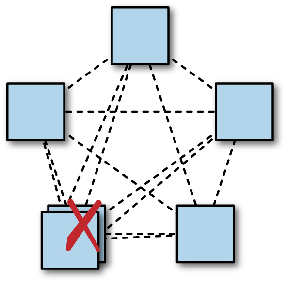

*Figure 23-10. Adding an extra replica in one region may reduce system availability. Colocating multiple replicas in a single datacenter may reduce system availability: here, there is a quorum without any redundancy remaining.*

If clients are dense in a particular geographic region, it is best to locate replicas close to clients. However, deciding where exactly to locate replicas may require some careful thought around load balancing and how a system deals with overload. As shown in [Figure 23-11](#fig_distributed-consensus_sharded-leaders), if a system simply routes client read requests to the nearest replica, then a large spike in load concentrated in one region may overwhelm the nearest replica, and then the next-closest replica, and so on—this is *cascading failure* (see [Addressing Cascading Failures](/sre-book/addressing-cascading-failures/)). This type of overload can often happen as a result of batch jobs beginning, especially if several begin at the same time.

We’ve already seen the reason that many distributed consensus systems use a leader process to improve performance. However, it’s important to understand that the leader replicas will use more computational resources, particularly outgoing network capacity. This is because the leader sends proposal messages that include the proposed data, but replicas send smaller messages, usually just containing agreement with a particular consensus transaction ID. Organizations that run highly sharded consensus systems with a very large number of processes may find it necessary to ensure that leader processes for the different shards are balanced relatively evenly across different datacenters. Doing so prevents the system as a whole from being bottlenecked on outgoing network capacity for just one datacenter, and makes for much greater overall system capacity.

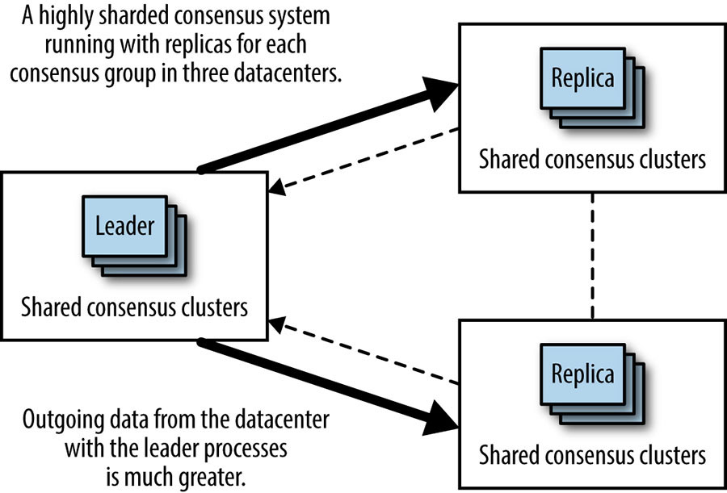

*Figure 23-11. Colocating leader processes leads to uneven bandwidth utilization*

Another downside of deploying consensus groups in multiple datacenters (shown by [Figure 23-11](#fig_distributed-consensus_sharded-leaders)) is the very extreme change in the system that can occur if the datacenter hosting the leaders suffers a widespread failure (power, networking equipment failure, or fiber cut, for instance). As shown in [Figure 23-12](#fig_distributed-consensus_colocated-failure), in this failure scenario, all of the leaders should fail over to another datacenter, either split evenly or en masse into one datacenter. In either case, the link between the other two datacenters will suddenly receive a lot more network traffic from this system. This would be an inopportune moment to discover that the capacity on that link is insufficient.

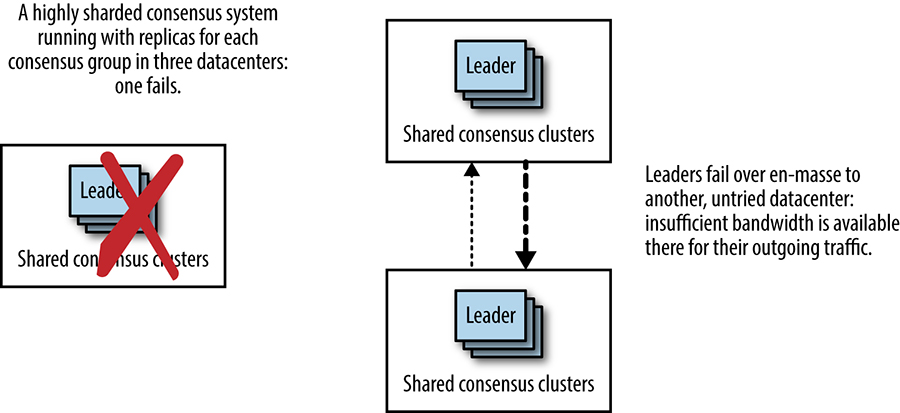

*Figure 23-12. When colocated leaders fail over en masse, patterns of network utilization change dramatically*

However, this type of deployment could easily be an unintended result of automatic processes in the system that have bearing on how leaders are chosen. For instance:

- Clients will experience better latency for any operations handled via the leader if the leader is located closest to them. An algorithm that attempts to site leaders near the bulk of clients could take advantage of this insight.
- An algorithm might try to locate leaders on machines with the best performance. A pitfall of this approach is that if one of the three datacenters houses faster machines, then a disproportionate amount of traffic will be sent to that datacenter, resulting in extreme traffic changes should that datacenter go offline. To avoid this problem, the algorithm must also take into account distribution balance against machine capabilities when selecting machines.
- A leader election algorithm might favor processes that have been running longer. Longer-running processes are quite likely to be correlated with location if software releases are performed on a per-datacenter basis.

### Quorum composition

When determining where to locate replicas in a consensus group, it is important to consider the effect of the geographical distribution (or, more precisely, the network latencies between replicas) on the performance of the group.

One approach is to spread the replicas as evenly as possible, with similar RTTs between all replicas. All other factors being equal (such as workload, hardware, and network performance), this arrangement should lead to fairly consistent performance across all regions, regardless of where the group leader is located (or for each member of the consensus group, if a leaderless protocol is in use).

Geography can greatly complicate this approach. This is particularly true for intra-continental versus transpacific and transatlantic traffic. Consider a system that spans North America and Europe: it is impossible to locate replicas equidistant from each other because there will always be a longer lag for transatlantic traffic than for intracontinental traffic. No matter what, transactions from one region will need to make a transatlantic round trip in order to reach consensus.

However, as shown in [Figure 23-13](#fig_distributed-consensus_overlapping-quorums), in order to try to distribute traffic as evenly as possible, systems designers might choose to site five replicas, with two replicas roughly centrally in the US, one on the east coast, and two in Europe. Such a distribution would mean that in the average case, consensus could be achieved in North America without waiting for replies from Europe, or that from Europe, consensus can be achieved by exchanging messages only with the east coast replica. The east coast replica acts as a linchpin of sorts, where two possible quorums overlap.

*Figure 23-13. Overlapping quorums with one replica acting as a link*

As shown in [Figure 23-14](#fig_distributed-consensus_overlapping-quorums-failure), loss of this replica means that system latency is likely to change drastically: instead of being largely influenced by either central US to east coast RTT or EU to east coast RTT, latency will be based on EU to central RTT, which is around 50% higher than EU to east coast RTT. The geographic distance and network RTT between the nearest possible quorum increases enormously.

*Figure 23-14. Loss of the link replica immediately leads to a longer RTT for any quorum*

This scenario is a key weakness of the simple majority quorum when applied to groups composed of replicas with very different RTTs between members. In such cases, a hierarchical quorum approach may be useful. As diagrammed in [Figure 23-15](#fig_distributed-consensus_hierarchical-quorums), nine replicas may be deployed in three groups of three. A quorum may be formed by a majority of groups, and a group may be included in the quorum if a majority of the group’s members are available. This means that a replica may be lost in the central group without incurring a large impact on overall system performance because the central group may still vote on transactions with two of its three replicas.

There is, however, a resource cost associated with running a higher number of replicas. In a highly sharded system with a read-heavy workload that is largely fulfillable by replicas, we might mitigate this cost by using fewer consensus groups. Such a strategy means that the overall number of processes in the system may not change.

*Figure 23-15. Hierarchical quorums can be used to reduce reliance on the central replica*

# Monitoring Distributed Consensus Systems

As we’ve already seen, distributed consensus algorithms are at the core of many of Google’s critical systems ([[Ana13]](/sre-book/bibliography#Ana13), [[Bur06]](/sre-book/bibliography#Bur06), [[Cor12]](/sre-book/bibliography#Cor12), [[Shu13]](/sre-book/bibliography#Shu13)). All important production systems need monitoring, in order to detect outages or problems and for troubleshooting. Experience has shown us that there are certain specific aspects of distributed consensus systems that warrant special attention. These are:

The number of members running in each consensus group, and the status of each process (healthy or not healthy)  
A process may be running but unable to make progress for some (e.g., hardware-related) reason.

Persistently lagging replicas  
Healthy members of a consensus group can still potentially be in multiple different states. A group member may be recovering state from peers after startup, or lagging behind the quorum in the group, or it may be up-to-date and participating fully, and it may be the leader.

Whether or not a leader exists  
A system based on an algorithm such as Multi-Paxos that uses a leader role must be monitored to ensure that a leader exists, because if the system has no leader, it is totally unavailable.

Number of leader changes  
Rapid changes of leadership impair performance of consensus systems that use a stable leader, so the number of leader changes should be monitored. Consensus algorithms usually mark a leadership change with a new term or view number, so this number provides a useful metric to monitor. Too rapid of an increase in leader changes signals that the leader is flapping, perhaps due to network connectivity issues. A decrease in the view number could signal a serious bug.

Consensus transaction number  
Operators need to know whether or not the consensus system is making progress. Most consensus algorithms use an increasing consensus transaction number to indicate progress. This number should be seen to be increasing over time if a system is healthy.

Number of proposals seen; number of proposals agreed upon  
These numbers indicate whether or not the system is operating correctly.

Throughput and latency  
Although not specific to distributed consensus systems, these characteristics of their consensus system should be monitored and understood by administrators.

In order to understand system performance and to help troubleshoot performance issues, you might also monitor the following:

- Latency distributions for proposal acceptance
- Distributions of network latencies observed between parts of the system in different locations
- The amount of time acceptors spend on durable logging
- Overall bytes accepted per second in the system

# Conclusion

We explored the definition of the distributed consensus problem, and presented some system architecture patterns for distributed-consensus based systems, as well as examining the performance characteristics and some of the operational concerns around distributed consensus–based systems.

We deliberately avoided an in-depth discussion about specific algorithms, protocols, or implementations in this chapter. Distributed coordination systems and the technologies underlying them are evolving quickly, and this information would rapidly become out of date, unlike the fundamentals that are discussed here. However, these fundamentals, along with the articles referenced throughout this chapter, will enable you to use the distributed coordination tools available today, as well as future software.

If you remember nothing else from this chapter, keep in mind the sorts of problems that distributed consensus can be used to solve, and the types of problems that can arise when ad hoc methods such as heartbeats are used instead of distributed consensus. Whenever you see leader election, critical shared state, or distributed locking, think about distributed consensus: any lesser approach is a ticking bomb waiting to explode in your systems.

[^112]Kyle Kingsbury has written an extensive series of articles on distributed systems correctness, which contain many examples of unexpected and incorrect behavior in these kinds of datastores. See [*https://aphyr.com/tags/jepsen*](https://aphyr.com/tags/jepsen).

[^113]In particular, the performance of the original Paxos algorithm is not ideal, but has been greatly improved over the years.
