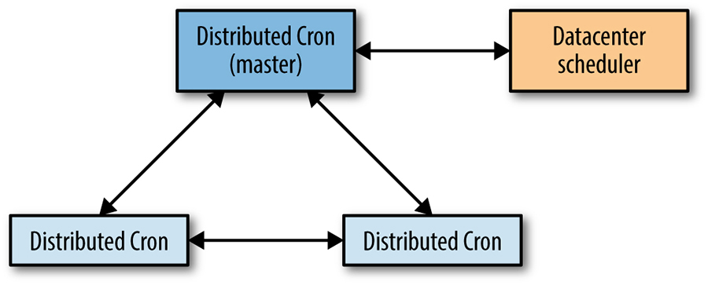
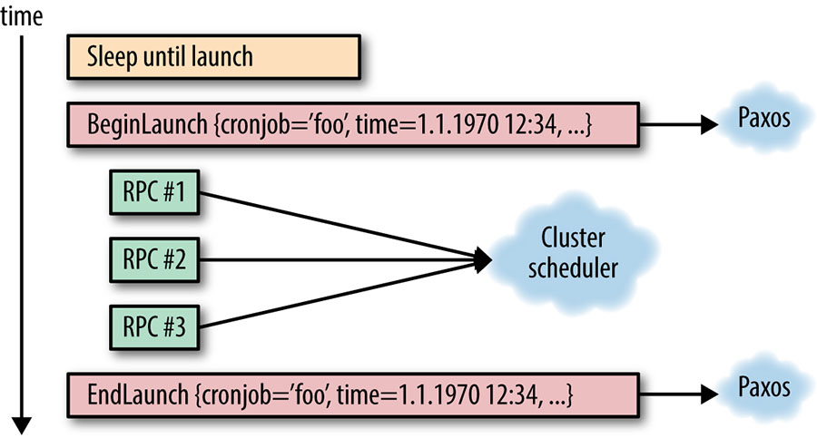
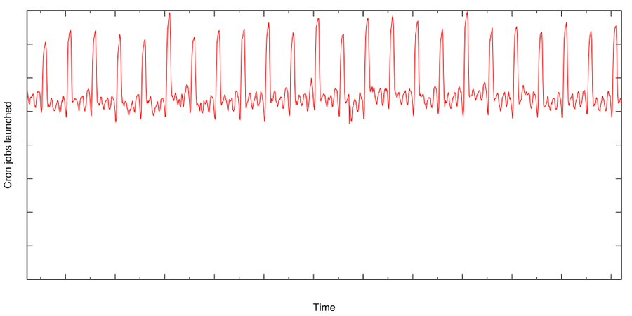

# Distributed Periodic Scheduling with Cron

Written by Štěpán Davidovič[^114]

Edited by Kavita Guliani

This chapter describes Google's implementation of a distributed cron service that serves the vast majority of internal teams that need periodic scheduling of compute jobs. Throughout cron's existence, we have learned many lessons about how to design and implement what might seem like a basic service. Here, we discuss the problems that distributed crons face and outline some potential solutions.

Cron is a common Unix utility designed to periodically launch arbitrary jobs at user-defined times or intervals. We first analyze the base principles of cron and its most common implementations, and then review how an application such as cron can work in a large, distributed environment in order to increase the reliability of the system against single-machine failures. We describe a distributed cron system that is deployed on a small number of machines, but can launch cron jobs across an entire datacenter in conjunction with a datacenter scheduling system like Borg [[Ver15]](/sre-book/bibliography#Ver15).

## Cron

Let's discuss how cron is typically used, in the single machine case, before diving into running it as a cross-datacenter service.

## Introduction

Cron is designed so that the system administrators and common users of the system can specify commands to run, and when these commands run. Cron executes various types of jobs, including garbage collection and periodic data analysis. The most common time specification format is called "crontab." This format supports simple intervals (e.g., "once a day at noon" or "every hour on the hour"). Complex intervals, such as "every Saturday, which is also the 30th day of the month," can also be configured.

Cron is usually implemented using a single component, which is commonly referred to as `crond`. `crond` is a daemon that loads the list of scheduled cron jobs. Jobs are launched according to their specified execution times.

## Reliability Perspective

Several aspects of the cron service are notable from a reliability perspective:

- Cron's failure domain is essentially just one machine. If the machine is not running, neither the cron scheduler nor the jobs it launches can run.[^115] Consider a very simple distributed case with two machines, in which your cron scheduler launches jobs on a different worker machine (for example, using SSH). This scenario presents two distinct failure domains that could impact our ability to launch jobs: either the scheduler machine or the destination machine could fail.
- The only state that needs to persist across `crond` restarts(including machine reboots) is the crontab configuration itself. The cron launches are fire-and-forget, and `crond` makes no attempt to track these launches.
- anacron is a notable exception to this. anacron attempts to launch jobs that would have been launched when the system was down. Relaunch attempts are limited to jobs that run daily or less frequently. This functionality is very useful for running maintenance jobs on workstations and notebooks, and is facilitated by a file that retains the timestamp of the last launch for all registered cron jobs.

# Cron Jobs and Idempotency

Cron jobs are designed to perform periodic work, but beyond that, it is hard to know in advance what function they have. The variety of requirements that the diverse set of cron jobs entails obviously impacts reliability requirements.

Some cron jobs, such as garbage collection processes, are idempotent. In case of system malfunction, it is safe to launch such jobs multiple times. Other cron jobs, such as a process that sends out an email newsletter to a wide distribution, should not be launched more than once.

To make matters more complicated, failure to launch is acceptable for some cron jobs but not for others. For example, a garbage collection cron job scheduled to run every five minutes may be able to skip one launch, but a payroll cron job scheduled to run once a month should not be skipped.

This large variety of cron jobs makes reasoning about failure modes difficult: in a system like the cron service, there is no single answer that fits every situation. In general, we favor skipping launches rather than risking double launches, as much as the infrastructure allows. This is because recovering from a skipped launch is more tenable than recovering from a double launch. Cron job owners can (and should!) monitor their cron jobs; for example, an owner might have the cron service expose state for its managed cron jobs, or set up independent monitoring of the effect of cron jobs. In case of a skipped launch, cron job owners can take action that appropriately matches the nature of the cron job. However, undoing a double launch, such as the previously mentioned newsletter example, may be difficult or even entirely impossible. Therefore, we prefer to "fail closed" to avoid systemically creating bad state.

# Cron at Large Scale

Moving away from single machines toward large-scale deployments requires some fundamental rethinking of how to make cron work well in such an environment. Before presenting the details of the Google cron solution, we'll discuss those differences between small-scale and large-scale deployment, and describe what design changes large-scale deployments necessitated.

## Extended Infrastructure

In its "regular" implementations, cron is limited to a single machine. Large-scale system deployments extend our cron solution to multiple machines.

Hosting your cron service on a single machine could be catastrophic in terms of reliability. Say this machine is located in a datacenter with exactly 1,000 machines. A failure of just 1/1000th of your available machines could knock out the entire cron service. For obvious reasons, this implementation is not acceptable.

To increase cron's reliability, we decouple processes from machines. If you want to run a service, simply specify the service requirements and which datacenter it should run in. The datacenter scheduling system (which itself should be reliable) determines the machine or machines on which to deploy your service, in addition to handling machine deaths. Launching a job in a datacenter then effectively turns into sending one or more RPCs to the datacenter scheduler.

This process is, however, not instantaneous. Discovering a dead machine entails health check timeouts, while rescheduling your service onto a different machine requires time to install software and start up the new process.

Because moving a process to a different machine can mean loss of any local state stored on the old machine (unless live migration is employed), and the rescheduling time may exceed the smallest scheduling interval of one minute, we need procedures in place to mitigate both data loss and excessive time requirements. To retain local state of the old machine, you might simply persist the state on a distributed filesystem such as GFS, and use this filesystem during startup to identify jobs that failed to launch due to rescheduling. However, this solution falls short in terms of timeliness expectations: if you run a cron job every five minutes, a one- to two-minute delay caused by the total overhead of cron system rescheduling is potentially unacceptably substantial. In this case, hot spares, which would be able to quickly jump in and resume operation, can significantly shorten this time window.

## Extended Requirements

Single-machine systems typically just colocate all running processes with limited isolation. While containers are now commonplace, it's not necessary or common to use containers to isolate every single component of a service that's deployed on a single machine. Therefore, if cron were deployed on a single machine, `crond` and all the cron jobs it runs would likely not be isolated.

Deployment at datacenter scale commonly means deployment into containers that enforce isolation. Isolation is necessary because the base expectation is that independent processes running in the same datacenter should not negatively impact each other. In order to enforce that expectation, you should know the quantity of resources you need to acquire up front for any given process you want to run—both for the cron system and the jobs it launches. A cron job may be delayed if the datacenter does not have resources available to match the demands of the cron job. Resource requirements, in addition to user demand for monitoring of cron job launches, means that we need to track the full state of our cron job launches, from the scheduled launch to termination.

Decoupling process launches from specific machines exposes the cron system to partial launch failure. The versatility of cron job configurations also means that launching a new cron job in a datacenter may need multiple RPCs, such that sometimes we encounter a scenario in which some RPCs succeeded but others did not (for example, because the process sending the RPCs died in the middle of executing these tasks). The cron recovery procedure must also account for this scenario.

In terms of the failure mode, a datacenter is a substantially more complex ecosystem than a single machine. The cron service that began as a relatively simple binary on a single machine now has many obvious and nonobvious dependencies when deployed at a larger scale. For a service as basic as cron, we want to ensure that even if the datacenter suffers a partial failure (for example, partial power outage or problems with storage services), the service is still able to function. By requiring that the datacenter scheduler locates replicas of cron in diverse locations within the datacenter, we avoid the scenario in which failure of a single power distribution unit takes out all the processes of the cron service.

It may be possible to deploy a single cron service across the globe, but deploying cron within a single datacenter has benefits: the service enjoys low latency and shares fate with the datacenter scheduler, cron's core dependency.

# Building Cron at Google

This section address the problems that must be resolved in order to provide a large-scale distributed deployment of cron reliably. It also highlights some important decisions made in regards to distributed cron at Google.

## Tracking the State of Cron Jobs

As discussed in previous sections, we need to hold some amount of state about cron jobs, and be able to restore that information quickly in case of failure. Moreover, the consistency of that state is paramount. Recall that many cron jobs, like a payroll run or sending an email newsletter, are not idempotent.

We have two options to track the state of cron jobs:

- Store data externally in generally available distributed storage
- Use a system that stores a small volume of state as part of the cron service itself

When designing the distributed cron, we chose the second option. We made this choice for several reasons:

- Distributed filesystems such as GFS or HDFS often cater to the use case of very large files (for example, the output of web crawling programs), whereas the information we need to store about cron jobs is very small. Small writes on a distributed filesystem are very expensive and come with high latency, because the filesystem is not optimized for these types of writes.
- Base services for which outages have wide impact (such as cron) should have very few dependencies. Even if parts of the datacenter go away, the cron service should be able to function for at least some amount of time. But this requirement does not mean that the storage has to be part of the cron process directly (how storage is handled is essentially an implementation detail). However, cron should be able to operate independently of downstream systems that cater to a large number of internal users.

## The Use of Paxos

We deploy multiple replicas of the cron service and use the [Paxos distributed consensus algorithm](../../sre-book/managing-critical-state/) (see [Managing Critical State: Distributed Consensus for Reliability](/sre-book/managing-critical-state/)) to ensure they have consistent state. As long as the majority of group members are available, the distributed system as a whole can successfully process new state changes despite the failure of bounded subsets of the infrastructure.

As shown in [Figure 24-1](#fig_reliable_cron_interactions), the distributed cron uses a single leader job, which is the only replica that can modify the shared state, as well as the only replica that can launch cron jobs. We take advantage of the fact that the variant of Paxos we use, Fast Paxos [[Lam06]](/sre-book/bibliography#Lam06), uses a leader replica internally as an optimization—the Fast Paxos leader replica also acts as the cron service leader.

*Figure 24-1. The interactions between distributed cron replicas*

If the leader replica dies, the health-checking mechanism of the Paxos group discovers this event quickly (within seconds). As another cron process is already started up and available, we can elect a new leader. As soon as the new leader is elected, we follow a leader election protocol specific to the cron service, which is responsible for taking over all the work left unfinished by the previous leader. The leader specific to the cron service is the same as the Paxos leader, but the cron service needs to take additional action upon promotion. The fast reaction time for the leader re-election allows us to stay well within a generally tolerable one-minute failover time.

The most important state we keep in Paxos is information regarding which cron jobs are launched. We synchronously inform a quorum of replicas of the beginning and end of each scheduled launch for each cron job.

## The Roles of the Leader and the Follower

As just described, our use of Paxos and its deployment in the cron service has two assigned roles: the leader and the follower. The following sections describe each role.

### The leader

The leader replica is the only replica that actively launches cron jobs. The leader has an internal scheduler that, much like the simple `crond` described at the beginning of this chapter, maintains the list of cron jobs ordered by their scheduled launch time. The leader replica waits until the scheduled launch time of the first job.

Upon reaching the scheduled launch time, the leader replica announces that it is about to start this particular cron job's launch, and calculates the new scheduled launch time, just like a regular `crond` implementation would. Of course, as with regular `crond`, a cron job launch specification may have changed since the last execution, and this launch specification must be kept in sync with the followers as well. Simply identifying the cron job is not enough: we should also uniquely identify the particular launch using the start time; otherwise, ambiguity in cron job launch tracking may occur. (Such ambiguity is especially likely in the case of high-frequency cron jobs, such as those running every minute.) As seen in [Figure 24-2](#fig_reliable_cron_job_launch), this communication is performed over Paxos.

It is important that Paxos communication remain synchronous, and that the actual cron job launch does not proceed until it receives confirmation that the Paxos quorum has received the launch notification. The cron service needs to understand whether each cron job has launched in order to decide the next course of action in case of leader failover. Not performing this task synchronously could mean that the entire cron job launch happens on the leader without informing the follower replicas. In case of failover, the follower replicas might attempt to perform the very same launch again because they aren't aware that the launch already occurred.

*Figure 24-2. Illustration of progress of a cron job launch, from the leader's perspective*

The completion of the cron job launch is announced via Paxos to the other replicas synchronously. Note that it does not matter whether the launch succeeded or failed for external reasons (for example, if the datacenter scheduler was unavailable). Here, we are simply keeping track of the fact that the cron service attempted the launch at the given scheduled time. We also need to be able to resolve failures of the cron system in the middle of this operation, as discussed in the following section.

Another extremely important feature of the leader is that as soon as it loses its leadership for any reason, it must immediately stop interacting with the datacenter scheduler. Holding the leadership should guarantee mutual exclusion of access to the datacenter scheduler. In the absence of this condition of mutual exclusion, the old and new leaders might perform conflicting actions on the datacenter scheduler.

### The follower

The follower replicas keep track of the state of the world, as provided by the leader, in order to take over at a moment's notice if needed. All the state changes tracked by follower replicas are communicated via Paxos, from the leader replica. Much like the leader, followers also maintain a list of all cron jobs in the system, and this list must be kept consistent among the replicas (through the use of Paxos).

Upon receiving notification about a commenced launch, the follower replica updates its local next scheduled launch time for the given cron job. This very important state change (which is performed synchronously) ensures that all cron job schedules within the system are consistent. We keep track of all open launches (launches that have begun but not completed).

If a leader replica dies or otherwise malfunctions (e.g., is partitioned away from the other replicas on the network), a follower should be elected as a new leader. The election must converge faster than one minute, in order to avoid the risk of missing or unreasonably delaying a cron job launch. Once a leader is elected, all open launches (i.e., partial failures) must be concluded. This process can be quite complicated, imposing additional requirements on both the cron system and the datacenter infrastructure. The following section discusses how to resolve partial failures of this type.

### Resolving partial failures

As mentioned, the interaction between the leader replica and the datacenter scheduler can fail in between sending multiple RPCs that describe a single logical cron job launch. Our systems should be able to handle this condition.

Recall that every cron job launch has two synchronization points:

- When we are about to perform the launch
- When we have finished the launch

These two points allow us to delimit the launch. Even if the launch consists of a single RPC, how do we know if the RPC was actually sent? Consider the case in which we know that the scheduled launch started, but we were not notified of its completion before the leader replica died.

In order to determine if the RPC was actually sent, one of the following conditions must be met:

- All operations on external systems, which we may need to continue upon re-election, must be idempotent (i.e., we can safely perform the operations again)
- We must be able to look up the state of all operations on external systems in order to unambiguously determine whether they completed or not

Each of these conditions imposes significant constraints, and may be difficult to implement, but being able to meet at least one of these conditions is fundamental to the accurate operation of a cron service in a distributed environment that could suffer a single or several partial failures. Not handling this appropriately can lead to missed launches or double launch of the same cron job.

Most infrastructure that launches logical jobs in datacenters (Mesos, for example) provides naming for those datacenter jobs, making it possible to look up the state of jobs, stop the jobs, or perform other maintenance. A reasonable solution to the idempotency problem is to construct job names ahead of time (thereby avoiding causing any mutating operations on the datacenter scheduler), and then distribute the names to all replicas of your cron service. If the cron service leader dies during launch, the new leader simply looks up the state of all the precomputed names and launches the missing names.

Note that, similar to our method of identifying individual cron job launches by their name and launch time, it is important that the constructed job names on the datacenter scheduler include the particular scheduled launch time (or have this information otherwise retrievable). In regular operation, the cron service should fail over quickly in case of leader failure, but a quick failover doesn't always happen.

Recall that we track the scheduled launch time when keeping the internal state between the replicas. Similarly, we need to disambiguate our interaction with the datacenter scheduler, also by using the scheduled launch time. For example, consider a short-lived but frequently run cron job. The cron job launches, but before the launch is communicated to all replicas, the leader crashes and an unusually long failover—long enough that the cron job finishes successfully—takes place. The new leader looks up the state of the cron job, observes its completion, and attempts to launch the job again. Had the launch time been included, the new leader would know that the job on the datacenter scheduler is the result of this particular cron job launch, and this double launch would not have happened.

The actual implementation has a more complicated system for state lookup, driven by the implementation details of the underlying infrastructure. However, the preceding description covers the implementation-independent requirements of any such system. Depending on the available infrastructure, you may also need to consider the trade-off between risking a double launch and risking skipping a launch.

## Storing the State

Using Paxos to achieve consensus is only one part of the problem of how to handle the state. Paxos is essentially a continuous log of state changes, appended to synchronously as state changes occur. This characteristic of Paxos has two implications:

- The log needs to be compacted, to prevent it from growing infinitely
- The log itself must be stored somewhere

In order to prevent the infinite growth of the Paxos log, we can simply take a snapshot of the current state, which means that we can reconstruct the state without needing to replay all state change log entries leading to the current state. To provide an example: if our state changes stored in logs are "Increment a counter by 1," then after a thousand iterations, we have a thousand log entries that can be easily changed to a snapshot of "Set counter to 1,000."

In case of lost logs, we only lose the state since the last snapshot. Snapshots are in fact our most critical state—if we lose our snapshots, we essentially have to start from zero again because we've lost our internal state. Losing logs, on the other hand, just causes a bounded loss of state and sends the cron system back in time to the point when the latest snapshot was taken.

We have two main options for storing our data:

- Externally in a generally available distributed storage
- In a system that stores the small volume of state as part of the cron service itself

When designing the system, we combined elements of both options.

We store Paxos logs on local disk of the machine where cron service replicas are scheduled. Having three replicas in default operation implies that we have three copies of the logs. We store the snapshots on local disk as well. However, because they are critical, we also back them up onto a distributed filesystem, thus protecting against failures affecting all three machines.

We do not store logs on our distributed filesystem. We consciously decided that losing logs, which represent a small amount of the most recent state changes, is an acceptable risk. Storing logs on a distributed filesystem can entail a substantial performance penalty caused by frequent small writes. The simultaneous loss of all three machines is unlikely, and if simultaneous loss does occur, we automatically restore from the snapshot. We thereby lose only a small amount of logs: those taken since the last snapshot, which we perform on configurable intervals. Of course, these trade-offs may be different depending on the details of the infrastructure, as well as the requirements placed on the cron system.

In addition to the logs and snapshots stored on the local disk and snapshot backups on the distributed filesystem, a freshly started replica can fetch the state snapshot and all logs from an already running replica over the network. This ability makes replica startup independent of any state on the local machine. Therefore, rescheduling a replica to a different machine upon restart (or machine death) is essentially a nonissue for the reliability of the service.

## Running Large Cron

There are other smaller but equally interesting implications of running a large cron deployment. A traditional cron is small: at most, it probably contains on the order of tens of cron jobs. However, if you run a cron service for thousands of machines in a datacenter, your usage will grow, and you may run into problems.

Beware the large and well-known problem of distributed systems: the thundering herd. Based on user configuration, the cron service can cause substantial spikes in datacenter usage. When people think of a "daily cron job," they commonly configure this job to run at midnight. This setup works just fine if the cron job launches on the same machine, but what if your cron job can spawn a MapReduce with thousands of workers? And what if 30 different teams decide to run a daily cron job like this, in the same datacenter? To solve this problem, we introduced an extension to the crontab format.

In the ordinary crontab, users specify the minute, hour, day of the month (or week), and month when the cron job should launch, or asterisk to specify any value. Running at midnight, daily, would then have crontab specification of `"0 0 * * *"` (i.e., zero-th minute, zero-th hour, every day of the week, every month, and every day of the week). We also introduced the use of the question mark, which means that any value is acceptable, and the cron system is given the freedom to choose the value. Users choose this value by hashing the cron job configuration over the given time range (e.g., `0..23` for hour), therefore distributing those launches more evenly.

Despite this change, the load caused by the cron jobs is still very spiky. The graph in [Figure 24-3](#fig_reliable_cron_job_launches) illustrates the aggregate global number of launches of cron jobs at Google. This graph highlights the frequent spikes in cron job launches, which is often caused by cron jobs that need to be launched at a specific time—for example, due to temporal dependency on external events.

*Figure 24-3. The number of cron jobs launched globally*

# Summary

A cron service has been a fundamental feature in UNIX systems for many decades. The industry move toward large distributed systems, in which a datacenter may be the smallest effective unit of hardware, requires changes in large portions of the stack. Cron is no exception to this trend. A careful look at the required properties of a cron service and the requirements of cron jobs drives Google's new design.

We have discussed the new constraints demanded by a distributed-system environment, and a possible design of the cron service based on Google's solution. This solution requires strong consistency guarantees in the distributed environment. The core of the distributed cron implementation is therefore Paxos, a commonplace algorithm to reach consensus in an unreliable environment. The use of Paxos and correct analysis of new failure modes of cron jobs in a large-scale, distributed environment allowed us to build a robust cron service that is heavily used in Google.

[^114]This chapter was previously published in part in *ACM Queue* (March 2015, vol. 13, issue 3).

[^115]Failure of individual jobs is beyond the scope of this analysis.
