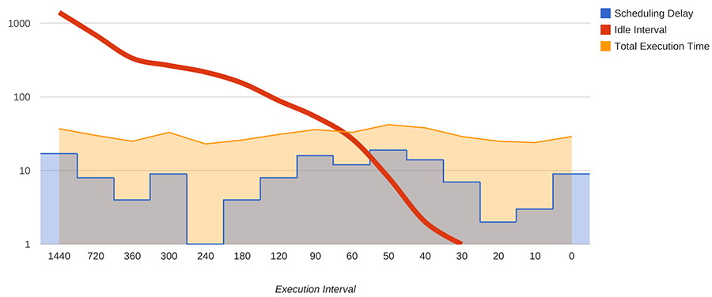
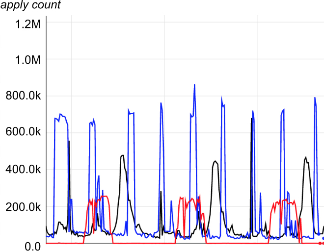
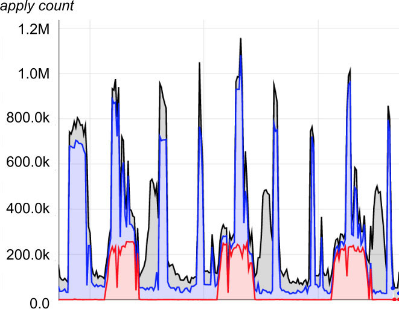
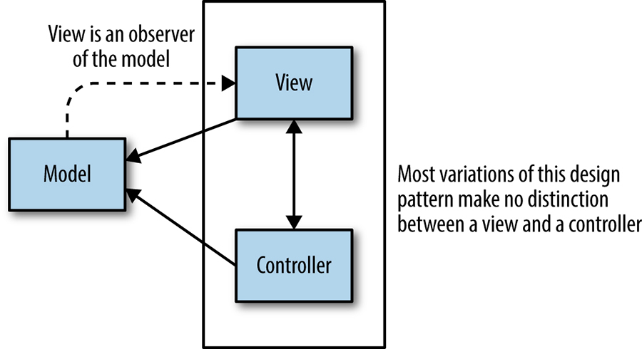
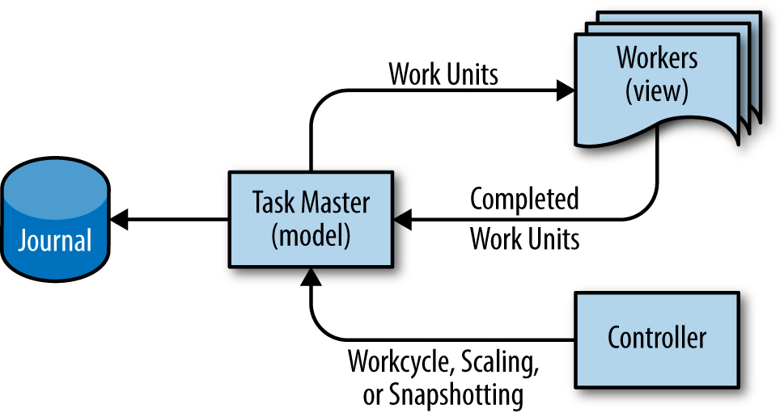
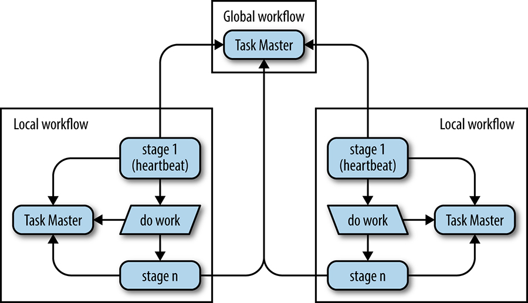

# Data Processing Pipelines

Written by Dan DennisonEdited by Tim Harvey

This chapter focuses on the real-life challenges of managing data processing pipelines of depth and complexity. It considers the frequency continuum between periodic pipelines that run very infrequently through to continuous pipelines that never stop running, and discusses the discontinuities that can produce significant operational problems. A fresh take on the leader-follower model is presented as a more reliable and better-scaling alternative to the periodic pipeline for processing Big Data.

## Origin of the Pipeline Design Pattern

The classic approach to data processing is to write a program that reads in data, transforms it in some desired way, and outputs new data. Typically, the program is scheduled to run under the control of a [periodic scheduling program](https://sre.google/sre-book/distributed-periodic-scheduling/) such as cron. This design pattern is called a *data pipeline*. Data pipelines go as far back as co-routines [[Con63]](/sre-book/bibliography/#Con63), the DTSS communication files [[Bul80]](/sre-book/bibliography/#Bul80), the UNIX pipe [[McI86]](/sre-book/bibliography/#McI86), and later, ETL pipelines,[^116] but such pipelines have gained increased attention with the rise of "Big Data," or "datasets that are so large and so complex that traditional data processing applications are inadequate."[^117]

## Initial Effect of Big Data on the Simple Pipeline Pattern

Programs that perform periodic or continuous transformations on Big Data are usually referred to as "simple, one-phase pipelines."

Given the scale and processing complexity inherent to Big Data, programs are typically organized into a chained series, with the output of one program becoming the input to the next. There may be varied rationales for this arrangement, but it is typically designed for ease of reasoning about the system and not usually geared toward operational efficiency. Programs organized this way are called *multiphase pipelines*, because each program in the chain acts as a discrete data processing phase.

The number of programs chained together in series is a measurement known as the *depth* of a pipeline. Thus, a shallow pipeline may only have one program with a corresponding pipeline depth measurement of one, whereas a deep pipeline may have a pipeline depth in the tens or hundreds of programs.

## Challenges with the Periodic Pipeline Pattern

Periodic pipelines are generally stable when there are sufficient workers for the volume of data and execution demand is within computational capacity. In addition, instabilities such as processing bottlenecks are avoided when the number of chained jobs and the relative throughput between jobs remain uniform.

Periodic pipelines are useful and practical, and we run them on a regular basis at Google. They are written with frameworks like MapReduce [[Dea04]](/sre-book/bibliography/#Dea04) and Flume [[Cha10]](/sre-book/bibliography/#Cha10), among others.

However, the collective SRE experience has been that the periodic pipeline model is fragile. We discovered that when a periodic pipeline is first installed with worker sizing, periodicity, chunking technique, and other parameters carefully tuned, performance is initially reliable. However, organic growth and change inevitably begin to stress the system, and problems arise. Examples of such problems include jobs that exceed their run deadline, resource exhaustion, and hanging processing chunks that entail corresponding operational load.

## Trouble Caused By Uneven Work Distribution

The key breakthrough of Big Data is the widespread application of "embarrassingly parallel" [[Mol86]](/sre-book/bibliography/#Mol86) algorithms to cut a large workload into chunks small enough to fit onto individual machines. Sometimes chunks require an uneven amount of resources relative to one another, and it is seldom initially obvious why particular chunks require different amounts of resources. For example, in a workload that is partitioned by customer, data chunks for some customers may be much larger than others. Because the customer is the point of indivisibility, end-to-end runtime is thus capped to the runtime of the largest customer.

The "hanging chunk" problem can result when resources are assigned due to differences between machines in a cluster or overallocation to a job. This problem arises due to the difficulty of some real-time operations on streams such as sorting "steaming" data. The pattern of typical user code is to wait for the total computation to complete before progressing to the next pipeline stage, commonly because sorting may be involved, which requires all data to proceed. That can significantly delay pipeline completion time, because completion is blocked on the worst-case performance as dictated by the chunking methodology in use.

If this problem is detected by engineers or cluster monitoring infrastructure, the response can make matters worse. For example, the "sensible" or "default" response to a hanging chunk is to immediately kill the job and then allow the job to restart, because the blockage may well be the result of nondeterministic factors. However, because pipeline implementations by design usually don’t include checkpointing, work on all chunks is restarted from the beginning, thereby wasting the time, CPU cycles, and human effort invested in the previous cycle.

## Drawbacks of Periodic Pipelines in Distributed Environments

Big Data periodic pipelines are widely used at Google, and so Google’s cluster management solution includes an alternative scheduling mechanism for such pipelines. This mechanism is necessary because, unlike continuously running pipelines, periodic pipelines typically run as lower-priority batch jobs. A lower-priority designation works well in this case because batch work is not sensitive to latency in the same way that Internet-facing web services are. In addition, in order to control cost by maximizing machine workload, Borg (Google’s cluster management system, [[Ver15]](/sre-book/bibliography/#Ver15)) assigns batch work to available machines. This priority can result in degraded startup latency, so pipeline jobs can potentially experience open-ended startup delays.

Jobs invoked through this mechanism have a number of natural limitations, resulting in various distinct behaviors. For example, jobs scheduled in the gaps left by user-facing web service jobs might be impacted in terms of availability of low-latency resources, pricing, and stability of access to resources. Execution cost is inversely proportional to requested startup delay, and directly proportional to resources consumed. Although batch scheduling may work smoothly in practice, excessive use of the batch scheduler ([Distributed Periodic Scheduling with Cron](/sre-book/distributed-periodic-scheduling/)) places jobs at risk of preemptions (see section 2.5 of [[Ver15]](/sre-book/bibliography/#Ver15)) when cluster load is high because other users are starved of batch resources. In light of the risk trade-offs, running a well-tuned periodic pipeline successfully is a delicate balance between high resource cost and risk of preemptions.

Delays of up to a few hours might well be acceptable for pipelines that run daily. However, as the scheduled execution frequency increases, the minimum time between executions can quickly reach the minimum average delay point, placing a lower bound on the latency that a periodic pipeline can expect to attain. Reducing the job execution interval below this effective lower bound simply results in undesirable behavior rather than increased progress. The specific failure mode depends on the batch scheduling policy in use. For example, each new run might stack up on the cluster scheduler because the previous run is not complete. Even worse, the currently executing and nearly finished run could be killed when the next execution is scheduled to begin, completely halting all progress in the name of increasing executions.

Note where the downward-sloping idle interval line intersects the scheduling delay in [Figure 25-1](#fig_continuous-pipelines_periodic-pipeline-execution). In this scenario, lowering the execution interval much below 40 minutes for this ~20-minute job results in potentially overlapping executions with undesired consequences.

*Figure 25-1. Periodic pipeline execution interval versus idle time (log scale)*

The solution to this problem is to secure sufficient server capacity for proper operation. However, resource acquisition in a shared, distributed environment is subject to supply and demand. As expected, development teams tend to be reluctant to go through the processes of acquiring resources when the resources must be contributed to a common pool and shared. To resolve this, a distinction between batch scheduling resources versus production priority resources has to be made to rationalize resource acquisition costs.

### Monitoring Problems in Periodic Pipelines

For pipelines of sufficient execution duration, having real-time information on runtime performance metrics can be as important, if not even more important, than knowing overall metrics. This is because real-time data is important to providing operational support, including emergency response. In practice, the standard monitoring model involves collecting metrics during job execution, and reporting metrics only upon completion. If the job fails during execution, no statistics are provided.

Continuous pipelines do not share these problems because their tasks are constantly running and their telemetry is routinely designed so that real-time metrics are available. Periodic pipelines shouldn’t have inherent monitoring problems, but we have observed a strong association.

### "Thundering Herd" Problems

Adding to execution and monitoring challenges is the "thundering herd" problem endemic to distributed systems, also discussed in [Distributed Periodic Scheduling with Cron](/sre-book/distributed-periodic-scheduling/). Given a large enough periodic pipeline, for each cycle, potentially thousands of workers immediately start work. If there are too many workers or if the workers are misconfigured or invoked by faulty retry logic, the servers on which they run will be overwhelmed, as will the underlying shared cluster services, and any networking infrastructure that was being used will also be overwhelmed.

Further worsening this situation, if retry logic is not implemented, correctness problems can result when work is dropped upon failure, and the job won’t be retried. If retry logic is present but it is naive or poorly implemented, retry upon failure can compound the problem.

Human intervention can also contribute to this scenario. Engineers with limited experience managing pipelines tend to amplify this problem by adding more workers to their pipeline when the job fails to complete within a desired period of time.

Regardless of the source of the "thundering herd" problem, nothing is harder on cluster infrastructure and the SREs responsible for a cluster’s various services than a buggy 10,000 worker pipeline job.

### Moiré Load Pattern

Sometimes the thundering herd problem may not be obvious to spot in isolation. A related problem we call "Moiré load pattern" occurs when two or more pipelines run simultaneously and their execution sequences occasionally overlap, causing them to simultaneously consume a common shared resource. This problem can occur even in continuous pipelines, although it is less common when load arrives more evenly.

Moiré load patterns are most apparent in plots of pipeline usage of shared resources. For example, [Figure 25-2](#fig_continuous-pipelines_moire-load-pattern) identifies the resource usage of three periodic pipelines. In [Figure 25-3](#fig_continuous-pipelines_moire-load-pattern-shared), which is a stacked version of the data of the previous graph, the peak impact causing on-call pain occurs when the aggregate load nears 1.2M.

*Figure 25-2. Moiré load pattern in separate infrastructure*

*Figure 25-3. Moiré load pattern in shared infrastructure*

## Introduction to Google Workflow

When an inherently one-shot batch pipeline is overwhelmed by business demands for continuously updated results, the pipeline development team usually considers either refactoring the original design to satisfy current demands, or moving to a continuous pipeline model. Unfortunately, business demands usually occur at the least convenient time to refactor the pipeline system into an online continuous processing system. Newer and larger customers who are faced with forcing scaling issues typically also want to include new features, and expect that these requirements adhere to immovable deadlines. In anticipating this challenge, it’s important to ascertain several details at the outset of designing a system involving a proposed data pipeline. Be sure to scope expected growth trajectory,[^118] demand for design modifications, expected additional resources, and expected latency requirements from the business.

Faced with these needs, Google developed a system in 2003 called "Workflow" that makes continuous processing available at scale. Workflow uses the leader-follower (workers) distributed systems design pattern [[Sha00]](/sre-book/bibliography/#Sha00) and the system prevalence design pattern.[^119] This combination enables very large-scale transactional [data pipelines](https://sre.google/workbook/data-processing/), ensuring correctness with exactly-once semantics.

### Workflow as Model-View-Controller Pattern

Because of how system prevalence works, it can be useful to think of Workflow as the distributed systems equivalent of the model-view-controller pattern known from user interface development.[^120] As shown in [Figure 25-4](#fig_continuous-pipelines_model-view-controller-ui), this design pattern divides a given software application into three interconnected parts to separate internal representations of information from the ways that information is presented to or accepted from the user.[^121]

*Figure 25-4. The model-view-controller pattern used in user interface design*

Adapting this pattern for Workflow, the *model* is held in a server called "Task Master." The Task Master uses the system prevalence pattern to hold all job states in memory for fast availability while synchronously journaling mutations to persistent disk. The *view* is the workers that continually update the system state transactionally with the master according to their perspective as a subcomponent of the pipeline. Although all pipeline data may be stored in the Task Master, the best performance is usually achieved when only pointers to work are stored in the Task Master, and the actual input and output data is stored in a common filesystem or other storage. Supporting this analogy, the workers are completely stateless and can be discarded at any time. A *controller* can optionally be added as a third system component to efficiently support a number of auxiliary system activities that affect the pipeline, such as runtime scaling of the pipeline, snapshotting, workcycle state control, rolling back pipeline state, or even performing global interdiction for business continuity. [Figure 25-5](#fig_continuous-pipelines_model-view-controller-workflow) illustrates the design pattern.

*Figure 25-5. The model-view-controller design pattern as adapted for Google Workflow*

## Stages of Execution in Workflow

We can increase pipeline depth to any level inside Workflow by subdividing processing into task groups held in the Task Master. Each task group holds the work corresponding to a pipeline stage that can perform arbitrary operations on some piece of data. It’s relatively straightforward to perform mapping, shuffling, sorting, splitting, merging, or any other operation in any stage.

A stage usually has some worker type associated with it. There can be multiple concurrent instances of a given worker type, and workers can be self-scheduled in the sense that they can look for different types of work and choose which type to perform.

The worker consumes work units from a previous stage and produces output units. The output can be an end point or input for some other processing stage. Within the system, it’s easy to guarantee that all work is executed, or at least reflected in permanent state, exactly once.

### Workflow Correctness Guarantees

It’s not practical to store *every* detail of the pipeline’s state inside the Task Master, because the Task Master is limited by RAM size. However, a double correctness guarantee persists because the master holds a collection of pointers to uniquely named data, and each work unit has a uniquely held lease. Workers acquire work with a lease and may only commit work from tasks for which they currently possess a valid lease.

To avoid the situation in which an orphaned worker may continue working on a work unit, thus destroying the work of the current worker, each output file opened by a worker has a unique name. In this way, even orphaned workers can continue writing independently of the master until they attempt to commit. Upon attempting a commit, they will be unable to do so because another worker holds the lease for that work unit. Furthermore, orphaned workers cannot destroy the work produced by a valid worker, because the unique filename scheme ensures that every worker is writing to a distinct file. In this way, the double correctness guarantee holds: the output files are always unique, and the pipeline state is always correct by virtue of tasks with leases.

As if a double correctness guarantee isn’t enough, Workflow also versions all tasks. If the task updates or the task lease changes, each operation yields a new unique task replacing the previous one, with a new ID assigned to the task. Because all pipeline configuration in Workflow is stored inside the Task Master in the same form as the work units themselves, in order to commit work, a worker must own an active lease *and* reference the task ID number of the configuration it used to produce its result. If the configuration changed while the work unit was in flight, all workers of that type will be unable to commit despite owning current leases. Thus, all work performed after a configuration change is consistent with the new configuration, at the cost of work being thrown away by workers unfortunate enough to hold the old leases.

These measures provide a triple correctness guarantee: configuration, lease ownership, and filename uniqueness. However, even this isn’t sufficient for all cases.

For example, what if the Task Master’s network address changed, and a different Task Master replaced it at the same address? What if a memory corruption altered the IP address or port number, resulting in another Task Master on the other end? Even more commonly, what if someone (mis)configured their Task Master setup by inserting a load balancer in front of a set of independent Task Masters?

Workflow embeds a server token, a unique identifier for this particular Task Master, in each task’s metadata to prevent a rogue or incorrectly configured Task Master from corrupting the pipeline. Both client and server check the token on each operation, avoiding a very subtle misconfiguration in which all operations run smoothly until a task identifier collision occurs.

To summarize, the four Workflow correctness guarantees are:

- Worker output through configuration tasks creates barriers on which to predicate work.
- All work committed requires a currently valid lease held by the worker.
- Output files are uniquely named by the workers.
- The client and server validate the Task Master itself by checking a server token on every operation.

At this point, it may occur to you that it would be simpler to forgo the specialized Task Master and use Spanner [[Cor12]](/sre-book/bibliography/#Cor12) or another database. However, Workflow is special because each task is unique and immutable. These twin properties prevent many potentially subtle issues with wide-scale work distribution from occurring.

For example, the lease obtained by the worker is part of the task itself, requiring a brand new task even for lease changes. If a database is used directly and its transaction logs act like a "journal," each and every read must be part of a long-running transaction. This configuration is most certainly possible, but terribly inefficient.

## Ensuring Business Continuity

Big Data pipelines need to continue processing despite failures of all types, including fiber cuts, weather events, and cascading power grid failures. These types of failures can disable entire datacenters. In addition, pipelines that do not employ system prevalence to obtain strong guarantees about job completion are often disabled and enter an undefined state. This architecture gap makes for a brittle business continuity strategy, and entails costly mass duplication of effort to restore pipelines and data.

Workflow resolves this problem conclusively for continuous processing pipelines. To obtain global consistency, the Task Master stores journals on Spanner, using it as a globally available, globally consistent, but low-throughput filesystem. To determine which Task Master can write, each Task Master uses the distributed lock service called Chubby [[Bur06]](/sre-book/bibliography/#Bur06) to elect the writer, and the result is persisted in Spanner. Finally, clients look up the current Task Master using internal naming services.

Because Spanner does not make for a high-throughput filesystem, globally distributed Workflows employ two or more local Workflows running in distinct clusters, in addition to a notion of reference tasks stored in the global Workflow. As units of work (tasks) are consumed through a pipeline, equivalent reference tasks are inserted into the global Workflow by the binary labeled "stage 1" in [Figure 25-6](#fig_continuous-pipelines_distributed-data-flow). As tasks finish, the reference tasks are transactionally removed from the global Workflow as depicted in "stage n" of [Figure 25-6](#fig_continuous-pipelines_distributed-data-flow). If the tasks cannot be removed from the global Workflow, the local Workflow will block until the global Workflow becomes available again, ensuring transactional correctness.

To automate failover, a helper binary labeled "stage 1" in [Figure 25-6](#fig_continuous-pipelines_distributed-data-flow) runs inside each local Workflow. The local Workflow is otherwise unaltered, as described by the "do work" box in the diagram. This helper binary acts as a "controller" in the MVC sense, and is responsible for creating reference tasks, as well as updating a special heartbeat task inside of the global Workflow. If the heartbeat task is not updated within the timeout period, the remote Workflow’s helper binary seizes the work in progress as documented by the reference tasks and the pipeline continues, unhindered by whatever the environment may do to the work.

*Figure 25-6. An example of distributed data and process flow using Workflow pipelines*

## Summary and Concluding Remarks

Periodic pipelines are valuable. However, if a data processing problem is continuous or will organically grow to become continuous, don’t use a periodic pipeline. Instead, use a technology with characteristics similar to Workflow.

We have found that continuous data processing with strong guarantees, as provided by Workflow, performs and scales well on distributed cluster infrastructure, routinely produces results that users can rely upon, and is a stable and reliable system for the Site Reliability Engineering team to manage and maintain.

[^116]: Wikipedia: Extract, transform, load, https://en.wikipedia.org/wiki/Extract,_transform,_load

[^117]: Wikipedia: Big data, https://en.wikipedia.org/wiki/Big_data

[^118]: Jeff Dean’s lecture on "Software Engineering Advice from Building Large-Scale Distributed Systems" is an excellent resource: [Dea07].

[^119]: Wikipedia: System Prevalence, https://en.wikipedia.org/wiki/System_Prevalence

[^120]: The "model-view-controller" pattern is an analogy for distributed systems that was very loosely borrowed from Smalltalk, which was originally used to describe the design structure of graphical user interfaces [Fow08].

[^121]: Wikipedia: Model-view-controller, https://en.wikipedia.org/wiki/Model%E2%80%93view%E2%80%93controller
