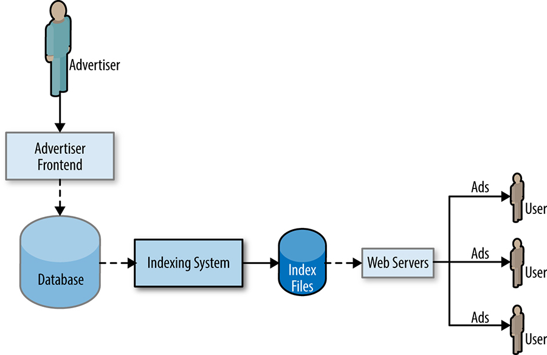

# Communication and Collaboration in SRE

Written by Niall Murphy with Alex Rodriguez, Carl Crous, Dario Freni, Dylan Curley, Lorenzo Blanco, and Todd Underwood  
Edited by Betsy Beyer

The organizational position of SRE in Google is interesting, and has effects on how we communicate and collaborate.

To begin with, there is a tremendous diversity in what SRE does, and how we do it. We have infrastructural teams, service teams, and horizontal product teams. We have relationships with product development teams ranging from teams that are many times our size, to teams roughly the same size as their counterparts, and situations in which we *are* the product development team. SRE teams are made up of people with systems engineering or architectural skills (see [[Hix15b]](/sre-book/bibliography#Hix15b)), software engineering skills, project management skills, leadership instincts, backgrounds in all kinds of industries (see [Lessons Learned from Other Industries](/sre-book/lessons-learned/)), and so on. We don't have just one model, and we have found a variety of configurations that work; this flexibility suits our ultimately pragmatic nature.

It's also true that SRE is not a command-and-control organization. Generally, we owe allegiance to at least two masters: for service or infrastructure [SRE teams](../../sre-book/part-II-principles/), we work closely with the corresponding product development teams that work on those services or that infrastructure; we also obviously work in the context of SRE generally. The service relationship is very strong, since we are held accountable for the performance of those systems, but despite that relationship, our actual reporting lines are through SRE as a whole. Today, we spend more time supporting our individual services than on cross-production work, but our culture and our shared values produce strongly homogeneous approaches to problems. This is by design.[^146]

The two preceding facts have steered the SRE organization in certain directions when it comes to two crucial dimensions of how our teams operate—communications and collaboration. Data flow would be an apt computing metaphor for our communications: just like data must flow around production, data also has to flow around an SRE team—data about projects, the state of the services, production, and the state of the individuals. For maximum effectiveness of a team, the data has to flow in reliable ways from one interested party to another. One way to think of this flow is to think of the interface that an SRE team must present to other teams, such as an API. Just like an API, a good design is crucial for effective operation, and if the API is wrong, it can be painful to correct later on.

The API-as-contract metaphor is also relevant for collaboration, both among SRE teams, and between SRE and product development teams—all have to make progress in an environment of unrelenting change. To that extent, our collaboration looks quite like collaboration in any other fast-moving company. The difference is the mix of software engineering skills, systems engineering expertise, and the wisdom of production experience that SRE brings to bear on that collaboration. The best designs and the best implementations result from the joint concerns of production and the product being met in an atmosphere of mutual respect. This is the promise of SRE: an organization charged with reliability, with the same skills as the product development teams, will improve things measurably. Our experience suggests that simply having someone in charge of reliability, without also having the complete skill set, is not enough.

## Communications: Production Meetings

Although literature about running effective meetings abounds [[Kra08]](/sre-book/bibliography#Kra08), it's difficult to find someone who's lucky enough to *only* have useful, effective meetings. This is equally true for SRE.

However, there's one kind of meeting that we have that is more useful than the average, called a *production meeting*. Production meetings are a special kind of meeting where an SRE team carefully articulates to itself—and to its invitees—the state of the service(s) in their charge, so as to increase general awareness among everyone who cares, and to improve the operation of the service(s). In general, these meetings are *service-oriented*; they are not directly about the status updates of individuals. The goal is for everyone to leave the meeting with an idea of what's going on—the *same* idea. The other major goal of production meetings is to improve our services by bringing the wisdom of production to bear on our services. That means we talk in detail about the operational performance of the service, and relate that operational performance to design, configuration, or implementation, and make recommendations for how to fix the problems. Connecting the performance of the service with design decisions in a regular meeting is an immensely powerful feedback loop.

Our production meetings usually happen weekly; given SRE's antipathy to pointless meetings, this frequency seems to be just about right: time to allow enough relevant material to accumulate to make the meeting worthwhile, while not so frequent that people find excuses to not attend. They usually last somewhere between 30 and 60 minutes. Any less and you're probably cutting something unnecessarily short, or you should probably be growing your service portfolio. Any more and you're probably getting mired in the detail, or you've got too much to talk about and you should shard the team or service set.

Just like any other meeting, the production meeting should have a chair. Many SRE teams rotate the chair through various team members, which has the advantage of making everyone feel they have a stake in the service and some notional ownership of the issues. It's true that not everyone has equal levels of chairing skill, but the value of group ownership is so large that the trade-off of temporary suboptimality is worthwhile. Furthermore, this is a chance to instill chairing skills, which are very useful in the kind of incident coordination situations commonly faced by SRE.

In cases where two SRE teams are meeting by video, and one of the teams is much larger than the other, we have noticed an interesting dynamic at play. We recommend placing your chair on the *smaller* side of the call by default. The larger side naturally tends to quiet down and some of the bad effects of imbalanced team sizes (made worse by the delays inherent in video conferencing) will improve.[^147] We have no idea if this technique has any scientific basis, but it does tend to work.

### Agenda

There are many ways to run a production meeting, attesting to the diversity of what SRE looks after and how we do it. To that extent, it's not appropriate to be prescriptive on how to run one of these meetings. However, a default agenda (see [Example Production Meeting Minutes](/sre-book/production-meeting/) for an example) might look something like the following:

Upcoming production changes  
Change-tracking meetings are well known throughout the industry, and indeed whole meetings have often been devoted to stopping change. However, in our production environment, we usually default to enabling change, which requires tracking the useful set of properties of that change: start time, duration, expected effect, and so on. This is near-term horizon visibility.

<!-- -->

Metrics  
One of the major ways we conduct a service-oriented discussion is by talking about the core metrics of the systems in question; see [Service Level Objectives](/sre-book/service-level-objectives/). Even if the systems didn't dramatically fail that week, it's very common to be in a position where you're looking at gradually (or sharply!) increasing load throughout the year. Keeping track of how your latency figures, CPU utilization figures, etc., change over time is incredibly valuable for developing a feeling for the performance envelope of a system.

Some teams track resource usage and efficiency, which is also a useful indicator of slower, perhaps more insidious system changes.

Outages  
This item addresses problems of approximately postmortem size, and is an indispensable opportunity for learning. A good postmortem analysis, as discussed in [Postmortem Culture: Learning from Failure](/sre-book/postmortem-culture/), should always set the juices flowing.

Paging events  
These are pages from your monitoring system, relating to problems that *can* be postmortem worthy, but often aren't. In any event, while the Outages portion looks at the larger picture of an outage, this section looks at the tactical view: the list of pages, who was paged, what happened then, and so on. There are two implicit questions for this section: should that alert have paged in the way it did, and should it have paged at all? If the answer to the last question is no, remove those unactionable pages.

Nonpaging events  
This bucket contains three items:

- *An issue that probably should have paged, but didn't*. In these cases, you should probably fix the monitoring so that such events do trigger a page. Often you encounter the issue while you're trying to fix something else, or it's related to a metric you're tracking but for which you haven't got an alert.
- *An issue that is not pageable but requires attention*, such as low-impact data corruption or slowness in some non-user-facing dimension of the system. Tracking reactive operational work is also appropriate here.
- *An issue that is not pageable and does not require attention*. These alerts should be removed, because they create extra noise that distracts engineers from issues that do merit attention.

<!-- -->

Prior action items  
The preceding detailed discussions often lead to actions that SRE needs to take—fix this, monitor that, develop a subsystem to do the other. Track these improvements just as they would be tracked in any other meeting: assign action items to people and track their progress. It's a good idea to have an explicit agenda item that acts as a catchall, if nothing else. Consistent delivery is also a wonderful credibility and trust builder. It doesn't matter how such delivery is done, just that it *is* done.

### Attendance

Attendance is compulsory for all the members of the SRE team in question. This is particularly true if your team is spread across multiple countries and/or time zones, because this is your major opportunity to interact as a group.

The major stakeholders should also attend this meeting. Any partner product development teams you may have should also attend. Some SRE teams shard their meeting so SRE-only matters are kept to the first half; that practice is fine, as long as everyone, as stated previously, leaves with the same idea of what's going on. From time to time representatives from other SRE teams might turn up, particularly if there's some larger cross-team issue to discuss, but in general, the SRE team in question plus major other teams should attend. If your relationship is such that you cannot invite your product development partners, you need to fix that relationship: perhaps the first step is to invite a representative from that team, or to find a trusted intermediary to proxy communication or model healthy interactions. There are many reasons why teams don't get along, and a wealth of writing on how to solve that problem: this information is also applicable to SRE teams, but it is important that the end goal of having a feedback loop from operations is fulfilled, or a large part of the value of having an SRE team is lost.

Occasionally you'll have too many teams or busy-yet-crucial attendees to invite. There are a number of techniques you can use to handle those situations:

- Less active services might be attended by a single representative from the product development team, or only have commitment from the product development team to read and comment on the agenda minutes.
- If the production development team is quite large, nominate a subset of representatives.
- Busy-yet-crucial attendees can provide feedback and/or steering in advance to individuals, or using the prefilled agenda technique (described next).

Most of the meeting strategies we've discussed are common sense, with a service-oriented twist. One unique spin on making meetings more efficient *and* more inclusive is to use the real-time collaborative features of Google Docs. Many SRE teams have such a doc, with a well-known address that anyone in engineering can access. Having such a doc enables two great practices:

- Pre-populating the agenda with "bottom up" ideas, comments, and information.
- Preparing the agenda in parallel *and* in advance is really efficient.

Fully use the multiple-person collaboration features enabled by the product. There's nothing quite like seeing a meeting chair type in a sentence, then seeing someone else supply a link to the source material in brackets after they have finished typing, and then seeing yet another person tidy up the spelling and grammar in the original sentence. Such collaboration gets stuff done faster, and makes more people feel like they own a slice of what the team does.

## Collaboration within SRE

Obviously, Google is a multinational organization. Because of the emergency response and pager rotation component of our role, we have very good business reasons to be a distributed organization, separated by at least a few time zones. The practical impact of this distribution is that we have very fluid definitions for "team" compared to, for example, the average product development team. We have local teams, the team on the site, the cross-continental team, virtual teams of various sizes and coherence, and everything in between. This creates a cheerfully chaotic mix of responsibilities, skills, and opportunities. Much of the same dynamics could be expected to pertain to any sufficiently large company (although they might be particularly intense for tech companies). Given that most local collaboration faces no particular obstacle, the interesting case collaboration-wise is cross-team, cross-site, across a virtual team, and similar.

This pattern of distribution also informs how SRE teams tend to be organized. Because our *raison d'être* is bringing value through technical mastery, and technical mastery tends to be hard, we therefore try to find a way to have mastery over some related subset of systems or infrastructures, in order to decrease cognitive load. Specialization is one way of accomplishing this objective; i.e., team X works only on product Y. Specialization is good, because it leads to higher chances of improved technical mastery, but it's also bad, because it leads to siloization and ignorance of the broader picture. We try to have a crisp team charter to define what a team will—and more importantly, won't—support, but we don't always succeed.

### Team Composition

We have a wide array of skill sets in SRE, ranging from systems engineering through software engineering, and into organization and management. The one thing we can say about collaboration is that your chances of successful collaboration—and indeed just about anything else—are improved by having more diversity in your team. There's a lot of evidence suggesting that diverse teams are simply better teams [[Nel14]](/sre-book/bibliography#Nel14). Running a diverse team implies particular attention to communication, cognitive biases, and so on, which we can't cover in detail here.

Formally, SRE teams have the roles of "tech lead" (TL), "manager" (SRM), and "project manager" (also known as PM, TPM, PgM). Some people operate best when those roles have well-defined responsibilities: the major benefit of this being they can make in-scope decisions quickly and safely. Others operate best in a more fluid environment, with shifting responsibilities depending on dynamic negotiation. In general, the more fluid the team is, the more developed it is in terms of the capabilities of the individuals, and the more able the team is to adapt to new situations—but at the cost of having to communicate more and more often, because less background can be assumed.

Regardless of how well these roles are defined, at a base level the tech lead is responsible for technical direction in the team, and can lead in a variety of ways—everything from carefully commenting on everyone's code, to holding quarterly direction presentations, to building consensus in the team. In Google, TLs can do almost all of a manager's job, because our managers are highly technical, but the manager has two special responsibilities that a TL doesn't have: the performance management function, and being a general catchall for everything that isn't handled by someone else. Great TLs, SRMs, and TPMs have a complete set of skills and can cheerfully turn their hand to organizing a project, commenting on a design doc, or writing code as necessary.

### Techniques for Working Effectively

There are a number of ways to engineer effectively in SRE.

In general, singleton projects fail unless the person is particularly gifted or the problem is straightforward. To accomplish anything significant, you pretty much need multiple people. Therefore, you also need good collaboration skills. Again, lots of material has been written on this topic, and much of this literature is applicable to SRE.

In general, good SRE work calls for excellent communication skills when you're working outside the boundary of your purely local team. For collaborations outside the building, effectively working across time zones implies either great written communication, or lots of travel to supply the in-person experience that is deferrable but ultimately necessary for a high-quality relationship. Even if you're a great writer, over time you decay into just being an email address until you turn up in the flesh again.

## Case Study of Collaboration in SRE: Viceroy

One example of a successful cross-SRE collaboration is a project called Viceroy, which is a monitoring dashboard framework and service. The current organizational architecture of SRE can end up with teams producing multiple, slightly different copies of the same piece of work; for various reasons, monitoring dashboard frameworks were a particularly fertile ground for duplication of work.[^148]

The incentives that led to the serious litter problem of many smoldering, abandoned hulks of monitoring frameworks lying around were pretty simple: each team was rewarded for developing its own solution, working outside of the team boundary was hard, and the infrastructure that tended to be provided SRE-wide was typically closer to a toolkit than a product. This environment encouraged individual engineers to use the toolkit to make another burning wreck rather than fix the problem for the largest number of people possible (an effort that would therefore take much longer).

### The Coming of the Viceroy

Viceroy was different. It began in 2012 when a number of teams were considering how to move to Monarch, the new monitoring system at Google. SRE is deeply conservative with respect to monitoring systems, so Monarch somewhat ironically took a longer while to get traction within SRE than within non-SRE teams. But no one could argue that our legacy monitoring system, Borgmon (see [Practical Alerting from Time-Series Data](/sre-book/practical-alerting/)), had no room for improvement. For example, our consoles were cumbersome because they used a custom HTML templating system that was special-cased, full of funky edge cases, and difficult to test. At that time, Monarch had matured enough to be accepted in principle as the replacement for the legacy system and was therefore being adopted by more and more teams across Google, but it turned out we still had a problem with consoles.

Those of us who tried using Monarch for our services soon found that it fell short in its console support for two main reasons:

- Consoles were easy to set up for a small service, but didn't scale well to services with complex consoles.
- They also didn't support the legacy monitoring system, making the transition to Monarch very difficult.

Because no viable alternative to deploying Monarch in this way existed at the time, a number of team-specific projects launched. Since there was little enough in the way of coordinated development solutions or even cross-group tracking at the time (a problem that has since been fixed), we ended up duplicating efforts yet again. Multiple teams from Spanner, Ads Frontend, and a variety of other services spun up their own efforts (one notable example was called Consoles++) over the course of 12–18 months, and eventually sanity prevailed when engineers from all those teams woke up and discovered each other's respective efforts. They decided to do the sensible thing and join forces in order to create a general solution for all of SRE. Thus, the Viceroy project was born in mid 2012.

By the beginning of 2013, Viceroy had started to gather interest from teams who had yet to move off the legacy system, but who were looking to put a toe in the water. Obviously, teams with larger existing monitoring projects had fewer incentives to move to the new system: it was hard for these teams to rationalize jettisoning the low maintenance cost for their existing solution that basically worked fine, for something relatively new and unproven that would require lots of effort to make work. The sheer diversity of requirements added to the reluctance of these teams, even though all monitoring console projects shared two main requirements, notably:

- Support complex curated dashboards
- Support both Monarch and the legacy monitoring system

Each project *also* had its own set of technical requirements, which depended on the author's preference or experience. For example:

- Multiple data sources outside the core monitoring systems
- Definition of consoles using configuration versus explicit HTML layout
- No JavaScript versus full embrace of JavaScript with AJAX
- Sole use of static content, so the consoles can be cached in the browser

Although some of these requirements were stickier than others, overall they made merging efforts difficult. Indeed, although the Consoles++ team was interested in seeing how their project compared to Viceroy, their initial examination in the first half of 2013 determined that the fundamental differences between the two projects were significant enough to prevent integration. The largest difficulty was that Viceroy by design did not use much JavaScript, while Consoles++ was mostly written in JavaScript. There was a glimmer of hope, however, in that the two systems did have a number of underlying similarities:

- They used similar syntaxes for HTML template rendering.
- They shared a number of long-term goals, which neither team had yet begun to address. For example, both systems wanted to cache monitoring data and support an offline pipeline to periodically produce data that the console can use, but was too computationally expensive to produce on demand.

We ended up parking the unified console discussion for a while. However, by the end of 2013, both Consoles++ and Viceroy had developed significantly. Their technical differences had narrowed, because Viceroy had started using JavaScript to render its monitoring graphs. The two teams met and figured out that integration was a lot easier, now that integration boiled down to serving the Consoles++ data out of the Viceroy server. The first integrated prototypes were completed in early 2014, and proved that the systems could work well together. Both teams felt comfortable committing to a joint effort at that point, and because Viceroy had already established its brand as a common monitoring solution, the combined project retained the Viceroy name. Developing full functionality took a few quarters, but by the end of 2014, the combined system was complete.

Joining forces reaped huge benefits:

- Viceroy received a host of data sources and the JavaScript clients to access them.
- JavaScript compilation was rewritten to support separate modules that can be selectively included. This is essential to scale the system to any number of teams with their own JavaScript code.
- Consoles++ benefited from the many improvements actively being made to Viceroy, such as the addition of its cache and background data pipeline.
- Overall, the development velocity on *one* solution was much larger than the sum of all the development velocity of the duplicative projects.

Ultimately, the common future vision was the key factor in combining the projects. Both teams found value in expanding their development team and benefited from each other's contributions. The momentum was such that, by the end of 2014, Viceroy was officially declared the general monitoring solution for all of SRE. Perhaps characteristically for Google, this declaration didn't require that teams adopt Viceroy: rather, it recommended that teams should use Viceroy instead of writing another monitoring console.

### Challenges

While ultimately a success, Viceroy was not without difficulties, and many of those arose due to the cross-site nature of the project.

Once the extended Viceroy team was established, initial coordination among remote team members proved difficult. When meeting people for the first time, subtle cues in writing and speaking can be misinterpreted, because communication styles vary substantially from person to person. At the start of the project, team members who weren't located in Mountain View also missed out on the impromptu water cooler discussions that often happened shortly before and after meetings (although communication has since improved considerably).

While the core Viceroy team remained fairly consistent, the extended team of contributors was fairly dynamic. Contributors had other responsibilities that changed over time, and therefore many were able to dedicate between one and three months to the project. Thus, the developer contributor pool, which was inherently larger than the core Viceroy team, was characterized by a significant amount of churn.

Adding new people to the project required training each contributor on the overall design and structure of the system, which took some time. On the other hand, when an SRE contributed to the core functionality of Viceroy and later returned to their own team, they were a local expert on the system. That unanticipated dissemination of local Viceroy experts drove more usage and adoption.

As people joined and left the team, we found that casual contributions were both useful and costly. The primary cost was the dilution of ownership: once features were delivered and the person left, the features became unsupported over time, and were generally dropped.

Furthermore, the scope of the Viceroy project grew over time. It had ambitious goals at launch but the initial *scope* was limited. As the scope grew, however, we struggled to deliver core features on time, and had to improve project management and set clearer direction to ensure the project stayed on track.

Finally, the Viceroy team found it difficult to completely own a component that had significant (determining) contributions from distributed sites. Even with the best will in the world, people generally default to the path of least resistance and discuss issues or make decisions locally without involving the remote owners, which can lead to conflict.

### Recommendations

You should only develop projects cross-site when you have to, but often there are good reasons to have to. The cost of working across sites is higher latency for actions and more communication being required; the benefit is—if you get the mechanics right—much higher throughput. The single site project can also fall foul of no one outside of that site knowing what you're doing, so there are costs to both approaches.

Motivated contributors are valuable, but not all contributions are equally valuable. Make sure project contributors are actually committed, and aren't just joining with some nebulous self-actualization goal (wanting to earn a notch on their belt attaching their name to a shiny project; wanting to code on a new exciting project without committing to maintaining that project). Contributors with a specific goal to achieve will generally be better motivated and will better maintain their contributions.

As projects develop, they usually grow, and you're not always in the lucky position of having people in your local team to contribute to the project. Therefore, think carefully about the project structure. The project leaders are important: they provide long-term vision for the project and make sure all work aligns with that vision and is prioritized correctly. You also need to have an agreed way of making decisions, and should specifically optimize for making more decisions locally if there is a high level of agreement and trust.

The standard "divide and conquer" strategy applies to cross-site projects; you reduce communication costs primarily by splitting the project into as many reasonably sized components as possible, and trying to make sure that each component can be assigned to a small group, preferably within one site. Divide these components among the project subteams, and establish clear deliverables and deadlines. (Try not to let Conway's law distort the natural shape of the software too deeply.)[^149]

A goal for a project team works best when it's oriented toward providing some functionality or solving some problem. This approach ensures that the individuals working on a component know what is expected of them, and that their work is only complete once that component is fully integrated and used within the main project.

Obviously, the usual engineering best practices apply to collaborative projects: each component should have design documents and reviews with the team. In this way, everyone in the team is given the opportunity to stay abreast of changes, in addition to the chance to influence and improve designs. Writing things down is one of the major techniques you have to offset physical and/or logical distance—use it.

Standards are important. Coding style guidelines are a good start, but they're usually quite tactical and therefore only a starting point for establishing team norms. Every time there is a debate around which choice to make on an issue, argue it out fully with the team but with a strict time limit. Then pick a solution, document it, and move on. If you can't agree, you need to pick some arbitrator that everyone respects, and again just move forward. Over time you'll build up a collection of these best practices, which will help new people come up to speed.

Ultimately, there's no substitute for in-person interaction, although some portion of face-to-face interaction can be deferred by good use of VC and good written communication. If you can, have the leaders of the project meet the rest of the team in person. If time and budget allows, organize a team summit so that all members of the team can interact in person. A summit also provides a great opportunity to hash out designs and goals. For situations where neutrality is important, it's advantageous to hold team summits at a neutral location so that no individual site has the "home advantage."

Finally, use the project management style that suits the project in its current state. Even projects with ambitious goals will start out small, so the overhead should be correspondingly low. As the project grows, it's appropriate to adapt and change how the project is managed. Given sufficient growth, full project management will be necessary.

## Collaboration Outside SRE

As we suggested, and [The Evolving SRE Engagement Model](/sre-book/evolving-sre-engagement-model/) discusses, collaboration between the product development organization and SRE is really at its best when it occurs early on in the design phase, ideally before any line of code has been committed. SREs are best placed to make recommendations about architecture and software behavior that can be quite difficult (if not impossible) to retrofit. Having that voice present in the room when a new system is being designed goes better for everyone. Broadly speaking, we use the Objectives & Key Results (OKR) process [[Kla12]](/sre-book/bibliography#Kla12) to track such work. For some service teams, such collaboration is the mainstay of what they do—tracking new designs, making recommendations, helping to implement them, and seeing those through to production.

## Case Study: Migrating DFP to F1

Large migration projects of existing services are quite common at Google. Typical examples include porting service components to a new technology or updating components to support a new data format. With the recent introduction of database technologies that can scale to a global level such as Spanner [[Cor12]](/sre-book/bibliography#Cor12) and F1 [[Shu13]](/sre-book/bibliography#Shu13), Google has undertaken a number of large-scale migration projects involving databases. One such project was the migration of the main database of DoubleClick for Publishers (DFP)[^150] from MySQL to F1. In particular, some of this chapter's authors were in charge of a portion of the serving system (shown in [Figure 31-1](#fig_comms-collab_ads-serving)) that continually extracts and processes data from the database, in order to generate a set of indexed files that are then loaded and served around the world. This system was distributed over several datacenters and used about 1,000 CPUs and 8 TB of RAM to index 100 TB of data every day.

*Figure 31-1. A generic ads serving system*

The migration was nontrivial: in addition to migrating to a new technology, the database schema was significantly refactored and simplified thanks to the ability of F1 to store and index protocol buffer data in table columns. The goal was to migrate the processing system so that it could produce an output perfectly identical to the existing system. This allowed us to leave the serving system untouched and to perform, from the user's perspective, a seamless migration. As an added restriction, the product required that we complete a live migration without any disruption of the service to our users at any time. In order to achieve this, the product development team and the SRE team started working closely, from the very beginning, to develop the new indexing service.

As its main developers, product development teams are typically more familiar with the Business Logic (BL) of the software, and are also in closer contact with the Product Managers and the actual "business need" component of products. On the other hand, SRE teams usually have more expertise pertaining to the infrastructure components of the software (e.g., libraries to talk to distributed storage systems or databases), because SREs often reuse the same building blocks across different services, learning the many caveats and nuances that allow the software to run scalably and reliably over time.

From the start of the migration project, product development and SRE knew they would have to collaborate even more closely, conducting weekly meetings to sync on the project's progress. In this particular case the BL changes were partially dependent upon infrastructure changes. For this reason the project started with the design of the new infrastructure; the SREs, who had extensive knowledge about the domain of extracting and processing data at scale, drove the design of the infrastructure changes. This involved designing how to extract the various tables from F1, how to filter and join the data, how to extract only the data that changed (as opposed to the entire database), how to sustain the loss of some of the machines without impacting the service, how to ensure that the resource usage grows linearly with the amount of extracted data, the capacity planning, and many other similar aspects. The new proposed infrastructure was similar to other services that were already extracting and processing data from F1. Therefore, we could be sure of the soundness of the solution and reuse parts of the monitoring and tooling.

Before proceeding with the development of this new infrastructure, two SREs produced a detailed design document. Then, both the product development and SRE teams thoroughly reviewed the document, tweaking the solution to handle some edge cases, and eventually agreed on a design plan. Such a plan clearly identified what kind of changes the new infrastructure would bring to the BL. For example, we designed the new infrastructure to extract only changed data, instead of repeatedly extracting the entire database; the BL had to take into account this new approach. Early on, we defined the new interfaces between infrastructure and BL, and doing so allowed the product development team to work independently on the BL changes. Similarly, the product development team kept SRE informed of BL changes. Where they interacted (e.g., BL changes dependent on infrastructure), this coordination structure allowed us to know changes were happening, and to handle them quickly and correctly.

In later phases of the project, SREs began deploying the new service in a testing environment that resembled the project's eventual finished production environment. This step was essential to measure the expected behavior of the service—in particular, performance and resource utilization—while the development of BL was still underway. The product development team used this testing environment to perform validation of the new service: the index of the ads produced by the old service (running in production) had to match perfectly the index produced by the new service (running in the testing environment). As suspected, the validation process highlighted discrepancies between the old and new services (due to some edge cases in the new data format), which the product development team was able to resolve iteratively: for each ad they debugged the cause of the difference and fixed the BL that produced the bad output. In the meantime, the SRE team began preparing the production environment: allocating the necessary resources in a different datacenter, setting up processes and monitoring rules, and training the engineers designated to be on-call for the service. The SRE team also set up a basic release process that included validation, a task usually completed by the product development team or by Release Engineers but in this specific case was completed by SREs to speed up the migration.

When the service was ready the SREs prepared a rollout plan in collaboration with the product development team and launched the new service. The launch was very successful and proceeded smoothly, without any visible user impact.

## Conclusion

Given the globally distributed nature of SRE teams, effective communication has always been a high priority in SRE. This chapter has discussed the tools and techniques that SRE teams use to maintain effective relationships among their team and with their various partner teams.

Collaboration between SRE teams has its challenges, but potentially great rewards, including common approaches to platforms for solving problems, letting us focus on solving more difficult problems.

[^146]: And, as we all know, culture beats strategy every time: [Mer11].

[^147]: The larger team generally tends to unintentionally talk over the smaller team, it's more difficult to control distracting side conversations, etc.

[^148]: In this particular case, the road to hell was indeed paved with JavaScript.

[^149]: That is, software has the same structure as the communications structure of the organization that produces the software—see https://en.wikipedia.org/wiki/Conway%27s_law.

[^150]: DoubleClick for Publishers is a tool for publishers to manage ads served on their websites and in their apps.
