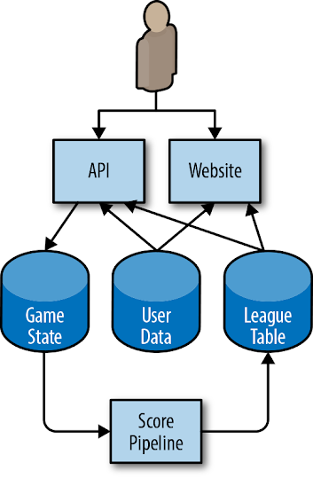
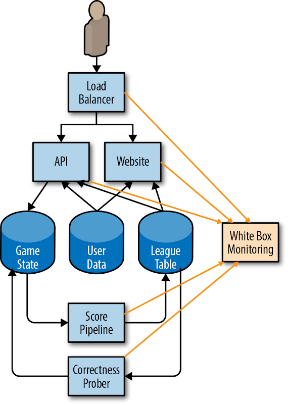
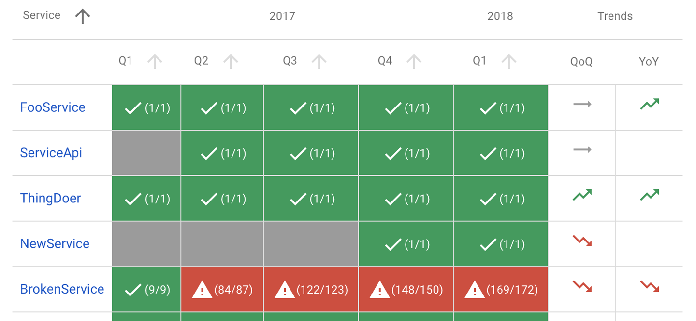
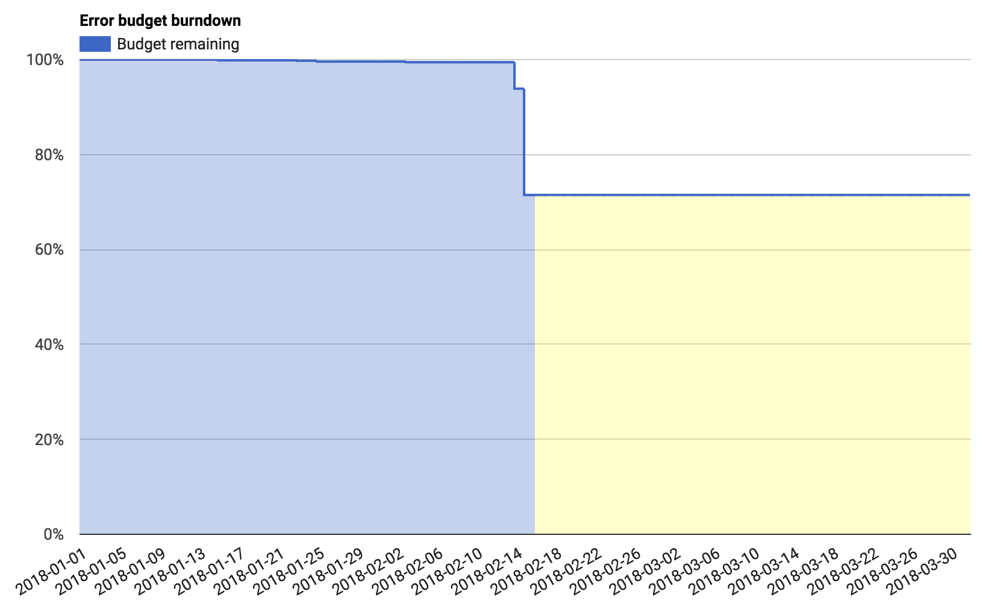
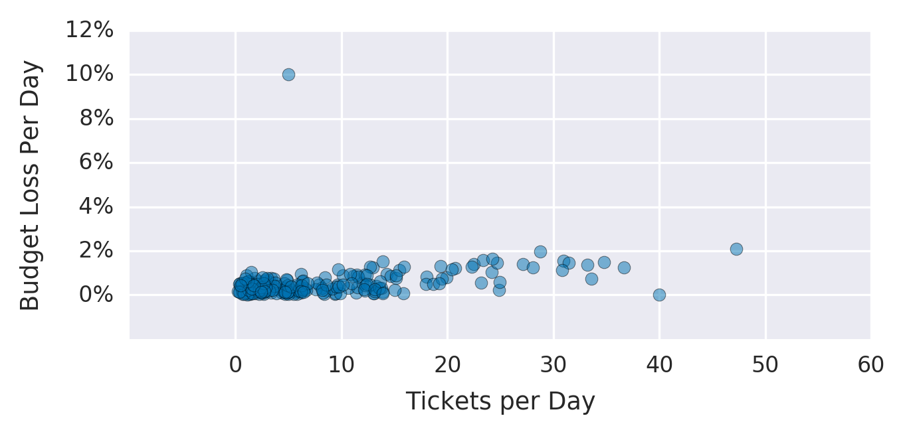

# Implementing SLOs

By Steven Thurgood and David Ferguson  
with Alex Hidalgo and Betsy Beyer

Service level objectives (SLOs) specify a target level for the reliability of your service. Because SLOs are key to making data-driven decisions about reliability, they’re at the core of SRE practices. In many ways, this is the most important chapter in this book.

Once you’re equipped with a few guidelines, setting up initial SLOs and a process for refining them can be straightforward. [Chapter 4](https://sre.google/sre-book/service-level-objectives/) in our first book introduced the topic of SLOs and SLIs (service level indicators), and gave some advice on how to use them.

After discussing the motivation behind SLOs and error budgets, this chapter provides a step-by-step recipe to get you started thinking about SLOs, and also some advice about how to iterate from there. We’ll then cover how to use SLOs to make effective business decisions, and explore some advanced topics. Finally, we’ll give you some examples of SLOs for different types of services and some pointers on how to create more sophisticated SLOs in specific situations.[^1]

## Why SREs Need SLOs

Engineers are a scarce resource at even the largest organizations. Engineering time should be invested in the most important characteristics of the most important services. Striking the right balance between investing in functionality that will win new customers or retain current ones, versus investing in the reliability and scalability that will keep those customers happy, is difficult. At Google, we’ve learned that a well-thought-out and adopted SLO is key to making data-informed decisions about the opportunity cost of reliability work, and to determining how to appropriately prioritize that work.

SREs’ core responsibilities aren’t merely to automate “all the things” and hold the pager. Their day-to-day tasks and projects are driven by SLOs: ensuring that SLOs are defended in the short term and that they can be maintained in the medium to long term. One could even claim that without SLOs, there is no need for SREs.

SLOs are a tool to help determine what engineering work to prioritize. For example, consider the engineering tradeoffs for two reliability projects: automating rollbacks and moving to a replicated data store. By calculating the estimated impact on our error budget, we can determine which project is most beneficial to our users. See the section [Decision Making Using SLOs and Error Budgets](#decision-making-using-slos-and-error-budgets) for more detail on this, and [“Managing Risk”](https://sre.google/sre-book/embracing-risk/%0A#id-AnCDFmtB) in Site Reliability Engineering.

# Getting Started

As a starting point for establishing a basic [set of SLOs](https://sre.google/workbook/slo-engineering-case-studies/), let’s assume that your service is some form of code that has been compiled and released and is running on networked infrastructure that users access via the web. Your system’s maturity level might be one of the following:

- A greenfield development, with nothing currently deployed
- A system in production with some monitoring to notify you when things go awry, but no formal objectives, no concept of an error budget, and an unspoken goal of 100% uptime
- A running deployment with an SLO below 100%, but without a common understanding about its importance or how to leverage it to make continuous improvement choices—in other words, an SLO without teeth

In order to adopt an error budget-based approach to Site Reliability Engineering, you need to reach a state where the following hold true:

- There are SLOs that all stakeholders in the organization have approved as being fit for the product.
- The people responsible for ensuring that the service meets its SLO have agreed that it is possible to meet this SLO under normal circumstances.
- The organization has committed to using the error budget for decision making and prioritizing. This commitment is formalized in an error budget policy.
- There is a process in place for refining the SLO.

Otherwise, you won’t be able to adopt an error budget–based approach to reliability. SLO compliance will simply be another KPI (key performance indicator) or reporting metric, rather than a decision-making tool.

### Reliability Targets and Error Budgets

The first step in formulating appropriate SLOs is to talk about what an SLO should be, and what it should cover.

An SLO sets a target level of reliability for the service’s customers. Above this threshold, almost all users should be happy with your service (assuming they are otherwise happy with the utility of the service).[^2] Below this threshold, users are likely to start complaining or to stop using the service. Ultimately, user happiness is what matters—happy users use the service, generate revenue for your organization, place low demands on your customer support teams, and recommend the service to their friends. We keep our services reliable to keep our customers happy.

Customer happiness is a rather fuzzy concept; we can’t measure it precisely. Often we have very little visibility into it at all, so how do we begin? What do we use for our first SLO?

Our experience has shown that 100% reliability is the wrong target:

- If your SLO is aligned with customer satisfaction, 100% is not a reasonable goal. Even with redundant components, automated health checking, and fast failover, there is a nonzero probability that one or more components will fail simultaneously, resulting in less than 100% availability.
- Even if you could achieve 100% reliability within your system, your customers would not experience 100% reliability. The chain of systems between you and your customers is often long and complex, and any of these components can fail.[^3] This also means that as you go from 99% to 99.9% to 99.99% reliability, each extra nine comes at an increased cost, but the marginal utility to your customers steadily approaches zero.
- If you do manage to create an experience that is 100% reliable for your customers, and want to maintain that level of reliability, you can never update or improve your service. The number one source of outages is change: pushing new features, applying security patches, deploying new hardware, and scaling up to meet customer demand will impact that 100% target. Sooner or later, your service will stagnate and your customers will go elsewhere, which is not great for anyone’s bottom line.
- An SLO of 100% means you only have time to be reactive. You literally cannot do anything other than react to \< 100% availability, which is guaranteed to happen. Reliability of 100% is not an engineering culture SLO—it’s an operations team SLO.

Once you have an SLO target below 100%, it needs to be owned by someone in the organization who is empowered to make tradeoffs between feature velocity and reliability. In a small organization, this may be the CTO; in larger organizations, this is normally the product owner (or product manager).

### What to Measure: Using SLIs

Once you agree that 100% is the wrong number, how do you determine the right number? And what are you measuring, anyway? Here, [service level indicators](https://sre.google/sre-book/service-level-objectives/) come into play: an SLI is an indicator of the level of service that you are providing.

While many numbers can function as an SLI, we generally recommend treating the SLI as the ratio of two numbers: the number of good events divided by the total number of events. For example:

- Number of successful HTTP requests / total HTTP requests (success rate)
- Number of gRPC calls that completed successfully in \< 100 ms / total gRPC requests
- Number of search results that used the entire corpus / total number of search results, including those that degraded gracefully
- Number of “stock check count” requests from product searches that used stock data fresher than 10 minutes / total number of stock check requests
- Number of “good user minutes” according to some extended list of criteria for that metric / total number of user minutes

SLIs of this form have a couple of particularly useful properties. The SLI ranges from 0% to 100%, where 0% means nothing works, and 100% means nothing is broken. We have found this scale intuitive, and this style lends itself easily to the concept of an error budget: the SLO is a target percentage and the error budget is 100% minus the SLO. For example, if you have a 99.9% success ratio SLO, then a service that receives 3 million requests over a four-week period had a budget of 3,000 (0.1%) errors over that period. If a single outage is responsible for 1,500 errors, that error costs 50% of the error budget.[^4]

In addition, making all of your SLIs follow a consistent style allows you to take better advantage of tooling: you can write alerting logic, SLO analysis tools, error budget calculation, and reports to expect the same inputs: numerator, denominator, and threshold. Simplification is a bonus here.

When attempting to formulate SLIs for the first time, you might find it useful to further divide SLIs into SLI specification and SLI implementation:

SLI specification

- The assessment of service outcome that you think matters to users, independent of how it is measured.
- For example: Ratio of home page requests that loaded in \< 100 ms

SLI implementation

- The SLI specification and a way to measure it.

<!-- -->

- For example:
  - Ratio of home page requests that loaded in \< 100 ms, as measured from the Latency column of the server log. This measurement will miss requests that fail to reach the backend.

  - Ratio of home page requests that loaded in \< 100 ms, as measured by probers that execute JavaScript in a browser running in a virtual machine. This measurement will catch errors when requests cannot reach our network, but may miss issues that affect only a subset of users.

  - Ratio of home page requests that loaded in \< 100 ms, as measured by instrumentation in the JavaScript on the home page itself, and reported back to a dedicated telemetry recording service. This measurement will more accurately capture the user experience, although we now need to modify the code to capture this information and build the infrastructure to record it—a specification that has its own reliability requirements.

As you can see, a single SLI specification might have multiple SLI implementations, each with its own set of pros and cons in terms of quality (how accurately they capture the experience of a customer), coverage (how well they capture the experience of all customers), and cost.

Your first attempt at an SLI and SLO doesn’t have to be correct; the most important goal is to get something in place and measured, and to set up a feedback loop so you can improve. (We dive deeper into this topic in [Continuous Improvement of SLO Targets](#continuous-improvement-of-slo-targets).)

In [our first book](https://sre.google/sre-book/table-of-contents/), we advise against picking an SLO based upon current performance, because this can commit you to unnecessarily strict SLOs. While that advice is true, your current performance can be a good place to start if you don’t have any other information, and if you have a good process for iterating in place (which we’ll cover later). However, don’t let current performance limit you as you refine your SLO: your customers will also come to expect your service to perform at its SLO, so if your service returns successful requests 99.999% of the time in less than 10 ms, any significant regression from that baseline may make them unhappy.

To create your first set of SLOs, you need to decide upon a few key SLI specifications that matter to your service. Availability and latency SLOs are pretty common; freshness, durability, correctness, quality, and coverage SLOs also have their place (we’ll talk more about those later).

If you are having trouble figuring out what sort of SLIs to start with, it helps to start simple:

- Choose one application for which you want to define SLOs. If your product comprises many applications, you can add those later.
- Decide clearly who the “users” are in this situation. These are the people whose happiness you are optimizing.
- Consider the common ways your users interact with your system—common tasks and critical activities.
- Draw a high-level architecture diagram of your system; show the key components, the request flow, the data flow, and the critical dependencies. Group these components into categories listed in the following section (there may be some overlap and ambiguity; use your intuition and don’t let perfect be the enemy of the good).

You should think carefully about exactly what you select as your SLIs, but you also shouldn’t overcomplicate things. Especially if you’re just starting your SLI journey, pick an aspect of your system that’s relevant but easy to measure—you can always iterate and refine later.

###### Types of components

The easiest way to get started with setting SLIs is to abstract your system into a few common types of components. You can then use our list of suggested SLIs for each component to choose the ones most relevant to your service:

Request-driven

- The user creates some type of event and expects a response. For example, this could be an HTTP service where the user interacts with a browser or an API for a mobile application.

Pipeline

- A system that takes records as input, mutates them, and places the output somewhere else. This might be a simple process that runs on a single instance in real time, or a multistage batch process that takes many hours. Examples include:
  - A system that periodically reads data from a relational database and writes it into a distributed hash table for optimized serving
  - A video processing service that converts video from one format to another
  - A system that reads in log files from many sources to generate reports
  - A monitoring system that pulls metrics from remote servers and generates [time series and alerts](../../sre-book/practical-alerting/)

Storage

- A system that accepts data (e.g., bytes, records, files, videos) and makes it available to be retrieved at a later date.

# A Worked Example

Consider a simplified architecture for a mobile phone game, shown in [Figure 2-1](#architecture-for-an-example-mobile-phone-game).



*Figure 2-1. Architecture for an example mobile phone game*

The app running on the user’s phone interacts with an HTTP API running in the cloud. The API writes state changes to a permanent storage system. A pipeline periodically runs over this data to generate league tables that provide high scores for today, this week, and all time. This data is written to a separate league table data store, and the results are available via the mobile app (for in-game scores) and a website. Users can upload custom avatars, which are used both in-game via the API and in the high score website, to the User Data table.

Given this setup, we can start thinking about how users interact with the system, and what sort of SLIs would measure the various aspects of a user’s experience.

Some of these SLIs may overlap: a request-driven service may have a correctness SLI, a pipeline may have an availability SLI, and durability SLIs might be viewed as a variant on correctness SLIs. We recommend choosing a small number (five or fewer) of SLI types that represent the most critical functionality to your customers.

In order to capture both the typical user experience and the long tail, we also recommend using multiple grades of SLOs for some types of SLIs. For example, if 90% of users’ requests return within 100 ms, but the remaining 10% take 10 seconds, many users will be unhappy. A latency SLO can capture this user base by setting multiple thresholds: 90% of requests are faster than 100 ms, and 99% of requests are faster than 400 ms. This principle applies to all SLIs with parameters that measure user unhappiness.

[Table 2-1](#slis-for-different-types-of-services) provides some common SLIs for different types of services.

| Type of service | Type of SLI  | Description                                                                                                                                                                                                                                                                                                                                                                                                                |
|-----------------|--------------|----------------------------------------------------------------------------------------------------------------------------------------------------------------------------------------------------------------------------------------------------------------------------------------------------------------------------------------------------------------------------------------------------------------------------|
| Request-driven  | Availability | The proportion of requests that resulted in a successful response.                                                                                                                                                                                                                                                                                                                                                         |
| Request-driven  | Latency      | The proportion of requests that were faster than some threshold.                                                                                                                                                                                                                                                                                                                                                           |
| Request-driven  | Quality      | If the service degrades gracefully when overloaded or when backends are unavailable, you need to measure the proportion of responses that were served in an undegraded state. For example, if the User Data store is unavailable, the game is still playable but uses generic imagery.                                                                                                                                     |
| Pipeline        | Freshness    | The proportion of the data that was updated more recently than some time threshold. Ideally this metric counts how many times a user accessed the data, so that it most accurately reflects the user experience.                                                                                                                                                                                                           |
| Pipeline        | Correctness  | The proportion of records coming into the pipeline that resulted in the correct value coming out.                                                                                                                                                                                                                                                                                                                          |
| Pipeline        | Coverage     | For batch processing, the proportion of jobs that processed above some target amount of data. For streaming processing, the proportion of incoming records that were successfully processed within some time window.                                                                                                                                                                                                       |
| Storage         | Durability   | The proportion of records written that can be successfully read. Take particular care with durability SLIs: the data that the user wants may be only a small portion of the data that is stored. For example, if you have 1 billion records for the previous 10 years, but the user wants only the records from today (which are unavailable), then they will be unhappy even though almost all of their data is readable. |

Table 2-1. Potential SLIs for different types of components {#slis-for-different-types-of-services}

### Moving from SLI Specification to SLI Implementation

Now that we know our SLI specifications, we need to start thinking about how to implement them.

For your first SLIs, choose something that requires a minimum of engineering work. If your web server logs are already available, but setting up probes would take weeks and instrumenting your JavaScript would take months, use the logs.

You need enough information to measure the SLI: for availability, you need the success/failure status; for slow requests, you need the time taken to serve the request. You may need to reconfigure your web server to record this information. If you’re using a cloud-based service, some of this information may already be available in a monitoring dashboard.

There are various options for SLI implementations for our example architecture, each with its own pros and cons. The following sections detail SLIs for the three types of components in our system.

###### API and HTTP server availability and latency

For all of the considered SLI implementations, we base the response success on the HTTP status code. 5XX responses count against SLO, while all other requests are considered successful. Our availability SLI is the proportion of successful requests, and our latency SLIs are the proportion of requests that are faster than defined thresholds.

Your SLIs should be specific and measurable. To summarize the list of potential candidates provided in [What to Measure: Using SLIs](#what-to-measure-using-slis), your SLIs can use one or more of the following sources:

- Application server logs
- Load balancer monitoring
- Black-box monitoring
- Client-side instrumentation

Our example uses the load balancer monitoring, as the metrics are already available and provide SLIs that are closer to the user’s experience than those from the application server’s logs.

###### Pipeline freshness, coverage, and correctness

When our pipeline updates the league table, it records a watermark containing the timestamp of when the data was updated. Some example SLI implementations:

- Run a periodic query across the league table, counting the total number of fresh records and the total number of records. This will treat each stale record as equally important, regardless of how many users saw the data.
- Make all clients of the league table check the watermark when they request fresh data and increment a metric counter saying that data was requested. Increment another counter if the data was fresher than a predefined threshold.

From these two options, our example uses the client-side implementation, as it gives SLIs that are much more closely correlated with user experience and are straightforward to add.

To calculate our coverage SLI, our pipeline exports the number of records that it should have processed and the number of records that it successfully processed. This metric may miss records that our pipeline did not know about due to misconfiguration.

We have a couple potential approaches to measure correctness:

- Inject data with known outputs into the system, and count the proportion of times that the output matches our expectations.
- Use a method to calculate correct output based on input that is distinct from our pipeline itself (and likely more expensive, and therefore not suitable for our pipeline). Use this to sample input/output pairs, and count the proportion of correct output records. This methodology assumes that creating such a system is both possible and practical.

Our example bases its correctness SLI on some manually curated data in the game state database, with known good outputs that are tested every time the pipeline runs. Our SLI is the proportion of correct entries for our test data. In order for this SLI to be representative of the actual user experience, we need to make sure that our manually curated data is representative of real-world data.

### Measuring the SLIs

[Figure 2-2](#how-our-monitoring-system-collects-sli-metrics) shows how our white-box monitoring system collects metrics from the various components of the example application.



*Figure 2-2. How our monitoring system collects SLI metrics*

Let’s walk through an example of using metrics from our monitoring system to calculate our starter SLOs. While our example uses availability and latency metrics, the same principles apply to all other potential SLOs. For a full list of the metrics that our system uses, see [Example SLO Document](https://sre.google/workbook/slo-document/). All of our examples use [Prometheus notation](https://prometheus.io/).

###### Load balancer metrics

Total requests by backend (`"api"` or `"web"`) and response code:

``` code-indentation
http_requests_total{host="api", status="500"}
```

Total latency, as a cumulative histogram; each bucket counts the number of requests that took less than or equal to that time:

``` code-indentation
http_request_duration_seconds{host="api", le="0.1"}
http_request_duration_seconds{host="api", le="0.2"}
http_request_duration_seconds{host="api", le="0.4"}
```

Generally speaking, it is better to count the slow requests than to approximate them with a histogram. But, because that information isn’t available, we use the histogram provided by our monitoring system. Another approach would be to base explicit slow request counts on the various slowness thresholds in the load balancer’s configuration (e.g., for thresholds of 100 ms and 500 ms). This strategy would provide more accurate numbers but require more configuration, which makes changing the thresholds retroactively harder.

` http_request_duration_seconds{host="api", le="0.1"} http_request_duration_seconds{host="api", le="0.5"} `

###### Calculating the SLIs

Using the preceding metrics, we can calculate our current SLIs over the previous seven days, as shown in [Table 2-2](#calculations-for-slis).

<table id="calculations-for-slis">
<caption>Table 2-2. Calculations for SLIs over the previous seven days</caption>
<colgroup>
<col style="width: 50%" />
<col style="width: 50%" />
</colgroup>
<tbody>
<tr class="odd">
<td><p>Availability</p></td>
<td><p><code>sum(rate(http_requests_total{host="api", status!~"5.."}[7d]))</code></p>
<p><code>/</code></p>
<p><code>sum(rate(http_requests_total{host="api"}[7d])</code></p></td>
</tr>
<tr class="even">
<td><p>Latency</p></td>
<td><p><code>histogram_quantile(0.9, rate(http_request_duration_seconds_bucket[7d]))</code></p>
<p><code>histogram_quantile(0.99, rate(http_request_duration_seconds_bucket[7d]))</code></p></td>
</tr>
</tbody>
</table>

Table 2-2. Calculations for SLIs over the previous seven days {#calculations-for-slis}

### Using the SLIs to Calculate Starter SLOs

We can round down these SLIs to manageable numbers (e.g., two significant figures of availability, or up to 50 ms[^5] of latency) to obtain our starting SLOs.

For example, over four weeks, the API metrics show:

- Total requests: 3,663,253
- Total successful requests: 3,557,865 (97.123%)
- 90th percentile latency: 432 ms
- 99th percentile latency: 891 ms

We repeat this process for the other SLIs, and create a proposed SLO for the API, shown in [Table 2-3](#proposed-slos-for-the-API).

| SLO type     | Objective                 |
|--------------|---------------------------|
| Availability | 97%                       |
| Latency      | 90% of requests \< 450 ms |
| Latency      | 99% of requests \< 900 ms |

Table 2-3. Proposed SLOs for the API {#proposed-slos-for-the-API}

[Example SLO Document](https://sre.google/workbook/slo-document/) provides a full example of an SLO document. This document includes SLI implementations, which we omitted here for brevity.

Based upon this proposed SLI, we can calculate our error budget over those four weeks, as shown in [Table 2-4](#error-budget-over-four-weeks).

| SLO                                | Allowed failures |
|------------------------------------|------------------|
| 97% availability                   | 109,897          |
| 90% of requests faster than 450 ms | 366,325          |
| 99% of requests faster than 900 ms | 36,632           |

Table 2-4. Error budget over four weeks {#error-budget-over-four-weeks}

# Choosing an Appropriate Time Window

SLOs can be defined over various time intervals, and can use either a rolling window or a calendar-aligned window (e.g., a month). There are several factors you need to account for when choosing the window.

Rolling windows are more closely aligned with user experience: if you have a large outage on the final day of a month, your user doesn’t suddenly forget about it on the first day of the following month. We recommend defining this period as an integral number of weeks so it always contains the same number of weekends. For example, if you use a 30-day window, some periods might include four weekends while others include five weekends. If weekend traffic differs significantly from weekday traffic, your SLIs may vary for uninteresting reasons.

Calendar windows are more closely aligned with business planning and project work. For example, you might evaluate your SLOs every quarter to determine where to focus the next quarter’s project headcount. Calendar windows also introduce some element of uncertainty: in the middle of the quarter, it is impossible to know how many requests you will receive for the rest of the quarter. Therefore, decisions made mid-quarter must speculate as to how much error budget you’ll spend in the remainder of the quarter.

Shorter time windows allow you to make decisions more quickly: if you missed your SLO for the previous week, then small course corrections—prioritizing relevant bugs, for example—can help avoid SLO violations in future weeks.

Longer time periods are better for more strategic decisions: for example, if you could choose only one of three large projects, would you be better off moving to a high-availability distributed database, automating your rollout and rollback procedure, or deploying a duplicate stack in another zone? You need more than a week’s worth of data to evaluate large multiquarter projects; the amount of data required is roughly commensurate with the amount of engineering work being proposed to fix it.

We have found a four-week rolling window to be a good general-purpose interval. We complement this time frame with weekly summaries for task prioritization and quarterly summarized reports for project planning.

If the data source allows, you can then use this proposed SLO to calculate your actual SLO performance over that interval: if you set your initial SLO based on actual measurements, by design, you met your SLO. But we can also gather interesting information about the distribution. Were there any days during the past four weeks when our service did not meet its SLO? Do these days correlate with actual incidents? Was there (or should there have been) some action taken on those days in response to incidents?

If you do not have logs, metrics, or any other source of historical performance, you need to configure a data source. For example, as a low-fidelity solution for HTTP services, you can set up a remote monitoring service that performs some kind of periodic health check on the service (a ping or an HTTP GET) and reports back the number of successful requests. A number of online services can easily implement this solution.

# Getting Stakeholder Agreement

In order for a proposed SLO to be useful and effective, you will need to get all stakeholders to agree to it:

- The product managers have to agree that this threshold is good enough for users—performance below this value is unacceptably low and worth spending engineering time to fix.
- The product developers need to agree that if the error budget has been exhausted, they will take some steps to reduce risk to users until the service is back in budget (as discussed in [Establishing an Error Budget Policy](#establishing-an-error-budget-policy)).
- The team responsible for the production environment who are tasked with defending this SLO have agreed that it is defensible without Herculean effort, excessive toil, and burnout—all of which are damaging to the long-term health of the team and service.

Once all of these points are agreed upon, the hard part is done.[^6] You have started your SLO journey, and the remaining steps entail iterating from this starting point.

To defend your SLO you will need to set up monitoring and alerting (see [Alerting on SLOs](https://sre.google/workbook/alerting-on-slos/)) so that engineers receive timely notifications of threats to the error budget before those threats become deficits.

### Establishing an Error Budget Policy

Once you have an SLO, you can use the SLO to derive an error budget. In order to use this error budget, you need a policy outlining what to do when your service runs out of budget.

Getting the [error budget policy](https://sre.google/workbook/error-budget-policy/) approved by all key stakeholders—the product manager, the development team, and the SREs—is a good test for whether the SLOs are fit for purpose:

- If the SREs feel that the SLO is not defensible without undue amounts of toil, they can make a case for relaxing some of the objectives.
- If the development team and product manager feel that the increased resources they’ll have to devote to fixing reliability will cause feature release velocity to fall below acceptable levels, then they can also argue for relaxing objectives. Remember that lowering the SLOs also lowers the number of situations to which the SREs will respond; the product manager needs to understand this tradeoff.
- If the product manager feels that the SLO will result in a bad experience for a significant number of users before the error budget policy prompts anyone to address an issue, the SLOs are likely not tight enough.

If all three parties do not agree to enforce the error budget policy, you need to iterate on the SLIs and SLOs until all stakeholders are happy. Decide how to move forward and what you need to make the decision: more data, more resources, or a change to the SLI or SLO?

When we talk about enforcing an error budget, we mean that once you exhaust your error budget (or come close to exhausting it), you should do something in order to restore stability to your system.

To make error budget enforcement decisions, you need to start with a written policy. This policy should cover the specific actions that must be taken when a service has consumed its entire error budget for a given period of time, and specify who will take them. Common owners and actions might include:

- The development team gives top priority to bugs relating to reliability issues over the past four weeks.
- The development team focuses exclusively on reliability issues until the system is within SLO. This responsibility comes with high-level approval to push back on external feature requests and mandates.
- To reduce the risk of more outages, a production freeze halts certain changes to the system until there is sufficient error budget to resume changes.

Sometimes a service consumes the entirety of its error budget, but not all stakeholders agree that enacting the error budget policy is appropriate. If this happens, you need to return to the error budget policy approval stage.

### Documenting the SLO and Error Budget Policy

An appropriately defined SLO should be documented in a prominent location where other teams and stakeholders can review it. This documentation should include the following information:

- The authors of the SLO, the reviewers (who checked it for technical accuracy), and the approvers (who made the business decision about whether it is the right SLO).
- The date on which it was approved, and the date when it should next be reviewed.
- A brief description of the service to give the reader context.
- The details of the SLO: the objectives and the SLI implementations.
- The details of how the error budget is calculated and consumed.
- The rationale behind the numbers, and whether they were derived from experimental or observational data. Even if the SLOs are totally ad hoc, this fact should be documented so that future engineers reading the document don’t make bad decisions based upon ad hoc data.

How often you review an SLO document depends on the maturity of your SLO culture. When starting out, you should probably review the SLO frequently—perhaps every month. Once the appropriateness of the SLO becomes more established, you can likely reduce reviews to happen quarterly or even less frequently.

The error budget policy should also be documented, and should include the following information:

- The policy authors, reviewers, and approvers
- The date on which it was approved, and the date when it should next be reviewed
- A brief description of the service to give the reader context
- The actions to be taken in response to budget exhaustion
- A clear escalation path to follow if there is disagreement on the calculation or whether the agreed-upon actions are appropriate in the circumstances
- Depending upon the audience’s level of error budget experience and expertise, it may be beneficial to include an overview of error budgets.

See [Example SLO Document](https://sre.google/workbook/slo-document/) for an example of an SLO document and an error budget policy.

### Dashboards and Reports

In addition to the published SLO and error budget policy documents, it is useful to have reports and dashboards that provide in-time snapshots of the SLO compliance of your services, for communicating with other teams and for spotting problematic areas.

The report in [Figure 2-3](#slo-compliance-report) shows the overall compliance of several services: whether they met all of their quarterly SLOs for the previous year (the numbers in parentheses indicate the number of objectives that were met, and the total number of objectives), and whether their SLIs were trending upward or downward in relation to the previous quarter and the same quarter last year.



*Figure 2-3. SLO compliance report*

It is also useful to have dashboards showing SLI trends. These dashboards indicate if you are consuming budget at a higher-than-usual rate, or if there are patterns or trends you need to be aware of.

The dashboard in [Figure 2-4](#error-budget-dashboard) shows the error budget for a single quarter, midway through that quarter. Here we see that a single event consumed around 15% of the error budget over the course of two days.



*Figure 2-4. Error budget dashboard*

Error budgets can be useful for quantifying these events—for example, “this outage consumed 30% of my quarterly error budget,” or “these are the top three incidents this quarter, ordered by how much error budget they consumed.”

# Continuous Improvement of SLO Targets

Every service can benefit from continuous improvement. This is one of the central service goals in [ITIL](https://en.wikipedia.org/wiki/ITIL), for example.

Before you can improve your SLO targets, you need a source of information about user satisfaction with your service. There are a huge range of options:

- You can count outages that were discovered manually, posts on public forums, support tickets, and calls to customer service.
- You can attempt to measure user sentiment on social media.
- You can add code to your system to periodically sample user happiness.
- You can conduct face-to-face user surveys and samples.

The possibilities are endless, and the optimal method depends on your service. We recommend starting with a measurement that’s cheap to collect and iterating from that starting point. Asking your product manager to include reliability into their existing discussions with customers about pricing and functionality is an excellent place to start.

### Improving the Quality of Your SLO

Count your manually detected outages. If you have support tickets, count those too. Look at periods when you had a known outage or incident. Check that these periods correlate with steep drops in error budget. Likewise, look at times when your SLIs indicate an issue, or your service fell out of SLO. Do these time periods correlate with known outages or an increase in support tickets? If you are familiar with statistical analysis, [Spearman’s rank correlation coefficient](https://en.wikipedia.org/wiki/Spearman's_rank_correlation_coefficient) can be a useful way to quantify this relationship.

[Figure 2-5](#graph-showing-the-number-of-support-tickets-per-day) shows a graph of the number of support tickets raised per day versus the measured loss in our error budget on that day. While not all tickets are related to reliability issues, there is a correlation between tickets and error budget loss. We see two outliers: one day with only 5 tickets, where we lost 10% of our error budget, and one day with 40 tickets, on which we lost no error budget. Both warrant closer investigation.



*Figure 2-5. Graph showing the number of support tickets per day versus the budget loss on that day*

If some of your outages and ticket spikes are not captured in any SLI or SLO, or if you have SLI dips and SLO misses that don’t map to user-facing issues, this is a strong sign that your SLO lacks coverage. This situation is totally normal and should be expected. Your SLIs and SLOs should change over time as realities about the service they represent change. Don’t be afraid to examine and refine them over time!

There are several courses of action you can take if your SLO lacks coverage:

Change your SLO

- If your SLIs indicated a problem, but your SLOs didn’t prompt anyone to notice or respond, you may need to tighten your SLO.
  - If the incident on that date was large enough that it needs to be addressed, look at the SLI values during the periods of interest. Calculate what SLO would have resulted in a notification on those dates. Apply that SLO to your historic SLIs, and see what other events this adjustment would have captured. It’s pointless to improve the recall of your system if you lower the precision such that the team must constantly respond to unimportant events.[^7]
  - Likewise, for false-positive days, consider relaxing the SLO.
- If changing the SLO in either direction results in too many false positives or false negatives, then you also need to improve the SLI implementation.

Change your SLI implementation

- There are two ways to change your SLI implementation: either move the measurement closer to the user to improve the quality of the metric, or improve coverage so you capture a higher percentage of user interactions. For example:
  - Instead of measuring success/latency at the server, measure it at the load balancer or on the client.
  - Instead of measuring availability with a simple HTTP GET request, use a health-checking handler that exercises more functionality of the system, or a test that executes all of the client-side JavaScript.

Institute an aspirational SLO

- Sometimes you determine that you need a tighter SLO to make your users happy, but improving your product to meet that SLO will take some time. If you implement the tighter SLO, you’ll be permanently out of SLO and subject to your error budget policy. In this situation, you can make the refined SLO an aspirational SLO—measured and tracked alongside your current SLO, but explicitly called out in your error budget policy as not requiring action. This way you can track your progress toward meeting the aspirational SLO, but you won’t be in a perpetual state of emergency.

Iterate

- There are many different ways to iterate, and your review sessions will identify many potential improvements. Pick the option that’s most likely to give the highest return on investment. Especially during the first few iterations, err on the side of quicker and cheaper; doing so reduces the uncertainty in your metrics and helps you determine if you need more expensive metrics. Iterate as many times as you need to.

# Decision Making Using SLOs and Error Budgets

Once you have SLOs, you can start using them for decision making.

The obvious decisions start from what to do when you’re not meeting your SLO—that is, when you’ve exhausted your error budget. As already discussed, the appropriate course of action when you exhaust your error budget should be covered by the error budget policy. Common policies include stopping feature launches until the service is once again within SLO or devoting some or all engineering time to working on reliability-related bugs.

In extreme circumstances, a team can declare an emergency with high-level approval to deprioritize all external demands (requests from other teams, for example) until the service meets exit criteria—typically that the service is within SLO and that you’ve taken steps to decrease the chances of a subsequent SLO miss. These steps may include improving monitoring, improving testing, removing dangerous dependencies, or rearchitecting the system to remove known failure types.

You can determine the scale of the incident according to the proportion of the error budget it consumed, and use this data to identify the most critical incidents that merit closer investigation.

For example, imagine a release of a new API version causes 100% `NullPointerException`s until the system can be reverted four hours later.[^8] Inspecting the raw server logs indicates that the issue caused 14,066 errors. Using the numbers from our 97% SLO earlier, and our budget of 109,897 errors, this single event used 13% of our error budget.

Or perhaps the server on which our singly homed state database is stored fails, and restoring from backups takes 20 hours. We estimate (based upon historical traffic over that period) that this outage caused us 72,000 errors, or 65% of our error budget.

Imagine that our example company had only one server failure in five years, but typically experiences two or three bad releases that require rollbacks per year. We can estimate that, on average, bad pushes cost twice as much error budget as database failures. The numbers prove that addressing the release problem provides much more benefit than investing resources in investigating the server failure.

If the service is running flawlessly and needs little oversight, then it may be time to move the service to a less hands-on tier of support. You might continue to provide incident response management and high-level oversight, but you no longer need to be as closely involved with the product on a day-to-day basis. Therefore, you can focus your efforts on other systems that need more SRE support.

[Table 2-5](#slo-decision-matrix) provides suggested courses of action based on three key dimensions:

- Performance against SLO
- The amount of toil required to operate the service
- The level of customer satisfaction with the service

| SLO    | Toil | Customer satisfaction | Action                                                                                                                                                                              |
|--------|------|-----------------------|-------------------------------------------------------------------------------------------------------------------------------------------------------------------------------------|
| Met    | Low  | High                  | Choose to (a) relax release and deployment processes and increase velocity, or (b) step back from the engagement and focus engineering time on services that need more reliability. |
| Met    | Low  | Low                   | Tighten SLO.                                                                                                                                                                        |
| Met    | High | High                  | If alerting is generating false positives, reduce sensitivity. Otherwise, temporarily loosen the SLOs (or offload toil) and fix product and/or improve automated fault mitigation.  |
| Met    | High | Low                   | Tighten SLO.                                                                                                                                                                        |
| Missed | Low  | High                  | Loosen SLO.                                                                                                                                                                         |
| Missed | Low  | Low                   | Increase alerting sensitivity.                                                                                                                                                      |
| Missed | High | High                  | Loosen SLO.                                                                                                                                                                         |
| Missed | High | Low                   | Offload toil and fix product and/or improve automated fault mitigation.                                                                                                             |

Table 2-5. SLO decision matrix {#slo-decision-matrix}

# Advanced Topics

Once you have a healthy and mature SLO and error budget culture, you can continue to improve and refine how you measure and discuss the reliability of your services.

### Modeling User Journeys

While all of the techniques discussed in this chapter will be beneficial to your organization, ultimately SLOs should center on improving the customer experience. Therefore, you should write SLOs in terms of user-centric actions.

You can use critical user journeys to help capture the experience of your customers. A critical user journey is a sequence of tasks that is a core part of a given user’s experience and an essential aspect of the service. For example, for an online shopping experience, critical user journeys might include:

- Searching for a product
- Adding a product to a shopping cart
- Completing a purchase

These tasks will almost certainly not map well to your existing SLIs; each task requires multiple complex steps that can fail at any point, and inferring the success (or failure) of these actions from logs can be extremely difficult. (For example, how do you determine if the user failed at the third step, or if they simply got distracted by cat videos in another tab?) However, we need to identify what matters to the user before we can start making sure that aspect of the service is reliable.

Once you identify user-centric events, you can solve the problem of measuring them. You might measure them by joining distinct log events together, using advanced JavaScript probing, using client-side instrumentation, or using some other process. Once you can measure an event, it becomes just another SLI, which you can track alongside your existing SLIs and SLOs. Critical user journeys can improve your recall without affecting your precision.

### Grading Interaction Importance

Not all requests are considered equal. The HTTP request from a mobile app that checks for account notifications (where notifications are generated by a daily pipeline) is important to your user, but is not as important as a billing-related request by your advertiser.

We need a way to distinguish certain classes of requests from others. You can use bucketing to accomplish this—that is, adding more labels to your SLIs, and then applying different SLOs to those different labels. [Table 2-6](#bucketing-by-tier) shows an example.

| Customer tier | Availability SLO |
|---------------|------------------|
| Premium       | 99.99%           |
| Free          | 99.9%            |

Table 2-6. Bucketing by tier {#bucketing-by-tier}

You can split requests by expected responsiveness, as shown in [Table 2-7](#bucketing-by-expected-responsiveness)

| Responsiveness                                    | Latency SLO                        |
|---------------------------------------------------|------------------------------------|
| Interactive (i.e., requests that block page load) | 90% of requests complete in 100 ms |
| CSV download                                      | 90% of downloads start within 5 s  |

Table 2-7. Bucketing by expected responsiveness {#bucketing-by-expected-responsiveness}

If you have the data available to apply your SLO to each customer independently, you can track the number of customers who are in SLO at any given time. Note that this number can be highly variable—customers who send a very low number of requests will have either 100% availability (because they were lucky enough to experience no failures) or very low availability (because the one failure they experienced was a significant percentage of their requests). Individual customers can fail to meet their SLO for uninteresting reasons, but in aggregate, tracking problems that affect a wide number of customers’ SLO compliance can be a useful signal.

### Modeling Dependencies

Large systems have many components. A single system may have a presentation layer, an application layer, a business logic layer, and a data persistence layer. Each of these layers may consist of many services or microservices.

While your prime concern is implementing a user-centric SLO that covers the entire stack, SLOs can also be a useful way to coordinate and implement reliability requirements between different components in the stack.

For example, if a single component is a critical dependency[^9] for a particularly high-value interaction, its reliability guarantee should be at least as high as the reliability guarantee of the dependent action. The team that runs that particular component needs to own and manage its service’s SLO in the same way as the overarching product SLO.

If a particular component has inherent reliability limitations, the SLO can communicate that limitation. If the user journey that depends upon it needs a higher level of availability than that component can reasonably provide, you need to engineer around that condition. You can either use a different component or add sufficient defenses (caching, offline store-and-forward processing, graceful degradation, etc.) to handle failures in that component.

It can be tempting to try to math your way out of these problems. If you have a service that offers 99.9% availability in a single zone, and you need 99.95% availability, simply deploying the service in two zones should solve that requirement. The probability that both services will experience an outage at the same time is so low that two zones should provide 99.9999% availability. However, this reasoning assumes that both services are wholly independent, which is almost never the case. The two instances of your app will have common dependencies, common failure domains, shared fate, and global control planes—all of which can cause an outage in both systems, no matter how carefully it is designed and managed. Unless each of these dependencies and failure patterns is carefully enumerated and accounted for, any such calculations will be deceptive.

There are two schools of thought regarding how an error budget policy should address a missed SLO when the failure is caused by a dependency that’s handled by another team:

- Your team should not halt releases or devote more time to reliability, as your system didn’t cause the issue.
- You should enact a change freeze in order to minimize the chances of future outages, regardless of the cause of that outage.

The second approach will make your users happier. You have some flexibility in how you apply this principle. Depending on the nature of the outage and dependency, freezing changes may not be practical. Decide what is most appropriate for your service and its dependencies, and record that decision for posterity in your documented error budget. For an example of how this might work in practice, see the example error budget policy in [Example Error Budget Policy](https://sre.google/workbook/error-budget-policy/).

### Experimenting with Relaxing Your SLOs

You may want to experiment with the reliability of your application and measure which changes in reliability (e.g., adding latency into page load times) have a measurably adverse impact on user behavior (e.g., percentage of users completing a purchase). We recommend performing this sort of analysis only if you are confident that you have error budget to burn. There are many subtle interactions between latency, availability, customers, business domains, and competition (or lack thereof). To make a choice to deliberately lower the perceived customer experience is a Rubicon to be crossed extremely thoughtfully, if at all.

While this exercise might seem scary (nobody wants to lose sales!), the knowledge you can gain by performing such experiments will allow you to improve your service in ways that could lead to even better performance (and higher sales!) in the future. This process may allow you to mathematically identify a relationship between a key business metric (e.g., sales) and a measurable technical metric (e.g., latency). If it does, you have gained a very valuable piece of data you can use to make important engineering decisions for your service going forward.

This exercise should not be a one-time activity. As your service evolves, so will your customers’ expectations. Make sure you regularly review the ongoing validity of the relationship.

This sort of analysis is also risky because you can misinterpret the data you get. For example, if you artificially slow your pages down by 50 ms and notice that no corresponding loss in conversions occurs, you might conclude that your latency SLO is too strict. However, your users might be unhappy, but simply lacking an alternative to your service at the moment. As soon as a competitor comes along, your users will leave. Be sure you are measuring the correct indicators, and take appropriate precautions.

# Conclusion

Every topic covered in this book can be tied back to SLOs. Now that you’ve read this chapter, we hope you’ll agree that even partly formalized SLOs (which clearly state your promises to users) offer a framework to discuss system behavior with greater clarity, and can help with pinpointing actionable remedies when services fail to meet expectations.

To summarize:

- SLOs are the tool by which you measure your service’s reliability.
- Error budgets are a tool for balancing reliability with other engineering work, and a great way to decide which projects will have the most impact.
- You should start using SLOs and error budgets today.

For an example SLO document and an example error budget policy, see Appendixes [Example SLO Document](https://sre.google/workbook/slo-document/) and [Example Error Budget Policy](https://sre.google/workbook/error-budget-policy/).

[^1]: A note on terminology: throughout this chapter, we use the word reliability to talk about how a service is performing with regard to all of its SLIs. This could be indicative of many things, such as availability or latency.

[^2]: This is distinct from a service level agreement (SLA), which is a business contract that comes into effect when your users are so unhappy you have to compensate them in some fashion.

[^3]: For more details about factoring dependencies into your service’s reliability, see Ben Treynor, Mike Dahlin, Vivek Rau, and Betsy Beyer, “The Calculus of Service Availability,” ACM Queue 15, no. 2 (2017), https://queue.acm.org/detail.cfm?id=3096459.

[^4]: If you measure your SLO over a calendar period, such as a quarter-year, then you may not know how big your budget will be at the end of the quarter if it’s based upon unpredictable metrics such as traffic. See Choosing an Appropriate Time Window for more discussion about reporting periods.

[^5]: 50 ms because users are unlikely to perceive a 50 ms change in latency, but the appropriate window obviously depends on the service and the users. A reporting service will be different from a real-time game.

[^6]: Disclaimer: there may be more difficult tasks in your future.

[^7]: Recall is the proportion of significantly user-impacting events that the SLI captures. Precision is the proportion of events captured by the SLI that were significantly user-impacting.

[^8]: It is worth reiterating here that an error budget is an approximation of user satisfaction. A four-hour outage every 30 days would probably result in fewer unhappy users than four separate one-hour outages every 30 days, which in turn would cause fewer unhappy users than a constant error rate of 0.5%, but our error budget treats them the same. These thresholds will vary between services.

[^9]: A dependency is critical if its unavailability means that your service is also unavailable.
