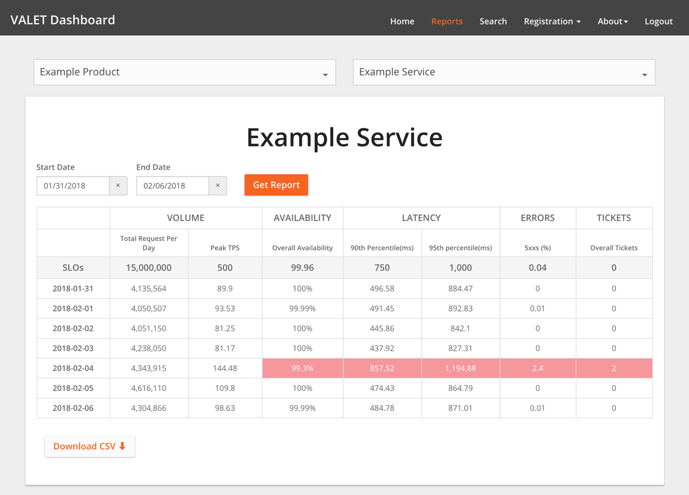

# SLO Engineering Case Studies

By Ben McCormack (Evernote) and  
William Bonnell (The Home Depot)  
with Garrett Plasky (Evernote), Alex Hidalgo,  
Betsy Beyer, and Dave Rensin

While many tenets of SRE were shaped within the walls of Google, its principles have long lived outside our gates. Many standard Google SRE practices have been discovered in parallel or otherwise been adopted by many other organizations across the industry.

SLOs are fundamental to the SRE model. Since we launched the Customer Reliability Engineering (CRE) team—a group of experienced SREs who help Google Cloud Platform (GCP) customers build more reliable services—almost every customer interaction starts and ends with SLOs.

Here we present two stories, told by two very different companies, that outline their journeys toward adopting an SLO and error budget–based approach while working with the Google CRE team. For a more general discussion about SLOs and error budgets, see [Implementing SLOs](/workbook/implementing-slos/) in this book, and [Chapter 3](https://sre.google/sre-book/embracing-risk/) in our first book.

## Evernote’s SLO Story

by Ben McCormack, Evernote

Evernote is a cross-platform app that helps individuals and teams create, assemble, and share information. With more than 220 million users worldwide, we store over 12 billion pieces of information—a mix of text-based notes, files, and attachments/images—within the platform. Behind the scenes, the Evernote service is supported by 750+ MySQL instances.

We introduced the [concept of SLOs](https://sre.google/resources/practices-and-processes/art-of-slos/) to Evernote as part of a much wider technology revamp aimed at increasing engineering velocity while maintaining quality of service. Our goals included:

- Move engineering focus away from undifferentiated heavy lifting in datacenters and toward product engineering work that customers actually cared about. To that end, we stopped running our physical datacenters and moved to a public cloud.
- Revise the working model of operations and software engineers to support an increase in feature velocity while maintaining overall quality of service.
- Revamp how we look at SLAs to ensure that we increase focus on how failures impact our large global customer base.

These goals may look familiar to organizations across many industries. While no single approach to making these types of changes will work across the board, we hope that sharing our experience will provide valuable insights for others facing similar challenges.

### Why Did Evernote Adopt the SRE Model?

At the outset of this transition, Evernote was characterized by a traditional ops/dev split: an operations team protected the sanctity of the production environment, while a development team was tasked with developing new product features for customers. These objectives were usually in conflict: the dev team felt constrained by lengthy operational requirements, while the ops team became frustrated when new code introduced new issues in production. As we swung wildly between these two goals, the ops and dev teams developed a frustrated and strained relationship. We wanted to reach a happier medium that better balanced the varying needs of the teams involved.

We attempted to address the gaps in this traditional dichotomy in various ways over the course of five-plus years. After trying out a “You wrote it, you run it” (development) model, and a “You wrote it, we run it for you” (operations) model, we moved toward an SLO-centric SRE approach.

So what motivated Evernote to move in this direction?

At Evernote, we view the core disciplines of operations and development as separate professional tracks in which engineers can specialize. One track is concerned with the nearly 24/7 ongoing delivery of a service to customers. The other is concerned with the extension and evolution of that service to meet customer needs in the future. These two disciplines have moved toward each other in recent years as movements like SRE and DevOps emphasize software development as applied to operations. (This convergence has been furthered by advances in datacenter automation and the growth of public clouds, both of which give us a datacenter that can be fully controlled by software.) On the other side of the spectrum, full-stack ownership and continuous deployment are increasingly applied to software development.

We were drawn to the SRE model because it fully embraces and accepts the differences between operations and development while encouraging teams to work toward a common goal. It does not try to transform operations engineers into application developers, or vice versa. Instead, it gives both a common frame of reference. In our experience, an error budget/SLO approach has led both teams to make similar decisions when presented with the same facts, as it removes a good deal of subjectivity from the conversation.

### Introduction of SLOs: A Journey in Progress

The first part of our journey was the move from physical datacenters to Google Cloud Platform.[^1] Once the Evernote service was up and running on GCP and stabilized, we introduced SLOs. Our objectives here were twofold:

- Align teams internally around Evernote SLOs, ensuring that all teams were working within the new framework.
- Incorporate Evernote’s SLO into how we work with the Google Cloud team, who now had responsibility for our underlying infrastructure. Since we now had a new partner within the overall model, we needed to ensure the move to GCP did not dilute or mask our commitment to our users.

After actively using SLOs for about nine months, Evernote is already on version 3 of its SLO practice!

Before getting into the technical details of an SLO, it is important to start the conversation from your customers’ point of view: what promises are you trying to uphold? Similar to most services, Evernote has many features and options that our users put to use in a variety of creative ways. We wanted to ensure we initially focused on the most important and common customer need: the availability of the Evernote service for users to access and sync their content across multiple clients. Our SLO journey started from that goal. We kept our first pass simple by focusing on uptime. Using this simple first approach, we could clearly articulate what we were measuring, and how.

Our first SLOs document contained the following:

A definition of the SLOs

- This was an uptime measure: 99.95% uptime measured over a monthly window, set for certain services and methods. We chose this number based upon discussions with our internal customer support and product teams and—more importantly—user feedback. We deliberately chose to bind our SLOs to a calendar month versus a rolling period to keep us focused and organized when running service reviews.

What to measure, and how to measure it

- What to measure
  - We specified a service endpoint we could call to test whether the service was functioning as expected. In our case, we have a status page built into our service that exercises most of our stack and returns a 200 status code if all is well.
- How to measure
  - We wanted a prober that called the status page periodically. We wanted that prober to be located completely outside of and independent from our environment so we could test all our components, including our load balancing stack. Our goal here was to make sure that we were measuring any and all failures of both the GCP service and the Evernote application. However, we did not want random internet issues to trigger false positives. We chose to use a third-party company that specializes in building and running such probers. We selected [Pingdom](https://www.pingdom.com/), but there are many others in the market. We conduct our measurements as follows:
    - *Frequency of probe:* We poll our frontend nodes every minute.
    - *Location of probers:* This setting is configurable; we currently use multiple probes in North America and Europe.
    - *Definition of “down”:* If a prober check fails, the node is marked as Unconfirmed Down and then a second geographically separate prober performs a check. If the second check fails, the node is marked down for SLO calculation purposes. The node will continue to be marked as down as long as consecutive probe requests register errors.

How to calculate SLOs from monitoring data

- Finally, we carefully documented how we calculate the SLO from the raw data we received from Pingdom. For example, we specified how to account for maintenance windows: we could not assume that all of our hundreds of millions of users knew about our published maintenance windows. Uninformed users would therefore experience these windows as generic and unexplained downtime, so our SLO calculations treated maintenance as downtime.

Once we defined our SLOs, we had to do something with them. We wanted the SLOs to drive software and operations changes that would make our customers happier and keep them happy. How best to do this?

We use the SLO/error budget concept as a method to allocate resources going forward. For example, if we missed the SLO for last month, that behavior helps us prioritize relevant fixes, improvements, and bug fixes. We keep it simple: teams from both Evernote and Google conduct a monthly review of SLO performance. At this meeting, we review the SLO performance from the previous month and perform a deep dive on any outages. Based on this analysis of the past month, we set action items for improvements that may not have been captured through the regular root-cause-analysis process.

Throughout this process, our guiding principle has been “Perfect is the enemy of good.” Even when SLOs aren’t perfect, they’re good enough to guide improvements over time. A “perfect” SLO would be one that measures every possible user interaction with our service and accounts for all edge cases. While this is a great idea on paper, it would take many months to achieve (if achieving perfection were even possible)—time which we could use to improve the service. Instead, we selected an initial SLO that covered most, but not all, user interactions, which was a good proxy for quality of service.

Since we began, we have revised our SLOs twice, according to signals from both our internal service reviews and in response to customer-impacting outages. Because we weren’t aiming for perfect SLOs at the outset, we were comfortable with making changes to better align with the business. In addition to our monthly Evernote/Google review of SLO performance, we’ve settled on a six-month SLO review cycle, which strikes the right balance between changing SLOs too often and letting them become stale. In revising our SLOs, we’ve also learned that it's important to balance what you would like to measure with what’s possible to measure.

Since introducing SLOs, the relationship between our operations and development teams has subtly but markedly improved. The teams now have a common measure of success: removing the human interpretation of quality of service (QoS) has allowed both teams to maintain the same view and standards. To provide just one example, SLOs provided a common ground when we had to facilitate multiple releases in a compressed timeline in 2017. While we chased down a complex bug, product development requested that we apportion our normal weekly release over multiple separate windows, each of which would potentially impact customers. By applying an SLO calculation to the problem and removing human subjectivity from the scenario, we were able to better quantify customer impact and reduce our release windows from five to two to minimize customer pain.

### Breaking Down the SLO Wall Between Customer and Cloud Provider

A virtual wall between customer and cloud provider concerns might seem natural or inevitable. While Google has SLOs and SLAs (service level agreements) for the GCP platforms we run Evernote on, Evernote has its own SLOs and SLAs. It’s not always expected that two such engineering teams would be informed about each other’s SLAs.

Evernote never wanted such a wall. Of course, we could have engineered to a dividing wall, basing our SLOs and SLAs on the underlying GCP metrics. Instead, from the beginning, we wanted Google to understand which performance characteristics were most important to us, and why. We wanted to align Google’s objectives with ours, and for both companies to view Evernote’s reliability successes and failures as shared responsibilities. To achieve this, we needed a way to:

- Align objectives
- Ensure our partner (in this case, Google) really understood what’s important to us
- Share both successes and failures

Most service providers manage to the published SLO/SLAs for their cloud services. Working within this context is important, but it can’t holistically represent how well our service is running within the cloud provider’s environment.

For example, a given cloud provider probably runs hundreds of thousands of virtual machines globally, which they manage for uptime and availability. GCP promises 99.95% availability for Compute Engine (i.e., its virtual machines). Even when GCP SLO graphs are green (i.e., above 99.95%), Evernote’s view of the same SLO might be very different: because our virtual machine footprint is only a small percentage of the global GCP number, outages isolated to our region (or isolated for other reasons) may be “lost” in the overall rollup to a global level.

To correct for scenarios like this, we share our SLO and real-time performance against SLO with Google. As a result, both the Google CRE team and Evernote work with same performance dashboards. This may seem like a very simple point, but has proven a rather powerful way to drive truly customer-focused behavior. As a result, rather than receiving generic “Service X is running slow”–type notifications, Google provides us with notifications that are more specific to our environment. For example, in addition to a generic “GCP load balancing environment is running slow today,” we’ll also be informed that this issue is causing a 5% impact to Evernote’s SLO. This relationship also helps teams within Google, who can see how their actions and decisions impact customers.

This two-way relationship has also given us a very effective framework to support major incidents. Most of the time, the usual model of P1–P5 tickets and regular support channels works well and allows us to maintain good service and a good relationship with Google. But we all know there are times when a P1 ticket (“major impact to our business”) is not enough—the times when your whole service is on the line and you face extended business impact.

At times like these, our shared SLOs and relationship with the CRE team come to fruition. We have a common understanding that if the SLO impact is high enough, both parties will treat the issue as a P1 ticket with special handling. Quite often, this means that Evernote and Google’s CRE Team rapidly mobilize on a shared conference bridge. The Google CRE team monitors the SLO we jointly defined and agreed upon, allowing us to remain in sync in terms of prioritization and appropriate responses.

### Current State

After actively using SLOs for about nine months, Evernote is already on version 3 of its SLO practice. The next version of SLOs will progress from our simple uptime SLO. We plan to start probing individual API calls and accounting for the in-client view of metrics/performance so we can represent user QoS even better.

By providing a standard and defined way of measuring QoS, SLOs have allowed Evernote to better focus on how our service is running. We can now have data-driven conversations—both internally, and with Google—about the impact of outages, which enables us to drive service improvements, ultimately making for more effective support teams and happier customers.

# The Home Depot’s SLO Story

by William Bonnell, The Home Depot

The Home Depot (THD) is the world’s largest home improvement retailer: we have more than 2,200 stores across North America, each filled with more than 35,000 unique products (and supplemented with over 1.5 million products online). Our infrastructure hosts a variety of software applications that support nearly 400,000 associates and process more than 1.5 billion customer transactions per year. The stores are deeply integrated with a global supply chain and an ecommerce website that receives more than 2 billion visits per year.

In a recent refresh to our operations approach aimed at increasing the velocity and quality of our software development, THD both pivoted to Agile software development and changed how we design and manage our software. We moved from centralized support teams that supported large, monolithic software packages to a microservices architecture led by small, independently operated software development teams. As a result, our system now had smaller chunks of constantly changing software, which also needed to be integrated across the stack.

Our move to microservices was complemented by a move to a new “freedom and responsibility culture” of full-stack ownership. This approach gives developers freedom to push code when they want, but also makes them jointly responsible for the operations of their service. For this model of joint ownership to work, operations and development teams need to speak a common language that promotes accountability and cuts across complexity: service level objectives. Services that depend upon each other need to know information like:

- How reliable is your service? Is it built for three 9s, three and a half 9s, or four 9s (or better)? Is there planned downtime?
- What kind of latency can I expect at the upper bounds?
- Can you handle the volume of requests I am going to send? How do you handle overload? Has your service achieved its SLOs over time?

If every service could provide transparent and consistent answers to these questions, teams would have a clear view into their dependencies, which allows for better communication and increased trust and accountability between teams.

### The SLO Culture Project

Before we began this shift in our service model, The Home Depot didn’t have a culture of SLOs. Monitoring tools and dashboards were plentiful, but were scattered everywhere and didn’t track data over time. We weren’t always able to pinpoint the service at the root of a given outage. Often, we began troubleshooting at the user-facing service and worked backward until we found the problem, wasting countless hours. If a service required planned downtime, its dependent services were surprised. If a team needed to build a three and a half 9s service, they wouldn’t know if the service they had a hard dependency on could support them with even better uptime (four 9s). These disconnects caused confusion and disappointment between our software development and operations teams.

We needed to address these disconnects by building a common culture of SLOs. Doing so required an overarching strategy to influence people, process, and technology. Our efforts spanned four general areas:

Common vernacular

- Define SLOs in the context of THD. Define how to measure them in a consistent way.

Evangelism

- Spread the word across the company.
  - Create training material to sell why SLOs matter, road shows across the company, internal blogs, and promotional materials like t-shirts and stickers.
  - Enlist a few early adopters to implement SLOs and demonstrate the value to others.
  - Establish a catchy acronym (VALET; as discussed later) to help the idea spread.
  - Create a training program (FiRE Academy: Fundamentals in Reliability Engineering) to train developers on SLOs and other reliability concepts.[^2]

Automation

- To reduce the friction of adoption, implement a metric collection platform to automatically collect service level indicators for any service deployed to production. These SLIs can later be more easily turned into SLOs.

Incentive

- Establish annual goals for all development managers to set and measure SLOs for their services.

Establishing a common vernacular was critical to getting everybody on the same page. We also wanted to keep this framework as simple as possible to help the idea spread faster. To get started, we took a critical look at the metrics we monitored across our various services and discovered some patterns. Every service monitored some form of its traffic volume, latency, errors, and utilization—metrics that map closely to Google SRE’s [Four Golden Signals](https://sre.google/sre-book/monitoring-distributed-systems#xref_monitoring_golden-signals). In addition, many services monitored uptime or availability distinctly from errors. Unfortunately, across the board, all categories of metrics were inconsistently monitored, were named differently, or had insufficient data.

None of our services had SLOs. The closest metric our production systems had to a customer-facing SLO was support tickets. The primary (and often only) way we measured the reliability of the applications deployed to our stores was by tracking the number of support calls our internal support desk receives.

### Our First Set of SLOs

We couldn’t create SLOs for every aspect of our systems that could be measured, so we had to decide which metrics or SLIs should also have SLOs.

###### Availability and latency for API calls

We decided that each microservice had to have availability and latency SLOs for its API calls that were called by other microservices. For example, the Cart microservice called the Inventory microservice. For those API calls, the Inventory microservice published SLOs that the Cart microservice (and other microservices that needed Inventory) could consult to determine if the Inventory microservice could meet its reliability requirements.

###### Infrastructure utilization

Teams at THD measure infrastructure utilization in different ways, but the most typical measurement is real-time infrastructure utilization at one minute granularity. We decided against setting utilization SLOs for a few reasons. To begin with, microservices aren’t overly concerned with this metric—your users don’t really care about utilization as long as you can handle the traffic volume, your microservice is up, it’s responding quickly, it’s not throwing errors, and you’re not in danger of running out of capacity. Additionally, our impending move to the cloud meant that utilization would be less of a concern, so cost planning would overshadow capacity planning. (We’d still need to monitor utilization and perform capacity planning, but we didn’t need to include it in our SLO framework.)

###### Traffic volume

Because THD didn’t already have a culture of capacity planning, we needed a mechanism for software and operations teams to communicate how much volume their service could handle. Traffic was easy to define as requests to a service, but we needed to decide if we should track average requests per second, peak requests per second, or the volume of requests over the reporting time period. We decided to track all three and let each service select the most appropriate metric. We debated whether or not to set an SLO for traffic volume because this metric is determined by user behavior, rather than internal factors that we can control. Ultimately, we decided that as a retailer we needed to size our service for peaks like Black Friday, so we set an SLO according to expected peak capacity.

###### Latency

We let each service define its SLO for latency and determine where to best measure it. Our only request was that a service should supplement our common white-box performance monitoring with black-box monitoring to catch issues caused by the network or other layers like caches and proxies that fail outside the microservice. We also decided that percentiles were more appropriate than arithmetic averages. At minimum, services needed to hit a 90th percentile target; user-facing services had a preferred target of 95th and/or 99th percentile.

###### Errors

Errors were somewhat complicated to account for. Since we were primarily dealing with web services, we had to standardize what constitutes an error and how to return errors. If a web service encountered an error, we naturally standardized on HTTP response codes:

- A service should not indicate an error in the body of a 2xx response; rather, it should throw either a 4xx or a 5xx.
- An error caused by a problem with the service (for example, out of memory) should throw a 5xx error.
- An error caused by the client (for example, sending a malformed request) should throw a 4xx error.

After much deliberation, we decided to track both 4xx and 5xx errors, but used 5xx errors only to set SLOs. Similar to our approach for other SLO-related elements, we kept this dimension generic so that different applications could leverage it for different contexts. For example, in addition to HTTP errors, errors for a batch processing service might be the number of records that failed to process.

###### Tickets

As previously mentioned, tickets were originally the primary way we evaluated most of our production software. For historical reasons, we decided to continue to track tickets alongside our other SLOs. You can consider this metric as analogous to something like “software operation level.”

###### VALET

We summed up our new SLOs into a handy acronym: VALET.

Volume (traffic)

- How much business volume can my service handle?

Availability

- Is the service up when I need it?

Latency

- Does the service respond fast when I use it?

Errors

- Does the service throw an error when I use it?

Tickets

- Does the service require manual intervention to complete my request?

### Evangelizing SLOs

Armed with an easy-to-remember acronym, we set out to evangelize SLOs to the enterprise:

- Why SLOs are important
- How SLOs support our “freedom and responsibility” culture
- What should be measured
- What to do with the results

Since developers were now responsible for the operation of their software, they needed to establish SLOs to demonstrate their ability to build and support reliable software, and also to communicate with the consumers of their services and product managers for customer-facing services. However, most of this audience was unfamiliar with concepts like SLAs and SLOs, so they needed to be educated on this new VALET framework.

As we needed to secure executive backing for our move to SLOs, our education campaign started with senior leadership. We then met with development teams one by one to espouse the values of SLOs. We encouraged teams to move from their custom metric-tracking mechanisms (which were often manual) to the VALET framework. To keep the momentum going, we sent a weekly SLO report in VALET format, which we paired with commentary around general reliability concepts and lessons learned from internal events, to senior leadership. This also helped frame business metrics like purchase orders created (Volume) or purchase orders that failed to process (Errors) in terms of VALET.

We also scaled our evangelism in a number of ways:

- We set up an internal WordPress site to host blogs about VALET and reliability, outlinking to useful resources.
- We conducted internal Tech Talks (including a Google SRE guest speaker) to discuss general reliability concepts and how to measure with VALET.
- We conducted a series of VALET training workshops (which would later evolve into FiRE Academy), and opened the invite to whomever wanted to attend. The attendance for these workshops stayed strong for several months.
- We even created VALET laptop stickers and t-shirts to support a comprehensive internal marketing campaign.

Soon everybody in the company knew VALET, and our new culture of SLOs began to take hold. SLO implementation even began to officially factor into THD’s annual performance reviews for development managers. While roughly 50 services were regularly capturing and reporting on their SLOs on a weekly basis, we were storing the metrics ad hoc in a spreadsheet. Although the idea of VALET had caught on like wildfire, we needed to automate data collection to foster widespread adoption.

### Automating VALET Data Collection

While our culture of SLOs now had a strong foothold, automating VALET data collection would accelerate SLO adoption.

###### TPS Reports

We built a framework to automatically capture VALET data for any service that was deployed to our new GCP environment. We called this framework TPS Reports, a play on the term we used for volume and performance testing (transactions per second), and, of course, to [poke fun](https://static1.squarespace.com/static/52c1bc04e4b0410823c3b233/t/546eb062e4b06b70fedb2d0a/1416540259711/)[^3] at the idea that multiple managers might want to review this data. We built the TPS Reports framework on top of GCP’s BigQuery database platform. All of the logs generated by our web-serving frontend were fed into BigQuery for processing by TPS Reports. We eventually also included metrics from a variety of other monitoring systems such as Stackdriver’s probe for availability.

TPS Reports transformed this data into hourly VALET metrics that anyone could query. Newly created services were automatically registered into TPS Reports and therefore could be immediately queried. Since the data was all stored in BigQuery, we could efficiently report on VALET metrics across time frames. We used this data to build a variety of automated reports and alerts. The most interesting integration was a chatbot that let us directly report on the VALET of services in a commercial chat platform. For example, any service could display VALET for the last hour, VALET versus previous week, services out of SLO, and a variety of other interesting data right inside the chat channel.

###### VALET service

Our next step was to create a VALET application to store and report on SLO data. Because SLOs are best leveraged as a trending tool, the service tracks SLOs at daily, weekly, and monthly granularity. Note that our SLOs are a trending tool that we can use for error budgets, but aren’t directly connected to our monitoring systems. Instead, we have a variety of disparate monitoring platforms, each with its own alerting. Those monitoring systems aggregate their SLOs on a daily basis and publish to the VALET service for trending. The downside of this setup is that alerting thresholds set in the monitoring systems aren’t integrated with SLOs; however, we have the flexibility to change out monitoring systems as needed.

Anticipating the need to integrate VALET with other applications not running in GCP, we created a VALET integration layer that provides an API to collect aggregated VALET data for a service daily. TPS Reports was the first system to integrate with the VALET service, and we eventually integrated with a variety of on-premises application platforms (more than half of the services registered in VALET).

###### VALET Dashboard

The VALET Dashboard (shown in [Figure 3-1](#the-valet-dashboard)) is our UI to visualize and report on this data and is relatively straightforward. It allows users to:

- Register a new service. This typically means assigning the service to one or more URLs, which may already have VALET data collected.
- Set SLO objectives for any of the five VALET categories.
- Add new metrics types under each of the VALET categories. For example, one service may track latency at the 99th percentile, while another tracks latency at the 90th percentile (or both). Or, a backend processing system may track volume at a daily level (purchase orders created in a day), whereas a customer-serving frontend may track peak transactions per second.

The VALET Dashboard lets users report on SLOs for many services at once, and to slice and dice the data in a variety of ways. For example, a team can view stats for all of their services that missed SLO in the past week. A team seeking to review service performance can view latency across all of their services and the services they depend upon. The VALET Dashboard stores the data in a simple Cloud SQL database, and developers use a popular commercial reporting tool to build reports.

These reports became the foundation for a new best practice with developers: regular SLO reviews of their services (typically, either weekly or monthly). Based upon these reviews, developers can create action items to return a service to its SLO, or perhaps decide that an unrealistic SLO needs to be adjusted.

*Figure 3-1.The VALET Dashboard*

### The Proliferation of SLOs

Once SLOs were firmly cemented in the organization’s collective mind and effective automation and reporting were in place, new SLOs proliferated quickly. After tracking SLOs for about 50 services at the beginning of the year, by the end of the year we were tracking SLOs for 800 services, with about 50 new services per month being registered with VALET.

Because VALET allowed us to scale SLO adoption across THD, the time effort required to develop automation was well worth it. However, other companies shouldn’t be scared away from adopting an SLO-based approach if they can’t develop similarly complex automation. While automation provided THD extra benefits, there are benefits to just writing SLOs in the first place.

### Applying VALET to Batch Applications

As we developed robust reporting around SLOs, we discovered some additional uses for VALET. With a little adjusting, batch applications can fit into this framework as follows:

Volume

- The volume of records processed

Availability

- How often (as a percentage) the job completed by a certain time

Latency

- The amount of time it takes for the job to run

Errors

- The records that failed to process

Tickets

- The number of times an operator has to manually fix data and reprocess a job

### Using VALET in Testing

Since we were developing an SRE culture at the same time, we found that VALET supported our destructive testing (chaos engineering) automation in our staging environments. With the TPS Reports framework in place, we could automatically run destructive tests and record the impact (or hopefully lack of impact) to the service’s VALET data.

### Future Aspirations

With 800 services (and growing) collecting VALET data, we have a lot of useful operational data at our disposal. We have several aspirations for the future.

Now that we are effectively collecting SLOs, we want to use this data to take action. Our next step is an error budget culture similar to Google, whereby a team stops pushing new features (other than improvements to reliability) when a service is out of SLO. To protect the velocity demands of our business, we’ll have to strive to find a good balance between the SLO reporting time frame (weekly or monthly) and the frequency of SLOs being breached. Like many companies adopting error budgets, we’re weighing the pros and cons of rolling windows versus fixed windows.

We want to further refine VALET to track detailed endpoints and the consumers of a service. Currently, even if a particular service has multiple endpoints, we track VALET only across the entire service. As a result, it’s difficult to distinguish between different operations (for example, a write to the catalog versus a read to the catalog; while we monitor and alert on these operations separately, we don’t track SLOs). Similarly, we’d also like to differentiate VALET results for different consumers of a service.

Although we currently track latency SLOs at the web-serving layer, we’d also like to track a latency SLO for end users. This measurement would capture how factors like third-party tags, internet latency, and CDN caching affect how long it takes a page to start rendering and to complete rendering.

We’d also like to extend VALET data to application deployments. Specifically, we’d like to use automation to verify that VALET is within tolerance before rolling out a change to the next server, zone, or region.

We’ve started to collect information about service dependencies, and have prototyped a visual graph that shows where we’re not hitting VALET metrics along a call tree. This type of analysis will become even easier with emerging service mesh platforms.

Finally, we strongly believe that the SLOs for a service should be set by the business owner of the service (often called a product manager) based on its criticality to the business. At the very least, we want the business owners to set the requirement for a service’s uptime and use that SLO as a shared objective between product management and development. Although technologists found VALET intuitive, the concept wasn’t so intuitive for product managers. We are striving to simplify the concepts of VALET using terminology relevant to them: we’ve both simplified the number of choices for uptime and provided example metrics. We also emphasize the significant investment required to move from one level to another. Here’s an example of simplified VALET metrics we might provide:

- 99.5%: Applications that are not used by store associates or an MVP of a new service
- 99.9%: Adequate for the majority of nonselling systems at THD
- 99.95%: Selling systems (or services that support selling systems)
- 99.99%: Shared infrastructure services

Casting metrics in business terms and sharing a visible goal (an SLO!) between product and development will reduce a lot of misaligned expectations about reliability often seen in large companies.

### Summary

Introducing a new process, let alone a new culture, to a large company takes a good strategy, executive buy-in, strong evangelism, easy adoption patterns, and—most of all—patience. It might take years for a significant change like SLOs to become firmly established at a company. We’d like to emphasize that The Home Depot is a traditional enterprise; if we can introduce such a large change successfully, you can too. You also don’t have to approach this task all at once. While we implemented SLOs piece by piece, developing a comprehensive evangelism strategy and clear incentive structure facilitated a quick transformation: we went from 0 to 800 SLO-supported services in less than a year.

# Conclusion

SLOs and error budgets are powerful concepts that help address many different problem sets. These case studies from Evernote and The Home Depot present very real examples of how implementing an SLO culture can bring product development and operations closer together. Doing so can facilitate communication and better inform development decisions. It will ultimately result in better experiences for your customers—whether those customers are internal, external, humans, or other services.

These two case studies highlight that SLO culture is an ongoing process and not a one-time fix or solution. While they share philosophical underpinnings, THD’s and Evernote’s measurement styles, SLIs, SLOs, and implementation details are markedly different. Both stories complement Google’s own take on SLOs by demonstrating that SLO implementation need not be Google-specific. Just as these companies tailored SLOs to their own unique environments, so can other companies and organizations.

[^1]: But that’s a story for another book—see more details at https://bit.ly/2spqgcl.

[^2]: Training options range from a one-hour primer to half-day workshops to intense four-week immersion with a mature SRE team, complete with a graduation ceremony and a FiRE badge.

[^3]: As made famous in the 1999 film Office Space.
