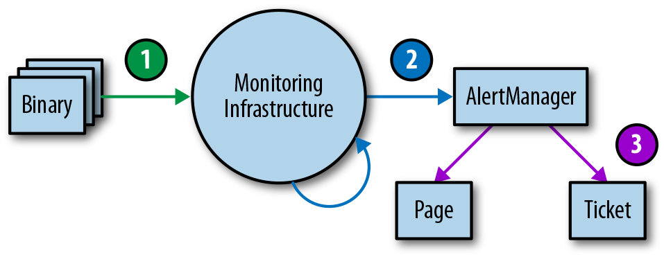

## Monitoring

By Jess Frame, Anthony Lenton, Steven Thurgood,  
Anton Tolchanov, and Nejc Trdin  
with Carmela Quinito

Monitoring can include many types of data, including metrics, text logging, structured event logging, distributed tracing, and event introspection. While all of these approaches are useful in their own right, this chapter mostly addresses metrics and structured logging. In our experience, these two data sources are best suited to SRE’s fundamental monitoring needs.

At the most basic level, monitoring allows you to gain visibility into a system, which is a core requirement for judging service health and diagnosing your service when things go wrong. [Chapter 6](https://sre.google/sre-book/monitoring-distributed-systems/) in the first SRE book provides some basic monitoring definitions and explains that SREs monitor their systems in order to:

- Alert on conditions that require attention.
- Investigate and diagnose those issues.
- Display information about the system visually.
- Gain insight into trends in resource usage or service health for long-term planning.
- Compare the behavior of the system before and after a change, or between two groups in an experiment.

The relative importance of these use cases might lead you to make tradeoffs when selecting or building a monitoring system.

This chapter talks about how Google manages monitoring systems and provides some guidelines for questions that may arise when you’re choosing and running a monitoring system.

# Desirable Features of a Monitoring Strategy

When choosing a monitoring system, it is important to understand and prioritize the features that matter to you. If you’re evaluating different monitoring systems, the attributes in this section can help guide your thinking about which solution(s) best suits your needs. If you already have a monitoring strategy, you might consider using some additional capabilities of your current solution. Depending on your needs, one monitoring system may address all of your use cases, or you may want to use a combination of systems.

### Speed

Different organizations will have different needs when it comes to the freshness of data and the speed of data retrieval.

Data should be available when you need it: freshness impacts how long it will take your monitoring system to page you when something goes wrong. Additionally, slow data might lead you to accidentally act on incorrect data. For example, during incident response, if the time between cause (taking an action) and effect (seeing that action reflected in your monitoring) is too long, you might assume a change had no effect or deduce a false correlation between cause and effect. Data more than four to five minutes stale might significantly impact how quickly you can respond to an incident.

If you’re selecting a monitoring system based upon this criteria, you need to figure out your speed requirements ahead of time. Speed of data retrieval is mostly a problem when you’re querying vast amounts of data. It might take some time for a graph to load if it has to tally up a lot of data from many monitored systems. To speed up your slower graphs, it’s helpful if the monitoring system can create and store new time series based on incoming data; then it can precompute answers to common queries.

### Calculations

Support for calculations can span a variety of use cases, across a range of complexities. At a minimum, you’ll probably want your system to retain data over a multimonth time frame. Without a long-term view of your data, you cannot analyze long-term trends like system growth. In terms of granularity, summary data (i.e., aggregated data that you can’t drill down into) is sufficient to facilitate growth planning. Retaining all detailed individual metrics may help with answering questions like, “Has this unusual behavior happened before?” However, the data might be expensive to store or impractical to retrieve.

The metrics you retain about events or resource consumption should ideally be monotonically incrementing counters. Using counters, your monitoring system can calculate windowed functions over time—for example, to report the rate of requests per second from that counter. Computing these rates over a longer window (up to a month) allows you to implement the building blocks for SLO burn-based alerting (see [Alerting on SLOs](https://sre.google/workbook/alerting-on-slos/)).

Finally, support for a more complete range of statistical functions can be useful because trivial operations may mask bad behavior. A monitoring system that supports computing percentiles (i.e., 50th, 95th, 99th percentiles) when recording latency will let you see if 50%, 5%, or 1% of your requests are too slow, whereas the arithmetic mean can only tell you—without specifics—that the request time is slower. Alternatively, if your system doesn’t support computing percentiles directly, you can achieve this by:

- Obtaining a mean value by summing the seconds spent in requests and dividing by the number of requests
- Logging every request and computing the percentile values by scanning or sampling the log entries

You might want to record your raw metric data in a separate system for offline analysis—for example, to use in weekly or monthly reports, or to perform more intricate calculations that are too difficult to compute in your monitoring system.

### Interfaces

A robust monitoring system should allow you to concisely display time-series data in graphs, and also to structure data in tables or a range of chart styles. Your dashboards will be primary interfaces for displaying monitoring, so it’s important that you choose formats that most clearly display the data you care about. Some options include heatmaps, histograms, and logarithmic scale graphs.

You’ll likely need to offer different views of the same data based upon audience; high-level management may want to view quite different information than SREs. Be specific about creating dashboards that make sense to the people consuming the content. For each set of dashboards, displaying the same types of data consistently is valuable for communication.

You might need to graph information across different aggregations of a metric—such as machine type, server version, or request type—in real time. It’s a good idea for your team to be comfortable with performing ad hoc drill-downs on your data. By slicing your data according to a variety of metrics, you can look for correlations and patterns in the data when you need it.

### Alerts

It’s helpful to be able to classify alerts: multiple categories of alerts allow for proportional responses. The ability to set different severity levels for different alerts is also useful: you might file a ticket to investigate a low rate of errors that lasts more than an hour, while a 100% error rate is an emergency that deserves immediate response.

Alert suppression functionality lets you avoid unnecessary noise from distracting on-call engineers. For example:

- When all nodes are experiencing the same high rate of errors, you can alert just once for the global error rate instead of sending an individual alert for every single node.
- When one of your service dependencies has a firing alert (e.g., a slow backend), you don’t need to alert for error rates of your service.

You also need to be able to ensure alerts are no longer suppressed once the event is over.

The level of control you require over your system will dictate whether you use a third-party monitoring service or deploy and run your own monitoring system. Google developed its own monitoring system in-house, but there are plenty of open source and commercial monitoring systems available.

# Sources of Monitoring Data

Your choice of monitoring system(s) will be informed by the specific sources of [monitoring data](https://sre.google/sre-book/monitoring-distributed-systems/) you’ll use. This section discusses two common sources of monitoring data: logs and metrics. There are other valuable monitoring sources that we won’t cover here, like [distributed tracing](https://microservices.io/patterns/observability/distributed-tracing.html) and runtime introspection.

Metrics are numerical measurements representing attributes and events, typically harvested via many data points at regular time intervals. Logs are an append-only record of events. This chapter’s discussion focuses on structured logs that enable rich query and aggregation tools as opposed to plain-text logs.

Google’s logs-based systems process large volumes of highly granular data. There’s some inherent delay between when an event occurs and when it is visible in logs. For analysis that’s not time-sensitive, these logs can be processed with a batch system, interrogated with ad hoc queries, and visualized with dashboards. An example of this workflow would be using [Cloud Dataflow](https://cloud.google.com/dataflow/) to process logs, [BigQuery](https://cloud.google.com/bigquery/) for ad hoc queries, and [Data Studio](https://datastudio.google.com/c/navigation/reporting) for the dashboards.

By contrast, our metrics-based monitoring system, which collects a large number of metrics from every service at Google, provides much less granular information, but in near real time. These characteristics are fairly typical of other logs- and metrics-based monitoring systems, although there are exceptions, such as real-time logs systems or high-cardinality metrics.

Our alerts and dashboards typically use metrics. The real-time nature of our [metrics-based monitoring system](https://sre.google/sre-book/practical-alerting/) means that engineers can be notified of problems very rapidly. We tend to use logs to find the [root cause of an issue](https://sre.google/sre-book/effective-troubleshooting/), as the information we need is often not available as a metric.

When reporting isn’t time-sensitive, we often generate detailed reports using logs processing systems because logs will nearly always produce more accurate data than metrics.

If you’re alerting based on metrics, it might be tempting to add more alerting based on logs—for example, if you need to be notified when even a single exceptional event happens. We still recommend metrics-based alerting in such cases: you can increment a counter metric when a particular event happens, and configure an alert based on that metric’s value. This strategy keeps all alert configuration in one place, making it easier to manage (see [Managing Your Monitoring System](#managing_your_monitoring_system)).

### Examples

The following real-world examples illustrate how to reason through the process of choosing between monitoring systems.

###### Move information from logs to metrics

*Problem.* The HTTP status code is an important signal to App Engine customers debugging their errors. This information was available in logs, but not in metrics. The metrics dashboard could provide only a global rate of all errors, and did not include any information about the exact error code or the cause of the error. As a result, the workflow to debug an issue involved:

1.  Looking at the global error graph to find a time when an error occurred.
2.  Reading log files to look for lines containing an error.
3.  Attempting to correlate errors in the log file to the graph.

The logging tools did not give a sense of scale, making it hard to know if an error seen in one log line was occurring frequently. The logs also contained many other irrelevant lines, making it hard to track down the root cause.

*Proposed solution.* The App Engine dev team chose to export the HTTP status code as a label on the metric (e.g., `requests_total{status=404}` versus `requests_total​{status=500}`). Because the number of different HTTP status codes is relatively limited, this did not increase the volume of metric data to an impractical size, but did make the most pertinent data available for graphing and alerting.

*Outcome.* This new label meant the team could upgrade the graphs to show separate lines for different error categories and types. Customers could now quickly form conjectures about possible problems based on the exposed error codes. We could now also set different alerting thresholds for client and server errors, making the alerts trigger more accurately.

###### Improve both logs and metrics

*Problem.* One Ads SRE team maintained ~50 services, which were written in a number of different languages and frameworks. The team used logs as the canonical source of truth for SLO compliance. To calculate the error budget, each service used a logs processing script with many service-specific special cases. Here’s an example script to process a log entry for a single service:

``` code-indentation
If the HTTP status code was in the range (500, 599)
AND the 'SERVER ERROR' field of the log is populated
AND DEBUG cookie was not set as part of the request
AND the url did not contain '/reports'
AND the 'exception' field did not contain 'com.google.ads.PasswordException'
THEN increment the error counter by 1
```

These scripts were hard to maintain and also used data that wasn’t available to the metrics-based monitoring system. Because metrics drove alerts, sometimes the alerts would not correspond to user-facing errors. Every alert required an explicit triage step to determine if it was user-facing, which slowed down response time.

*Proposed solution.* The team created a library that hooked into the logic of the framework languages of each application. The library decided if the error was impacting users at request time. The instrumentation wrote this decision in logs and exported it as a metric at the same time, improving consistency. If the metric showed that the service had returned an error, the logs contained the exact error, along with request-related data to help reproduce and debug the issue. Correspondingly, any SLO-impacting error that manifested in the logs also changed the SLI metrics, which the team could then alert on.

*Outcome.* By introducing a uniform control surface across multiple services, the team reused tooling and alerting logic instead of implementing multiple custom solutions. All services benefited from removing the complicated, service-specific logs processing code, which resulted in increased scalability. Once alerts were directly tied to SLOs, they were more clearly actionable, so the false-positive rate decreased significantly.

###### Keep logs as the data source

*Problem.* While investigating production issues, one SRE team would often look at the affected entity IDs to determine user impact and root cause. As with the earlier App Engine example, this investigation required data that was available only in logs. The team had to perform one-off log queries for this while they were responding to incidents. This step added time to incident recovery: a few minutes to correctly put together the query, plus the time to query the logs.

*Proposed solution.* The team initially debated whether a metric should replace their log tools. Unlike in the App Engine example, the entity ID could take on millions of different values, so it would not be practical as a metric label.

Ultimately, the team decided to write a script to perform the one-off log queries they needed, and documented which script to run in the alert emails. They could then copy the command directly into a terminal if necessary.

*Outcome.* The team no longer had the cognitive load of managing the correct one-off log query. Accordingly, they could get the results they needed faster (although not as quickly as a metrics-based approach). They also had a backup plan: they could run the script automatically as soon as an alert triggered, and use a small server to query the logs at regular intervals to constantly retrieve semifresh data.

# Managing Your Monitoring System

Your monitoring system is as important as any other service you run. As such, it should be treated with the appropriate level of care and attention.

### Treat Your Configuration as Code

Treating system configuration as code and storing it in the revision control system are common practices that provide some obvious benefits: change history, links from specific changes to your task tracking system, easier rollbacks and linting checks,[^1] and enforced code review procedures.

We strongly recommend also treating monitoring configuration as code (for more on configuration, see [Configuration Design and Best Practices](https://sre.google/workbook/configuration-design/)). A monitoring system that supports intent-based configuration is preferable to systems that only provide web UIs or [CRUD-style](https://en.wikipedia.org/wiki/Create,_read,_update_and_delete) APIs. This configuration approach is standard for many open source binaries that only read a configuration file. Some third-party solutions like [grafanalib](https://github.com/weaveworks/grafanalib) enable this approach for components that are traditionally configured with a UI.

### Encourage Consistency

Large companies with multiple engineering teams who use monitoring need to strike a fine balance: a centralized approach provides consistency, but on the other hand, individual teams may want full control over the design of their configuration.

The right solution depends on your organization. Google’s approach has evolved over time toward convergence on a single framework run centrally as a service. This solution works well for us for a few reasons. A single framework enables engineers to ramp up faster when they switch teams, and makes collaboration during debugging easier. We also have a centralized dashboarding service, where each team’s dashboards are discoverable and accessible. If you easily understand another team’s dashboard, you can debug both your issues and theirs more quickly.

If possible, make basic monitoring coverage effortless. If all your services[^2] export a consistent set of basic metrics, you can automatically collect those metrics across your entire organization and provide a consistent set of dashboards. This approach means that any new component you launch automatically has basic monitoring. Many teams across your company—even nonengineering teams—can use this monitoring data.

### Prefer Loose Coupling

Business requirements change, and your production system will look different a year from now. Similarly, your monitoring system needs to evolve over time as the services it monitors evolve through different patterns of failure.

We recommend keeping the components of your monitoring system loosely coupled. You should have stable interfaces for configuring each component and passing monitoring data. Separate components should be in charge of collecting, storing, alerting, and visualizing your monitoring. Stable interfaces make it easier to swap out any given component for a better alternative.

Splitting functionality into individual components is becoming popular in the open source world. A decade ago, monitoring systems like [Zabbix](https://www.zabbix.com/) combined all functions into a single component. Modern design usually involves separating collection and rule evaluation (with a solution like [Prometheus server](https://prometheus.io/)), long-term time series storage ([InfluxDB](https://www.influxdata.com/)), alert aggregation ([Alertmanager](https://prometheus.io/docs/alerting/alertmanager/)), and dashboarding ([Grafana](https://grafana.com/)).

As of this writing, there are at least two popular open standards for instrumenting your software and exposing metrics:

[statsd](https://github.com/etsy/statsd)

- The metric aggregation daemon initially written by Etsy and now ported to a majority of programming languages.

Prometheus

- An open source monitoring solution with a flexible data model, support for metric labels, and robust histogram functionality. Other systems are now adopting the Prometheus format, and it is being standardized as [OpenMetrics](https://openmetrics.io/).

A separate dashboarding system that can use multiple data sources provides a central and unified overview of your service. Google recently saw this benefit in practice: our legacy monitoring system (Borgmon[^3]) combined dashboards in the same configuration as alerting rules. While migrating to a new system ([Monarch](https://www.youtube.com/watch?v=LlvJdK1xsl4&feature=youtu.be)), we decided to move dashboarding into a separate service ([Viceroy](https://sre.google/sre-book/communication-and-collaboration/)). Because Viceroy was not a component of Borgmon or Monarch, Monarch had fewer functional requirements. Since users could use Viceroy to display graphs based on data from both monitoring systems, they could gradually migrate from Borgmon to Monarch.

# Metrics with Purpose

[Alerting on SLOs](https://sre.google/workbook/alerting-on-slos/) covers how to monitor and alert using SLI metrics when a system’s error budget is under threat. SLI metrics are the first metrics you want to check when SLO-based alerts trigger. These metrics should appear prominently in your service’s dashboard, ideally on its landing page.

When investigating the cause of an SLO violation, you will most likely not get enough information from the SLO dashboards. These dashboards show that you are violating the SLO, but not necessarily why. What other data should the monitoring dashboards display?

We’ve found the following guidelines helpful in implementing metrics. These metrics should provide reasonable monitoring that allows you to investigate production issues and also provide a broad range of information about your service.

### Intended Changes

When diagnosing an SLO-based alert, you need to be able to move from alerting metrics that notify you of user-impacting issues to metrics that tell you what is causing these issues. Recent intended changes to your service might be at fault. Add monitoring that informs you of any changes in production.[^4] To determine the trigger, we recommend the following:

- Monitor the version of the binary.
- Monitor the command-line flags, especially when you use these flags to enable and disable features of the service.
- If configuration data is pushed to your service dynamically, monitor the version of this dynamic configuration.

If any of these pieces of the system aren’t versioned, you should be able to monitor the timestamp at which it was last built or packaged.

When you’re trying to correlate an outage with a rollout, it’s much easier to look at a graph/dashboard linked from your alert than to trawl through your CI/CD (continuous integration/continuous delivery) system logs after the fact.

### Dependencies

Even if your service didn’t change, any of its dependencies might change or have problems, so you should also monitor responses coming from direct dependencies.

It’s reasonable to export the request and response size in bytes, latency, and response codes for each dependency. When choosing the metrics to graph, keep the four [golden signals](https://sre.google/sre-book/monitoring-distributed-systems#xref_monitoring_golden-signals) in mind. You can use additional labels on the metrics to break them down by response code, RPC (remote procedure call) method name, and peer job name.

Ideally, you can instrument the lower-level RPC client library to export these metrics once, instead of asking each RPC client library to export them.[^5] Instrumenting the client library provides more consistency and allows you to monitor new dependencies for free.

You will sometimes come across dependencies that offer a very narrow API, where all functionality is available via a single RPC called Get, Query, or something equally unhelpful, and the actual command is specified as arguments to this RPC. A single instrumentation point in the client library falls short with this type of dependency: you will observe a high variance in latency and some percentage of errors that may or may not indicate that some part of this opaque API is failing entirely. If this dependency is critical, you have a couple of options to monitor it well:

- Export separate metrics to tailor for the dependency, so that the metrics can unpack requests they receive to get at the actual signal.
- Ask the dependency owners to perform a rewrite to export a broader API that supports separate functionality split across separate RPC services and methods.

### Saturation

Aim to monitor and track the usage of every resource the service relies upon. Some resources have hard limits you cannot exceed, like RAM, disk, or CPU quota allocated to your application. Other resources—like open file descriptors, active threads in any thread pools, waiting times in queues, or the volume of written logs—may not have a clear hard limit but still require management.

Depending on the programming language in use, you should monitor additional resources:

- In Java: The heap and [metaspace](https://plumbr.io/outofmemoryerror/metaspace) size, and more specific metrics depending on what type of garbage collection you’re using
- In Go: The number of goroutines

The languages themselves provide varying support to track these resources.

In addition to alerting on significant events as described in [Alerting on SLOs](https://sre.google/workbook/alerting-on-slos/) you might also need to set up alerting that fires when you approach exhaustion for specific resources, such as:

- When the resource has a hard limit
- When crossing a usage threshold causes performance degradation

You should have monitoring metrics to track all resources—even resources that the service manages well. These metrics are vital in capacity and resource planning.

### Status of Served Traffic

It’s a good idea to add metrics or metric labels that allow the dashboards to break down served traffic by status code (unless the metrics your service uses for SLI purposes already include this information). Here are some recommendations:

- For HTTP traffic, monitor all response codes, even if they don’t provide enough signal for alerting, because some can be triggered by incorrect client behavior.
- If you apply rate limits or quota limits to your users, monitor aggregates of how many requests were denied due to lack of quota.

Graphs of this data can help you identify when the volume of errors changes noticeably during a production change.

### Implementing Purposeful Metrics

Each exposed metric should serve a purpose. Resist the temptation of exporting a handful of metrics just because they are easy to generate. Instead, think about how these metrics will be used. Metric design, or lack thereof, has implications.

Ideally, metric values used for alerting change dramatically only when the system enters a problem state, and don’t change when a system is operating normally. On the other hand, metrics for debugging don’t have these requirements—they’re intended to provide insight about what is happening when alerts are triggered. Good debugging metrics will point at some aspect of the system that’s potentially causing the issues. When you write a postmortem, think about which additional metrics would have allowed you to diagnose the issue faster.

# Testing Alerting Logic

In an ideal world, monitoring and alerting code should be subject to the same testing standards as code development. While Prometheus developers are [discussing developing unit tests for monitoring](https://github.com/prometheus/prometheus/issues/1695), there is currently no broadly adopted system that allows you to do this.

At Google, we test our monitoring and alerting using a domain-specific language that allows us to create synthetic time series. We then write assertions based upon the values in a [derived time series](../../sre-book/practical-alerting/), or the firing status and label presence of specific alerts.

Monitoring and alerting is often a multistage process, which therefore calls for multiple families of unit tests. While this area remains largely underdeveloped, should you want to implement monitoring testing at some point, we recommend a three-tiered approach, as shown in [Figure 4-1](#monitoring-testing-environment-tiers).



*Figure 4-1. Monitoring testing environment tiers*

1.  *Binary reporting:* Check that the exported metric variables change in value under certain conditions as expected.
2.  *Monitoring configurations:* Make sure that rule evaluation produces expected results, and that specific conditions produce the expected alerts.
3.  *Alerting configurations:* Test that generated alerts are routed to a predetermined destination, based on alert label values.

If you can’t test your monitoring via synthetic means, or there’s a stage of your monitoring you simply can’t test, consider creating a running system that exports well-known metrics, like number of requests and errors. You can use this system to validate derived time series and alerts. It’s very likely that your alerting rules will not fire for months or years after you configure them, and you need to have confidence that when the metric passes a certain threshold, the correct engineers will be alerted with notifications that make sense.

# Conclusion

Because the SRE role is responsible for the reliability of systems in production, SREs are often required to be intimately familiar with a service’s monitoring system and its features. Without this knowledge, SREs might not know where to look, how to identify abnormal behavior, or how to find the information they need during an emergency.

We hope that by pointing out monitoring system features we find useful and why, we can help you evaluate how well your monitoring strategy fits your needs, explore some additional features you might be able to leverage, and consider changes you might want to make. You’ll probably find it useful to combine some source of metrics and logging in your monitoring strategy; the exact mix you need is highly context-dependent. Make sure to collect metrics that serve a particular purpose. That purpose may be to enable better capacity planning, assist in debugging, or directly notify you about problems.

Once you have monitoring in place, it needs to be visible and useful. To this end, we also recommend testing your monitoring setup. A good monitoring system pays dividends. It is well worth the investment to put substantial thought into what solutions best meet your needs, and to iterate until you get it right.

[^1]: For example, using promtool to verify that your Prometheus config is syntactically correct.

[^2]: You can export basic metrics via a common library: an instrumentation framework like OpenCensus, or a service mesh like Istio.

[^3]: See Chapter 10 of Site Reliability Engineering for Borgmon’s concepts and structure.

[^4]: This is one case where monitoring via logs is appealing, particularly because production changes are relatively infrequent. Whether you use logs or metrics, these changes should be surfaced in your dashboards so they’re easily accessible for debugging production issues.

[^5]: See https://opencensus.io/ for a set of libraries that provides this.
