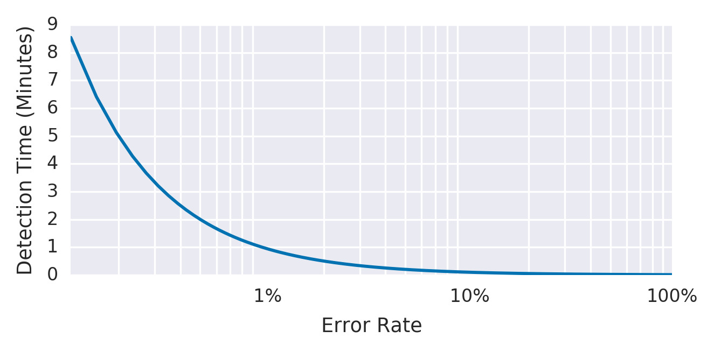
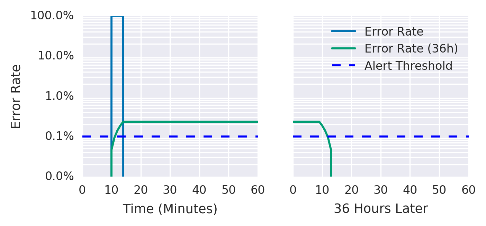
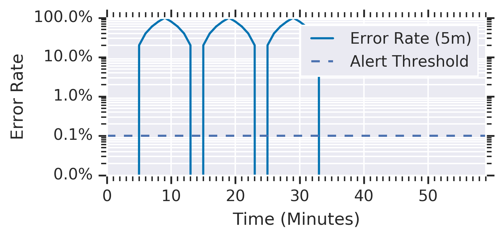
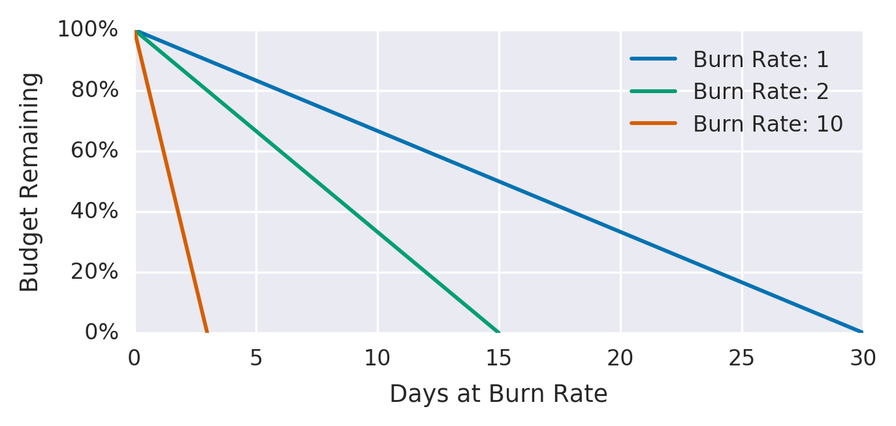
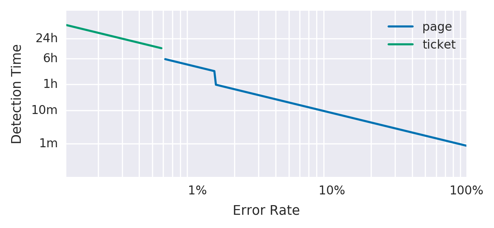
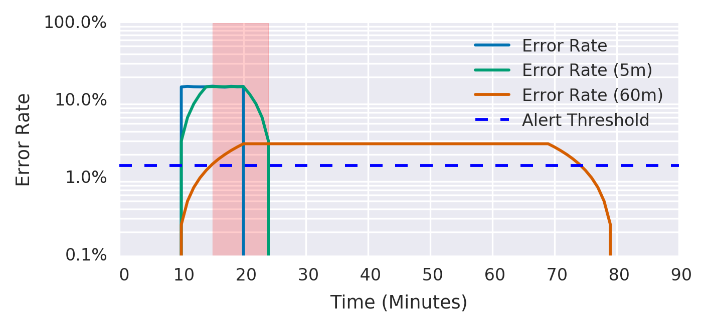

# Alerting on SLOs

By Steven Thurgood  
with Jess Frame, Anthony Lenton,  
Carmela Quinito, Anton Tolchanov, and Nejc Trdin

This chapter explains how to turn your SLOs into actionable alerts on significant events. Both our [first SRE book](https://sre.google/sre-book/table-of-contents/) and this book talk about implementing SLOs. We believe that having good SLOs that measure the reliability of your platform, as experienced by your customers, provides the highest-quality indication for when an on-call engineer should respond. Here we give specific guidance on how to turn those SLOs into alerting rules so that you can respond to problems before you consume too much of your error budget.

Our examples present a series of increasingly complex implementations for alerting metrics and logic; we discuss the utility and shortcomings of each. While our examples use a simple request-driven service and [Prometheus syntax](https://prometheus.io/), you can apply this approach in any alerting framework.

## Alerting Considerations

In order to generate alerts from service level indicators (SLIs) and an [error budget,](https://sre.google/workbook/implementing-slos/) you need a way to combine these two elements into a specific rule. Your goal is to be notified for a significant event: an event that consumes a large fraction of the error budget.

Consider the following attributes when evaluating an alerting strategy:

Precision

- The proportion of events detected that were significant. Precision is 100% if every alert corresponds to a significant event. Note that alerting can become particularly sensitive to nonsignificant events during low-traffic periods (discussed in [Low-Traffic Services and Error Budget Alerting](#low-traffic-services-and-error-budget-alerting)).

Recall

- The proportion of significant events detected. Recall is 100% if every significant event results in an alert.

Detection time

- How long it takes to send notifications in various conditions. Long detection times can negatively impact the error budget.

Reset time

- How long alerts fire after an issue is resolved. Long reset times can lead to confusion or to issues being ignored.

# Ways to Alert on Significant Events

Constructing alert [rules for your SLOs](https://sre.google/sre-book/service-level-objectives/) can become quite complex. Here we present six ways to configure alerting on significant events, in order of increasing fidelity, to arrive at an option that offers good control over the four parameters of precision, recall, detection time, and reset time simultaneously. Each of the following approaches addresses a different problem, and some eventually solve multiple problems at the same time. The first three nonviable attempts work toward the latter three viable alerting strategies, with approach 6 being the most viable and most highly recommended option. The first method is simple to implement but inadequate, while the optimal method provides a complete solution to defend an SLO over both the long and the short term.

For the purposes of this discussion, “error budgets” and “error rates” apply to all SLIs, not just those with “error” in their name. In the section [What to Measure: Using SLIs](/workbook/implementing-slos#what-to-measure-using-slis), we recommend using SLIs that capture the ratio of good events to total events. The error budget gives the number of allowed bad events, and the error rate is the ratio of bad events to total events.

### 1: Target Error Rate ≥ SLO Threshold

For the most trivial solution, you can choose a small time window (for example, 10 minutes) and alert if the error rate over that window exceeds the SLO.

For example, if the SLO is 99.9% over 30 days, alert if the error rate over the previous 10 minutes is ≥ 0.1%:

``` code-indentation
- alert: HighErrorRate
  expr: job:slo_errors_per_request:ratio_rate10m{job="myjob"} >= 0.001
```

> **Note**
>
> This 10-minute average is calculated in Prometheus with a Recording rule:
>
> ``` code-indentation
> record: job:slo_errors_per_request:ratio_rate10m
> expr:
>   sum(rate(slo_errors[10m])) by (job)
>     /
>   sum(rate(slo_requests[10m])) by (job)
> ```
>
> If you don’t export `slo_errors` and `slo_requests` from your job, you can create the time series by renaming a metric:
>
> ``` code-indentation
> record: slo_errors
> expr: http_errors
> ```

Alerting when the recent error rate is equal to the SLO means that the system detects a budget spend of:

alerting window sizereporting period

[Figure 5-1](#detection-time) shows the relationship between detection time and error rate for an example service with an alert window of 10 minutes and a 99.9% SLO.



*Figure 5-1. Detection time for an example service with an alert window of 10 minutes and a 99.9% SLO*

[Table 5-1](#immediate-error-rate-is-too-high) shows the benefits and disadvantages of alerting when the immediate error rate is too high.

<table id="immediate-error-rate-is-too-high">
<caption>Table 5-1.Pros and cons of alerting when the immediate error rate is too high</caption>
<colgroup>
<col style="width: 50%" />
<col style="width: 50%" />
</colgroup>
<thead>
<tr class="header">
<th>Pros</th>
<th>Cons</th>
</tr>
</thead>
<tbody>
<tr class="odd">
<td><p>Detection time is good: 0.6 seconds for a total outage.</p>
<p>This alert fires on any event that threatens the SLO, exhibiting good recall.</p></td>
<td><p>Precision is low: The alert fires on many events that do not threaten the SLO. A 0.1% error rate for 10 minutes would alert, while consuming only 0.02% of the monthly error budget.</p>
<p>Taking this example to an extreme, you could receive up to 144 alerts per day every day, not act upon any alerts, and still meet the SLO.</p></td>
</tr>
</tbody>
</table>

Table 5-1.Pros and cons of alerting when the immediate error rate is too high {#immediate-error-rate-is-too-high}

### 2: Increased Alert Window

We can build upon the preceding example by changing the size of the alert window to improve precision. By increasing the window size, you spend a higher budget amount before triggering an alert.

To keep the [rate of alerts manageable](https://sre.google/sre-book/dealing-with-interrupts/), you decide to be notified only if an event consumes 5% of the 30-day error budget—a 36-hour window:

``` code-indentation
- alert: HighErrorRate
   expr: job:slo_errors_per_request:ratio_rate36h{job="myjob"} > 0.001
```

Now, the detection time is:

1−SLOerror ratio×alerting window size

[Table 5-2](#error-rate-is-too-high-over-a-larger-window) shows the benefits and disadvantages of alerting when the error rate is too high over a larger window of time.

<table id="error-rate-is-too-high-over-a-larger-window">
<caption>Table 5-2.Pros and cons of alerting when the error rate is too high over a larger window of time</caption>
<colgroup>
<col style="width: 50%" />
<col style="width: 50%" />
</colgroup>
<thead>
<tr class="header">
<th>Pros</th>
<th>Cons</th>
</tr>
</thead>
<tbody>
<tr class="odd">
<td><p>Detection time is still good: 2 minutes and 10 seconds for a complete outage.</p>
<p>Better precision than the previous example: by ensuring that the error rate is sustained for longer, an alert will likely represent a significant threat to the error budget.</p></td>
<td><p>Very poor reset time: In the case of 100% outage, an alert will fire shortly after 2 minutes, and continue to fire for the next 36 hours.</p>
<p>Calculating rates over longer windows can be expensive in terms of memory or I/O operations, due to the large number of data points.</p></td>
</tr>
</tbody>
</table>

Table 5-2.Pros and cons of alerting when the error rate is too high over a larger window of time {#error-rate-is-too-high-over-a-larger-window}

[Figure 5-2](#error-rate-over-a-36-hour-period) shows that while the error rate over a 36-hour period has fallen to a negligible level, the 36-hour average error rate remains above the threshold.



*Figure 5-2. Error rate over a 36-hour period*

### 3: Incrementing Alert Duration

Most monitoring systems allow you to add a duration parameter to the alert criteria so the alert won’t fire unless the value remains above the threshold for some time. You may be tempted to use this parameter as a relatively inexpensive way to add longer windows:

``` code-indentation
- alert: HighErrorRate
    expr: job:slo_errors_per_request:ratio_rate1m{job="myjob"} > 0.001
    for: 1h
```

[Table 5-3](#benefits-and-disadvantages-of-using-a-duration) shows the benefits and disadvantages of using a duration parameter for alerts.

<table id="benefits-and-disadvantages-of-using-a-duration">
<caption>Table 5-3.Pros and cons of using a duration parameter for alerts</caption>
<colgroup>
<col style="width: 50%" />
<col style="width: 50%" />
</colgroup>
<thead>
<tr class="header">
<th>Pros</th>
<th>Cons</th>
</tr>
</thead>
<tbody>
<tr class="odd">
<td><p>Alerts can be higher precision. Requiring a sustained error rate before firing means that alerts are more likely to correspond to a significant event.</p></td>
<td><p>Poor recall and poor detection time: Because the duration does not scale with the severity of the incident, a <a href="https://sre.google/workbook/error-budget-policy/">100% outage alerts</a> after one hour, the same detection time as a 0.2% outage. The 100% outage would consume 140% of the 30-day budget in that hour.</p>
<p>If the metric even momentarily returns to a level within SLO, the duration timer resets. An SLI that fluctuates between missing SLO and passing SLO may never alert.</p></td>
</tr>
</tbody>
</table>

Table 5-3.Pros and cons of using a duration parameter for alerts {#benefits-and-disadvantages-of-using-a-duration}

For the reasons listed in [Table 5-3](#benefits-and-disadvantages-of-using-a-duration), we do not recommend using durations as part of your SLO-based alerting criteria.[^1]

[Figure 5-3](#service_with_100percent_error_spikes_ever) shows the average error rate over a 5-minute window of a service with a 10-minute duration before the alert fires. A series of 100% error spikes lasting 5 minutes every 10 minutes never triggers an alert, despite consuming 35% of the error budget.



*Figure 5-3. A service with 100% error spikes every 10 minutes*

Each spike consumed almost 12% of the 30-day budget, yet the alert never triggered.

### 4: Alert on Burn Rate

To improve upon the previous solution, you want to create an alert with good detection time and high precision. To this end, you can introduce a burn rate to reduce the size of the window while keeping the alert budget spend constant.

Burn rate is how fast, relative to the SLO, the service consumes the error budget. [Figure 5-4](#error_budgets_relative_to_burn_rates) shows the relationship between burn rates and error budgets.

The example service uses a burn rate of 1, which means that it’s consuming error budget at a rate that leaves you with exactly 0 budget at the end of the SLO’s time window (see [Chapter 4](https://sre.google/sre-book/service-level-objectives/) in our first book). With an SLO of 99.9% over a time window of 30 days, a constant 0.1% error rate uses exactly all of the error budget: a burn rate of 1.



*Figure 5-4. Error budgets relative to burn rates*

[Table 5-4](#burn_rates_and_time_to_complete_budget_ex) shows burn rates, their corresponding error rates, and the time it takes to exhaust the SLO budget.

| Burn rate | Error rate for a 99.9% SLO | Time to exhaustion |
|-----------|----------------------------|--------------------|
| 1         | 0.1%                       | 30 days            |
| 2         | 0.2%                       | 15 days            |
| 10        | 1%                         | 3 days             |
| 1,000     | 100%                       | 43 minutes         |

Table 5-4.Burn rates and time to complete budget exhaustion {#burn_rates_and_time_to_complete_budget_ex}

By keeping the alert window fixed at one hour and deciding that a 5% error budget spend is significant enough to notify someone, you can derive the burn rate to use for the alert.

For burn rate–based alerts, the time taken for an alert to fire is:

1−SLOerror ratio× alerting window size×burn rate

The error budget consumed by the time the alert fires is:

burn rate × alerting window sizeperiod

Five percent of a 30-day error budget spend over one hour requires a burn rate of 36. The alerting rule now becomes:

``` code-indentation
- alert: HighErrorRate
  expr: job:slo_errors_per_request:ratio_rate1h{job="myjob"} > 36 * 0.001
```

[Table 5-5](#pros_and_cons_of_alerting_based_on_burn_r) shows the benefits and limitations of alerting based on burn rate.

<table id="pros_and_cons_of_alerting_based_on_burn_r">
<caption>Table 5-5.Pros and cons of alerting based on burn rate</caption>
<colgroup>
<col style="width: 50%" />
<col style="width: 50%" />
</colgroup>
<thead>
<tr class="header">
<th>Pros</th>
<th>Cons</th>
</tr>
</thead>
<tbody>
<tr class="odd">
<td><p>Good precision: This strategy chooses a significant portion of error budget spend upon which to alert.</p>
<p>Shorter time window, which is cheaper to calculate.</p>
<p>Good detection time.</p>
<p>Better reset time: 58 minutes.</p></td>
<td><p>Low recall: A 35x burn rate never alerts, but consumes all of the 30-day error budget in 20.5 hours.</p>
<p>Reset time: 58 minutes is still too long.</p></td>
</tr>
</tbody>
</table>

Table 5-5.Pros and cons of alerting based on burn rate {#pros_and_cons_of_alerting_based_on_burn_r}

### 5: Multiple Burn Rate Alerts

Your alerting logic can use multiple burn rates and time windows, and fire alerts when burn rates surpass a specified threshold. This option retains the benefits of alerting on burn rates and ensures that you don’t overlook lower (but still significant) error rates.

It’s also a good idea to set up ticket notifications for incidents that typically go unnoticed but can exhaust your error budget if left unchecked—for example, a 10% budget consumption in three days. This rate of errors catches significant events, but since the rate of budget consumption provides adequate time to address the event, you don’t need to page someone.

We recommend 2% budget consumption in one hour and 5% budget consumption in six hours as reasonable starting numbers for paging, and 10% budget consumption in three days as a good baseline for ticket alerts. The appropriate numbers depend on the service and the baseline page load. For busier services, and depending on on-call responsibilities over weekends and holidays, you may want ticket alerts for the six-hour window.

[Table 5-6](#recommended_time_windows_and_burn_rates_f) shows the corresponding burn rates and time windows for percentages of SLO budget consumed.

| SLO budget consumption | Time window | Burn rate | Notification |
|------------------------|-------------|-----------|--------------|
| 2%                     | 1 hour      | 14.4      | Page         |
| 5%                     | 6 hours     | 6         | Page         |
| 10%                    | 3 days      | 1         | Ticket       |

Table 5-6.Recommended time windows and burn rates for percentages of SLO budget consumed {#recommended_time_windows_and_burn_rates_f}

The alerting configuration may look like something like:

``` code-indentation
expr: (
        job:slo_errors_per_request:ratio_rate1h{job="myjob"} > (14.4*0.001)
      or
        job:slo_errors_per_request:ratio_rate6h{job="myjob"} > (6*0.001)
      )
severity: page

expr: job:slo_errors_per_request:ratio_rate3d{job="myjob"} > 0.001
severity: ticket
```

[Figure 5-5](#recommended_time_windows_and_burn_rates_f) shows the detection time and alert type according to the error rate.



*Figure 5-5. Error rate, detection time, and alert notification*

Multiple burn rates allow you to adjust the alert to give appropriate priority based on how quickly you have to respond. If an issue will exhaust the error budget within hours or a few days, sending an active notification is appropriate. Otherwise, a ticket-based notification to address the alert the next working day is more appropriate.[^2]

[Table 5-7](#pros_and_cons_of_using_multiple_burn_rate) lists the benefits and disadvantages of using multiple burn rates.

<table id="pros_and_cons_of_using_multiple_burn_rate">
<caption>Table 5-7.Pros and cons of using multiple burn rates</caption>
<colgroup>
<col style="width: 50%" />
<col style="width: 50%" />
</colgroup>
<thead>
<tr class="header">
<th>Pros</th>
<th>Cons</th>
</tr>
</thead>
<tbody>
<tr class="odd">
<td><p>Ability to adapt the monitoring configuration to many situations according to criticality: alert quickly if the error rate is high; alert eventually if the error rate is low but sustained.</p>
<p>Good precision, as with all fixed-budget portion alert approaches.</p>
<p>Good recall, because of the three-day window.</p>
<p>Ability to choose the most appropriate alert type based upon how quickly someone has to react to defend the SLO.</p></td>
<td><p>More numbers, window sizes, and thresholds to manage and reason about.</p>
<p>An even longer reset time, as a result of the three-day window.</p>
<p>To avoid multiple alerts from firing if all conditions are true, you need to implement alert suppression. For example: 10% budget spend in five minutes also means that 5% of the budget was spent in six hours, and 2% of the budget was spent in one hour. This scenario will trigger three notifications unless the monitoring system is smart enough to prevent it from doing so.</p></td>
</tr>
</tbody>
</table>

Table 5-7.Pros and cons of using multiple burn rates {#pros_and_cons_of_using_multiple_burn_rate}

### 6: Multiwindow, Multi-Burn-Rate Alerts

We can enhance the multi-burn-rate alerts in iteration 5 to notify us only when we’re still actively burning through the budget—thereby reducing the number of false positives. To do this, we need to add another parameter: a shorter window to check if the error budget is still being consumed as we trigger the alert.

A good guideline is to make the short window 1/12 the duration of the long window, as shown in [Figure 5-6](#short_and_long_windows_for_alerting). The graph shows both alerting threshold. After experiencing 15% errors for 10 minutes, the short window average goes over the alerting threshold immediately, and the long window average goes over the threshold after 5 minutes, at which point the alert starts firing. The short window average drops below the threshold 5 minutes after the errors stop, at which point the alert stops firing. The long window average drops below the threshold 60 minutes after the errors stop.



*Figure 5-6. Short and long windows for alerting*

For example, you can send a page-level alert when you exceed the 14.4x burn rate over both the previous one hour and the previous five minutes. This alert fires only once you’ve consumed 2% of the budget, but exhibits a better reset time by ceasing to fire five minutes later, rather than one hour later:

``` code-indentation
expr: (
        job:slo_errors_per_request:ratio_rate1h{job="myjob"} > (14.4*0.001)
      and
        job:slo_errors_per_request:ratio_rate5m{job="myjob"} > (14.4*0.001)
      )
    or
      (
        job:slo_errors_per_request:ratio_rate6h{job="myjob"} > (6*0.001)
      and
        job:slo_errors_per_request:ratio_rate30m{job="myjob"} > (6*0.001)
      )
severity: page

expr: (
        job:slo_errors_per_request:ratio_rate24h{job="myjob"} > (3*0.001)
      and
        job:slo_errors_per_request:ratio_rate2h{job="myjob"} > (3*0.001)
      )
    or
      (
        job:slo_errors_per_request:ratio_rate3d{job="myjob"} > 0.001
      and
        job:slo_errors_per_request:ratio_rate6h{job="myjob"} > 0.001
      )
severity: ticket
```

We recommend the parameters listed in [Table 5-8](#recommended_parameters_for_an_slo_based_a) as the starting point for your SLO-based alerting configuration.

| Severity | Long window | Short window | Burn rate | Error budget consumed |
|----------|-------------|--------------|-----------|-----------------------|
| Page     | 1 hour      | 5 minutes    | 14.4      | 2%                    |
| Page     | 6 hours     | 30 minutes   | 6         | 5%                    |
| Ticket   | 3 days      | 6 hours      | 1         | 10%                   |

Table 5-8.Recommended parameters for a 99.9% SLO alerting configuration {#recommended_parameters_for_an_slo_based_a}

We have found that alerting based on multiple burn rates is a powerful way to implement SLO-based alerting.

[Table 5-9](#pros_and_cons_of_using_multiple_b-id00013) shows the benefits and limitations of using multiple burn rates and window sizes.

<table id="pros_and_cons_of_using_multiple_b-id00013">
<caption>Table 5-9.Pros and cons of using multiple burn rates and window sizes</caption>
<colgroup>
<col style="width: 50%" />
<col style="width: 50%" />
</colgroup>
<thead>
<tr class="header">
<th>Pros</th>
<th>Cons</th>
</tr>
</thead>
<tbody>
<tr class="odd">
<td><p>A flexible alerting framework that allows you to control the type of alert according to the severity of the incident and the requirements of the organization.</p>
<p>Good precision, as with all fixed-budget portion alert approaches.</p>
<p>Good recall, because of the three-day window.</p></td>
<td><p>Lots of parameters to specify, which can make alerting rules hard to manage. For more on managing alerting rules, see <a href="#alerting_at_scale">Alerting at Scale</a>.</p></td>
</tr>
</tbody>
</table>

Table 5-9.Pros and cons of using multiple burn rates and window sizes {#pros_and_cons_of_using_multiple_b-id00013}

# Low-Traffic Services and Error Budget Alerting

The multiwindow, multi-burn-rate approach just detailed works well when a sufficiently high rate of incoming requests provides a meaningful signal when an issue arises. However, these approaches can cause problems for systems that receive a low rate of requests. If a system has either a low number of users or natural low-traffic periods (such as nights and weekends), you may need to alter your approach.

It’s harder to automatically distinguish unimportant events in low-traffic services. For example, if a system receives 10 requests per hour, then a single failed request results in an hourly error rate of 10%. For a 99.9% SLO, this request constitutes a 1,000x burn rate and would page immediately, as it consumed 13.9% of the 30-day error budget. This scenario allows for only seven failed requests in 30 days. Single requests can fail for a large number of ephemeral and uninteresting reasons that aren’t necessarily cost-effective to solve in the same way as large systematic outages.

The best solution depends on the nature of the service: what is the impact[^3] of a single failed request? A high-availability target may be appropriate if failed requests are one-off, high-value requests that aren’t retried. It may make sense from a business perspective to investigate every single failed request. However, in this case, the alerting system notifies you of an error too late.

We recommend a few key options to handle a low-traffic service:

- Generate artificial traffic to compensate for the lack of signal from real users.
- Combine smaller services into a larger service for monitoring purposes.
- Modify the product so that either:
  - It takes more requests to qualify a single incident as a failure.
  - The impact of a single failure is lower.

### Generating Artificial Traffic

A system can synthesize user activity to check for potential errors and high-latency requests. In the absence of real users, your monitoring system can detect synthetic errors and requests, so your on-call engineers can respond to issues before they impact too many actual users.

Artificial traffic provides more signals to work with, and allows you to reuse your existing monitoring logic and SLO values. You may even already have most of the necessary traffic-generating components, such as black-box probers and integration tests.

Generating artificial load does have some downsides. Most services that warrant SRE support are complex, and have a large system control surface. Ideally, the system should be designed and built for monitoring using artificial traffic. Even for a nontrivial service, you can synthesize only a small portion of the total number of user request types. For a stateful service, the greater number of states exacerbates this problem.

Additionally, if an issue affects real users but doesn’t affect artificial traffic, the successful artificial requests hide the real user signal, so you aren’t notified that users see errors.

### Combining Services

If multiple low-traffic services contribute to one overall function, combining their requests into a single higher-level group can detect significant events more precisely and with fewer false positives. For this approach to work, the services must be related in some way—you can combine microservices that form part of the same product, or multiple request types handled by the same binary.

A downside to combining services is that a complete failure of an individual service may not count as a significant event. You can increase the likelihood that a failure will affect the group as a whole by choosing services with a shared failure domain, such as a common backend database. You can still use longer-period alerts that eventually catch these 100% failures for individual services.

### Making Service and Infrastructure Changes

Alerting on significant events aims to provide sufficient notice to mitigate problems before they exhaust the entire error budget. If you can’t adjust the monitoring to be less sensitive to ephemeral events, and generating synthetic traffic is impractical, you might instead consider changing the service to reduce the user impact of a single failed request. For example, you might:

- Modify the client to retry, with exponential backoff and jitter.[^4]
- Set up fallback paths that capture the request for eventual execution, which can take place on the server or on the client.

These changes are useful for high-traffic systems, but even more so for low-traffic systems: they allow for more failed events in the error budget, more signal from monitoring, and more time to respond to an incident before it becomes significant.

### Lowering the SLO or Increasing the Window

You might also want to reconsider if the impact of a single failure on the error budget accurately reflects its impact on users. If a small number of errors causes you to lose error budget, do you really need to page an engineer to fix the issue immediately? If not, users would be equally happy with a lower SLO. With a lower SLO, an engineer is notified only of a larger sustained outage.

Once you have negotiated lowering the SLO with the service’s stakeholders (for example, lowering the SLO from 99.9% to 99%), implementing the change is very simple: if you already have systems in place for reporting, monitoring, and alerting based upon an SLO threshold, simply add the new SLO value to the relevant systems.

Lowering the SLO does have a downside: it involves a product decision. Changing the SLO affects other aspects of the system, such as expectations around system behavior and when to enact the error budget policy. These other requirements may be more important to the product than avoiding some number of low-signal alerts.

In a similar manner, increasing the time window used for the alerting logic ensures alerts that trigger pages are more significant and worthy of attention.

In practice, we use some combination of the following methods to alert for low-traffic services:

- Generating fake traffic, when doing so is possible and can achieve good coverage
- Modifying clients so that ephemeral failures are less likely to cause user harm
- Aggregating smaller services that share some failure mode
- Setting SLO thresholds commensurate with the actual impact of a failed request

# Extreme Availability Goals

Services with an extremely low or an extremely high availability goal may require special consideration. For example, consider a service that has a 90% availability target. [Table 5-8](#recommended_parameters_for_an_slo_based_a) says to page when 2% of the error budget in a single hour is consumed. Because a 100% outage consumes only 1.4% of the budget in that hour, this alert could never fire. If your error budgets are set over long time periods, you may need to tune your alerting parameters.

For services with an extremely high availability goal, the time to exhaustion for a 100% outage is extremely small. A 100% outage for a service with a target monthly availability of 99.999% would exhaust its budget in 26 seconds—which is smaller than the metric collection interval of many monitoring services, let alone the end-to-end time to generate an alert and pass it through notification systems like email and SMS. Even if the alert goes straight to an automated resolution system, the issue may entirely consume the error budget before you can mitigate it.

Receiving notifications that you have only 26 seconds of budget left isn’t necessarily a bad strategy; it’s just not useful for defending the SLO. The only way to defend this level of reliability is to design the system so that the chance of a 100% outage is extremely low. That way, you can fix issues before consuming the budget. For example, if you initially roll out that change to only 1% of your users, and burn your error budget at the same rate of 1%, you now have 43 minutes before you exhaust your error budget. See [Canarying Releases](https://sre.google/workbook/canarying-releases/) for tactics on designing such a system.

# Alerting at Scale

When you scale your service, make sure that your alerting strategy is likewise scalable. You might be tempted to specify custom alerting parameters for individual services. If your service comprises 100 microservices (or equivalently, a single service with 100 different request types), this scenario very quickly accumulates toil and cognitive load that does not scale.

In this case, we strongly advise against specifying the alert window and burn rate parameters independently for each service, because doing so quickly becomes overwhelming.[^5] Once you decide on your alerting parameters, apply them to all your services.

One technique for managing a large number of SLOs is to group request types into buckets of approximately similar availability requirements. For example, for a service with availability and latency SLOs, you can group its request types into the following buckets:

`CRITICAL`

- For request types that are the most important, such as a request when a user logs in to the service.

`HIGH_FAST`

- For requests with high availability and low latency requirements. These requests involve core interactive functionality, such as when a user clicks a button to see how much money their advertising inventory has made this month.

`HIGH_SLOW`

- For important but less latency-sensitive functionality, such as when a user clicks a button to generate a report of all advertising campaigns over the past few years, and does not expect the data to return instantly.

`LOW`

- For requests that must have some availability, but for which outages are mostly invisible to users—for example, polling handlers for account notifications that can fail for long periods of time with no user impact.

`NO_SLO`

- For functionality that is completely invisible to the user—for example, dark launches or alpha functionality that is explicitly outside of any SLO.

By grouping requests rather than placing unique availability and latency objectives on all request types, you can group requests into five buckets, like the example in [Table 5-10](#request_class_buckets_according_to_simila).

| Request class | Availability | Latency @ 90%[^6] | Latency @ 99% |
|---------------|--------------|---------------------|---------------|
| `CRITICAL`    | 99.99%       | 100 ms              | 200 ms        |
| `HIGH_FAST`   | 99.9%        | 100 ms              | 200 ms        |
| `HIGH_SLOW`   | 99.9%        | 1,000 ms            | 5,000 ms      |
| `LOW`         | 99%          | None                | None          |
| `NO_SLO`      | None         | None                | None          |

Table 5-10.Request class buckets according to similar availability requirements and thresholds {#request_class_buckets_according_to_simila}

These buckets provide sufficient fidelity for protecting user happiness, but entail less toil than a system that is more complicated and expensive to manage that probably maps more precisely to the user experience.

# Conclusion

If you set SLOs that are meaningful, understood, and represented in metrics, you can configure alerting to notify an on-caller only when there are actionable, specific threats to the error budget.

The techniques for alerting on significant events range from alerting when your error rate goes above your SLO threshold to using multiple levels of burn rate and window sizes. In most cases, we believe that the multiwindow, multi-burn-rate alerting technique is the most appropriate approach to defending your application’s SLOs.

We hope we have given you the context and tools required to make the right configuration decisions for your own application and organization.

[^1]: Duration clauses can occasionally be useful when you are filtering out ephemeral noise over very short durations. However, you still need to be aware of the cons listed in this section.

[^2]: As described in the introduction to Site Reliability Engineering, pages and tickets are the only valid ways to get a human to take action.

[^3]: The section What to Measure: Using SLIs recommends a style of SLI that scales according to the impact on the user.

[^4]: See “Overloads and Failure” in Site Reliability Engineering.

[^5]: With the exception of temporary changes to alerting parameters, which are necessary when you’re fixing an ongoing outage and you don’t need to receive notifications during that period.

[^6]: Ninety percent of requests are faster than this threshold.
