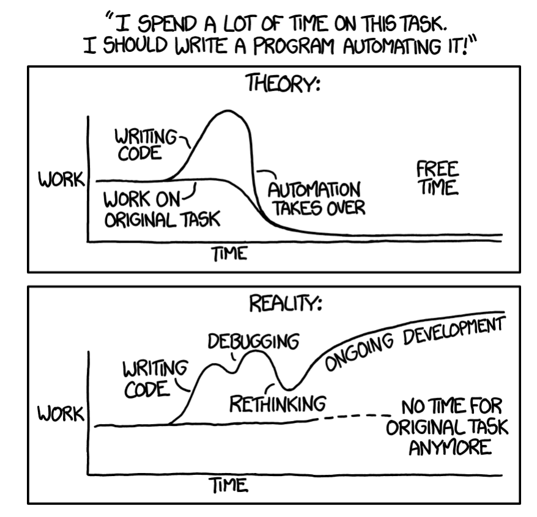
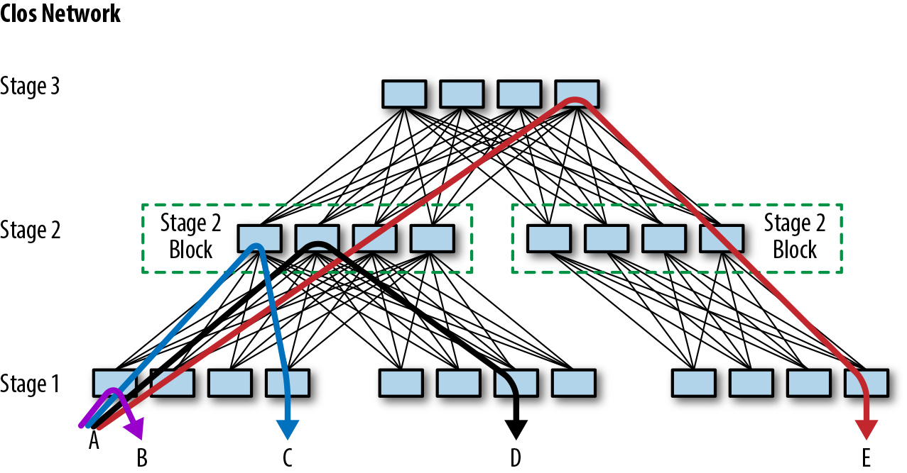
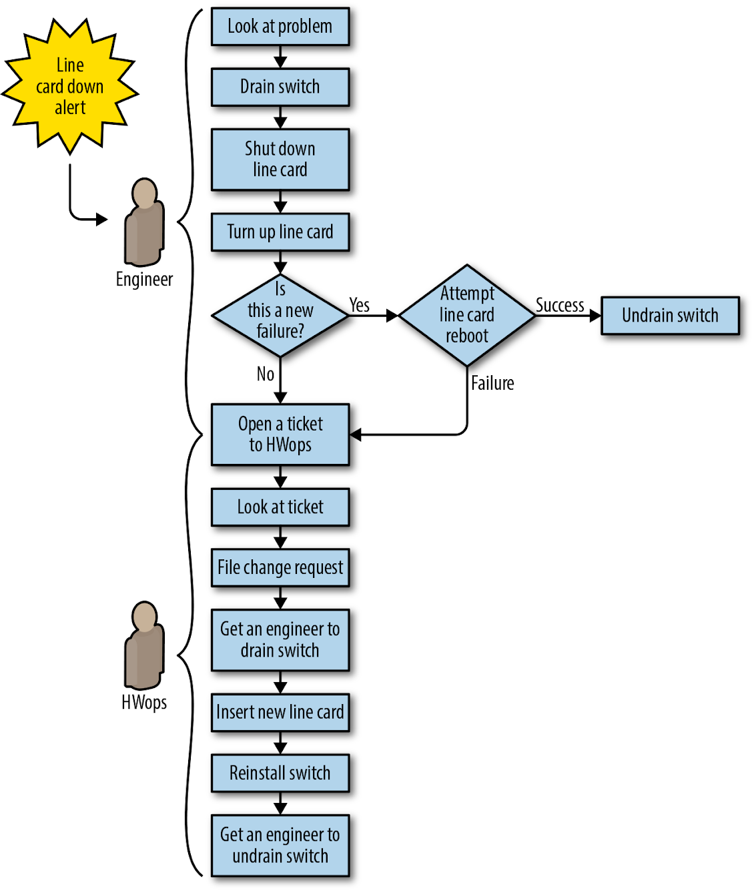
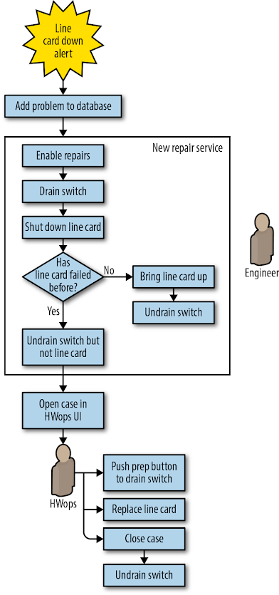
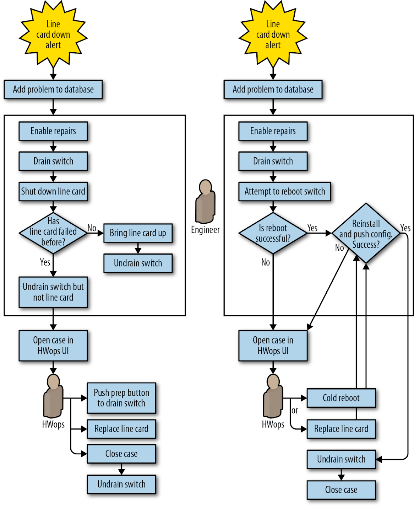
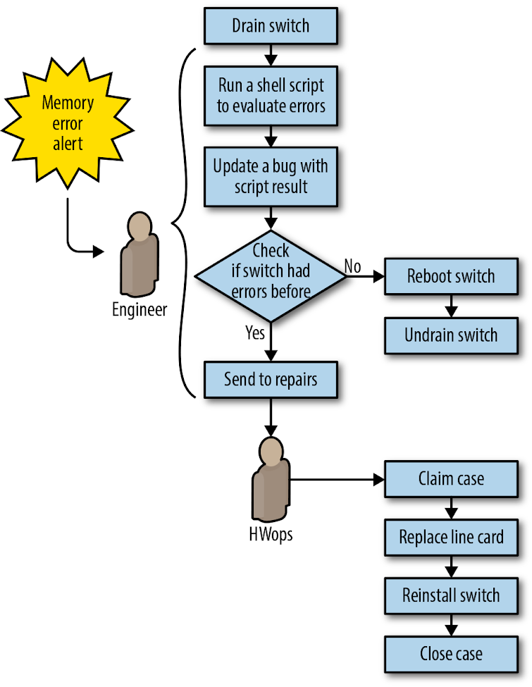
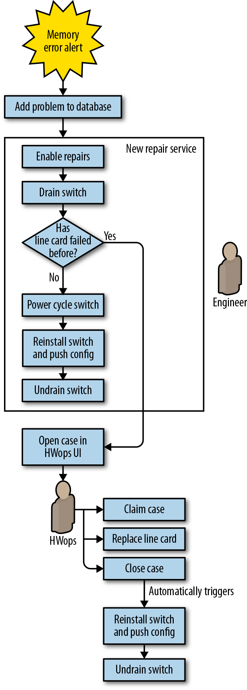
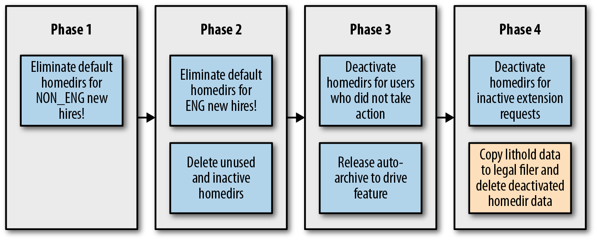
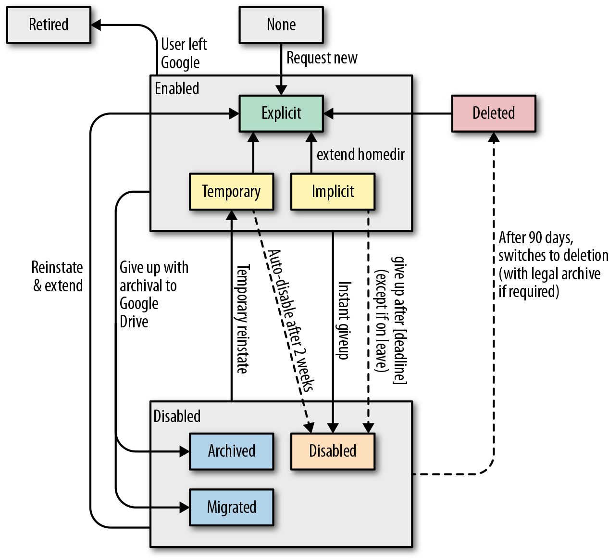

# Eliminating Toil

By David Challoner, Joanna Wijntjes, David Huska,  
Matthew Sartwell, Chris Coykendall, Chris Schrier,  
John Looney, and Vivek Rau  
with Betsy Beyer, Max Luebbe, Alex Perry, and Murali Suriar

Google SREs spend much of their time optimizing—squeezing every bit of performance from a system through project work and developer collaboration. But the scope of optimization isn’t limited to compute resources: it’s also important that SREs optimize how they spend their time. Primarily, we want to avoid performing tasks classified as toil. For a comprehensive discussion of toil, see [Chapter 5](https://sre.google/sre-book/eliminating-toil/) in Site Reliability Engineering. For the purposes of this chapter, we’ll define toil as the repetitive, predictable, constant stream of tasks related to maintaining a service.

Toil is seemingly unavoidable for any team that manages a production service. System maintenance inevitably demands a certain amount of rollouts, upgrades, restarts, alert triaging, and so forth. These activities can quickly consume a team if left unchecked and unaccounted for. Google limits the time SRE teams spend on operational work (including both toil- and non-toil-intensive work) at 50% (for more context on why, see [Chapter 5](https://sre.google/sre-book/eliminating-toil/) in our first book). While this target may not be appropriate for your organization, there’s still an advantage to placing an upper bound on toil, as identifying and quantifying toil is the first step toward optimizing your team’s time.

## What Is Toil?

Toil tends to fall on a spectrum measured by the following characteristics, which are described in our first book. Here, we provide a concrete example for each toil characteristic:

Manual

- When the tmp directory on a web server reaches 95% utilization, engineer Anne logs in to the server and scours the filesystem for extraneous log files to delete.

Repetitive

- A full tmp directory is unlikely to be a one-time event, so the task of fixing it is repetitive.

Automatable[^1]

- If your team has remediation documents with content like “log in to X, execute this command, check the output, restart Y if you see…,” these instructions are essentially pseudocode to someone with software development skills! In the tmp directory example, the solution has been partially automated. It would be even better to fully automate the problem detection and remediation by not requiring a human to run the script. Better still, submit a patch so that the software no longer breaks in this way.

Nontactical/reactive

- When you receive too many alerts along the lines of “disk full” and “server down,” they distract engineers from higher-value engineering and potentially mask other, higher-severity alerts. As a result, the health of the service suffers.

Lacks enduring value

- Completing a task often brings a satisfying sense of accomplishment, but this repetitive satisfaction isn’t a positive in the long run. For example, closing that alert-generated ticket ensured that the user queries continued to flow and HTTP requests continued to serve with status codes \< 400, which is good. However, resolving the ticket today won’t prevent the issue in the future, so the payback has a short duration.

Grows at least as fast as its source

- Many classes of operational work grow as fast as (or faster than) the size of the underlying infrastructure. For example, you can expect time spent performing hardware repairs to increase in lock-step fashion with the size of a server fleet. Physical repair work may unavoidably scale with the number of machines, but ancillary tasks (for example, making software/configuration changes) doesn’t necessarily have to.

Sources of toil may not always meet all of these criteria, but remember that toil comes in many forms. In addition to the preceding traits, consider the effect a particular piece of work has on team morale. Do people enjoy doing a task and find it rewarding, or is it the type of work that’s often neglected because it’s viewed as boring or unrewarding?[^2] Toil can slowly deflate team morale. Time spent working on toil is generally time not spent thinking critically or expressing creativity; reducing toil is an acknowledgment that an engineer’s effort is better utilized in areas where human judgment and expression are possible.

> **Example: Manual Response to Toil**
>
> - by John Looney, Production Engineering Manager at Facebook, and always an SRE at heart
>
> It’s not always clear that a certain chunk of work is toil. Sometimes, a “creative” solution—writing a workaround—is not the right call. Ideally, your organization should reward root-cause fixes over fixes that simply mask a problem.
>
> My first assignment after joining Google (April 2005) was to log in to broken machines, investigate why they were broken, then fix them or send them to a hardware technician. This task seemed simple until I realized there were over 20,000 broken machines at any given time!
>
> The first broken machine I investigated had a root filesystem that was completely full with gigabytes of nonsense logs from a Google-patched network driver. I found another thousand broken machines with the same problem. I shared my plan to address the issue with my teammate: I’d write a script to `ssh` into all broken machines and check if the root filesystem was full. If the filesystem was full, the script would truncate any logs larger than a megabyte in /var/log and restart syslog.
>
> My teammate’s less-than-enthusiastic reaction to my plan gave me pause. He pointed out that it’s better to fix root causes when possible. In the medium to long term, writing a script that masked the severity of the problem would waste time (by not fixing the actual problem) and potentially cause more problems later.
>
> Analysis demonstrated that each server probably cost \$1 per hour. According to my train of thought, shouldn’t cost be the most important metric? I hadn’t considered that if I fixed the symptom, there would be no incentive to fix the root cause: the kernel team’s release test suite didn’t check the volume of logs these machines produced.
>
> The senior engineer directed me at the kernel source so I could find the offensive line of code and log a bug against the kernel team to improve their test suite. My objective cost/benefit analysis showing that the problem was costing Google \$1,000 per hour convinced the devs to fix the problem with my patch.
>
> My patch was turned into a new kernel release that evening, and the next day I rolled it out to the affected machines. The kernel team updated their test suite later the following week. Instead of the short-term endorphin hit of fixing those machines every morning, I now had the more cerebral pleasure of knowing that I’d fixed the problem properly.

# Measuring Toil

How do you know how much of your operational work is toil? And once you’ve decided to take action to reduce toil, how do you know if your efforts were successful or justified? Many SRE teams answer these questions with a combination of experience and intuition. While such tactics might produce results, we can improve upon them.

Experience and intuition are not repeatable, objective, or transferable. Members of the same team or organization often arrive at different conclusions regarding the magnitude of engineering effort lost to toil, and therefore prioritize remediation efforts differently. Furthermore, toil reduction efforts can span quarters or even years (as demonstrated by some of the case studies in this chapter), during which time team priorities and personnel can change. To maintain focus and justify cost over the long term, you need an objective measure of progress. Usually, teams must choose a toil-reduction project from several candidates. An objective measure of toil allows your team to evaluate the severity of the problems and prioritize them to achieve maximum return on engineering investment.

Before beginning toil reduction projects, it’s important to analyze cost versus benefit and to confirm that the time saved through eliminating toil will (at minimum) be proportional to the time invested in first developing and then maintaining an automated solution ([Figure 6-1](#estimate_the_amount_of_time_youapostrophe)). Projects that look “unprofitable” from a simplistic comparison of hours saved versus hours invested might still be well worth undertaking because of the many indirect or intangible benefits of automation. Potential benefits could include:

- Growth in engineering project work over time, some of which will further reduce toil
- Increased team morale and decreased team attrition and burnout
- Less context switching for interrupts, which raises team productivity
- Increased process clarity and standardization
- Enhanced technical skills and career growth for team members
- Reduced training time
- Fewer outages attributable to human errors
- Improved security
- Shorter response times for user requests

*Figure 6-1. Estimate the amount of time you’ll spend on toil reduction efforts, and make sure that the benefits outweigh the cost (source: xkcd.com/1319/)*

So how do we recommend you measure toil?

1.  Identify it. [Chapter 5](https://sre.google/sre-book/eliminating-toil/) of the first SRE book offers guidelines for identifying the toil in your operations. The people best positioned to identify toil depend upon your organization. Ideally, they will be stakeholders, including those who will perform the actual work.
2.  Select an appropriate unit of measure that expresses the amount of human effort applied to this toil. Minutes and hours are a natural choice because they are objective and universally understood. Be sure to account for the cost of context switching. For efforts that are distributed or fragmented, a different well-understood bucket of human effort may be more appropriate. Some examples of units of measure include an applied patch, a completed ticket, a manual production change, a predictable email exchange, or a hardware operation. As long as the unit is objective, consistent, and well understood, it can serve as a measurement of toil.
3.  Track these measurements continuously before, during, and after toil reduction efforts. Streamline the measurement process using tools or scripts so that collecting these measurements doesn’t create additional toil!

# Toil Taxonomy

Toil, like a crumbling bridge or a leaky dam, hides in the banal day to day. The categories in this section aren’t exhaustive, but represent some common categories of toil. Many of these categories seem like “normal” engineering work, and they are. It’s helpful to think of toil as a spectrum rather than a binary classification.

### Business Processes

This is probably the most common source of toil. Maybe your team manages some computing resource—compute, storage, network, load balancers, databases, and so on—along with the hardware that supplies that resource. You deal with onboarding users, configuring and securing their machines, performing software updates, and adding and removing servers to moderate capacity. You also work to minimize cost or waste of that resource. Your team is the human interface to the machine, typically interacting with internal customers who file tickets for their needs. Your organization may even have multiple ticketing systems and work intake systems.

Ticket toil is a bit insidious because ticket-driven business processes usually accomplish their goal. Users get what they want, and because the toil is typically dispersed evenly across the team, the toil doesn’t loudly and obviously call for remediation. Wherever a ticket-driven process exists, there’s a chance that toil is quietly accumulating nearby. Even if you’re not explicitly planning to automate a process, you can still perform process improvement work such as simplification and streamlining—the processes will be easier to automate later, and easier to manage in the meantime.

### Production Interrupts

Interrupts are a general class of time-sensitive janitorial tasks that keep systems running. For example, you may need to fix an acute shortage of some resource (disk, memory, I/O) by manually freeing up disk space or restarting applications that are leaking memory. You may be filing requests to replace hard drives, “kicking” unresponsive systems, or manually tweaking capacity to meet current or expected loads. Generally, interrupts take attention away from more important work.

### Release Shepherding

In many organizations, deployment tools automatically shepherd releases from development to production. Even with automation, thorough code coverage, code reviews, and numerous forms of automated testing, this process doesn’t always go smoothly. Depending on the tooling and release cadence, release requests, rollbacks, emergency patches, and repetitive or manual configuration changes, releases may still generate toil.

### Migrations

You may find yourself frequently migrating from one technology to another. You perform this work manually or with limited scripting because, hopefully, you’re only going to move from X to Y once. Migrations come in many forms, but some examples include changes of data stores, cloud vendors, source code control systems, application libraries, and tooling.

If you approach a large-scale migration manually, the migration quite likely involves [toil](https://sre.google/resources/practices-and-processes/practical-guide-to-cloud-migration/). You may be inclined to execute the migration manually because it’s a one-time effort. While you might even be tempted to view it as “project work” rather than “toil”, migration work can also meet many of the criteria of toil. Technically, modifying backup tooling for one database to work with another is software development, but this work is basically just refactoring code to replace one interface with another. This work is repetitive, and to a large extent, the business value of the backup tooling is the same as before.

### Cost Engineering and Capacity Planning

Whether you own hardware or use an infrastructure provider (cloud), cost engineering and capacity planning usually entail some associated toil. For example:

- Ensuring a cost-effective baseline or burstable capability for future needs across resources like compute, memory, or IOPS (input/output operations per second). This may translate into purchase orders, AWS Reserved Instances, or Cloud/Infrastructure as a Service contract negotiation.
- Preparing for (and recovering from) critical high-traffic events like a product launch or holiday.
- Reviewing downstream and upstream service levels/limits.
- Optimizing workload against different footprint configurations. (Do you want to buy one big box, or four smaller boxes?)
- Optimizing applications against the billing specifics of proprietary cloud service offerings (DynamoDB for AWS or Cloud Datastore for GCP).
- Refactoring tooling to make better use of cheaper “spot” or “preemptable” resources.
- Dealing with oversubscribed resources, either upstream with your infrastructure provider or with your downstream customers.

### Troubleshooting for Opaque Architectures

Distributed microservice architectures are now common, and as systems become more distributed, new failure modes arise. An organization may not have the resources to build sophisticated distributed tracing, high-fidelity monitoring, or detailed dashboards. Even if the business does have these tools, they might not work with all systems. Troubleshooting may even require logging in to individual systems and writing ad hoc log analytics queries with scripting tools.

Troubleshooting itself isn’t inherently bad, but you should aim to focus your energy on novel failure modes—not the same type of failure every week caused by brittle system architecture. With each new critical upstream dependency of availability P, availability decreases by 1 – P due to the combined chance of failure. A four 9s service that adds nine critical four 9s dependencies is now a three 9s service.[^3]

# Toil Management Strategies

We’ve found that performing toil management is critical if you’re operating a production system of any scale. Once you identify and quantify toil, you need a plan for eliminating it. These efforts may take weeks or quarters to accomplish, so it’s important to have a solid overarching strategy.

Eliminating toil at its source is the optimal solution, but if doing so isn’t possible, then you must handle the toil by other means. Before we dive into the specifics of two in-depth case studies, this section provides some general strategies to consider when you’re planning a toil reduction effort. As you’ll observe across the two stories, the nuances of toil vary from team to team (and from company to company), but regardless of specificity, some common tactics ring true for organizations of any size or flavor. Each of the following patterns is illustrated in a concrete way in at least one of the subsequent case studies.

### Identify and Measure Toil

We recommend that you adopt a data-driven approach to identify and compare sources of toil, make objective remedial decisions, and quantify the time saved (return on investment) by toil reduction projects. If your team is experiencing toil overload, treat toil reduction as its own project. Google SRE teams often track toil in bugs and rank toil according to the cost to fix it and the time saved by doing so. See the section [Measuring Toil](#measuring_toil) for techniques and guidance.

### Engineer Toil Out of the System

The optimal strategy for handling toil is to eliminate it at the source. Before investing effort in managing the toil generated by your existing systems and processes, examine whether you can reduce or eliminate that toil by changing the system.

A team that runs a system in production has invaluable experience with how that system works. They know the quirks and tedious bits that cause the most amount of toil. An SRE team should apply this knowledge by working with product development teams to develop operationally friendly software that is not only less toilsome, but also more scalable, secure, and resilient.

### Reject the Toil

A toil-laden team should make data-driven decisions about how best to spend their time and engineering effort. In our experience, while it may seem counterproductive, rejecting a toil-intensive task should be the first option you consider. For a given set of toil, analyze the cost of responding to the toil versus not doing so. Another tactic is to intentionally delay the toil so that tasks accumulate for batch or parallelized processing. Working with toil in larger aggregates reduces interrupts and helps you identify patterns of toil, which you can then target for elimination.

### Use SLOs to Reduce Toil

As discussed in [Implementing SLOs](https://sre.google/workbook/implementing-slos/), services should have a [documented service level objective (SLO)](https://cloudplatform.googleblog.com/2017/01/availability-part-deux--CRE-life-lessons.html). A well-defined SLO enables engineers to make informed decisions. For example, you might ignore certain operational tasks if doing so does not consume or exceed the service’s error budget. An SLO that focuses on overall service health, rather than individual devices, is more flexible and sustainable as the service grows. See [Implementing SLOs](https://sre.google/workbook/implementing-slos/) for guidance on writing effective SLOs.

### Start with Human-Backed Interfaces

If you have a particularly complex business problem with many edge cases or types of requests, consider a partially automated approach as an interim step toward full automation. In this approach, your service receives structured data—usually via a defined API—but engineers may still handle some of the resulting operations. Even if some manual effort remains, this “engineer behind the curtain” approach allows you to incrementally move toward full automation. Use customer input to progress toward a more uniform way of collecting this data; by decreasing free-form requests, you can move closer to handling all requests programmatically. This approach can save back and forth with customers (who now have clear indicators of the information you need) and save you from overengineering a big-bang solution before you’ve fully mapped and understood the domain.

### Provide Self-Service Methods

Once you’ve defined your service offering via a typed interface (see [Start with Human-Backed Interfaces](#start-with-human-backed-interfaces-1)), move to providing self-service methods for users. You can provide a web form, binary or script, API, or even just documentation that tells users how to issue pull requests to your service’s configuration files. For example, rather than asking engineers to file a ticket to provision a new virtual machine for their development work, give them a simple web form or script that triggers the provisioning. Allow the script to gracefully degrade to a ticket for specialized requests or if a failure occurs.[^4] Human-backed interfaces are a good start in the war against toil, but service owners should always aim to make their offerings self-service where possible.

### Get Support from Management and Colleagues

In the short term, toil reduction projects reduce the staff available to address feature requests, performance improvements, and other operational tasks. But if the toil reduction is successful, in the long term the team will be healthier and happier, and have more time for engineering improvements.

It is important for everyone in the organization to agree that toil reduction is a worthwhile goal. Manager support is crucial in defending staff from new demands. Use objective metrics about toil to make the case for pushback.

### Promote Toil Reduction as a Feature

To create strong business cases for toil reduction, look for opportunities to couple your strategy with other desirable features or business goals. If a complementary goal—for example, security, scalability, or reliability—is compelling to your customers, they’ll be more willing to give up their current toil-generating systems for shiny new ones that aren’t as toil intentive. Then, reducing toil is just a nice side effect of helping users!

### Start Small and Then Improve

Don’t try to design the perfect system that eliminates all toil. Automate a few high-priority items first, and then improve your solution using the time you gained by eliminating that toil, applying the lessons learned along the way. Pick clear metrics such as MTTR (Mean Time to Repair) to measure your success.

### Increase Uniformity

At scale, a diverse production environment becomes exponentially harder to manage. Special devices require time-consuming and error-prone ongoing management and incident response. You can use the “pets versus cattle” approach[^5] to add redundancy and enforce consistency in your environment. Choosing what to consider cattle depends on the needs and scale of an organization. It may be reasonable to evaluate network links, switches, machines, racks of machines, or even entire clusters as interchangeable units.

Shifting devices to a cattle philosophy may have a high initial cost, but can reduce the cost of maintenance, disaster recovery, and resource utilization in the medium to long term. Equipping multiple devices with the same interface implies that they have consistent configuration, are interchangeable, and require less maintenance. A consistent interface (to divert traffic, restore traffic, perform a shutdown, etc.) for a variety of devices allows for more flexible and scalable automation.

Google aligns business incentives to encourage engineering teams to unify across our ever-evolving toolkit of internal technologies and tools. Teams are free to choose their own approaches, but they have to own the toil generated by unsupported tools or legacy systems.

### Assess Risk Within Automation

Automation can save countless hours in human labor, but in the wrong circumstances, it can also trigger outages. In general, defensive software is always a good idea; when automation wields admin-level powers, defensive software is crucial. Every action should be assessed for its safety before execution. This includes changes that might reduce serving capacity or redundancy. When you’re implementing automation, we recommend the following practices:

- Handle user input defensively, even if that input is flowing from upstream systems—that is, be sure to validate the input carefully in context.
- Build in safeguards that are equivalent to the types of indirect alerts that a human operator might receive. Safeguards might be as simple as command timeouts, or might be more sophisticated checks of current system metrics or the number of current outages. For this reason, monitoring, alerting, and instrumentation systems should be consumable by both machine and human operators.
- Be aware that even read operations, naively implemented, can spike device load and trigger outages. As automation scales, these safety checks can eventually dominate workload.
- Minimize the impact of outages caused by incomplete safety checks of automation. Automation should default to human operators if it runs into an unsafe condition.

### Automate Toil Response

Once you identify a piece of toil as automatable, it’s worthwhile to consider how to best mirror the human workflow in software. You rarely want to literally transcribe a human workflow into a machine workflow. Also note that automation shouldn’t eliminate human understanding of what’s going wrong.

Once your process is thoroughly documented, try to break down the manual work into components that can be implemented separately and used to create a composable software library that other automation projects can reuse later. As the upcoming datacenter repair case study illustrates, automation often provides the opportunity to reevaluate and simplify human workflows.

### Use Open Source and Third-Party Tools

Sometimes you don’t have to do all of the work to reduce toil yourself. Many efforts like one-off migrations may not justify building their own bespoke tooling, but you’re probably not the first organization to tread this path. Look for opportunities to use or extend third-party or open source libraries to reduce development costs, or at least to help you transition to partial automation.

### Use Feedback to Improve

It’s important to actively seek feedback from other people who interact with your tools, workflows, and automation. Your users will make different assumptions about your tools depending on their understanding of the underlying systems. The less familiar your users are with these systems, the more important it is to actively seek feedback from users. Leverage surveys, user experience (UX) studies, and other mechanisms to understand how your tools are used, and integrate this feedback to produce more effective automation in the future.

Human input is only one dimension of feedback you should consider. Also measure the effectiveness of automated tasks according to metrics like latency, error rate, rework rate, and human time saved (across all groups involved in the process). Ideally, find high-level measures you can compare before and after any automation or toil reduction efforts.

> **Legacy Systems**
>
> Most engineers with SRE-like responsibilities have encountered at least one legacy system in their work. These older systems often introduce problems with respect to user experience, security, reliability, or scalability. They tend to operate like a magical black box in that they “mostly work,” but few people understand how they work. They’re scary and expensive to modify, and keeping them running often requires a good deal of toilsome operational ritual.
>
> The journey away from a legacy system usually follows this path:
>
> 1.  *Avoidance:* There are many reasons to not tackle this problem head on: you may not have the resources to replace this system. You judge the cost and risk to your business as not worth the cost of a replacement. There may not be any substantially better solutions commercially available. Avoidance is effectively choosing to accept technical debt and to move away from SRE principles and toward system administration.
> 2.  *Encapsulation/augmentation:* You can bring SREs on board to build a shell of abstracted APIs, automation, configuration management, monitoring, and testing around these legacy systems that will offload work from SAs. The legacy system remains brittle to change, but now you can at least reliably identify misbehavior and roll back when appropriate. This tactic is still avoidance, but is a bit like refinancing high-interest technical debt into low-interest technical debt. It’s usually a stopgap measure to prepare for an incremental replacement.
> 3.  *Replacement/refactoring:* Replacing a legacy system can require a vast amount of determination, patience, communication, and documentation. It’s best undertaken incrementally. One approach is to define a common interface that sits in front of and abstracts a legacy system. This strategy helps you [slowly and safely migrate users to alternatives](https://18f.gsa.gov/2014/09/08/the-encasement-strategy-on-legacy-systems-and-the/) using [release engineering techniques](../../sre-book/release-engineering/) like canarying or blue-green deployments. Often, the “specification” of a legacy system is really defined only by its historical usage, so it’s helpful to build production-sized data sets of historical expected inputs and outputs to build confidence that new systems aren’t diverging from expected behavior (or are diverging in an expected way).
> 4.  *Retirement/custodial ownership:* Eventually the majority of customers or functionality is migrated to one or more alternatives. To align business incentives, stragglers who haven’t migrated can assume custodial ownership of remnants of the legacy system.

# Case Studies

The following case studies illustrate the strategies for toil reduction just discussed. Each story describes an important area of Google’s infrastructure that reached a point at which it could no longer scale sublinearly with human effort; over time, an increasing number of engineer hours resulted in smaller returns on that investment. Much of that effort you’ll now recognize as toil. For each case study, we detail how the engineers identified, assessed, and mitigated that toil. We also discuss the results and the lessons we learned along the way.

In the first case study, Google’s datacenter networking had a scaling problem: we had a massive number of Google-designed components and links to monitor, mitigate, and repair. We needed a strategy to minimize the toilsome nature of this work for datacenter technicians.

The second case study focuses on a team running their own “outlier” specialized hardware to support toil-intensive business processes that had become deeply entrenched within Google. This case study illustrates benefits of reevaluating and replacing operationally expensive business processes. It demonstrates that with a little persistence and perseverance, it’s possible to move to alternatives even when constrained by the institutional inertia of a large organization.

Taken together, these case studies provide a concrete example of each toil reduction strategy covered earlier. Each case study begins with a list of relevant toil reduction strategies.

# Case Study 1: Reducing Toil in the Datacenter with Automation

> **Note**
>
> Toil reduction strategies highlighted in Case Study 1:
>
> - Engineer toil out of the system
> - Start small and then improve
> - Increase uniformity
> - Use SLOs to reduce toil
> - Assess risk within automation
> - Use feedback to improve
> - Automate toil response

### Background

This case study takes place in Google’s datacenters. Similar to all datacenters, Google’s machines are connected to switches, which are connected to routers. Traffic flows in and out from these routers via links that in turn connect to other routers on the internet. As Google’s requirements for handling internet traffic grew, the number of machines required to serve that traffic increased dramatically. Our datacenters grew in scope and complexity as we figured out how to serve a large amount of traffic efficiently and economically. This growth changed the nature of datacenter manual repairs from occasional and interesting to frequent and rote—two signals of toil.

When Google first began running its own datacenters, each datacenter’s network topology featured a small number of network devices that managed traffic to a large number of machines. A single network device failure could significantly impact network performance, but a relatively small team of engineers could handle troubleshooting the small number of devices. At this early stage, engineers debugged problems and shifted traffic away from failed components manually.

Our next-generation datacenter had significantly more machines and introduced [software-defined networking (SDN) with a folded Clos topology](https://sreworkbook.page.link/B4tU) which greatly increased the number of switches. [Figure 6-2](#480-machines-attached-below-Stage) shows the complexity of traffic flow for a small datacenter Clos switch network. This proportionately larger number of devices meant that a larger number of components could now fail. While each individual failure had less impact on network performance than before, the sheer volume of issues began to overwhelm the engineering staff.

In addition to introducing a heavy load of new problems to debug, the complex layout was confusing to technicians: Which exact links needed to be checked? Which line card[^6] did they need to replace? What was a Stage 2 switch, versus a Stage 1 or Stage 3 switch? Would shutting down a switch create problems for users?

*Figure 6-2. A small Clos network, which supports 480 machines attached below Stage 1*

Repairing failed datacenter line cards was one obvious growing work backlog, so we targeted this task as our first stage of creating datacenter network repair automation. This case study describes how we introduced repair automation for our first generation of line cards (named Saturn). We then discuss the improvements we introduced with the next generation of line cards for Jupiter fabrics.

As shown in [Figure 6-3](#Datacenter-Saturn-line-card-repair), before the automation project, each fix in the datacenter line-card repair workflow required an engineer to do the following:

1.  Check that it was safe to move traffic from the affected switch.
2.  Shift traffic away from the failed device (a “drain” operation).
3.  Perform a reboot or repair (such as replacing a line card).
4.  Shift traffic back to the device (an “undrain” operation).

This unvarying and repetitive work of draining, undraining, and repairing devices is a textbook example of toil. The repetitive nature of the work introduced problems of its own—for example, engineers might multitask by working on a line card while also debugging more challenging problems. As a result, the distracted engineer might accidentally introduce an unconfigured switch back to the network.

*Figure 6-3. Datacenter (Saturn) line-card repair workflow before automation: all steps require manual work*

### Problem Statement

The datacenter repairs problem space had the following dimensions:

- We couldn’t grow the team fast enough to keep up with the volume of failures, and we couldn’t fix problems fast enough to prevent negative impact to the fabric.
- Performing the same steps repeatedly and frequently introduced too many human errors.
- Not all line-card failures had the same impact. We didn’t have a way to prioritize more serious failures.
- Some failures were transient. We wanted the option to restart the line card or reinstall the switch as a first pass at repair. Ideally, we could then programmatically capture the problem if it happened again and flag the device for replacement.
- The new topology required us to manually assess the risk of isolating capacity before we could take action. Every manual risk assessment was an opportunity for human error that could result in an outage. Engineers and technicians on the floor didn’t have a good way to gauge how many devices and links would be impacted by their planned repair.

### What We Decided to Do

Instead of assigning every issue to an engineer for risk assessment, drain, undrain, and validation, we decided to create a framework for automation that, when coupled with an on-site technician where appropriate, could support these operations programmatically.

### Design First Effort: Saturn Line-Card Repair

Our high-level goal was to build a system that would respond to problems detected on network devices, rather than relying on an engineer to triage and fix these problems. Instead of sending a “line card down” alert to an engineer, we wrote the software to request a drain (to remove traffic) and create a case for a technician. The new system had a few notable features:

- We leveraged existing tools where possible. As shown in [Figure 6-3](#Datacenter-Saturn-line-card-repair), our alerting could already detect problems on the fabric line cards; we repurposed that alerting to trigger an automated repair. The new workflow also repurposed our ticketing system to support network repairs.
- We built in automated risk assessment to prevent accidental isolation of devices during a drain and to trigger safety mechanisms where required. This eliminated a huge source of human errors.
- We adopted a strike policy that was tracked by software: the first failure (or strike) only rebooted the card and reinstalled the software. A second failure triggered card replacement and full return to the vendor.

### Implementation

The new automated workflow (shown in [Figure 6-4](#Saturn-line-card-repair-workflow-with-automation)) proceeded as follows:

1.  The problematic line card is detected and a symptom is added to a specific component in the database.
2.  The repair service picks up the problem and enables repairs on the switch. The service performs a risk assessment to confirm that no capacity will be isolated by the operation, and then:
    1.  Drains traffic from the entire switch.
    2.  Shuts down the line card.
    3.  If this is a first failure, reboots the card and undrains the switch, restoring service to the switch. At this point, the workflow is complete.
    4.  If this is the second failure, the workflow proceeds to step 3.
3.  The workflow manager detects the new case and sends it to a pool of repair cases for a technician to claim.
4.  The technician claims the case, sees a red “stop” in the UI (indicating that the switch needs to be drained before repairs are started), and executes the repair in three steps:
    1.  Initiates the chassis drain via a “Prep component” button in the technician UI.
    2.  Waits for the red “stop” to clear, indicating that the drain is complete and the case is actionable.
    3.  Replaces the card and closes the case.
5.  The automated repair system brings the line card up again. After a pause to give the card time to initialize, the workflow manager triggers an operation to restore traffic to the switch and close the repair case.

*Figure 6-4. Saturn line-card repair workflow with automation: manual work required only to push a button and replace the line card*

The new system freed the engineering team from a large volume of toilsome work, giving them more time to pursue productive projects elsewhere: working on Jupiter, the next-generation Clos topology.

### Design Second Effort: Saturn Line-Card Repair Versus Jupiter Line-Card Repair

Capacity requirements in the datacenter continued to double almost every 12 months. As a result, our next-generation datacenter fabric, Jupiter, was more than six times larger than any previous Google fabric. The volume of problems was also six times larger. Jupiter presented scaling challenges for repair automation because thousands of fiber links and hundreds of line cards could fail in each layer. Fortunately, the increase in potential failure points was accompanied by far greater redundancy, which meant we could implement more ambitious automation. As shown in [Figure 6-5](#Saturn-line-card-down-automation) we preserved some of the general workflow from Saturn and added a few important modifications:

- After an automated drain/reboot cycle determined that we wanted to replace hardware, we sent the hardware to a technician. However, instead of requiring a technician to initiate the drain with the “Push prep button to drain switch,” we automatically drained the entire switch when it failed.
- We added automation for installing and pushing the configuration that engages after component replacement.
- We enabled automation for verifying that the repair was successful before undraining the switch.
- We focused attention on recovering the switch without involving a technician unless absolutely necessary.

*Figure 6-5. Saturn line-card down automation (left) versus Jupiter automation (right)*

### Implementation

We adopted a simple and uniform workflow for every line-card problem on Jupiter switches: declare the switch down, drain it, and begin a repair.

The automation carried out the following:

1.  The problem switch-down is detected and a symptom is added to the database.
2.  The repair service picks up the problem and enables repairs on the switch: drain the entire switch, and add a drain reason.
    1.  If this is the second failure within six months, proceed to step 4.
    2.  Otherwise, proceed to step 3.
3.  Attempt (via two distinct methods) to power-cycle the switch.
    1.  If the power-cycle is successful, run automated verification, then install and configure the switch. Remove the repair reason, clear the problem from the database, and undrain the switch.
    2.  If preceding sanity-checking operations fail, send the case to a technician with an instruction message.
4.  If this was the second failure, send the case directly to the technician, requesting new hardware. After the hardware change occurs, run automated verification and then install and configure the switch. Remove the repair reason, clear the problem from the database, and undrain the switch.

This new workflow management was a complete rewrite of the previous repair system. Again, we leveraged existing tools when possible:

- The operations for configuring new switches (install and verify) were the same operations we needed to verify that a switch that had been replaced.
- Deploying new fabrics quickly required the ability to BERT[^7] and cable-audit[^8] programmatically. Before restoring traffic, we reused that capability to automatically run test patterns on links that had fallen into repairs. These tests further improved performance by identifying faulty links.

The next logical improvement was to automate mitigation and repair of memory errors on Jupiter switch line cards. As shown in [Figure 6-6](#Jupiter-memory-error-repair-workflow), prior to automation, this workflow depended heavily on an engineer to determine if the failure was hardware- or software-related, and then to drain and reboot the switch or arrange a repair if appropriate.

*Figure 6-6. Jupiter memory error repair workflow before automation*

Our automation simplified the repair workflow by no longer attempting to troubleshoot memory errors (see [Sometimes imperfect automation is good enough](#Sometimes-imperfect-automation-is-good-enough) for why this made sense). Instead, we treated memory errors the same way we handled failed line cards. To extend automation to memory errors, we simply had to add another symptom to a config file to make it act on the new problem type. [Figure 6-7](#Jupiter-memory-error-repair-workflow-with-automation) depicts the automated workflow for memory errors.

*Figure 6-7. Jupiter memory error repair workflow with automation*

### Lessons Learned

During the several years we worked to automate network repair, we learned a lot of general lessons about how to effectively reduce toil.

###### UIs should not introduce overhead or complexity

For Saturn-based line cards, replacing a line card required draining the entire switch. Draining the entire switch early in the repair process meant losing the working capacity of all line cards on the switch while waiting for replacement parts and a technician. We introduced a button in the UI called “Prep component” that allowed a technician to drain traffic from the entire switch right before they were ready to replace the card, thereby eliminating unnecessary downtime for the rest of the switch (see “Push prep button to drain switch” in [Figure 6-5](#Saturn-line-card-down-automation)).

This aspect of the UI and repair workflow introduced a number of unexpected problems:

- After pressing the button, the technician did not get feedback on drain progress but instead simply had to wait for permission to proceed.
- The button didn’t reliably sync with the actual state of the switch. As a result, sometimes a drained switch did not get repaired, or a technician interrupted traffic by acting upon an undrained switch.
- Components that did not have automation enabled returned a generic “contact engineering” message when a problem arose. Newer technicians did not know the best way to reach someone who could help. Engineers who were contacted were not always immediately available.

In response to user reports and problems with regressions caused by the complexity of the feature, we designed future workflows to ensure the switch was safe and ready for repair before the technician arrived at the switch.

###### Don’t rely on human expertise

We leaned too heavily on experienced datacenter technicians to identify errors in our system (for example, when the software indicated it was safe to proceed with repairs, but the switch was actually undrained). These technicians also had to perform several tasks manually, without being prompted by automation.

Experience is difficult to replicate. In one particularly high-impact episode, a technician decided to expedite the “press button and wait for results” experience by initiating concurrent drains on every line card waiting for repairs at the datacenter, resulting in network congestion and user-visible packet loss. Our software didn’t anticipate and prevent this action because we didn’t test the automation with new technicians.

###### Design reusable components

Where possible, avoid monolithic designs. Build complex automation workflows from separable components, each of which handles a distinct and well-defined task. We could easily reuse or adapt key components of our early Jupiter automation for each successive generation of fabric, and it was easier to add new features when we could build on automation that already existed. Successive variations on Jupiter-type fabrics could leverage work done in earlier iterations.

###### Don’t overthink the problem

We overanalyzed the memory error problem for Jupiter line cards. In our attempts at precise diagnosis, we sought to distinguish software errors (fixable by reboots) from hardware errors (which required card replacement), and also to identify errors that impacted traffic versus errors that did not. We spent nearly three years (2012–2015) collecting data on over 650 discrete memory error problems before realizing this exercise was probably overkill, or at least shouldn’t block our repair automation project.

Once we decided to act upon any error we detected, it was straightforward to use our existing repair automation to implement a simple policy of draining, rebooting, and reinstalling switches in response to memory errors. If the problem recurred, we concluded that the failure was likely hardware-based and requested component replacement. We gathered data over the course of a quarter and discovered that most of the errors were transient—most switches recovered after being rebooted and reinstalled. We didn’t need additional data to perform the repair, so the three-year delay in implementing the automation was unnecessary.

###### Sometimes imperfect automation is good enough

While the ability to verify links with BERT before undraining them was handy, BERT tooling didn’t support network management links. We added these links into the existing link repair automation with a check that allowed them to skip verification. We were comfortable bypassing verification because the links didn’t carry customer traffic, and we could add this functionality later if verification turned out to be important.

###### Repair automation is not fire and forget

Automation can have a very long lifetime, so make sure to plan for project continuity as people leave and join the team. New engineers should be trained on legacy systems so they can fix bugs. Due to parts shortages for Jupiter fabrics, Saturn-based fabrics lived on long after the originally targeted end-of-life date, requiring us to introduce some improvements quite late in Saturn’s overall lifespan.

Once adopted, automation may become entrenched for a long time, with positive and negative consequences. When possible, design your automation to evolve in a flexible way. Relying on inflexible automation makes systems brittle to change. Policy-based automation can help by clearly separating intent from a generic implementation engine, allowing automation to evolve more transparently.

###### Build in risk assessment and defense in depth

After building new tools for Jupiter that determined the risk of a drain operation before executing it, the complexity we encountered led us to introduce a secondary check for defense in depth. The second check established an upper limit for the number of impacted links, and another limit for impacted devices. If we exceeded either threshold, a tracking bug to request further investigation opened automatically. We tuned these limits over time to reduce false positives. While we originally considered this a temporary measure until the primary risk assessment stabilized, the secondary check has proven useful for identifying atypical repair rates due to power outages and software bugs (for one example, see [“Automation: Enabling Failure at Scale”](https://sre.google/sre-book/automation-at-google/) in Site Reliability Engineering).

###### Get a failure budget and manager support

Repair automation can sometimes fail, especially when first introduced. Management support is crucial in preserving the project and empowering the team to persevere. We recommend establishing an error budget for antitoil automation. You should also explain to external stakeholders that automation is essential despite the risk of failures, and that it enables continuous improvement in reliability and efficiency.

###### Think holistically

Ultimately, the complexity of scenarios to be automated is the real hurdle to overcome. Reexamine the system before you work on automating it—can you simplify the system or workflow first?

Pay attention to all aspects of the workflow you are automating, not just the aspects that create toil for you personally. Conduct testing with the people directly involved in the work and actively seek their feedback and assistance. If they make mistakes, find out how your UI could be clearer, or what additional safety checks you need. Make sure your automation doesn’t create new toil—for example, by opening unnecessary tickets that need human attention. Creating problems for other teams will increase resistance to future automation endeavors.

# Case Study 2: Decommissioning Filer-Backed Home Directories

> **Note**
>
> Toil reduction strategies highlighted in Case Study 2:
>
> - Consider decommissioning legacy systems
> - Promote toil reduction as a feature
> - Get support from management and colleagues
> - Reject the toil
> - Start with human-backed interfaces
> - Provide self-service methods
> - Start small and then improve
> - Use feedback to improve

### Background

In the early days of Google, the Corp Data Storage (CDS) SRE team provided home directories to all Googlers. Similar to Active Directory’s Roaming Profiles, common in Enterprise IT, Googlers could use the same home directories across workstations and platforms. The CDS team also offered “Team Shares” for cross-team collaboration in a shared storage space. We provided home directories and Team Shares via a fleet of Netapp Storage Appliances over NFS/CIFS (or “filers”). This storage was operationally expensive but provided a much-needed service to Googlers.

### Problem Statement

As years passed, these filer solutions were mostly deprecated by other, better, storage solutions: our version control systems (Piper[^9]/Git-on-borg[^10]), Google Drive, Google Team Drive, Google Cloud Storage, and an internal, shared, globally distributed filesystem called x20. These alternatives were superior for a number of reasons:

- NFS/CIFS protocols were never designed to operate over a WAN, so user experience rapidly degraded with even a few tens of milliseconds of latency. This created problems for remote workers or globally distributed teams, as the data could live only in one location.
- Compared to alternatives, these appliances were expensive to run and scale.
- It would have taken significant work to make NFS/CIFS protocols compatible with Google’s Beyond Corp[^11] network security model.

Most relevant to this chapter, home directories and Team Shares were toil-intensive. Many facets of storage provisioning were ticket-driven. Although these workflows were often partially scripted, they represented a sizable amount of the CDS team’s toil. We spent a lot of time creating and configuring shares, modifying access, troubleshooting end user issues, and performing turnups and turndowns to manage capacity. CDS also managed the provisioning, racking, and cabling processes for this specialized hardware, in addition to their configuration, updates, and backups. Due to latency requirements, we often had to deploy in remote offices instead of Google datacenters—which sometimes required a team member to travel a substantial distance to manage a deployment.

### What We Decided to Do

First, we gathered data: CDS created a tool called Moonwalk to analyze how employees used our services. We collected traditional business intelligence metrics like daily active users (DAU) and monthly active users (MAU), and asked questions like, “Which job families actually use their home directories?” and “Of the users who use filers every day, what kind of files do they access the most?” Moonwalk, combined with user surveys, validated that the business needs currently served by filers could be better served by alternative solutions that had lower operational overhead and cost. Another compelling business reason led us to move away from filers: if we could migrate most of our filer use cases to G Suite/GCP, then we could use the lessons we learned to improve these products, thereby enabling other large enterprises to migrate to G Suite/GCP.

No single alternative could meet all of the current filer use cases. However, by breaking the problem into smaller addressable components, we found that in aggregate, a handful of alternatives could cover all of our use cases. The alternative solutions were more specialized, but each provided a better user experience than a generalized filer-powered solution. For example:

x20[^12]

- Was a great way for teams to globally share static artifacts like binaries

G Suite Team Drive

- Worked well for office document collaboration, and was much more tolerant of user latency than NFS

Google’s Colossus File System

- Allowed teams to share large data files more securely and scalably than NFS

Piper/Git-on-Borg

- Could better sync dotfiles (engineers’ personalized tool preferences)

A new history-as-a-service tool

- Could host cross-workstation command-line history

As we catalogued use cases and found alternatives, the decommissioning plan took shape.

### Design and Implementation

Moving away from filers was an ongoing, iterative, multiyear effort that entailed multiple internal projects:

Moira

- Home directory decommissioning

Tekmor

- Migrating the long tail of home directory users

Migra

- Team Share decommissioning

Azog

- Retiring home directory/share infrastructure and associated hardware

This case study focuses on the first project, Moira. The subsequent projects built upon what we learned from and created for Moira.

As shown in [Figure 6-8](#The-four-stages-of-Project-Moira), Moira consisted of four phases.

*Figure 6-8. The four stages of Project Moira*

The first step to retiring a legacy system is to stop or (often more realistically) to slow or discourage new adoption. It’s much more painful to take something away from users than never offer it in the first place. Moonwalk data showed that nonengineering Googlers used their shared home directories the least, so our initial phase targeted these users. As the phases grew in scope, so did our confidence in the alternative storage solutions and our migration processes and tooling. Each phase of the project had an associated design document that examined the proposal along dimensions like security, scalability, testing, and launch. We also paid special attention to user experience, expectations, and communication. Our goal was making sure that users affected by each phase understood the reasons for the decommissioning project and the easiest way to archive or migrate their data.

### Key Components

###### Moonwalk

While we had basic statistics about our users’ shares (share sizes, for example), we needed to understand our users’ workflows to help drive business decisions around the deprecation. We set up a system called Moonwalk to gather and report this information.

Moonwalk stored the data about who was accessing what files and when in BigQuery, which allowed us to create reports and perform ad hoc queries to understand our users better. Using BigQuery, we summarized access patterns across 2.5 billion files using 300 terabytes of disk space. This data was owned by 60,000 POSIX users in 400 disk volumes on 124 NAS appliances in 60 geographic sites around the world.

###### Moira Portal

Our large user base made managing the home directory decommissioning effort with a manual ticket-based process untenable. We needed to make the entire process—surveying users, communicating the reasons for the decommissioning project, and walking through either archiving their data or migrating to an alternative—as low-touch as possible. Our final requirements were:

- A landing page describing the project
- A continually updated FAQ
- The status and usage information associated with the current user’s share
- Options to request, deactivate, archive, delete, extend, or reactivate a share

Our business logic became fairly complicated because we had to account for a number of user scenarios. For example, a user might leave Google, go on a temporary leave, or have data under a litigation hold. [Figure 6-9](#Business-logic-based-upon-user-scenarios) provides a sample design doc state diagram illustrating this complexity.

*Figure 6-9. Business logic based upon user scenarios*

The technology powering the portal was relatively simple. Written in Python with the Flask framework, it read and wrote to a Bigtable, and used a number of background jobs and schedulers to manage its work.

###### Archiving and migration automation

We needed a lot of ancillary tooling to glue the portal and configuration management together, and to query and communicate with users. We also needed to be sure we identified the right users for the right communications. False positives (erroneously reporting action required) or false negatives (failing to notify a user that you were taking something away) were both unacceptable, and errors here would mean extra work in the form of lost credibility and customer service.

We worked with alternative storage system owners to add features to their roadmaps. As a result, less mature alternatives became more suitable for filer use cases as the project progressed. We could also use and extend tooling from other teams. For example, we used another team’s internally developed tool to migrate data from Google Cloud Storage to Google Drive as part of the Portal’s auto-archiving functionality.

The effort required substantial software development over the life of the project. We built and iterated upon each component—the Moonwalk reporting pipeline, the portal, and the automation to better manage retiring and archiving shares—in response to the next phase’s requirements and user feedback. We approached a feature-complete state only in phase three (almost two years in); and even then, we needed additional tooling to handle a “long tail” of around 800 users. This low and slow approach had definite benefits. It allowed us to:

- Maintain a lean team (averaging three CDS team members)
- Reduce the disruption to user workflows
- Limit toil for Techstop (Google’s internal technical support organization)
- Build tools on an as-needed basis to avoid wasted engineering effort

As with all engineering decisions, there were tradeoffs: the project would be long-lived, so the team had to endure filer-related operational toil while engineering these solutions.

The program officially completed in 2016. We’ve reduced home directories from 65,000 to around 50 at the time of writing. (The current Azog Project aims to retire these last users and fully decommission the filer hardware.) Our users’ experience has improved, and CDS has retired operationally expensive hardware and processes.

### Lessons Learned

While no one alternative could replace the filer-backed storage that Googlers had used for 14+ years, we didn’t necessarily need a wholesale replacement. By effectively moving up the stack from a generalized but limited filesystem-level solution to multiple application-specific solutions, we traded flexibility for improved scalability, latency tolerance, and security. The Moira team had to anticipate a variety of user journeys and consider alternatives in various stages of maturity. We had to manage expectations around these alternatives: in aggregate, they could provide a better user experience, but getting there wouldn’t be painless. We learned the following lessons about effectively reducing toil along the way.

###### Challenge assumptions and retire expensive business processes

Business requirements drift and new solutions continuously emerge, so it’s worthwhile to periodically question toil-intensive business processes. As we discussed in [Toil Management Strategies](#toil-management-strategies), rejecting toil (deciding not to perform toilsome tasks) is often the simplest way to eliminate it, even though this approach isn’t always quick or easy. Shore up your case with user analytics and business justifications beyond mere toil reduction. The primary business justification for filer decommissioning came down to the benefits of a Beyond Corp security model. So, while Moira was a great way to reduce the CDS team’s toil, emphasizing the many security benefits of decommissioning filers made for a more compelling business case.

###### Build self-service interfaces

We built a custom portal for Moira (which was relatively expensive), but there are often easier alternatives. Many teams at Google manage and configure their services using version control, and process organizational requests in the form of pull requests (called changelists, or CLs). This approach requires little or no involvement from the service’s team, but gives us the benefits of code review and continuous deployment processes to validate, test, and deploy internal service configuration changes.

###### Start with human-backed interfaces

At several points, the Moira team used an “engineer behind the curtain” approach that married automation with manual work by engineers. For example, share requests opened tracking bugs, which our automation updated as we processed the requests. The system also assigned end users bugs to remind them to address their shares. Tickets can serve as a quick and dirty GUI for automation: they keep a log of work, update stakeholders, and provide a simple human fallback mechanism if automation goes awry. In our case, if a user needed help with their migration or if automation couldn’t process their request, the bug was automatically routed to a queue that SREs handled manually.

###### Melt snowflakes

Automation craves conformity. Moira’s engineers chose to retool our automation to either handle share edge cases specifically, or to delete/modify nonconforming shares to match expectations of tooling. This allowed us to approach zero-touch automation for much of the migration processes.

> **Note**
>
> *Fun Fact:* At Google, this practice of changing reality to fit the code rather than the other way around is called “buying the gnome.” This phrase references a legend about Froogle, a shopping search engine from the very early days of the company.
>
> Early in Froogle’s life, a serious search quality bug caused a search for [running shoes] to return a garden gnome (wearing running shoes) as a high-ranking result. After several unsuccessful attempts to fix the bug, someone noticed that the gnome was not a mass-produced item, but a single eBay listing with a Buy It Now option. They purchased the gnome ([Figure 6-10](#The-garden-gnome-that-wouldnt-go-away)).

*Figure 6-10. The garden gnome that wouldn’t go away*

###### Employ organizational nudges

Look for ways to nudge new users to adopt better (and hopefully less toil-intensive) alternatives. In this vein, Moira required escalations for new share or quota requests and recognized users who retired their shares. It’s also important to provide good documentation around service setup, best practices, and when to use your service. Google teams frequently employ codelabs or cookbooks that teach users how to set up and use their service for common use cases. As a result, most user onboarding doesn’t require help from the team that owns the service.

# Conclusion

At minimum, the amount of toil associated with running a production service grows linearly with its complexity and scale. Automation is often the gold standard of toil elimination, and can be combined with a number of other tactics. Even when toil isn’t worth the effort of full automation, you can decrease engineering and operations workloads through strategies like partial automation or changing business processes.

The patterns and methods for eliminating toil described in this chapter can be generalized to work for a variety of other large-scale production services. Eliminating toil frees up engineering time to focus on the more enduring aspects of services, and allows teams to keep manual tasks at a minimum as the complexity and scale of modern service architectures continue to increase.

It’s important to note that eliminating toil isn’t always the best solution. As mentioned throughout this chapter, you should consider the measurable costs associated with identifying, designing, and implementing processes or automation solutions around toil. Once you identify toil, it's crucial to determine when toil reduction makes sense, using metrics, return on investment (ROI) analysis, risk assessment, and iterative development.

Toil usually starts small, and can rapidly grow to consume an entire team. SRE teams must be relentless in eliminating toil, because even if the task seems daunting, the benefits usually exceed the costs. Each of the projects we described required perseverance and dedication from its respective teams, who sometimes battled skepticism or institutional resistance, and who always faced competing high priorities. We hope these stories encourage you to identify your toil, quantify it, and then work toward eliminating it. Even if you can’t invest in a big project today, you can start with a small proof of concept that can help change your team’s willingness to deal with toil.

[^1]: Whether something is automatable is the most subjective characteristic listed here; your perspective will evolve as you gain experience by automating away toil. A problem space that once seemed intractable (or too risky) will become feasible once you get comfortable with “letting the robots do the work.”

[^2]: Some engineers do not mind working on toil for a prolonged period—not everyone’s tolerance threshold for toil is the same. Over the longer term, toil causes career stagnation while promoting burnout-induced turnover. A certain level of toil is unavoidable, but we recommend reducing it where feasible—for the health of the team, the service, and individuals alike.

[^3]: In other words, if a service and its nine dependencies each have 99.99% availability, the aggregate availability of the service will be 0.999910 = 99.9%. For further reading on how dependencies factor into service availability, see "The Calculus of Service Availability".

[^4]: Of course, you won’t be able to handle some one-off cases via self-service (“you want a VM with how much RAM?”), but aim to cover the majority of use cases. Moving 80–90% of requests to self-service is still a huge reduction in workload!

[^5]: In short, moving away from individual specialized devices toward a fleet of devices with a common interface. See Case Study 1: Reducing Toil in the Datacenter with Automation for a detailed explanation of this analogy.

[^6]: A line card is a modular component that usually provides multiple interfaces to the network. It is seated in the backplane of a chassis along with other line cards and components. Modular network switches consist of a chassis that includes a backplane, power entry modules, control card module, and one or more line cards. Each line card supports network connections either to machines or other line cards (in other switches). As with a USB network interface adapter, you can replace any line card without powering down the whole switch, provided the line card has been “drained,” meaning that the other interfaces have been told to stop sending traffic to it.

[^7]: Bit error rate test: check for unhealthy links before restoring service.

[^8]: Check for miscabled ports.

[^9]: Piper is Google’s internal version control system. For more information, see Rachel Potvin and Josh Levenberg, “Why Google Stores Billions of Lines of Code in a Single Repository,” Communications of the ACM 59, no. 7 (2016): 78–87, https://bit.ly/2J4jgMi.

[^10]: Google also has scalable self-service Git hosting for code that doesn’t live in Piper.

[^11]: Beyond Corp is an initiative to move from a traditional perimeter-based security model to a cryptographic identity-based model. When a Google laptop connects to an internal Google service, the service verifies trust through a combination of a cryptographic certificate identifying the laptop, a second factor owned by the user (such as a USB security key), the client device config/state, and the user’s credentials.

[^12]: x20 is an internal globally shared, highly available filesystem with POSIX-like filesystem semantics.
