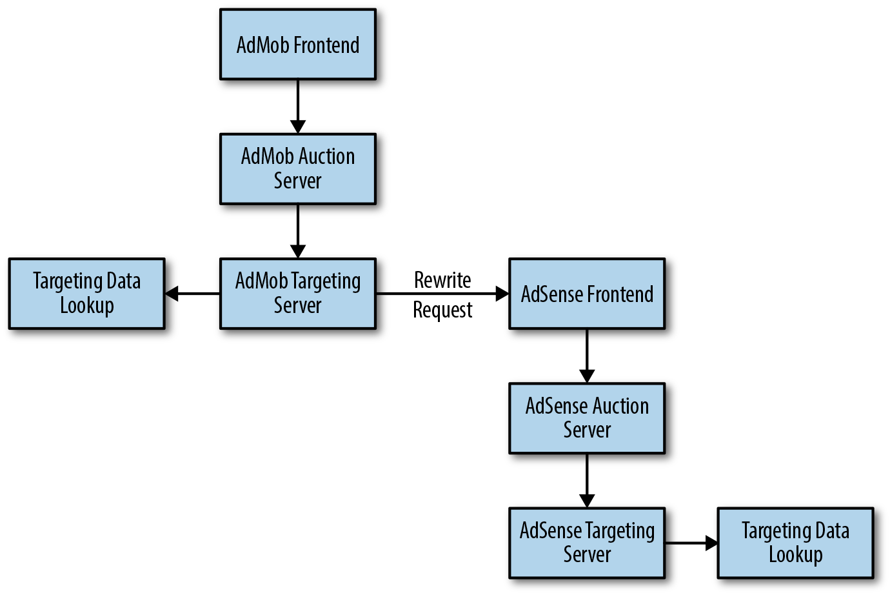
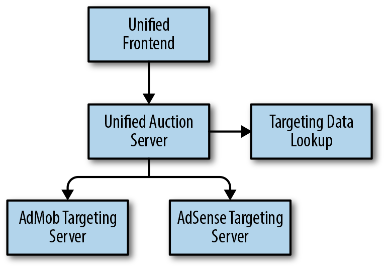

## Simplicity

By John Lunney, Robert van Gent, and Scott Ritchie  
with Diane Bates and Niall Richard Murphy

> A complex system that works is invariably found to have evolved from a simple system that worked.
>
> [Gall’s Law](https://en.wikipedia.org/wiki/John_Gall_(author))

Simplicity is an important goal for SREs, as it strongly correlates with reliability: simple software breaks less often and is easier and faster to fix when it does break. Simple systems are easier to understand, easier to maintain, and easier to test.

For SREs, simplicity is an end-to-end goal: it should extend beyond the code itself to the system architecture and the tools and processes used to manage the software lifecycle. This chapter explores some examples that demonstrate how SREs can measure, think about, and encourage simplicity.

# Measuring Complexity

Measuring the [complexity of software systems](https://sre.google/sre-book/simplicity/) is not an absolute science. There are a number of ways to measure software code complexity, most of which are quite objective.[^1] Perhaps the best-known and most widely available standard is [cyclomatic code complexity](https://en.wikipedia.org/wiki/Cyclomatic_complexity), which measures the number of distinct code paths through a specific set of statements. For example, a block of code with no loops or conditionals has a cyclomatic complexity number (CCN) of 1. The software community is actually quite good at measuring code complexity, and there are measurement tools for a number of integrated development environments (including Visual Studio, Eclipse, and IntelliJ). We’re less adept at understanding whether the resulting measured complexity is necessary or accidental, how the complexity of one method might influence a larger system, and which approaches are best for refactoring.

On the other hand, formal methodologies for measuring system complexity are rare.[^2] You might be tempted to try a CCN-type approach of counting the number of distinct entities (e.g., microservices) and possible communication paths between them. However, for most sizable systems, that number can grow hopelessly large very quickly.

Some more practical proxies for systems-level complexity include:

Training time

- How long does it take a new team member to go on-call? Poor or missing documentation can be a significant source of subjective complexity.

Explanation time

- How long does it take to explain a comprehensive high-level view of the service to a new team member (e.g., diagram the system architecture on a whiteboard and explain the functionality and dependencies of each component)?

Administrative diversity

- How many ways are there to configure similar settings in different parts of the system? Is configuration stored in a centralized place, or in multiple locations?

Diversity of deployed configurations

- How many unique configurations are deployed in production (including binaries, binary versions, flags, and environments)?

Age

- How old is the system? [Hyrum’s Law](https://www.hyrumslaw.com/) states that over time, the users of an API depend on every aspect of its implementation, resulting in fragile and unpredictable behaviors.

While measuring complexity is occasionally worthwhile, it’s difficult. However, there seems to be no serious opposition to the observations that:

- In general, complexity will increase in living software systems unless there is a countervailing effort.
- Providing that effort is a worthwhile thing to do.

# Simplicity Is End-to-End, and SREs Are Good for That

Generally, production systems are not designed in a holistic fashion; rather, they grow organically. They accumulate components and connections over time as teams add new features and launch new products. While a single change might be relatively simple, every change impacts the components around it. Therefore, overall complexity can quickly become overwhelming. For example, adding retries in one component might overload a database and destabilize the whole system, or make it harder to reason about the path a given query follows through the system.

Frequently, the cost of complexity does not directly affect the individual, team, or role that introduces it—in economic terms, complexity is an externality. Instead, complexity impacts those who continue to work in and around it. Thus, it is important to have a champion for [end-to-end system simplicity](https://sre.google/workbook/configuration-design/).

SREs are a natural fit for this role because their work requires them to treat the system as a whole.[^3] In addition to supporting their own services, SREs must also have insight into the systems their service interacts with. Google’s product development teams often don’t have visibility on production-wide issues, so they find it valuable to consult SREs for advice on the design and operation of their systems.

> **Note**
>
> *Reader action:* Before an engineer goes on-call for the first time, encourage them to draw (and redraw) system diagrams. Keep a canonical set of diagrams in your documentation: they’re useful to new engineers and help more experienced engineers keep up with changes.

In our experience, product developers usually end up working in a narrow subsystem or component. As a result, they don’t have a mental model for the overall system, and their teams don’t create system-level architecture diagrams. These diagrams are useful because they help team members visualize system interactions and articulate issues using a common vocabulary. More often than not, we find the SRE team for the service draws the system-level architecture diagrams.

> **Note**
>
> *Reader action:* Ensure that an SRE reviews all major design docs, and that the team documents show how the new design affects the system architecture. If a design adds complexity, the SRE might be able to suggest alternatives that simplify the system.

### Case Study 1: End-to-End API Simplicity

###### Background

In a previous role, one of the chapter authors worked at a startup that used a key/value `bag` data structure in its core libraries. RPCs (remote procedure calls) took a `bag` and returned a `bag`; actual parameters were stored as key/value pairs inside the `bag`. The core libraries supported common operations on `bag`s, such as serialization, encryption, and logging. All of the core libraries and APIs were extremely simple and flexible—success, right?

Sadly, no: the clients of the libraries ended up paying a penalty for the abstract nature of the core APIs. The set of keys and values (and value types) needed to be carefully documented for each service, but usually weren’t. In addition, maintaining backward/forward compatibility became difficult as parameters were added, removed, or changed over time.

###### Lessons learned

Structured data types like [Google’s Protocol Buffers](https://developers.google.com/protocol-buffers/) or [Apache Thrift](https://thrift.apache.org/) might seem more complex than their abstract general-purpose alternatives, but they result in simpler end-to-end solutions because they force upfront design decisions and documentation.

### Case Study 2: Project Lifecycle Complexity

When you review the tangled spaghetti of your existing system, it might be tempting to replace it wholesale with a new, clean, simple system that solves the same problem. Unfortunately, the cost of creating a new system while maintaining the current one might not be worthwhile.

###### Background

[Borg](https://ai.google/research/pubs/pub43438) is Google’s internal container management system. It runs huge numbers of Linux containers and has a wide variety of usage patterns: batch versus production, pipelines versus servers, and more. Over the years, Borg and its surrounding ecosystem grew as hardware changed, features were added, and its scale increased.

[Omega](https://ai.google/research/pubs/pub41684) was intended to be a more principled, cleaner version of Borg that supported the same use cases. However, the planned switch from Borg to Omega had a few serious problems:

- Borg continued to evolve as Omega was developed, so Omega was always chasing a moving target.
- Early estimates of the difficulty of improving Borg proved overly pessimistic, while the expectations for Omega proved overly optimistic (in practice, the grass isn’t always greener).
- We didn’t fully appreciate how difficult it would be to migrate from Borg to Omega. Millions of lines of configuration code across thousands of services and many SRE teams meant that the migration would be extremely costly in terms of engineering and calendar time. During the migration period, which would likely take years, we’d have to support and maintain both systems.

###### What we decided to do

[Eventually](https://sreworkbook.page.link/6DtX), we fed some of the ideas that emerged while designing Omega back into Borg. We also used many of Omega’s concepts to jump-start [Kubernetes](https://kubernetes.io/), an open source container management system.

###### Lessons learned

When considering a rewrite, think about the full project lifecycle, including development toward a moving target, a full migration plan, and extra costs you might incur during the migration time window. Wide APIs with lots of users are very hard to migrate. Don’t compare the expected result to your current system. Instead, compare the expected result to what your current system would look like if you invested the same effort in improving it. Sometimes a rewrite is the best way forward, but make sure you’ve weighed the costs and benefits and that you don’t underestimate the costs.

# Regaining Simplicity

Most simplification work consists of removing elements from a system. Sometimes simplification is direct (e.g., removing a dependency on an unused piece of data fetched from a remote system). Other times, simplification requires redesign. For example, two parts of a system might need access to the same remote data. Rather than fetch it twice, a simpler system might fetch the data once and forward the result.

Whatever the work, leadership must ensure that simplification efforts are celebrated and explicitly prioritized. Simplification is efficiency—instead of saving compute or network resources, it saves engineering time and cognitive load. Treat successful simplification projects just as you treat useful feature launches, and measure and celebrate code addition and removal equally.[^4] For example, Google’s intranet displays a “Zombie Code Slayer” badge for engineers that delete significant amounts of code.

Simplification is a feature. You need to prioritize and staff simplification projects and reserve time for SREs to work on them. If product developers and SREs do not see simplification projects as beneficial to their careers, they won’t undertake these projects. Consider making simplicity an explicit goal for particularly complex systems or overloaded teams. Create a separate bucket of time to do this work. For example, reserve 10% of engineering project time for “simplicity” projects.[^5]

> **Note**
>
> *Reader action:* Have engineers brainstorm known complexities in the system and discuss ideas to reduce them.

As a system grows in complexity, there is a temptation to split SRE teams, focusing each new team on smaller parts of the system. While this is sometimes necessary, the reduced scope of the new teams might lessen their motivation or ability to drive larger simplification projects. Consider designating a small rotating group of SREs who maintain working knowledge of the entire stack (likely with less depth), and can push for conformity and simplification across it.

As previously mentioned, the act of diagramming your system can help you identify deeper design problems that hinder your ability to understand the system and predict its behavior. For example, when diagramming your system, you might look for the following:

Amplification

- When a call returns an error or times out and is retried on several levels, it causes the total number of RPCs to multiply.

Cyclic dependencies

- When a component depends on itself (often indirectly), system integrity can be gravely compromised—in particular, a cold start of the whole system might become impossible.

### Case Study 3: Simplification of the Display Ads Spiderweb

###### Background

Google’s Display Ads business has many related products, including some that originated from acquisitions (DoubleClick, AdMob, Invite Media, etc.). These products had to be adapted to work with Google infrastructure and existing products. For example, we wanted a website using DoubleClick for Publishers to be able to show ads chosen by Google’s AdSense; similarly, we wanted bidders using DoubleClick Bid Manager to have access to the real-time auctions run on Google’s Ad Exchange.

These independently developed products formed a system of interconnected backends that was difficult to reason about. Observing what happened to traffic as it passed through components was difficult, and provisioning the right amount of capacity for each piece was inconvenient and imprecise. At one point, we added tests to make sure we had removed all infinite loops in the query flow.

###### What we decided to do

Ads serving SREs were the natural drivers for standardization: while each component had a specific developer team, SREs were on-call for the entire stack. One of our first undertakings was to draft uniformity standards and work with developer teams to incrementally adopt them. These standards:

- Established a single way to copy large data sets
- Established a single way to perform external data lookups
- Provided common templates for monitoring, provisioning, and configuration

Before this initiative, separate programs provided frontend and auction functionality for each product. As shown in [Figure 7-1](#admob-and-adsense-systems), when an ad request might hit two targeting systems, we rewrote the request to meet the expectations of the second system. This required additional code and processing, and it also opened the possibility of undesirable loops.

*Figure 7-1. Previously, an ad request might hit both the AdMob and AdSense systems*

To [simplify the system](https://sre.google/sre-book/simplicity/), we added logic to common programs that satisfied all of our use cases, along with flags to guard the programs. Over time, we removed the flags and consolidated the functionality into fewer server backends.

Once the servers were unified, the auction server could talk to both targeting servers directly. As shown in [Figure 7-2](#unified-auction-server-now-performs-a-data), when multiple targeting servers needed data lookups, the lookup needed to happen only once in the unified auction server.

*Figure 7-2. The unified auction server now performs a data lookup only once*

###### Lessons learned

It’s best to integrate an already running system into your own infrastructure incrementally.

Just as the presence of very similar functions in a single program represents a “code smell” that indicates deeper design problems, redundant lookups in a single request represent a “system smell.”

When you create well-defined standards with buy-in from SRE and developers, you can provide a clear blueprint for removing complexity that managers are more likely to endorse and reward.

### Case Study 4: Running Hundreds of Microservices on a Shared Platform

by Mike Curtis

###### Background

Over the past 15 years, Google has developed multiple successful product verticals (Search, Ads, and Gmail, to name a few) and produced a steady stream of new and refactored systems. Many of these systems have a dedicated SRE team and a corresponding domain-specific production stack that includes a bespoke development workflow, continuous integration and continuous delivery (CI/CD) software cycles, and monitoring. These unique production stacks incur significant overhead in terms of maintenance, development costs, and independent SRE engagement. They also make it harder to move services (or engineers!) between teams, or to add new services.

###### What we decided to do

A set of SRE teams in the social networking space worked to converge the production stacks for their services into a single managed microservices platform, managed by a single group of SREs. The shared platform is compliant with best practices, and it bundles and automatically configures many previously underused features that improve reliability and facilitate debugging. Regardless of their SRE engagement level, new services within the scope of the SRE team were required to use the common platform, and legacy services had to either migrate to the new platform or be phased out.

After its success in the social network space, the shared platform is gaining adoption with other SRE and non-SRE teams across Google.

###### Design

We used microservices so we could quickly update and deploy features—a single monolithic service changes slowly. Services are managed, not hosted: rather than removing control and responsibility from individual teams, we empower them to manage their services effectively themselves. We provide workflow tools that service teams can use to release, monitor, and more.

The tools we provide include a UI, API, and a command-line interface that SREs and developers use to interact with their stack. The tools make the developer experience feel unified, even when it involves many underlying systems.

###### Outcomes

The platform’s high quality and feature set had an unexpected benefit: developer teams can run hundreds of services without any deep SRE engagement.

The common platform also changed the SRE-developer relationship. As a result, tiered SRE engagement is becoming common at Google. Tiered engagement includes a spectrum of SRE involvement, ranging from light consulting and design reviews to deep engagement (i.e., SREs share on-call duties).

###### Lessons learned

Shifting from sparse or ill-defined standards to a highly standardized platform is a long-term investment. Each step might feel incremental, but ultimately, these steps reduce overhead and make running services at scale possible.

It’s important that developers see the value in such a transition. Aim for incremental productivity wins that are unlocked at each stage of development. Don’t try to convince people to perform a huge refactor that pays off only at the very end.

### Case Study 5: pDNS No Longer Depends on Itself

###### Background

When a client in Google production wants to look up the IP address for a service, it often uses a lookup service called Svelte. In the past, to find the IP address for Svelte, the client used a Google naming service called pDNS (Production DNS). The pDNS service is accessed through a load balancer, which looks up the IP addresses for the actual pDNS servers…using Svelte.

###### Problem statement

pDNS had a transitive dependency on itself, which was unintentionally introduced at some point and only later identified as a reliability concern. Lookups normally didn’t run into issues because the pDNS service is replicated, and the data needed to break out of the dependency loop was always available somewhere in Google production. However, a cold start would have been impossible. In the words of one SRE, “We were like cave dwellers who could only light fires by running with a torch lit from the last campfire.”

###### What we decided to do

We modified a low-level component in Google production to maintain a list of current IP addresses for nearby Svelte servers in local storage for all Google production machines. In addition to breaking the circular dependency described earlier, this change also eliminated an implicit dependency on pDNS for most other Google services.

To avoid similar issues, we also introduced a method for whitelisting the set of services allowed to communicate with pDNS, and slowly worked to reduce that set. As a result, each service lookup in production now has a simpler and more reliable path through the system.

###### Lessons learned

Be careful about your service’s dependencies—use an explicit whitelist to prevent accidental additions. Also, be on the lookout for circular dependencies.

# Conclusion

Simplicity is a natural goal for SREs because simple systems tend to be reliable and easy to run. It’s not easy to quantitatively measure simplicity (or its inverse, complexity) for distributed systems, but there are reasonable proxies, and it’s worth picking some and working to improve them.

Because of their end-to-end understanding of a system, SREs are in an excellent position to identify, prevent, and fix sources of complexity, whether they are found in software design, system architecture, configuration, deployment processes, or elsewhere. SREs should be involved in design discussions early on to provide their unique perspective about the costs and benefits of alternatives, with a particular eye toward simplicity. SREs can also proactively develop standards to homogenize production.

As an SRE, pushing for simplicity is an important part of your job description. We strongly recommend that SRE leadership empower SRE teams to push for simplicity, and to explicitly reward these efforts. Systems inevitably creep toward complexity as they evolve, so the fight for simplicity requires continuous attention and commitment—but it is very much worth pursuing.

[^1]: If you’re interested in learning more, read this recent review of trends in software complexity, or read Horst Zuse, Software Complexity: Measures and Methods (Berlin: Walter de Gruyter, 1991).

[^2]: Although there are examples of it—for example, “Automated Formal Reasoning about AWS Systems”.

[^3]: As a result, SRE may be a useful investment for product development leads who wish to attack complexity as a proxy for technical debt, but find it hard to justify that work within the scope of their existing team.

[^4]: As Dijkstra said, “If we wish to count lines of code, we should not regard them as ‘lines produced’ but as ‘lines spent.’”

[^5]: Reserving some portion of time for simplicity projects (10%, for example) doesn’t mean the team has a green light to introduce complexity with the other 90%. It just means you are setting aside some effort with the specific goal of simplification.
