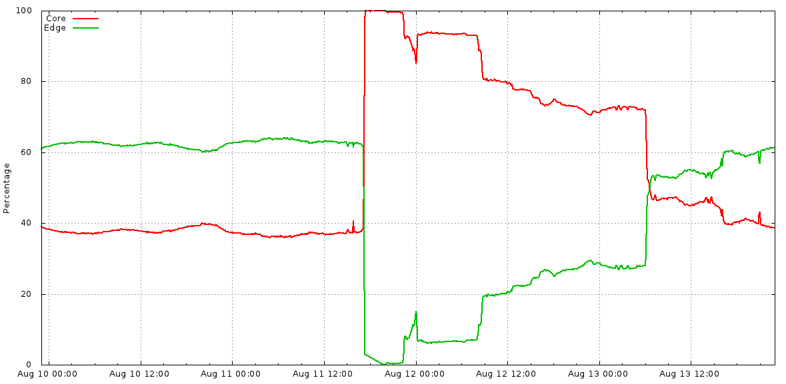
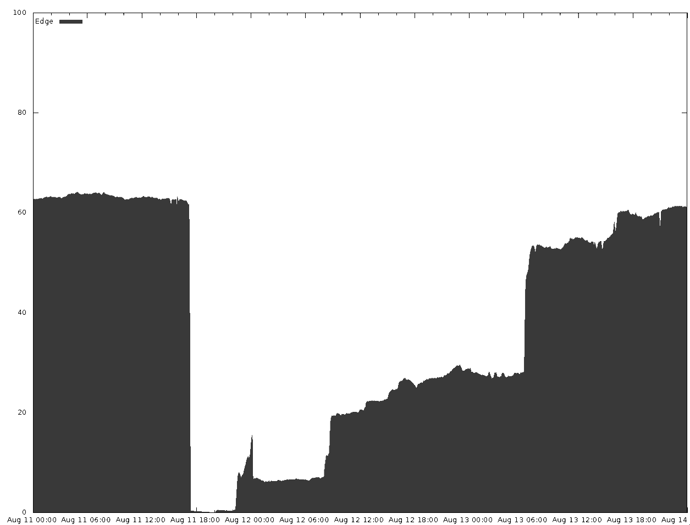
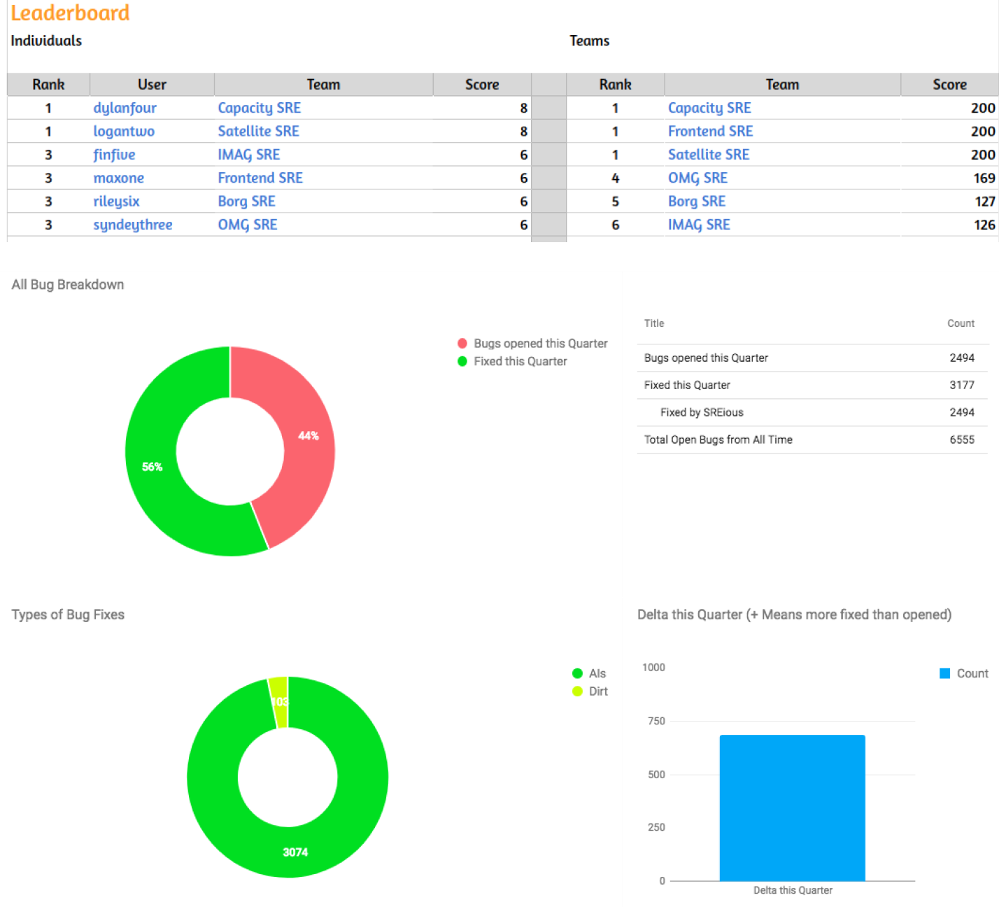
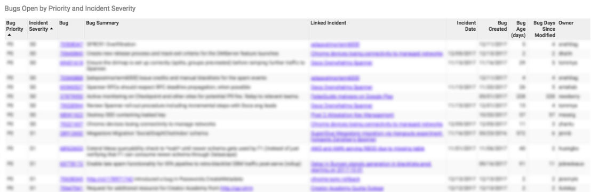
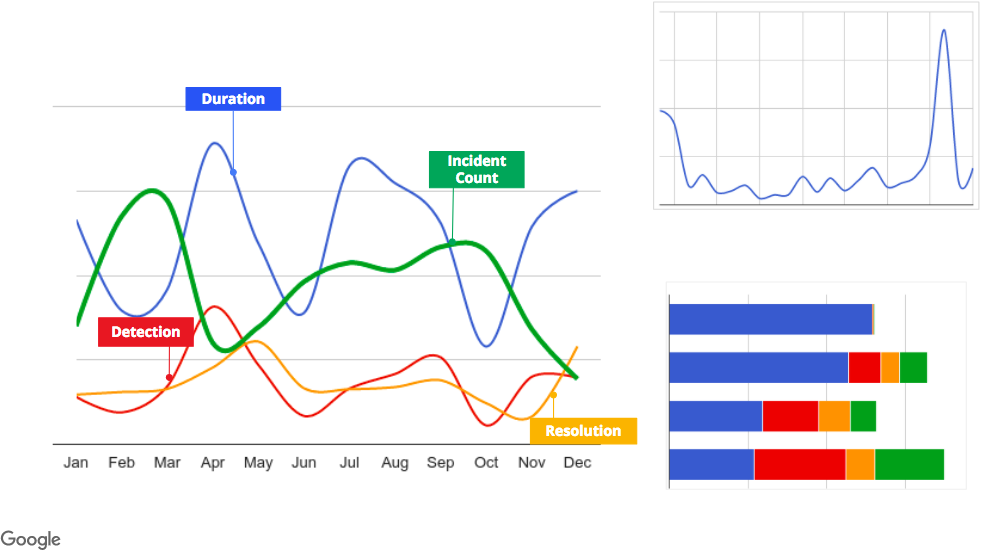

# Postmortem Culture: Learning from Failure

By Daniel Rogers, Murali Suriar, Sue Lueder,  
Pranjal Deo, and Divya Sudhakar  
with Gary O’Connor and Dave Rensin

Our experience shows that a truly blameless postmortem culture results in more reliable systems—which is why we believe this practice is important to creating and maintaining a successful SRE organization.

Introducing postmortems into an organization is as much a cultural change as it is a technical one. Making such a shift can seem daunting. The key takeaway from this chapter is that making this change is possible, and needn’t seem like an insurmountable challenge. Don’t emerge from an incident hoping that your systems will eventually remedy themselves. You can start small by introducing a very basic postmortem procedure, and then reflect and tune your process to best suit your organization—as with many things, there is no one size that fits all.

When written well, acted upon, and widely shared, postmortems can be a very effective tool for driving positive organizational change and preventing repeat outages. To illustrate the principles of good postmortem writing, this chapter presents a case study of an actual outage that happened at Google. An example of a poorly written postmortem highlights the reasons why “bad” postmortem practices are damaging to an organization that’s trying to create a healthy postmortem culture. We then compare the bad postmortem with the actual postmortem that was written after the incident, highlighting the principles and best practices of a high-quality postmortem.

The second part of this chapter shares what we’ve learned about creating incentives for nurturing of a robust postmortem culture and how to recognize (and remedy) the early signs that the culture is breaking down.

Finally, we provide tools and templates that you can use to bootstrap a postmortem culture.

For a comprehensive discussion on blameless postmortem philosophy, see [Chapter 15](https://sre.google/sre-book/postmortem-culture/) in our first book, Site Reliability Engineering.

## Case Study

This case study features a routine rack decommission that led to an increase in service latency for our users. A bug in our maintenance automation, combined with insufficient rate limits, caused thousands of servers carrying production traffic to simultaneously go offline.

While the majority of Google’s servers are located in our proprietary datacenters, we also have racks of proxy/cache machines in colocation facilities (or “colos”). Racks in colos that contain our proxy machines are called satellites. Because satellites undergo regular maintenance and upgrades, a number of satellite racks are being installed or decommissioned at any point in time. At Google, these maintenance processes are largely automated.

The decommission process overwrites the full content of all drives in the rack using a process we call diskerase. Once a machine is sent to diskerase, the data it once stored is no longer retrievable. The steps for a typical rack decommission are as follows:

``` code-indentation

# Get all active machines in "satellite"
machines = GetMachines(satellite)

# Send all candidate machines matching "filter" to decom
SendToDecom(candidates=GetAllSatelliteMachines(),
            filter=machines)
```

Our case study begins with a satellite rack that was marked for decommissioning. The diskerase step of the decommission process finished successfully, but the automation responsible for the remainder of the machine decommission failed. To debug the failure, we retried the decommission process. The second decommission ran as follows:

``` code-indentation
# Get all active machines in "satellite"
machines = GetMachines(satellite)

# "machines" is an empty list, because the decom flow has already run.
# API bug: an empty list is treated as "no filter", rather than "act on no
# machines"

# Send all candidate machines matching "filter" to decom
SendToDecom(candidates=GetAllSatelliteMachines(),
            filter=machines)

# Send all machines in "candidates" to diskerase.
```

Within minutes, the disks of all satellite machines, globally, were erased. The machines were rendered inert and could no longer accept connections from users, so subsequent user connections were routed directly to our datacenters. As a result, users experienced a slight increase in latency. Thanks to good capacity planning, very few of our users noticed the issue during the two days it took us to reinstall machines in the affected colo racks. Following the incident, we spent several weeks auditing and adding more sanity checks to our automation to make our decommission workflow idempotent.

Three years after this outage, we experienced a similar incident: a number of satellites were drained, resulting in increased user latency. The action items implemented from the original postmortem dramatically reduced the blast radius and rate of the second incident.

Suppose you were the person responsible for writing the postmortem for this case study. What would you want to know, and what actions would you propose to prevent this outage from happening again?

Let’s start with a not-so-great postmortem for this incident.

# Bad Postmortem

> **Postmortem: All Satellite Machines Sent to Diskerase**
>
> *2014-August-11*
>
> *Owner:* maxone@, logantwo@, sydneythree@, dylanfour@
>
> *Shared with:* satellite-infra-team@
>
> *Status:* Final
>
> *Incident date:* 2014-August-11
>
> *Published:* 2014-December-30
>
> *Executive Summary*
>
> *Impact:* All Satellite machines are sent to diskerase, which practically wiped out Google Edge.
>
> *Root cause:* dylanfour@ ignored the automation setup and ran the cluster turnup logic manually, which triggered an existing bug.
>
> *Problem Summary*
>
> *Duration of problem:* 40min
>
> *Product(s) affected:* satellite-infra-team
>
> *% of product affected:* All satellite clusters.
>
> *User impact:* All queries that normally go to satellites were served from the core instead, causing increased latency.
>
> *Revenue impact:* Some ads were not served due to the lost queries. Exact revenue impact unknown at this time.
>
> *Detection:*Monitoring alert.
>
> *Resolution:*Diverting traffic to core followed by manual repair of edge clusters.
>
> *Background (optional)*
>
> *Impact*
>
> User impact
>
> - All queries that normally go to satellites were instead served from the core, causing increased latency to user traffic.
>
> Revenue impact
>
> - Some ads were not served due to the lost queries.
>
> *Root Causes and Trigger*
>
> Cluster turnup/turndown automation is not meant to be idempotent. The tool has safeguards to ensure that certain steps cannot be run more than once. Unfortunately, there is nothing to stop someone from running the code manually as many times as they want. None of the documentation mentioned this gotcha. As a result, most team members think it’s okay to run the process multiple times if it doesn’t work.
>
> This is exactly what happened during a routine decommissioning of a rack. The rack was being replaced with a new Iota-based satellite. dylanfour@ completely ignored the fact that the turnup had already executed once and was stuck in the first attempt. Due to careless ignorance, they triggered a bad interaction that assigned all the satellite machines to the diskerase team.
>
> *Recovery Efforts*
>
> *Lessons Learned*
>
> Things that went well
>
> - Alerting caught the issue immediately.
> - Incident management went well.
>
> Things that went poorly
>
> - The team (especially maxone@, logantwo@) never wrote any documentation to tell SREs not to run the automation multiple times, which is ridiculous.
> - On-call did not act soon enough to prevent most satellite machines from being erased. This is not the first time that on-call failed to react in time.
>
> Where we got lucky
>
> - Core was able to serve all the traffic that normally would have gone to the Edge. I can’t believe we survived this one!!!
>
> *Action Items*
>
> | Action Item                                                                                               | Type     | Priority | Owner     | Tracking Bug |
> |-----------------------------------------------------------------------------------------------------------|----------|----------|-----------|--------------|
> | Make automation better.                                                                                   | mitigate | P2       | logantwo@ |              |
> | Improve paging and alerting.                                                                              | detect   | P2       |           |              |
> | sydneythree@ needs to learn proper cross-site handoff protocol so nobody has to work on duplicate issues. | mitigate | P2       |           | BUG6789      |
> | Train humans not to run unsafe commands.                                                                  | prevent  | P2       |           |              |
>
> *Glossary*

### Why Is This Postmortem Bad?

The example “bad” postmortem contains a number of common failure modes that we try to avoid. The following sections explain how to improve upon this postmortem.

###### Missing context

From the outset, our [example postmortem](../../sre-book/example-postmortem/) introduces terminology that’s specific to traffic serving (e.g., “satellites”) and lower layers of machine management automation at Google (e.g., “diskerase”). If you need to provide additional context as part of the postmortem, use the Background and/or Glossary sections (which can link to longer documents). In this case, both sections were blank.

If you don’t properly contextualize content when [writing a postmortem](https://sre.google/sre-book/example-postmortem/), the document might be misunderstood or even ignored. It’s important to remember that your audience extends beyond the immediate team.

###### Key details omitted

Multiple sections contain high-level summaries but lacked important details. For example:

Problem summary

- For outages affecting multiple services, you should present [numbers to give a consistent representation](https://sre.google/workbook/postmortem-analysis/) of impact. The only numerical data our example provides is the duration of the problem. We don’t have enough details to estimate the size or impact of the outage. Even if there is no concrete data, a well-informed estimate is better than no data at all. After all, if you don’t know how to measure it, then you can’t know it’s fixed!

Root causes and trigger

- Identifying the root causes and trigger is one of the most important reasons to write a postmortem. Our example contains a small paragraph that describes the root causes and trigger, but it doesn’t explore the lower-level details of the issue.

Recovery efforts

- A postmortem acts as the record of an incident for its readers. A good postmortem will let readers know what happened, how the issue was mitigated, and how users were impacted. The answers to many of these questions are typically found in the Recovery Efforts section, which was left empty in our example.

If an outage merits a postmortem, you should also take the time to accurately capture and document the necessary details. The reader should get a complete view of the outage and, more importantly, learn something new.

###### Key action item characteristics missing

The Action Items (AIs) section of our example is missing the core aspects of an actionable plan to prevent recurrence. For example:

- The action items are mostly mitigative. To minimize the likelihood of the outage recurring, you should include some preventative action items and fixes. The one “preventative” action item suggests we “make humans less error-prone.” In general, trying to change human behavior is less reliable than changing automated systems and processes. (Or as Dan Milstein [once quipped](https://product.hubspot.com/blog/bid/64771/Post-Mortems-at-HubSpot-What-I-Learned-From-250-Whys): “Let’s plan for a future where we’re all as stupid as we are today.”)
- All of the action items have been tagged with an equal priority. There’s no way to determine which action to tackle first.
- The first two action items in the list use ambiguous phrases like “Improve” and “Make better.” These terms are vague and open to interpretation. Using unclear language makes it difficult to measure and understand success criteria.
- Only one action item was assigned a tracking bug. Without a formal tracking process, action items from postmortems are often forgotten, resulting in outages.

> **Note**
>
> In the words of Ben Treynor Sloss, Google’s VP for 24/7 Operations: “To our users, a postmortem without subsequent action is indistinguishable from no postmortem. Therefore, all postmortems which follow a user-affecting outage must have at least one P[01] bug associated with them. I personally review exceptions. There are very few exceptions.”

###### Counterproductive finger pointing

Every postmortem has the potential to lapse into a blameful narrative. Let’s take a look at some examples:

Things that went poorly

- The entire team is blamed for the outage, while two members (maxone@ and logantwo@) are specifically called out.

Action items

- The last item in the list targets sydneythree@ for succumbing to pressure and mismanaging the cross-site handoff.

Root causes and trigger

- dylanfour@ is held solely responsible for the outage.

It may seem like a good idea to highlight individuals in a postmortem. Instead, this practice leads team members to become risk-averse because they’re afraid of being publicly shamed. They may be motivated to cover up facts critical to understanding and preventing recurrence.

###### Animated language

A postmortem is a factual artifact that should be free from personal judgments and subjective language. It should consider multiple perspectives and be respectful of others. Our example postmortem contains multiple examples of undesirable language:

Root causes and trigger

- Superfluous language (e.g., “careless ignorance”)

Things that went poorly

- Animated text (e.g., “which is ridiculous”)

Where we got lucky

- An exclamation of disbelief (e.g., “I can't believe we survived this one!!!”)

Animated language and dramatic descriptions of events distract from the key message and erode psychological safety. Instead, provide verifiable data to justify the severity of a statement.

###### Missing ownership

Declaring official ownership results in accountability, which leads to action. Our example postmortem contains several examples of missing ownership:

- The postmortem lists four owners. Ideally, an owner is a single point of contact who is responsible for the postmortem, follow-up, and completion.
- The Action Items section has little or no ownership for its entries. Actions items without clear owners are less likely to be resolved.

It’s better to have a single owner and multiple collaborators.

###### Limited audience

Our example postmortem was shared only among members of the team. By default, the document should have been accessible to everyone at the company. We recommend proactively sharing your postmortem as widely as possible—perhaps even with your customers. The value of a postmortem is proportional to the learning it creates. The more people that can learn from past incidents, the less likely they are to be repeated. A thoughtful and honest postmortem is also a key tool in restoring shaken trust.

As your experience and comfort grows, you will also likely expand your “audience” to nonhumans. Mature postmortem cultures often add machine-readable tags (and other metadata) to enable downstream analytics.

###### Delayed publication

Our example postmortem was published four months after the incident. In the interim, had the incident recurred (which in reality, did happen), team members likely would have forgotten key details that a timely postmortem would have captured.

# Good Postmortem

> **Note**
>
> This is an actual postmortem. In some cases, we fictionalized names of individuals and teams. We also replaced actual values with placeholders to protect sensitive capacity information. In the postmortems that you create for your internal consumption, you should absolutely include specific numbers!

> **Postmortem: All Satellite Machines Sent to Diskerase**
>
> *2014-August-11*
>
> *Owner:* Postmortem: maxone@, logantwo@,Datacenter Automation: sydneythree@,Network: dylanfour@,Server Management: finfive@
>
> *Shared with:* [all_engineering_employees@google.com](mailto:%20all_engineering_employees@google.com)
>
> *Status:* Final
>
> *Incident date:* Mon, August 11, 2014, 17:10 to 17:50 PST8PDT
>
> *Published:* Fri, August 15, 2014
>
> *Executive Summary*
>
> *Impact:* Frontend queries dropped,Some ads were not served,There was a latency increase for all services normally served from satellite for nearly two days
>
> *Root cause:* A bug in turndown automation caused all satellite machines, instead of just one rack of satellite machines, to be sent to diskerase. This resulted in all satellite machines entering the decom workflow, which wiped their disks. The result was a global satellite frontend outage.
>
> *Problem Summary*
>
> *Duration of problem:* Main outage: Mon, August 11, 17:10 to 17:50 PST8PDT,
>
> Reconstruction work and residual pains through Wed, August 13, 07:46 PST8PDT, then the incident was closed.
>
> *Product(s) affected:* Frontend Infrastructure, specifically all satellite locations.
>
> *% of product affected:* Global—all traffic normally served from satellites (typically 60% of global queries).
>
> *User impact:* [Value redacted] frontend queries dropped over a period of 40 minutes ([value redacted] QPS averaged over the period, [value redacted] % of global traffic).
>
> Latency increase for all services normally served from satellite for nearly two days.
>
> *Revenue impact:* The exact revenue impact unknown at this time.
>
> *Detection:* Blackbox alerting: traffic-team was paged with “satellite `a12bcd34` failing too many HTTP requests” for ~every satellite in the world.
>
> *Resolution:* The outage itself was rapidly mitigated by moving all of Google’s frontend traffic to core clusters, at the cost of additional latency for user traffic.
>
> *Background (optional)*
>
> If you’re unfamiliar with frontend traffic serving and the lower layers of serving automation at Google, read the glossary before you continue.
>
> *Impact*
>
> User impact
>
> - [Value redacted] frontend queries dropped over a period of [value redacted] minutes. [Value redacted] QPS averaged over the period, [value redacted] % of global traffic. Our monitoring suggests a much larger crater; however, the data was unreliable as it ceased monitoring satellites that were still serving, thinking they were turned down. The appendix describes how the above numbers were estimated.
> - There was a latency increase for all services normally served from satellite for nearly two days:
>   - [Value redacted] ms RTT spikes for countries near core clusters
>   - Up to+[value redacted] ms for locations relying more heavily on satellites (e.g., Australia, New Zealand, India)
>
> Revenue impact
>
> Some ads were not served due to the lost queries. The exact revenue impact is unknown at this time:
>
> - Display and video: The data has very wide error bars due to day-on-day fluctuations, but we estimate between [value redacted] % and [value redacted] % of revenue loss on the day of the outage.
> - Search: [Value redacted] % to [value redacted] % loss between 17:00 to 18:00, again with wide error bars.
>
> Team impact
>
> - The Traffic team spent ~48 hours with all hands on deck rebuilding satellites.
> - NST had a higher-than-normal interrupt/pager load because they needed to traffic-engineer overloaded peering links.
> - Some services may have seen increased responses served at their frontends due to reduced cache hit rate in the GFEs.
>   - For example, see this thread [link] about [cache-dependent service].
>   - [Cache-dependent service] saw their cache hit rate at the GFEs drop from [value redacted ] % to [value redacted] % before slowly recovering.
>
> Incident document
>
> [The link to our incident tracking document has been redacted.]
>
> *Root Causes and Trigger*
>
> A longstanding input validation bug in the Traffic Admin server was triggered by the manual reexecution of a workflow to decommission the `a12bcd34` satellite. The bug removed the machine constraint on the decom action, sending all satellite machines to decommission.
>
> From there, datacenter automation executed the decom workflow, wiping the hard drives of the majority of satellite machines before this action could be stopped.
>
> The Traffic Admin server provides a `ReleaseSatelliteMachines` RPC. This handler initiates satellite decommission using three MDB API calls:
>
> - Look up the rack name associated with the edge node (e.g., `a12bcd34` -\> \<rack name\>).
> - Look up the machine names associated with the rack (\<rack\> -\> \<machine 1\>, \<machine 2\>, etc.).
> - Reassign those machines to diskerase, which indirectly triggers the decommission workflow.
>
> This procedure is not idempotent, due to a known behavior of the MDB API combined with a missing safety check. If a satellite node was previously successfully sent to decom, step 2 above returns an empty list, which is interpreted in step 3 as the absence of a constraint on a machine hostname.
>
> This dangerous behavior has been around for a while, but was hidden by the workflow that invokes the unsafe operation: the workflow step invoking the RPC is marked “run once,” meaning that the workflow engine will not reexecute the RPC once it has succeeded.
>
> However, “run once” semantics don’t apply across multiple instances of a workflow. When the Cluster Turnup team manually started another run of the workflow for `a12bcd34`, this action triggered the `admin_server` bug.
>
> *Timeline/Recovery Efforts*
>
> [The link to our Timeline log has been elided for book publication. In a real postmortem, this information would always be included.]
>
> *Lessons Learned*
>
> Things that went well
>
> - Evacuating the edge. GFEs in core are explicitly capacity-planned to allow this to happen, as is the production backbone (aside from peering links; see the Outage list in the next section). This edge evacuation allowed the Traffic team to mitigate promptly without fear.
> - Automatic mitigation of catastrophic satellite failure. Cover routes automatically pull traffic from failing satellites back to core clusters, and satellites drain themselves when abnormal churn is detected.
> - Satellite decom/diskerase worked very effectively and rapidly, albeit as a [confused deputy](https://en.wikipedia.org/wiki/Confused_deputy_problem).
> - The outage triggered a quick IMAG response via OMG and the tool proved useful for ongoing incident tracking. The cross-team response was excellent, and OMG further helped keep everyone talking to each other.
>
> Things that went poorly
>
> Outage
>
> - The Traffic Admin server lacked the appropriate sanity checks on the commands it sent to MDB. All commands should be idempotent, or at least fail-safe on repeat invocations.
> - MDB did not object to the missing hostname constraint in the ownership change request.
> - The decom workflow doesn’t cross-check decom requests with other data sources (e.g., planned rack decoms). As a result, there were no objections to the request to trash (many) geographically diverse machines.
> - The decom workflow is not rate-limited. Once the machines entered decom, disk erase and other decom steps proceeded at maximum speed.
> - Some peering links between Google and the world were overloaded as a result of the egress traffic shifting to different locations when satellites stopped serving, and their queries were instead served from core. This resulted in short bursts of congestion to select peers until satellites were restored, and mitigation work by NST to match.
>
> Recovery
>
> - Reinstalls of satellite machines were slow and unreliable. Reinstallations use TFTP to transmit data, which works poorly when transmitting to satellites at the end of high-latency links.
> - The Autoreplacer infrastructure was not able to handle the simultaneous setup of [value redacted] of GFEs at the time of the outage. Matching the velocity of automated setups required the labor of many SREs working in parallel performing manual setups. The factors below contributed to the initial slowness of the automation:
>   - Overly strict SSH timeouts prevented reliable Autoreplacer operation on very remote satellites.
>   - A slow kernel upgrade process was executed regardless of whether the machine already had the correct version.
>   - A concurrency regression in Autoreplacer prevented running more than two machine setup tasks per worker machine.
>   - Confusion about the behavior of the Autoreplacer wasted time and effort.
> - The monitoring configuration delta safety checks (25% change) did not trigger when 23% of the targets were removed, but did trigger when the same contents (29% of what remained) were readded. This caused a 30-minute delay in reenabling monitoring of the satellites.
> - “The installer” has limited staffing. As a result, making changes is difficult and slow.
> - Use of superuser powers to claw machines back from diskerase left a lot of zombie state, causing ongoing cleanup pain.
>
> Where we got lucky
>
> - GFEs in core clusters are managed very differently from satellite GFEs. As a result, they were not affected by the decom rampage.
> - Similarly, YouTube’s CDN is run as a distinct piece of infrastructure, so YouTube video serving was not affected. Had this failed, the outage would have been much more severe and prolonged.
>
> *Action Items*
>
> Due to the wide-reaching nature of this incident, we split action items into five themes:
>
> 1.  Prevention/risk education
> 2.  Emergency response
> 3.  Monitoring/alerting
> 4.  Satellite/edge provisioning
> 5.  Cleanup/miscellaneous
>
> | Action items                                                                                                         | Type        | Priority | Owner        | Tracking bug |
> |----------------------------------------------------------------------------------------------------------------------|-------------|----------|--------------|--------------|
> | Audit all systems capable of turning live servers into paperweights (i.e., not just repairs and diskerase workflow). | investigate | P1       | sydneythree@ | BUG1234      |
> | File bugs to track implementation of bad input rejection to all systems identified in BUG1234.                       | prevent     | P1       | sydneythree@ | BUG1235      |
> | Disallow any single operation from affecting servers spanning namespace/class boundaries.                            | mitigate    | P1       | maxone@      | BUG1236      |
> | Traffic admin server needs a safety check to not operate on more than [value redacted] number of nodes.            | mitigate    | P1       | mdylanfour@  | BUG1237      |
> | Traffic admin server should ask \<safety check service\> to approve destructive work.                                | prevent     | P0       | logantwo@    | BUG1238      |
> | MDB should reject operations that do not provide values for an expected-present constraint.                          | prevent     | P0       | louseven@    | BUG1239      |
>
> Table 10-8. Prevention/risk education
>
> | Action items                                                                                                                                                                | Type     | Priority | Owner     | Tracking bug |
> |-----------------------------------------------------------------------------------------------------------------------------------------------------------------------------|----------|----------|-----------|--------------|
> | Ensure that serving from core does not overload egress network links.                                                                                                       | repair   | P2       | rileysix@ | BUG1240      |
> | Ensure decom workflow problems are noted under [the link to our emergency stop doc has been redacted] and [the link to our escalations contact page has been redacted]. | mitigate | P2       | logantwo@ | BUG1241      |
> | Add a big-red-button[^1] disable approach to decom workflows.                                                                                                             | mitigate | P0       | maxone@   | BUG1242      |
>
> Table 10-9. Emergency response
>
> | Action items                                                                                                                                                                                     | Type     | Priority | Owner      | Tracking bug |
> |--------------------------------------------------------------------------------------------------------------------------------------------------------------------------------------------------|----------|----------|------------|--------------|
> | Monitoring target safety checks should not allow you to push a change that cannot be rolled back.                                                                                                | mitigate | P2       | dylanfour@ | BUG1243      |
> | Add an alert when more than [value redacted] % of our machines have been taken away from us. Machines were taken from satellites at 16:38 while the world started paging only at around 17:10. | detect   | P1       | rileysix@  | BUG1244      |
>
> Table 10-10. Monitoring/alerting
>
> | Action items                                                   | Type     | Priority | Owner      | Tracking bug |
> |----------------------------------------------------------------|----------|----------|------------|--------------|
> | Use iPXE to use HTTPS to make reinstalls more reliable/faster. | mitigate | P2       | dylanfour@ | BUG1245      |
>
> Table 10-11. Satellite/edge provisioning
>
> <table>
> <caption>Table 10-12. Cleanup/miscellaneous</caption>
> <colgroup>
> <col style="width: 20%" />
> <col style="width: 20%" />
> <col style="width: 20%" />
> <col style="width: 20%" />
> <col style="width: 20%" />
> </colgroup>
> <thead>
> <tr class="header">
> <th>Action items</th>
> <th>Type</th>
> <th>Priority</th>
> <th>Owner</th>
> <th>Tracking bug</th>
> </tr>
> </thead>
> <tbody>
> <tr class="odd">
> <td><p>Review MDB-related code in our tools and bring the admin server backup to unwedge turnups/turndowns.</p></td>
> <td><p>repair</p></td>
> <td><p>P2</p></td>
> <td><p>rileysix@</p></td>
> <td><p>BUG1246</p></td>
> </tr>
> <tr class="even">
> <td><p>Schedule DiRT tests:</p>
> <ul>
> <li>Bring back satellite after diskerase.</li>
> <li>Do the same for YouTube CDN.</li>
> </ul></td>
> <td><p>mitigate</p></td>
> <td><p>P2</p></td>
> <td><p>louseven@</p></td>
> <td><p>BUG1247</p></td>
> </tr>
> </tbody>
> </table>
>
> Table 10-12. Cleanup/miscellaneous
>
> *Glossary*
>
> Admin server
>
> - An RPC server that enables automation to execute privileged operations for frontend serving infrastructure. The automation server is most visibly involved in the implementation of PCRs and cluster turnups/turndowns.
>
> Autoreplacer
>
> - A system that moves non-Borgified servers from machine to machine. It’s used to keep services running in the face of machine failures, and also to support forklifts and colo reconfigs.
>
> Borg
>
> - A cluster management system designed to manage tasks and machine resources on a massive scale. Borg owns all of the machines in a Borg cell, and assigns tasks to machines that have resources available.
>
> Decom
>
> - An abbreviation of decommissioning. Decom of equipment is a process that is relevant to many operational teams.
>
> Diskerase
>
> - A process (and associated hardware/software systems) to securely wipe production hard drives before they leave Google datacenters. Diskerase is a step in the decom workflow.
>
> GFE (Google Front End)
>
> - The server that the outside world connects to for (almost) all Google services.
>
> IMAG (Incident Management at Google)
>
> - A program that establishes a standard, consistent way to handle all types of incidents—from system outages to natural disasters—and organize an effective response.
>
> MDB (Machine Database)
>
> - A system that stores all sorts of information about the state of Google machine inventory.
>
> OMG (Outage Management at Google)
>
> - An incident management dashboard/tool that serves as a central place for tracking and managing all ongoing incidents at Google.
>
> Satellites
>
> - Small, inexpensive racks of machine that serve only nonvideo, frontend traffic from the edge of Google’s network. Almost none of the traditional production cluster infrastructure is available for satellites. Satellites are distinct from the CDN that serves YouTube video content from the edge of Google’s network, and from other places on the wider internet. YouTube CDN was not affected by this incident.
>
> *Appendix*
>
> Why is `ReleaseSatelliteMachines` not idempotent?
>
> - [The response to this question has been elided.]
>
> What happened after the Admin Server assigned all satellites to the diskerase-team?
>
> - [The response to this question has been elided.]
>
> What was the true [QPS](https://sre.google/sre-book/production-environment#xref_production-environment_job-and-data-organization) loss during the outage?
>
> - [The response to this question has been elided.]
>
> IRC logs
>
> - [The IRC logs have been elided.]
>
> *Graphs*
>
> Faster latency statistics—what have satellites ever done for us?
>
> - Empirically from this outage, satellites shave [value redacted] ms latency off many locations near core clusters, and up to [value redacted] ms off locations further from our backbone:
> - [The explanation of the graphs has been elided.]
>
> Core vs. Edge serving load
>
> - A nice illustration of the reconstruction effort. Being able to once again serve 50% of traffic from the edge took about 36 hours, and returning to the normal traffic balance took an additional 12 hours (see [Figure 10-1](#core-vs-edge-qps-breakdown) and [Figure 10-2](#core-vs-edge-qps-breakdown-alternate-representation)).
>
> Peering strain from traffic shifts
>
> - [Graph elided.]
> - The graph shows packet loss aggregated by network region. There were a few short spikes during the event itself, but the majority of the loss occurred as various regions entered peak with little/no satellite coverage.
>
> Person vs. Machine, the GFE edition
>
> - [Graph explanation of human vs. automated machine setup rates elided.]
>
> 
>
> *Figure 10-1. Core vs. Edge QPS breakdown*
>
> 
>
> *Figure 10-2. Core vs. Edge QPS breakdown (alternate representation)*

### Why Is This Postmortem Better?

This postmortem exemplifies several good writing practices.

###### Clarity

The postmortem is well organized and explains key terms in sufficient detail. For example:

Glossary

- A well-written glossary makes the postmortem accessible and comprehensible to a broad audience.

Action items

- This was a large incident with many action items. Grouping action items by theme makes it easier to assign owners and priorities.

Quantifiable metrics

- The postmortem presents useful data on the incident, such as cache hit ratios, traffic levels, and duration of the impact. Relevant sections of the data are presented with links back to the original sources. This data transparency removes ambiguity and provides context for the reader.

###### Concrete action items

A postmortem with no action items is ineffective. These action items have a few notable characteristics:

Ownership

- All action items have both an owner and a tracking number.

Prioritization

- All action items are assigned a priority level.

Measurability

- The action items have a verifiable end state (e.g., “Add an alert when more than X% of our machines have been taken away from us”).

Preventative action

- Each action item “theme” has Prevent/Mitigate action items that help avoid outage recurrence (for example, “Disallow any single operation from affecting servers spanning namespace/class boundaries”).

###### Blamelessness

The authors focused on the gaps in system design that permitted undesirable failure modes. For example:

Things that went poorly

- No individual or team is blamed for the incident.

Root cause and trigger

- Focuses on “what” went wrong, not “who” caused the incident.

Action items

- Are aimed at improving the system instead of improving people.

###### Depth

Rather than only investigating the proximate area of the system failure, the postmortem explores the impact and system flaws across multiple teams. Specifically:

Impact

- This section contains lots of details from various perspectives, making it balanced and objective.

Root cause and trigger

- This section performs a deep dive on the incident and arrives at a root cause and trigger.

Data-driven conclusions

- All of the conclusions presented are based on facts and data. Any data used to arrive at a conclusion is linked from the document.

Additional resources

- These present further useful information in the form of graphs. Graphs are explained to give context to readers who aren’t familiar with the system.

###### Promptness

The postmortem was written and circulated less than a week after the incident was closed. A prompt postmortem tends to be more accurate because information is fresh in the contributors’ minds. The people who were affected by the outage are waiting for an explanation and some demonstration that you have things under control. The longer you wait, the more they will fill the gap with the products of their imagination. That seldom works in your favor!

###### Conciseness

The incident was a global one, impacting multiple systems. As a result, the postmortem recorded and subsequently parsed a lot of data. Lengthy data sources, such as chat transcripts and system logs, were abstracted, with the unedited versions linked from the main document. Overall, the postmortem strikes a balance between verbosity and readability.

# Organizational Incentives

Ideally, senior leadership should support and encourage effective postmortems. This section describes how an organization can incentivize a healthy postmortem culture. We highlight warning signs that the culture is failing and offer some solutions. We also provide tools and templates to streamline and automate the postmortem process.

### Model and Enforce Blameless Behavior

To properly support postmortem culture, engineering leaders should consistently exemplify blameless behavior and encourage blamelessness in every aspect of postmortem discussion. You can use a few concrete strategies to enforce blameless behavior in an organization.

###### Use blameless language

Blameful language stifles collaboration between teams. Consider the following scenario:

- Sandy missed a service Foo training and wasn’t sure how to run a particular update command. The delay ultimately prolonged an outage.
- SRE Jesse [to Sandy’s manager]: “You’re the manager; why aren’t you making sure that everyone finishes the training?”

The exchange includes a leading question that will instantly put the recipient on the defensive. A more balanced response would be:

- SRE Jesse [to Sandy’s manager]: “Reading the postmortem, I see that the on-caller missed an important training that would have allowed them to resolve the outage more quickly. Maybe team members should be required to complete this training before joining the on-call rotation? Or we could remind them that if they get stuck to please quickly escalate. After all, escalation is not a sin—especially if it helps lower customer pain! Long term, we shouldn't really rely so much on training, as it’s easy to forget in the heat of the moment.”

###### Include all incident participants in postmortem authoring

It can be easy to overlook key contributing factors to an outage when the postmortem is written in isolation or by a single team.

###### Gather feedback

A clear review process and communication plan for postmortems can help prevent blameful language and perspectives from propagating within an organization. For a suggested structured review process, see the section [Postmortem checklist](#postmortem-checklist).

### Reward Postmortem Outcomes

When well written, acted upon, and widely shared, postmortems are an effective vehicle for driving positive organizational change and preventing repeat outages. Consider the following strategies to incentivize postmortem culture.

###### Reward action item closeout

If you reward engineers for writing postmortems, but not for closing the associated action items, you risk an unvirtuous cycle of unclosed postmortems. Ensure that incentives are balanced between writing the postmortem and successfully implementing its action plan.

###### Reward positive organizational change

You can incentivize widespread implementation of postmortem lessons by presenting postmortems as an opportunity to expand impact across an organization. Reward this level of impact with peer bonuses, positive performance reviews, promotion, and the like.

###### Highlight improved reliability

Over time, an effective postmortem culture leads to fewer outages and more reliable systems. As a result, teams can focus on feature velocity instead of infrastructure patching. It’s intrinsically motivating to highlight these improvements in reports, presentations, and performance reviews.

###### Hold up postmortem owners as leaders

Celebrating postmortems through emails or meetings, or by giving the authors an opportunity to present lessons learned to an audience, can appeal to individuals that appreciate public accolades. Setting up the owner as an “expert” on a type of failure and its avoidance can be rewarding for many engineers who seek peer acknowledgment. For example, you might hear someone say, “Talk to Sara, she’s an expert now. She just coauthored a postmortem where she figured out how to fix that gap!”

###### Gamification

Some individuals are incentivized by a sense of accomplishment and progress toward a larger goal, such as fixing system weaknesses and increasing reliability. For these individuals, a scoreboard or burndown of postmortem action items can be an incentive. At Google, we hold “FixIt” weeks twice a year. SREs who close the most postmortem action items receive small tokens of appreciation and (of course) bragging rights. [Figure 10-3](#postmortem-leaderboard) shows an example of a postmortem leaderboard.



*Figure 10-3. Postmortem leaderboard*

### Share Postmortems Openly

In order to maintain a healthy postmortem culture within an organization, it’s important to share postmortems as widely as possible. Implementing even one of the following tactics can help.

###### Share announcements across the organization

Announce the availability of the postmortem draft on your internal communication channels, email, Slack, and the like. If you have a regular company all-hands, make it a practice to share a recent postmortem of interest.

###### Conduct cross-team reviews

Conduct cross-team reviews of postmortems. In these reviews, a team walks though their incident while other teams ask questions and learn vicariously. At Google, several offices have informal Postmortem Reading Clubs that are open to all employees.

In addition, a cross-functional group of developers, SREs, and organizational leaders reviews the overall postmortem process. These folks meet monthly to review the effectiveness of the postmortem process and template.

###### Hold training exercises

Use the [Wheel of Misfortune](https://sre.google/sre-book/accelerating-sre-on-call#xref_training_disaster-rpg) when training new engineers: a cast of engineers reenacts a previous postmortem, assuming roles laid out in the postmortem. The original Incident Commander attends to help make the experience as “real” as possible.

###### Report incidents and outages weekly

Create a weekly outage report containing the incidents and outages from the past seven days. Share the report with as wide an audience as possible. From the weekly outages, compile and share a periodic greatest hits report.

### Respond to Postmortem Culture Failures

The breakdown of postmortem culture may not always be obvious. The following are some common failure patterns and recommended solutions.

###### Avoiding association

Disengaging from the postmortem process is a sign that postmortem culture at an organization is failing. For example, suppose SRE Director Parker overhears the following conversation:

- SWE Sam: Wow, did you hear about that huge blow-up?
- SWE Riley: Yeah, it was terrible. They’ll have to write a postmortem now.
- SWE Sam: Oh no! I’m so glad I’m not involved with that.
- SWE Riley: Yeah, I really wouldn’t want to be in the meeting where that one is discussed.

Ensuring that high-visibility postmortems are [reviewed](#postmortem-checklist) for blameful prose can help prevent this kind of avoidance. In addition, sharing high-quality examples and discussing how those involved were rewarded can help reengage individuals.

###### Failing to reinforce the culture

Responding when a senior executive uses blameful language can be challenging. Consider the following statement made by senior leadership at a meeting about an outage:

- VP Ash: I know we are supposed to be blameless, but this is a safe space. Someone must have known beforehand this was a bad idea, so why didn’t you listen to that person?

Mitigate the damage by moving the narrative in a more constructive direction. For example:

- SRE Dana: Hmmm, I’m sure everyone had the best intent, so to keep it blameless, maybe we ask generically if there were any warning signs we could have heeded, and why we might have dismissed them.

Individuals act in good faith and make decisions based on the best information available. Investigating the source of misleading information is much more beneficial to the organization than assigning blame. (If you have encountered Agile principles, this should [be familiar to you](https://martinfowler.com/bliki/PrimingPrimeDirective.html).)

###### Lacking time to write postmortems

Quality postmortems take time to write. When a team is overloaded with other tasks, the quality of postmortems suffers. Subpar postmortems with incomplete action items make a recurrence far more likely. Postmortems are letters you write to future team members: it’s very important to keep a consistent quality bar, lest you accidentally teach future teammates a bad lesson. Prioritize postmortem work, track the postmortem completion and review, and allow teams adequate time to implement the associated action plan. The tooling we discuss in the section [Tools and Templates](#tools-and-templates) can help with these activities.

###### Repeating incidents

If teams are experiencing failures that mirror previous incidents, it’s time to dig deeper. Consider asking questions like:

- Are action items taking too long to close?
- Is feature velocity trumping reliability fixes?
- Are the right action items being captured in the first place?
- Is the faulty service overdue for a refactor?
- Are people putting Band-Aids on a more serious problem?

If you uncovered a systemic process or technical problem, it’s time to take a step back and consider the overall service health. Bring the postmortem collaborators from each similar incident together to discuss the best course of action to prevent repeats.

# Tools and Templates

A set of tools and templates can bootstrap a postmortem culture by making writing postmortems and managing the associated data easier. There are a number of resources from Google and other companies that you can leverage in this space.

### Postmortem Templates

Templates make it easier to write complete postmortems and share them across an organization. Using a standard format makes postmortems more accessible for readers outside the domain. You can customize the template to fit your needs. For example, it may be useful to capture team-specific metadata like hardware make/model for a datacenter team, or Android versions affected for a mobile team. You can then add customizations as the team matures and performs more sophisticated postmortems.

###### Google’s template

Google has shared a version of our postmortem template in Google Docs format at [https://g.co/SiteReliabilityWorkbookMaterials](https://drive.google.com/corp/drive/folders/1t7fO8M3EZFeuu4GmzvStd0TGDI4bDCeb). Internally, we primarily use Docs to write postmortems because it facilitates collaboration via shared editing rights and comments. Some of our internal tools prepopulate this template with metadata to make the postmortem easier to write. We leverage [Google Apps Script](https://developers.google.com/apps-script/) to automate parts of the authoring, and capture a lot of the data into specific sections and tables to make it easier for our postmortem repository to parse out data for analysis.

###### Other industry templates

Several other companies and individuals have shared their postmortem templates:

- [Pager Duty](https://response.pagerduty.com/after/post_mortem_template/)
- [An adaptation of the original Google Site Reliability Engineering book template](https://gist.github.com/mlafeldt/6e02ea0caeebef1205b47f31c2647966)
- [A list of four templates hosted on GitHub](https://github.com/dastergon/postmortem-templates/tree/master/templates)
- [GitHub user Julian Dunn](https://gist.github.com/juliandunn/52b4fbde451628e0fe48)
- [Server Fault](https://serverfault.com/questions/29188/documenting-an-outage-for-a-post-mortem-review)

### Postmortem Tooling

As of this writing, Google’s postmortem management tooling is not available for external use (check our [blog](https://cloud.google.com/blog/) for the latest updates). We can, however, explain how our tools facilitate postmortem culture.

###### Postmortem creation

Our incident management tooling collects and stores a lot of useful data about an incident and pushes that data automatically into the postmortem. Examples of data we push includes:

- Incident Commander and other roles
- Detailed incident timeline and IRC logs
- Services affected and root-cause services
- Incident severity
- Incident detection mechanisms

###### Postmortem checklist

To help authors ensure a postmortem is properly completed, we provide a postmortem checklist that walks the owner through key steps. Here are just a few example checks on the list:

- Perform a complete assessment of incident impact.
- Conduct sufficiently detailed root-cause analysis to drive action item planning.
- Ensure action items are vetted and approved by the technical leads of the service.
- Share the postmortem with the wider organization.

The full checklist is available at [https://g.co/SiteReliabilityWorkbookMaterials](https://drive.google.com/corp/drive/folders/1t7fO8M3EZFeuu4GmzvStd0TGDI4bDCeb).

###### Postmortem storage

We store postmortems in a tool called Requiem so it’s easy for any Googler to find them. Our incident management tool automatically pushes all postmortems to Requiem, and anyone in the organization can post their postmortem for all to see. We have thousands of postmortems stored, dating back to 2009. Requiem parses out metadata from individual postmortems and makes it available for searching, analysis, and reporting.

###### Postmortem follow-up

Our postmortems are stored in Requiem’s database. Any resulting action items are filed as bugs in our centralized bug tracking system. Consequently, we can monitor the closure of action items from each postmortem. With this level of tracking, we can ensure that action items don’t slip through the cracks, leading to increasingly unstable services. [Figure 10-4](#postmortem-action-item-monitoring) shows a mockup of postmortem action item monitoring enabled by our tooling.



*Figure 10-4. Postmortem action item monitoring*

###### Postmortem analysis

Our postmortem management tool stores its information in a database for analysis. Teams can use the data to write reports about their postmortem trends and identify their most vulnerable systems. This helps us uncover underlying sources of instability or incident management dysfunctions that may otherwise go unnoticed. For example, [Figure 10-5](#postmortem-analysis) shows charts that were built with our analysis tooling. These charts show us trends like how many postmortems we have per month per organization, incident mean duration, time to detect, time to resolve, and blast radius.

> **Note**
>
> ###### *A simple way to get started*
>
> We have provided a simple postmortem template and sheet with some Apps Scripts that will parse metadata from postmortems using the template. Use these tools to experiment with rudimentary postmortem indexing and analysis.



*Figure 10-5. Postmortem analysis*

###### Other industry tools

Here are some third-party tools that can help you create, organize, and analyze postmortems:

- [Pager Duty Postmortems](https://www.pagerduty.com/features/post-mortems/)
- [Morgue by Etsy](https://github.com/etsy/morgue)
- [VictorOps](https://victorops.com/blog/importance-of-post-mortems)

Although it’s impossible to fully automate every step of writing postmortems, we’ve found that postmortem templates and tooling make the process run more smoothly. These tools free up time, allowing authors to focus on the critical aspects of the postmortem, such as root-cause analysis and action item planning.

# Conclusion

Ongoing investment in cultivating a postmortem culture pays dividends in the form of fewer outages, a better overall experience for users, and more trust from the people that depend on you. Consistent application of these practices results in better system design, less downtime, and more effective and happier engineers. If the worst does happen and an incident recurs, you will suffer less damage and recover faster and have even more data to continue reinforcing production.

[^1]: A general term for a shut-down switch (e.g., an emergency power-off button) to be used in catastrophic circumstances to avert further damage.
