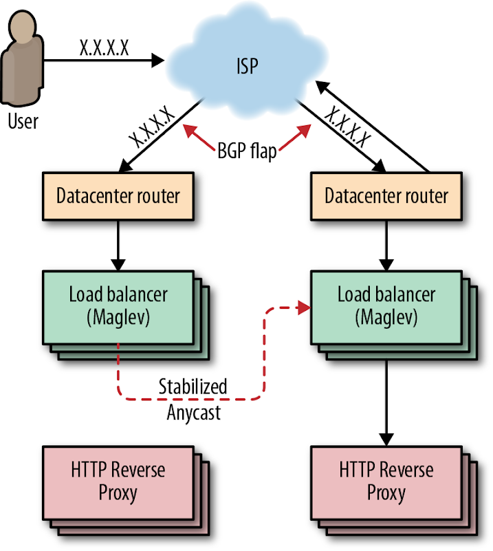
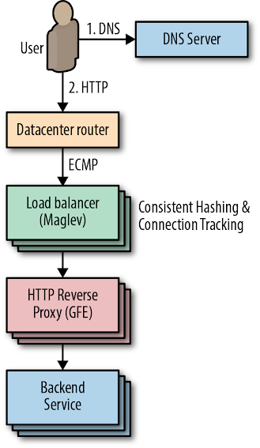
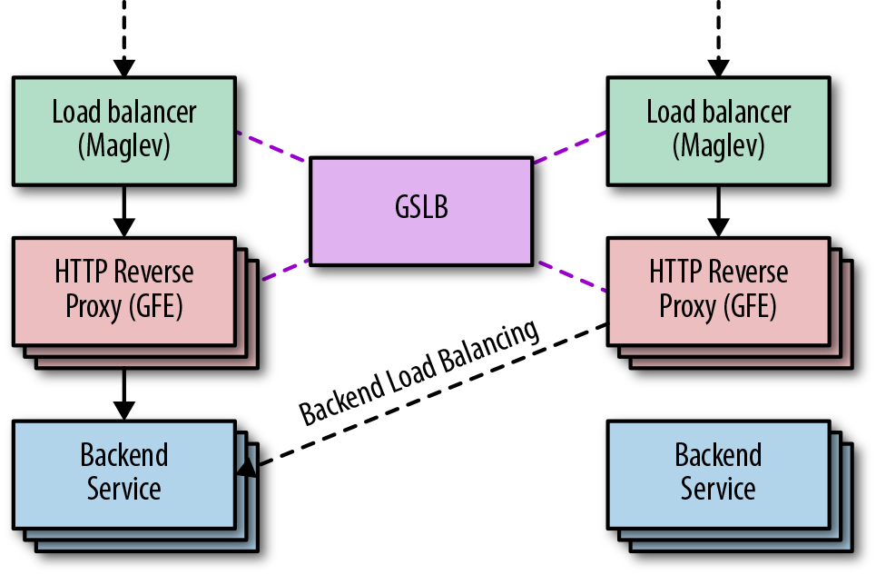
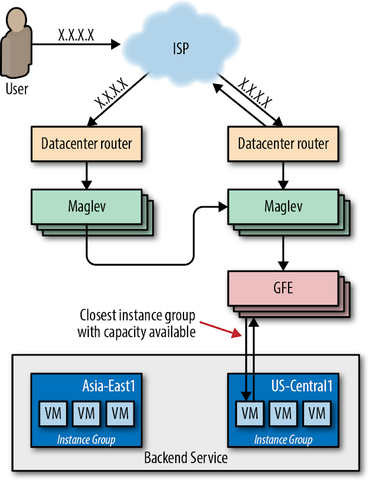
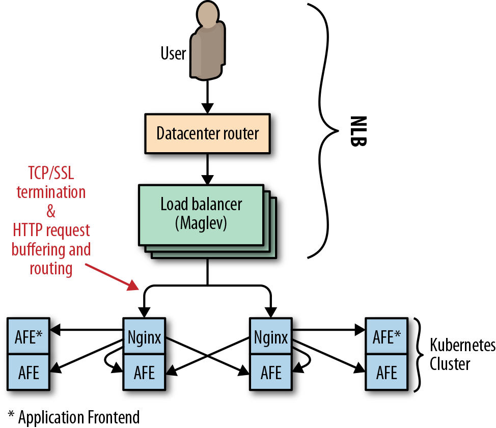
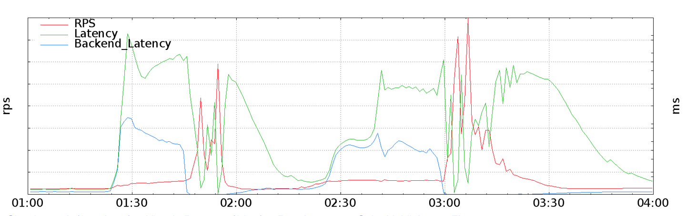
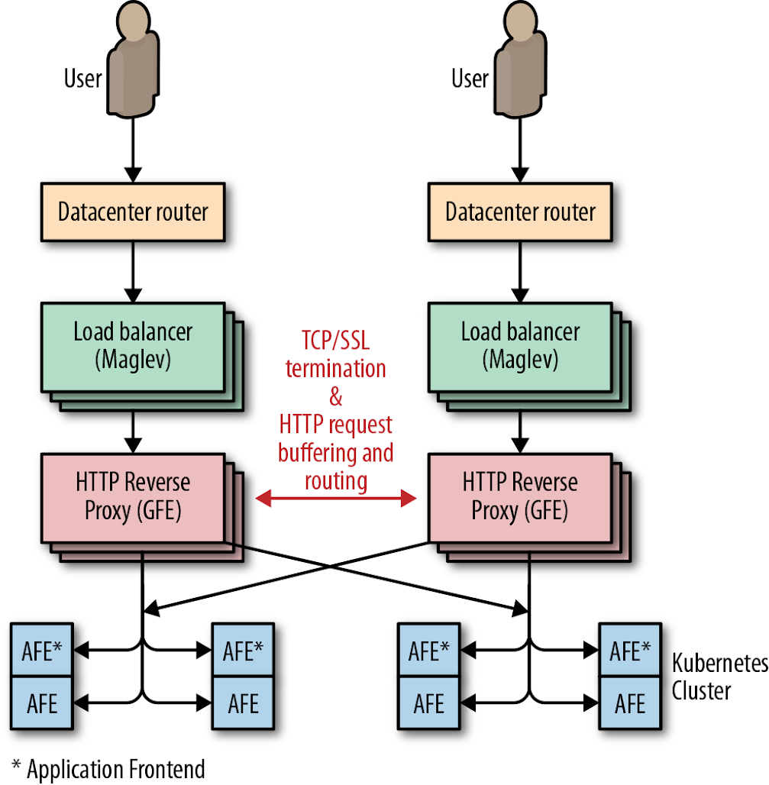
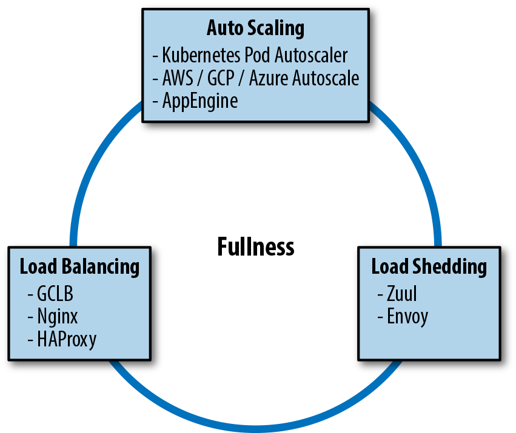
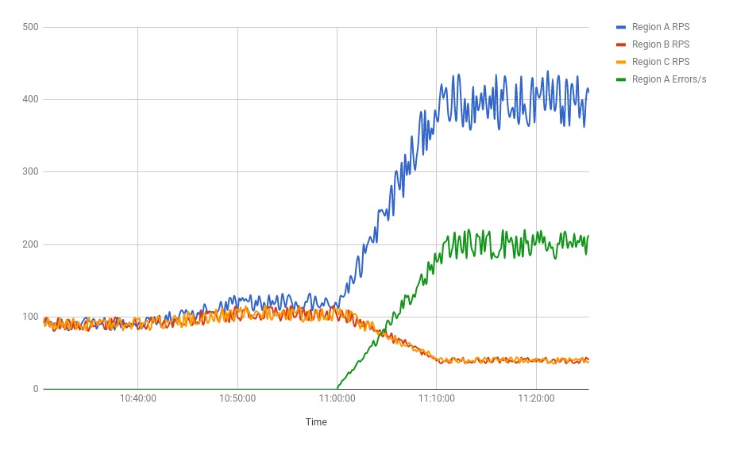

## Managing Load

By Cooper Bethea, Gráinne Sheerin, Jennifer Mace, and Ruth King with Gary Luo and Gary O’Connor

No service is 100% available 100% of the time: clients can be inconsiderate, demand can grow fifty-fold, a service might crash in response to a traffic spike, or an anchor might pull up a transatlantic cable. There are people who depend upon your service, and as service owners, we care about our users. When faced with these chains of outage triggers, how can we make our infrastructure as adaptive and reliable as possible?

This chapter describes Google’s approach to traffic management with the hope that you can use these best practices to improve the efficiency, reliability, and availability of your services. Over the years, we have discovered that there’s no single solution for equalizing and stabilizing network load. Instead, we use a combination of tools, technologies, and strategies that work in harmony to help keep our services reliable.

Before we dive in to this chapter, we recommend reading the philosophies discussed in Chapters 19 (["Load Balancing at the Frontend"](https://sre.google/sre-book/load-balancing-frontend/)) and 20 (["Load Balancing in the Datacenter"](https://sre.google/sre-book/load-balancing-datacenter/)) of our first SRE book.

# Google Cloud Load Balancing

These days, most companies don’t develop and maintain their own global load balancing solutions, instead opting to use load balancing services from a larger public cloud provider. We’ll discuss Google Cloud Load Balancer (GCLB) as a concrete example of large-scale load balancing, but nearly all of the best practices we describe also apply to other cloud providers’ load balancers.

Google has spent the past 18 years building infrastructure to make our services fast and reliable. Today we use these systems to serve YouTube, Maps, Gmail, Search, and many other products and services. GCLB is our publicly consumable global load balancing solution, and is the externalization of one of our internally developed global load balancing systems.

This section describes the components of GCLB and how they work together to serve user requests. We trace a typical user request from its creation to delivery at its destination. The Niantic [Pokémon GO](#pokemon-go-on-gclb) case study provides a concrete implementation of GCLB in the real world.

[Chapter 19](https://sre.google/sre-book/load-balancing-frontend/) of our first SRE book described how DNS-based load balancing is the simplest and most effective way to balance load before the user’s connection even starts. We also discussed an endemic problem of this approach: it relies on client cooperation to properly expire and refetch DNS records. For this reason, GCLB does not use DNS load balancing.

Instead, we use anycast, a method for sending clients to the closest cluster without relying on DNS geolocation. Google’s global load balancer knows where the clients are located and directs packets to the closest web service, providing low latency to users while using a single [virtual IP (VIP)](https://en.wikipedia.org/wiki/Virtual_IP_address). Using a single VIP means we can increase the time to live (TTL) of our DNS records, which further reduces latency.

### Anycast

Anycast is a network addressing and routing methodology. It routes datagrams from a single sender to the topologically nearest node in a group of potential receivers, which are all identified by the same destination IP address. Google announces IPs via [Border Gateway Protocol (BGP)](https://en.wikipedia.org/wiki/Border_Gateway_Protocol) from multiple points in our network. We rely on the BGP routing mesh to deliver packets from a user to the closest frontend location that can terminate a transmission control protocol (TCP) session. This deployment eliminates the problems of unicast IP proliferation and finding the closest frontend for a user. Two main issues remain:

- Too many nearby users can overwhelm a frontend site.
- BGP route calculation might reset connections.

Consider an ISP that frequently recalculates its BGP routes such that one of its users prefers either of two frontend sites. Each time the BGP route “flaps,” all in-progress TCP streams are reset as the unfortunate user’s packets are directed to a new frontend with no TCP session state. To address these problems, we have leveraged our connection-level load balancer, Maglev (described shortly), to cohere TCP streams even when routes flap. We refer to this technique as stabilized anycast.

###### Stabilized anycast

As shown in [Figure 11-1](#stabilized-anycast), Google implements stabilized anycast using Maglev, our custom load balancer. To stabilize anycast, we provide each Maglev machine with a way to map client IPs to the closest Google frontend site. Sometimes Maglev processes a packet destined for an anycast VIP for a client that is closer to another frontend site. In this case, Maglev forwards that packet to another Maglev on a machine located at the closest frontend site for delivery. The Maglev machines at the closest frontend site then simply treat the packet as they would any other packet, and route it to a local backend.

*Figure 11-1. Stabilized anycast*

### Maglev

[Maglev](https://ai.google/research/pubs/pub44824), shown in [Figure 11-2](#maglev), is Google’s custom distributed packet-level load balancer. An integral part of our cloud architecture, Maglev machines manage incoming traffic to a cluster. They provide stateful TCP-level load balancing across our frontend servers. Maglev differs from other traditional hardware load balancers in a few key ways:

- All packets destined for a given IP address can be evenly spread across a pool of Maglev machines via [Equal-Cost Multi-Path (ECMP) forwarding](https://en.wikipedia.org/wiki/Equal-cost_multi-path_routing). This enables us to boost Maglev capacity by simply adding servers to a pool. Spreading packets evenly also enables Maglev redundancy to be modeled as N + 1, enhancing availability and reliability over traditional load balancing systems (which typically rely on active/passive pairs to give 1 + 1 redundancy).
- Maglev is a Google custom solution. We control the system end-to-end, which allows us to experiment and iterate quickly.
- Maglev runs on commodity hardware in our datacenters, which greatly simplifies deployment.

*Figure 11-2. Maglev*

Maglev packet delivery uses consistent hashing and connection tracking. These techniques coalesce TCP streams at our HTTP reverse proxies (also known as Google Front Ends, or GFEs), which terminate TCP sessions. Consistent hashing and connection tracking are key to Maglev’s ability to scale by packet rather than by number of connections. When a router receives a packet destined for a VIP hosted by Maglev, the router forwards the packet to any Maglev machine in the cluster through ECMP. When a Maglev receives a packet, it computes the packet’s 5-tuple hash[^1] and looks up the hash value in its connection tracking table, which contains routing results for recent connections. If Maglev finds a match and the selected backend service is still healthy, it reuses the connection. Otherwise, Maglev falls back to consistent hashing to choose a backend. The combination of these techniques eliminates the need to share connection state among individual Maglev machines.

### Global Software Load Balancer

GSLB is Google’s Global Software Load Balancer. It allows us to balance live user traffic between clusters so that we can match user demand to available service capacity, and so we can handle service failures in a way that’s transparent to users. As shown in [Figure 11-3](#gslb), GSLB controls both the distribution of connections to GFEs and the distribution of requests to backend services. GSLB allows us to serve users from backends and GFEs running in different clusters. In addition to load balancing between frontends and backends, GSLB understands the health of backend services and can automatically drain traffic away from failed clusters.

*Figure 11-3. GSLB*

### Google Front End

As shown in [Figure 11-4](#gfe), the GFE sits between the outside world and various Google services (web search, image search, Gmail, etc.) and is frequently the first Google server a client HTTP(S) request encounters. The GFE terminates the client’s TCP and SSL sessions and inspects the HTTP header and URL path to determine which backend service should handle the request. Once the GFE decides where to send the request, it reencrypts the data and forwards the request. For more information on how this encryption process works, see our whitepaper ["Encryption in Transit in Google Cloud"](https://cloud.google.com/security/encryption-in-transit/).

The GFE is also responsible for health-checking its backends. If a backend server returns a negative acknowledgment (“NACKs” the request) or times out health checks, GFEs stop sending traffic to the failed backend. We use this signal to update GFE backends without impacting uptime. By putting GFE backends into a mode in which they fail health checks while continuing to respond to in-flight requests, we can gracefully remove GFE backends from service without disrupting any user requests. We call this “lame duck” mode and we discuss it in more detail in [Chapter 20](https://sre.google/sre-book/load-balancing-datacenter/) of the first SRE book.

*Figure 11-4. GFE*

The GFEs also maintain persistent sessions to all their recently active backends so that a connection is ready to use as soon as a request arrives. This strategy helps reduce latency for our users, particularly in scenarios when we use SSL to secure the connection between GFE and the backend.

### GCLB: Low Latency

Our network provisioning strategy aims to reduce end-user latency to our services. Because negotiating a secure connection via HTTPS requires two network round trips between client and server, it’s particularly important that we minimize the latency of this leg of the request time. To this end, we extended the edge of our network to host Maglev and GFE. These components terminate SSL as close to the user as possible, then forward requests to backend services deeper within our network over long-lived encrypted connections.

We built GCLB atop this combined Maglev/GFE-augmented edge network. When customers create a load balancer, we provision an anycast VIP and program Maglev to load-balance it globally across GFEs at the edge of our network. GFE’s role is to terminate SSL, accept and buffer HTTP requests, forward those requests to the customer’s backend services, and then proxy the responses back to users. GSLB provides the glue between each layer: it enables Maglev to find the nearest GFE location with available capacity, and enables GFE to route requests to the nearest VM instance group with available capacity.

### GCLB: High Availability

In the interest of providing high availability to our customers, GCLB offers an availability SLA[^2] of 99.99%. In addition, GCLB provides support tools that enable our customers to improve and manage the availability of their own applications. It’s useful to think of the load balancing system as a sort of traffic manager. During normal operation, GCLB routes traffic to the nearest backend with available capacity. When one instance of your service fails, GCLB detects the failure on your behalf and routes traffic to healthy instances.

Canarying and gradual rollouts help GCLB maintain high availability. Canarying is one of our standard release procedures. As described in [Canarying Releases](https://sre.google/workbook/canarying-releases/) this process involves deploying a new application to a very small number of servers, then gradually increasing traffic and carefully observing system behavior to verify that there are no regressions. This practice reduces the impact of any regressions by catching them early in the canary phase. If the new version crashes or otherwise fails health checks, the load balancer routes around it. If you detect a nonfatal regression, you can administratively remove the instance group from the load balancer without touching the main version of the application.

### Case Study 1: Pokémon GO on GCLB

Niantic launched Pokémon GO in the summer of 2016. It was the first new Pokémon game in years, the first official Pokémon smartphone game, and Niantic’s first project in concert with a major entertainment company. The game was a runaway hit and more popular than anyone expected—that summer you’d regularly see players gathering to duel around landmarks that were Pokémon Gyms in the virtual world.

Pokémon GO’s success greatly exceeded the expectations of the Niantic engineering team. Prior to launch, they load-tested their software stack to process up to 5x their most optimistic traffic estimates. The actual launch requests per second (RPS) rate was nearly 50x that estimate—enough to present a scaling challenge for nearly any software stack. To further complicate the matter, the world of Pokémon GO is highly interactive and globally shared among its users. All players in a given area see the same view of the game world and interact with each other inside that world. This requires that the game produce and distribute near-real-time updates to a state shared by all participants.

Scaling the game to 50x more users required a truly impressive effort from the Niantic engineering team. In addition, many engineers across Google provided their assistance in scaling the service for a successful launch. Within two days of migrating to GCLB, the Pokemon GO app became the single largest GCLB service, easily on par with the other top 10 GCLB services.

As shown in [Figure 11-5](#pokemon-go), when it launched, Pokémon GO used Google’s regional [Network Load Balancer (NLB)](https://cloud.google.com/load-balancing/docs/network/) to load-balance ingress traffic across a [Kubernetes](https://kubernetes.io/docs/concepts/services-networking/ingress/) cluster. Each cluster contained pods of [Nginx](https://www.nginx.com/) instances, which served as Layer 7 reverse proxies that terminated SSL, buffered HTTP requests, and performed routing and load balancing across pods of application server backends.

*Figure 11-5. Pokémon GO (pre-GCLB)*

NLB is responsible for load balancing at the IP layer, so a service that uses NLB effectively becomes a backend of Maglev. In this case, relying on NLB had the following implications for Niantic:

- The Nginx backends were responsible for terminating SSL for clients, which required two round trips from a client device to Niantic’s frontend proxies.
- The need to buffer HTTP requests from clients led to resource exhaustion on the proxy tier, particularly when clients were only able to send bytes slowly.
- Low-level network attacks such as [SYN flood](https://en.wikipedia.org/wiki/SYN_flood) could not be effectively ameliorated by a packet-level proxy.

In order to scale appropriately, Niantic needed a high-level proxy operating on a large edge network. This solution wasn’t possible with NLB.

###### Migrating to GCLB

A large SYN flood attack made migrating Pokémon GO to GCLB a priority. This migration was a joint effort between Niantic and the Google Customer Reliability Engineering (CRE) and SRE teams. The initial transition took place during a traffic trough and, at the time, was unremarkable. However, unforeseen problems emerged for both Niantic and Google as traffic ramped up to peak. Both Google and Niantic discovered that the true client demand for Pokémon GO traffic was 200% higher than previously observed. The Niantic frontend proxies received so many requests that they weren’t able to keep pace with all inbound connections. Any connection refused in this way wasn’t surfaced in the monitoring for inbound requests. The backends never had a chance.

This traffic surge caused a classic cascading failure scenario. Numerous backing services for the [API—Cloud Datastore](https://sre.google/cloud/), Pokémon GO backends and API servers, and the load balancing system itself—exceeded the capacity available to Niantic’s cloud project. The overload caused Niantic’s backends to become extremely slow (rather than refuse requests), manifesting as requests timing out to the load balancing layer. Under this circumstance, the load balancer retried GET requests, adding to the system load. The combination of extremely high request volume and added retries stressed the SSL client code in the GFE at an unprecedented level, as it tried to reconnect to unresponsive backends. This induced a severe performance regression in GFE such that GCLB’s worldwide capacity was effectively reduced by 50%.

As backends failed, the Pokémon GO app attempted to retry failed requests on behalf of users. At the time, the app’s retry strategy was a single immediate retry, followed by constant backoff. As the outage continued, the service sometimes returned a large number of quick errors—for example, when a shared backend restarted. These error responses served to effectively synchronize client retries, producing a “thundering herd” problem, in which many client requests were issued at essentially the same time. As shown in [Figure 11-6](#traffic-spikes-caused-by-synchronous-client-retries), these synchronized request spikes ramped up enormously to 20× the previous global RPS peak.

*Figure 11-6. Traffic spikes caused by synchronous client retries*

###### Resolving the issue

These request spikes, combined with the GFE capacity regression, resulted in queuing and high latency for all GCLB services. Google’s on-call Traffic SREs acted to reduce collateral damage to other GCLB users by doing the following:

1.  Isolating GFEs that could serve Pokémon GO traffic from the main pool of load balancers.
2.  Enlarging the isolated Pokémon GO pool until it could handle peak traffic despite the performance regression. This action moved the capacity bottleneck from GFE to the Niantic stack, where servers were still timing out, particularly when client retries started to synchronize and spike.
3.  With Niantic’s blessing, Traffic SRE implemented administrative overrides to limit the rate of traffic the load balancers would accept on behalf of Pokémon GO. This strategy contained client demand enough to allow Niantic to reestablish normal operation and commence scaling upward.

[Figure 11-7](#pokemon-go-gclb) shows the final network configuration.

*Figure 11-7. Pokémon GO GCLB*

###### Future-proofing

In the wake of this incident, Google and Niantic both made significant changes to their systems. Niantic introduced jitter and truncated exponential backoff[^3] to their clients, which curbed the massive synchronized retry spikes experienced during cascading failure. Google learned to consider GFE backends as a potentially significant source of load, and instituted qualification and load testing practices to detect GFE performance degradation caused by slow or otherwise misbehaving backends. Finally, both companies realized they should measure load as close to the client as possible. Had Niantic and Google CRE been able to accurately predict client RPS demand, we would have preemptively scaled up the resources allocated to Niantic even more than we did before conducting the switch to GCLB.

# Autoscaling

Tools like GCLB can help you balance load efficiently across your fleet, making your service more stable and reliable. Sometimes you simply don’t have enough resources reserved to manage your existing traffic. You can use [autoscaling](https://en.wikipedia.org/wiki/Autoscaling) to scale your fleet strategically. Whether you increase the resources per machine (vertical scaling) or increase the total number of machines in the pool (horizontal scaling), autoscaling is a powerful tool and, when used correctly, can enhance your service availability and utilization. Conversely, if misconfigured or misused, autoscaling can negatively impact your service. This section describes some best practices, common failure modes, and current limitations of autoscaling.

### Handling Unhealthy Machines

Autoscaling normally averages utilization over all instances regardless of their state, and assumes that instances are homogeneous in terms of request processing efficiency. Autoscaling runs into problems when machines are not serving (known as unhealthy instances) but are still counted toward the utilization average. In this scenario, autoscaling simply won’t occur. A variety of issues can trigger this failure mode, including:

- Instances taking a long time to get ready to serve (e.g., when loading a binary or warming up)
- Instances stuck in a nonserving state (i.e., zombies)

We can improve this situation using a variety of tactics. You can make the following improvements in combination or individually:

Load balancing

- Autoscale using a capacity metric as observed by the load balancer. This will automatically discount unhealthy instances from the average.

Wait for new instances to stabilize before collecting metrics

- You can configure autoscaler to collect information about new instances only once new instances become healthy (GCE refers to this period of inactivity as a cool-down period).

Autoscale and autoheal

- Autohealing monitors your instances and attempts to restart them if they are unhealthy. Typically, you configure your autohealer to monitor a health metric exposed by your instances. If autohealer detects that an instance is down or unhealthy, it will attempt a restart. When configuring your autohealer, it’s important to ensure you leave sufficient time for your instances to become healthy after a restart.

Using a mix of these solutions, you can optimize horizontal autoscaling to keep track only of healthy machines. Remember that when running your service, autoscaler will continuously adjust the size of your fleet. Creating new instances is never instant.

### Working with Stateful Systems

A stateful system sends all requests in a user session consistently to the same backend server. If these pathways are overburdened, adding more instances (i.e., horizontal scaling) won’t help. Intelligent, task-level routing that spreads the load around (e.g., using consistent hashing[^4]) is a better strategy for stateful systems.

Vertical autoscaling can be useful in stateful systems. When used in combination with task-level balancing to even out load on your system, vertical autoscaling can help absorb short-term hotspots. Use this strategy with caution: because vertical autoscaling is typically uniform across all instances, your low-traffic instances may grow unnecessarily large.

### Configuring Conservatively

Using autoscaling to scale up is more important and less risky than using it to scale down since a failure to scale up can result in overload and dropped traffic. By design, most autoscaler implementations are intentionally more sensitive to jumps in traffic than to drops in traffic. When scaling up, autoscalers are inclined to add extra serving capacity quickly. When scaling down, they are more cautious and wait longer for their scaling condition to hold true before slowly reducing resources.

The load spikes you can absorb increase as your service moves further away from a bottleneck. We recommend configuring your autoscaler to keep your service far from key system bottlenecks (such as CPU). Autoscaler also needs adequate time to react, particularly when new instances cannot turn up and serve instantly. We recommend that user-facing services reserve enough spare capacity for both overload protection and redundancy.[^5]

### Setting Constraints

Autoscaler is a powerful tool; if misconfigured, it can scale out of control. You might inadvertently trigger serious consequences by introducing a bug or changing a setting. For example, consider the following scenarios:

- You configured autoscaling to scale based on CPU utilization. You release a new version of your system, which contains a bug causing the server to consume CPU without doing any work. Autoscaler reacts by upsizing this job again and again until all available [quota](https://cloud.google.com/compute/quotas) is wasted.
- Nothing has changed in your service, but a dependency is failing. This failure causes all requests to get stuck on your servers and never finish, consuming resources all the while. Autoscaler will scale up the jobs, causing more and more traffic to get stuck. The increased load on your failing dependency can prevent the dependency from recovering.

It’s useful to constrain the work that your autoscaler is allowed to perform. Set a minimum and maximum bound for scaling, making sure that you have enough quota to scale to the set limits. Doing so prevents you from depleting your quota and helps with capacity planning.

### Including Kill Switches and Manual Overrides

It’s a good idea to have a kill switch in case something goes wrong with your autoscaling. Make sure your on-call engineers understand how to disable autoscaling and how to manually scale if necessary. Your autoscaling kill switch functionality should be easy, obvious, fast, and well documented.

### Avoiding Overloading Backends

A correctly configured autoscaler will scale up in response to an increase in traffic. An increase in traffic will have consequences down the stack. Backend services, such as databases, need to absorb any additional load your servers might create. Therefore, it’s a good idea to perform a detailed dependency analysis on your backend services before deploying your autoscaler, particularly as some services may scale more linearly than others. Ensure your backends have enough extra capacity to serve increased traffic and are able to degrade gracefully when overloaded. Use the data from your analysis to inform the limits of your autoscaler configuration.

Service deployments commonly run a variety of microservices that share quota. If a microservice scales up in response to a traffic spike, it might use most of the quota. If increased traffic on a single microservice means increased traffic on other microservices, there will be no available quota for the remaining microservices to grow. In this scenario, a dependency analysis can help guide you toward preemptively implementing limited scaling. Alternatively, you can implement separate quotas per microservice (which may entail splitting your service into separate projects).

### Avoiding Traffic Imbalance

Some autoscalers (e.g., AWS EC2, GCP) can balance instances across regional groups of instances ([RMiGs](https://cloud.google.com/compute/docs/instance-groups/distributing-instances-with-regional-instance-groups)). In addition to regular autoscaling, these autoscalers run a separate job that constantly attempts to even out the size of each zone across the region. Rebalancing traffic in this way avoids having one large zone. If the system you’re using allocates quota per zone, this strategy evens out your quota usage. In addition, autoscaling across regions provides more diversity for failure domains.

# Combining Strategies to Manage Load

If your system becomes sufficiently complex, you may need to use more than one kind of load management. For example, you might run several managed instance groups that scale with load but are cloned across multiple regions for capacity; therefore, you also need to balance traffic between regions. In this case, your system needs to use both load balancing and load-based autoscaling.

Or maybe you run a website across three colocated facilities around the world. You’d like to serve locally for latency, but since it takes weeks to deploy more machines, overflow capacity needs to spill over to other locations. If your site gets popular on social media and suddenly experiences a five-fold increase in traffic, you’d prefer to serve what requests you can. Therefore, you implement load shedding to drop excess traffic. In this case, your system needs to use both load balancing and load shedding.

Or perhaps your data processing pipeline lives in a Kubernetes cluster in one cloud region. When data processing slows significantly, it provisions more pods to handle the work. However, when data comes in so fast that reading it causes you to run out of memory, or slows down garbage collection, your pods may need to shed that load temporarily or permanently. In this case, your system needs to use both load-based autoscaling and load shedding techniques.

Load balancing, load shedding, and autoscaling are all systems designed for the same goal: to equalize and stabilize the system load. Since the three systems are often implemented, installed, and configured separately, they seem independent. However, as shown in [Figure 11-8](#a-full-traffic-management-system), they’re not entirely independent. The following case study illustrates how these systems can interact.

*Figure 11-8. A full traffic management system*

### Case Study 2: When Load Shedding Attacks

Imagine a fictional company, Dressy, that sells dresses online via an app. As this is a traffic-driven service, the development team at Dressy deployed their app across three regions. This deployment allows their app to respond quickly to user requests and weather single-zone failures—or so they thought.

The customer service team at Dressy starts receiving complaints that customers can’t access the app. Dressy’s development teams investigate and notice a problem: their load balancing is inexplicably drawing all user traffic into region A, even though that region is full-to-overflowing and both B and C are empty (and equally large). The timeline of events (see [Figure 11-9](#regional-traffic)) is as follows:

1.  At the beginning of the day, the traffic graphs showed all three clusters steady at 90 RPS.
2.  At 10:46 a.m., traffic started to rise in all three regions as eager shoppers began hunting for bargains.
3.  At 11:00 a.m., region A reached 120 RPS just before regions B and C.
4.  At 11:10 a.m., region A continued to grow to 400 RPS, while B and C dipped to 40 RPS.
5.  The load balancer settled at this state.
6.  The majority of requests hitting region A were returning 503 errors.
7.  Users whose requests hit this cluster started to complain.

*Figure 11-9. Regional traffic*

If the development team had consulted their load balancer’s fullness graphs, they would have seen something very strange. The load balancer was utilization-aware: it was reading CPU utilization from Dressy’s containers and using this information to estimate fullness. As far as it could tell, per-request CPU utilization was 10 times lower in region A than either B or C. The load balancer determined that all regions were equally loaded, and its job was done.

###### What was happening?

Earlier in the week, to protect against cascading overload, the team enabled load shedding. Whenever CPU utilization reached a certain threshold, a server would return an error for any new requests it received rather than attempting to process them. On this particular day, region A reached this threshold slightly ahead of the other regions. Each server began rejecting 10% of requests it received, then 20% of requests, then 50%. During this time frame, CPU usage remained constant.

As far as the load balancer system was concerned, each successive dropped request was a reduction in the per-request CPU cost. Region A was far more efficient than regions B and C. It was serving 240 RPS at 80% CPU (the shedding cap), while B and C were managing only 120 RPS. Logically, it decided to send more requests to A.

###### What went wrong?

In brief, the load balancer didn’t know that the “efficient” requests were errors because the load shedding and load balancing systems weren’t communicating. Each system was added and enabled separately, likely by different engineers. No one had examined them as one unified load management system.

###### Lessons learned

To effectively manage system load, we need to be deliberate—both in the configuration of our individual load management tools and in the management of their interactions. For example, in the Dressy case study, adding error handling to the load balancer logic would have fixed the problem. Let’s say each “error” request counts as 120% CPU utilization (any number over 100 will work). Now region A looks overloaded. Requests will spread to B and C, and the system will equalize.

You can use similar logic to extrapolate this example to any combination of load management tactics. When adopting a new load management tool, carefully examine how it interacts with other tools your system is already using and instrument their intersection. Add monitoring to detect feedback loops. Make sure your emergency shutdown triggers can be coordinated across your load management systems, and consider adding automatic shutdown triggers if these systems are behaving wildly out of control. If you don’t take appropriate precautions up front, you’ll likely have to do so in the wake of a postmortem.

It is easy to say “take precautions.” More specifically, here are some precautions you might consider, depending on the kind of load management you deploy:

Load balancing

- Load balancing minimizes latency by routing to the location closest to the user. Autoscaling can work together with load balancing to increase the size of locations close to the user and then route more traffic there, creating a positive feedback loop.
- If demand is primarily closest to one location, that location will grow in size until all serving capacity is in one spot. If this location goes down, the remaining locations will become overloaded and traffic may be dropped. Scaling these locations up will not be instant. You can avoid this situation by setting a minimum number of instances per location to keep spare capacity for failover.

Load shedding

- It’s a good idea to set your thresholds such that your system autoscales before load shedding kicks in. Otherwise, your system might start shedding traffic it could have served had it scaled up first.

Managing load with RPC

- Handling the right requests is important for efficiency: you don’t want to autoscale up to serve requests that won’t benefit users, or shed load unnecessarily because you’re processing unimportant requests. When using both autoscaling and load shedding, it’s important that you set deadlines on your RPC requests.
- Processes hold resources for all in-flight requests, and release those resources when the requests are completed. In the absence of a specific deadline, the system will hold resources for all in-progress requests, up to the maximum possible limit. By default, this deadline is a very large number (which depends on the language implementation—some language APIs work in terms of a fixed point in time, and others with a duration of time). This behavior causes clients, and ultimately users, to experience higher latency. The service is also at risk of running out of resources (like memory) and crashing.
- To handle this scenario gracefully, we recommend that the server terminates requests that take too long, and that clients cancel requests that are no longer useful to them. For example, a server shouldn’t start an expensive search operation if the client already returned an error to the user. To set behavior expectations for a service, you could simply provide a comment in the API’s .proto file to suggest a default deadline. Also, set deliberate deadlines for the client (for examples, see our blog post [“gRPC and Deadlines”](https://grpc.io/blog/deadlines)).

# Conclusion

In Google’s experience, there are no perfect traffic management configurations. Autoscaling is a powerful tool, but it’s easy to get wrong. Unless carefully configured, autoscaling can result in disastrous consequences—for example, potentially catastrophic feedback cycles between load balancing, load shedding, and autoscaling when these tools are configured in isolation. As the Pokémon GO case study illustrates, traffic management works best when it’s based upon a holistic view of the interactions between systems.

Time and time again, we’ve seen that no amount of load shedding, autoscaling, or throttling will save our services when they all fail in sync. For example, in the Pokémon GO case study, we had a “thundering herd” of synchronized client retries combined with load balancers that waited for unresponsive backend servers. To fail your services gracefully, you need to plan ahead to mitigate potential problems. Your mitigation strategy might involve setting flags, changing default behaviors, enabling expensive logging, or exposing the current value of parameters the traffic management system uses for decisions.

We hope the strategies and insights provided in this chapter can help you manage traffic for your own services and keep your users happy.

[^1]: 5-tuple includes the following: source address, destination address, source port, destination port, and the transport protocol type.

[^2]: See the Google Cloud Platform blog post “SLOs, SLIs, SLAs, Oh My—CRE Life Lessons” for an explanation of the difference between SLOs and SLAs.

[^3]: For more information on this topic, see Chapter 22 of the first SRE book.

[^4]: See Site Reliability Engineering, Chapter 19.

[^5]: For more info about redundancy in capacity planning, see Site Reliability Engineering, Appendix B.
