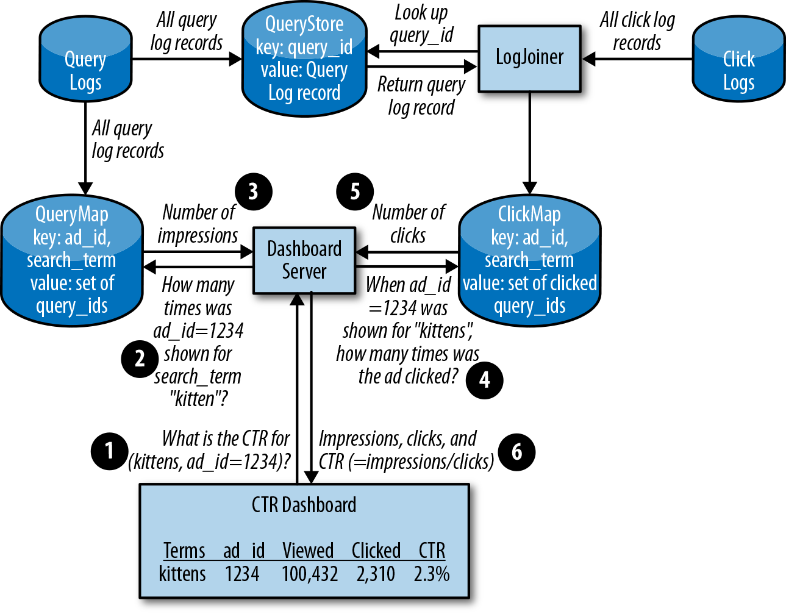
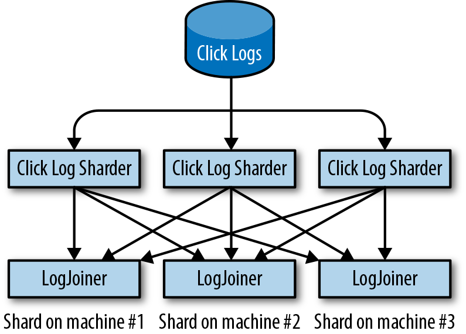
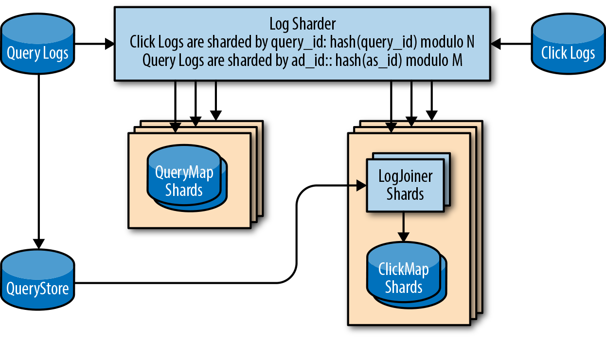
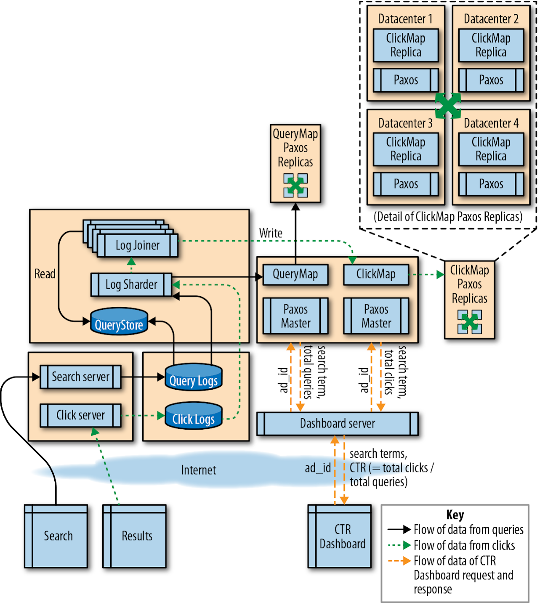

## Introducing Non-Abstract Large System Design

By Salim Virji, James Youngman, Henry Robertson,  
Stephen Thorne, Dave Rensin, and Zoltan Egyed  
with Richard Bondi

With responsibilities that span production operations and product engineering, SRE is in a unique position to align business case requirements and operational costs. Product engineering teams may not be aware of the maintenance cost of systems they design, especially if that product team is building a single component that factors into a greater production ecosystem.

Based on Google’s experience developing systems, we consider reliability to be the most critical feature of any production system. We find that deferring reliability issues during design is akin to accepting fewer features at higher costs. By following an iterative style of system design and implementation, we arrive at robust and scalable designs with low operational costs. We call this style Non-Abstract Large System Design (NALSD).

# What Is NALSD?

This chapter presents a NALSD approach: we begin with the problem statement, gather requirements, and iterate through designs that become increasingly sophisticated until we reach a viable solution. Ultimately, we arrive at a system that defends against many failure modes and satisfies both the initial requirements and additional details that emerged as we iterated.

NALSD describes a skill critical to SRE: the ability to assess, design, and evaluate large systems. Practically, NALSD combines elements of capacity planning, component isolation, and graceful system degradation that are crucial to highly available production systems. Google SREs are expected to be able to start resource planning with a basic whiteboard diagram of a system, think through the various scaling and failure domains, and focus their design into a concrete proposal for resources. Because these systems change over time, it’s vitally important that an SRE is able to analyze and evaluate the key [aspects of the system design.](https://sre.google/sre-book/managing-critical-state/)

# Why “Non-Abstract”?

All systems will eventually have to run on real computers in real datacenters using real networks. Google has learned (the hard way) that the people designing distributed systems need to develop and continuously exercise the muscle of turning a whiteboard design into concrete estimates of resources at multiple steps in the process. Without this rigor, it’s too tempting to create systems that don’t quite translate in the real world.

This extra bit of work up front typically leads to fewer last-minute system design changes to account for some unforeseen physical constraint.

Please note that while we drive these exercises to discrete results (e.g., number of machines), examples of sound reasoning and assumption making are more important than any final values. Early assumptions heavily influence calculation results, and making perfect assumptions isn’t a requirement for NALSD. The value of this exercise is in combining many imperfect-but-reasonable results into a better understanding of the design.

# AdWords Example

The Google AdWords service displays text advertisements on Google Web Search. The click-through rate (CTR) metric tells advertisers how well their ads are performing. CTR is the ratio of times the ad is clicked versus the number of times the ad is shown.

This AdWords example aims to design a system capable of measuring and reporting an accurate CTR for every AdWords ad. The data we need to calculate CTR is recorded in logs of the search and ad serving systems. These logs record the ads that are shown for each search query and the ads that are clicked, respectively.

### Design Process

Google uses an iterative approach to [design systems](https://sre.google/workbook/configuration-design/) that meet our goals. Each iteration defines a potential design and examines its strengths and weaknesses. This analysis either feeds into the next iteration or indicates when the design is good enough to recommend.

In broad strokes, the NALSD process has two phases, each with two to three questions.

In the basic design phase, we try to invent a design that works in principle. We ask two questions:

Is it possible?

- Is the design even possible? If we didn’t have to worry about enough RAM, CPU, network bandwidth, and so on, what would we design to satisfy the requirements?

Can we do better?

- For any such design, we ask, “Can we do better?” For example, can we make the system meaningfully faster, smaller, more efficient? If the design solves the problem in [O(N) time](https://en.wikipedia.org/wiki/Big_O_notation), can we solve it more quickly—say, O(ln(N))?

In the next phase, we try to scale up our basic design—for example, by dramatically increasing a requirement. We ask three questions:

Is it feasible?

- Is it possible to scale this design, given constraints on money, hardware, and so on? If necessary, what distributed design would satisfy the requirements?

Is it resilient?

- Can the design fail gracefully? What happens when this component fails? How does the system work when an entire datacenter fails?

Can we do better?

While we generally cover these phases and questions in this approximate order, in practice, we bounce around between the questions and phases. For example, during the basic design phase, we often have growth and scaling in the back of our minds.

Then we iterate. One design may successfully pass most of the phases, only to flounder later. When that happens, we start again, modifying or replacing components. The final design is the end of a story of twists and turns.

With these concepts in mind, let’s walk through the iterative NALSD process.

### Initial Requirements

Each advertiser may have multiple advertisements. Each ad is keyed by `ad_id` and is associated with a list of search terms selected by the advertiser.

When displaying a dashboard to an advertiser, we need to know the following for each ad and search term:

- How often this search term triggered this ad to be shown
- How many times the ad was clicked by someone who saw the ad

With this information, we can calculate the CTR: the number of clicks divided by the number of impressions.

We know our advertisers care about two things: that the dashboard displays quickly, and that the data is recent. Therefore, when iterating on the design, we will consider our requirements in terms of SLOs (see [Implementing SLOs](https://sre.google/workbook/implementing-slos/) for more details):

- 99.9% of dashboard queries complete in \< 1 second.
- 99.9% of the time, the CTR data displayed is less than 5 minutes old.

These SLOs provide a reasonable goal that we should be able to consistently meet. They also provide an error budget (see [Chapter 4](https://sre.google/sre-book/service-level-objectives/) in Site Reliability Engineering), which we will compare our solution against in each iteration of the design.

We aim to create a system that can meet our SLOs and also support millions of advertisers who want to see their CTRs on a dashboard. For transaction rates, let’s assume 500,000 search queries per second and 10,000 ad clicks per second.

### One Machine

The simplest starting point is to consider running our entire application on a single computer.

For every web search query, we log:

`time`

- The time the query occurred

`query_id`

- A unique query identifier (query ID)

`search_term`

- The query content

`ad_id`

- The ad IDs of all the AdWords advertisements shown for the search

Together, this information forms the query log. Every time a user clicks an ad, we log the time of the click, the query ID, and the ad ID in the click log.

You may be wondering why we don’t simply add the `search_term` to the click log to reduce complexity. In the arbitrarily reduced scope of our example, this could be feasible. However, in practice, CTR is actually only one of many insights calculated from these logs. Click logs are derived from URLs, which have inherent size limitations, making the separate query log a more scalable solution. Instead of proving this point by adding extra CTR-like requirements to the exercise, we will simply acknowledge this assumption and move forward.

Displaying a dashboard requires the data from both logs. We need to be able to show that we can achieve our SLO of displaying fresh data on the dashboard in under a second. Achieving this SLO requires that the speed of calculating a CTR remains constant as the system handles large amounts of clicks and queries.

To meet our SLO of displaying our dashboard in under one second, we need quick lookups of the number of clicked and shown `query_id`s per `search_term` for a given `ad_id`. We can extract the breakdown of shown `query_id`s per `search_term` and `ad_id` from the query log. A CTR dashboard needs all records from both the query log and the click log for the `ad_id`s.

If we have more than a few advertisers, scanning through the query log and the click log to generate the dashboard will be very inefficient. Therefore, our design calls for our one machine to create an appropriate data structure to allow fast CTR calculations as it receives the logs. On a single machine, using an SQL database with indexes on `query_id` and `search_term` should be able to provide answers in under a second. By joining these logs on `query_id` and grouping by `search_term`, we can report the CTR for each search.

###### Calculations

We need to calculate how many resources we need to parse all these logs. To determine our scaling limits, we need to make some assumptions, starting with the size of the query log:

`time`

- 64-bit integer, 8 bytes

`query_id`

- 64-bit integer, 8 bytes

`ad_id`

- Three 64-bit integers, 8 bytes

`search_term`

- A long string, up to 500 bytes

Other metadata

- 500–1,000 bytes of information, such as which machine served the ads, which language the search was in, and how many results the search term returned

To make sure we don’t prematurely hit a limit, we aggressively round up to treat each query log entry as 2 KB. Click log volume should be considerably smaller than query log volume: because the average CTR is 2% (10,000 clicks / 500,000 queries), the click log will have 2% as many records as the query log. Remember that we chose big numbers to illustrate that these principles scale to arbitrarily large implementations. These estimations seem large because they’re supposed to be.

Finally, we can use scientific notation to limit errors caused by arithmetic on inconsistent units. The volume of query logs generated in a 24-hour period will be:

- (5 × 105 queries/sec) × (8.64 × 104 seconds/day) × (2 × 103 bytes) = 86.4 TB/day

Because we receive 2% as many clicks as queries, and we know that our database indexes will add some reasonable amount of overhead, we can round our 86.4 TB/day up to 100 TB of space required to store one day’s worth of log data.

With an aggregate storage requirement of ~100 TB, we have some new assumptions to make. Does this design still work with a single machine? While it is possible to attach 100 TB of disks to a single machine, we’ll likely be limited by the machine’s ability to read from and write to disk.

For example, a common 4 TB HDD might be able to sustain 200 input/output operations per second (IOPS). If every log entry can be stored and indexed in an average of one disk write per log entry, we see that IOPS is a limiting factor for our query logs:

- (5 × 105 queries/sec) / (200 IOPS/disk) = 2.5 × 103 disks or 2,500 disks

Even if we can batch our queries in a 10:1 ratio to limit the operations, in a best-case scenario we’d need several hundred HDDs. Considering that query log writes are only one component of the design’s IO requirements, we need to use a solution that handles high IOPS better than traditional HDDs.

For simplicity’s sake, we’ll move straight to evaluating RAM and skip the evaluation of other storage media, such as solid state disk (SSD). A single machine can’t handle a 100 TB footprint entirely in RAM: assuming we have a standard machine footprint of 16 cores, 64 GB RAM, and 1 Gbps network throughput available, we’ll need:

- (100 TB) / (64 GB RAM/machine) = 1,563 machines

###### Evaluation

Ignoring our calculations for a moment and imagining we could fit this design in a single machine, would we actually want to? If we test our design by asking what happens when this component fails, we identify a long list of single points of failure (e.g., CPU, memory, storage, power, network, cooling). Can we reasonably support our SLOs if one of these components fails? Almost certainly not—even a simple power cycle would significantly impact our users.

Returning to our calculations, our one-machine design once again looks unfeasible, but this step hasn’t been a waste of time. We’ve discovered valuable information about how to reason about the constraints of the system and its initial requirements. We need to evolve our design to use more than one machine.

### Distributed System

The `search_term`s we need are in the query log, and the `ad_id`s are in the click log. Now that we know we’ll need multiple machines, what’s the best design to join them?

###### MapReduce

We can process and join the logs with a [MapReduce](https://en.wikipedia.org/wiki/MapReduce). We can periodically grab the accumulated query logs and click logs, and the MapReduce will produce a data set organized by `ad_id` that displays the number of clicks each `search_term` received.

MapReduce works as a batch processor: its inputs are a large data set, and it can use many machines to process that data via workers and produce a result. Once all machines have processed their data, their output can be combined—the MapReduce can directly create summaries of every CTR for every AdWords ad and search term. We can use this data to create the dashboards we need.

*Evaluation.* MapReduce is a widely used model of computation that we are confident will scale horizontally. No matter how big our query log and click log inputs are, adding more machines will always allow the process to complete successfully without running out of disk space or RAM.

Unfortunately, this type of batch process can’t meet our SLO of joined log availability within 5 minutes of logs being received. To serve results within 5 minutes, we’d need to run MapReduce jobs in small batches—just a few minutes of logs at a time.

The arbitrary and nonoverlapping nature of the batches makes small batches impractical. If a logged query is in batch 1, and its click is in batch 2, the click and query will never be joined. While MapReduce handles self-contained batches well, it’s not optimized for this kind of problem. At this point, we could try to figure out potential workarounds using MapReduce. For simplicity’s sake, however, we’ll move on to examine another solution.

###### LogJoiner

The number of ads that users click is significantly smaller than the number of ads served. Intuitively, we need to focus on scaling the larger of the two: query logs. We do this by introducing a new distributed system component.

Rather than looking for the `query_id` in small batches, as in our MapReduce design, what if we created a store of all queries that we can look up by `query_id` on demand? We’ll call it the QueryStore. It holds the full content of the query logs, keyed by `query_id`. To avoid repetition, we’ll assume that our calculations from the one-machine design will apply to the QueryStore and we’ll limit the review of QueryStore to what we’ve already covered. For a deeper discussion on how a component like this might work, we recommend reading about Bigtable.[^1]

Because click logs also have the `query_id`, the scale of our processing loop is now much smaller: it only needs to loop over the click logs and pull in the specific queries referenced. We’ll call this component the LogJoiner.

LogJoiner takes a continuous stream of data from the click logs, joins it with the data in QueryStore, and then stores that information, organized by `ad_id`. Once the queries that were clicked on are stored and indexed by `ad_id`, we have half the data required to generate the CTR dashboard. We will call this the ClickMap, because it maps from `ad_id` to the clicks.

If we don’t find a query for a click (there may be a slowdown in receiving the query logs), we put it aside for some time and retry, up to a time limit. If we can’t find a query for it by that time limit, we discard that click.

The CTR dashboard needs two components for each `ad_id` and `search_term` pair: the number of impressions, and the number of ads clicked on. ClickMap needs a partner to hold the queries, organized by `ad_id`. We’ll call this QueryMap. QueryMap is directly fed all the data from the query log, and also indexes entries by `ad_id`.

[Figure 12-1](#basic-logJoiner-design) depicts how data flows through the system.

The LogJoiner design introduces several new components: LogJoiner, QueryStore, ClickMap, and QueryMap. We need to make sure these components can scale.

*Figure 12-1. Basic LogJoiner design; the click data is processed and stored so the dashboard can retrieve it*

*Calculations.* From the calculations we performed in previous iterations, we know the QueryStore will be around 100 TB of data for a day of logs. We can delete data that’s too old to be of value.

The LogJoiner should process clicks as they come in and retrieve the corresponding query logs from the QueryStore.

The amount of network throughput LogJoiner needs to process the logs is based on how many clicks per second we have in our logs, multiplied by the 2 KB record size:

- (104 clicks/sec) × (2 × 103 bytes) = 2 × 107 = 20 MB/sec = 160 Mbps

The QueryStore lookups incur additional network usage. For each click log record, we look up the `query_id` and return a full log record:

- (104 clicks/sec) × (8 bytes) = 8 × 104 = 80 KB/sec = 640 Kbps
- (104 clicks/sec) * (2 × 103 bytes) = 2 × 107 = 20 MB/sec = 160 Mbps

LogJoiner will also send results to ClickMap. We need to store the `query_id`, `ad_id`, `search_term`, and `time`. `time` and `query_id` are both 64-bit integers, so that data will be less than 1 KB:

- (104 clicks/sec) × (103 bytes) = 107 = 10 MB/sec = 80 Mbps

An aggregate of ~400 Mbps is a manageable rate of data transfer for our machines.

The ClickMap has to store the `time` and the `query_id` for each click, but does not need any additional metadata. We’ll ignore `ad_id` and `search_term` because they are a small linear factor (e.g., number of advertisers × number of ads × 8 bytes). Even 10 million advertisers with 10 ads each is only ~800 MB. A day’s worth of ClickMap is:

- (104 clicks/sec) × (8.64 × 104 seconds/day) × (8 bytes + 8 bytes) = 1.4 × 1010 = 14 GB/day for ClickMap

We’ll round ClickMap up to 20 GB/day to account for any overhead and our `ad_ids`.

As we fill out the QueryMap, we need to store the `query_id` for each ad that is shown. Our storage need increases because there are potentially three `ad_id`s that could be clicked on for each search query, so we’ll need to record the `query_id` in up to three entries:

- 3 × (5 × 105 queries/sec) × (8.64 × 104 seconds/day) × (8 bytes + 8 bytes) = 2 × 1012 = 2 TB/day for QueryMap

2 TB is small enough to be hosted on a single machine using HDDs, but we know from our one-machine iteration that the individual small writes are too frequent to store on a hard drive. While we could calculate the impact of using higher IOPS drives (e.g., SSD), our exercise is focused on demonstrating that the system can scale to an arbitrarily large size. In this case, we need to design around a single machine’s IO limitations. Therefore, the next step in scaling the design is to shard the inputs and outputs: to divide the incoming query logs and click logs into multiple streams.

###### Sharded LogJoiner

Our goal in this iteration is to run multiple LogJoiner instances, each on a different shard of the data.[^2] To this end, we need to think about several factors:

Data management

- To join the query logs and click logs, we must match each click log record with its corresponding query log record on the `query_id`. The design should prevent network and disk throughput from constraining our design as we scale.

Reliability

- We know a machine can fail at any time. When a machine running LogJoiner fails, how do we make sure we don’t lose the work that was in progress?

Efficiency

- Can we scale up without being wasteful? We need to use the minimum resources that meet our data management and reliability concerns.

Our LogJoiner design showed that we can join our query logs and click logs, but the resulting volume of data is very large. If we divide the work into shards based on `query_id`, we can run multiple LogJoiners in parallel.

Provided a reasonable number of LogJoiner instances, if we distribute the logs evenly, each instance receives only a trickle of information over the network. As the flow of clicks increases, we scale horizontally by adding more LogJoiner instances, instead of scaling vertically by using more CPU and RAM.

As shown in [Figure 12-2](#how-should-sharding-work), so that the LogJoiners receive the right messages, we introduce a component called a log sharder, which will direct each log entry to the correct destination. For every record, our click log sharders do the following:

1.  Hash the record’s `query_id`.
2.  Modulo the result with N (the number of shards) and add 1 to arrive at a number between 1 and N.
3.  Send the record to the shard number in step 2.

*Figure 12-2. How should sharding work?*

Now each LogJoiner will get a consistent subset of the incoming logs broken up by `query_id`, instead of the full click log.

The QueryMap needs to be sharded as well. We know that it will take many hard drives to sustain the IOPS required of QueryMap, and that the size of one day’s QueryMap (2 TB) is too large for our 64 GB machines to store in RAM. However, instead of sharding by `query_id` like the LogJoiner, we will shard on `ad_id`. The `ad_id` is known before any read or write, so using the same hashing approach as the LogJoiner and CTR dashboard will provide a consistent view of the data.

To keep implementations consistent, we can reuse the same log sharder design for the ClickMap as the QueryMap, since the ClickMap is smaller than the QueryMap.

Now that we know our system will scale, we can move on to address the system’s reliability. Our design must be resilient to LogJoiner failures. If a LogJoiner fails after receiving log messages but before joining them, all its work must be redone. This delays the arrival of accurate data to the dashboard, which will affect our SLO.

If our log sharder process sends duplicate log entries to two shards, the system can continue to perform at full speed and process accurate results even when a LogJoiner fails (likely because the machine it is on fails).

By replicating the work in this way, we reduce (but do not eliminate) the chance of losing those joined logs. Two shards might break at the same time and lose the joined logs. By distributing the workload to ensure no duplicate shards land on the same machine, we can mitigate much of that risk. If two machines fail concurrently and we lose both copies of the shard, the system’s error budget (see [Chapter 4](https://sre.google/sre-book/service-level-objectives/) from the first SRE book) can cover the remaining risk. When a disaster does occur, we can reprocess the logs. The dashboard will show only data that’s a bit older than 5 minutes for a brief window of time.

[Figure 12-3](#sharding-of-logs) shows our design for a shard and its replica, where the LogJoiner, ClickMap, and QueryMap are built on both shards.

From the joined logs, we can construct a ClickMap on each of the LogJoiner machines. To display our user dashboards, all ClickMaps need to be combined and queried.

*Evaluation.* Hosting the sharded components in one datacenter creates a single point of failure: if either the right unlucky pair of machines or the datacenter is disconnected, we lose all the ClickMap work, and user dashboards stop working entirely! We need to evolve our design to use more than one datacenter.

*Figure 12-3. Sharding of logs with same query_id to duplicate shards*

###### Multidatacenter

Duplicating data across datacenters in different geographic locations allows our serving infrastructure to withstand catastrophic failures. If one datacenter is down (e.g., because of a multiday power or network outage), we can fail over to another datacenter. For failover to work, ClickMap data must be available in all datacenters where the system is deployed.

Is such a ClickMap even possible? We don’t want to multiply our compute requirements by the number of datacenters, but how can we efficiently synchronize work between sites to ensure sufficient replication without creating unnecessary duplication?

We’ve just described an example of the well-known [consensus](https://en.wikipedia.org/wiki/Consensus_(computer_science)) problem in distributed systems engineering. There are a number of complex algorithms for solving this problem, but the basic idea is:

1.  Make three or five replicas of the service you want to share (like ClickMap).
2.  Have the replicas use a consensus algorithm such as [Paxos](https://en.wikipedia.org/wiki/Paxos_(computer_science)) to ensure that we can reliably store the state of the calculations if a datacenter-sized failure occurs.
3.  Implement at least one network round-trip time between the participating nodes to accept a write operation. This requirement places a limit on the sequential throughput for the system. We can still parallelize some of the writes to the distributed consensus-based map.

Following the steps just listed, the multidatacenter design now seems workable in principle. Will it also work in practice? What types of resources do we need, and how many of them do we need?

*Calculations.* The latency of executing the Paxos algorithm with fault-isolated datacenters means that each operation needs roughly 25 milliseconds to complete. This latency assumption is based upon datacenters at least a few hundred kilometers apart. Therefore, in terms of sequential processes, we can only perform one operation per 25 milliseconds or 40 operations per second. If we need to perform sequential processes 104 times per second (click logs), we need at least 250 processes per datacenter, sharded by `ad_id`, for the Paxos operations. In practice, we’d want to add more processes to increase parallelism—to handle accumulated backlog after any downtime or traffic spikes.

Building on our previous calculations for ClickMap and QueryMap, and using the estimate of 40 sequential operations per second, how many new machines do we need for our multidatacenter design?

Because our sharded LogJoiner design introduces a replica for each log record, we’ve doubled the number of transactions per second to create the ClickMap and QueryMap: 20,000 clicks/second and 1,000,000 queries/second.

We can calculate the minimum number of processes, or tasks, required by dividing the total queries per second by our maximum operations per second:

- (1.02 × 106 queries/sec) / (40 operations/sec) = 25,500 tasks

The amount of memory for each task (two copies of 2 TB QueryMap):

- (4 × 1012 bytes) / (25,500 tasks) = 157 MB/task

Tasks per machine:

- (6.4 × 1010 bytes) / (1.57 × 108 bytes) = 408 tasks/machine

We know we can fit many tasks on a single machine, but we need to ensure that we won’t be bottlenecked by IO. The total network throughput for ClickMap and QueryMap (using a high estimate of 2 KB per entry):

- (1.02 × 106 queries/sec) × (2 × 103 bytes) = 2.04 GB/sec = 16 Gbps

Throughput per task:

- 16 Gbps / 25,500 tasks = 80 KB/sec = 640 Kbps/task

Throughput per machine:

- 408 tasks × 640 Kbps/task = 256 Mbps

Our combination of 157 MB memory and 640 Kbps per task is manageable. We need approximately 4 TB of RAM in each datacenter to host the sharded ClickMap and QueryMap. If we have 64 GB of RAM per machine, we can serve the data from just 64 machines, and will use only 25% of each machine's network bandwidth.

*Evaluation.* Now that we’ve designed a multidatacenter system, let’s review if the dataflow makes sense.

[Figure 12-4](#multidatacenter-design) shows the entire system design. You can see how each search query and ad click is communicated to the servers, and how the logs are collected and pushed into each component.

We can check this system against our requirements:

10,000 ad clicks per second

- The LogJoiner can scale horizontally to process all log clicks, and store the result in the ClickMap.

500,000 search queries per second

- The QueryStore and QueryMap have been designed to handle storing a full day of data at this rate.

99.9% of dashboard queries complete in \< 1 second

- The CTR dashboard fetches data from QueryMap and ClickMap, which are keyed by `ad_id`, making this transaction fast and simple.

99.9% of the time, the CTR data displayed is less than 5 minutes old

- Each component is designed to scale horizontally, meaning that if the pipeline is too slow, adding more machines will decrease the end-to-end pipeline latency.

We believe this system architecture scales to meet our requirements for throughput, performance, and reliability.

*Figure 12-4. Multidatacenter design*

# Conclusion

NALSD describes the iterative process of system design that Google uses for production systems. By breaking down software into logical components and placing these components into a production ecosystem with reliable infrastructure, we arrive at systems that provide reasonable and appropriate targets for data consistency, system availability, and resource efficiency. The practice of NALSD allows us to improve our design without starting anew for each iteration. While various design iterations presented in this chapter satisfied our original problem statement, each iteration revealed new requirements, which we could meet by extending our previous work.

Throughout this process, we separated software components based on how we expected the system to grow. This strategy allowed us to scale different parts of the system independently and removed dependencies on single pieces of hardware or single instances of software, thereby producing a more reliable system.

Throughout the design process, we continued to improve upon each iteration by asking the four key NALSD questions:

Is it possible?

- Can we build it without “magic”?

Can we do better?

- Is it as simple as we can reasonably make it?

Is it feasible?

- Does it fit within our practical constraints (budget, time, etc.)?

Is it resilient?

- Will it survive occasional but inevitable disruptions?

NALSD is a learned skill. As with any skill, you need to practice it regularly to maintain your proficiency. Google’s experience has shown that the ability to reason from an abstract requirement to a concrete approximation of resources is critical to building healthy and long-lived systems.

[^1]: Fay Chang et al., “Bigtable: A Distributed Storage System for Structured Data,” ACM Transactions on Computer Systems (TOCS) 26, no. 2 (2008), https://bit.ly/2J22BZv.

[^2]: This section is based on Rajagopal Ananthanarayanan et al., “Photon: Fault-tolerant and Scalable Joining of Continuous Data Streams,” in SIGMOD ’13: Proceedings of the 2013 ACM SIGMOD International Conference on Management of Data (New York: ACM, 2013), https://bit.ly/2Jse3Ns.
