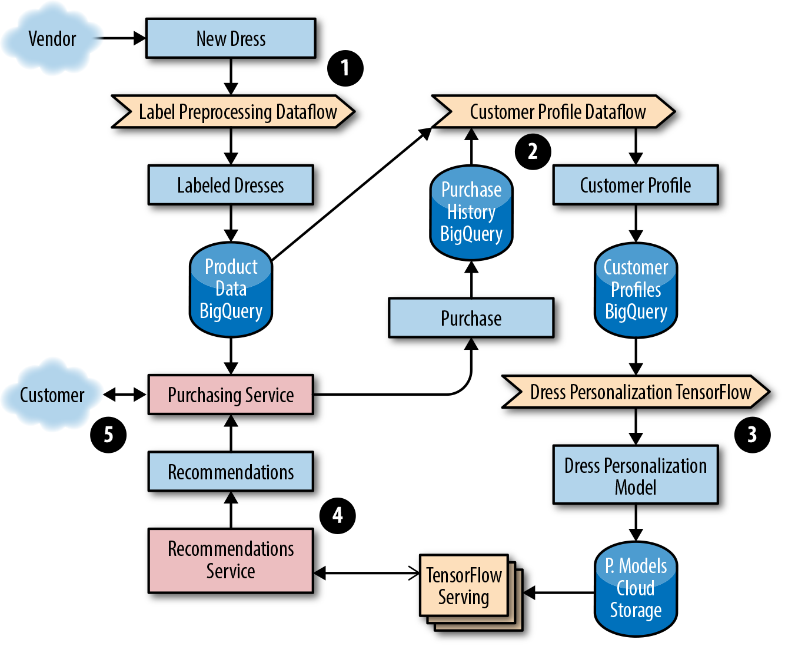
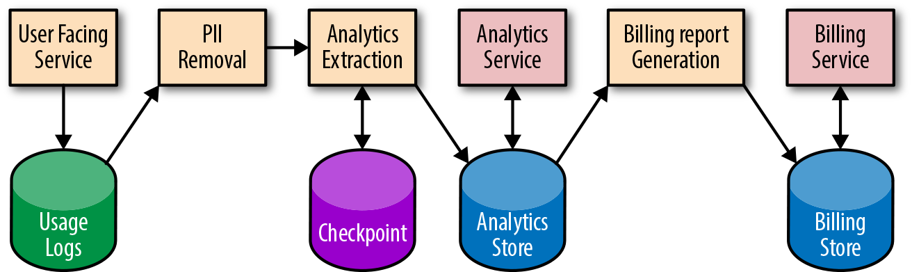
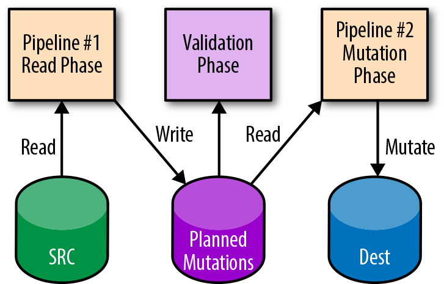
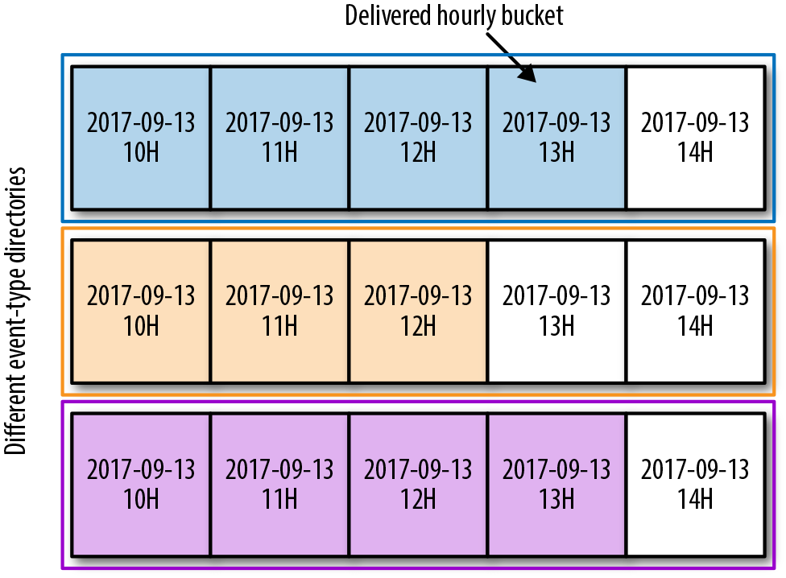
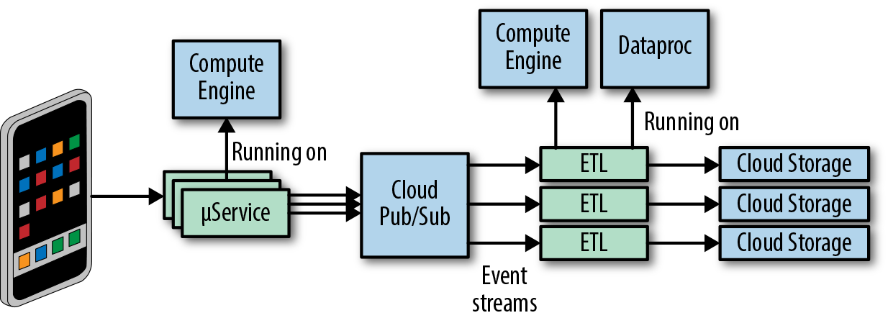
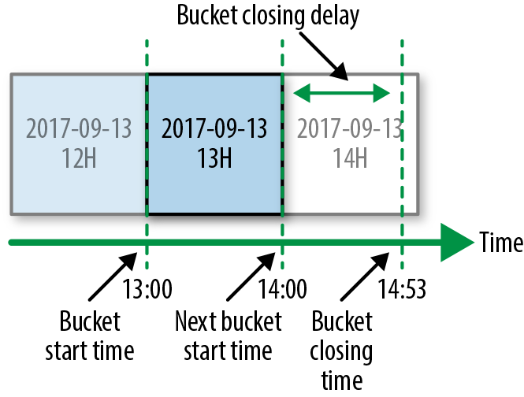
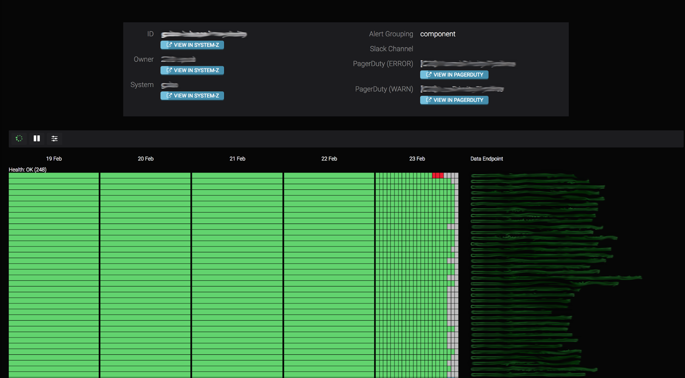
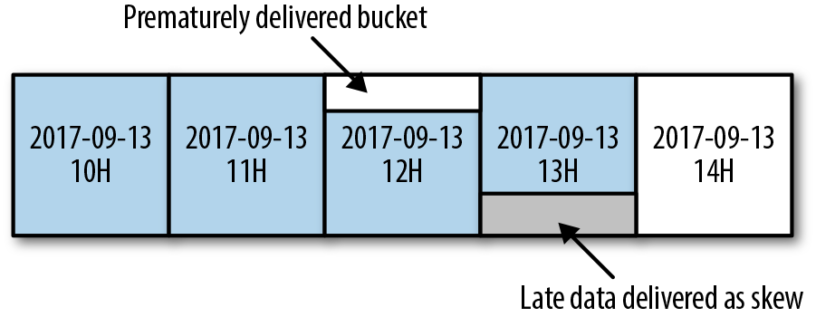
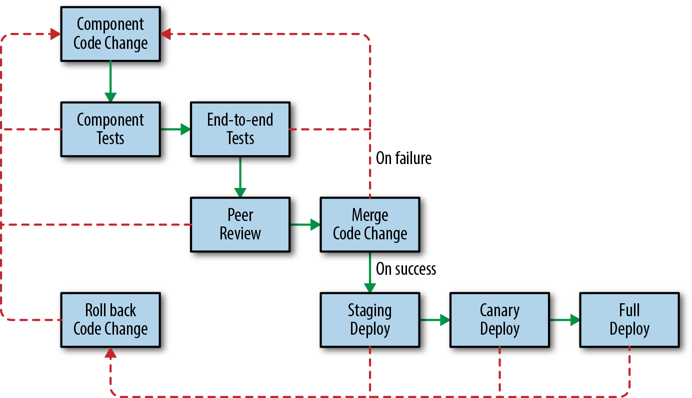

# Data Processing Pipelines

By Rita Sodt and Igor Maravić (Spotify)  
with Gary Luo, Gary O’Connor, and Kate Ward

Data processing is a complex field that’s constantly evolving to meet the demands of larger data sets, intensive data transformations, and a desire for fast, reliable, and inexpensive results. The current landscape features data sets that are generated and collected from a variety of sources—from mobile usage statistics to integrated sensor networks to web application logs, and more. Data processing pipelines can turn these often unbounded, unordered, global-scale data sets into structured, indexed storage that can help inform crucial business decisions or unlock new product features. In addition to providing insight into system and user behavior, [data processing](https://sre.google/sre-book/data-integrity/) is often business-critical. Delayed or incorrect data in your pipeline can manifest in user-facing issues that are expensive, labor-intensive, and time-consuming to fix.

This chapter starts by using product examples to examine some common types of applications of big data processing pipelines. We then explore how to identify pipeline requirements and design patterns, and enumerate some best practices of managing data processing pipelines throughout the development lifecycle. We cover tradeoffs you can make to optimize your pipeline and techniques for measuring the important signals of pipeline health. For a service to remain healthy and reliable once it’s deployed, SREs (as well as developers) should be able to navigate all of these tasks. Ideally, SREs should be involved in this work from its early stages: Google’s SRE teams regularly consult with teams developing a data processing pipeline to ensure that the pipeline can be easily released, modified, and run without causing issues for customers.

Finally, the Spotify case study provides an overview of their event delivery processing pipeline, which uses a combination of in-house, Google Cloud, and other third-party solutions to manage a complex, business-critical data processing pipeline. Whether you own a pipeline directly, or own another service that depends on the data that a pipeline produces, we hope you can use the information in this chapter to help make your pipelines (and services) more reliable.

For a comprehensive discussion of Google’s philosophies on data processing pipelines, see the [Data Processing Pipelines](https://sre.google/sre-book/data-processing-pipelines/) chapter of our first SRE book.

## Pipeline Applications

There is a wide variety of pipeline applications, each with its own strengths and use cases. A pipeline can involve multiple stages; each stage is a separate process with dependencies on other stages. One pipeline might contain multiple stages, which are abstracted away with a high-level specification. An example of this is in Cloud Dataflow: a user writes the business logic with a relatively high-level API, and the [pipeline technology](https://cloud.google.com/dataflow/pipelines/specifying-exec-params) itself translates this data into a series of steps or stages where one’s output is the input of another. To give you an idea of the breadth of pipeline applications, next we describe several pipeline applications and their recommended uses. We use two example companies with different pipeline and implementation requirements to demonstrate different ways of meeting their respective data needs. These examples illustrate how your specific use case defines your project goals, and how you can use these goals to make an informed decision on what data pipeline works best for you.

### Event Processing/Data Transformation to Order or Structure Data

The Extract Transform Load (ETL) model is a common paradigm in data processing: data is extracted from a source, transformed, and possibly denormalized, and then “reloaded” into a specialized format. In more modern applications, this might look like a cognitive process: data acquisition from some kind of sensor (live or playback) and a selection and marshalling phase, followed by “training” of a specialized data structure (like a machine learning network).

ETL pipelines work in a similar way. Data is extracted from a single (or multiple) sources, transformed, and then loaded (or written) into another data source. The transformation phase can serve a variety of use cases, such as:

- Making changes to the data format to add or remove a field

<!-- -->

- Aggregating computing functions across data sources

<!-- -->

- Applying an index to the data so it has better characteristics for serving jobs that consume the data

Typically, an ETL pipeline prepares your data for further analysis or serving. When used correctly, ETL pipelines can perform complex data manipulations and ultimately increase the efficiency of your system. Some examples of ETL pipelines include:

- Preprocessing steps for machine learning or business intelligence use cases

<!-- -->

- Computations, such as counting how many times a given event type occurs within a specific time interval

<!-- -->

- Calculating and preparing billing reports

<!-- -->

- Indexing pipelines like the ones that power Google’s web search

### Data Analytics

Business intelligence refers to technologies, tools, and practices for collecting, integrating, analyzing, and presenting large volumes of information to enable better decision making.[^1] Whether you have a retail product, a mobile game, or [Internet of Things–connected sensors](https://en.wikipedia.org/wiki/Internet_of_things), aggregating data across multiple users or devices can help you identify where things are broken or working well.

To illustrate the data analytics use case, let’s examine a fictional company and their recently launched mobile and web game, Shave the Yak. The owners want to know how their users interact with the game, both on their mobile devices and on the web. As a first step, they produce a data analytics report of the game that processes data about player events. The company’s business leaders have requested monthly reports on the most used features of the game so they can plan new feature development and perform market analysis. The mobile and web analytics for the game are stored in Google Cloud [BigQuery](https://cloud.google.com/bigquery/) tables that are updated three times a day by [Google Analytics](https://en.wikipedia.org/wiki/Google_Analytics). The team set up a job that runs whenever new data is added to these tables. On completion, the job makes an entry in the company’s daily aggregate table.

### Machine Learning

Machine learning (ML) applications are used for a variety of purposes, like helping predict cancer, classifying spam, and personalizing product recommendations for users. Typically, an ML system has the following stages:

1.  Data features and their [labels](https://en.wikipedia.org/wiki/Labeled_data) are extracted from a larger data set.
2.  An ML algorithm trains a model on the extracted features.
3.  The model is evaluated on a test set of data.
4.  The model is made available (served) to other services.
5.  Other systems make decisions using the responses served by the model.

To demonstrate an ML pipeline in action, let’s consider an example of a fictional company, Dressy, that sells dresses online. The company wants to increase their revenue by offering targeted recommendations to their users. When a new product is uploaded to the site, Dressy wants their system to start incorporating that product into user recommendations within 12 hours. Ultimately, Dressy would like to present users with near-real-time recommendations as they interact with the site and rate dresses. As a first step in their recommender system, Dressy investigates the following approaches:

Collaborative

- Show products that are similar to each other.

Clustering

- Show products that have been liked by a similar user.

Content-based

- Show products that are similar to other products that the user has viewed or liked.

As an online shop, Dressy has a data set of user profile information and reviews, so they opt to use a clustering filter. New products that are uploaded to their system don’t have structured data or consistent labels (e.g., some vendors may include extra information about color, size, and features of the dress using different categories and formats). Consequently, they need to implement a pipeline to preprocess the data into a format compatible with [TensorFlow](https://www.tensorflow.org/) that joins both the product information and user profile data. The ML system includes pipelines to preprocess data from multiple sources needed to train the model. Using the training data, Dressy’s development team creates a TensorFlow model to serve the appropriate recommendations to customers. [Figure 13-1](#ml-data-processing-pipeline) shows the full ML solution. We detail each step afterward.



*Figure 13-1. ML data processing pipeline*

1.  The development team elects to use a streaming dataflow pipeline, Google Cloud Dataflow, to preprocess the data into a format of labeled dresses by sending images to an image classification service that returns a list of characteristics.
2.  The team preprocesses data from multiple sources that will be used to train a model that returns the top five most similar dresses. Their workflow generates an ML model from the dress product data and purchase history from customer profiles stored in BigQuery.
3.  They choose to use a streaming Dataflow pipeline to preprocess the data into a format of customer personalization profiles. These profiles are used as input to train a TensorFlow model. The trained TensorFlow model binary is stored in a [Google Cloud Storage (GCS) bucket](https://cloud.google.com/storage/). Before being promoted to production, the team ensures the model passes accuracy checks when evaluated against a test set of the preprocessed data used for model evaluation.
4.  A service provides the recommendations for a given customer, which the web and mobile frontends use. The team uses TensorFlow with the [Cloud ML online prediction service](https://cloud.google.com/ml-engine/).
5.  A customer-facing, frontend service for making purchases serves the user data based on the up-to-date dress recommendations from the prediction service.

Dressy has noticed that occasionally a new model doesn’t get published for over 24 hours, and the recommendations trigger intermittent errors. This is a common issue when a new model is deployed for the first time; however, there are some simple steps you can take to resolve this problem. If you start to notice that decisions, classifications, or recommendations either aren’t being surfaced or are stale or incorrect, ask yourself:

- Is data stuck coming into the pipeline before it can be preprocessed to train the model?
- Do we have a poor ML model caused by a software bug? Is there a lot of spam? Are the features used to train the model poorly chosen?
- Has a new version of the ML model been recently generated, or is a stale version of the model running in production?

Luckily, Dressy has a set of tools to monitor and detect an issue before their customers experience any problems. If and when an outage occurs, these tools can help them to quickly repair or roll back any offending code. For more details on implementing monitoring and alerting, see [Monitoring](https://sre.google/workbook/monitoring/).

# Pipeline Best Practices

The following pipeline best practices apply to pipelines that are run as a service (i.e., pipelines that are responsible for correctly processing data in a timely manner for consumption by other systems). Multiple steps are required to properly deploy a pipeline as a service. These steps range from defining and measuring your customer needs with an SLO, to gracefully responding to degradations and failures, to writing documentation and creating a development lifecycle that catches issues before they reach production.

### Define and Measure Service Level Objectives

It’s important to automatically detect when your pipeline is unhealthy and if you are failing to meet your customer’s needs. Receiving notifications when you’re in danger of exceeding your error budget (for more details on error budget, see [Implementing SLOs](https://sre.google/workbook/implementing-slos/)) helps to minimize customer impact. At the same time, it’s important to strike a comfortable balance between reliability and feature launches—your customers care about both. The remainder of this section provides examples of pipeline SLOs and how to maintain them.

###### Data freshness

Most pipeline data freshness SLOs are in one of the following formats:

- X% of data processed in Y [seconds, days, minutes].
- The oldest data is no older than Y [seconds, days, minutes].
- The pipeline job has completed successfully within Y [seconds, days, minutes].

For example, the Shave the Yak mobile game could choose to target an SLO requiring 99% of all user actions that impact the user score to be reflected in the scoreboard within 30 minutes.

###### Data correctness

Creating SLOs for data correctness ensures that you are alerted about potential data errors in your pipeline. For example, a correctness error in a billing pipeline could result in customers being charged too much or too little. A correctness target can be difficult to measure, especially if there is no predefined correct output. If you don’t have access to such data, you can generate it. For example, use test accounts to calculate the expected output. Once you have this “golden data,” you can compare expected and actual output. From there, you can create monitoring for errors/discrepancies and implement threshold-based alerting as test data flows through a real production system.

Another data correctness SLO involves backward-looking analysis. For example, you might set a target that no more than 0.1% of your invoices are incorrect per quarter. You might set another SLO target for the number of hours/days that bad data or errors are served from the pipeline output data. The notion of data correctness varies by product and application.

###### Data isolation/load balancing

Sometimes you will have segments of data that are higher in priority or that require more resources to process. If you promise a tighter SLO on high-priority data, it’s important to know that this data will be processed before lower-priority data if your resources become constrained. The implementation of this support varies from pipeline to pipeline, but often manifests as different queues in task-based systems or different jobs. Pipeline workers can be configured to take the highest available priority task. There could be multiple pipeline applications or pipeline worker jobs running with different configurations of resources—such as memory, CPU, or [network tiers](https://cloud.google.com/network-tiers/)—and work that fails to succeed on lower provisioned workers could be retried on higher provisioned ones. In times of resource or system constraints, when it’s impossible to process all data quickly, this separation allows you to preferentially process higher-priority items over lower ones.

###### End-to-end measurement

If your pipeline has a series of stages, it can be tempting to measure a per-stage or per-component SLO. However, measuring SLOs in this fashion doesn’t capture your customer’s experience or the end-to-end health of your system. For example, imagine you have an event-based pipeline such as Google Analytics. The end-to-end SLO includes log input collection and any number of pipeline steps that happen before data reaches the serving state. You could monitor each stage individually and offer an SLO on each one, but customers only care about the SLO for the sum of all stages. If you’re measuring SLOs for each stage, you would be forced to tighten your per-component alerting, which could result in more alerts that don’t model the user experience.

Additionally, if you measure data correctness only per stage, you could miss end-to-end data corruption bugs. For example, each stage in your pipeline could report that all is well, but one stage introduces a field that it expects a downstream job to process. This upstream stage assumes that the extra data has been processed and used to serve requests to users. A downstream job doesn’t expect the additional field, so it drops the data. Both jobs think they are correct, but the user doesn’t see the data.

### Plan for Dependency Failure

Once you define your SLO, it’s good practice to confirm that you aren’t overdepending on the SLOs/SLAs of other products that fail to meet their commitments. Many products, such as Google Cloud Platform, list their [SLA promises](https://cloud.google.com/terms/sla/) on their sites. Once you identify any third-party dependencies, at a minimum, design for the largest failure accounted for in their advertised SLAs. For example, when defining an SLO, the owner of a pipeline that reads or writes data to Cloud Storage would ensure that the [uptimes and guarantees advertised](https://cloud.google.com/storage/sla) are appropriate. If the single-region uptime guarantee was less than required by the pipeline to meet its SLO on data processing time, the pipeline owner may choose to replicate the data across regions to get the higher availability.

When a service provider’s infrastructure breaks its SLAs, the result can negatively impact dependent pipelines. If your pipeline depends on more strict guarantees than the service provider advertises, your service could fail even if the service provider remains within their SLA. Sometimes, realistically planning for dependency failure can mean accepting a lower level of reliability and offering a looser SLA to your customers.[^2]

At Google, to encourage pipeline development with dependency failure in mind, we stage planned outages. For example, many pipelines at Google depend on the availability of the datacenter where they run. Our Disaster Recovery Testing (DiRT) frequently targets these systems, simulating a regional outage. When a regional outage occurs, pipelines that have planned for failure automatically fail over to another region. Other pipelines are delayed until the operator of the failed pipeline is alerted by their monitoring and manually fails over. Successful manual failover assumes that the pipeline can obtain enough resources to bring up a production stack in another region. In a best-case scenario, an unsuccessful manual failover prolongs an outage. In a worst-case scenario, processing jobs may have continued processing stale data, which introduces out-of-date or incorrect data in any downstream pipelines. Recovery tactics from an incident like this vary depending on your setup. For example, if correct data was overwritten with incorrect data, you may have to restore data from a previous backup version and reprocess any missing data.

In summary, it’s good practice to prepare for the day when the systems you depend on are unavailable. Even the best products will fail and experience outages. Regularly practice disaster recovery scenarios to ensure your systems are resilient to common and uncommon failures. Assess your dependencies and automate your system responses as much as possible.

### Create and Maintain Pipeline Documentation

When well written and maintained, system documentation can help engineers visualize the data pipeline and its dependencies, understand complex system tasks, and potentially shorten downtime in an outage. We recommend three categories of documentation for your pipeline.

###### System diagrams

System diagrams, similar to [Figure 13-2](#pipeline-system-diagram), can help on-call engineers quickly find potential failure points. At Google, we encourage teams to draw system diagrams that show each component (both pipeline applications and data stores), and the transformations that happen at each step. Each of the components and transformations shown in your diagram can get stuck, causing data to stop flowing through the system. Each component can also introduce a software or application configuration bug that impacts data correctness.

A system diagram should contain quick links to other monitoring and debugging information at different pipeline stages. Ideally, these links should pull from live monitoring information, displaying the current status of each stage (e.g., waiting for dependent job to finish/processing/complete). Displaying historical runtime information can also indicate if a pipeline stage is taking longer than expected. This delay can foreshadow performance degradation or an outage.

Finally, even in complex systems, a system diagram makes it easier for developers to analyze data dependencies they should be aware of during feature launches.



*Figure 13-2. Pipeline system diagram (PII = personally identifiable information)*

###### Process documentation

It’s important to document how to perform common tasks, such as releasing a new version of a pipeline or introducing a change to the data format. Ideally, you should also document less common (often manual) tasks, such as initial service turnup or final service turndown in a new region. Once your tasks are documented, investigate the possibility of automating away any manual work. If the tasks and system are automated, consider generating your documentation directly from the source so you can keep both in sync.

###### Playbook entries

Each alert condition in your system should have a corresponding playbook entry that describes the steps to recovery. At Google, we find it useful to link this documentation in any alert messages sent to on-call engineers. Playbook entries are discussed in more detail in the [Being On-Call](https://sre.google/sre-book/being-on-call/) chapter of our first book.

### Map Your Development Lifecycle

As shown in [Figure 13-3](#pipeline-development-lifecycle-with-release-workflow), the development lifecycle of a pipeline (or a change to a pipeline) isn’t too different from the development lifecycle of other systems. This section follows a typical release flow through each stage of the pipeline development lifecycle.


*Figure 13-3. Pipeline development lifecycle with release workflow*

###### Prototyping

The first phase of development involves prototyping your pipeline and verifying semantics. Prototyping ensures that you can express the business logic necessary to execute your pipeline. You may discover that one programming language allows you to better express your business logic, or that a particular language more easily integrates with your existing libraries. A particular programming model may suit your specific use case (e.g., Dataflow versus MapReduce, batch versus streaming). For an example of a completed programming model comparison, see our blog post [“Dataflow/Beam & Spark: A Programming Model Comparison”](https://cloud.google.com/dataflow/blog/dataflow-beam-and-spark-comparison). If you are adding a feature to an existing pipeline, we recommend adding your code and running unit tests in the prototype stage.

###### Testing with a 1% dry run

Once you have completed your prototype, it’s helpful to run a small setup on the full stack using production data. For example, run your pipeline using an experimental set, or a 1% dry run of production data in a nonproduction environment. Gradually scale up, tracking your pipeline performance to ensure you don’t encounter any bottlenecks. When your product has launched to customers, run performance tests. These tests are an integral development step that helps prevent outages caused by new feature rollouts.

###### Staging

Before deploying to production, it’s useful to run your system in a preproduction (or staging) environment. The data in your staging environment should be as close to actual production data as possible. We recommend keeping a full copy of production data or at least a representative subset. Unit tests won’t catch all pipeline issues, so it’s important to let the data flow through the system end-to-end to catch integration issues.

Integration tests can also identify errors. Using both unit and [integration tests](https://sre.google/sre-book/testing-reliability/), run an A/B comparison of your newly generated data to previously generated known good data. For example, check your previous release for expected or unexpected differences before certifying the release and marking it ready to move to production.

###### Canarying

Pipeline testing and verification requires more time and care than stateless jobs—the data is persisted and the transformations are often complex. If something goes wrong in your production release, it’s important to catch the issue early so you can limit the impact. Canarying your pipeline can help! Canarying is a process whereby you partially deploy your service (in this case, the pipeline application) and monitor the results. For a more detailed discussion of canarying, see [Canarying Releases](https://sre.google/workbook/canarying-releases/). Canarying is tied to the entire pipeline rather than a single process. During a canary phase, you may choose to process the same real production data as the live pipeline but skip writes to production storage; techniques such as two-phase mutation can help (see [Idempotent and Two-Phase Mutations](#idempotent-and-two-phase-mutations)). Often, you’ll have to wait for the complete cycle of processing to finish before you can discover any customer-impacting issues. After your dry run (or two-phase mutation), compare the results of your canary pipeline with your live pipeline to confirm their health and check for data differences.

Sometimes it is possible to progress through the canary by gradually updating tasks of a job or by updating first in one region and then another, but this is not always possible with pipelines. Pipelines that use replicated data, such as Dataproc[^3] and Dataflow,[^4] support regional endpoints[^5] and prevent this kind of canary progression—you can’t reload one cell in isolation from another. If you run a multihomed pipeline, it may not be possible to deploy to a single region (or a percentage of servers) like you might with a serving job. Instead, perform a rollout for a small percentage of data first, or as described earlier, roll out in dry-run mode first.

During verification of your canary or preproduction environment, it is important to assess the health of your pipeline. Usually, you can use the same metrics you use to track your SLOs. Verifying your canary is a task that lends itself well to automation.

###### Performing a partial deployment

In addition to canarying your changes, you may also want to perform a partial deployment, particularly if there is a major feature launch or change that could impact system performance and resource usage. It can be difficult to predict the impact of these kinds of launches without first testing your changes on a subset of real traffic. You can implement a partial deployment as a flag or configuration option in your pipeline that accepts an allowed subset of data. Consider first processing your new features on one or two accounts, then gradually ramping up the amount of data (e.g., ~1%, ~10%, ~50%, and finally, 100% of your sample data).

There are a number of ways your partial deployment can go wrong: the input data might be incorrect or delayed, your data processing might have a bug, or your final storage might have an error. Any of these issues can result in an outage. Avoid promoting a corrupt set of data to your low-latency frontends. Aim to catch these types of issues as early as possible, before they reach your users.

###### Deploying to production

Once you have fully promoted your new pipeline binaries and/or config to production, you should be reasonably confident that you’ve vetted any potential issues (and if an issue does occur, that your monitoring will alert you). If your deployment goes wrong, be able to quickly restore from a known good state (e.g., roll back the binaries) and mark any potentially broken data as bad (e.g., replace the bad data with data from a previous backup version, make sure no jobs read the affected data, and/or reprocess the data if necessary).

### Reduce Hotspotting and Workload Patterns

Hotspotting happens when a resource becomes overloaded from excessive access, resulting in an operation failure. Pipelines are susceptible to workload patterns—both through reads and writes—that can cause delays in isolated regions of data. Some common examples of hotspotting include:

- Errors thrown because multiple pipeline workers are accessing a single serving task, causing overload.
- CPU exhaustion due to concurrent access to a piece of data that is available on only one machine. Often, the internals of your data storage have a lowest level of granularity that may become unavailable if accessed heavily (e.g., a [Spanner tablet](https://www.usenix.org/system/files/conference/osdi12/osdi12-final-16.pdf) can become overloaded due to a problematic section of data even though most of the data storage is fine).
- Latency due to row-level lock contention in a database.
- Latency due to concurrent access to a hard drive, which exceeds the physical ability of the drive head to move fast enough to quickly locate the data. In this case, consider using solid state drives.
- A large work unit that requires many resources.

Hotspotting can be isolated to a subset of data. To combat hotspotting, you can also block fine-grained data such as individual records. If that data is blocked, the rest of the pipeline can progress. Typically, your infrastructure can provide this functionality. If a chunk of processing work is consuming a disproportionate amount of resources, the pipeline framework can dynamically rebalance by breaking the work into smaller pieces. To be safe, it’s still best to build an emergency shutdown into your client logic to allow you to stop processing and isolate fine-grained chunks of processing work characterized by large resource usage or errors. For example, you should be able to quickly set a flag or push a config that allows you to skip input data that matches a certain pattern or problematic user.

Other strategies to reduce hotspotting include:

- Restructuring your data or access patterns to spread the load evenly
- Reducing the load (e.g., statically allocate some or all of your data)
- Reducing lock granularity to avoid data lock contention

### Implement Autoscaling and Resource Planning

Spikes in workload are common and can lead to service outages if you’re unprepared for them. Autoscaling can help you handle these spikes. By using autoscaling, you don’t have to provision for peak load 100% of the time (for more details on autoscaling, see [Managing Load](https://sre.google/workbook/managing-load/)). Constantly running the number of workers required for peak capacity is an expensive and inefficient use of resources. Autoscaling turns down idle workers so you won’t pay for resources you don’t need. This strategy is particularly important for streaming pipelines and workloads that are variable. Batch pipelines may run simultaneously and will consume as many resources as are available.

Predicting the future growth of your system and allocating capacity accordingly ensures that your service won’t run out of resources. It’s also important to weigh the cost of resources against the engineering effort needed to make the pipeline more efficient. When conducting resource planning with an estimate of future growth, keep in mind that costs may not be isolated to just running your pipeline job. You may also be paying the data storage and network bandwidth costs for replicating data across regions or cross-region writes and reads. Additionally, some data store systems are more expensive than others. Even though unit storage costs are low, these costs can quickly add up for very large data sets or expensive data access patterns that use a lot of computing resources on the storage servers. It’s good practice to help drive down costs by periodically examining your data set and pruning unused content.

Although the effectiveness of a series of pipeline stages should be measured according to its end-to-end SLO, the pipeline efficiency and resource usage should be measured at each individual stage. For example, imagine that you have many jobs using BigQuery and notice a significant increase in BigQuery resource usage after a release. If you can quickly determine which jobs are responsible, you can focus your engineering effort on those jobs to drive down costs.

### Adhere to Access Control and Security Policies

Data flows through your system and is often persisted along the way. When managing any persisted data, we recommend you adhere to the following privacy, security, and data integrity principles:

- Avoid storing personally identifiable information (PII) in temporary storage. If you’re required to store PII temporarily, make sure the data is properly encrypted.
- Restrict access to the data. Grant each pipeline stage only the minimal access it needs to read the output data from the previous stage.
- Put time to live (TTL) limits on logs and PII.

Consider a BigQuery instance that is tied to a GCP project whose access permissions can be managed with Google Cloud Identity and Access Management (e.g., the Dressy example described earlier). Creating different projects and instances per function allows more fine-grained scoping to restrict access. Tables can have a master project and cross-create views among client projects to allow them controlled access. For example, Dressy has restricted access to tables containing sensitive customer information for jobs from specific project roles.

### Plan Escalation Paths

It is important to design your pipeline to be resilient so that a system failure (like a machine or zonal outage) never triggers an SLO violation page. By the time you get paged, you need to manually intervene because all automated measures have been exhausted. If you have well-defined SLOs and reliable metrics and alert detection, you’ll be alerted before your customers notice or report issues. When an SLO is violated, it’s important to respond quickly and send proactive communication to your customers.

# Pipeline Requirements and Design

Today’s market provides many pipeline technology and framework options, and it can be overwhelming to identify which one best suits your use case. Some platforms provide fully managed pipelines. Others give you more flexibility but require more hands-on management. In SRE, we often take a significant amount of time during the design phase to assess which technology is the best fit. We compare and contrast the various design options based on user needs, product requirements, and system constraints. This section discusses tools you can use to both assess your pipeline technology options and make improvements to existing pipelines.

### What Features Do You Need?

[Table 13-1](#recommended-data-pipeline-features) provides a list of features we recommend you optimize for when managing a data processing pipeline. Some of these features may already be present in your existing pipeline technology (e.g., via managed pipeline platforms, client application logic, or operational tools). Your application may not need some of these features—for example, you don’t need “exactly once” semantics if your work units are idempotent and can be performed more than once for the same result.

<table id="recommended-data-pipeline-features">
<caption>Table 13-1. Recommended data pipeline features</caption>
<colgroup>
<col style="width: 50%" />
<col style="width: 50%" />
</colgroup>
<thead>
<tr class="header">
<th>Pipeline item</th>
<th>Feature</th>
</tr>
</thead>
<tbody>
<tr class="odd">
<td><p>Latency</p></td>
<td><p>Use an API that supports streaming, batch, or both. Streaming processing is generally better than batch processing at supporting lower-latency applications. If you choose batch but might at some point want streaming, an API that is interchangeable may reduce the migration cost later.</p></td>
</tr>
<tr class="even">
<td><p>Data correctness</p></td>
<td><p>Exactly-once semantics globally. You can require that data is processed (at most) once to get correct results.</p>
<p>Two-phase mutations.</p>
<p>Windowing functions for event processing and aggregations. You may want fixed time, session, or sliding windows to divide data (since data is not always processed in the order in which it’s received). You may also want in-order guarantees.</p>
<p>Black-box monitoring.</p>
<p>The ability to control the flow of multiple jobs or stages of your pipeline. This control should allow you to gate a job until another completes so the job does not process incomplete data.</p></td>
</tr>
<tr class="odd">
<td><p>High availability</p></td>
<td><p>Multihoming.</p>
<p>Autoscaling.</p></td>
</tr>
<tr class="even">
<td><p>Mean Time to Resolve (MTTR) incidents in data processing</p></td>
<td><p>Tie your code changes to a release, which allows for fast rollbacks.</p>
<p>Have tested data backup and restore procedures in place.</p>
<p>In the event of an outage, ensure that you can easily drain a region from serving or processing.</p>
<p>Have useful alert messages, dashboards, and logs for debugging. In particular, your monitoring should be quick to identify the reason(s) why a pipeline is delayed and/or why data is corrupt.</p>
<p>Use data checkpointing to help recover faster when a pipeline is interrupted.</p></td>
</tr>
<tr class="odd">
<td><p>Mean Time to Detect (MTTD) outages</p></td>
<td><p>Ensure you have SLO monitoring in place. Monitoring out-of-SLO alerts allows you to detect issues that impact your customers. Alerting on the <a href="https://sre.google/sre-book/monitoring-distributed-systems#id-9nCjSOtmcj">symptom (versus the cause)</a> reduces monitoring gaps.</p></td>
</tr>
<tr class="even">
<td><p>Development lifecycle to prevent errors from reaching production</p></td>
<td><p>We recommend running any changes in a canary environment before deploying to production. This strategy lowers the possibility of a change impacting SLOs in production.</p></td>
</tr>
<tr class="odd">
<td><p>Inspect and predict resource usage or cost</p></td>
<td><p>Create (or use an existing) resource accounting dashboard. Be sure to include resources like storage and network.</p>
<p>Create a metric that allows you to correlate or predict growth.</p></td>
</tr>
<tr class="even">
<td><p>Ease of development</p></td>
<td><p>Support a language that best fits your use case. Often pipeline technologies limit your options to one or two languages.</p>
<p>Use a simple API for defining data transformations and expressing your pipeline logic. Consider the tradeoff between simplicity and flexibility.</p>
<p>Reuse base libraries, metrics, and reporting. When you’re creating a new pipeline, reusable resources allow you to focus development on any new business logic.</p></td>
</tr>
<tr class="odd">
<td><p>Ease of operation</p></td>
<td><p>Use existing automation and operational tools as much as possible. Doing so reduces operational costs, as you don’t need to maintain your own tools.</p>
<p>Automate as many operational tasks as possible.</p>
<p>Larger tasks that are performed infrequently may include a chain of dependencies and prerequisites that can be too numerous or complex for a human to assess in a timely manner (e.g., moving your data and pipeline stack from region A to region B, then turning down region A). To ease a transition like this, consider investing in automation. Perhaps introduce some pipeline health checks on the pipeline stack in region B before putting it into production.</p></td>
</tr>
</tbody>
</table>

Table 13-1. Recommended data pipeline features {#recommended-data-pipeline-features}

### Idempotent and Two-Phase Mutations

Pipelines can process large amounts of data. When a pipeline fails, some data must be reprocessed. You can use the idempotent mutations design pattern to prevent storing duplicate or incorrect data. An [idempotent](https://en.wikipedia.org/wiki/Idempotence) mutation is a type of mutation that can be applied multiple times with the same result. Implementing this design pattern allows separate executions of a pipeline with the same input data to always produce the same result.

When testing or canarying a pipeline, you need to know if your applied mutations are acceptable to the pipeline owner according to the expected output. The two-phase mutation design pattern can help here. Typically, the data is read from a source and transformed, and then a mutation is applied. With two-phase mutation, the mutations themselves are stored in a temporary location. A separate verification step (or pipeline) can run against these potential mutations to validate them for correctness. A follow-up pipeline step applies the verified mutations only after the mutations pass validation. [Figure 13-4](#two-phase-mutation) shows an example of two-phase mutation.



*Figure 13-4. Two-phase mutation*

### Checkpointing

Typically, pipelines are long-running processes that analyze or mutate large amounts of data. Without special consideration, pipelines that are terminated early will lose their state, requiring the entire pipeline to be executed again. This is especially true for pipelines that create AI models, as each iteration of the model calculation relies on previous calculations. Checkpointing is a technique that enables long-running processes like pipelines to periodically save partial state to storage so that they can resume the process later.

While checkpointing is often used for the failure case, it’s also useful when a job needs to be preempted or rescheduled (e.g., to change CPU or RAM limits). The job can be cleanly shut down, and upon rescheduling, it’s able to detect which work units have already been processed. Checkpointing has the added advantage of enabling a pipeline to skip potentially expensive reads or computations because it already knows the work is done.

### Code Patterns

Some common code patterns can make your pipelines more efficient to manage and reduce the effort required to make changes or updates.

###### Reusing code

If you operate multiple similar pipelines and want to implement a new monitoring capability or metric, you have to instrument each separate system. This common workflow isn’t difficult if you use the right strategy. Implementing reusable code libraries allows you to add a metric for monitoring in one place and share it across multiple pipelines or stages. Shared libraries allow you to:

- Gain insight across all data pipelines in a standard way.
- Reuse other data analytics systems for each pipeline (e.g., a traffic report that works for all of your pipelines).
- Alert on the same metric for multiple jobs, such as a generic data freshness alert.

###### Using the microservice approach to creating pipelines

When using microservices, it’s important to have a service perform a single task and do it well. It’s easier to operate a group of microservices that use the same core libraries, varying only in their business logic, than it is to operate many custom services. A similar pattern can apply to pipelines. Instead of creating one monolithic pipeline application, create smaller pipelines that you can release and monitor separately. In doing so, you will get the same benefits as you get from a microservices architecture.

### Pipeline Production Readiness

As discussed in [SRE Engagement Model](https://sre.google/workbook/engagement-model/), a PRR (Production Readiness Review) is the process that Google SRE teams use to onboard a new service. In the same spirit, we use a pipeline maturity matrix when consulting on the choice or design of a pipeline technology.

###### Pipeline maturity matrix

The matrix in [Table 13-2](#pipeline-maturity-matrix) measures five key characteristics (but you can extend the matrix to measure other characteristics you wish to optimize or standardize for):

- Failure tolerance
- Scalability
- Monitoring and debugging
- Transparency and ease of implementation
- Unit and integration testing

The maturity matrix represents the collective knowledge of many pipeline experts at Google. These individuals are responsible for running pipelines across multiple Google products and productionizing the associated systems.

Each characteristic is measured on a scale of 1 to 5, where 1 represents “Chaotic” (unplanned, ad hoc, risky, fully manual) and 5 represents “Continuous improvement.” To score your system, read the descriptions for each characteristic below, and select the best matching milestone. If more than one milestone applies, use the score in the middle (i.e., 2 or 4). A completed scoresheet will give you a clear picture of where your system needs improvement.

We recommend that you spend the time to make improvements in any weak areas identified by the matrix. Instrumenting monitoring, alerting, and other tooling recommended by the matrix can be time-intensive. When making improvements, you can start by looking for existing products or open source tools that fit your needs instead of creating your own. At Google, we encourage teams to use existing pipeline technologies or tools that provide out-of-the-box pipeline support and features. The more tools and processes that can be reused, the better.

<table id="pipeline-maturity-matrix">
<caption>Table 13-2. Pipeline maturity matrix, with example milestones for beginning, medium, and advanced maturity</caption>
<colgroup>
<col style="width: 25%" />
<col style="width: 25%" />
<col style="width: 25%" />
<col style="width: 25%" />
</colgroup>
<thead>
<tr class="header">
<th></th>
<th><em>1. Chaotic</em></th>
<th><em>3. Functional</em></th>
<th><em>5. Continuous improvement</em></th>
</tr>
<tr class="odd">
<th><em></em>
<p>Failure tolerance</p></th>
<th></th>
<th></th>
<th></th>
</tr>
<tr class="header">
<th><p>Failover</p></th>
<th><p>No support for failover</p></th>
<th><p>Some support for work unit retries (even if manual)</p></th>
<th><p>Multihomed with automatic failover</p></th>
</tr>
<tr class="odd">
<th><p>Global work scheduling</p></th>
<th><p>No support for global work scheduling, multihoming, or failover</p></th>
<th><p>Support for hot/hot/hot processing (process same work in all three regions so if any region is unavailable, there is at least one still running)</p></th>
<th><p>Support for effective warm/warm/warm processing (distribute work in all three regions and store work centrally to deal with any region loss)</p></th>
</tr>
<tr class="header">
<th><p>Failed task management</p></th>
<th><p>No support for failed work units</p></th>
<th><p>---</p></th>
<th><p>Automatic retries for failed work units</p>
<p>Automatic quarantine of bad work units</p></th>
</tr>
<tr class="odd">
<th><em></em>
<p>Scalability</p></th>
<th></th>
<th></th>
<th></th>
</tr>
<tr class="header">
<th><p>Automatic scaling of available worker pool</p></th>
<th><p>No autoscaling; manual intervention required</p></th>
<th><p>Autoscaling works with the use of additional manual tools</p></th>
<th><p>Built-in automatic autoscaling support with no requirement for configuration inside a third-party tool</p></th>
</tr>
<tr class="odd">
<th><p>Automatic dynamic resharding to effect balanced load across the pool</p></th>
<th><p>Work units are fixed with no ability to make changes</p></th>
<th><p>Supports manual resharding of work, or resharding can be achieved automatically with additional code</p></th>
<th><p>Built-in support for dynamic subsharding to balance work across the available worker pool</p></th>
</tr>
<tr class="header">
<th><p>Load shedding/task prioritization</p></th>
<th><p>No work unit prioritization exists</p></th>
<th><p>Some capability for work unit prioritization</p></th>
<th><p>An easy-to-use feature for work unit prioritization exists</p>
<p>Built-in support for load shedding</p>
<p>Workers understand preemption notification, after which a worker will clean up (finish work/mitigate)</p></th>
</tr>
<tr class="odd">
<th><em>Monitoring and debugging</em></th>
<th></th>
<th></th>
<th></th>
</tr>
<tr class="header">
<th><p>Debugging tools and capabilities</p></th>
<th><p>No logs; no way to identify or track failed work units</p></th>
<th><p>There is a solution to identify a failed work unit and extract associated logs</p></th>
<th><p>There is a solution that allows a user to access logs for the time at which the work unit failed; this data is retrieved directly from the failed work unit</p>
<p>There is a solution to automatically quarantine and replay a failed work unit</p></th>
</tr>
<tr class="odd">
<th><p>Dashboards and visualizations</p></th>
<th><p>No dashboards or visualization solutions that support the display of pipeline information</p></th>
<th><p>There is an easy-to-configure dashboard showing the following information:</p>
<ul>
<li>Number of work units in various stages of completion</li>
<li>Latency and aging information for each stage</li>
</ul></th>
<th><p>A fine-grained visualization of the entire execution map for a pipeline</p>
<p>A visualization for delays up to each stage</p>
<p>A visualization and rationale for throttling and pushback</p>
<p>Information about limiting factors due to resource usage</p>
<p>Information about the distribution of internal state worker machines (e.g., stack graph)</p>
<p>Information about how many work units are failing, stuck, or slow</p>
<p>Historical run statistics are presented and preserved</p></th>
</tr>
<tr class="header">
<th><em>Ease of implementation and transparency</em></th>
<th></th>
<th></th>
<th></th>
</tr>
<tr class="odd">
<th><p>Discoverability</p></th>
<th><p>No feature for discoverability (a list of the pipelines that are running and their status)</p></th>
<th><p>Some support for discoverability; manual setup might be required, or not all pipelines are discoverable</p></th>
<th><p>Built-in support for automatic discoverability; a global data registry service that allows the listing of configured pipelines</p></th>
</tr>
<tr class="header">
<th><p>Code</p></th>
<th><p>Significant setup cost for using the technology</p></th>
<th><p>Some reusable components available</p></th>
<th><p>Base frameworks are available and require minimum code</p>
<p>The pipeline can be configured in machine-readable format</p>
<p>Zero config</p>
<p>Libraries with semantics similar to other pipeline solutions that are most heavily used in related teams</p></th>
</tr>
<tr class="odd">
<th><p>Documentation and best practices</p></th>
<th><p>Sparse or outdated documentation</p></th>
<th><p>Minimal setup documentation for each component</p></th>
<th><p>Comprehensive and up-to-date documentation</p>
<p>Training examples for new users</p></th>
</tr>
<tr class="header">
<th><p><em>Unit and integration testing</em></p></th>
<th></th>
<th></th>
<th></th>
</tr>
<tr class="odd">
<th><p>Unit testing framework</p></th>
<th><p>No support or unit testing framework</p></th>
<th><p>Tests take a long time to run and frequently time out</p>
<p>Too many resource requirements</p>
<p>No code coverage support</p>
<p>Easy to switch data sources to test a resource</p></th>
<th><p>Runs with <a href="https://github.com/google/sanitizers">sanitizers</a> (ASAN, TSAN, etc.)</p>
<p>The build dependency graph is as small as possible</p>
<p>Code coverage support</p>
<p>Provides debugging info and results</p>
<p>No external dependencies</p>
<p>Built-in test data generation library</p></th>
</tr>
<tr class="header">
<th><p>Ease of configuration (this has direct relevance to the scalability aspect of the pipeline)</p></th>
<th><p>Test configuration is not supported or requires a significant amount of time to learn, in addition to learning about the pipeline itself—for example, testing uses a different programming language and a different API than the pipeline</p></th>
<th><p>The first integration test requires significant setup, but subsequent tests are either a copy/paste or an extension to the first with minimal overrides—for example, a test data generator could be minimally tweaked to support collecting test data for many different pipeline applications</p></th>
<th><p>Decoupling from production configuration, while not preventing reuse; easier to define integration test configuration and reuse relevant parts of prod configuration</p></th>
</tr>
<tr class="odd">
<th><p>Support for integration testing frameworks (this describes how well a pipeline should interact and support various integration testing methodologies, which are not necessarily part of the pipeline itself)</p></th>
<th><p>Using Cloud or third-party open source tools for diffing, monitoring, integration testing, and so on, can be difficult to implement and/or resource-intensive; requires in-house tools or tools do not exist</p></th>
<th><p>Minimal documentation and examples of integration testing tools and methodologies used in conjunction with the pipeline</p>
<p>Large amount of time required even for data sets with minimal input</p>
<p>Difficult to trigger on-demand execution for testing scenarios</p>
<p>Difficult to separate production from nonproduction concerns (e.g., all event logs go to production logging service)</p></th>
<th><p>Built-in support for scaled-down input data</p>
<p>Support for diffing of output data (e.g., persisting output test data)</p>
<p>Configurable monitoring for test run validation</p>
<p>Ample documentation and examples of integration tests built for the pipeline</p></th>
</tr>
</thead>
&#10;</table>

Table 13-2. Pipeline maturity matrix, with example milestones for beginning, medium, and advanced maturity {#pipeline-maturity-matrix}

# Pipeline Failures: Prevention and Response

A pipeline can fail for many reasons, but the most common culprits are data delay and data corruption. When an outage occurs, finding and repairing the issue quickly will greatly reduce its impact. At Google, when an outage or SLO violation occurs, we track metrics for MTTD and MTTR. Tracking these metrics indicates how effective we are at detecting and repairing an issue. In the postmortem that follows any outage at Google, we analyze the cause of the outage to elicit any patterns and address sources of operational toil.

This section describes some common failure modes, methods to effectively respond to pipeline failures, and strategies to help you prevent future pipeline failures.

### Potential Failure Modes

###### Delayed data

A pipeline can fail if its input or output is delayed. Without the proper precautions, a downstream job may start running even though it doesn’t have the necessary data. Stale data is almost always better than incorrect data. If your pipeline processes incomplete or corrupt data, errors will propagate downstream. Restoring or reprocessing bad data takes time and can prolong an outage. Instead, if your pipeline stalls, waits for data, and then resumes once the data becomes available, the data remains high quality. Creating data dependencies that are respected by all stages is important.

Depending on the type of pipeline, the impact of delayed data can range from stale application data to stalled pipelines. In batch processing pipelines, each stage waits for its predecessor to finish before it begins. Streaming systems are more flexible: using event-time processing, such as Dataflow, a downstream stage can start a portion of work as soon as the corresponding upstream portion completes, rather than waiting for all portions to complete.

When an outage of this nature occurs, you will likely need to notify any dependent services. If the outage is user-visible, you may also have to notify your customers. When you’re debugging pipeline outages, it’s helpful to see the progress of current and past pipeline runs, and to have direct links to log files and a diagram of the flow of data. It’s also useful to be able to trace a unit of work through the system while analyzing its counters and statistics.

###### Corrupt data

If undetected, corrupt pipeline data (input and/or output) can cause user-facing issues. You can circumvent many user-facing issues by having tests that identify corrupt data in place, and using logic that alerts you to potential corruption. For example, pipeline systems can implement blocking policies and abuse/spam detection to automatically or manually filter out bad sources of data.

Corrupt data can have many causes: software bugs, data incompatibility, unavailable regions, configuration bugs, and so on. There are two main steps involved in fixing corrupt data:

1.  Mitigate the impact by preventing further corrupt data from entering the system.
2.  Restore your data from a previously known good version, or reprocess to repair the data.

If a single region is serving corrupt data, you may need to drain your serving jobs and/or data processing from that region. If a software or configuration bug is at fault, you may need to quickly roll back the relevant binary. Often, data corruption can cause windows of data that are incorrect and need to be reprocessed once the underlying issue has been fixed, such as fixing a software bug in a pipeline binary. To reduce the cost of reprocessing, consider selective reprocessing—read in and process only the user or account information impacted by the data corruption. Alternatively, you could persist some intermediate data that can serve as a checkpoint to avoid reprocessing a pipeline from end to end.

If the output of your pipeline is corrupt, downstream jobs may propagate the corrupt data or serving jobs may serve incorrect data. Even with the best testing, development, and release practices in place, a software or configuration bug can introduce data corruption. We recommend that you plan for this eventuality and have the ability to quickly reprocess and restore your data. Recovering from this kind of data corruption is labor-intensive and difficult to automate.

### Potential Causes

###### Pipeline dependencies

When you’re trying to determine the cause of an outage, it’s useful to investigate pipeline dependencies, such as storage, network systems, or other services. These dependencies may be throttling your requests/traffic or, if they are out of resources, refusing any new data. The rate of input/output can slow for a variety of reasons:

- The output sink or storage could be refusing writes of a piece of data.
- There could be a particular hotspot data range that cannot complete.
- There might be a storage bug.

Some pipeline dependency issues won’t resolve themselves. It’s important to file a ticket or bug, and to allow for enough time to add more resources or address traffic patterns. Implementing load balancing and dropping low-priority data may help mitigate the impact.

###### Pipeline application or configuration

A pipeline failure could be the result of a bottleneck, a bug in your pipeline jobs, or a bug in the configurations themselves (e.g., CPU-intensive processing, performance regression, out-of-memory failures, abusive data prone to hotspotting, or configs that point to the incorrect input/output locations). Depending on the cause, there are several possible solutions:

- Roll back the binary/config, cherry-pick a fix, or repair any permission issues.
- Consider restructuring the data that’s causing the issue.

Application or configuration errors can introduce data incorrectness or lead to delayed data. These kinds of errors are the most common causes of outages. We recommend spending time on pipeline development and ensuring that new binaries and configurations perform well in a nonproduction environment before they are fully deployed.

###### Unexpected resource growth

A sudden and unplanned jump in system load may cause a pipeline to fail. You may need additional unplanned resources to keep your service running. Automatic scaling of your application jobs can help meet the demand of new load, but you should also be aware that an increased pipeline load can also put a strain on downstream dependencies—you may also need to plan for more storage and/or network resources.

Good resource planning and accurate growth prediction can help in these cases, but such predictions may not always be correct. We recommend becoming familiar with the process of requesting additional emergency resources. Depending on the nature of your pipeline’s deployment and the quantity of resources required, the time needed to acquire these resources can be substantial. Therefore, we recommend preparing interim solutions to keep your service up and running—for example, prioritize different classes of data through your pipeline.

###### Region-level outage

A regional outage is bad for all pipelines, but singly homed pipelines are particularly vulnerable. If your pipeline runs in a single region that suddenly becomes unavailable, the pipeline will stop until the region comes back up. If you have multihomed pipelines with automatic failover, your response may be as simple as draining processing or serving from an affected region until the outage is over. When a region is down, data can become stranded or delayed, resulting in incorrect output from your pipeline. As a result, the correctness of the data output from any dependent jobs or services may be compromised.

# Case Study: Spotify

by Igor Maravić

Spotify is the leading music streaming company in the world. Every day, tens of millions of people use Spotify to listen to their favorite songs, share music with their friends, and discover new artists.

This case study describes our event delivery system, which is responsible for reliably collecting instrumentation data generated from Spotify applications. The data produced by this system helps us to better understand our end users and to provide them with the right music at the right time.

> **Note**
>
> In this case study, a “customer” refers to the development teams within Spotify that use data from the event delivery system. “End user” refers to individuals that use the Spotify service to listen to music.

### Event Delivery

We refer to end-user interactions as events. Every time a user listens to a song, clicks an ad, or follows a playlist, we record an event. Spotify captures and publishes hundreds of billions of events (of multiple types) to our servers daily. These events have many uses at Spotify, from A/B test analysis to showing play counts to powering personalized discovery playlists. Most importantly, we pay royalties to artists based on delivered events.[^6] It’s imperative that we have a reliable means of event storage and delivery.

Before we can process event data, that data needs to be collected and delivered to persistent storage. We use an event delivery system to reliably collect and persist all published events. The event delivery system is one of the core pillars of our data infrastructure, as almost all of our data processing depends—either directly or indirectly—on the data it delivers.

All delivered events are partitioned by type and publishing time. As shown in [Figure 13-5](#delivered-hourly-buckets), events published during any given hour are grouped together and stored in a designated directory, called a delivered hourly bucket. These buckets are then grouped into event-type directories. This partitioning scheme simplifies data access control, ownership, retention, and consumption at Spotify.



*Figure 13-5. Delivered hourly buckets*

Hourly buckets are the only interface our data jobs have with the event delivery system. As a result, we measure performance and define SLOs for our event delivery system based on how well we deliver hourly buckets per event type.

### Event Delivery System Design and Architecture

Our hourly buckets reside on Google Cloud Storage (GCS). Early in the design process, we decided to decouple data collection from data delivery within the system. To achieve this, we used a globally distributed persistent queue, Google Cloud [Pub/Sub](https://cloud.google.com/pubsub/), as an intermediate layer. Once decoupled, data collection and delivery act as independent failure domains, which limits the impact of any production issues and results in a more resilient system. [Figure 13-6](#event-delivery-system-architecture) depicts the architecture of our event delivery system.



*Figure 13-6. Event delivery system architecture*

###### Data collection

Produced events[^7] are grouped by event types. Each event type describes a user action in the Spotify application. For example, one event type could refer to a user subscribing to a playlist, while another event type could refer to a user starting playback of a song. To ensure that separate event types don’t impact each other, the system has full event type isolation. Individual events from different event types are published to their [allocated topics](https://cloud.google.com/pubsub/docs/admin) in Google Cloud Pub/Sub. Publishing is performed by our microservices, which run both in Spotify datacenters and on [Google Compute Engine (GCE)](https://cloud.google.com/compute/). In order to be delivered, each published event stream is handled by a dedicated instance of an ETL process.

###### Extract Transform Load

The ETL process is responsible for delivering published events to the correct hourly buckets on GCS. The ETL process has three steps/components:

1.  A dedicated microservice consumes events from the event stream.
2.  Another microservice assigns events to their hourly partitions.
3.  A batch data job running on Dataproc deduplicates events from their hourly partitions and persists them to their final location on GCS.

Each ETL component has a single responsibility, which makes the components easier to develop, test, and operate.

###### Data delivery

Event type delivery is dynamically enabled or disabled directly by our customers (other engineering teams at Spotify). Delivery is controlled via simple configuration. In the configuration, customers define which event types should be delivered. As delivery of each event type is turned on or off, a microservice dynamically acquires and releases the Google GCE resources on which the ETL runs. The following code shows an example event type that a customer can enable/disable:

``` code-indentation
events:
    -CollectionUpdate
    -AddedToCollection
    -RemovedFromCollection
```

When a customer enables delivery of a new event type, we don’t know in advance what quantity of resources are required to guarantee the delivery. Consequently, manually determining necessary resources is very expensive. To achieve optimal resource utilization for delivery of different event types, we use GCE [Autoscaler](https://cloud.google.com/compute/docs/load-balancing-and-autoscaling).

### Event Delivery System Operation

Defining and communicating SLOs for our event delivery system helps in three ways:

Design and development

- When developing our systems, having clear SLOs in place gives us goals to work toward. These goals help us make pragmatic design choices and optimize our systems for simplicity.

Identify performance issues

- Once our systems are deployed in production, SLOs help us to identify which parts of the system aren’t performing well and where we need to focus our efforts.

Set customer expectations

- SLOs allow us to manage our customer expectations and avoid unnecessary support requests. When the limits of our system are clear to our customers, they are empowered to decide how to design, build, and operate their own systems that depend on our data.

We provide our customers with three SLO types for our event delivery system: timeliness, completeness, and skewness (discussed next). These SLOs are based on hourly data buckets provided by GCS. To be as objective as possible and to avoid bloating event delivery with features that have nothing to do with it, we measure all SLOs using independent external systems (e.g., Datamon, a data visualization tool explained in the next section).

###### Timeliness

Our timeliness SLO is defined as the maximum delay of delivering an hourly bucket of data. Delivery delay is calculated as the time difference between when the bucket was delivered and the earliest theoretical time the bucket could have been closed. [Figure 13-7](#event-time-partitioning) provides an example of this delivery delay. The diagram shows the buckets for hours 12, 13, and 14. If the bucket for hour 13 was closed at 14:53, we would say the closing delay was 53 minutes.



*Figure 13-7. Event time partitioning*

Timeliness of data delivery is the metric we use to evaluate the performance of our data pipelines. To measure and visualize timeliness, we use a tool called Datamon, our internal data monitoring tool that was built around the notion of hourly buckets. [Figure 13-8](#datamon-for-spotifys-data-monitoring-system) shows a typical Datamon UI. Each green rectangle (in grayscale, the vast majority of the rectangles) represents an on-time hourly bucket. Gray rectangles (clustered here on the righthand side) indicate buckets that have not been delivered, while red rectangles (3 dark rectangles on the very top row) indicate buckets that weren’t delivered within the required SLO. Days when all hours were successfully delivered are shown as a single green rectangle.



*Figure 13-8. Datamon for Spotify’s data monitoring system*

Downstream data jobs can’t start their processing until the hourly buckets on which they depend are delivered. Each data job periodically checks the delivery status of its dependencies before processing the data. Any delay in delivery affects the timeliness of downstream jobs. Our customers care deeply about having data delivered in a timely fashion. To help us prioritize delivery of events during an incident, our event delivery system’s timeliness SLO is split into three priority tiers: high, normal, and low. Our customers configure to the appropriate tier for their event type.

###### Skewness

We define our skewness SLO as the maximal percentage of data that can be misplaced on a daily basis. Skewness (and completeness) are concepts specific to our event delivery system and are not present in our other data pipelines. Defining an SLO for these concepts was a key requirement when we were designing our event delivery system, as it processes (among other event types) finance-bearing events. For all other events, best-effort delivery is good enough and we don’t expose a corresponding SLO. Whether or not an event is finance-bearing is determined by customer configuration.

To determine when an hourly bucket should be delivered, our event delivery system uses heuristics. By definition, heuristics aren’t always completely correct. As a result, undelivered events from previously delivered buckets might be delivered to an incorrect future hourly bucket. This misplaced event is referred to as a skew. A skew can negatively impact jobs, since they might first underreport and then overreport values for some time periods. [Figure 13-9](#delivery-of-skewed-data) shows an example of skewed data delivery.



*Figure 13-9. Delivery of skewed data*

###### Completeness

Events can be lost in a distributed system in many ways—for example, a new release of our software may contain a bug, a cloud service may go down, or a developer might accidentally delete some persisted events. To ensure we are alerted about data loss, we measure completeness. We define completeness as the percentage of events that are delivered after they are successfully published to the system.

We report on skewness and completeness daily. To measure these values, we use an internal auditing system that compares the counts for all published and delivered events. Any mismatch is reported, and we take appropriate action.

In order to have timeliness, skewness, and completeness SLO guarantees, we assign events to our hourly buckets at the time they were received at our servers, not when they were produced on the clients. If our users are in offline mode, produced events can be buffered for up to 30 days on the clients before being published. Additionally, users can modify the system time on their device, which can result in inaccurately timestamped events. For these reasons, we use the timestamp from Spotify servers.

We don’t provide any SLOs regarding the data quality or accuracy of events delivered via our event delivery system. We observed that in a majority of cases, quality depends on the content of each event, which is populated by the business logic of our customers. To allow our system to scale with the number of customers, we keep it focused exclusively on delivering data. In this regard, we use the analogy that event delivery should behave like a postal service: your mail should be delivered on time, intact, and unopened. We leave the responsibility of providing quality SLOs to our internal teams that own the business logic and therefore understand the contents of the data.

### Customer Integration and Support

Many Spotify teams interact with the event delivery system daily. To encourage adoption and decrease the learning curve, we took the following steps to simplify user interaction with the event delivery system:

Event delivery as a fully managed service

- We wanted to avoid exposing the complexity of the system to our customers, allowing them to focus on the specific problems they’re trying to solve. We strived to hide any system complexities behind a well-defined and easy-to-understand API.

Limited functionality

- To keep our APIs simple, we support only a limited set of functionalities. Events can be published only in a specific in-house format, and can be delivered only to hourly buckets with a single serialization format. These simple APIs cover the majority of our use cases.

Delivery of each event needs to be explicitly enabled

- When a customer enables delivery of an event, they define whether the event is financial-bearing and its associated timeliness requirements. Furthermore, event ownership needs to be explicitly defined as part of the enabling process. We strongly believe that holding our internal teams accountable for events they produce results in higher data quality. Explicit ownership of the events also gives us a clear channel of communication during incidents.

###### Documentation

No matter how simple interacting with the system is, good documentation is required to provide a good customer experience. Subpar and stale documentation is a common problem in fast-paced companies like Spotify. To address this, we treat our documentation like any other software product: all support requests that come to our team are treated either as issues with our documentation or as issues in the actual product. Most support requests are related to the system’s public APIs. Some examples of questions we try to answer when writing our documentation include:

- How is the delivery of an event type enabled?
- Where is the data delivered?
- How is the data partitioned?
- What are our SLOs?
- What kind of support should our customers expect during incidents?

Our goal is to minimize the amount of support requests we receive as our customer base grows.

###### System monitoring

Monitoring our SLOs provides high-level insights into the general health of the system. Our reliable catch-all monitoring solution ensures we always get alerted when something goes wrong. The main problem with using an SLO violation as criteria for monitoring is that we get alerted after our customers have been affected. To avoid this, we need sufficient operational monitoring of our system to resolve or mitigate issues before an SLO is broken.

We monitor the various components of our system separately, starting with basic system metrics, then building to more complex ones. For example, we monitor CPU usage as a signal for instance health. CPU usage is not always the most critical resource, but it works well as a basic signal.

Sometimes system monitoring is insufficient when we’re trying to understand and fix production issues. To supplement our monitoring data, we also maintain application logs. These logs contain important information related to the operation and health of the component they describe. We take great care to ensure we gather only the correct amount of logging data, as it’s easy for irrelevant logs to drown useful ones. For example, a bad logging implementation might log all the incoming requests for a high-volume component that deals with incoming requests. Assuming that most of the requests are similar, logging every request doesn’t add much value. Additionally, when too many requests are logged, it becomes difficult to find other log entries, disk fills up faster, and the overall performance of our service starts to degrade. A better approach is to either rate-limit the amount of logged requests, or to log only interesting requests (like the ones that result in unhandled exceptions).

Debugging components in production by reading through application logs is challenging, and should be a last resort.

###### Capacity planning

Reliable round-the-clock operation of the event delivery system requires the correct amount of allocated resources, especially since the components are deployed into a single GCP project and they share a common quota pool. We use capacity planning to determine how many resources each system component needs.

For the majority of our system components, capacity planning is based on CPU usage. We provision each component to have 50% of CPU usage during peak hours. This provision acts as a safety margin that allows our system to handle unexpected bursts of traffic. When Spotify ran its own datacenters, we provided each component with static resources. This led to a waste of resources during off-peak hours and an inability to handle large bursts in traffic. To improve resource utilization, we use GCE Autoscaler for some of our stateless components.

We had some growing pains in the early days of implementing Autoscaler; under certain conditions, Autoscaler can cause failures. For example, we use CPU usage as a metric to perform autoscaling. Autoscaler itself depends on a strong correlation between CPU usage and the amount of work performed by each component instance. If the relationship is broken—either through the addition of CPU-hungry daemons to each component instance or due to component instances extensively burning CPU without doing any work—Autoscaler will start far too many instances.

When Autoscaler is presented with constantly increasing CPU usage that has no correlation with the amount of work performed, it will scale indefinitely until it uses all of the resources it can find. To prevent Autoscaler from using up all of our quota, we implemented some workarounds:

- We limit the maximum number of instances Autoscaler can use.
- We heavily restrict the CPU usage of all daemons running on an instance.
- We aggressively throttle a component’s CPU usage as soon as we detect that no useful work is being done.

Even when using Autoscaler, we need to conduct capacity planning. We need to ensure that we have enough quota, and that the maximum number of instances Autoscaler can use is set high enough to serve traffic during peaks, but low enough to limit the impact of “runaway” autoscaling.

###### Development process

To ship new features and improvements swiftly, we developed the event delivery system (shown in [Figure 13-10](#development-process)) following the [continuous integration](https://en.wikipedia.org/wiki/Continuous_integration) and [continuous delivery](https://en.wikipedia.org/wiki/Continuous_delivery) (CI/CD) process. According to this process, valid, proven, or reviewed system changes are deployed as soon as they’re made. Having sufficient test coverage is a prerequisite for each change to be successfully deployed without negatively impacting our SLOs.

We write tests following a [“testing pyramid” philosophy](https://testing.googleblog.com/2015/04/just-say-no-to-more-end-to-end-tests.html). This means that for each of our components, we have plenty of unit tests that focus on components’ inner workings—in addition to a smaller number of integration tests that focus on components’ public API. At the highest level of the testing pyramid, we have a system-wide, end-to-end test. In this end-to-end test, all components are treated as black boxes so the system in the test environment resembles the one in production as much as possible.

After initial development, every change goes through a peer review. As a part of the review process, all tests are executed on a shared CI/CD server, and the results are presented to the developers. Changes can be merged only after the reviewers approve the change and all the tests have successfully passed. As soon as the change is merged, the deployment process is triggered.

The event delivery system is a critical component in Spotify’s infrastructure. If it stopped delivering data, all data processing in Spotify would stall. For this reason, we decided to take a more conservative approach to deployments and deploy each change in stages. We require a manual approval before a deployment can move from one stage to another.



*Figure 13-10. Development process*

During the first deployment stage, the change is deployed to the staging environment. This low-risk staging system doesn’t handle production traffic. For testing purposes, a representative fraction of production traffic is mirrored in the staging system, which is a replica of the system running in production. At the second deployment stage, the change is deployed to a small subset of production instances, or canaries. We perform a full production deployment only after we ensure that everything went well, both in staging and canaries (see [Canarying Releases](https://sre.google/workbook/canarying-releases/)).

###### Incident handling

When dealing with an incident, our first priority is to mitigate the damage and return the system to a stable previous state. To avoid making the situation worse, we refrain from deploying any major changes to our components during an incident. The exception to this rule is if we conclude that the incident was caused by recently deployed new code. In such cases, we immediately roll the system back to a previous working version.

Today, the most common operational failures we encounter are caused either by a system malfunction (e.g., we introduce a software bug or a performance regression) or a failure with an external service on which we depend (e.g., an update to a service API isn’t backward-compatible or a service breaks its SLO). We use many battle-tested Google Cloud and internal Spotify services, like Cloud Pub/Sub and [Helios](https://github.com/spotify/helios), to speed up development of our system and to reduce our operational load. In the event of an incident caused by an external service, we have a dedicated on-call team[^8] who provides support. One drawback of using external services is that we can’t do much to mitigate the problem ourselves. Furthemore, communicating the issue to a third party takes valuable time during an incident. Nevertheless, we believe that the ability to delegate responsibility is worth the occasional feeling of powerlessness.

Unexpected system behavior under heavy load is another common source of operational failure. Testing services under exact production conditions is impossible, so it’s hard to predict all of the edge cases that can happen. It can also be difficult to emulate the load our components face in production. Heavy load in combination with unforeseen edge cases can lead to interesting failure scenarios, such as the Autoscaler example described earlier in [Capacity planning](#capacity-planning).

Operational system failures can cause our SLOs to break. If our data freshness SLO is broken, no customer action is expected; customers must simply wait for their data to arrive. However, if our skewness or completeness SLOs are breached, we might need to involve customers, as data quality is compromised. When we detect either completeness or skewness issues, the impacted events require reprocessing to be delivered correctly:

- To deal with incompleteness, events need to be redelivered from the last checkpoint known to be good.
- To deal with excessive skewness, already delivered events are reshuffled and assigned to their correct hourly buckets.

Both redelivery and reshuffling of events are done manually. After the delivered events are modified, we strongly advise our customers to reprocess them to produce data of sufficient quality.

### Summary

Spotify’s event delivery system has evolved over the years. Because previous iterations were far less reliable, our engineers were paged every few nights. We spent the majority of our development sprints on incident remediations and postmortems. When designing the current incarnation, we focused on building a modularized system that does one core thing well: deliver events. Additionally, we wanted to provide event delivery as a product to the rest of Spotify. To achieve this, we needed to define and meet SLOs so that we could set clear expectations for our customers.

We employ a range of strategies to keep the service up and running—from well-documented on-call procedures to using well-proven external services (such as Google Cloud Pub/Sub). Furthermore, a single team is responsible for the development and operation of the system throughout its entire lifecycle. This development structure allows us to use the team experience we gain from maintaining the system to continually improve it.

As a result of these efforts, we now have a reliable system that allows us to focus our time on meeting more ambitious completeness, skewness, and timeliness SLOs. This results in better usability and a better overall customer experience.

# Conclusion

Applying SRE best practices to pipelines can help you make smart design choices and develop automation tools so that pipelines are easy to operate, scale more effectively, and are more reliable. Spotify’s event delivery system is an example of a pipeline built and operated with core SRE principles in mind, using a variety of technologies—from in-house, Google Cloud, and third parties—chosen to meet the customer’s need for timely data processing. Without proper care for operational best practices, pipelines may be more prone to failure and require a lot of manual work, especially during periods of growth, migrations, feature launches, or cleanup after outages. As with any complex system design, it is important to know your requirements and the SLOs you have chosen to keep, assess the available technology, and document the design and how to perform common tasks.

[^1]: See Umeshwar Dayal et al., “Data Integration Flows for Business Intelligence,” in Proceedings of the 12th International Conference on Extending Database Technology: Advances in Database Technology (New York: ACM, 2000), 1–11.

[^2]: For more details about factoring dependencies into your service’s reliability, see Ben Treynor et al., “The Calculus of Service Availability,” ACM Queue 15, no. 2 (2017), https://queue.acm.org/detail.cfm?id=3096459.

[^3]: Cloud Dataproc is a fully managed cloud service for running Apache Spark and Apache Hadoop clusters.

[^4]: Cloud Dataflow is a fully managed cloud service for transforming data in stream and batch modes, with equal reliability and expressiveness.

[^5]: Regional endpoints control workers, and store and handle metadata for a Cloud Dataflow job.

[^6]: Delivered events are events that have been delivered to persistent storage and are exposed in such a way that they can be consumed by customers of the event delivery system (e.g., data jobs).

[^7]: Produced events are both the events that have been delivered and the events that are currently flowing through the event delivery system.

[^8]: The external service provider guarantees SLAs and has its own on-call team to ensure the product is meeting these SLAs.
