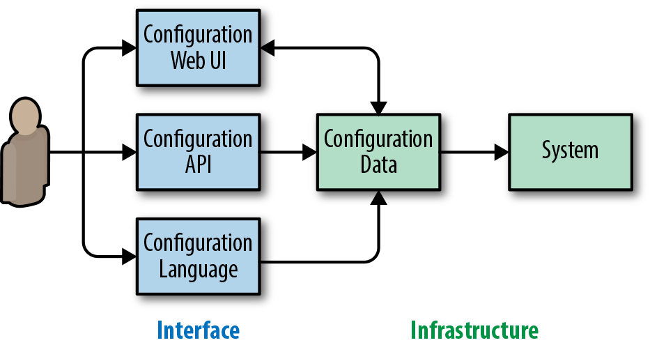

# Configuration Design and Best Practices

By Štěpán Davidovič  
with Niall Richard Murphy, Christophe Kalt, and Betsy Beyer

Configuring systems is a common SRE task everywhere. It can be a tiring and frustratingly detailed activity, particularly if the engineer isn’t deeply familiar with the system they’re configuring or the configuration hasn’t been designed with clarity and usability in mind. Most commonly, you perform configuration in one of two scenarios: during initial setup when you have plenty of time, or during an emergency reconfiguration when you need to handle an incident.

This chapter examines configuration from the perspective of someone who designs and maintains an infrastructure system. It describes our experiences and strategies for designing configuration in a safe and sustainable way.

## What Is Configuration?

When we deploy [software systems](https://sre.google/sre-book/simplicity/), we do not think of them as fixed and never-changing. Ever-evolving business needs, infrastructure requirements, and other factors mean that systems are constantly in flux. When we need to change system behavior quickly, and the change process requires an expensive, lengthy rebuild and redeployment process, a code change won’t suffice. Instead, configuration—which we can loosely define as a human-computer interface for modifying system behavior—provides a low-overhead way to change system functionality. SREs take advantage of this on a regular basis, when deploying systems and tuning their performance, as well as during incident response.

We can reason about systems as having three key components:

- The software
- The data set that the system works with
- The system configuration

While we can intuitively identify each of these components, they are often far from clearly separated. For example, many systems use programming languages for configuration, or at least have the capability to reference programming languages. Examples include Apache and modules, such as [mod_lua](https://httpd.apache.org/docs/trunk/mod/mod_lua.html) and its request hooks, or the window manager XMonad and its [Haskell-based configuration](https://sreworkbook.page.link/YNzL). Similarly, data sets might contain code, such as stored SQL procedures, which can amount to complex applications.

A good configuration interface allows quick, confident, and testable configuration changes. When users don’t have a straightforward way to update configuration, mistakes are more likely. Users experience increased cognitive load and a significant learning curve.

### Configuration and Reliability

Because our systems are ultimately managed by humans, humans are responsible for configuration. The quality of the human-computer interface of a system’s configuration impacts an organization’s ability to run that system reliably. The impact of a well-crafted (or poorly crafted) configuration interface is similar to the impact of code quality on system maintainability over time.

However, configuration tends to differ meaningfully from code in several aspects. Changing a system’s capabilities via code is typically a lengthy and involved process, involving small incremental changes, code reviews, and testing. In contrast, changing a single configuration option can have dramatic changes on functionality—for example, one bad firewall configuration rule may lock you out of your own system. Unlike code, configuration often lives in an untested (or even untestable) environment.

System configuration changes may need to be made under significant pressure. During an incident, a configuration system that can be simply and safely adjusted is essential. Consider the interface design of early airplanes: confusing controls and indicators led to accidents. Research at the time showed that operator failures were frequent, regardless of pilot skill or experience.[^1] The link between usability and reliability translates to computing systems. Consider what happens if we swap a control stick and dial indicators for .conf files and monitoring graphs.

### Separating Philosophy and Mechanics

We usually discuss configuration when designing new software or assembling a new system out of existing software components. How will we configure it? How will the configuration load? We’ll separate the overarching topic of configuration into two parts: configuration philosophy and configuration mechanics.

Configuration philosophy pertains to aspects of configuration that are completely independent of the chosen language and other mechanics. Our discussion of philosophy encompasses how to structure the configuration, how to achieve the correct level of abstraction, and how to support diverging use cases seamlessly.

Our discussion of mechanics covers topics like language design, deployment strategies, and interactions with other systems. This chapter focuses less on mechanics, partly because topics like language choice are already being discussed across the industry. Additionally, because a given organization may already have strong outside requirements like preexisting configuration infrastructure, configuration mechanics aren’t easily generalizable. The following chapter on Jsonnet gives a practical example of configuration mechanics—in particular, language design—in existing software.

Discussing philosophy and mechanics separately allows us to reason more clearly about configuration. In practice, implementation details like configuration language (be it XML or Lua) don’t matter if configuration requires a huge amount of user input that’s difficult to understand. Conversely, even the simplest configuration inputs can cause problems if they must be entered into a very cumbersome interface. Consider the (very) old Linux kernel configuration process: configuration updates had to be made through a command-line terminal that required a sequence of commands to set each parameter. To make even the simplest correction, users had to start the configuration process from scratch.[^2]

# Configuration Philosophy

This section discusses aspects of configuration that are completely independent of implementation, so these topics generalize across all implementations.

In the following philosophy, our ideal configuration is no configuration at all. In this ideal world, the system automatically recognizes the correct configuration based on deployment, workload, or pieces of configuration that already existed when the new system was deployed. Of course, for many systems, this ideal is unlikely to be attainable in practice. However, it highlights the desirable direction of configuration: away from a large number of tunables and toward simplicity.

Historically, mission-critical systems offered a large amount of controls (which amount to system configuration), but also required significant human operator training. Consider the complex array of operator controls in the NASA spacecraft control center in [Figure 14-1](#control-panel-in-the-nasa). In modern computer systems, such training is no longer feasible for the majority of the industry.

*Figure 14-1. Control panel in the NASA spacecraft control center, illustrating possibly very complex configuration*

While this ideal reduces the amount of control we can exercise over a system, it decreases both the surface area for error and cognitive load on the operator. As the complexity of systems grows, operator cognitive load becomes increasingly important.

When we’ve applied these principles in practical systems at Google, they typically resulted in easy, broad adoption and low cost for internal user support.

### Configuration Asks Users Questions

Regardless of what you’re configuring and how you’re configuring it, the human-computer interaction ultimately boils down to an interface that asks users questions, requesting inputs on how the system should operate. This model of conceptualization holds true regardless of whether users are editing XML files or using a configuration GUI wizard.

In modern software systems, we can approach this model from two different perspectives:

Infrastructure-centric view

- It’s useful to offer as many configuration knobs as possible. Doing so enables users to tune the system to their exact needs. The more knobs, the better, because the system can be tuned to perfection.

User-centric view

- Configuration asks questions about infrastructure that the user must answer before they can get back to working on their actual business goal. The fewer knobs, the better, because answering configuration questions is a chore.

Driven by our initial philosophy of minimizing user inputs, we favor the user-centric view.

The implications of this software design decision extend beyond configuration. Focusing configuration on the user means that your software needs to be designed with a particular set of use cases for your key audience. This requires user research. In contrast, an infrastructure-centric approach means that your software effectively provides base infrastructure, but turning it into a practical system requires considerable configuration from the user. These models are not in strict conflict, but attempting to reconcile them can be quite difficult. Perhaps counterintuitively, limited configuration options can lead to better adoption than extremely versatile software—onboarding effort is substantially lower because the software mostly works “out of the box.”

Systems that begin from an infrastructure-centric view may move toward a more user-centric focus as the system matures, by removing some configuration knobs via various means (some of which are discussed in subsequent sections).

### Questions Should Be Close to User Goals

As we follow the philosophy of user-centric configuration, we want to make sure users can easily relate to the questions we ask. We can think of the nature of user inputs on a spectrum: on one end, the user describes their needs in their own terms (fewer configuration options); on the other end, the user describes exactly how the system should implement their needs (more configuration options).

Let’s use making tea as an analogy to configuring a system. With fewer configuration options, a user can ask for “hot green tea” and get roughly what they want. On the opposite end of the spectrum, a user can specify the whole process: water volume, boiling temperature, tea brand and flavor, steeping time, tea cup type, and tea volume in the cup. Using more configuration options might be closer to perfection, but the effort required to adhere to such detail might cost more than the marginal benefit of a near-perfect drink.

This analogy is helpful both to the users and the developers who work on the configuration system. When a user specifies exact steps, the system needs to follow them. But when the user instead describes their high-level goals, the system can evolve over time and improve how it implements these goals. A good upfront understanding of user goals for the system is a necessary first step here.

For a practical illustration of how this spectrum plays out, consider job scheduling. Imagine you have a one-off analytical process to run. Systems like [Kubernetes](https://kubernetes.io/) or [Mesos](https://mesos.apache.org/) enable you to meet your actual goal of running analysis, without burdening you with minute details like deciding which physical machine(s) your analytical process should run on.

### Mandatory and Optional Questions

A given configuration setup might contain two types of questions: mandatory and optional. Mandatory questions must be answered for the configuration to provide any functionality at all. One example might be who to charge for an operation. Optional questions don’t dictate core functionality, but answering them can improve the quality of the function—for example, setting a number of worker processes.

In order to remain user-centric and easy to adopt, your system should minimize the number of mandatory configuration questions. This is not an easy task, but it’s important. While one might argue that adding one or two small steps incurs little cost, the life of an engineer is often an endless chain of individually small steps. The principled reduction of these small steps can dramatically improve productivity.

An initial set of mandatory questions often includes the questions you thought about when designing the system. The easiest path to reduce mandatory questions is to convert them to optional questions, which means providing default answers that apply safely and effectively to most, if not all, users. For example, instead of requiring the user to define whether an execution should be dry-run or not, we can simply do dry-run by default.

While this default value is often a static, hardcoded value, it doesn’t have to be. It can be dynamically determined based on other properties of the system. Taking advantage of dynamic determination can further simplify your configuration.

For context, consider the following examples of dynamic defaults. A computationally intensive system might typically decide how many computation threads to deploy via a configuration control. Its dynamic default deploys as many threads as the system (or container) has execution cores. In this case, a single static default isn’t useful. Dynamic default means we don’t need to ask the user to determine the right number of threads for the system to deploy on a given platform. Similarly, a Java binary deployed alone in a container could automatically adjust its heap limits depending on memory available in the container. These two examples of dynamic defaults reflect common deployments. If you need to restrict resource usage, it’s useful to be able to override dynamic defaults in the configuration.

The implemented dynamic defaults might not work out for everyone. Over time, users might prefer different approaches and ask for greater control over the dynamic defaults. If a significant portion of configuration users report problems with dynamic defaults, it’s likely that your decision logic no longer matches the requirements of your current user base. Consider implementing broad improvements that enable your dynamic defaults to run without requiring additional configuration knobs. If only a small fraction of users are unhappy, they may be better off manually setting configuration options. Implementing more complexity in the system creates more work for users (e.g., increased cognitive load to read documentation).

When choosing default answers for optional questions, regardless of whether you opt for static or dynamic defaults, think carefully about the impact of your choice. Experience shows that most users will use the default, so this is both a chance and a responsibility. You can subtly nudge people in the right direction, but designating the wrong default will do a lot of harm. For example, consider configuration defaults and their impact outside of computer science. Countries where the default for organ donors is opt-in (and individuals can opt out if they’re so inclined) have [dramatically greater ratios of organ donors](https://science.sciencemag.org/content/302/5649/1338) than countries with an opt-out default.[^3] Simply selecting a specific default has a profound impact on medical options throughout the entire system.

Some optional questions start without a clear use case. You may want to remove these questions altogether. A large number of optional questions might confuse the user, so you should add configuration knobs only when motivated by a real need. Finally, if your configuration language happens to use the concept of inheritance, it is useful to be able to revert to the default value for any optional question in the leaf configurations.

### Escaping Simplicity

Thus far, we’ve discussed reducing the configuration of a system to its simplest form. However, the configuration system may need to account for power users as well. To return to our tea analogy, what if we really need to steep the tea for a particular duration?

One strategy to accommodate power users is to find the lowest common denominator of what regular users and power users require, and settle on that level of complexity as the default. The downside is that this decision impacts everyone; even the simplest use cases now need to be considered in low-level terms.

By thinking about configuration in terms of optional overrides of default behavior, the user configures “green tea,” and then adds “steep the tea for five minutes.” In this model, the default configuration is still high-level and close to the user’s goals, but the user can fine-tune low-level aspects. This approach is not novel. We can draw parallels to high-level programming languages like C++ or Java, which enable programmers to include machine (or VM) instructions in code otherwise written in the high-level language. In some consumer software, we see screens with advanced options that can offer more fine-grained control than the typical view.

It’s useful to think about optimizing for the sum of hours spent configuring across the organization. Consider not only the act of configuration itself, but also the decision paralysis users might experience when presented with many options, the time it takes to correct the configuration after taking a wrong turn, the slower rate of change due to lower confidence, and more. When you are considering configuration design alternatives, the option that accomplishes a complex configuration in fewer but significantly harder steps may be preferable if it makes supporting the most common use cases significantly easier.

If you find that more than a small subset of your users need a complex configuration, you may have incorrectly identified the common use cases. If so, revisit the initial product assumptions for your system and conduct additional user research.

# Mechanics of Configuration

Our discussion up to this point has covered configuration philosophy. This section shifts focus to the mechanics of how a user interacts with the configuration.

### Separate Configuration and Resulting Data

Which language to store the configuration in is an inevitable question. You could choose to have pure data like in an INI, YAML, or XML file. Alternatively, the configuration could be stored in a higher-level language that allows for much more flexible configuration.

Fundamentally, all questions the user is asked boil down to static information. This may include obviously static answers to questions like “How many threads should be used?” But even “What function should be used for every request?” is just a static reference to a function.

To answer the age-old question of whether configuration is code or data, our experience has shown that having both code and data, but separating the two, is optimal. The system infrastructure should operate on plain static data, which can be in formats like [Protocol Buffers](https://developers.google.com/protocol-buffers/), [YAML](https://yaml.org/), or [JSON](https://www.json.org/). This choice does not imply that the user needs to actually interact with pure data. Users can interact with a higher-level interface that generates this data. This data format can, however, be used by APIs that allow further stacking of systems and automation.

This high-level interface can be almost anything. It can be a high-level language like Python-based Domain-Specific Language (DSL), Lua, or purpose-built languages, such as Jsonnet (which we will discuss in more detail in [Configuration Specifics](https://sre.google/workbook/configuration-specifics/)). We can think of such an interface as a compilation, similar to how we treat C++ code.[^4] The high-level interface might also be no language at all, with the configuration ingested by a web UI.

Starting with a configuration UI that’s deliberately separated from its static data representation means the system has flexibility for deployment. Various organizations may have different cultural norms or product requirements (such as using specific languages within the company or needing to externalize configuration to end users), and a system this versatile can be adapted to support diverse configuration requirements. Such a system can also effortlessly support multiple languages.[^5] See [Figure 14-2](#configuration-flow-with-a-separate-configuration-interface-and-configuration-data-infrastructure).

This separation can be completely invisible to the user. The user’s common path may be to edit files in the configuration language while everything else happens behind the scenes. For example, once the user submits changes to the system, the newly stored configuration is automatically compiled into raw data.[^6]

*Figure 14-2. Configuration flow with a separate configuration interface and configuration data infrastructure. Note the web UI typically also displays the current configuration, making the relationship bidirectional.*

Once the static configuration data is obtained, it can also be used in data analysis. For instance, if the generated configuration data is in JSON format, it can be [loaded into PostgreSQL and analyzed with database queries](https://www.postgresql.org/docs/10/static/functions-json.html). As the infrastructure owner, you can then quickly and easily query for which configuration parameters are being used and by whom. This query is useful for identifying features you can remove or measuring the impact of a buggy option.

When consuming the final configuration data, you will find it useful to also store metadata about how the configuration was ingested. For example, if you know the data came from a configuration file in Jsonnet or you have the full path to the original before it was compiled into data, you can track down the configuration authors.

It is also acceptable for the configuration language to be static data. For example, both your infrastructure and interface might use plain JSON. However, avoid tight coupling between the data format you use as the interface and the data format you use internally. For example, you may use a data structure internally that contains the data structure consumed from configuration. The internal data structure might also contain completely implementation-specific data that never needs to be surfaced outside of the system.

### Importance of Tooling

Tooling can make the difference between a chaotic nightmare and a sustainable and scalable system, but it is often overlooked when configuration systems are designed. This section discusses the key tools that should be available for an optimal configuration system.

###### Semantic validation

While most languages offer syntax validation out of the box, don’t overlook semantic validation. Even if your configuration is syntactically valid, is it likely to do useful things? Or did the user reference a nonexistent directory (due to a typo), or need a thousand times more RAM than they actually have (because units aren’t what the user expected)?

Validating that the configuration is semantically meaningful, to the maximum extent possible, can help prevent outages and decrease operational costs. For every possible misconfiguration, we should ask ourselves if we could prevent it at the moment the user commits the configuration, rather than after changes are submitted.

###### Configuration syntax

While it’s key to ensure that configuration accomplishes what the user wants, it is also important to remove mechanical obstacles. From a syntax perspective, the configuration language should offer the following:

Syntax highlighting in editors (used within the company)

- Often, you’ve already solved this by reusing an existing language. However, domain-specific languages may have additional “syntactic sugar” that can benefit from specialized highlighting.

Linter

- Use a linter to identify common inconsistencies in language use. [Pylint](https://www.pylint.org/) is one popular language example.

Automatic syntax formatter

- Built-in standardization minimizes relatively unimportant discussions about formatting and decreases cognitive load as contributors switch projects. Standard formatting may also allow for easier automatic editing, which is helpful in systems used broadly within a large organization. Examples of autoformatters in existing languages include clang-format[^7] and [autopep8](https://pypi.org/project/autopep8/).

These tools enable users to write and edit configuration with confidence that their syntax is correct.[^8] Incorrect indentation in whitespace-oriented configs can have potentially great consequences—some of which standard formatting can prevent.

### Ownership and Change Tracking

Because configuration can potentially impact critical systems of companies and institutions, it’s important to ensure good user isolation, and to understand what changes happened in the system. As mentioned in [Postmortem Culture: Learning from Failure](https://sre.google/workbook/postmortem-culture/), an effective postmortem culture avoids blaming individuals. However, it’s helpful both during an incident and while you’re conducting a postmortem to know who changed a configuration, and to understand how the configuration change impacted the system. This holds true whether the incident is due to an accident or a malicious actor.

Each configuration snippet for the system should have a clear owner. For example, if you use configuration files, their directories might be owned by a single production group. If files in a directory can only have one owner, it’s much easier to track who makes changes.

Versioning configuration, regardless of how it is performed, allows you to go back in time to see what the configuration looked like at any given point in time. Checking configuration files into a versioning system, such as Subversion or Git, is a common practice nowadays, but this practice is equally important for configuration ingested by web UI or remote APIs. You may also wish to have tighter coupling between the configuration and the software being configured. By doing so, you can avoid inadvertently configuring features that are either not yet available or no longer supported in the software.

On a related note, it is useful (and sometimes required) to log both changes to the configuration and the resulting application to the system. The simple act of committing a new version of a configuration does not always mean that the configuration is directly applied (more on that later). When a [system configuration](https://sre.google/workbook/configuration-specifics/) change is suspected as the culprit during an incident response, it is useful to be able to quickly determine the full set of configuration edits that went into the change. This enables confident rollbacks, and the ability to notify parties whose configurations were impacted.

### Safe Configuration Change Application

As discussed earlier, configuration is an easy way to make large changes to system functionality, but it is often not unit-tested or even easily testable. Since we want to avoid reliability incidents, we should inspect what the safe application of a configuration change means.

For a configuration change to be safe, it must have three main properties:

- The ability to be deployed gradually, avoiding an all-or-nothing change
- The ability to roll back the change if it proves dangerous
- Automatic rollback (or at a minimum, the ability to stop progress) if the change leads to loss of operator control

When deploying a new configuration, it is important to avoid a global all-at-once push. Instead, push the new configuration out gradually—doing so allows you to detect issues and abort a problematic push before causing a 100% outage. This is one reason why tools such as Kubernetes use a rolling update strategy for updating software or configuration instead of updating every pod all at once. (See [Canarying Releases](https://sre.google/workbook/canarying-releases/) for related discussions.)

The ability to roll back is important for decreasing incident duration. Rolling back the offending configuration can mitigate an outage much more quickly than attempting to patch it with a temporary fix—there is inherently lower confidence that a patch will improve things.

> **Note**
>
> In order to be able to roll forward and roll back configuration, it must be hermetic. Configuration that requires external resources that can change outside of its hermetic environment can be very hard to roll back. For example, configuration stored in a version control system that references data on a network filesystem is not hermetic.

Last but not least, the system should be especially careful when handling changes that might lead to sudden loss of operator control. On desktop systems, screen resolution changes often prompt a countdown and reset if a user does not confirm changes. This is because an incorrect monitor setting might prevent the user from reverting the change. Similarly, it is common for system admins to accidentally firewall themselves out of the system that they are currently setting up.

These principles are not unique to configuration and apply to other methods of changing deployed systems, such as upgrading binaries or pushing new data sets.

# Conclusion

Trivial configuration changes can impact a production system in dramatic ways, so we need to deliberately design configuration to mitigate these risks. Configuration design carries aspects of both API and UI design and should be purposeful—not just a side effect of system implementation. Separating configuration into philosophy and mechanics helps us gain clarity as we design internal systems, and enables us to scope discussion correctly.

Applying these recommendations takes time and diligence. For an example of how we’ve applied these principles in practice, see the [ACM Queue article on Canary Analysis Service](https://queue.acm.org/detail.cfm?id=3194655). When designing this practical internal system, we spent about a month trying to reduce mandatory questions and finding good answers for optional questions. Our efforts created a simple configuration system. Because it was easy to use, it was widely adopted internally. We’ve seen little need for user support—since users can easily understand the system, they can make changes with confidence. Of course, we have not eliminated misconfigurations and user support entirely, nor do we ever expect to.

[^1]: Kim Vicente, The Human Factor (New York: Routledge, 2006), 71–6.

[^2]: While clearly a hyperbole, a Reddit thread about the worst volume control interface can provide insight into the difference between good and bad mechanics of answering the same question, “What should the volume be?”

[^3]: Full text: https://www.dangoldstein.com/papers/DefaultsScience.pdf.

[^4]: Jsonnet is used to compile into Kubernetes YAML, providing a real-world illustration for this parallel. See https://ksonnet.heptio.com/.

[^5]: This can be useful when an organization performs migrations to new technologies, integrates acquisitions, or focuses on shared infrastructure but otherwise has divergent development and system management practices.

[^6]: There are various practical ways to automate compiling a new configuration into raw data. For example, if you store your configuration in a version control system, a post-commit hook can facilitate this. Alternatively, a periodic update process can perform this, at the cost of some delay.

[^7]: Although C++ is unlikely to be used for configuration, clang-format nicely demonstrates that even a language more complex than most languages used for configuration can in fact be fully autoformatted.

[^8]: In very large organizations, it is also useful to be able to annotate pieces of a broadly reused configuration that has been deprecated. When a replacement is available, automatic rewriting tools facilitate centralized changes, helping to avoid legacy issues.
