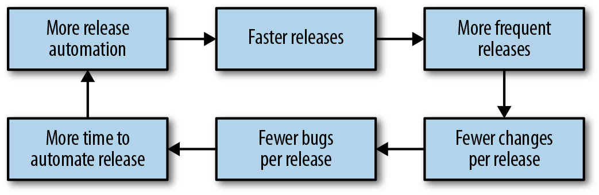
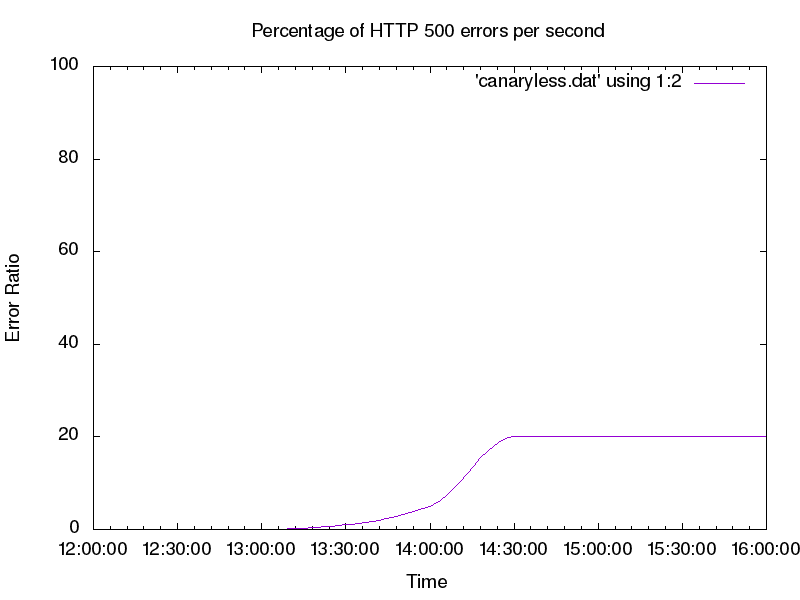
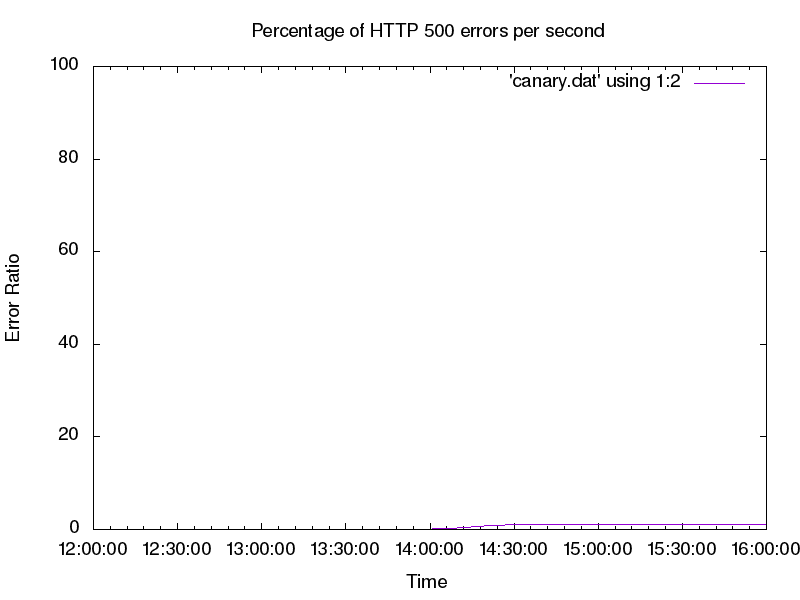
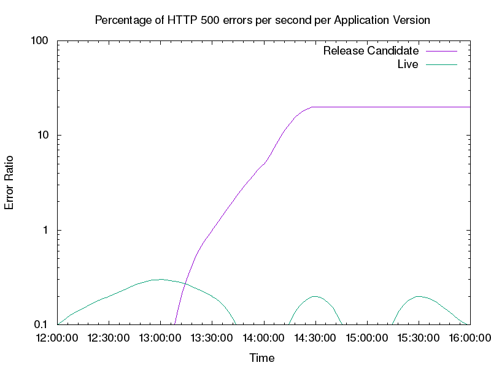

# Canarying Releases

By Alec Warner and Štěpán Davidovič  
with Alex Hidalgo, Betsy Beyer, Kyle Smith, and Matt Duftler

Release engineering is a term we use to describe all the processes and artifacts related to getting code from a repository into a running production system. Automating releases can help avoid many of the traditional pitfalls associated with release engineering: the toil of repetitive and manual tasks, the inconsistency of a nonautomated process, the inability of knowing the exact state of a rollout, and the difficulty of rolling back. The [automation of release engineering](https://sre.google/sre-book/release-engineering/) has been well covered in other literature—for example, books on continuous integration and continuous delivery (CI/CD).[^1]

We define canarying as a partial and time-limited deployment of a change in a service and its evaluation. This evaluation helps us decide whether or not to proceed with the rollout. The part of the service that receives the change is “the canary,” and the remainder of the service is “the control.” The logic underpinning this approach is that usually the canary deployment is performed on a much smaller subset of production, or affects a much smaller subset of the user base than the control portion. Canarying is effectively an A/B testing process.

We’ll first cover the basics of [release engineering](../../sre-book/release-engineering/) and the benefits of automating releases to establish a shared vocabulary.

## Release Engineering Principles

The basic principles of release engineering are as follows:

Reproducible builds

- The build system should be able to take the build inputs (source code, assets, and so on) and produce repeatable artifacts. The code built from the same inputs last week should produce the same output this week.

Automated builds

- Once code is checked in, automation should produce build artifacts and upload them to a storage system.

Automated tests

- Once the automated build system builds artifacts, a test suite of some kind should ensure they function.

Automated deployments

- Deployments should be performed by computers, not humans.

Small deployments

- Build artifacts should contain small, self-contained changes.

These principles provide specific benefits to operators:

- Reducing operational load on engineers by removing manual and repetitive tasks.
- Enforcing peer review and version control, since automation is generally code-based.
- Establishing consistent, repeatable, automated processes, resulting in fewer mistakes.
- Enabling monitoring of the release pipeline, allowing for measurement and continuous improvement by addressing questions like:
  - How long does it take a release to reach production?
  - How often are releases successful? A successful release is a release made available to customers with no severe defects or SLO violations.
  - What changes can be made to catch defects as early in the pipeline as possible?
  - Which steps can be parallelized or further optimized?

CI/CD coupled with release automation can deliver continuous improvements to the development cycle, as shown in [Figure 16-1](#the-virtuous-cycle-of-ci-cd). When releases are automated, you can release more often. For software with a nontrivial rate of change, releasing more often means fewer changes are bundled in any given release artifact. Smaller, self-contained release artifacts make it cheaper and easier to roll back any given release artifact in the event of a bug. Quicker release cadences mean that bug fixes reach users faster.

*Figure 16-1. The virtuous cycle of CI/CD*

# Balancing Release Velocity and Reliability

Release velocity (hereafter called “shipping”) and reliability are often treated as opposing goals. The business wants to ship new features and product improvements as quickly as possible with 100% reliability! While that goal is not achievable (as 100% is never the right target for reliability; see [Implementing SLOs](https://sre.google/workbook/implementing-slos/)), it is possible to ship as quickly as possible while meeting specific reliability goals for a given product.

The first step toward this goal is understanding the impact of shipping on software reliability. In Google’s experience, a majority of incidents are triggered by binary or configuration pushes (see [Results of Postmortem Analysis](https://sre.google/workbook/postmortem-analysis/)). Many kinds of software changes can result in a system failure—for example, changes in the behavior of an underlying component, changes in the behavior of a dependency (such as an API), or a change in configuration like DNS.

Despite the risk inherent in making changes to software, these changes—bug fixes, security patches, and new features—are necessary for the business to succeed. Instead of advocating against change, you can use the concept of SLOs and error budgets to measure the impact of releases on your reliability. Your goal should be to ship software as quickly as possible while meeting the reliability targets your users expect. The following section discusses how you can use a canary process to achieve these goals.

> **Separating Components That Change at Different Rates**
>
> Your services are composed of multiple components with different rates of change: binaries or code, environments such as JVM, kernel/OS, libraries, service config or flags, feature/experiment config, and user config. If you have only one way to deploy changes, actually allowing these components to change independently may be difficult.
>
> Feature flag or experiment frameworks like [Gertrude](https://github.com/cfregly/gertrude), [Feature](https://github.com/etsy/feature), and [PlanOut](https://sreworkbook.page.link/XfKZ) allow you to separate feature launches from binary releases. If a binary release includes multiple features, you can enable them one at a time by changing the experiment configuration. That way, you don’t have to batch all of these changes into one big change or perform an individual release for each feature. More importantly, if only some of the new features don’t behave as expected, you can selectively disable those features until the next build/release cycle can deploy a new binary.
>
> You can apply the principles of feature flags/experiments to any type of change to your service, not just software releases.

# What Is Canarying?

The term canarying refers to the [practice of bringing canaries into coal mines to determine if the mine is safe for humans](https://en.wikipedia.org/wiki/John_Scott_Haldane). Because the birds are smaller and breathe faster than humans, they are intoxicated by dangerous gases faster than their human handlers.

Even if your release pipeline is fully automated, you won’t be able to detect all release-related defects until real traffic is hitting the service. By the time a release is ready to be deployed to production, your testing strategy should instill reasonable confidence that the release is safe and works as intended. However, your test environments aren’t 100% identical to production, and your tests probably don’t cover 100% of possible scenarios. Some defects will reach production. If a release deploys instantly everywhere, any defects will deploy in the same way.

This scenario might be acceptable if you can detect and resolve the defects quickly. However, you have a safer alternative: initially expose just some of your production traffic to the new release using a canary. Canarying allows the deployment pipeline to detect defects as quickly as possible with as little impact to your service as possible.

# Release Engineering and Canarying

When deploying a new version of a system or its key components (such as configuration or data), we bundle changes—changes that typically have not been exposed to real-world inputs, such as user-facing traffic or batch processing of user-supplied data. Changes bring new features and capabilities, but they also bring risk that is exposed at the time of deployment. Our goal is to mitigate this risk by testing each change on a small portion of traffic to gain confidence that it has no ill effects. We will discuss evaluation processes later in this chapter.

The canary process also lets us gain confidence in our change as we expose it to larger and larger amounts of traffic. Introducing the change to actual production traffic also enables us to identify problems that might not be visible in testing frameworks like unit testing or load testing, which are often more artificial.

We will examine the process of canarying and its evaluation using a worked example, while steering clear of a deep dive into statistics. Instead, we focus on the process as a whole and typical practical considerations. We use a simple application on App Engine to illustrate various aspects of the rollout.

### Requirements of a Canary Process

Canarying for a given service requires specific capabilities:

- A method to deploy the canary change to a subset of the population of the service.[^2]
- An evaluation process to evaluate if the canaried change is “good” or “bad.”
- Integration of the canary evaluations into the release process.

Ultimately, the canary process demonstrates value when canaries detect bad release candidates with high confidence, and identify good releases without false positives.

### Our Example Setup

We’ll use a simple frontend web service application to illustrate some canarying concepts. The application offers an HTTP-based API that consumers can use to manipulate various data (simple information like the price of a product). The example application has some tunable parameters that we can use to simulate various production symptoms, to be evaluated by the canary process. For example, we can make the application return errors for 20% of requests, or we can stipulate that 5% of requests take at least two seconds.

We illustrate the canary process using an application deployed on Google App Engine, but the principles apply to any environment. While the example application is fairly contrived, in real-world scenarios, similar applications share common signals with our example that can be used in a canary process.

Our example service has two potential versions: live and release candidate. The live version is the version currently deployed in production, and the release candidate is a newly built version. We use these versions to illustrate various rollout concepts and how to implement canaries to make the rollout process safer.

# A Roll Forward Deployment Versus a Simple Canary Deployment

Let’s first look at a deployment with no canary process, so we can later compare it to a canaried deployment in terms of error budget savings and general impact when a breakage occurs. Our deployment process features a development environment. Once we feel the code is working in the development environment, we deploy that version in the production environment.

Shortly after our deployment, our monitoring starts reporting a high rate of errors (see [Figure 16-2](#high-rate-of-errors-after-deployment), where we intentionally configured our sample application to fail 20% of requests to simulate a defect in the example service). For the sake of this example, let’s say that our deployment process doesn’t provide us the option to roll back to a previously known good configuration. Our best option to fix the errors is to find defects in the production version, patch them, and deploy a new version during the outage. This course of action will almost certainly prolong the user impact of the bug.

*Figure 16-2. High rate of errors after deployment*

To improve upon this initial deployment process, we can utilize canaries in our rollout strategy to reduce the impact of a bad code push. Instead of deploying to production all at once, we need a way to create a small segment of production that runs our release candidate. Then we can send a small portion of the traffic to that segment of production (the canary) and compare it against the other segment (the control). Using this method, we can spot defects in the release candidate before all of production is affected.

The simple canary deployment in our App Engine example [splits traffic](https://cloud.google.com/appengine/docs/admin-api/migrating-splitting-traffic) between specific labeled versions of our application. You can split traffic using App Engine, or any number of other methods, such as backend weights on a load balancer, proxy configurations, or round-robin DNS records.

[Figure 16-3](#error-rate-of-canary-deployment) shows that the impact of the change is greatly reduced when we use a canary; in fact, the errors are barely visible! This raises an interesting issue: the canary evaluation is difficult to see and track compared to the overall traffic trend.

*Figure 16-3. Error rate of canary deployment; because the canary population is a small subset of production, the overall error rate is reduced*

To get a clearer picture of the errors we need to track at a reasonable scale, we can look at our key metric (HTTP response codes) by App Engine application version, as shown in [Figure 16-4](#http-response-codes-by-app-engine-version). When we look at per-version breakdown, we can plainly see the errors the new version introduces. We can also observe from [Figure 16-4](#http-response-codes-by-app-engine-version) that the live version is serving very few errors.

We can now tune our deployment to automatically react based on the HTTP error rate by App Engine version. If the error rate of the canary metric is too far from the control error rate, this signals the canary deployment is “bad.” In response, we should pause and roll back the deployment, or perhaps contact a human to help troubleshoot the issue. If the error ratios are similar, we can proceed with the deployment as normal. In the case of [Figure 16-4](#http-response-codes-by-app-engine-version), our canary deployment is clearly bad and we should roll it back.

*Figure 16-4. HTTP response codes by App Engine version; the release candidate serves the vast majority of the errors, while the live version produces a low number of errors at a steady state (note: the graph uses a base-10 log scale)*

# Canary Implementation

Now that we’ve seen a fairly trivial canary deployment implementation, let’s dig deeper into the parameters that we need to understand for a successful canary process.

### Minimizing Risk to SLOs and the Error Budget

[Implementing SLOs](https://sre.google/workbook/implementing-slos/) discusses how SLOs reflect business requirements around service availability. These requirements also apply to canary implementations. The canary process risks only a small fragment of our error budget, which is limited by time and the size of the canary population.

Global deployment can place the SLO at risk fairly quickly. If we deploy the candidate from our trivial example, we would risk failing 20% of requests. If we instead use a canary population of 5%, we serve 20% errors for 5% of traffic, resulting in a 1% overall error rate (as seen earlier in [Figure 16-3](#error-rate-of-canary-deployment)). This strategy allows us to conserve our error budget—impact on the budget is directly proportional to the amount of traffic exposed to defects. We can assume that detection and rollback take about the same time for both the naive deployment and the canary deployment, but when we integrate a canary process into our deployment, we learn valuable information about our new version at a much lower cost to our system.

This is a very simple model that assumes uniform load. It also assumes that we can spend our entire error budget (beyond what we’ve already included in the organic measurement of current availability) on canaries. Rather than actual availability, here we consider only unavailability introduced by new releases. Our model also assumes a 100% failure rate because this is a worst-case scenario.[^3] It is likely that defects in the canary deployment will not affect 100% of system usage. We also allow overall system availability to go below SLO for the duration of the canary deployment.[^4]

This model has clear flaws, but is a solid starting point that you can adjust to match business needs.[^5] We recommend using the simplest model that meets your technical and business objectives. In our experience, focusing on making the model as technically correct as possible often leads to overinvestment in modeling. For services with high rates of complexity, overly complex models can lead to incessant model tuning for no real benefit.

### Choosing a Canary Population and Duration

When choosing an appropriate canary duration, you need to factor in development velocity. If you release daily, you can’t let your canary last for a week while running only one canary deployment at a time. If you deploy weekly, you have time to perform fairly long canaries. If you deploy continuously (for example, 20 times in a day), your canary duration must be significantly shorter. On a related note, while we can run multiple canary deployments simultaneously, doing so adds significant mental effort to track system state. This can become problematic during any nonstandard circumstances, when reasoning about the system’s state quickly is important. Running simultaneous canaries also increases the risk of signal contamination if the canaries overlap. We strongly advise running only one canary deployment at a time.

For basic evaluation, we do not need a terribly large canary population in order to detect key critical conditions.[^6] However, a representative canary process requires decisions across many dimensions:

Size and duration

- It should be sizeable and last long enough to be representative of the overall deployment. Terminating a canary deployment after receiving just a handful of queries doesn’t provide a useful signal for systems characterized by diverse queries with varied functionality. The higher the processing rate, the less time is required to get a representative sample in order to ensure the observed behavior is actually attributable to the canaried change, and not just a random artifact.

Traffic volume

- We need to receive enough traffic on the system to ensure it has handled a representative sample, and that the system has a chance to react negatively to the inputs. Typically, the more homogeneous the requests, the less traffic volume you need.

Time of day

- Performance defects typically manifest only under heavy load,[^7] so deploying at an off-peak time likely wouldn’t trigger performance-related defects.

Metrics to evaluate

- The representativeness of a canary is tightly connected to the metrics we choose to evaluate (which we’ll discuss later in this chapter). We can evaluate trivial metrics like query success quickly, but other metrics (such as queue depth) may need more time or a large canary population to provide a clear signal.

Frustratingly, these requirements can be mutually at odds. Canarying is a balancing act, informed both by cold analysis of worst-case scenarios and the past realistic track record of a system. Once you’ve gathered metrics from past canaries, you can choose canary parameters based upon typical canary evaluation failure rates rather than hypothetical worst-case scenarios.

# Selecting and Evaluating Metrics

So far, we have been looking at the success ratio, a very clear and obvious metric for canary evaluation. But intuitively, we know this single metric is not sufficient for a meaningful canary process. If we serve all requests at 10 times the latency, or use 10 times as much memory while doing so, we might also have a problem. Not all metrics are good candidates for evaluating a canary. What properties of metrics are best suited for evaluating whether a canary is good or bad?

### Metrics Should Indicate Problems

First and foremost, the metric needs to be able to indicate problems in the service. This is tricky because what constitutes a “problem” isn’t always objective. We can probably consider a failed user request problematic.[^8] But what if a request takes 10% longer, or the system requires 10% more memory? We typically recommend using SLIs as a place to start thinking about canary metrics. Good SLIs tend to have strong attribution to service health. If SLIs are already being measured to drive SLO compliance, we can reuse that work.

Almost any metric can be problematic when taken to the extreme, but there’s also a cost to adding too many metrics to your canary process. We need to correctly define a notion of acceptable behavior for each of the metrics. If the idea of acceptable behavior is overly strict, we will get lots of false positives; that is, we will think a canary deployment is bad, even though it isn’t. Conversely, if a definition of acceptable behavior is too loose, we will be more likely to let a bad canary deployment go undetected. Choosing what’s acceptable behavior correctly can be an expensive process—it’s time-consuming and requires analysis. When it’s done poorly, however, your results can completely mislead you. Also, you need to reevaluate expectations on a regular basis as the service, its feature set, and its behavior evolve.

We should stack-rank the metrics we want to evaluate based on our opinion of how well they indicate actual user-perceivable problems in the system. Select the top few metrics to use in canary evaluations (perhaps no more than a dozen). Too many metrics can bring diminishing returns, and at some point, the returns are outweighed by the cost of maintaining them, or the negative impact on trust in the release process if they are not maintained.

To make this guideline more tangible, let’s look at our example service. It has many metrics we might evaluate: CPU usage, memory footprint, HTTP return codes (200s, 300s, etc.), latency of response, correctness, and so on. In this case, our best metrics are likely the HTTP return codes and latency of response because their degradation most closely maps to an actual problem that impacts users. In this scenario, metrics for CPU usage aren’t as useful: an increase in resource usage doesn’t necessarily impact a service and may result in a flaky or noisy canary process. This can result in the canary process being disabled or ignored by operators, which can defeat the point of having a canary process in the first place. In the case of frontend services, we intuitively know that being slower or failing to respond are typically reliable signals that there are problems in the service.

HTTP return codes contain interesting tricky cases, such as code 404, which tells us the resource was not found. This could happen because users get the wrong URL (imagine a broken URL getting shared on a popular discussion board), or because the server incorrectly stops serving a resource. Often we can work around problems like this by excluding 400-level codes from our canary evaluation and adding black-box monitoring to test for the presence of a particular URL. We can then include the black-box data as part of our canary analysis to help isolate our canary process from odd user behaviors.

### Metrics Should Be Representative and Attributable

The source of changes in the observed metrics should be clearly attributable to the change we are canarying, and should not be influenced by external factors.

In a large population (for example, many servers or many containers), we are likely to have outliers—oversubscribed machines, machines running different kernels with different performance characteristics, or machines on an overloaded segment of the network. The difference between the canary population and the control is just as much a function of the change we have deployed as the difference between the two infrastructures on which we deploy.

Managing canaries is a balancing act between a number of forces. Increasing the size of the canary population is one way to decrease impact of this problem (as discussed earlier). When we reach what we consider a reasonable canary population size for our system, we need to consider whether the metrics we have chosen could show high variance.

We should also be aware of shared failure domains between our canary and control environments; a bad canary could negatively impact the control, while bad behavior in the system might lead us to incorrectly evaluate the canary. Similarly, make sure that your metrics are well isolated. Consider a system that runs both our application and other processes. A dramatic increase in CPU usage of the system as a whole would make for a poor metric, as other processes in the system (database load, log rotation, etc.) might be causing that increase. A better metric would be CPU time spent as the process served the request. An even better metric would be CPU time spent serving the request over the window of time the serving process was actually scheduled on a CPU. While a heavily oversubscribed machine colocated with our process is obviously a problem (and monitoring should catch it!), it isn’t caused by the change we’re canarying, so it should not be flagged as a canary deployment failure.

Canaries also need to be attributable; that is, you should also be able to tie the canary metric to SLIs. If a metric can change wildly with no impact to service, it’s unlikely to make a good canary metric.

### Before/After Evaluation Is Risky

A before/after canary process is an extension of the attribution problem. In this process, the old system is fully replaced by the new system, and your canary evaluation compares system behavior before and after the change over a set period of time. One might call this process a “canary deployment in time-space,” where you choose the A/B groups by segmenting time instead of segmenting the population by machines, cookies, or other means. Because time is one of the biggest sources of change in observed metrics, it is difficult to assess degradation of performance with before/after evaluation.

While the canary deployment might have caused the degradation, the degradation may very well have happened in the control system too. This scenario becomes even more problematic if we attempt to run a canary deployment over a longer period of time. For example, if we perform a release on Monday, we may be comparing behavior during a business day to behavior during a weekend, introducing a large amount of noise. In this example, users may use the service very differently over the weekend, thereby introducing noise in the canary process.

The before/after process itself introduces a question of whether a big error spike (as introduced by a before/after evaluation) is better than a small but possibly longer rate of errors (as introduced by a small canary). If the new release is completely broken, how quickly can we detect and revert? A before/after canary may detect the problem faster, but the overall time to recovery may still be quite substantial and similar to a smaller canary. During that time, users suffer.

### Use a Gradual Canary for Better Metric Selection

Metrics that don’t meet our ideal properties may still bring great value. We can introduce these metrics by using a more nuanced canary process.

Instead of simply evaluating a single canary stage, we can use a canary containing multiple stages that reflect our ability to reason about the metrics. In the first stage, we have no confidence or knowledge about the behavior of this release. We therefore want to use a small stage in order to minimize negative impact. In a small canary, we prefer metrics that are the clearest indication of a problem—application crashes, request failures, and the like. Once this stage passes successfully, the next stage will have a larger canary population to increase confidence in our analysis of the impact of the changes.

# Dependencies and Isolation

The system being tested will not operate in a complete vacuum. For practical reasons, the canary population and the control may share backends, frontends, networks, data stores, and other infrastructure. There may even be extremely nonobvious interactions with the client. For example, imagine two consecutive requests sent by a single client. The first request may be handled by the canary deployment. The response by the canary may change the content of the second request, which may land on the control, altering the control’s behavior.

Imperfect isolation has several consequences. Most importantly, we need to be aware that if the canarying process provides results that indicate we should stop a production change and investigate the situation, the canary deployment isn’t necessarily at fault. This fact is true of canarying in general, but in practice, it’s frequently enforced by isolation issues.

Additionally, imperfect isolation means that bad behavior of the canary deployment can also negatively impact the control. Canarying is an A/B comparison, and it’s possible that both A and B can change in tandem; this may cause confusion in the canary evaluation. It is important to also use absolute measures, such as defined SLOs, to ensure the system is operating correctly.

# Canarying in Noninteractive Systems

The chapter has focused on an interactive request/response system, which in many ways is the simplest and most commonly discussed system design. Other systems, such as asynchronous processing pipelines, are equally important, but have different canarying considerations, which we’ll enumerate briefly. For more information on canarying as related to data processing pipelines, see [Data Processing Pipelines](https://sre.google/workbook/data-processing/).

First and foremost, the duration and deployment of the canary inherently depends on the duration of work unit processing. We’ve ignored this factor when it comes to interactive systems, assuming work unit processing will take no more than a few seconds, which is shorter than the canary duration. Work unit processing in noninteractive systems, such as rendering pipelines or video encoding, can take much longer. Accordingly, make sure the canary duration at minimum spans the duration of a single work unit.

Isolation can become more complex for noninteractive systems. Many pipeline systems have a single work assigner and a fleet of workers with the application code. In multistage pipelines, a work unit is processed by a worker, then returned to the pool for the same or another worker to perform the next stage of processing. It is helpful for canary analysis to ensure that the workers processing a particular unit of work are always pulled from the same pool of workers—either the canary pool or the control pool. Otherwise, the signals get increasingly mixed (for more about the need to untangle signals, see [Requirements on Monitoring Data](#requirements-on-monitoring-data)).

Finally, metric selection can be more complicated. We may be interested in end-to-end time to process the work unit (similar to latency in interactive systems), as well as quality of the processing itself (which is, of course, completely application-specific).

Given these caveats, the general concept of canarying remains viable, and the same high-level principles apply.

# Requirements on Monitoring Data

When conducting canary evaluation, you must be able to compare the canary signals to the control signals. Often, this requires some care in structuring the monitoring system—effective comparisons are straightforward and produce meaningful results.

Consider our earlier example of a canary deployment to 5% of the population that runs at a 20% error rate. Because monitoring likely looks at the system as a whole, it will detect an overall error rate of only 1%. Depending on the system, this signal might be indistinguishable from other sources of errors (see [Figure 16-3](#error-rate-of-canary-deployment)).

If we break down metrics by population servicing the request (the canary versus the control), we can observe the separate metrics (see [Figure 16-4](#http-response-codes-by-app-engine-version)). We can plainly see the error rate in the control versus the canary, a stark illustration of what a full deployment would bring. Here we see that monitoring that reasons well about an entire service isn’t sufficient to analyze our canary. When collecting monitoring data, it is important to be able to perform fine-grained breakdowns that enable you to differentiate metrics between the canary and control populations.

Another challenge with collecting metrics is that canary deployments are time-limited by design. This can cause problems when metrics are aggregated over specific periods. Consider the metric errors per hour. We can calculate this metric by summing the requests over the past hour. If we use this metric to evaluate our canary, we might encounter problems, as described in the following timeline:

1.  An unrelated event causes some errors to occur.
2.  A canary is deployed to 5% of the population; the canary duration is 30 minutes.
3.  The canary system starts to watch the errors-per-hour metric to see if the deployment is good or bad.
4.  The deployment is detected as bad because the errors-per-hour metric is significantly different from the errors per hour of the control population.

This scenario is a result of using a metric that is computed hourly to evaluate a deployment that is only 30 minutes long. As a result, the canary process provides a very muddied signal. When using metrics to evaluate canary success, make sure the intervals of your metrics are either the same as or less than your canary duration.

# Related Concepts

Often, our conversations with customers touch upon using blue/green deployment, artificial load generation, and/or traffic teeing in production. These concepts are similar to canarying, so while they’re not strictly canary processes, they might be used as such.

### Blue/Green Deployment

Blue/green deployment maintains two instances of a system: one that is serving traffic (green), and another that is ready to serve traffic (blue). After deploying a new release in the blue environment, you can then move traffic to it. The cutover doesn’t require downtime, and rollback is a trivial reversal of the router change. One downside is that this setup uses twice as many resources as a more “traditional” deployment. In this setup, you are effectively performing a before/after canary (discussed earlier).

You can use blue/green deployments more or less as normal canaries by utilizing both blue and green deployments simultaneously (rather than independently). In this strategy, you can deploy the canary to the blue (standby) instance and slowly split traffic between green and blue environments. Both your evaluations and the metrics that compare the blue environment to the green environment should be tied to traffic control. This setup resembles an A/B canary, where the green environment is the control, the blue environment is the canary deployment, and the canary population is controlled by the amount of traffic sent to each.

### Artificial Load Generation

Instead of exposing live user traffic to a canary deployment, it may be tempting to err on the side of safety and use artificial load generation. Often, you can run load tests in multiple deployment stages (QA, preproduction, and even in production). While these activities don’t qualify as canarying according to our definition, they are still viable approaches to finding defects with some caveats.

Testing with synthetic load does a good job of maximizing code coverage, but doesn’t provide good state coverage. It can be especially hard to artificially simulate load in mutable systems (systems with caches, cookies, request affinity, etc.). Artificial load also might not accurately model organic traffic shifts that happen in a real system. Some regressions may manifest only during events not included in the artificial load, leading to gaps in coverage.

Artificial load also works poorly in mutable systems. For example, it may be downright dangerous to attempt to generate artificial load on a billing system: the system might start sending callouts to credit card providers, which would then start actively charging customers. While we can avoid testing dangerous code paths, the lack of testing on these paths reduces our test coverage.

### Traffic Teeing

If artificial load is not representative, we could copy the traffic and send it to both the production system and the system in the test environment. This technique is referred to as teeing. While the production system serves the actual traffic and delivers responses to users, the canary deployment serves the copy and discards the responses. You might even compare the canary responses to the actual responses and run further analysis.

This strategy can provide representative traffic, but is often more complicated to set up than a more straightforward canary process. Traffic teeing also doesn’t adequately identify risk in stateful systems; copies of traffic may introduce unexpected influences between the seemingly independent deployments. For example, if the canary deployment and production systems share a cache, an artificially inflated cache hit rate would invalidate performance measurements for the canary metrics.

# Conclusion

You can use a number of tools and approaches to automate your releases and introduce canarying into your pipeline. No single testing methodology is a panacea, and testing strategies should be informed by the requirements and behavior of the system. Canarying can be a simple, robust, and easily integratable way to supplement testing. When you catch system defects early, users are minimally impacted. Canarying can also provide confidence in frequent releases and improve development velocity. Just as testing methodology must evolve alongside system requirements and design, so must canarying.

[^1]: The authors of this chapter are fans of Jez Humble and David Farley's book Continuous Delivery: Reliable Software Releases Through Build, Test, and Deployment Automation (Boston: Pearson, 2011).

[^2]: The fraction of total service load you run on the canary should be proportional to the size of the canary population.

[^3]: At least as far as availability is concerned. This analysis obviously does not cover the impact of incidents, such as a data leak.

[^4]: For a sufficiently small canary, where the fraction of service equals the difference between actual availability and SLO, we can canary nonstop with confidence. This is our use of the error budget.

[^5]: As British statistician George Box said, “Essentially, all models are wrong, but some are useful.” George E. P. Box and Norman R. Draper, Empirical Model-Building and Response Surfaces (New York: John Wiley and Sons, 1987).

[^6]: See a discussion of real-world outages at https://bit.ly/2LgorFz.

[^7]: For example, consider resource contention problems, such as database write conflicts or locking in multithreaded applications.

[^8]: A failed user request isn’t necessarily problematic. User requests can fail because the user requested something unreasonable, such as accessing a nonexistent URL. We need to be disciplined in distinguishing errors like these from problems in the systems.
