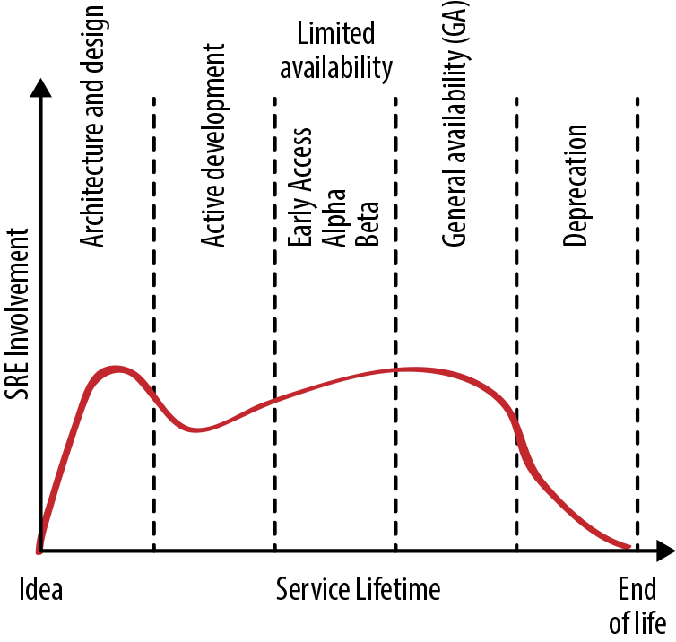
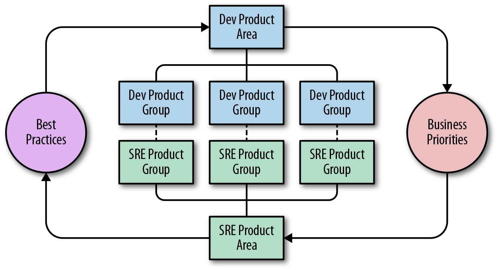

## SRE Engagement Model

By Michael Wildpaner, Gráinne Sheerin, Daniel Rogers,  
and Surya Prashanth Sanagavarapu (New York Times)  
with Adrian Hilton and Shylaja Nukala

[Chapter 32](https://sre.google/sre-book/evolving-sre-engagement-model/) in our first SRE book describes technical and procedural approaches that an SRE team can take to analyze and improve the reliability of a service. These strategies include Production Readiness Reviews (PRRs), early engagement, and continuous improvement.

Simply put, [SRE principles](https://sre.google/resources/practices-and-processes/enterprise-roadmap-to-sre/) aim to maximize the engineering velocity of developer teams while keeping products reliable. This two-fold goal is good for the product users and good for the company. But there’s a limit to how much even the best SRE team can accomplish, and the SRE model is less effective when the domain is too large and overly complex. The current microservices movement makes this dynamic even more acute—a small company can easily have more microservices than a single SRE team can handle. Given a large production landscape, and with the knowledge that they can’t cover every service, an SRE team must decide where to focus their attention to achieve the best results. Product development and SRE teams can collaborate to identify the correct point of focus.

This chapter adopts the perspective of an SRE team that’s intending to provide support for a new service. We look at how to engage most effectively with the service, and with the developer and product teams who own it. Although [SRE engagement](https://sre.google/sre-book/communication-and-collaboration/) often builds around one or more services, the engagement entails much more than the services themselves—it focuses on understanding the aims of developer and product teams and finding the right way to support them.

Most of this discussion is applicable regardless of your organization’s scale. While we use the word team frequently, a team could theoretically start off as a single person (although that person would be quite busy). Regardless of your team’s size, it’s important to proactively define the role of SRE and manage communication and collaboration with product development.

# The Service Lifecycle

As described in the [preface](https://sre.google/sre-book/preface/) to the first SRE book, an SRE team’s contributions to service reliability happen throughout all phases of the service lifecycle. Their application of production knowledge and experience can substantially improve the reliability of a service well before any SRE picks up the pager for the service.

[Figure 18-1](#level-of-sre-engagement-during-the-service-lifecycle%0A) shows the ideal levels of SRE engagement over the course of a service’s life. However, an SRE team might begin their engagement with a service at any stage in the lifecycle. For example, if the development team begins planning a replacement service for an SRE-supported service, SRE might be involved in the new service very early on. Alternatively, an SRE team might formally engage with a service once it has been generally available for months or years and is now facing reliability or scaling challenges. This section provides guidance on how SRE teams can effectively contribute at each phase.

*Figure 18-1. Level of SRE engagement during the service lifecycle*

### Phase 1: Architecture and Design

SRE can influence the architecture and design of a software system in different ways:

- Creating best practices, such as resilience to various single points of failure, that a developer team can employ when building a new product
- Documenting the dos and don’ts of particular infrastructure systems (based upon prior experience) so developers can choose their building blocks wisely, use them correctly, and avoid known pitfalls
- Providing early engagement consulting to discuss specific architectures and design choices in detail, and to help validate assumptions with the help of targeted prototypes
- Joining the developer team and participating in development work
- Codesigning part of the service

Fixing architectural mistakes becomes more difficult later in the development cycle. Early SRE engagement can help avoid costly redesigns that become necessary when systems interact with real-world users and need to scale in response to service growth.

### Phase 2: Active Development

As the product takes shape during active development, SREs can start [productionizing the service](https://sre.google/sre-book/evolving-sre-engagement-model/)—getting it in shape to be released into production. Productionalization typically includes capacity planning, setting up extra resources for redundancy, planning for spike and overload handling, implementing load balancing, and putting in place sustainable operational practices like monitoring, alerting, and performance tuning.

### Phase 3: Limited Availability

As a service progresses toward Beta, the number of users, variety of use cases, intensity of usage, and availability and performance demands increase. At this stage, SRE can help measure and evaluate reliability. We strongly recommend defining SLOs before general availability (GA) so that the service teams have an objective measure of how reliable the service is. The product team still has the option to withdraw a product that can’t meet its target reliability.

During this phase, the SRE team can also help scale the system by building a capacity model, acquiring resources for upcoming launch phases, and automating turnups and in-place service resizing. SRE can ensure proper monitoring coverage and help create alerts that ideally match the upcoming service SLOs.

While service usage is still changing, the SRE team can expect an increased amount of work during incident response and operational duties because the teams are still learning how the service works and how to manage its failure modes. We recommend sharing this work between the developer and SRE teams. That way, the developer team gains operational experience with the service and the SREs gain experience with the service in general. Operational work and incident management will inform the system changes and updates the service owners need to make before GA.

### Phase 4: General Availability

In this phase, the service has passed the Production Readiness Review (see [Chapter 32](https://sre.google/sre-book/evolving-sre-engagement-model/) in Site Reliability Engineering for more details) and is accepting all users. While SRE typically performs the majority of operational work, the developer team should continue to field a small part of all operational and incident response work so they don’t lose perspective on these aspects of the service. They might permanently include one developer in the on-call rotation to help the developers keep track of operational load.

In the early phase of GA, as the developer team focuses on maturing the service and launching the first batches of new features, it also needs to stay in the loop to understand system properties under real load. In the later stages of GA, the developer team provides small incremental features and fixes, some of which are informed by operational needs and any production incidents that occur.

### Phase 5: Deprecation

No system runs forever. If and when a better replacement system is available, the existing system is closed for new users and all engineering focuses on transitioning users from the existing system to the new one. SRE operates the existing system mostly without involvement from the developer team, and supports the transition with development and operational work.

While SRE effort required for the existing system is reduced, SRE is effectively supporting two full systems. Headcount and staffing should be adjusted accordingly.

### Phase 6: Abandoned

Once a service is abandoned, the developer team typically resumes operational support. SRE supports service incidents on a best-effort basis. For a service with internal users, SRE hands over [service management](https://sre.google/sre-book/introduction/) to any remaining users. This chapter provides two case studies of how SRE can hand back a service to developer teams.

### Phase 7: Unsupported

There are no more users, and the service has been shut down. SRE helps to delete references to the service in production configurations and in documentation.

# Setting Up the Relationship

A service does not exist in a vacuum: the SRE team engages with the developer team that builds the service and the product team that determines how it should evolve. This section recommends some strategies and tactics for building and maintaining good working relationships with those teams.

### Communicating Business and Production Priorities

Before you can help someone, you need to understand their needs. To that end, SREs need to understand what the product developers expect the SRE engagement to achieve. When engaging with a developer team, SREs should build a deep understanding of the product and business goals. SREs should be able to articulate their role and how SRE engagement can enable developers to execute toward these goals.

Teams need to regularly talk with each other about business and production priorities. The SRE and developer leadership teams should ideally work as a unit, meeting regularly and exchanging views about technical and prioritization challenges. Sometimes SRE leads join the product development leadership team.

### Identifying Risks

Because an SRE team is focused on system reliability, they are well positioned to identify potential risks. Gauging the likelihood and potential impact of those risks as accurately as possible is important, as the cost of disrupting regular development and feature flow is significant to the product and to engineers.

### Aligning Goals

The developer and SRE teams both care about reliability, availability, performance, scalability, efficiency, and feature and launch velocity. However, SRE operates under different incentives, mainly favoring service long-term viability over new feature launches.

In our experience, developer and SRE teams can strike the right balance here by maintaining their individual foci but also explicitly supporting the goals of the other group. SREs can have an explicit goal to support the developer team’s release velocity and ensure the success of all approved launches. For example, SRE might state, “We will support you in releasing as quickly as is safe,” where “safe” generally implies staying within error budget. Developers should then commit to dedicating a reasonable percentage of engineering time to fixing and preventing the things that are breaking reliability: resolving ongoing service issues at the design and implementation level, paying down technical debt, and including SREs in new feature development early so that they can participate in design conversations.

> **Shared Goals: SRE Engagements at the New York Times**
>
> by Surya Prashanth Sanagavarapu (New York Times)
>
> In our organization, SRE resources are in high demand when it comes to cloud migrations, production ramp-ups, and applications moving toward containers. In addition, SRE teams have their own backlogs to tackle. In the face of limited resources, these competing priorities define success for the SRE team. While hiring SREs is one obvious way to address the demand for SRE time, not every team has the luxury, experience, or time to do so.
>
> The core mission of the SRE function at the New York Times is to empower product development teams with tools and processes to maximize reliability and resilience in applications that support our newsroom, thus enabling distribution of high-quality journalism to readers. We adopted a shared goals model to achieve a balance between reducing the automation backlog and engaging with other teams.
>
> Before engaging with teams, we review our overall backlog for the current quarter/year and clearly define its work items and categories. For instance, our backlog items might include:
>
> - Add automation to set up baseline monitoring and alerting by hitting service status endpoints for applications.
> - Implement more reliable and/or faster build pipelines.
>
> When teams approach SREs for help, one of the factors we consider when prioritizing a request is whether a joint engagement might help reduce our backlog.
>
> ###### Defining the Engagement
>
> Our SREs work with product development teams according to two different models:
>
> - A full-time basis
> - A part-time basis for fairly brief and constrained projects
>
> We define the type of engagement based upon the SRE team’s bandwidth. For full-time engagements, we prefer to embed an SRE in a product development team. This helps provide focus and time to relieve some burden from the product engineering teams. The SRE and product teams have maximum time to learn about each other as the developers ramp up on SRE skills and capabilities. For long-term engagements, we prioritize applications that best fit into our company strategy.
>
> When defining the engagement scope, we attempt to gauge the maturity of the team or the application in relation to SRE practices. We find that various teams are at different levels of maturity when it comes to thinking about SRE practices and principles. We are working on applying an application maturity model to help here.
>
> ###### Setting Shared Goals and Expectations
>
> Setting the right expectations is critical for meeting deadlines and task completion. To this end, we work according to the following principles:
>
> - We emphasize that the application owners, not SREs, are directly responsible for making changes to an application.
> - SRE engagement is for company-wide benefit. Any new automation or tooling should improve common tools and automation used across the company and avoid one-off script development.
> - SREs should give the developer team a heads up about any new processes the engagement might introduce (for example, load testing).
> - The engagements may involve Application Readiness Reviews (ARRs) and Production Readiness Reviews (PRRs), as described in [Chapter 32](https://sre.google/sre-book/evolving-sre-engagement-model/) of Site Reliability Engineering. Proposed changes from ARR and PRR must be prioritized jointly by the developers and the SREs.
> - SREs are not traditional operations engineers. They do not support manual work such as running a job for deployment.
>
> When we set shared goals, we write them jointly with the development team and divide the goals into milestones. If you are an Agile-based company, you might write [epics](https://www.atlassian.com/agile/project-management/epics-stories-themes) or stories. The SRE team can then map those goals into their own backlog.
>
> Our common pattern when setting goals is to:
>
> 1.  Define the scope of the engagement.
>     - *Example 1:* In the next quarter, I want all members of my team to handle GKE/GAE deployments, become comfortable with production environments, and be able to handle a production outage.
>     - *Example 2:* In the next quarter, I want SRE to work with the dev team to stabilize the app in terms of scaling and monitoring, and to develop runbooks and automation for outages.
> 2.  Identify the end result success story, and call it out explicitly.
>     - *Example:* After the engagement, the product development team can handle our service outages in Google Kubernetes Engine without escalation.
>
> ###### Sprints and Communication
>
> Any engagement with product development teams begins with a kickoff and planning meeting. Prior to kickoff, our SRE team reviews the application architecture and our shared goal to verify that the expected outcome is realistic within the given time frame. A joint planning meeting that creates epics and stories can be a good starting point for the engagement.
>
> A roadmap for this engagement might be:
>
> 1.  Review the application architecture.
> 2.  Define shared goals.
> 3.  Hold the kickoff and planning session.
> 4.  Implement development cycles to reach milestones.
> 5.  Set up retrospectives to solicit engagement feedback.
> 6.  Conduct Production Readiness Reviews.
> 7.  Implement development cycles to reach milestones.
> 8.  [Plan and execute launches](https://sre.google/sre-book/reliable-product-launches/).
>
> We require that the teams define a feedback method and agree on its frequency. Both the SRE and development teams need feedback on what is working and what is not. For these engagements to be successful, we have found that providing a constant feedback loop outside of Agile sprint reviews via an agreed-upon method is useful—for example, setting up a biweekly retrospective or check-in with team managers. If an engagement isn’t working, we expect teams to not shy away from planning for disengagement.
>
> ###### Measuring Impact
>
> We have found it important to measure the impact of the engagement to make sure that SREs are doing high-value work. We also measure the maturity level of each partner team so that the SREs can determine the most effective ways to work with them. One approach we adopted from working with Google’s Customer Reliability Engineering (CRE) team is to conduct a point-in-time assessment with leads of the product engineering team before starting the engagement.
>
> A point-in-time assessment consists of walking through a maturity matrix, gauging the maturity of the service along the various axes of concern to SRE (as described in [Chapter 32](https://sre.google/sre-book/evolving-sre-engagement-model/) of Site Reliability Engineering), and agreeing on scores for functional areas such as observability, capacity planning, change management, and incident response. This also helps tailor the engagement more appropriately after we learn more about the team’s strengths, weaknesses, and blind spots.
>
> After the engagement ends and the development team is performing on its own, we perform the assessment again to measure the value SRE added. If we have a maturity model in place, we measure against the model to see if the engagement results in a higher level of maturity. As the engagement comes to an end, we plan for a celebration!

### Setting Ground Rules

At Google, every SRE team has two major goals:

Short term

- Fulfill the product’s business needs by providing an operationally stable system that is available and scales with demand, with an eye on maintainability.

Long term

- Optimize service operations to a level where ongoing human work is no longer needed, so the SRE team can move on to work on the next high-value engagement.

To this end, the teams should agree upon some principles of cooperation, such as:

- Definitions of (and a hard limit on) operational work.
- An agreed-upon and measured SLO for the service that is used to prioritize engineering work for both the developer and SRE teams. You can start without an SLO in place, but our experience shows that not establishing this context from the beginning of the relationship means you’ll have to backtrack to this step later. For an example of how engineering work proceeds less than ideally in the absence of an SLO, see [Case Study 1: Scaling Waze—From Ad Hoc to Planned Change](/workbook/organizational-change#case-study-1-scaling-waze—from-ad-hoc-to-planned-change).
- An agreed-upon quarterly error budget that determines release velocity and other safety parameters, such as excess service capacity to handle unexpected usage growth.
- Developer involvement in daily operations to ensure that ongoing issues are visible, and that fixing their root causes is prioritized.

### Planning and Executing

Proactive planning and coordinated execution ensure that SRE teams meet expectations and product goals while optimizing operations and reducing operational cost. We suggest planning at two (connected) levels:

- With developer leadership, set priorities for products and services and publish yearly roadmaps.
- Review and update roadmaps on a regular basis, and derive goals (quarterly or otherwise) that line up with the roadmap.

Roadmaps ensure that each team has a long-term time horizon of clear, high-impact work. There can be good reasons to forego roadmaps (for example, if the development organization is changing too quickly). However, in a stable environment, the absence of a roadmap may be a signal that the SRE team can merge with another team, move service management work back to the development teams, expand scope, or dissolve.

Holding ongoing strategy conversations with developer leadership helps to quickly identify shifts in focus, discuss new opportunities for SRE to add value to the business, or stop activities that are not cost-effective for the product.

Roadmaps can focus on more than just improving the product. They can also address how to apply and improve common SRE technologies and processes to drive down operational cost.

# Sustaining an Effective Ongoing Relationship

Healthy and effective relationships require ongoing effort. The strategies outlined in this section have worked well for us.

### Investing Time in Working Better Together

The simple act of spending time with each other helps SREs and developers collaborate more effectively. We recommend that SREs meet regularly with their counterparts for the services they run. It’s also a good idea for SREs to meet periodically with other SRE teams who run services that either send traffic to the service or provide common infrastructure that the service uses. The SRE team can then escalate confidently and quickly during outages or disagreements because the teams know each other and have already set expectations of how escalations should be initiated and managed.

### Maintaining an Open Line of Communication

In addition to the day-to-day communication between teams, we’ve found a couple methods of more formal information exchange to be particularly helpful over the course of the engagement.

SREs can give a quarterly “state of production” talk to product development leadership to help them understand where they should invest resources and how exactly SRE is helping their product or service. In a similar vein, developers can give a periodic “state of the product” talk to the SRE team or involve SRE in the developer team’s executive presentations. This gives the SRE team an overview of what the developer team has accomplished over the last quarter (and lets the SREs see how their own work enabled that). It also provides an update on where the product is going over the next few quarters, and where the product lead sees SRE engaging to make that happen.

### Performing Regular Service Reviews

As the decision makers for the service’s future, the SRE and developer team leads responsible for the service should meet face-to-face at least once a year. Meeting more frequently than this can be challenging—for example, because it may involve intercontinental travel. During this meeting, we typically share our roadmaps for the next 12–18 months and discuss new projects and launches.

SRE teams sometimes facilitate a retrospective exercise, where the leads discuss what the teams want to stop doing, keep doing, and start doing. Items can appear in more than one area, and all opinions are valid. These sessions need active facilitation because the best results come from full-team participation. This is often rated the most useful session in the service meeting because it yields details that can drive significant service changes.

### Reassessing When Ground Rules Start to Slip

If cooperation in any of the agreed-upon areas (see [Setting Ground Rules](#setting-ground-rules)) begins to regress, both developers and SRE need to change priorities to get the service back in shape. We have found that, depending on the urgency, this can mean any of the following:

- The teams identify specific engineers who must drop their lower-priority tasks to focus on the regression.
- Both teams call a “reliability hackathon,” but usual team priorities continue outside of the hackathon days.
- A feature freeze is declared and the majority of both teams focus on resolving the regression.
- Technical leadership determines that the reliability of the product is at acute risk, and the teams call an “all hands on deck” response.

### Adjusting Priorities According to Your SLOs and Error Budget

The subtle art of crafting a well-defined SLO helps a team prioritize appropriately. If a service is in danger of missing the SLO or has exhausted the error budget, both teams can work with high priority to get the service back into safety. They can address the situation through both tactical measures (for example, overprovisioning to address traffic-related performance regressions) and more strategic software fixes (such as optimizations, caching, and graceful degradation).

If a service is well within SLO and has ample error budget left, we recommend using the spare error budget to increase feature velocity rather than spending overproportional efforts on service improvements.

### Handling Mistakes Appropriately

Humans inevitably make mistakes. Consistent with our [postmortem culture](https://sre.google/sre-book/postmortem-culture/), we don’t blame people, and instead focus on system behavior. Your mileage may vary, but we have had success with the following tactics.

###### Sleep on it

If possible, don’t conduct follow-up conversations when you’re tired or emotions are high. During high-stress situations, people can easily misinterpret tone in written communication like emails. Readers will remember how the words made them feel, not necessarily what was written. When you’re communicating across locations, it’s often worth the time to set up a video chat so that you can see facial expressions and hear the tone of voice that helps disambiguate words.

###### Meet in person (or as close to it as possible) to resolve issues

Interactions conducted solely via code reviews or documentation can quickly become drawn out and frustrating. When a behavior or decision from another team is at odds with our expectations, we talk with them about our assumptions and ask about missing context.

###### Be positive

Thank people for their positive behaviors. Doing so can be simple—for example, during code reviews, design reviews, and failure scenario training, we ask engineers to call out what was good and explain why. You might also recognize good code comments or thank people for their time when they invest in a rigorous design review.

###### Understand differences in communication

Different teams have different internal expectations for how information is disseminated. Understanding these differences can help strengthen relationships.

# Scaling SRE to Larger Environments

The scenarios we’ve discussed so far involve a single SRE team, a single developer team, and one service. Larger companies, or even small companies that use a microservices model, may need to scale some or all of these numbers.

### Supporting Multiple Services with a Single SRE Team

Because SREs have specialized skills and are a scarce resource, Google generally maintains an SRE-to-developer ratio of \< 10%. Therefore, one SRE team commonly works with multiple developer teams in their product area (PA).

If SREs are scarce relative to the number of services that merit SRE support, an SRE team can focus their efforts on one service, or on a few services from a small number of developer teams.

In our experience, you can scale limited SRE resources to many services if those services have the following characteristics:

- Services are part of a single product. This provides end-to-end ownership of the user experience and alignment with the user.
- Services are built on similar tech stacks. This minimizes cognitive load and enables effective reuse of technical skills.
- Services are built by the same developer team or a small number of related developer teams. This minimizes the number of relationships and makes it easier to align priorities.

### Structuring a Multiple SRE Team Environment

If your company is big enough to have multiple SRE teams, and perhaps multiple products, you need to choose a structure for how SRE and the product groups relate.

Within Google, we support a complex developer organization. As shown in [Figure 18-2](#large-scale-developer-to-sre-team-relationships), each PA consists of multiple product groups that each contain multiple products. The SRE organization shadows the developer organization hierarchically, with shared priorities and best practices at each level. This model works when all teams in a group, or all groups in a PA, share the same or similar specific business goals, and when every product group has both a product leader and an SRE lead.

*Figure 18-2. Large-scale developer-to-SRE team relationships (per product area)*

If your organization has multiple SRE teams, you’ll need to group them in some way. The two main approaches we’ve seen work well are:

- Group the teams within a product, so they don’t have to coordinate with too many different developer teams.
- Group the teams within a technology stack (e.g., “storage” or “networking”).

To prevent churn in SRE teams during developer reorgs, we recommend organizing SRE teams according to technology rather than developer PA reporting structure. For example, many teams that support storage systems are structured and operate in the same way. Grouping storage systems in technology-focused product groups may make more sense even if they come from different parts of the developer organization.

### Adapting SRE Team Structures to Changing Circumstances

If you need to modify the structure of your SRE teams to reflect changing PA needs, we recommend creating, splitting (sharding), merging, and dissolving SRE teams based on service needs and engineering and operational load. Each SRE team should have a clear charter that reflects their services, technology, and operations. When a single SRE team has too many services, rather than building new teams from scratch, we prefer to shard the existing team into multiple teams to transfer culture and grow existing leadership. Changes like this are inevitably disruptive to existing teams, so we’d recommend that you restructure teams only when necessary.

### Running Cohesive Distributed SRE Teams

If you need to ensure 24/7 coverage and business continuity, and you have a global presence, it’s worth trying to distribute your SRE teams around the globe to provide even coverage. If you have a number of globally distributed teams, we recommend colocating teams based upon adjacency and upon similarity of services and shared technology. We’ve found that singleton teams are generally less effective and more vulnerable to the effects of reorgs outside the team—we create such teams only if clearly defined business needs call for them and we’ve considered all other options.

Many companies don’t have the resources for full global coverage, but even if you’re split only across buildings (never mind continents), it’s important to create and maintain a two-location arrangement.

It’s also important to create and maintain organizational standards that drive planning and execution and foster and maintain a shared team culture. To this end, we find it useful to gather the entire team in one physical location periodically—for example, at an org-wide summit every 12–18 months.

Sometimes it doesn’t make sense for everyone on the team to own certain responsibilities—for example, conducting regular test restores from backups or implementing cross-company technical mandates. When balancing these responsibilities between a team’s distributed sites, keep the following strategies in mind:

- Assign individual responsibilities to single locations, but rotate them regularly (e.g., yearly).
- Share every responsibility between locations, making an active effort to balance the involvement and workload.
- Don’t lock a responsibility to a single location for multiple years. We’ve found that the costs of this configuration ultimately outweigh the benefits. Although that location will tend to become really good at executing those responsibilities, this fosters an “us versus them” mentality, hinders distribution of knowledge, and presents a risk for business continuity.

All of these strategies require locations to maintain tactical and strategic communication.

# Ending the Relationship

SRE engagements aren’t necessarily indefinite. SREs provide value by doing impactful engineering work. If the work is no longer impactful (i.e., the value proposition of an SRE engagement goes away), or if the majority of the work is no longer on the engineering (versus operations) side, you may need to revisit the ongoing SRE engagement. In general, individual SREs will move away from toil-heavy teams to teams with more interesting engineering work.

On a team level, you might hand back a service if SRE no longer provides sufficient business value to merit the costs. For example:

1.  If a service has been optimized to a level where ongoing SRE engagement is no longer necessary
2.  If a service’s importance or relevance has diminished
3.  If a service is reaching end of life

The following case studies demonstrate how two Google SRE engagement models ended. The first ends with largely positive results, while the other ends with a more nuanced outcome.

### Case Study 1: Ares

Google’s Abuse SRE and Common Abuse Tool (CAT) teams provided anti-abuse protection for most Google properties and worked with customer-facing products to keep users safe. The Abuse SRE team applied engineering work to lower CAT’s operational support burden so that the developers were able to take a direct role in supporting their users. These users were the Googlers operating the properties defended by CAT, who had high expectations about the efficacy of CAT and its response time to problems or new threats.

Efficient abuse fighting requires constant attention, rapid adaptive changes, and nimble flexibility in the face of new threats and attacks. These requirements clashed with the common SRE goals of reliable and planned feature development. CAT teams routinely needed to implement fast development and deploy new protections to properties under attack. However, Abuse SRE pushed back on requested changes, requesting more in-depth analysis of the consequences each new protection would have on the overall production system. Time constraints on consultations between teams and reviews compounded this tension.

To hopefully improve the situation, Abuse SRE and CAT leadership engaged in a multiyear project to create a dedicated infrastructure team within CAT. The newly formed “Ares” team had a mandate to unify abuse-fighting infrastructure for Google properties. This team was staffed by CAT engineers who had production infrastructure knowledge and experience building and running large services. The teams started an exchange program to transfer production management knowledge from Abuse SRE to the CAT infrastructure team members.

Abuse SREs taught the Ares team that the easiest way to launch a new service in production (when you’re already running large distributed services) is to minimize the additional cognitive load that the service imposes. To reduce this cognitive load, systems should be as homogeneous as possible. Deploying and managing a collection of production services together means they can share the same release structure, capacity planning, subservices for accessing storage, and so on. Following this advice, Ares redesigned the whole abuse-fighting stack, applying modularity concepts to shift toward a microservice model. They also built a new layer that provided abstractions for developers so that they didn’t have to worry about lower-level production details like monitoring, logging, and storage.

At this point, the Ares team started to act more like an SRE team for CAT by administering the new abuse-fighting infrastructure. Meanwhile, Abuse SRE focused on the production deployment and efficient day-to-day operation of the overall abuse-fighting infrastructure.

Collaboration between the Ares engineers and Abuse SRE resulted in the following improvements:

- Because the CAT team now had “in-house” production experts that were also experts in abuse fighting, Abuse SRE no longer had to vet new feature integration. This greatly reduced time to production for new features. At the same time, the CAT team’s developer velocity increased because the new infrastructure abstracted away production management details.
- The Abuse SRE team now had many fewer requests from the CAT team to launch new features, as most of the requests did not require infrastructure changes. The team also needed less knowledge to evaluate the impact of a new feature, since infrastructure changes were rarely required. When infrastructure changes were necessary, Abuse SRE only needed to clarify the implications on the infrastructure rather than specific feature functionality.
- Products that needed to integrate with abuse-fighting infrastructure had a faster and more predictable turnaround time since a product integration was now equivalent in effort to a feature launch.

At the end of this project, Abuse SREs disengaged from directly supporting CAT, focusing instead on the underlying infrastructure. This did not compromise CAT’s reliability or overburden the CAT team with additional operational work; instead, it increased CAT’s overall development velocity.

Currently, Ares protects users across a large number of Google properties. Since the team’s inception, SREs and product development have partnered to make collaborative decisions on how infrastructure will work in production. This partnership was only possible because the Ares effort created a sense of shared destiny.

### Case Study 2: Data Analysis Pipeline

Sometimes the cost of maintaining an SRE support relationship is higher than the value (perceived or measured) that SREs provide. In these cases, it makes sense to end the relationship by disbanding the SRE team.[^1]

When the value of a relationship declines over time, it is extremely difficult to identify a point in time when it makes sense to terminate that relationship. Two teams at Google that supported a revenue-critical data analysis pipeline had to face this challenge. Figuring out that a parting of the ways was appropriate was not a trivial task, especially after a decade of cooperation. In retrospect, we were able to identify several patterns within the team interaction that were strong indicators that we needed to reconsider the relationship between the SRE team and the product team.

###### The pivot

Three years before the turndown, all involved parties recognized that their primary data analysis pipeline was running into scaling limitations. At that time, the developer team decided to start planning their new system and dedicated a small number of engineers to the new effort. As that effort began to coalesce, it made sense to deprioritize development of large, complex, or risky features for the existing system in favor of work on the new system. This had two important effects over time:

- An informal rule was applied to new projects: if the project’s complexity or the risk involved in modifying the existing system to accommodate the project was sufficiently high, then it was better to make that investment in the new system.
- As resources shifted to developing the new system, even relatively conservative changes to the existing system became more difficult. Nevertheless, usage continued to grow at an extremely high rate.

###### Communication breakdown

Keeping an existing system operational while a replacement system is simultaneously designed, built, and launched is challenging for any engineering team. Stresses naturally build between the people focused on new versus old systems, and teams need to make difficult prioritization decisions. These difficulties can be compounded when the teams are separated organizationally—for example, an SRE team focused on maintaining and operating an existing system and a developer team working on the next-generation system.

Regular, open, and cooperative communication is vital throughout this entire cycle in order to maintain and preserve a good working relationship across teams. In this example, a gap in communication led to a breakdown in the working relationship between teams.

###### Decommission

It took some time to realize that the disconnectedness between the SRE and developer teams was insurmountable. Ultimately, the simplest solution was to remove the organizational barrier and give the developer team full control over prioritizing work on old and new systems. The systems were expected to overlap for 18–24 months before the old system was fully phased out.

Combining SRE and product development functions into a single team allowed upper management to be maximally responsive to their areas of accountability. Meanwhile, the team could decide how to balance operational needs and velocity. Although decommissioning two SRE teams was not a pleasant experience, doing so resolved the continual tension over where to invest engineering effort.

Despite the inevitable extra operational load on the developer team, realigning ownership of the old system with people who had greater knowledge of service internals provided the opportunity to more quickly address operational problems. This team also had more insight into potential causes of outages, which generally resulted in more effective troubleshooting and quicker issue resolution. However, there were some unavoidable negative impacts while the developer team learned about the nuances of the operational work needed to support the service in a short amount of time. The SRE team’s final job was to make the transfer of this knowledge as smooth as possible, equipping the developer team to take on the work.

It is worth noting that if the working relationship were healthier—with teams working together effectively to solve problems—SRE would have handed production work back to the developer team for a short period of time. After the system was restabilized and hardened for expected growth needs, SRE would normally reassume responsibility of the system. SRE and development teams need to be willing to address issues head on and identify points of tension that need resetting. Part of SRE’s job is to help maintain production excellence in the face of changing business needs, and often this means engaging with developers to find solutions to challenging problems.

# Conclusion

The form of an SRE team’s engagement changes over the various phases of a service’s lifecycle. This chapter provided advice specific to each phase. Examples from both the Google and the New York Times SRE teams show that effectively managing the engagement is just as important as making good technical design decisions. Sometimes an SRE engagement should reach a natural conclusion. Case studies from Ares and a data analysis pipeline team provided examples of how this can happen, and how best to end the engagement.

When it comes to best practices for setting up an effective relationship between SRE and product development teams, a shared sense of purpose and goals with regular and open communication is key. You can scale an SRE team’s impact in a number of ways, but these principles for relationship management should always hold true. For sustaining the long-term success of an engagement, investing in aligning team goals and understanding each other’s objectives is as important as defending SLOs.

[^1]: Google HR supports employees by finding new opportunities when such transitions occur.
