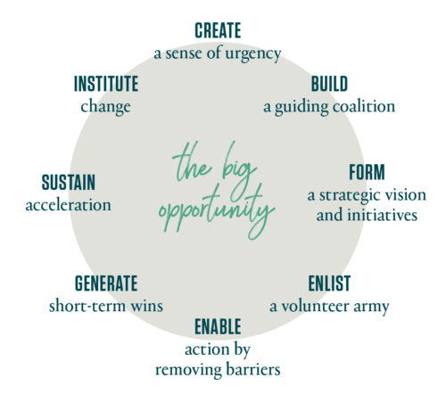
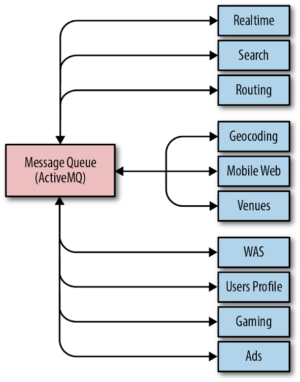
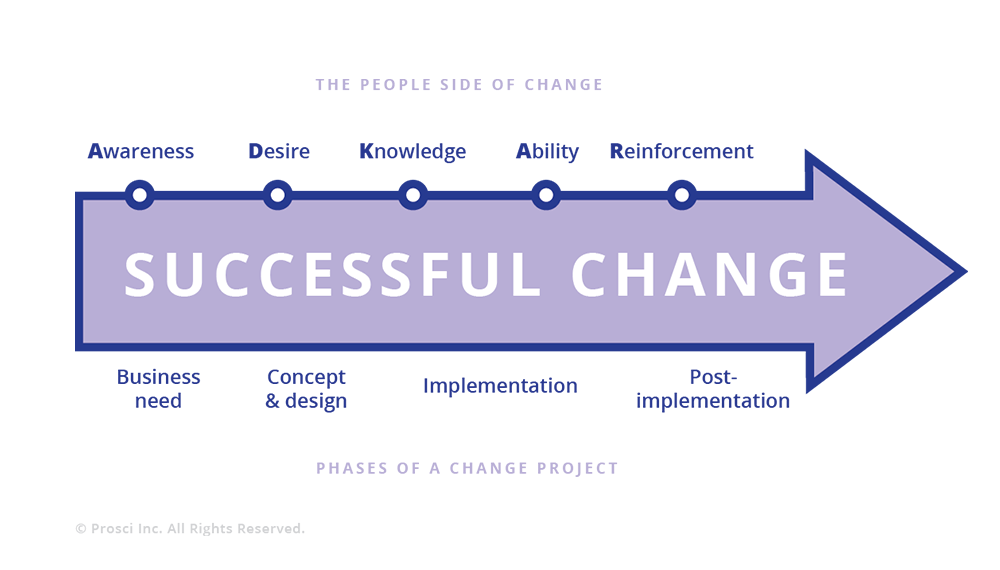

# Organizational Change Management in SRE

By Alex Bramley, Ben Lutch, Michelle Duffy, and Nir Tarcic  
with Betsy Beyer

In the [introduction to the first SRE Book](https://sre.google/sre-book/introduction/), Ben Treynor Sloss describes SRE teams as “characterized by both rapid innovation and a large acceptance of change,” and specifies organizational change management as a core responsibility of an SRE team. This chapter examines how theory can apply in practice across SRE teams. After reviewing some key change management theories, we explore two case studies that demonstrate how different styles of change management have played out in concrete ways at Google.

Note that the term change management has two interpretations: organizational change management and change control. This chapter examines change management as a collective term for all approaches to preparing and supporting individuals, teams, and business units in making organizational change. We do not discuss this term within a project management context, where it may be used to refer to change control processes, such as change review or versioning.

## SRE Embraces Change

More than 2,000 years ago, the Greek philosopher Heraclitus claimed change is the only constant. This axiom still holds true today—especially in regards to technology, and particularly in rapidly evolving internet and cloud sectors.

Product teams exist to build products, ship features, and delight customers. At Google, most change is fast-paced, following a “launch and iterate” approach. Executing on such change typically requires coordination across systems, products, and globally distributed teams. Site Reliability Engineers are frequently in the middle of this complicated and rapidly shifting landscape, responsible for balancing the risks inherent in change with product reliability and availability. Error budgets (see [Implementing SLOs](/workbook/implementing-slos/)) are a primary mechanism for achieving this balance.

# Introduction to Change Management

Change management as an area of study and practice has grown since foundational work in the field by Kurt Lewin in the 1940s. Theories primarily focus on developing frameworks for managing organizational change. In-depth analysis of particular theories is beyond the scope of this book, but to contextualize them within the realm of SRE, we briefly describe some common theories and how each might be applicable in an SRE-type organization. While the formal processes implicit in these theoretical frameworks have not been applied by SRE at Google, considering SRE activities through the lens of these frameworks has helped us refine our approach to managing change. Following this discussion, we will introduce some case studies that demonstrate how elements of some of these theories apply to change management activities led by Google SRE.

### Lewin’s Three-Stage Model

[Kurt Lewin’s “unfreeze–change–freeze” model](https://journals.sagepub.com/doi/pdf/10.1177/0018726715577707) for managing change is the oldest of the relevant theories in this field. This simple three-stage model is a tool for managing process review and the resulting changes in group dynamics. Stage 1 entails persuading a group that change is necessary. Once they are amenable to the idea of change, Stage 2 executes that change. Finally, when the change is broadly complete, Stage 3 institutionalizes the new patterns of behavior and thought. The model’s core principle posits the group as the primary dynamic instrument, arguing that individual and group interactions should be examined as a system when the group is planning, executing, and completing any period of change. Accordingly, Lewin's work is most useful for planning organizational change at the macro level.

### McKinsey’s 7-S Model

[McKinsey’s seven S’s](https://www.mckinsey.com/business-functions/strategy-and-corporate-finance/our-insights/enduring-ideas-the-7-s-framework) stand for structure, strategy, systems, skills, style, staff, and shared values. Similar to Lewin’s work, this framework is also a toolset for planned organizational change. While Lewin’s framework is generic, 7-S has an explicit goal of improving organizational effectiveness. Application of both theories begins with an analysis of current purpose and processes. However, 7-S also explicitly covers both business elements (structure, strategy, systems) and people-management elements (shared values, skills, style, staff). This model could be useful for a team considering change from a traditional systems administration focus to the more holistic Site Reliability Engineering approach.

### Kotter’s Eight-Step Process for Leading Change

Time magazine named John P. Kotter’s 1996 book Leading Change (Harvard Business School Press) one of the [Top 25 Most Influential Business Management Books of all time](https://content.time.com/time/specials/packages/completelist/0,29569,2086680,00.html). [Figure 21-1](#kotters-model-of-change-management) depicts the eight steps in Kotter’s change management process.

*Figure 21-1. Kotter’s model of change management (source: https://www.kotterinc.com/8-steps-process-for-leading-change/)*

Kotter’s process is particularly relevant to SRE teams and organizations, with one small exception: in many cases (e.g., the upcoming Waze case study), there’s no need to create a sense of urgency. SRE teams supporting products and systems with accelerating growth are frequently faced with urgent scaling, reliability, and operational challenges. The component systems are often owned by multiple development teams, which may span several organizational units; scaling issues may also require coordination with teams ranging from physical infrastructure to product management. Because SRE is often on the front line when problems occur, it is uniquely motivated to lead the change needed to ensure products are available 24/7/365. Much of SRE work (implicitly) embraces Kotter’s process to ensure the continued availability of supported products.

### The Prosci ADKAR Model

The [Prosci ADKAR model](https://www.prosci.com/adkar/adkar-model) focuses on balancing both the business and people aspects of change management. ADKAR is an acronym for the goals individuals must achieve for successful organizational change: awareness, desire, knowledge, ability, and reinforcement.

In principle, ADKAR provides a useful, thoughtful, people-centric framework. However, its applicability to SRE is limited because operational responsibilities quite often impose considerable time constraints. Proceeding iteratively through ADKAR’s stages and providing the necessary training or coaching requires pacing and investment in communication, which are difficult to implement in the context of globally distributed, operationally focused teams. That said, Google has successfully used ADKAR-style processes for introducing and building support for high-level changes—for example, introducing global organizational change to the SRE management team while preserving local autonomy for implementation details.

### Emotion-Based Models

The [Bridges Transition Model](https://wmbridges.com/what-is-transition/) describes people’s emotional reactions to change. While a useful management tool for people managers, it’s not a framework or process for change management. Similarly, the Kübler-Ross Change Curve describes ranges of emotions people may feel when faced with change. Developed from Elisabeth Kübler-Ross’s research on death and dying,[^1] it has been applied to understanding and anticipating employee reactions to organizational change. Both models can be useful in maintaining high employee productivity throughout periods of change, since unhappy people are rarely productive.

### The Deming Cycle

Also known as the Plan-Do-Check-Act (or PDCA) Cycle, this process from statistician Edward W. Deming is commonly used in DevOps environments for process improvements—for example, adoption of continuous integration/continuous delivery techniques. It is not suited to organizational change management because it does not cover the human side of change, including motivations and leadership styles. Deming’s focus is to take existing processes (mechanical, automated, or workflow) and cyclically apply continuous improvements. The case studies we refer to in this chapter deal with larger, organizational changes where iteration is counterproductive: frequent, wrenching org-chart changes can sap employee confidence and negatively impact company culture.

### How These Theories Apply to SRE

No change management model is universally applicable to every situation, so it’s not surprising that Google SRE hasn’t exclusively standardized on one model. That said, here’s how we like to think about applying these models to common change management scenarios in SRE:

- Kotter’s Eight-Step Process is a change management model for SRE teams who necessarily embrace change as a core responsibility.
- The Prosci ADKAR model is a framework that SRE management may want to consider to coordinate change across globally distributed teams.
- All individual SRE managers will benefit from familiarity with both the Bridges Transition Model and the Kübler-Ross Change Curve, which provide tools to support employees in times of organizational change.

Now that we’ve introduced the theories, let’s look at two case studies that show how change management has played out at Google.

# Case Study 1: Scaling Waze—From Ad Hoc to Planned Change

### Background

Waze is a community-based navigation app acquired by Google in 2013. After the acquisition, Waze entered a period of significant growth in active users, engineering staff, and computing infrastructure, but continued to operate relatively autonomously within Google. The growth introduced many challenges, both technical and organizational.

Waze’s autonomy and startup ethos led them to meet these challenges with a grassroots technical response from small groups of engineers, rather than management-led, structured organizational change as implied by the formal models discussed in the previous section. Nevertheless, their approach to propagating changes throughout the organization and infrastructure significantly resembles Kotter’s model of change management. This case study examines how Kotter’s process (which we apply retroactively) aptly describes a sequence of technical and organizational challenges Waze faced as they grew post-acquisition.

### The Messaging Queue: Replacing a System While Maintaining Reliability

Kotter’s model begins the cycle of change with a sense of urgency. Waze’s SRE team needed to act quickly and decisively when the reliability of Waze’s message queueing system regressed badly, leading to increasingly frequent and severe outages. As shown in [Figure 21-2](#communication-paths-between-waze-components), the message queueing system was critical to operations because every component of Waze (real time, geocoding, routing, etc.) used it to communicate with other components internally.

*Figure 21-2. Communication paths between Waze components*

As throughput on the message queue grew significantly, the system simply couldn’t cope with the ever-increasing demands. SREs needed to manually intervene to preserve system stability at shorter and shorter intervals. At its worst, the entire Waze SRE team spent most of a two-week period firefighting 24/7, eventually resorting to restarting some components of the message queue hourly to keep messages flowing and tens of millions of users happy.

Because SRE was also responsible for building and releasing all of Waze’s software, this operational load had a noticeable impact on feature velocity—when SREs spent all of their time fighting fires, they hardly had time to support new feature rollouts. By highlighting the severity of the situation, engineers convinced Waze’s leadership to reevaluate priorities and dedicate some engineering time to reliability work. A guiding coalition of two SREs and a senior engineer came together to form a strategic vision of a future where SRE toil was no longer necessary to keep messages flowing. This small team evaluated off-the-shelf message queue products, but quickly decided that they could only meet Waze’s scaling and reliability requirements with a custom-built solution.

Developing this message queue in-house would be impossible without some way to maintain operations in the meantime. The coalition removed this barrier to action by enlisting a volunteer army of developers from the teams who used the current messaging queue. Each team reviewed the codebase for their service to identify ways to cut the volume of messages they published. Trimming unnecessary messages and rolling out a compression layer on top of the old queue reduced some load on the system. The team also gained some more operational breathing room by building a dedicated messaging queue for one particular component that was responsible for over 30% of system traffic. These measures yielded enough of a temporary operational reprieve to allow for a two-month window to assemble and test a prototype of the new messaging system.

Migrating a message queue system that handles tens of thousands of messages per second is a daunting task even without the pressure of imminent service meltdown. But gradually reducing the load on the old system would relieve some of this pressure, affording the team a longer time window to complete the migration. To this end, Waze SRE rebuilt the client libraries for the message queue so they could publish and receive messages using either or both systems, using a centralized control surface to switch the traffic over.

Once the new system was proven to work, SRE began the first phase of the migration: they identified some low-traffic, high-importance message flows for which messaging outages were catastrophic. For these flows, writing to both messaging systems would provide a backup path. A couple of near misses, where the backup path kept core Waze services operating while the old system faltered, provided the short-term wins that justified the initial investment.

Mass migration to the new system required SRE to work closely with the teams who use it. The team needed to figure out both how to best support their use cases and how to coordinate the traffic switch. As the SRE team automated the process of migrating traffic and the new system supported more use cases by default, the rate of migrations accelerated significantly.

Kotter’s change management process ends with instituting change. Eventually, with enough momentum behind the adoption of the new system, the SRE team could declare the old system deprecated and no longer supported. They migrated the last stragglers a few quarters later. Today, the new system handles more than 1000 times the load of the previous one, and requires little manual intervention from SREs for ongoing support and maintenance.

### The Next Cycle of Change: Improving the Deployment Process

The process of change as a cycle was one of Kotter’s key insights. The cyclical nature of meaningful change is particularly apparent when it comes to the types of technical changes that face SRE. Eliminating one bottleneck in a system often highlights another one. As each change cycle is completed, the resulting improvements, standardization, and automation free up engineering time. Engineering teams now have the space to more closely examine their systems and identify more pain points, triggering the next cycle of change.

When Waze SRE could finally take a step back from firefighting problems related to the messaging system, a new bottleneck emerged, bringing with it a renewed sense of urgency: SRE’s sole ownership of releases was noticeably and seriously hindering development velocity. The manual nature of releases required a significant amount of SRE time. To exacerbate an already suboptimal situation, system components were large, and because releases were costly, they were relatively infrequent. As a result, each release represented a large delta, significantly increasing the possibility that a major defect would necessitate a rollback.

Improvements toward a better release process happened incrementally, as Waze SRE didn’t have a master plan from square one. To slim down system components so the team could iterate each more rapidly, one of the senior Waze developers created a framework for building microservices. This provided a standard “batteries included” platform that made it easy for the engineering organization to start breaking their components apart. SRE worked with this developer to include some reliability-focused features—for example, a common control surface and a set of behaviors that were amenable to automation. As a result, SRE could develop a suite of tools to manage the previously costly parts of the release process. One of these tools incentivized adoption by bundling all of the steps needed to create a new microservice with the framework.

These tools were quick-and-dirty at first—the initial prototypes were built by one SRE over the course of several days. As the team cleaved more microservices from their parent components, the value of the SRE-developed tools quickly became apparent to the wider organization. SRE was spending less time shepherding the slimmed-down components into production, and the new microservices were much less costly to release individually.

While the release process was already much improved, the proliferation of new microservices meant that SRE’s overall burden was still concerning. Engineering leadership was unwilling to assume responsibility for the release process until releases were less burdensome.

In response, a small coalition of SREs and developers sketched out a strategic vision to shift to a continuous deployment strategy using [Spinnaker](https://www.spinnaker.io/), an open source, multicloud, continuous delivery platform for building and executing deployment workflows. With the time saved by our bootstrap tooling, the team now was able to engineer this new system to enable one-click builds and deployments of hundreds or thousands of microservices. The new system was technically superior to the previous system in every way, but SRE still couldn’t persuade development teams to make the switch. This reluctance was driven by two factors: the obvious disincentive of having to push their own releases to production, plus change aversion driven by poor visibility into the release process.

Waze SRE tore down these barriers to adoption by showing how the new process added value. The team built a centralized dashboard that displayed the release status of binaries and a number of standard metrics exported by the microservice framework. Development teams could easily link their releases to changes in those metrics, which gave them confidence that deployments were successful. SRE worked closely with a few volunteer systems-oriented development teams to move services to Spinnaker. These wins proved that the new system could not only fulfill its requirements, but also add value beyond the original release process. At this point, engineering leadership set a goal for all teams to perform releases using the new Spinnaker deployment pipelines.

To facilitate the migration, Waze SRE provided organization-wide Spinnaker training sessions and consulting sessions for teams with complex requirements. When early adopters became familiar with the new system, their positive experiences sparked a chain reaction of accelerating adoption. They found the new process faster and less painful than waiting for SRE to push their releases. Now, engineers began to put pressure on dependencies that had not moved, as they were the impediment to faster development velocity—not the SRE team!

Today, more than 95% of Waze’s services use Spinnaker for continuous deployment, and changes can be pushed to production with very little human involvement. While Spinnaker isn’t a one-size-fits-all solution, configuring a release pipeline is trivial if a new service is built using the microservices framework, so new services have a strong incentive to standardize on this solution.

### Lessons Learned

Waze’s experience in removing bottlenecks to technical change contains a number of useful lessons for other teams attempting engineering-led technical or organizational change. To begin with, change management theory is not a waste of time! Viewing this development and [migration process](https://sre.google/resources/practices-and-processes/practical-guide-to-cloud-migration/) through the lens of Kotter’s process demonstrates the model’s applicability. A more formal application of Kotter’s model at the time could have helped streamline and guide the process of change.

Change instigated from the grass roots requires close collaboration between SRE and development, as well as support from executive leadership. Creating a small, focused group with members from all parts of the organization—SRE, developers, and management—was key to the team’s success. A similar collaboration was vital to instituting the change. Over time, these ad hoc groups can and should evolve into more formal and structured cooperation, where SREs are automatically involved in design discussions and can advise on best practices for building and deploying robust applications in a production environment throughout the entire product lifecycle.

Incremental change is much easier to manage. Jumping straight to the “perfect” solution is too large a step to take all at once (not to mention probably infeasible if your system is about to collapse), and the concept of “perfect” will likely evolve as new information comes to light during the change process. An iterative approach can demonstrate early wins that help an organization buy into the vision of change and justify further investment. On the other hand, if early iterations don’t demonstrate value, you’ll waste less time and fewer resources when you inevitably abandon the change. Because incremental change doesn’t happen all at once, having a master plan is invaluable. Describe the goals in broad terms, be flexible, and ensure that each iteration moves toward them.

Finally, sometimes your current solutions can’t support the requirements of your strategic vision. Building something new has a large engineering cost, but can be worthwhile if the project pushes you out of a local maxima and enables long-term growth. As a thought experiment, figure out where bottlenecks might arise in your systems and tooling as your business and organization grow over the next few years. If you suspect any elements don’t scale horizontally, or have superlinear (or worse, exponential) growth with respect to a core business metric such as daily active users, you may need to consider redesigning or replacing them.

Waze’s development of a new in-house message queue system shows that it is possible for small groups of determined engineers to institute change that moves the needle toward greater service reliability. Mapping Kotter’s model onto the change shows that some consideration of change management strategy can help provide a formula for success even in small, engineering-led organizations. And, as the next case study also demonstrates, when changes promote standardizing technology and processes, the organization as a whole can reap considerable efficiency gains.

# Case Study 2: Common Tooling Adoption in SRE

### Background

SREs are opinionated about the software they can and should use to manage production. Years of experience, observing what goes well and what doesn’t, and examining the past through the lens of the postmortem, have given SREs a deep background coupled with strong instincts. Specifying, building, and implementing software to automate this year’s job away is a core value in SRE. In particular, Google SRE recently focused our efforts on horizontal software. Adoption of the same solution by a critical mass of users and developers creates a virtuous cycle and reduces reinvention of wheels. Teams who otherwise might not interact share practices and policies that are automated using the same software.

This case study is based on an organizational evolution, not a response to a systems scaling or reliability issue (as discussed in the Waze case study). Hence, the Prosci ADKAR model (shown in [Figure 21-3](#prosci-adkar-model-of-change-management)) is a better fit than Kotter’s model, as it recognizes both explicit organizational/people management characteristics and technical considerations during the change.

*Figure 21-3. Prosci ADKAR model of change management*

### Problem Statement

A few years ago, Google SRE found itself using multiple independent software solutions for approximately the same problem across multiple problem spaces: monitoring, releases and rollouts, incident response, capacity management, and so on.

This end state arose in part because the people building tools for SRE were dissociated from their users and their requirements. The tool developers didn’t always have a current view of the problem statement or the overall production landscape—the production environment changes very rapidly and in new ways as new software, hardware, and use cases are brought to life almost daily. Additionally, the consumers of tools were varied, sometimes with orthogonal needs (“this rollout has to be fast; approximate is fine” versus “this rollout has to be 100% correct; okay for it to go slowly”).

As a result, none of these long-term projects fully addressed anyone’s needs, and each was characterized by varying levels of development effort, feature completeness, and ongoing support. Those waiting for the big use case—a nonspecific, singing-and-dancing solution of the future—waited a long time, got frustrated, and used their own software engineering skills to create their own niche solution. Those who had smaller, specific needs were loath to adopt a broader solution that wasn’t as tailored to them. The long-term, technical, and organizational benefits of more universal solutions were clear, but customers, services, and teams were not staffed or rewarded for waiting. To compound this scenario, requirements of both large and small customer teams changed over time.

### What We Decided to Do

To scope this scenario as one concrete problem space, we asked ourselves: What if all Google SREs could use a common monitoring engine and set of dashboards, which were easy to use and supported a wide variety of use cases without requiring customization?

Likewise, we could extend this model of thinking to releases and rollouts, incident response, capacity management, and beyond. If the initial configuration of a product captured a wide representation of approaches to address the majority of our functional needs, our general and well-informed solutions would become inevitable over time. At some point, the critical mass of engineers who interact with production would outgrow whatever solution they were using and self-select to migrate to a common, well-supported set of tools and automation, abandoning their custom-built tools and their associated maintenance costs.

SRE at Google is fortunate that many of its engineers have software engineering backgrounds and experience. It seemed like a natural first step to encourage engineers who were experts and opinionated about specific problems—from load balancing to rollout tooling to incident management and response—to work as a virtual team, self-selected by a common long-term vision. These engineers would translate their vision into working, real software that would eventually be adopted across all of SRE, and then all of Google, as the basic functions of production.

To return to the ADKAR model for change management, the steps discussed so far—identifying a problem and acknowledging an opportunity—are textbook examples of ADKAR’s initiating awareness step. The Google SRE leadership team agreed on the need (desire) and had sufficient knowledge and ability to move to designing solutions fairly quickly.

### Design

Our first task was to converge upon a number of topics that we agreed were central, and that would benefit greatly from a consistent vision: to deliver solutions and adoption plans that fit most use cases. Starting from a list of 65+ proposed projects, we spent multiple months collecting customer requirements, verifying roadmaps, and performing market analysis, ultimately scoping our efforts toward a handful of vetted topics.

Our initial design created a virtual team of SRE experts around these topics. This virtual team would contribute a significant percentage of their time, around 80%, to these horizontal projects. The idea behind 80% time and a virtual team was to ensure we did not design or build solutions without constant contact with production. However, we (maybe predictably) discovered a few pain points with this approach:

- Coordinating a virtual team—whose focus was broken by being on-call regularly, across multiple time zones—was very difficult. There was a lot of state to be swapped between running a service and building a serious piece of software.
- Everything from gathering consensus to code reviews was affected by the lack of a central location and common time.
- Headcount for horizontal projects initially had to come from existing teams, who now had fewer engineering resources to tackle their own projects. Even at Google, there’s tension between delegating headcount to support the system as is versus delegating headcount to build future-looking infrastructure.

With enough data in hand, we realized we needed to redesign our approach, and settled on the more familiar centralized model. Most significantly, we removed the requirement that team members split their time 80/20 between project work and on-call duties. Most SRE software development is now done by small groups of senior engineers with plenty of on-call experience, but who are heads-down focused on building software based on those experiences. We also physically centralized many of these teams by recruiting or moving engineers. Small group (6–10 people) development is simply more efficient within one room (however, this argument doesn’t apply to all groups—for example, remote SRE teams). We can still meet our goal of collecting requirements and perspectives across the entire Google engineering organization via videoconference, email, and good old-fashioned travel.

So our evolution of design actually ended up in a familiar place—small, agile, mostly local, fast-moving teams—but with the added emphasis on selecting and building automation and tools for adoption by 60% of Google engineers (the figure we decided was a reasonable interpretation of the goal of “almost everyone at Google”). Success means most of Google is using what SRE has built to manage their production environment.

The ADKAR model maps the implementation phase of the change project between the people-centric stages of knowledge and ability. This case study bears out that mapping. We had many engaged, talented, and knowledgeable engineers, but we were asking people who had been focused on SRE concerns to act like product software development engineers by focusing on customer requirements, product roadmaps, and delivery commitments. We needed to revisit the implementation of this change to enable engineers to demonstrate their abilities with respect to these new attributes.

### Implementation: Monitoring

To return to the monitoring space mentioned in the previous section, [Chapter 31](https://sre.google/sre-book/communication-and-collaboration/) in the first SRE book described how Viceroy—Google SRE’s effort to create a single monitoring dashboard solution suitable for everyone—addressed the problem of disparate custom solutions. Several SRE teams worked together to create and run the initial iteration, and as Viceroy grew to become the de facto monitoring and dashboarding solution at Google, a dedicated centralized SRE development team assumed ownership of the project.

But even when the Viceroy framework united SRE under a common framework, there was a lot of duplicated effort as teams built complex custom dashboards specific to their services. While Viceroy provided a standard hosted method to design and build visual displays of data, it still required each team to decide what data to display and how to organize it.

The now-centralized software development team began a second parallel effort to provide common dashboards, building an opinionated zero-config system on top of the lower-level “custom” system. This zero-config system provided a standard set of comprehensive monitoring displays based on the assumption that a given service was organized in one of a handful of popular styles. Over time, most services migrated to using these standard dashboards instead of investing in custom layouts. Very large, unique, or otherwise special services can still deploy custom views in the hosted system if they need to.

Returning to the ADKAR model, the consolidation of monitoring tools at Google began as a grassroots effort, and the resulting improvements in operational efficiencies provided a quantifiable basis (awareness and desire) to initiate a broader effort: SRE self-funded a software development team to build production management tooling for all of Google.

### Lessons Learned

Designing a migration of interdependent pieces is often more complicated than a blank-sheet design. But in real life, the hardest engineering work ends up being the evolution of many small/constrained systems into fewer, more general systems—without disturbing already running services that many customers depend on. In the meantime, alongside the existing systems, new small systems are added—some of which eventually surprise us by growing into large systems. There is an intellectual attraction to starting anew with the big design, only backing into constraints that are really necessary, but the migration of systems and teams turns out to be the most difficult work by far.

Designing horizontal software requires a lot of listening to prospective end users, and, in many ways, the tasks of building and adoption look much like the role of a product manager. In order for this effort to achieve success, we had to make sure that we absorbed and prioritized priorities. Meeting customer needs—of both SREs and other production users—was also a critical element of success. It is important to acknowledge that the move toward common tooling is still a work in progress. We iterated on the structure and staffing of the teams building our shared technologies to better enable meeting customer needs, and we added product management and user experience talent (addressing missing knowledge).

In the past year or two, we have seen uptake of these SRE-designed and -built products across a broad swath of teams at Google. We have learned that to achieve success, the cost of migration (from older, fragmented but specialized solutions) needs to be small relative to the net benefits of the new common solution. Otherwise, the migration itself becomes a barrier to adoption. We continue to work with the individual teams building these products to reinforce the behaviors needed to delight customers with the common solutions the teams are delivering.

One common theme we discovered across horizontal software development projects was that no matter how good new software and products were, the cost of migration—away from something that was already working to something new—was always perceived as very high. Despite the allure of easier management and less specific deep knowledge, the costs of migrating away from the familiar (with all its warts and toil) were generally a barrier. In addition, individual engineers often had a similar internal monologue: “I’m not improving or changing the system; I’m swapping out one working piece for another working piece.” ADKAR describes this resistance as the “knowledge-to-ability gap.” On the human side, in order to recognize and embrace change, people need time, coaching, and training in new tools and skills. On the technical side, implementing change requires understanding adoption costs and including work to minimize these costs as part of the launch process.

As a result, migration costs need to be nearly zero (“just recompile and you pick up new \$thing”) and the benefits need to be clear (“now you’re protected from \$foo vulnerability”) to the team, to individuals, and to the company.

SRE commonly used to build products that we committed to in a “best effort” way, meaning that the amount of time we gave the product fit into the cracks between everything else we were doing (managing primary services, capacity planning, dealing with outages, etc.). As a result, our execution was not very reliable; it was impossible to predict when a feature or service would be available. By extension, consumers of our products had less trust in the end result since it felt perpetually delayed and was staffed by a rotating cast of product managers and individual engineers. When individual SREs or SRE teams built tools for their own use, the focus was on solving individual problems to reduce the cost of maintaining SLOs for supported systems. In endeavoring to build common tooling for most use cases at Google, we needed to shift the focus to measuring the success of this effort in terms of product adoption.

Owing to both our organizational culture and our wealth of resources, we approached this project in a bottom-up, rather than top-down, fashion. Instead of mandating that users migrated to our new monitoring system, we sought to win over users by demonstrating that our new offering was better than existing solutions.

Over time, we learned that how we conducted our development process would inform how potential internal users perceived the end result. These projects gained real traction only when staffed by production-experienced engineers 100% dedicated to building software, with schedules and support identical to the rest of Google’s software development. Building common software transparently, like clockwork, with great communication (“We’ll have X done by Y date”), greatly improved the speed of migration to the new system. People already trusted the new system because they could observe how it was developed from an early stage. Perceptions of how the sausage is made turned out to be more important than we anticipated from the get-go. Our initial thought that “if you build something great, people will naturally flock to it” didn’t hold true. Rather, these projects had to be clearly defined, well advertised in advance, evaluated against a multitude of user cases (targeted to the grumpiest adopters first), leaps and bounds better than existing options, and adoptable with little to no effort.

The more consumers you have for common tooling and adoption, the more time you actually have to spend doing things other than writing code. This may sound obvious in retrospect, but clear end goals, believable dates, regular updates, and constant contact with consumers is paramount. Often skeptical consumers will ask, “If my current one-off shell script works okay, do I really need this?” Adoption of common software or processes is analogous to reliability as a feature—you may build the best thing in the world, but if people don’t adopt it (or can’t use it if it’s not reliable), it’s not useful to anyone. Having a plan for adoption—from champions to beta testers to executive sponsors to dedicated engineers who understand the importance of minimizing barriers to adoption—is both the end goal and the starting point when it comes to building and adopting common tools and practices.

This is because adoption drives a network effect: as the scale and reach of common software tools increases, incremental improvements to those tools are more valuable to the organization. As the value of the tools increases, development effort dedicated to them also tends to increase. Some of this development effort naturally goes toward further reducing migration costs, incentivizing greater adoption. Broad adoption encourages building organization-wide improvements in a consistent, product-like fashion, and justifies staffing full teams to support the tools for the long term. These tools should be characterized by rapid development, feature stability, common control surfaces, and automatable APIs.

When it comes to measuring the impact of such efforts, we can ask questions similar to the following:

- How quickly can a new product developer build and manage a world-scale service?
- Enabled by common tools and practices, how easily can an SRE in one domain move to another domain?
- How many services can be managed with the same primitives, as end-to-end user experiences versus separate services?

These are all possible and highly valuable ways to measure impact, but our first measurement must be adoption.

# Conclusion

As demonstrated by the Waze and horizontal software case studies, even within a single company, SRE change management may need to tackle a variety of problem spaces and organizational context. As a result, there’s likely no single formal model of change management that will neatly apply to the spectrum of changes any given organization may tackle. However, these frameworks, particularly Kotter’s eight-step process and the Prosci ADKAR model, can provide useful insights for approaching change. One commonality across any change necessary in an environment as dynamic as SRE is constant reevaluation and iteration. While many changes may start organically in a grassroots fashion, most can benefit from structured coordination and planning as the changes mature.

[^1]: Elisabeth Kübler-Ross, On Death and Dying: What the Dying Have to Teach Doctors, Nurses, Clergy and Their Own Families (New York: Scribner, 1969).
